<!-- AUTO-DOCS:START -->

# Carátula

 

  

**UNIVERSIDAD PERUANA DE CIENCIAS APLICADAS**

**Facultad:** Facultad de Ingeniería

**Carrera:** Ingeniería de Software

**Ciclo Académico:** 2026-2

**Código del Curso:** 1ASI0729

**Curso:** Desarrollo de Aplicaciones Open Source

**NRC:** 7742

**Profesor:** Velásquez Núñez, Ángel Augusto

**INFORME DE TRABAJO FINAL — TB1**

**Startup:** 5Bits

**Producto:** OrganiK

**INTEGRANTES:**

<table align="center" style="margin-left: auto; margin-right: auto;">
  <thead>
    <tr>
      <th>Apellidos y Nombres</th>
      <th>Código de Alumno</th>
    </tr>
  </thead>
  <tbody>
    <tr><td>Atencio Cristobal, Cielo Valentina</td><td>U202424216</td></tr>
    <tr><td>Cáceres Pizarro, Albino Florencio</td><td>U201923820</td></tr>
    <tr><td>Olivares Lao, Gustavo Alonso</td><td>U202216448</td></tr>
    <tr><td>Quispe Almonacid, Andre Sebastian</td><td>U201815005</td></tr>
    <tr><td>Torres Huaman, Alexis Calin</td><td>U20241G152</td></tr>
  </tbody>
</table>

 

**Lima, octubre de 2026**

---

# Registro de Versiones del Informe
 
| Versión | Fecha | Autores | Descripción |
|:---|:---|:---|:---|
| 1.0.0 | 20/09/2026 | Atencio Cristobal, Cielo Valentina Cáceres Pizarro, Albino Florencio Olivares Lao, Gustavo Alonso Quispe Almonacid, Andre Sebastian Torres Huaman, Alexis Calin | Entrega AV1: carátula, registro de versiones, colaboración, contenido, Student Outcome, capítulos I-V, conclusiones, bibliografía y anexos. |
| 1.1.0 | 22/09/2026 | Cáceres Pizarro, Albino Florencio | Corrección post-AV1 de Capítulos I, II y III: revisión de Lean UX assumptions, Lean UX Canvas, preguntas de entrevista, análisis FODA, user stories y criterios de aceptación. |
| 1.2.0 | 02/10/2026 | Cáceres Pizarro, Albino Florencio | Alineación de la estructura del informe con la rúbrica: Impact Mapping por segmento, justificación del Product Backlog, criterios de aceptación junto a cada historia, referencias APA y tabla de contenidos ampliada. |
| 1.3.0 | 03/10/2026 | Torres Huaman, Alexis Calin Atencio Cristobal, Cielo Valentina | Actualización del Solution Profile, Problem Statement y Lean UX Hypothesis Statements; incorporación de criterios de aceptación en user stories y retiro de la sección TO-BE Scenario Mapping. |
| 1.4.0 | 08/10/2026 | Torres Huaman, Alexis Calin | Reconstrucción del Capítulo II: registro y análisis de entrevistas, User Personas, User Task Matrix, As-Is Journey Maps, Empathy Maps, Big Picture EventStorming y Ubiquitous Language en inglés. Actualización de carátula para TB1. |
| 1.5.0 | 08/10/2026 | Atencio Cristobal, Cielo Valentina | Entrega TB1: corrección de términos según Anexo E, enlaces del Product Backlog e Impact Map, separación de conclusiones y recomendaciones, anexo de videos y actualización de Student Outcome y Collaboration Insights. |

---

# Project Report Collaboration Insights
La presente sección tiene como finalidad evidenciar el trabajo colaborativo realizado durante el desarrollo del informe. Para ello, se pone a disposición el repositorio oficial del proyecto, alojado en una organización pública de GitHub:

Link de la organización: 🔗https://github.com/5Bits-OrganiK

A partir de este repositorio, se analiza la participación de los integrantes del equipo mediante indicadores como número de commits, frecuencia de contribuciones y actividad general registrada en la plataforma.

En el contexto de las entregas AV1, TB1, AV2 y TB2, se presenta un análisis de colaboración que permite visualizar el nivel de aporte individual de cada miembro del equipo, sustentado en los registros de GitHub. Este análisis busca demostrar la distribución del trabajo, la constancia en el desarrollo del informe y el cumplimiento de las actividades asignadas.

## AV1

La siguiente figura presenta las estadísticas generales de actividad y contribución registradas en el repositorio.

**Figura 1.** Estadísticas generales del repositorio del proyecto.  
**Fuente:** GitHub Insights.

La siguiente figura muestra el tráfico registrado en el repositorio del proyecto durante el periodo de desarrollo.

**Figura 2.** Tráfico registrado en el repositorio del proyecto.  
**Fuente:** GitHub Insights.

La siguiente figura presenta la participación de los integrantes del equipo como contribuidores del repositorio.

**Figura 3.** Contribuidores del repositorio del proyecto.  
**Fuente:** GitHub Insights.

La siguiente figura muestra el historial de commits realizados por los integrantes del equipo durante el desarrollo del proyecto.

**Figura 4.** Registro de commits realizados por los integrantes del equipo.  
**Fuente:** GitHub.

## TB1

Para la entrega TB1, el equipo trabajó sobre la rama `develop` aplicando GitFlow: cada capítulo del informe se desarrolló en su propia rama `feature/` (por ejemplo, `feature/11-chapter-02` y `feature/00-front-matter`) y se integró mediante Pull Requests. Las actividades se centraron en corregir los artefactos observados en AV1, principalmente en el Capítulo II (entrevistas, needfinding, Big Picture EventStorming y Ubiquitous Language), en el Capítulo III (user stories, impact mapping y product backlog) y en la incorporación del Sprint 2 en el Capítulo V. Los mensajes de commit siguen la especificación Conventional Commits.

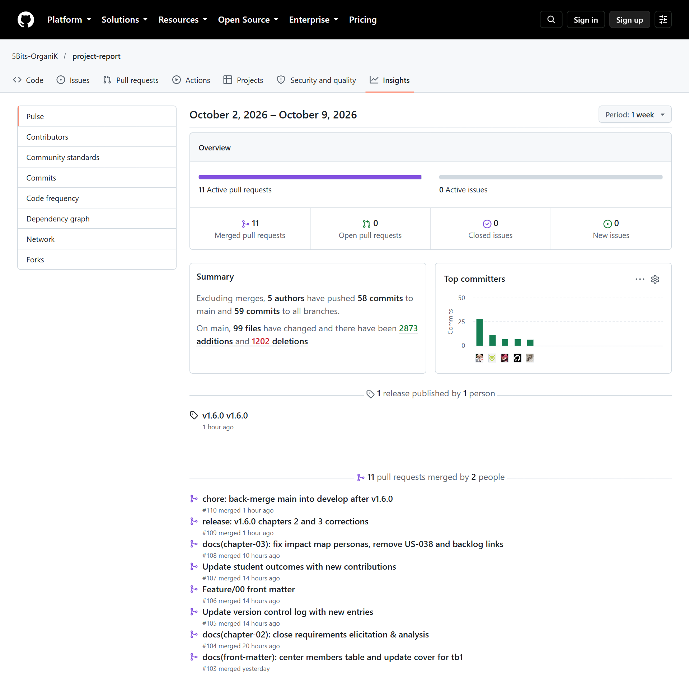

**Figura 5.** Estadísticas de actividad del repositorio durante TB1.  
**Fuente:** GitHub Insights.

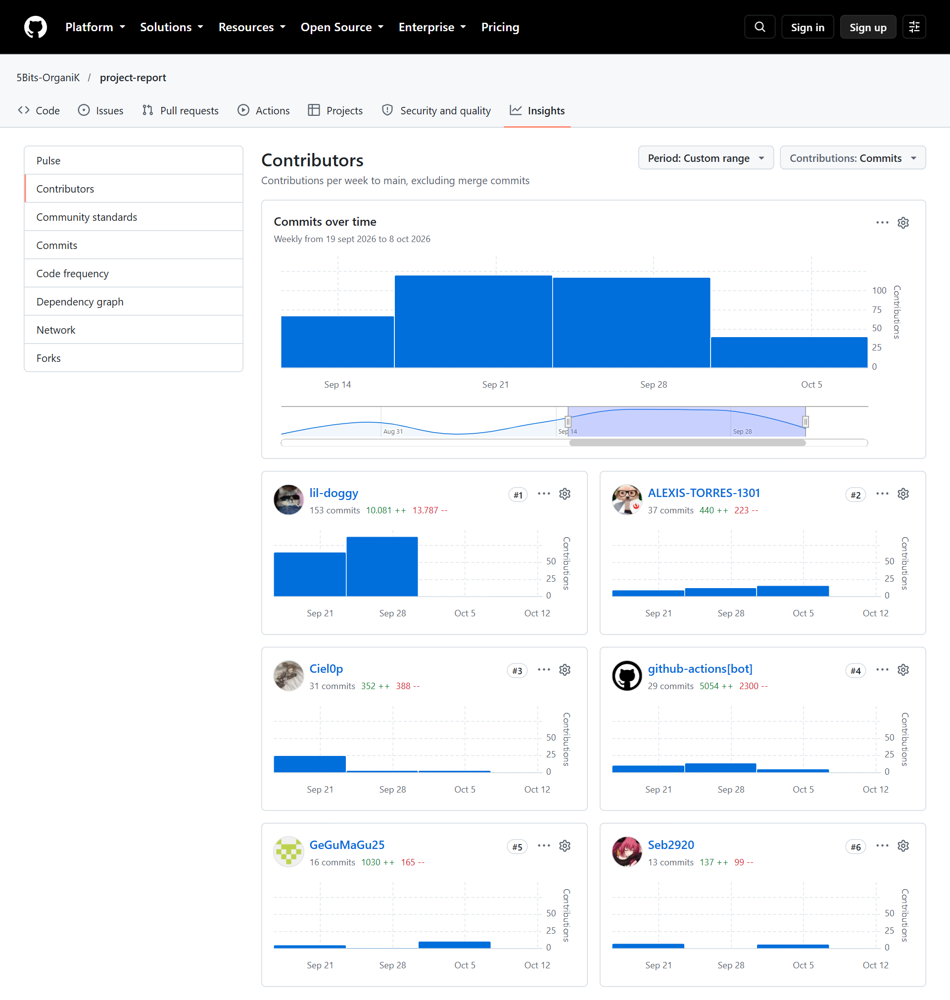

**Figura 6.** Contribuidores del repositorio durante TB1.  
**Fuente:** GitHub Insights.

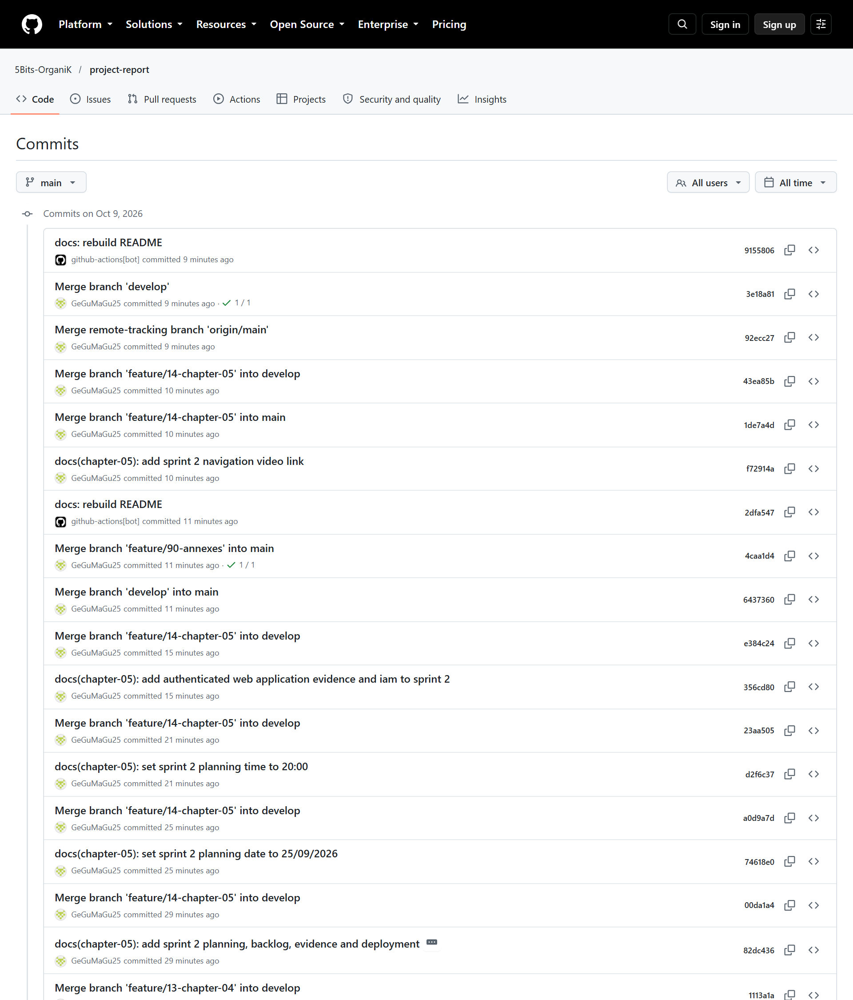

**Figura 7.** Registro de commits realizados durante TB1.  
**Fuente:** GitHub.

---

# Contenido

## Tabla de contenidos

- [Carátula](report/front-matter/01-title-page.md)
- [Registro de Versiones del Informe](report/front-matter/02-version-control-log.md)
- [Project Report Collaboration Insights](report/front-matter/03-collaboration-insights.md)
- [Contenido](report/front-matter/04-table-of-contents.md)
- [Student Outcome](report/front-matter/05-student-outcomes.md)

- [Capítulo I: Introducción](report/10-chapter-01.md)
  - [1.1. Startup Profile](report/10-chapter-01.md#11-startup-profile)
    - [1.1.1. Descripción de la Startup](report/10-chapter-01.md#111-descripción-de-la-startup)
    - [1.1.2. Perfiles de integrantes del equipo](report/10-chapter-01.md#112-perfiles-de-integrantes-del-equipo)
  - [1.2. Solution Profile](report/10-chapter-01.md#12-solution-profile)
    - [1.2.1 Antecedentes y problemática](report/10-chapter-01.md#121-antecedentes-y-problemática)
    - [1.2.2 Lean UX Process.](report/10-chapter-01.md#122-lean-ux-process)
      - [1.2.2.1. Lean UX Problem Statements.](report/10-chapter-01.md#1221-lean-ux-problem-statements)
      - [1.2.2.2. Lean UX Assumptions.](report/10-chapter-01.md#1222-lean-ux-assumptions)
      - [1.2.2.3. Lean UX Hypothesis Statements.](report/10-chapter-01.md#1223-lean-ux-hypothesis-statements)
      - [1.2.2.4. Lean UX Canvas.](report/10-chapter-01.md#1224-lean-ux-canvas)
  - [1.3. Segmentos objetivo.](report/10-chapter-01.md#13-segmentos-objetivo)

- [Capítulo II: Requirements Elicitation & Analysis](report/11-chapter-02.md)
  - [2.1. Competidores.](report/11-chapter-02.md#21-competidores)
    - [2.1.1. Análisis competitivo.](report/11-chapter-02.md#211-análisis-competitivo)
    - [2.1.2. Estrategias y tácticas frente a competidores.](report/11-chapter-02.md#212-estrategias-y-tácticas-frente-a-competidores)
  - [2.2. Entrevistas.](report/11-chapter-02.md#22-entrevistas)
    - [2.2.1. Diseño de entrevistas.](report/11-chapter-02.md#221-diseño-de-entrevistas)
    - [2.2.2. Registro de entrevistas.](report/11-chapter-02.md#222-registro-de-entrevistas)
    - [2.2.3. Análisis de entrevistas.](report/11-chapter-02.md#223-análisis-de-entrevistas)
  - [2.3. Needfinding.](report/11-chapter-02.md#23-needfinding)
    - [2.3.1. User Personas.](report/11-chapter-02.md#231-user-personas)
    - [2.3.2. User Task Matrix.](report/11-chapter-02.md#232-user-task-matrix)
    - [2.3.3. User Journey Mapping.](report/11-chapter-02.md#233-user-journey-mapping)
    - [2.3.4. Empathy Mapping.](report/11-chapter-02.md#234-empathy-mapping)
  - [2.4. Big Picture Event Storming.](report/11-chapter-02.md#24-big-picture-event-storming)
  - [2.5. Ubiquitous Language.](report/11-chapter-02.md#25-ubiquitous-language)

- [Capítulo III: Requirements Specification](report/12-chapter-03.md)
  - [3.1. User Stories.](report/12-chapter-03.md#31-user-stories)
  - [3.2. Impact Mapping.](report/12-chapter-03.md#32-impact-mapping)
  - [3.3. Product Backlog.](report/12-chapter-03.md#33-product-backlog)

- [Capítulo IV: Product Design](report/13-chapter-04.md)
  - [4.1. Style Guidelines.](report/13-chapter-04.md#41-style-guidelines)
    - [4.1.1. General Style Guidelines.](report/13-chapter-04.md#411-general-style-guidelines)
    - [4.1.2. Web Style Guidelines.](report/13-chapter-04.md#412-web-style-guidelines)
  - [4.2. Information Architecture.](report/13-chapter-04.md#42-information-architecture)
    - [4.2.1. Organization Systems.](report/13-chapter-04.md#421-organization-systems)
    - [4.2.2. Labeling Systems.](report/13-chapter-04.md#422-labeling-systems)
    - [4.2.3. SEO Tags and Meta Tags](report/13-chapter-04.md#423-seo-tags-and-meta-tags)
    - [4.2.4. Searching Systems.](report/13-chapter-04.md#424-searching-systems)
    - [4.2.5. Navigation Systems.](report/13-chapter-04.md#425-navigation-systems)
  - [4.3. Landing Page UI Design.](report/13-chapter-04.md#43-landing-page-ui-design)
    - [4.3.1. Landing Page Wireframe.](report/13-chapter-04.md#431-landing-page-wireframe)
    - [4.3.2. Landing Page Mock-up.](report/13-chapter-04.md#432-landing-page-mock-up)
  - [4.4. Web Applications UX/UI Design.](report/13-chapter-04.md#44-web-applications-uxui-design)
    - [4.4.1. Web Applications Wireframes.](report/13-chapter-04.md#441-web-applications-wireframes)
    - [4.4.2. Web Applications Wireflow Diagrams.](report/13-chapter-04.md#442-web-applications-wireflow-diagrams)
    - [4.4.2. Web Applications Mock-ups.](report/13-chapter-04.md#442-web-applications-mock-ups)
    - [4.4.3. Web Applications User Flow Diagrams.](report/13-chapter-04.md#443-web-applications-user-flow-diagrams)
  - [4.5. Web Applications Prototyping.](report/13-chapter-04.md#45-web-applications-prototyping)
  - [4.6. Domain-Driven Software Architecture.](report/13-chapter-04.md#46-domain-driven-software-architecture)
    - [4.6.1. Design-Level Event Storming.](report/13-chapter-04.md#461-design-level-event-storming)
    - [4.6.2. Software Architecture Context Diagram.](report/13-chapter-04.md#462-software-architecture-context-diagram)
    - [4.6.3. Software Architecture Container Diagrams.](report/13-chapter-04.md#463-software-architecture-container-diagrams)
    - [4.6.4. Software Architecture Components Diagrams.](report/13-chapter-04.md#464-software-architecture-components-diagrams)
  - [4.7. Software Object-Oriented Design.](report/13-chapter-04.md#47-software-object-oriented-design)
    - [4.7.1. Class Diagrams.](report/13-chapter-04.md#471-class-diagrams)
  - [4.8. Database Design.](report/13-chapter-04.md#48-database-design)
    - [4.8.1. Database Diagrams.](report/13-chapter-04.md#481-database-diagrams)

- [Capítulo V: Product Implementation, Validation & Deployment](report/14-chapter-05.md)
  - [5.1. Software Configuration Management.](report/14-chapter-05.md#51-software-configuration-management)
    - [5.1.1. Software Development Environment Configuration.](report/14-chapter-05.md#511-software-development-environment-configuration)
    - [5.1.2. Source Code Management.](report/14-chapter-05.md#512-source-code-management)
    - [5.1.3. Source Code Style Guide & Conventions.](report/14-chapter-05.md#513-source-code-style-guide--conventions)
    - [5.1.4. Software Deployment Configuration.](report/14-chapter-05.md#514-software-deployment-configuration)
  - [5.2. Landing Page, Services & Applications Implementation.](report/14-chapter-05.md#52-landing-page-services--applications-implementation)
    - [5.2.1. Sprint 1](report/14-chapter-05.md#521-sprint-1)
      - [5.2.1.1. Sprint Planning 1.](report/14-chapter-05.md#5211-sprint-planning-1)
      - [5.2.1.2. Aspect Leaders and Collaborators.](report/14-chapter-05.md#5212-aspect-leaders-and-collaborators)
      - [5.2.1.3. Sprint Backlog 1.](report/14-chapter-05.md#5213-sprint-backlog-1)
      - [5.2.1.4. Development Evidence for Sprint Review.](report/14-chapter-05.md#5214-development-evidence-for-sprint-review)
      - [5.2.1.5. Execution Evidence for Sprint Review.](report/14-chapter-05.md#5215-execution-evidence-for-sprint-review)
      - [5.2.1.6. Services Documentation Evidence for Sprint Review.](report/14-chapter-05.md#5216-services-documentation-evidence-for-sprint-review)
      - [5.2.1.7. Software Deployment Evidence for Sprint Review.](report/14-chapter-05.md#5217-software-deployment-evidence-for-sprint-review)
      - [5.2.1.8. Team Collaboration Insights during Sprint.](report/14-chapter-05.md#5218-team-collaboration-insights-during-sprint)
- [Conclusiones](report/98-conclusions.md)
- [Bibliografía](report/99-bibliography.md)
- [Anexos](report/annexes/90-annex-a-raw-data.md)

---

# Student Outcome
El curso contribuye al cumplimiento del Student Outcome ABET:

**ABET – EAC - Student Outcome 3**  
**Criterio:** Capacidad de comunicarse efectivamente con un rango de audiencias.

En el siguiente cuadro se describen las acciones realizadas y las conclusiones del equipo, que permiten sustentar el logro del ABET – EAC - Student Outcome 3.

---

## Tabla de Student Outcome

| Criterio específico | Acciones realizadas | Conclusiones |
|:---|:---|:---|
| Comunica oralmente con efectividad a diferentes rangos de audiencia. | **Atencio Cristobal, Cielo Valentina** **AV1:** Participó en el desarrollo de los capítulos y artefactos asignados del Project Report, colaborando en las actividades correspondientes al Sprint 1. **TB1:** Expuso y validó con los integrantes los criterios de aceptación incorporados a las user stories, y sustentó en la exposición la corrección de los artefactos observados en AV1.  **Cáceres Pizarro, Albino Florencio** **AV1:** Coordinó la organización del equipo, creación del repositorio y distribución de actividades. Participó activamente en el desarrollo, revisión e integración de los capítulos y artefactos del Project Report, apoyando en la elaboración de entregables, resolución de inconvenientes y seguimiento de las actividades correspondientes al Sprint 1. **TB1:** Coordinó las reuniones de revisión post-AV1, explicó al equipo las observaciones de la rúbrica y presentó la arquitectura por bounded contexts de la Web Application en Angular.  **Olivares Lao, Gustavo Alonso** **AV1:** Participó en el desarrollo de los capítulos y artefactos asignados, colaborando con el equipo en las actividades correspondientes al Sprint 1. **TB1:** [COMPLETAR: qué expuso o presentó en TB1]  **Quispe Almonacid, Andre Sebastian** **AV1:** Participó en el desarrollo de los capítulos y artefactos asignados del Project Report, colaborando en las actividades correspondientes al Sprint 1. **TB1:** [COMPLETAR: qué expuso o presentó en TB1]  **Torres Huaman, Alexis Calin** **AV1:** Participó en el desarrollo de los artefactos asignados y colaboró en la planificación y organización de las actividades del Sprint 1. **TB1:** Presentó al equipo los hallazgos del análisis de entrevistas por segmento y lideró la sesión de Big Picture EventStorming, explicando los eventos del dominio a los integrantes. | **AV1:** El equipo comunicó oralmente el avance del proyecto al organizar y sustentar los artefactos desarrollados para el Sprint 1, explicando el problema, la propuesta de solución, los segmentos objetivo, los requisitos, el diseño del producto y las evidencias de implementación de la landing page ante una audiencia académica.  **TB1:** El equipo comunicó oralmente las correcciones realizadas sobre los artefactos de AV1 y la primera versión de la Web Application, ajustando el nivel de detalle técnico según la audiencia: explicación de flujos de usuario para perfiles de negocio y de bounded contexts para la audiencia técnica. |
| Comunica por escrito con efectividad a diferentes rangos de audiencia. | **Atencio Cristobal, Cielo Valentina** **AV1:** Cumplió con las actividades asignadas para el desarrollo de los capítulos, artefactos y evidencias correspondientes al proyecto. **TB1:** Redactó criterios de aceptación en formato Gherkin para las user stories del Capítulo III y depuró la sección TO-BE Scenario Mapping, que no correspondía a la estructura del informe. Corrigió términos según el Anexo E y actualizó el registro de versiones, Collaboration Insights y anexos para TB1.  **Cáceres Pizarro, Albino Florencio** **AV1:** Participó en la planificación, distribución y seguimiento de las actividades del equipo, colaborando de manera transversal en el desarrollo y revisión de los capítulos, artefactos y evidencias del proyecto. Asimismo, apoyó a los integrantes del equipo en la organización y cumplimiento de las tareas correspondientes al Sprint 1. **TB1:** Redactó la revisión de Lean UX assumptions, el análisis FODA, el Impact Mapping por segmento y la justificación del Product Backlog, y documentó la Web Application con README, CHANGELOG y CONTRIBUTING.  **Olivares Lao, Gustavo Alonso** **AV1:** Cumplió con las actividades asignadas para el desarrollo de los capítulos y artefactos del proyecto, coordinando sus avances con el equipo. **TB1:** [COMPLETAR: qué redactó en TB1]  **Quispe Almonacid, Andre Sebastian** **AV1:** Cumplió con las actividades asignadas para el desarrollo de los capítulos, artefactos y evidencias correspondientes al proyecto. **TB1:** [COMPLETAR: qué redactó en TB1]  **Torres Huaman, Alexis Calin** **AV1:** Colaboró en la organización de las actividades del equipo y en la planificación de las tareas correspondientes al Sprint 1. **TB1:** Reescribió el Capítulo II: registro y análisis de entrevistas, User Personas, User Task Matrix, As-Is Journey Maps, Empathy Maps y Ubiquitous Language en inglés; además actualizó el Problem Statement y los Hypothesis Statements. | **AV1:** El equipo comunicó por escrito el proceso de ingeniería desarrollado mediante el Project Report, documentando en Markdown la carátula, el registro de versiones, los capítulos I al V, los artefactos de análisis, requisitos, diseño, configuración, evidencias del Sprint 1, conclusiones, bibliografía y anexos de manera organizada para docentes, compañeros y lectores técnicos.  **TB1:** El equipo mejoró la comunicación escrita incorporando la retroalimentación de AV1, corrigiendo términos según las convenciones del curso, aplicando Gherkin en los criterios de aceptación y documentando el Sprint 2 con evidencias verificables en GitHub. |

---

# Capítulo I: Introducción

## 1.1. Startup Profile

### 1.1.1. Descripción de la Startup

5bits es una startup tecnológica enfocada en el desarrollo de soluciones digitales para mejorar la gestión logística, el abastecimiento y la conservación de productos orgánicos. La startup busca contribuir a la transformación digital de los procesos relacionados con la comercialización y distribución de productos orgánicos, promoviendo una gestión más eficiente y sostenible.

Su enfoque se encuentra dirigido principalmente a administradores de minimarkets y proveedores de productos orgánicos, considerando las necesidades y desafíos que ambos segmentos enfrentan dentro de la cadena de abastecimiento. De esta manera, 5bits busca generar valor mediante el uso de tecnologías digitales que faciliten la gestión de información y la coordinación entre los diferentes actores involucrados.

La startup orienta sus esfuerzos hacia la mejora de procesos relacionados con el control de inventarios, abastecimiento, trazabilidad, conservación y gestión de productos orgánicos, buscando contribuir a una cadena de suministro más organizada, eficiente y transparente.

**Misión:** Facilitar la transformación digital de la gestión logística, el abastecimiento y la conservación de productos orgánicos, contribuyendo a que minimarkets y proveedores desarrollen operaciones más eficientes, organizadas y sostenibles.

**Visión:** Convertirse en una startup tecnológica de referencia en la transformación digital de la cadena de abastecimiento de productos orgánicos, promoviendo una gestión más eficiente, transparente y sostenible.

**Valores:** Eficiencia, trazabilidad, sostenibilidad, transparencia, innovación y orientación al usuario.

### 1.1.2. Perfiles de integrantes del equipo

| Imagen | Apellidos y nombres | Código | Carrera | Perfil |
|:---:|:---|:---:|:---|:---|
|  | **Cáceres Pizarro, Albino Florencio** | U201923820 | Ingeniería de Software | Me considero una persona responsable y proactiva que le gusta trabajar en equipo. Además, siempre estoy abierto a ayudar, en lo posible, a cualquier integrante del equipo. Además, busco adaptarme rápidamente a los diversos retos que se presentan en el ciclo. |
|  | **Atencio Cristobal, Cielo Valentina** | U202424216 | Ingeniería de Software | Me considero responsable y creativa. He participado en proyectos de videojuegos, donde también aplico mis habilidades en dibujo digital y diseño. Mi meta es crecer en el campo tecnológico y desarrollarme como futura profesional. |
|  | **Olivares Lao, Gustavo Alonso** | U202216448 | Ingeniería de Software | Estudiante de Ingeniería de Software (8vo ciclo, UPC) y Desarrollador Front-end Junior. Especializado en React, JavaScript y Python, con un fuerte enfoque en análisis de datos e integración de inteligencia artificial. Busco unirme a un equipo colaborativo para optimizar procesos, aportar soluciones y continuar mi crecimiento profesional. |
|  | **Quispe Almonacid, Andre Sebastian** | U201815005 | Ingeniería de Software | Me considero una persona analítica, constante y apasionada por la tecnología. Tengo un fuerte interés en la gestión de bases de datos, la estructura de los sistemas y el desarrollo de software. Disfruto entendiendo cómo funcionan las cosas desde la raíz y transformando la lógica en soluciones limpias y eficientes. Mi meta es seguir creciendo en el campo tecnológico y consolidarme como una profesional capaz de conectar bases de datos sólidas con el desarrollo moderno.|
|  | **Torres Huaman, Alexis Calin** | U20241G152 | Ingeniería de Software | Estudiante de Ingeniería de Software. Me considero una persona comprometida, analítica y apasionada por la resolución de problemas mediante el uso de la tecnología. Destaco por mi habilidad para trabajar en equipo, investigar nuevas herramientas y proponer ideas innovadoras que optimicen el desarrollo de software dentro del proyecto. |

## 1.2. Solution Profile

Nuestra solución OrganiK, es una plataforma web para la gestión de inventarios, abastecimiento y monitoreo de productos orgánicos, que conecta a administradores de minimarkets y proveedores mediante un ecosistema digital centralizado.

Para los administradores de minimarkets, permite gestionar productos, inventario, lotes, vencimientos, ubicaciones, mermas y donaciones, además de monitorear temperatura y humedad para detectar posibles riesgos de conservación.

Para los proveedores, permite gestionar productos, disponibilidad y lotes, así como crear y consultar pedidos de abastecimiento dirigidos a los minimarkets. Los proveedores no pueden modificar directamente el inventario.

Los pedidos generados por los proveedores son revisados por el administrador, quien puede aceptarlos o rechazarlos. Si el pedido es aceptado, se registra la operación y se actualiza el inventario; si es rechazado, el inventario permanece sin cambios.

La plataforma integra inventario, abastecimiento, trazabilidad y monitoreo IoT. Durante la implementación, los datos de los sensores podrán ser simulados para validar los flujos de monitoreo y alertas sin depender de dispositivos físicos.

De esta manera, OrganiK busca mejorar la gestión y abastecimiento de productos orgánicos mediante información centralizada y permisos diferenciados, bajo el principio de que **el proveedor puede iniciar una operación de abastecimiento, pero solamente el administrador del minimarket puede modificar su inventario**.

**Propuesta de valor por segmento:**

| Segmento | Propuesta de valor | Necesidad atendida (entrevistas) |
|:---|:---|:---|
| **Administrador de minimarket** | "Detecta a tiempo qué lotes están por vencer o fuera de temperatura y decide qué entra a tu inventario, todo en un solo lugar." | Revisión manual de vencimientos y vitrinas, mermas no detectadas, stock desactualizado (entrevistas 1, 2 y 3). |
| **Proveedor de productos orgánicos** | "Publica tu catálogo y disponibilidad una vez y sigue cada pedido sin transcribir chats ni recibir llamadas de confirmación." | Pedidos transcritos desde WhatsApp con errores, disponibilidad desactualizada, llamadas para confirmar despachos (entrevistas 4, 5 y 6). |

**Características diferenciales frente a la competencia:** la siguiente tabla resume las capacidades declaradas en las páginas oficiales de los competidores revisados en 2.1 (consulta del 1 de octubre de 2026). Un "No declarado" indica que la función no aparece en la información pública, no que se haya comprobado su inexistencia.

| Capacidad | OrganiK | CasaMarket | limaPOS | Spry Sales |
|:---|:---:|:---:|:---:|:---:|
| Inventario y stock | Sí | Sí | Sí | Sí |
| Lotes y vencimientos | Sí | No declarado | Sí | Sí |
| Alertas de conservación (temperatura y humedad por área) | **Sí** | No declarado | No declarado | No declarado |
| Pedido propuesto por el proveedor y aprobado por el minimarket antes de afectar el inventario | **Sí** | No declarado | No declarado | No declarado |
| Experiencia diferenciada para minimarket y proveedor en la misma plataforma | **Sí** | No declarado | No declarado | No declarado |
| Especialización en productos orgánicos perecibles | **Sí** | No | No | No |
| Punto de venta y facturación electrónica | No (fuera de alcance) | Sí | Sí | Sí |

OrganiK no compite como punto de venta: se posiciona como **complemento especializado** del POS que el minimarket ya usa, enfocado en la conservación de perecibles y en la coordinación con el proveedor. Esta decisión evita competir por cantidad de funcionalidades con plataformas consolidadas (ver estrategias en 2.1.2).

### 1.2.1 Antecedentes y problemática

El sistema alimentario peruano enfrenta importantes pérdidas de productos a lo largo de su cadena de suministro. Se estima que en el Perú se pierden aproximadamente 12,8 millones de toneladas de alimentos al año, equivalente al 47,6% de la oferta anual de alimentos. Dentro de estas pérdidas, una proporción importante corresponde a frutas y hortalizas, productos particularmente sensibles a factores como la temperatura, humedad, manipulación y tiempo de almacenamiento (OECD, 2025; Bedoya-Perales & Dal’ Magro, 2021). Esta situación evidencia la necesidad de mejorar los mecanismos de gestión y conservación de productos perecibles.

En los minimarkets, esta problemática se relaciona con las dificultades para mantener un control adecuado sobre el inventario, lotes, fechas de vencimiento y condiciones de almacenamiento. La utilización de registros manuales, hojas de cálculo y herramientas independientes puede dificultar la identificación oportuna de productos próximos a vencer, niveles bajos de stock o condiciones ambientales inadecuadas, incrementando el riesgo de deterioro, desperdicio y desabastecimiento. Además, estudios aplicados a tiendas de conveniencia en Lima evidencian que la optimización del inventario puede mejorar indicadores operativos como la reposición, el nivel de servicio, la reducción de quiebres de stock y la rentabilidad del negocio (Zavaleta-Zarate et al., 2026).

Asimismo, el abastecimiento requiere una coordinación constante entre los administradores de minimarkets y los proveedores. Mientras los administradores necesitan gestionar sus necesidades de reposición, los proveedores requieren controlar la disponibilidad de sus productos y generar pedidos dirigidos a los establecimientos. La ausencia de un flujo centralizado puede generar errores, retrasos y poca trazabilidad de las operaciones. En este contexto, **OrganiK** propone una plataforma especializada que integra la gestión de inventarios, lotes, vencimientos, abastecimiento y monitoreo de condiciones de almacenamiento, permitiendo que los proveedores generen pedidos y que los administradores mantengan el control sobre su aceptación y actualización del inventario.

**Objetivos de la solución:**

- Centralizar la gestión de productos, inventario, lotes, vencimientos y condiciones de almacenamiento de productos orgánicos.
- Facilitar la coordinación de abastecimiento entre administradores de minimarkets y proveedores mediante un flujo de pedidos controlado.
- Anticipar riesgos operativos asociados a stock bajo, vencimientos próximos y condiciones ambientales inadecuadas.
- Mejorar la trazabilidad de las operaciones de inventario y abastecimiento.

**Técnica "The 5W's y 2H's" aplicada al problema:**

| The 5W's y 2H's | Pregunta | Descripción |
|:---|:---|:---|
| **Who** | ¿Quiénes están involucrados? | Administradores de minimarkets responsables de gestionar inventarios, conservación y abastecimiento, y proveedores encargados de gestionar la disponibilidad de productos y generar pedidos de abastecimiento. |
| **What** | ¿Cuál es el problema? | Dificultad para gestionar de manera integrada inventarios, niveles de stock, lotes, vencimientos, condiciones de almacenamiento y operaciones de abastecimiento de productos orgánicos. |
| **Where** | ¿Dónde ocurre? | En los procesos de almacenamiento, gestión de inventarios y abastecimiento de productos orgánicos en minimarkets, así como en la gestión de productos, disponibilidad y pedidos de los proveedores. |
| **When** | ¿Cuándo sucede? | Durante el almacenamiento, control de inventarios, seguimiento de lotes y vencimientos, identificación de necesidades de reposición, generación de pedidos y aceptación o rechazo de las operaciones de abastecimiento. |
| **Why** | ¿Por qué sucede? | Debido a la fragmentación de la información, el uso de procesos manuales y la ausencia de una plataforma especializada que integre inventario, abastecimiento y monitoreo de las condiciones de almacenamiento. |
| **How** | ¿Cómo se manifiesta? | Mediante dificultades para identificar productos con stock bajo, controlar lotes y vencimientos, detectar condiciones ambientales anómalas, consultar disponibilidad, generar pedidos y realizar seguimiento de las operaciones de abastecimiento. |
| **How Much** | ¿Cuánto impacto tiene? | En el Perú se pierden aproximadamente **12,8 millones de toneladas de alimentos al año**, equivalentes al **47,6% de la oferta anual de alimentos**. Además, alrededor del **44% de estas pérdidas corresponde a frutas y hortalizas**, productos especialmente sensibles a las condiciones de almacenamiento (OECD, 2025; Bedoya-Perales & Dal’ Magro, 2021). A nivel operativo, estas pérdidas pueden traducirse en productos deteriorados o vencidos, desabastecimiento y mayores costos de gestión. |

---

### 1.2.2 Lean UX Process.

#### 1.2.2.1. Lean UX Problem Statements.

En el mercado peruano, los administradores de minimarkets que comercializan productos orgánicos necesitan controlar inventarios, lotes, vencimientos y condiciones de almacenamiento para evitar mermas y reponer a tiempo. Las entrevistas muestran casos de uso combinado de POS, hojas de cálculo, libretas y mensajería; esa dispersión dificulta detectar productos en riesgo y conocer el stock disponible. Los proveedores, por su parte, necesitan mantener actualizados su catálogo, lotes y disponibilidad, y dar seguimiento a los pedidos dirigidos a los minimarkets. La coordinación mediante archivos y conversaciones separadas dificulta confirmar cantidades, cambios y estados de pedido. La magnitud de las pérdidas alimentarias en el Perú y los hallazgos de las entrevistas contextualizan el problema, sin representar una medición de merma específica de los minimarkets entrevistados.

Existen soluciones de gestión comercial e inventario para minimarkets. La oportunidad de 5bits es atender de forma integrada la conservación de productos orgánicos, la trazabilidad por lotes y la coordinación de pedidos entre ambos segmentos. Para el administrador, el problema es no identificar a tiempo vencimientos, condiciones de almacenamiento riesgosas y necesidades de reposición, y no mantener un control verificable sobre la entrada de productos a su inventario. Para el proveedor, es no contar con una vista compartida y actualizada de disponibilidad y estado de pedidos. OrganiK busca reducir estas dificultades mediante un flujo en el que el proveedor genera el pedido y el administrador lo acepta o rechaza antes de actualizar el inventario.

**Problem Statement (plantilla *Brand new initiative* de Lean UX, 3.ª edición):**

> El estado actual de la **gestión de inventario, conservación y abastecimiento de productos orgánicos perecibles en el Perú** se ha enfocado principalmente en **administradores de minimarkets y proveedores mayoristas que controlan stock, lotes y vencimientos con hojas de cálculo, libretas y sistemas POS básicos, y que coordinan pedidos por WhatsApp y llamadas**; en este flujo el 100 % de los administradores entrevistados revisa vencimientos y temperatura de forma manual y el 100 % de los proveedores entrevistados transcribe pedidos desde chats a Excel (ver 2.2.3).
>
> Lo que los productos y servicios existentes no logran resolver es **la integración, en un mismo flujo, de la conservación de productos orgánicos (temperatura, humedad y vencimiento por lote) con la coordinación de pedidos entre el minimarket y su proveedor**: las soluciones revisadas (CasaMarket, limaPOS y Spry Sales) cubren ventas, compras e inventario general, pero no alertan sobre condiciones de conservación ni permiten que el proveedor proponga un pedido que el minimarket acepte o rechace antes de que cambie su inventario.
>
> Nuestro producto atenderá esta brecha mediante **OrganiK, una plataforma web SaaS que centraliza productos, lotes, vencimientos y lecturas de conservación del minimarket, publica el catálogo y la disponibilidad del proveedor, y gestiona pedidos de abastecimiento con un flujo de aprobación en el que solo el administrador del minimarket modifica su inventario**.
>
> Nuestro enfoque inicial será **administradores de minimarkets independientes de productos orgánicos y frescos de Lima Metropolitana, y los proveedores (productores y distribuidoras) que los abastecen**.
>
> Sabremos que tenemos éxito cuando veamos que **(1) los administradores identifican los lotes en riesgo (próximos a vencer o fuera de rango de conservación) en menos de 2 minutos, frente a la revisión manual actual; (2) al menos el 80 % de los productos del minimarket piloto tiene lote y vencimiento registrados; (3) al menos el 70 % de los pedidos entre proveedor y minimarket piloto se crea y decide dentro de OrganiK, sin confirmación por WhatsApp; y (4) se reducen en 20 % las bajas por vencimiento o deterioro durante los tres primeros meses de piloto**.

**Restricciones que se aplican al problema:**

- Durante el ciclo académico, las lecturas de temperatura y humedad se **simulan**; la integración con sensores físicos queda fuera del alcance inicial.
- La solución se limita a una **experiencia web responsive** (Landing Page y Web Application) y un RESTful API propio; no incluye aplicaciones móviles nativas.
- OrganiK **no procesa pagos ni facturación electrónica**; los pedidos registran cantidades y decisiones, no transacciones monetarias.
- El proveedor **no puede modificar el inventario** del minimarket: solo propone pedidos; la decisión y la entrada de inventario corresponden al administrador.
- Los indicadores de éxito se medirán contra una línea base levantada en las pruebas con usuarios, porque las cifras nacionales de pérdida de alimentos contextualizan el problema pero no miden la merma de los minimarkets entrevistados.

**Elementos del Problem Statement:**

| Elemento | Descripción |
|:---|:---|
| **Domain** | Gestión de inventario, conservación y abastecimiento de productos orgánicos perecibles. |
| **Customer Segments** | Administradores de minimarkets de productos orgánicos y proveedores de productos orgánicos. |
| **Pain Points** | Pérdidas por deterioro o vencimiento; revisión manual de lotes, vencimientos y temperatura; información dispersa entre Excel, libretas y chats; disponibilidad desactualizada; pedidos transcritos con errores y sin estado consultable. |
| **Gap** | Las soluciones comerciales revisadas cubren inventario, compras y ventas, pero no integran la conservación de perecibles con un flujo de pedidos proveedor → minimarket con aprobación del administrador. |
| **Vision/Strategy** | Plataforma SaaS especializada que centraliza inventario, lotes, conservación y pedidos, con permisos diferenciados por segmento. |
| **Initial Segment** | Minimarkets independientes de productos orgánicos de Lima Metropolitana y sus proveedores directos. |

**Relación con el análisis 5W+2H:** el *Who* define los dos segmentos del enunciado; el *What* y el *How* se traducen en los pain points; el *Why* (fragmentación y procesos manuales) sustenta el gap; el *Where* y el *When* delimitan el segmento inicial y los momentos del flujo (almacenamiento, reposición, decisión de pedidos); y el *How Much* contextualiza la magnitud de las pérdidas que justifica medir la reducción de bajas.

---

#### 1.2.2.2. Lean UX Assumptions.

**Business Assumptions:**

1. Se considera que los administradores de minimarkets necesitan mejorar el control de sus productos orgánicos para reducir pérdidas asociadas al deterioro y vencimiento.

2. Se plantea que una plataforma centralizada puede mejorar la visibilidad sobre inventarios, niveles de stock, lotes, vencimientos y condiciones de almacenamiento.

3. Se considera que los proveedores necesitan una herramienta especializada para gestionar productos, disponibilidad, lotes y pedidos de abastecimiento dirigidos a diferentes minimarkets.

4. Se asume que la integración entre minimarkets y proveedores permitirá mejorar la eficiencia del proceso de abastecimiento.

5. Se considera que las alertas de temperatura y humedad permitirán identificar oportunamente condiciones que puedan afectar la conservación de los productos.

6. Se plantea que la centralización de los pedidos permitirá mejorar la trazabilidad de las operaciones de abastecimiento.

7. Se estima que un modelo SaaS puede facilitar el acceso de pequeñas y medianas empresas a las funcionalidades de la plataforma sin requerir infraestructura tecnológica propia.

8. Se considera que la principal diferenciación de la solución será integrar la gestión de inventarios, abastecimiento y monitoreo de las condiciones de almacenamiento de productos orgánicos.

9. Se asume que los datos de monitoreo IoT pueden ser simulados durante la etapa inicial para validar los flujos funcionales sin depender de dispositivos físicos.

10. Se asume que la plataforma podrá evolucionar posteriormente para incorporar sensores IoT reales y capacidades analíticas más avanzadas.

11. Se presume que uno de los principales riesgos de adopción será la resistencia de los usuarios a reemplazar procesos manuales y herramientas informales.

12. Se plantea que una interfaz sencilla y dashboards diferenciados permitirán reducir la complejidad para cada tipo de usuario.

13. Se considera que la viabilidad del producto dependerá de que los beneficios obtenidos mediante la reducción de pérdidas y mejora del abastecimiento sean percibidos como superiores al costo de la solución.

**Business Outcome Assumptions**

1. Reducir la cantidad de productos dados de baja como consecuencia de condiciones inadecuadas de almacenamiento o vencimiento.

2. Incrementar la trazabilidad de los productos, lotes y fechas de vencimiento gestionados por los minimarkets.

3. Reducir el tiempo necesario para identificar productos o lotes que puedan encontrarse en condiciones de riesgo.

4. Mejorar la capacidad de los administradores para anticipar necesidades de reposición mediante información sobre niveles de stock.

5. Mejorar la disponibilidad de información para la toma de decisiones relacionadas con el abastecimiento.

6. Incrementar la trazabilidad de los pedidos desde su creación por parte del proveedor hasta su aceptación o rechazo por parte del administrador.

Estos resultados se evaluarán, respectivamente, mediante la cantidad de productos dados de baja por vencimiento o deterioro; el porcentaje de productos con lote y vencimiento registrados; el tiempo para identificar productos en riesgo; el tiempo entre la detección de stock bajo y la decisión de reposición; la disponibilidad de información vigente sobre productos y pedidos; y el porcentaje de pedidos con estado e historial de decisiones consultables. Se compararán con una línea base levantada durante las pruebas con usuarios.

**User Assumptions**

1. Los administradores de minimarkets necesitan visualizar rápidamente el estado de su inventario y los productos próximos a vencer.

2. Los administradores de minimarkets necesitan identificar productos con niveles de stock que requieran reposición.

3. Los administradores de minimarkets valoran recibir alertas cuando las condiciones de almacenamiento puedan afectar determinados productos.

4. Los administradores de minimarkets necesitan consultar la disponibilidad de productos ofrecidos por proveedores conectados.

5. Los proveedores necesitan visualizar y gestionar sus productos, disponibilidad y lotes desde un único sistema.

6. Los proveedores requieren generar pedidos de abastecimiento dirigidos a los minimarkets y consultar el estado de sus operaciones.

7. Ambos segmentos necesitan consultar el estado de un pedido y mantener información actualizada sobre el proceso de abastecimiento.

**User Outcome Assumptions**

1. Los administradores de minimarkets tendrán mayor confianza en la información de su inventario al disponer de un registro centralizado de productos, stock, lotes y vencimientos.

2. Los administradores de minimarkets podrán identificar oportunamente productos con niveles de stock bajos y necesidades de reposición.

3. Los administradores de minimarkets podrán identificar condiciones ambientales anómalas que puedan representar un riesgo para los productos almacenados.

4. Los administradores de minimarkets podrán revisar los pedidos generados por proveedores y decidir si aceptarlos o rechazarlos antes de modificar su inventario.

5. Los proveedores podrán consultar sus productos y disponibilidad, generar pedidos de abastecimiento y realizar seguimiento de su estado.

6. Los usuarios experimentarán una reducción de la incertidumbre respecto al estado de los pedidos de abastecimiento.

7. Los administradores de ambos segmentos podrán tomar decisiones operativas con mayor rapidez al contar con información centralizada y actualizada.

Los resultados de usuario se comprobarán con tareas de consulta de inventario y vencimientos, detección de alertas, identificación de stock bajo, creación y revisión de pedidos, y consulta de su estado. Se observarán el tiempo de ejecución, la finalización de la tarea y los errores; las entrevistas y pruebas permitirán contrastar estos resultados con las prácticas actuales de cada segmento.

**Feature Assumptions**

1. Se considera que permitir registrar, consultar, buscar, filtrar y actualizar productos, cantidades, lotes y vencimientos facilitará el control centralizado del inventario del minimarket.

2. Se plantea que las alertas configurables sobre productos próximos a vencer y condiciones inadecuadas de temperatura o humedad permitirán identificar oportunamente productos en riesgo.

3. Se considera que visualizar registros de temperatura y humedad permitirá al administrador supervisar las condiciones de conservación de los productos.

4. Se plantea que permitir a los proveedores mantener actualizados sus productos, lotes y disponibilidad facilitará que los minimarkets consulten alternativas de abastecimiento desde la plataforma.

5. Se considera que permitir al administrador comunicar necesidades de reposición y al proveedor generar pedidos dirigidos al minimarket permitirá centralizar la coordinación del abastecimiento.

6. Se plantea que reservar al administrador la decisión de aceptar o rechazar pedidos, actualizando el inventario únicamente cuando se acepten, permitirá mantener el control y la trazabilidad de las entradas de productos.

7. Se considera que ofrecer dashboards diferenciados, indicadores, alertas e historial de operaciones permitirá a cada segmento consultar rápidamente el estado de sus actividades y tomar decisiones con información centralizada.

8. Se plantea que un sistema de autenticación, roles y permisos permitirá que administradores y proveedores accedan únicamente a las funcionalidades y datos correspondientes a su negocio.

---

#### 1.2.2.3. Lean UX Hypothesis Statements.

Siguiendo el enunciado, se redacta **un hypothesis statement por cada feature assumption** (8 en total), con la plantilla de Lean UX: *We believe we will achieve [business outcome] if [these personas] attain [this benefit/user outcome] with [this feature]*. En la versión en español: **"Creemos que lograremos [resultado de negocio] si [persona] obtiene [resultado de usuario] con [funcionalidad]"**. Cada hipótesis indica los assumptions de los que proviene (BA = Business Assumption, BOA = Business Outcome Assumption, UA = User Assumption, UOA = User Outcome Assumption, FA = Feature Assumption) y la señal con la que se comprobará.

| ID | Feature assumption | Business outcome | Persona | User outcome | Feature |
|:---:|:---|:---|:---|:---|:---|
| H1 | FA1 | Mayor trazabilidad de productos, lotes y vencimientos (BOA2) | Administrador de minimarket | Confía en un registro único de stock, lotes y vencimientos (UOA1) | Registro, búsqueda, filtro y actualización de inventario por lote |
| H2 | FA2 | Menos productos dados de baja por vencimiento o deterioro (BOA1, BOA3) | Administrador de minimarket | Se entera a tiempo de lotes próximos a vencer o fuera de rango (UOA3) | Alertas configurables de vencimiento y conservación |
| H3 | FA3 | Menor tiempo para detectar condiciones de riesgo (BOA3) | Administrador de minimarket | Supervisa temperatura y humedad sin revisar vitrinas físicamente (UOA3) | Panel de lecturas de temperatura y humedad por área (datos simulados en esta etapa) |
| H4 | FA4 | Más información vigente para decidir el abastecimiento (BOA5) | Proveedor de productos orgánicos | Mantiene su catálogo y disponibilidad en un solo lugar (UOA5) | Catálogo del proveedor con lotes y disponibilidad |
| H5 | FA5 | Reposición anticipada y pedidos centralizados (BOA4, BOA6) | Administrador y proveedor | Comparten la necesidad de reposición y el pedido sin transcribir chats (UOA2, UOA5) | Necesidades de reposición y creación de pedidos por el proveedor |
| H6 | FA6 | Trazabilidad de cada pedido desde su creación hasta su decisión (BOA6) | Administrador de minimarket | Decide qué entra a su inventario y conserva el control (UOA4, UOA6) | Aceptación o rechazo de pedidos con actualización única del inventario |
| H7 | FA7 | Decisiones operativas más rápidas y mayor adopción (BOA5, BA12) | Administrador y proveedor | Consulta el estado de su operación en segundos (UOA7) | Dashboards diferenciados con indicadores, alertas e historial |
| H8 | FA8 | Confianza de ambos segmentos para compartir información en la plataforma (BA3, BA4) | Administrador y proveedor | Accede solo a los datos y acciones de su negocio (UOA4) | Autenticación, roles y permisos por segmento |

**H1.** Creemos que lograremos **incrementar al 80 % el porcentaje de productos con lote y vencimiento registrados** si los **administradores de minimarket** obtienen **un registro único y confiable de su stock, lotes y vencimientos** con **el módulo de inventario que permite registrar, buscar, filtrar y actualizar productos por lote**. Lo comprobaremos con el porcentaje de productos con lote y vencimiento registrados y el tiempo para encontrar un producto crítico, comparado con la línea base de Excel y libreta.

**H2.** Creemos que lograremos **reducir en 20 % las bajas por vencimiento o deterioro** si los **administradores de minimarket** obtienen **aviso oportuno de los lotes próximos a vencer o expuestos a condiciones fuera de rango** con **alertas configurables de vencimiento y conservación**. En esta etapa lo comprobaremos con la tasa de alertas atendidas en pruebas con datos simulados; la reducción de bajas se medirá en el piloto.

**H3.** Creemos que lograremos **reducir el tiempo de detección de condiciones de riesgo a menos de 2 minutos** si los **administradores de minimarket** obtienen **visibilidad continua de la temperatura y la humedad de sus áreas de almacenamiento** con **un panel de lecturas por área con historial**. Lo comprobaremos con el tiempo que tarda el usuario en identificar un área fuera de rango durante la prueba de tareas.

**H4.** Creemos que lograremos **que el 90 % de las consultas de disponibilidad de los minimarkets piloto se resuelva sin llamar ni escribir al proveedor** si los **proveedores** obtienen **un único lugar donde mantener actualizados su catálogo, lotes y disponibilidad** con **el catálogo del proveedor**. Lo comprobaremos con la frecuencia de actualización del catálogo y el número de consultas de disponibilidad hechas fuera de la plataforma.

**H5.** Creemos que lograremos **que el 70 % de los pedidos entre proveedor y minimarket piloto se cree dentro de OrganiK** si **administradores y proveedores** obtienen **una forma de compartir la necesidad de reposición y convertirla en un pedido sin transcribir mensajes** con **necesidades de reposición y creación de pedidos por el proveedor**. Lo comprobaremos con el porcentaje de pedidos creados en la plataforma y los errores de cantidad reportados.

**H6.** Creemos que lograremos **que el 100 % de los pedidos tenga estado e historial de decisión consultables** si los **administradores de minimarket** obtienen **el control de qué productos ingresan a su inventario** con **la aceptación o el rechazo de pedidos que actualiza el inventario una sola vez al aceptar**. Lo comprobaremos verificando que cada decisión quede registrada con actor y fecha y que solo los pedidos aceptados modifiquen el stock.

**H7.** Creemos que lograremos **que el 60 % de los usuarios piloto ingrese a la plataforma al menos cinco días por semana** si **administradores y proveedores** obtienen **el estado de su operación en un solo vistazo** con **dashboards diferenciados con indicadores, alertas e historial**. Lo comprobaremos con la frecuencia de uso semanal y el tiempo de finalización de tareas de consulta.

**H8.** Creemos que lograremos **que ambos segmentos acepten registrar su información operativa en OrganiK (al menos 8 de cada 10 usuarios entrevistados en validación)** si **administradores y proveedores** obtienen **la seguridad de que solo ven y modifican los datos de su propio negocio** con **autenticación, roles y permisos por segmento**. Lo comprobaremos en las entrevistas de validación y con pruebas de acceso que intenten operaciones no permitidas.

La viabilidad del modelo SaaS (BA7 y BA13) no corresponde a una funcionalidad, por lo que se validará con las preguntas de disposición de pago de las entrevistas de validación y con los costos medidos en el piloto.

---
#### 1.2.2.4. Lean UX Canvas.

El Lean UX Canvas sintetiza la propuesta de valor para los dos segmentos y conecta el problema de negocio, los usuarios, los beneficios, las ideas de solución y las hipótesis H1-H8 de la sección anterior.

<table>
 <tr>
 <td valign="top">
 <strong>Business problem</strong>
   
 El administrador de minimarket consulta existencias, lotes y conservación en herramientas dispersas mientras necesita detectar riesgos y decidir una reposición sin perder el control del inventario.
   
 El proveedor mantiene su oferta y coordina pedidos por canales separados, lo que dificulta confirmar disponibilidad, cantidades y estado de cada operación.
   
 El análisis competitivo muestra herramientas de inventario y compras; la oportunidad por comprobar es integrar conservación de perecibles, trazabilidad por lotes y pedidos entre ambos segmentos con aprobación del administrador.
 </td>
 <td rowspan="2" valign="top">
 <strong>Solution ideas</strong>
   
 - Registro de stock, lotes y vencimientos para el administrador (H1)
   
 - Alertas de vencimiento y conservación, con datos inicialmente simulados (H2)
   
 - Panel de temperatura y humedad por área (H3)
   
 - Catálogo del proveedor con lotes y disponibilidad (H4)
   
 - Necesidades de reposición y pedidos creados por el proveedor (H5)
   
 - Aceptación o rechazo por el administrador antes de actualizar inventario (H6)
   
 - Dashboards e historial por segmento (H7)
   
 - Autenticación, roles y permisos por negocio (H8)
 </td>
 <td valign="top">
 <strong>Business Outcomes</strong>
   
 - Bajas por deterioro o vencimiento: comparar su cantidad con una línea base operativa futura
   
 - Trazabilidad de productos: medir el porcentaje con lote y vencimiento registrados
   
 - Reposición: medir el tiempo entre detección de stock bajo y decisión
   
 - Pedidos: medir el porcentaje con estado e historial de decisiones consultables
   
 </td>
 </tr>
 <tr>
 <td valign="top">
 <strong>Users and customers</strong>
   
 - Administrador de minimarket: Persona que decide sobre inventario, conservación y reposición.
  
 - Proveedor de productos orgánicos: Persona que mantiene oferta y coordina pedidos.
 </td>
 <td valign="top">
 <strong>User benefits</strong>
   
 - Administrador: localizar existencias, lotes, vencimientos y condiciones de riesgo al revisar productos y conservación.
   
 - Administrador: decidir reposición y aceptar o rechazar un pedido antes de registrar la entrada al inventario.
   
 - Proveedor: actualizar oferta y disponibilidad y comprobar el estado de cada pedido dirigido al minimarket.
   
 - Ambos: reducir incertidumbre al consultar un historial compartido de la operación.
 </td>
 </tr>
 <tr>
 <td valign="top">
 <strong>Hypotheses</strong>
   
 - H1: Más productos con lote y vencimiento registrados si el administrador tiene un registro único de inventario por lote.
   
 - H2: Menos bajas por vencimiento o deterioro si el administrador recibe alertas configurables de vencimiento y conservación.
   
 - H3: Detección de condiciones de riesgo en menos de 2 minutos con un panel de temperatura y humedad por área.
   
 - H4: Consultas de disponibilidad resueltas sin llamadas si el proveedor mantiene su catálogo, lotes y disponibilidad en OrganiK.
   
 - H5: Pedidos creados dentro de la plataforma si ambos segmentos comparten necesidades de reposición y pedidos.
   
 - H6: Pedidos con estado e historial consultables si solo el administrador acepta o rechaza y el inventario cambia una sola vez.
   
 - H7: Uso frecuente de la plataforma con dashboards diferenciados por segmento.
   
 - H8: Confianza para compartir información con autenticación, roles y permisos por negocio.
 </td>
 <td valign="top">
 <strong>What’s the most important thing we need to learn first?</strong>
   
 - ¿Los administradores podrán identificar rápidamente productos con stock bajo, próximos a vencer o con condiciones de conservación riesgosas mediante un dashboard centralizado?
   
 - ¿Los proveedores podrán consultar necesidades de reposición, revisar su disponibilidad y crear pedidos dirigidos a minimarkets sin depender de canales externos?
   
 - ¿Los administradores comprenderán y confiarán en el flujo de revisión, aceptación o rechazo de pedidos antes de modificar el inventario?
   
 - ¿Las alertas de vencimiento, stock bajo y conservación generarán acciones concretas o serán ignoradas?
   
 - ¿La separación de funciones entre administrador y proveedor será suficientemente clara para evitar confusión sobre quién puede modificar inventario y quién puede generar o aprobar pedidos?
   
 ¿El valor percibido de centralizar inventario, conservación y abastecimiento será suficiente para que minimarkets y proveedores consideren adoptar OrganiK? 
 </td>
 <td valign="top">
 <strong>What’s the least amount of work we need to do to learn the next most important thing?</strong>
   
 - Crear un prototipo navegable del dashboard con datos ficticios pero realistas de inventario, lotes, vencimientos, temperatura, humedad y alertas.
   
 - Probar el flujo principal de abastecimiento: identificar una necesidad de reposición, consultar disponibilidad, crear un pedido como proveedor y revisarlo como administrador.
   
 - Simular pedidos pendientes para comprobar si el administrador entiende cómo aceptar o rechazar una propuesta y qué efecto tiene cada decisión sobre el inventario.
   
 - Mostrar alertas simuladas de stock bajo, vencimiento y conservación para observar si el usuario reconoce su prioridad y realiza una acción adecuada.
   
 - Probar perfiles diferenciados de administrador y proveedor para verificar si cada usuario comprende qué acciones puede realizar según su rol.
   
 - Medir finalización de tareas, tiempo, errores, necesidad de asistencia y comprensión del estado de cada operación.
   
 - Realizar entrevistas breves después de las pruebas para evaluar confianza, facilidad de uso, utilidad percibida, intención de adopción y disposición de pago.
 </td>
 </tr>
</table>

---

## 1.3. Segmentos objetivo.

La solución está dirigida a **dos segmentos objetivos principales** que participan directamente en la cadena de abastecimiento de productos orgánicos: **administradores de minimarkets y proveedores**.

Estos segmentos presentan necesidades de negocio diferentes. Por ello, la plataforma utiliza una infraestructura tecnológica compartida, pero ofrece dashboards, funcionalidades y permisos específicos para cada segmento.

Los roles operativos que puedan existir dentro de cada empresa forman parte de la estructura interna de cada segmento y no constituyen segmentos objetivos independientes.

### 1.3.1. Administradores de Minimarkets

| Dimensión | Detalle del perfil |
|---|---|
| **Perfil Demográfico** | Propietarios, administradores o responsables de pequeños y medianos minimarkets dedicados a la comercialización de productos orgánicos y alimentos frescos. Son responsables de supervisar las operaciones del establecimiento y tomar decisiones relacionadas con inventario, conservación y abastecimiento. |
| **Perfil Geográfico** | Negocios ubicados principalmente en zonas urbanas con demanda de productos orgánicos y necesidad de mantener un abastecimiento constante. El segmento inicial puede concentrarse en Lima Metropolitana. |
| **Perfil Psicográfico** | Personas orientadas a mantener la calidad y disponibilidad de sus productos, reducir pérdidas y mejorar la eficiencia de sus operaciones. Valoran soluciones sencillas que permitan controlar el inventario, anticipar necesidades de reposición y tomar decisiones basadas en información actualizada. |
| **Puntos de Dolor** | Pérdidas ocasionadas por deterioro o vencimiento, dificultad para controlar niveles de stock, lotes y fechas de vencimiento, falta de visibilidad sobre las condiciones de almacenamiento, situaciones de desabastecimiento y dificultad para gestionar y validar pedidos de abastecimiento provenientes de proveedores. |
| **Uso de Tecnología** | Utilizan herramientas digitales para administrar ventas, inventarios y comunicación con proveedores, aunque pueden depender de hojas de cálculo, aplicaciones de mensajería y sistemas independientes que no integran toda la información operativa. |

### 1.3.2. Proveedores de Productos Orgánicos

| Dimensión | Detalle del perfil |
|---|---|
| **Perfil Demográfico** | Empresas, productores, distribuidores o comerciantes mayoristas de productos orgánicos que abastecen a minimarkets. Sus representantes son responsables de gestionar el catálogo, productos, disponibilidad, lotes y pedidos de abastecimiento. |
| **Perfil Geográfico** | Proveedores ubicados en zonas productoras, centros de distribución o áreas comerciales que atienden a minimarkets y otros negocios comercializadores de productos orgánicos. |
| **Perfil Psicográfico** | Negocios orientados a mantener una disponibilidad eficiente de sus productos, generar pedidos de abastecimiento oportunamente y establecer relaciones comerciales duraderas con sus clientes. Valoran la organización, trazabilidad y visibilidad de sus operaciones de abastecimiento. |
| **Puntos de Dolor** | Dificultad para administrar productos y disponibilidad, generar pedidos de abastecimiento para diferentes minimarkets, falta de visibilidad sobre el estado de las operaciones, gestión fragmentada de productos y lotes, y dificultades para coordinar el abastecimiento y mantener actualizada la información de sus productos. |
| **Uso de Tecnología** | Utilizan herramientas digitales, hojas de cálculo y aplicaciones de comunicación para gestionar productos, clientes y pedidos, pero pueden carecer de una plataforma especializada que conecte directamente su disponibilidad de productos con las necesidades de los minimarkets y permita realizar seguimiento de los pedidos generados. |

---

# Capítulo II: Requirements Elicitation & Analysis

## 2.1. Competidores.
Para **OrganiK**, se compararon tres soluciones con funciones relacionadas con inventario, compras, proveedores y operaciones comerciales de minimarkets. El benchmark es descriptivo y se basa en las páginas oficiales consultadas el 1 de octubre de 2026; no incluye pruebas de uso ni permite afirmar que una función no exista solo porque no se mencione en esas páginas:

- **CasaMarket:** Plataforma de gestión empresarial orientada principalmente a bodegas, minimarkets y tiendas de conveniencia. Permite gestionar inventarios, compras, proveedores, ventas, pedidos, reposiciones y reportes.
- **limaPOS:** Plataforma de punto de venta e inventario en la nube que permite gestionar productos, stock, lotes, vencimientos, compras, proveedores, órdenes de compra, almacenes y distribución.
- **Spry Sales:** Software de gestión comercial orientado a diferentes tipos de negocios, incluyendo minimarkets. Permite controlar inventario, stock, fechas de vencimiento, pedidos, compras, proveedores, rutas de reparto y entregas.

**Fuentes del benchmark:** [CasaMarket](https://casamarket.pe/planes/), [limaPOS](https://www.limapos.com/) y [Spry Sales](https://www.spry.pe/).

Estas soluciones presentan funcionalidades relacionadas con diferentes componentes de la propuesta de valor de OrganiK, especialmente en la gestión de inventarios, productos, proveedores, compras y abastecimiento.

Sin embargo, **OrganiK busca diferenciarse mediante la especialización en productos orgánicos y la integración de inventario, abastecimiento, trazabilidad por lotes y monitoreo de las condiciones de almacenamiento mediante IoT**, además de conectar directamente las operaciones de minimarkets y proveedores mediante un flujo controlado de pedidos.

### 2.1.1. Análisis competitivo.

<table border="1" cellspacing="0" cellpadding="5">
  <tr>
    <th colspan="6">Competitive Analysis Landscape</th>
  </tr>

  <tr>
    <th>¿Por qué llevar a cabo este análisis?</th>
    <td colspan="5">
      Este análisis permite comparar OrganiK con soluciones existentes de gestión comercial e inventarios, identificando sus fortalezas, limitaciones y oportunidades de diferenciación. Esto permitirá establecer una propuesta de valor enfocada en la reducción de pérdidas, trazabilidad, conservación y coordinación del abastecimiento de productos orgánicos.
    </td>
  </tr>

  <tr>
    <th colspan="2">Competidores</th>
    <th>
      OrganiK
       
      
    </th>
    <th>
      CasaMarket
       
      
    </th>
    <th>
      limaPOS
       
      
    </th>
    <th>
      Spry Sales
       
      
    </th>
  </tr>

  <tr>
    <th rowspan="2">Perfil</th>
    <th>Overview</th>
    <td>
      Plataforma digital especializada en la gestión de inventarios, abastecimiento y conservación de productos orgánicos, integrada con monitoreo de temperatura y humedad.
    </td>
    <td>
      Plataforma de gestión empresarial orientada a bodegas, minimarkets y tiendas de conveniencia, con funcionalidades de inventario, compras, proveedores, ventas y operaciones comerciales.
    </td>
    <td>
      Plataforma de punto de venta e inventario en la nube orientada a diferentes tipos de negocios, incluyendo minimarkets, distribuidores y mayoristas.
    </td>
    <td>
      Software de gestión comercial orientado a diferentes tipos de negocios, incluyendo minimarkets, con funcionalidades de inventario, pedidos, compras, proveedores y distribución.
    </td>
  </tr>

  <tr>
    <th>Ventaja competitiva ¿Qué valor ofrece a los clientes?</th>
    <td>
      Integración de inventario, abastecimiento, proveedores, trazabilidad y monitoreo de las condiciones de almacenamiento. Cuenta con funcionalidades diferenciadas para minimarkets y proveedores de productos orgánicos.
    </td>
    <td>
      Amplia variedad de funcionalidades para administrar negocios comerciales, incluyendo inventario, compras, proveedores, ventas, reposiciones y reportes.
    </td>
    <td>
      Integración entre ventas, inventario, compras, proveedores, almacenes y distribución, incluyendo gestión de lotes y vencimientos.
    </td>
    <td>
      Integración de gestión comercial, inventario, pedidos, compras, proveedores, reparto y entregas, con funcionalidades para negocios como minimarkets.
    </td>
  </tr>

  <tr>
    <th rowspan="2">Perfil de Marketing</th>
    <th>Mercado objetivo</th>
    <td>
      Administradores de minimarkets y proveedores de productos orgánicos que necesitan mejorar la gestión de inventarios, abastecimiento, trazabilidad y conservación de sus productos.
    </td>
    <td>
      Bodegas, minimarkets, tiendas de conveniencia y pequeños y medianos negocios que buscan digitalizar sus procesos comerciales y administrativos.
    </td>
    <td>
      Minimarkets, bodegas, distribuidores, mayoristas y otros negocios que requieren gestionar ventas, inventario, compras, proveedores y distribución.
    </td>
    <td>
      Minimarkets, bodegas, emprendedores y otros negocios que necesitan controlar sus operaciones comerciales, inventario, pedidos, compras, proveedores y entregas.
    </td>
  </tr>

  <tr>
    <th>Estrategias de marketing</th>
    <td>
      Marketing de nicho enfocado en productos orgánicos, destacando la reducción de pérdidas, trazabilidad, conservación y coordinación entre minimarkets y proveedores.
    </td>
    <td>
      Marketing orientado a la digitalización de pequeños y medianos negocios, destacando la gestión de inventario, ventas, compras y administración.
    </td>
    <td>
      Marketing orientado a la centralización de operaciones comerciales, destacando la gestión de inventario, ventas, compras, proveedores y distribución.
    </td>
    <td>
      Marketing orientado a la digitalización y gestión integral de negocios, destacando el control de stock, pedidos, compras, reparto y entregas.
    </td>
  </tr>

  <tr>
    <th rowspan="3">Perfil de Producto</th>
    <th>Productos & Servicios</th>
    <td>
      Plataforma web con gestión de inventarios, productos, lotes, vencimientos, abastecimiento, proveedores y monitoreo de temperatura y humedad.
    </td>
    <td>
      Sistema de gestión con funcionalidades de facturación electrónica, punto de venta, inventario, compras, proveedores, reposiciones, devoluciones, tienda online y reportes.
    </td>
    <td>
      Plataforma de punto de venta e inventario con módulos de ventas, compras, proveedores, lotes, vencimientos, almacenes, distribución y reportes.
    </td>
    <td>
      Software de gestión comercial con funcionalidades de control de stock, inventario, pedidos, compras, proveedores, fechas de vencimiento, reparto y entregas.
    </td>
  </tr>

  <tr>
    <th>Precios & Costos</th>
    <td>
      Modelo SaaS orientado a pequeñas y medianas empresas, buscando mantener costos accesibles mediante una solución especializada.
    </td>
    <td>
      Cuenta con planes orientados a minimarkets y otros negocios, con costos asociados a las funcionalidades y servicios incluidos.
    </td>
    <td>
      Utiliza un modelo de suscripción con diferentes planes según las funcionalidades y necesidades del negocio.
    </td>
    <td>
      Cuenta con diferentes modalidades y planes de servicio según las necesidades operativas y comerciales de cada negocio.
    </td>
  </tr>

  <tr>
    <th>Canales de distribución (Web y/o Móvil)</th>
    <td>
      Web. Acceso mediante una plataforma centralizada disponible desde navegadores web.
    </td>
    <td>
      Web / Móvil. Dispone de herramientas para gestionar diferentes actividades del negocio desde dispositivos digitales.
    </td>
    <td>
      Web / Móvil. Cuenta con una plataforma en la nube y aplicaciones orientadas a actividades comerciales y operativas.
    </td>
    <td>
      Web / Móvil. Permite gestionar diferentes actividades comerciales y operativas mediante herramientas digitales.
    </td>
  </tr>

  <tr>
    <th rowspan="4">Análisis SWOT</th>
    <th>Fortalezas</th>
    <td>
      Especialización en productos orgánicos. Integración de inventario, abastecimiento, proveedores, trazabilidad y monitoreo de condiciones de almacenamiento. Dashboards diferenciados y flujo controlado de pedidos.
    </td>
    <td>
      Amplia variedad de funcionalidades para la gestión de minimarkets y negocios comerciales, incluyendo inventario, compras, proveedores, ventas, reposiciones y reportes.
    </td>
    <td>
      Amplia cobertura funcional para ventas, inventario, compras, proveedores, lotes, vencimientos, almacenes y distribución.
    </td>
    <td>
      Integración de inventario, pedidos, compras, proveedores, reparto y entregas, además de funcionalidades orientadas a minimarkets.
    </td>
  </tr>

  <tr>
    <th>Debilidades</th>
    <td>
      Startup en etapa inicial, bajo reconocimiento de marca y dependencia inicial de datos IoT simulados para validar el monitoreo.
    </td>
    <td>
      En las páginas consultadas predomina la gestión comercial general; no se identificó una propuesta específica de conservación de productos orgánicos con monitoreo ambiental.
    </td>
    <td>
      En las páginas consultadas no se identificó una propuesta específica de conservación de productos orgánicos, aunque sí se describen lotes, vencimientos y abastecimiento.
    </td>
    <td>
      En las páginas consultadas predomina el enfoque comercial; no se identificó una propuesta específica de conservación de productos orgánicos con monitoreo ambiental.
    </td>
  </tr>

  <tr>
    <th>Oportunidades</th>
    <td>
      Necesidad de reducir pérdidas de productos perecibles, crecimiento de la digitalización de pequeños negocios y posibilidad de incorporar sensores IoT reales y capacidades analíticas.
    </td>
    <td>
      Crecimiento de la digitalización de bodegas y minimarkets y expansión de herramientas para la gestión empresarial.
    </td>
    <td>
      Crecimiento de la demanda de soluciones integrales de gestión, automatización y análisis de inventarios y operaciones.
    </td>
    <td>
      Crecimiento de la digitalización de minimarkets y pequeños negocios y necesidad de centralizar sus operaciones.
    </td>
  </tr>

  <tr>
    <th>Amenazas</th>
    <td>
      Entrada de plataformas consolidadas con mayores recursos, resistencia al cambio y dificultad inicial para establecer una red suficiente de proveedores y minimarkets.
    </td>
    <td>
      Competencia de otras plataformas de gestión empresarial y aparición de nuevas soluciones especializadas.
    </td>
    <td>
      Alta competencia en soluciones de punto de venta y gestión empresarial y evolución constante de nuevas tecnologías.
    </td>
    <td>
      Competencia de plataformas de gestión comercial consolidadas y aparición de nuevas soluciones especializadas.
    </td>
  </tr>
</table>

### 2.1.2. Estrategias y tácticas frente a competidores.

Luego de realizar el análisis de nuestra solución con respecto a **CasaMarket, limaPOS y Spry Sales**, nuestro equipo plantea estrategias y tácticas que permitan a **OrganiK** diferenciarse y generar mayor valor para sus segmentos objetivo.

#### Matriz CAME para el desarrollo de estrategias en base al análisis FODA

| **Análisis FODA cruzado** | **Oportunidades** | **Amenazas** |
|---|---|---|
| **Fortalezas** 1. Especialización en productos orgánicos. 2. Integración de inventario, abastecimiento y monitoreo. 3. Trazabilidad de productos, lotes y vencimientos. 4. Dashboards diferenciados para minimarkets y proveedores. | **Estrategia — Estrategias Ofensivas** 1. Posicionar OrganiK como una solución especializada para la gestión de productos orgánicos. 2. Destacar la reducción de pérdidas mediante el control de inventarios, vencimientos y condiciones de almacenamiento. 3. Promover la integración entre minimarkets y proveedores como elemento diferenciador. 4. Incorporar progresivamente sensores IoT reales y capacidades analíticas. 5. Validar la solución mediante pilotos con minimarkets y proveedores. | **Estrategia — Estrategias Defensivas** 1. Diferenciar OrganiK mediante la integración de abastecimiento, trazabilidad y conservación. 2. Mantener una interfaz sencilla y enfocada en las necesidades de productos orgánicos. 3. Priorizar la especialización frente a plataformas generalistas. 4. Fortalecer la seguridad y privacidad de la información. 5. Utilizar resultados de pilotos para demostrar el valor de la solución. |
| **Debilidades** 1. Bajo reconocimiento de marca. 2. Recursos limitados frente a plataformas consolidadas. 3. Plataforma en etapa inicial. 4. Dependencia inicial de datos IoT simulados. | **Estrategia — Reorientación** 1. Realizar entrevistas con administradores y proveedores. 2. Implementar pilotos con usuarios reales. 3. Priorizar las funcionalidades de mayor valor. 4. Desarrollar contenido demostrativo sobre reducción de pérdidas y mejora del abastecimiento. 5. Evolucionar progresivamente hacia sensores IoT reales. | **Estrategia — Supervivencia** 1. Priorizar funcionalidades de mayor valor para evitar competir por cantidad de funcionalidades. 2. Mantener costos accesibles para pequeñas y medianas empresas. 3. Implementar mecanismos de respaldo y seguridad. 4. Validar continuamente la solución para reducir riesgos de desarrollo innecesario. 5. Construir progresivamente una red de proveedores y minimarkets. |

## 2.2. Entrevistas.

### 2.2.1. Diseño de entrevistas.

Para el desarrollo de las entrevistas de los segmentos objetivo, se redactaron las siguientes preguntas siguiendo las buenas prácticas para el diseño de recolección de información:

**Segmento objetivo: Administradores de Minimarkets**

#### Preguntas Demográficas

1. ¿Cuál es su nombre completo y qué edad tiene?
2. ¿Cuál es su cargo dentro del minimarket y cuántos años de experiencia tiene en la gestión del negocio?
3. ¿En qué distrito o provincia se encuentra ubicado el minimarket?

#### Preguntas de Hábitos Digitales

4. ¿Qué dispositivo utiliza con mayor frecuencia durante su jornada laboral para gestionar las actividades del minimarket?
5. ¿Qué herramientas utiliza actualmente para registrar o consultar información del inventario?
6. ¿Qué medios utiliza con mayor frecuencia para comunicarse con sus proveedores?

#### Preguntas Principales

7. ¿Cómo registra y controla actualmente los productos disponibles en el minimarket?
8. ¿Podría describir el proceso desde que identifica la necesidad de abastecer un producto hasta que este queda registrado en el inventario?
9. ¿Cómo controla actualmente los lotes y las fechas de vencimiento de los productos?
10. ¿Cómo determina qué productos necesitan ser repuestos o retirados por encontrarse próximos a vencer?
11. ¿Cómo controla actualmente las condiciones de almacenamiento de los productos, como temperatura y humedad?
12. ¿Cómo consulta actualmente la disponibilidad de productos ofrecidos por sus proveedores?
13. ¿Cómo realiza el seguimiento de los pedidos o solicitudes de abastecimiento realizados a sus proveedores?
14. ¿Qué dificultades encuentra actualmente al gestionar inventario, lotes, vencimientos y abastecimiento?
15. ¿Ha experimentado pérdidas por productos deteriorados, vencidos, falta de stock o condiciones inadecuadas de almacenamiento? ¿Cómo las gestiona?
16. ¿Considera que una plataforma que centralice el inventario, lotes, vencimientos, condiciones de almacenamiento, proveedores y pedidos de abastecimiento facilitaría su gestión? ¿Por qué?

---

**Segmento objetivo: Proveedores de Productos Orgánicos**

#### Preguntas Demográficas

1. ¿Cuál es su nombre completo y qué edad tiene?
2. ¿Cuál es su cargo dentro de la empresa y cuántos años de experiencia tiene en la comercialización o distribución de productos?
3. ¿En qué distrito o provincia se encuentra ubicado su negocio o centro de operaciones?

#### Preguntas de Hábitos Digitales

4. ¿Qué dispositivo utiliza con mayor frecuencia durante su jornada laboral para gestionar productos y pedidos?
5. ¿Qué herramientas utiliza actualmente para registrar o consultar información de los productos que ofrece?
6. ¿Qué medios utiliza con mayor frecuencia para comunicarse con sus clientes?

#### Preguntas Principales

7. ¿Cómo registra y administra actualmente el catálogo de productos que ofrece?
8. ¿Cómo controla actualmente la disponibilidad y los lotes de los productos que tiene para ofrecer?
9. ¿Podría describir el proceso desde que un minimarket solicita productos hasta que el pedido es preparado y despachado?
10. ¿Cómo gestiona actualmente los pedidos o solicitudes provenientes de diferentes minimarkets?
11. ¿Cómo comunica actualmente a sus clientes la disponibilidad, precios y características de los productos?
12. ¿Cómo realiza el seguimiento del estado de los pedidos realizados por sus clientes?
13. ¿Qué dificultades encuentra para mantener actualizada la información sobre sus productos, disponibilidad y lotes?
14. ¿Qué problemas ha experimentado relacionados con errores de comunicación, pérdida de información, retrasos o falta de disponibilidad? ¿Cómo los resuelve?
15. ¿Cómo coordina actualmente con los minimarkets las confirmaciones, cambios o rechazos relacionados con los pedidos?
16. ¿Considera que una plataforma que permita gestionar productos, disponibilidad, lotes y pedidos de abastecimiento, además de consultar el estado de cada operación, facilitaría su gestión? ¿Por qué?

**Observación del equipo sobre el diseño de entrevistas:** al analizar las respuestas se identificó que la pregunta 16 de ambos segmentos es inductiva, porque menciona la solución y sugiere una respuesta afirmativa. Por ello, el 100 % de aceptación obtenido en esa pregunta no se usa como evidencia de adopción en el análisis (2.2.3); la necesidad de una herramienta centralizada se sustenta solo en los problemas descritos en las preguntas 7 a 15. En las entrevistas de validación (5.3) esta pregunta se reemplazará por una pregunta abierta, por ejemplo: "Si pudiera cambiar una sola cosa de cómo gestiona hoy su inventario y sus pedidos, ¿qué cambiaría y por qué?".
### 2.2.2. Registro de entrevistas.

**Segmento objetivo: Administradores de Minimarkets**

Se realizaron tres entrevistas por segmento: las entrevistas 1, 2 y 3 a administradores de minimarkets y las entrevistas 4, 5 y 6 a proveedores. Cada ficha incluye nombre, edad, distrito, captura del video, enlace de la grabación, duración y un resumen descriptivo de las respuestas.

<table style="width:100%; border-collapse:collapse;" border="1">
  <tbody>
    <tr>
      <td colspan="4" align="center"><strong>Entrevista N.° 1</strong></td>
    </tr>
    <tr>
      <td colspan="4" align="center">
        
      </td>
    </tr>
    <tr>
      <td colspan="2" align="center"><strong>Información del entrevistado</strong></td>
      <td colspan="2" align="center"><strong>Contexto tecnológico</strong></td>
    </tr>
    <tr>
      <td><strong>Nombre completo</strong></td>
      <td>Rodrigo Guevara</td>
      <td><strong>Dispositivo de mayor frecuencia</strong></td>
      <td>Celular (movilidad) y laptop (en caja)</td>
    </tr>
    <tr>
      <td><strong>Edad</strong></td>
      <td>26 años</td>
      <td><strong>Sistema operativo/browser</strong></td>
      <td>No especificado</td>
    </tr>
    <tr>
      <td><strong>Definición profesional / cargo</strong></td>
      <td>Administrador general (3 años de experiencia)</td>
      <td><strong>Canales digitales de comunicación</strong></td>
      <td>WhatsApp Business y correo electrónico</td>
    </tr>
    <tr>
      <td><strong>Residencia / ubicación</strong></td>
      <td>José Leonardo Ortiz, Chiclayo, Lambayeque</td>
      <td><strong>Software especializado utilizado</strong></td>
      <td>Excel (Google Drive) y sistema POS básico</td>
    </tr>
    <tr>
      <td colspan="2"><strong>Duración</strong>: 05:04</td>
      <td colspan="2"><strong>URL de grabación: </strong><a href="https://youtu.be/BuiCkyydM7k" target="_blank">Ver video</a></td>
</tr>
    <tr>
      <td colspan="4">
        <strong>Resumen de la entrevista</strong>  
        Rodrigo Guevara es el administrador general de un minimarket en José Leonardo Ortiz, Chiclayo. Gestiona el negocio apoyándose principalmente en su celular y una laptop, utilizando un sistema POS básico integrado con Excel en Drive para el registro de inventario. La comunicación, consulta de catálogos y seguimiento de pedidos con sus proveedores se realiza de forma casi exclusiva a través de WhatsApp Business.  
        Actualmente, sus procesos de control de calidad son manuales: el registro de lotes y fechas de vencimiento se lleva en una libreta física, y la revisión de stock y condiciones de almacenamiento (temperatura) se hace de manera visual en los anaqueles y congeladoras. Rodrigo identifica que su principal problema es el tiempo excesivo que demanda este control manual, el desorden al coordinar por chats y las pérdidas económicas generadas por productos vencidos o malogrados que no se detectan a tiempo. Concluye que una plataforma centralizada para inventarios, vencimientos y proveedores solucionaría estos puntos críticos al ahorrar tiempo y evitar mermas.
      </td>
    </tr>
  </tbody>
</table>

<table style="width:100%; border-collapse:collapse;">
  <tbody>
    <tr>
      <td colspan="4" align="center"><strong>Entrevista N.° 2</strong></td>
    </tr>
    <tr>
      <td colspan="4" align="center">
        
      </td>
    </tr>
    <tr>
      <td colspan="2" align="center"><strong>Información del entrevistado</strong></td>
      <td colspan="2" align="center"><strong>Contexto tecnológico</strong></td>
    </tr>
    <tr>
      <td><strong>Nombre completo</strong></td>
      <td>Roly Hans Luna</td>
      <td><strong>Dispositivo de mayor frecuencia</strong></td>
      <td>Teléfono celular (smartphone)</td>
    </tr>
    <tr>
      <td><strong>Edad</strong></td>
      <td>28 años</td>
      <td><strong>Sistema operativo/browser</strong></td>
      <td>iOS / Android (Mobile Browser)</td>
    </tr>
    <tr>
      <td><strong>Definición profesional / cargo</strong></td>
      <td>Administrador de Minimarket Orgánico</td>
      <td><strong>Canales digitales de comunicación</strong></td>
      <td>WhatsApp</td>
    </tr>
    <tr>
      <td><strong>Residencia / ubicación</strong></td>
      <td>San Isidro, Lima</td>
      <td><strong>Software especializado utilizado</strong></td>
      <td>Microsoft Excel (Google Drive)</td>
    </tr>
    <tr>
            <td colspan="2"><strong>Duración</strong>: 13:00 </td>
      <td colspan="2"><strong>URL de grabación: </strong><a href="https://youtu.be/NzzEsy9Kx7Y" target="_blank">Ver video</a></td>
    </tr>
    <tr>
      <td colspan="4">
        <strong>Resumen de la entrevista</strong>  
        Roly es un administrador con 4 años de experiencia, enfocado en el crecimiento de su minimarket de productos orgánicos. La carga de trabajo manual le genera frustración operativa. Utiliza principalmente su teléfono celular durante la jornada y reserva la laptop para cierres administrativos.  Combina hojas de cálculo en Google Drive y cuadernos de apuntes para el inventario; coordina cotizaciones y pedidos con proveedores por WhatsApp.  Entre sus dificultades menciona las mermas de productos perecibles por falta de control. Revisa visualmente los vencimientos y verifica la temperatura de las vitrinas con termómetros físicos, lo que deja sin supervisión continua posibles fallas fuera del horario de atención. Considera útiles las alertas de conservación y vencimiento y la actualización del stock tras aprobar un pedido.
      </td>
    </tr>
  </tbody>
</table>

**Entrevista N.° 3: Carlos Mendoza Ramírez (transcripción aportada por el equipo)**

| Dato | Registro |
|:---|:---|
| Edad y cargo | 38 años; administrador de minimarket con aproximadamente siete años de experiencia. |
| Ubicación | San Miguel, Lima. |
| Dispositivos y herramientas | Celular durante la jornada; computadora del área administrativa; Excel, sistema de ventas, WhatsApp y llamadas. |

Carlos describe que el stock se revisa en estantes o almacén y se registra en Excel o en el sistema de ventas después de recibir mercadería, aunque la actualización puede retrasarse. Consulta disponibilidad y precios a proveedores por WhatsApp; al recibir un pedido comprueba productos y cantidades antes de registrarlos. Los lotes y vencimientos se revisan manualmente, con anotaciones parciales en Excel y colocación preferente de los productos que vencen primero. Las refrigeradoras se comprueban con termómetros; la humedad se evalúa visualmente. Identifica información dispersa entre Excel, sistema de ventas, WhatsApp y almacén físico, diferencias entre stock real y registrado, pérdidas por vencimiento y ventas perdidas cuando un producto se agota sin advertencia. Considera útiles las alertas de stock y vencimiento, y la consulta centralizada de pedidos.

**Segmento objetivo: Proveedores de Productos Orgánicos**

<table style="width:100%; border-collapse:collapse;">
 <tbody> 
  <tr>
   <td colspan="4" align="center"><strong>Entrevista N.° 4</strong></td>
 </tr>
<tr> 
<td colspan="4" align="center">
  
  </td> 
 </tr> 
<tr> 
  <td colspan="2" align="center">
    <strong>Información del entrevistado</strong>
  </td> 
  <td colspan="2" align="center"><strong>Contexto tecnológico</strong></td>
 </tr> 
   <tr> 
     <td>
       <strong>Nombre completo</strong>
     </td> <td>Marco Antonio Ríos Espinoza</td>
     <td>
       <strong>Dispositivo de mayor frecuencia</strong>
     </td> 
     <td>Laptop en oficina y celular Android en campo</td> 
   </tr> 
   <tr> 
     <td>
       <strong>Edad</strong>
     </td> 
     <td>24 años</td> 
     <td>
       <strong>Sistema operativo/browser</strong>
     </td> 
     <td>Windows 11 / Google Chrome</td> 
   </tr> 
   <tr> 
     <td>
       <strong>Definición profesional / cargo</strong>
     </td> 
     <td>Coordinador comercial de una distribuidora de productos orgánicos</td>
     <td>
       <strong>Canales digitales de comunicación</strong>
     </td> 
     <td>WhatsApp Business, llamadas y correo electrónico</td>
   </tr> 
   <tr> 
     <td>
       <strong>Residencia / ubicación</strong>
     </td> 
     <td>Lurín, Lima</td> 
     <td>
       <strong>Software especializado utilizado</strong>
     </td> 
     <td>Microsoft Excel y sistema de facturación electrónica</td> 
   </tr> 
   <tr> 
     <td colspan="2"><strong>Duración</strong>: 03:45 </td><td colspan="2"><strong>URL de grabación: </strong><a href="https://youtu.be/BnLUW6J2jmk" target="_blank">Ver video</a></td> </tr> <tr> <td colspan="4"> <strong>Resumen de la entrevista</strong>   Marco Antonio Ríos, coordinador comercial de una distribuidora de productos orgánicos ubicada en Lurín, cuenta con cinco años de experiencia en el rubro y atiende a alrededor de treinta minimarkets de Lima Metropolitana. Gestiona su catálogo de aproximadamente ciento veinte productos en un archivo de Excel que actualiza semanalmente y distribuye a sus clientes mediante WhatsApp, mientras que la disponibilidad y los lotes se registran de forma manual en el almacén. Los pedidos llegan por mensajería en formatos distintos y son transcritos a una hoja de cálculo, lo que ha ocasionado pedidos omitidos, cantidades mal registradas y productos comprometidos con más de un cliente. El seguimiento del estado de cada pedido depende de actualizaciones manuales que el cliente no puede consultar, generando llamadas constantes para confirmar despachos. Identifica como principal dificultad la dispersión de la información en el Excel del catálogo, la hoja de pedidos, el cuaderno del almacén y el sistema de facturación, sin integración entre ellos ni registro ordenado de confirmaciones, cambios o rechazos. Considera que una plataforma que centralice productos, disponibilidad, lotes y pedidos de abastecimiento, mostrando el estado de cada operación, facilitaría su gestión, siempre que sea sencilla de usar y funcione adecuadamente desde el celular. </td>
       </tr> 
 </tbody> 
</table>

<table style="width:100%; border-collapse:collapse;">
  <tbody>
    <tr>
      <td colspan="4" align="center"><strong>Entrevista N.° 5</strong></td>
    </tr>
    <tr>
      <td colspan="4" align="center">
        
      </td>
    </tr>
    <tr>
      <td colspan="2" align="center"><strong>Información del entrevistado</strong></td>
      <td colspan="2" align="center"><strong>Contexto tecnológico</strong></td>
    </tr>
    <tr>
      <td><strong>Nombre completo</strong></td>
      <td>Juan José Rázuri</td>
      <td><strong>Dispositivo de mayor frecuencia</strong></td>
      <td>Celular (en campo/almacén) y laptop (de noche)</td>
    </tr>
    <tr>
      <td><strong>Edad</strong></td>
      <td>26 años</td>
      <td><strong>Sistema operativo/browser</strong></td>
      <td>No especificado</td>
    </tr>
    <tr>
      <td><strong>Definición profesional / cargo</strong></td>
      <td>Encargado de ventas y distribución comercial (4 años de experiencia)</td>
      <td><strong>Canales digitales de comunicación</strong></td>
      <td>WhatsApp (90%) y llamadas telefónicas</td>
    </tr>
    <tr>
      <td><strong>Residencia / ubicación</strong></td>
      <td>Olmos, Lambayeque</td>
      <td><strong>Software especializado utilizado</strong></td>
      <td>Excel (gestión) y catálogos en PDF/imágenes</td>
    </tr>
    <tr>
      <td colspan="2"><strong>Duración</strong>: 05:17</td>
      <td colspan="2"><strong>URL de grabación: </strong><a href="https://youtu.be/6VBH0kRNnoY" target="_blank">Ver video</a></td>
</tr>
    <tr>
      <td colspan="4">
        <strong>Resumen de la entrevista</strong>  
        Juan José Rázuri es el encargado de ventas y distribución de productos orgánicos, operando desde Olmos, Lambayeque. Durante su jornada utiliza principalmente su celular por la movilidad constante en campo y almacén, apoyándose en una laptop por las noches para tareas administrativas. Sus herramientas de gestión se basan en Excel para el registro de inventario y la creación de catálogos en PDF. El 90% de su comunicación y recepción de pedidos con los minimarkets ocurre a través de WhatsApp.  
        Sus procesos actuales son altamente manuales: anota lotes y fechas de cosecha en cuadernos físicos antes de digitarlos en Excel, y coordina la logística o resolución de problemas mediante llamadas telefónicas en el momento. Su principal dificultad es la incapacidad de mantener el stock sincronizado en tiempo real, lo que le ha generado problemas como vender mercadería ya agotada o cometer errores al transcribir pedidos rápidos desde los chats. Concluye que una plataforma donde los clientes puedan visualizar el stock actualizado y realizar pedidos directamente ordenaría su flujo de trabajo, evitaría que se traspapelen solicitudes y eliminaría las ventas duplicadas.
      </td>
    </tr>
  </tbody>
</table>

<table style="width:100%; border-collapse:collapse;">
  <tbody>
    <tr>
      <td colspan="4" align="center"><strong>Entrevista N.° 6</strong></td>
    </tr>
    <tr>
      <td colspan="4" align="center">
        
      </td>
    </tr>
    <tr>
      <td colspan="2" align="center"><strong>Información del entrevistado</strong></td>
      <td colspan="2" align="center"><strong>Contexto tecnológico</strong></td>
    </tr>
    <tr>
      <td><strong>Nombre completo</strong></td>
      <td>Anita Gamboa</td>
      <td><strong>Dispositivo de mayor frecuencia</strong></td>
      <td> Celular y laptop </td>
    </tr>
    <tr>
      <td><strong>Edad</strong></td>
      <td>32 años</td>
      <td><strong>Sistema operativo/browser</strong></td>
      <td>Windows/Chrome</td>
    </tr>
    <tr>
      <td><strong>Definición profesional / cargo</strong></td>
      <td>Proveedor de productos orgánicos</td>
      <td><strong>Canales digitales de comunicación</strong></td>
      <td>WhatsApp</td>
    </tr>
    <tr>
      <td><strong>Residencia / ubicación</strong></td>
      <td>Cerro Colorado, Arequipa</td>
      <td><strong>Software especializado utilizado</strong></td>
      <td>Excel</td>
    </tr>
    <tr>
      <td colspan="2"><strong>Duración</strong>: 07:50</td>
      <td colspan="2"><strong>URL de grabación: </strong><a href="https://youtu.be/A0u3vSoaUJk" target="_blank">Ver video</a></td>
    </tr>
    <tr>
      <td colspan="4">
        <strong>Resumen de la entrevista</strong>  
        La entrevista evidencia que la gestión actual depende principalmente de herramientas separadas como Excel, WhatsApp, llamadas y registros internos. Aunque estas permiten administrar productos y pedidos, la actualización manual de la información genera dificultades para mantener sincronizados el catálogo, la disponibilidad, los lotes y el estado de los pedidos.

El proceso de abastecimiento comienza con la recepción de solicitudes de los minimarkets, seguida de la verificación de disponibilidad, confirmación, preparación de productos, revisión de lotes y coordinación del despacho. Cuando existen varios pedidos o modificaciones simultáneas, el seguimiento se vuelve más complejo y pueden producirse inconsistencias, como informar disponibilidad desactualizada o perder cambios realizados mediante conversaciones.

En conclusión, se identifica la necesidad de centralizar la información de productos, lotes, disponibilidad y pedidos. Una plataforma que permita consultar y actualizar estos datos, además de visualizar el estado de cada operación, podría reducir la dependencia de archivos y conversaciones dispersas y facilitar la coordinación entre el proveedor y los minimarkets.
      </td>
    </tr>
  </tbody>
</table>

### 2.2.3. Análisis de entrevistas.

**Análisis por segmento objetivo**

**Segmento objetivo: Administradores de Minimarkets**

#### 1. Descripción general del segmento

Este segmento agrupa a administradores responsables de supervisar las operaciones de minimarkets, incluyendo actividades relacionadas con el control de inventario, gestión de productos, lotes, fechas de vencimiento, condiciones de almacenamiento y coordinación del abastecimiento con proveedores. A partir de las entrevistas realizadas a los administradores, se identificaron patrones comunes relacionados con el uso de herramientas digitales, la dependencia de procesos manuales y las dificultades para mantener actualizada y centralizada la información del negocio. Estos hallazgos sirven como base para la construcción del arquetipo correspondiente.

#### 2. Características objetivas del segmento

| Característica | Sustento estadístico | Evidencia en entrevistas | Relación con el arquetipo |
|:---|:---|:---|:---|
| **Uso de hojas de cálculo para la gestión** | 100% (3/3) | **Entrevistas 1, 2 y 3:** Los administradores utilizan Excel o Google Drive para registrar, consultar o actualizar información relacionada con el inventario y las operaciones del minimarket. | El arquetipo posee experiencia utilizando herramientas digitales básicas, pero requiere una alternativa especializada que permita organizar la información de manera integrada. |
| **Uso frecuente del teléfono celular durante la jornada laboral** | 100% (3/3) | **Entrevistas 1, 2 y 3:** El celular forma parte de las herramientas utilizadas diariamente. En particular, se emplea por su facilidad de acceso y movilidad durante las actividades del minimarket. | El arquetipo necesita acceder a información y realizar consultas desde dispositivos móviles durante sus actividades diarias. |
| **Uso de WhatsApp para la comunicación con proveedores** | 100% (3/3) | **Entrevistas 1, 2 y 3:** WhatsApp o WhatsApp Business es utilizado para consultar productos, coordinar pedidos y mantener comunicación con proveedores. | El arquetipo está acostumbrado a canales digitales rápidos, pero actualmente la información de abastecimiento permanece distribuida en conversaciones independientes. |
| **Control manual de inventario, lotes o vencimientos** | 100% (3/3) | **Entrevistas 1, 2 y 3:** Se realizan revisiones físicas de productos, stock, lotes o fechas de vencimiento, complementadas con cuadernos, Excel o sistemas básicos. | El arquetipo combina herramientas digitales con procedimientos manuales, generando una necesidad de simplificar y organizar sus actividades de control. |

#### 3. Características subjetivas del segmento

| Característica | Sustento estadístico | Evidencia en entrevistas | Relación con el arquetipo |
|:---|:---|:---|:---|
| **Preocupación por productos vencidos o deteriorados** | 100% (3/3) | **Entrevistas 1, 2 y 3:** Los administradores identifican los vencimientos y el deterioro de productos como situaciones que pueden generar pérdidas económicas y requieren revisiones constantes. | El arquetipo busca anticiparse a vencimientos y deterioros para reducir mermas y tomar acciones oportunamente. |
| **Necesidad de reducir el tiempo dedicado al control manual** | 100% (3/3) | **Entrevistas 1, 2 y 3:** La revisión de stock, vencimientos y registros requiere tiempo debido a que parte de la información debe verificarse manualmente o consultarse en diferentes medios. | El arquetipo valora herramientas que agilicen las consultas y reduzcan el esfuerzo necesario para mantener actualizada la información. |
| **Necesidad de centralizar la información operativa** | 100% (3/3) | **Entrevistas 1, 2 y 3:** La información se encuentra distribuida entre Excel, cuadernos, sistemas básicos y conversaciones de WhatsApp, dificultando su seguimiento. | El arquetipo necesita disponer de inventario, lotes, vencimientos, proveedores y pedidos desde un mismo entorno. |
| **Valoración de alertas para anticipar problemas** | 67% (2/3) | **Entrevistas 2 y 3:** Los entrevistados muestran interés en recibir alertas relacionadas con vencimientos, stock o condiciones que requieren atención. | El arquetipo valora mecanismos preventivos que le permitan identificar situaciones importantes antes de que generen pérdidas o problemas de abastecimiento. |

#### 4. Hallazgos principales

- **Fragmentación de la información (100% de coincidencia):** Los tres administradores utilizan diferentes herramientas y medios para gestionar sus operaciones, principalmente Excel, registros manuales y WhatsApp. Esto dificulta mantener una visión integrada y actualizada del inventario, los vencimientos y el abastecimiento.

- **Dependencia de controles manuales (100% de coincidencia):** Los tres entrevistados realizan revisiones físicas o manuales para controlar aspectos como stock, lotes, fechas de vencimiento o condiciones de almacenamiento. Estas actividades demandan tiempo y pueden ocasionar que determinados problemas no sean detectados oportunamente.

- **Necesidad de mejorar la prevención y organización operativa (100% de coincidencia):** Los entrevistados evidencian dificultades relacionadas con productos vencidos o deteriorados, falta de stock, actualización de información y seguimiento de pedidos. Una gestión más organizada permitiría detectar estas situaciones con anticipación y facilitar la toma de decisiones.

#### 5. Conclusión del segmento

Las entrevistas realizadas a los administradores de minimarkets evidencian un patrón común de gestión basado en la combinación de herramientas digitales básicas, principalmente Excel y WhatsApp, con procedimientos manuales para controlar inventario, lotes, vencimientos y abastecimiento. Aunque estas herramientas permiten desarrollar las actividades diarias, la información permanece distribuida en diferentes medios y requiere constantes revisiones y actualizaciones.

Los principales problemas identificados se relacionan con el tiempo empleado en los controles manuales, la dificultad para mantener actualizada la información, el seguimiento de fechas de vencimiento, las pérdidas ocasionadas por productos vencidos o deteriorados y la coordinación de pedidos con proveedores. Asimismo, los entrevistados muestran interés en disponer de información organizada y mecanismos que permitan anticipar situaciones como bajo stock o próximos vencimientos.

A partir de estos patrones, el arquetipo del segmento puede representarse como un administrador que participa activamente en las operaciones del minimarket, utiliza dispositivos móviles y herramientas digitales durante su jornada y necesita consultar información de manera rápida y confiable. Sus principales necesidades se concentran en organizar el inventario, controlar lotes y vencimientos, supervisar las condiciones de almacenamiento y facilitar la coordinación del abastecimiento con proveedores, aspectos que deberán ser considerados en el diseño de **OrganiK**.

**Segmento objetivo: Proveedores de Productos Orgánicos**

#### 1. Descripción general del segmento

Este segmento agrupa a productores, distribuidores y encargados comerciales que abastecen de productos orgánicos a minimarkets. Las entrevistas 4, 5 y 6 muestran que su trabajo combina la administración del catálogo y la disponibilidad, el control de lotes en almacén o campo, la recepción de pedidos de varios clientes y la coordinación del despacho. Estos hallazgos sirven como base para construir el arquetipo del proveedor.

#### 2. Características objetivas del segmento

| Característica | Sustento estadístico | Evidencia en entrevistas | Relación con el arquetipo |
|:---|:---|:---|:---|
| **Edad entre 24 y 32 años** | 100% (3/3) | **Entrevistas 4, 5 y 6:** 24, 26 y 32 años. | El arquetipo es un profesional joven, familiarizado con herramientas digitales de uso cotidiano. |
| **Uso combinado de celular y laptop** | 100% (3/3) | **Entrevistas 4, 5 y 6:** usan el celular en campo, almacén o reparto, y la laptop para tareas administrativas. | El arquetipo necesita consultar y actualizar información desde el celular y completar tareas extensas en la laptop. |
| **Uso de Excel para catálogo, inventario o pedidos** | 100% (3/3) | **Entrevistas 4, 5 y 6:** el catálogo, la disponibilidad o la hoja de pedidos se mantienen en Excel. | El arquetipo domina hojas de cálculo, pero las actualiza manualmente y las comparte como archivos. |
| **WhatsApp como canal principal con los minimarkets** | 100% (3/3) | **Entrevistas 4, 5 y 6:** los pedidos y consultas llegan por WhatsApp; la entrevista 5 estima que el 90% de su comunicación ocurre por ese medio. | El arquetipo está acostumbrado a canales inmediatos; la información del pedido queda dispersa en conversaciones. |
| **Registro manual de lotes** | 100% (3/3) | **Entrevistas 4, 5 y 6:** lotes y fechas se anotan en el almacén, en cuadernos o en registros internos antes de pasarlos a Excel. | El arquetipo necesita registrar lotes una sola vez y que esa información quede disponible para sus clientes. |
| **Windows y Google Chrome como entorno de escritorio** | 67% (2/3) | **Entrevistas 4 y 6:** Windows con Google Chrome; la entrevista 5 no lo especificó. | El navegador de referencia del arquetipo es Chrome en escritorio y en Android. |
| **Atiende a varios minimarkets a la vez** | 100% (3/3) | **Entrevistas 4, 5 y 6:** atienden a distintos clientes; la entrevista 4 indica unos treinta minimarkets. | El arquetipo gestiona pedidos simultáneos y necesita distinguir su estado por cliente. |

#### 3. Características subjetivas del segmento

| Característica | Sustento estadístico | Evidencia en entrevistas | Relación con el arquetipo |
|:---|:---|:---|:---|
| **Frustración por errores al transcribir pedidos** | 100% (3/3) | **Entrevista 4:** pedidos omitidos y cantidades mal registradas. **Entrevista 5:** errores al transcribir pedidos rápidos desde chats. **Entrevista 6:** cambios perdidos en conversaciones. | El arquetipo quiere recibir pedidos estructurados, sin reescribirlos. |
| **Preocupación por ofrecer disponibilidad desactualizada** | 100% (3/3) | **Entrevista 4:** el mismo producto comprometido con dos clientes. **Entrevista 5:** venta de mercadería agotada. **Entrevista 6:** disponibilidad informada desactualizada. | El arquetipo necesita que su disponibilidad se actualice en el momento en que cambia. |
| **Carga por confirmar el estado de los pedidos** | 67% (2/3) | **Entrevistas 4 y 6:** los clientes llaman para confirmar despachos y el seguimiento se complica con varios pedidos simultáneos. | El arquetipo valora que el cliente consulte el estado del pedido por su cuenta. |
| **Dependencia del contacto directo para informar** | 100% (3/3) | **Entrevista 4:** envía el catálogo cada semana por WhatsApp y el cliente no puede consultar el estado de su pedido. **Entrevista 5:** coordina la logística y los problemas por llamadas en el momento. **Entrevista 6:** cambios y confirmaciones quedan en conversaciones dispersas. | El arquetipo dedica tiempo a informar uno por uno lo que el cliente podría consultar solo. |

#### 4. Hallazgos principales

- **Información fragmentada entre catálogo, pedidos y almacén (100% de coincidencia):** cada proveedor mantiene al menos tres fuentes separadas (Excel, registros de almacén y chats), sin un registro ordenado de confirmaciones, cambios o rechazos.
- **Errores originados en la transcripción manual (100% de coincidencia):** el paso de pedidos desde WhatsApp a Excel produce omisiones, cantidades erróneas y doble asignación de productos.
- **El cliente depende del proveedor para saber disponibilidad y estado (100% de coincidencia):** ambos datos se comunican uno a uno por WhatsApp o llamadas, porque el minimarket no tiene dónde consultarlos por su cuenta.

#### 5. Conclusión del segmento

El proveedor de productos orgánicos opera con herramientas digitales básicas y alta dependencia de WhatsApp. Su principal dolor no es la falta de herramientas, sino la falta de una fuente única y compartida para el catálogo, la disponibilidad, los lotes y el estado de los pedidos. El arquetipo resultante es un coordinador comercial joven y móvil, que atiende a varios minimarkets y necesita publicar su disponibilidad una sola vez, recibir pedidos estructurados y dejar de confirmar estados por teléfono.

**Nota sobre la muestra:** dos de los tres proveedores entrevistados operan fuera de Lima (Olmos y Arequipa) y uno de los tres administradores opera en Chiclayo. Sus prácticas coinciden con las de los entrevistados de Lima, por lo que se mantienen en el análisis; para la validación del segmento inicial (Lima Metropolitana) se priorizarán entrevistados de Lima.

## 2.3. Needfinding.

En esta sección se presentan los artefactos resultantes del análisis de las entrevistas (2.2.3) y del análisis competitivo (2.1). Cada artefacto se construye sobre el anterior: los User Personas tipifican los rasgos más frecuentes de cada segmento; el User Task Matrix ordena sus tareas actuales; los User Journey Maps recorren su situación As-Is; y los Empathy Maps profundizan en lo que piensan, sienten y necesitan.

### 2.3.1. User Personas.

Se elaboró en UXPressia una ficha de User Persona por segmento objetivo. Cada Persona es un arquetipo ficticio: combina las características con mayor porcentaje del análisis de entrevistas y no representa a ningún entrevistado en particular. La siguiente tabla muestra de dónde proviene cada rasgo:

| Rasgo de la ficha | Administrador: Russell Estrada | Proveedor: Enrique Villar |
|:---|:---|:---|
| Arquetipo (Type) | *Guardian*: protege la calidad de sus productos y el capital del negocio. | *El coordinador saturado*: atiende muchos clientes con información dispersa. |
| Edad y ubicación | 28 años, Lima (rango de los entrevistados: 26 a 38 años). | 32 años, Lurín, Lima (rango de los entrevistados: 24 a 32 años). |
| Dispositivos y navegador | Celular Android en el local y laptop Windows para cierres; Google Chrome (100% usa el celular en la jornada). | Celular Android en campo y laptop Windows en oficina; Google Chrome (100% combina celular y laptop; 67% declara Chrome). |
| Herramientas actuales | Excel o Google Drive, sistema de ventas y libreta (100% usa hojas de cálculo). | Excel para catálogo y pedidos, y registros de almacén (100% usa Excel). |
| Canales | WhatsApp con proveedores (100%). | WhatsApp y llamadas con los minimarkets (100%). |
| Objetivos | Mantener el stock actualizado, reducir mermas y centralizar a sus proveedores. | Centralizar catálogo y pedidos, eliminar errores de transcripción y llamadas de confirmación. |
| Frustraciones | Vencimientos y temperatura revisados a mano, mermas no detectadas a tiempo y transcripción desde chats (100%). | Pedidos en formatos distintos, productos comprometidos con dos clientes y llamadas de confirmación (100%). |
| Diferencia frente a la competencia | Las soluciones revisadas en 2.1 no le avisan de riesgos de conservación. | Las soluciones revisadas en 2.1 no le permiten proponer pedidos que el minimarket apruebe. |

**User Persona 1: Russell Estrada, administrador de minimarket orgánico**

Russell representa al administrador que supervisa en persona el local y toma las decisiones de compra. Su principal meta es no perder dinero por mermas y mantener el inventario confiable sin dedicar horas a revisiones manuales.

**User Persona 2: Enrique Villar, coordinador comercial de proveedor de productos orgánicos**

Enrique representa al proveedor que atiende a varios minimarkets desde el celular y la laptop. Su principal meta es que los pedidos lleguen ordenados y que sus clientes consulten disponibilidad y estado sin llamarlo.

### 2.3.2. User Task Matrix.

Se consideran los dos segmentos objetivo, representados por sus User Personas: Russell Estrada (administrador de minimarket) y Enrique Villar (proveedor de productos orgánicos). Las tareas listadas son las que cada persona realiza **hoy, con o sin OrganiK**; no son funcionalidades de software. La frecuencia (Diaria, Semanal, Mensual, Ocasional) y la importancia (Alta, Media, Baja) se asignaron a partir de lo descrito en las entrevistas.

| Tarea | Russell Estrada (Administrador) Frecuencia | Russell Estrada (Administrador) Importancia | Enrique Villar (Proveedor) Frecuencia | Enrique Villar (Proveedor) Importancia |
|:---|:---:|:---:|:---:|:---:|
| Revisar existencias en anaqueles o almacén | Diaria | Alta | Diaria | Alta |
| Revisar fechas de vencimiento de los lotes | Diaria | Alta | Semanal | Alta |
| Verificar temperatura y humedad de refrigeradoras y vitrinas | Diaria | Alta | Ocasional | Media |
| Identificar productos que deben reponerse | Diaria | Alta | No aplica | No aplica |
| Consultar disponibilidad y precios con el proveedor | Semanal | Alta | No aplica | No aplica |
| Actualizar y enviar el catálogo o la lista de disponibilidad | No aplica | No aplica | Semanal | Alta |
| Recibir y registrar pedidos de clientes | No aplica | No aplica | Diaria | Alta |
| Confirmar, modificar o rechazar un pedido | Semanal | Alta | Diaria | Alta |
| Preparar y coordinar el despacho | No aplica | No aplica | Diaria | Alta |
| Verificar productos y cantidades recibidos | Semanal | Alta | No aplica | No aplica |
| Registrar el ingreso de mercadería al inventario | Semanal | Alta | Semanal | Media |
| Responder o hacer consultas sobre el estado de un pedido | Semanal | Media | Diaria | Media |
| Retirar productos vencidos o deteriorados (mermas) | Semanal | Media | Ocasional | Media |
| Cerrar el balance mensual de inventario y mermas | Mensual | Media | Mensual | Media |

**Análisis:** las tareas con mayor frecuencia e importancia para Russell son la revisión diaria de existencias, vencimientos y temperatura, y la identificación de productos por reponer; para Enrique son la recepción de pedidos, su confirmación y la preparación del despacho. Ambas personas coinciden en revisar existencias y en confirmar pedidos, pero desde lados opuestos: Enrique los propone o confirma y Russell decide si los recibe. Esta coincidencia justifica el flujo central de OrganiK (el proveedor propone, el administrador decide), mientras que la verificación de temperatura es una tarea casi exclusiva del administrador y sustenta el módulo de conservación.

### 2.3.3. User Journey Mapping.

Los User Journey Maps presentan la situación **As-Is** de cada User Persona, es decir, su recorrido actual sin OrganiK, desde que detecta un problema operativo hasta que evalúa si necesita una herramienta distinta. Las etapas siguen la plantilla de UXPressia (Aware, Join, Use, Develop, Leave) y cada mapa está vinculado a la ficha de su User Persona en la misma herramienta. La fila *Ideas / Opportunities* registra las oportunidades que luego se trasladan a las User Stories.

**User Journey Map 1: Russell Estrada (administrador de minimarket)**

| Etapa | Qué hace hoy | Problema principal | Emoción | Oportunidad para OrganiK |
|:---|:---|:---|:---|:---|
| Aware | Revisa con termómetro y libreta el stock y los vencimientos. | No detecta fallas de frío de madrugada. | Tristeza | Alertas de conservación y vencimiento. |
| Join | Pide reposición al proveedor por WhatsApp. | Catálogo en PDF desactualizado. | Neutral | Catálogo del proveedor con disponibilidad vigente. |
| Use | Aprueba el pedido por chat y lo transcribe a Excel. | Errores de tipeo y stock real descuadrado. | Enojo | Pedido estructurado que actualiza el inventario al aceptarlo. |
| Develop | Intenta formalizar pedidos por correo. | Vuelve a WhatsApp por urgencia; no hay trazabilidad. | Remordimiento | Estado e historial de cada pedido. |
| Leave | Hace el cierre mensual de mermas en Excel. | El desorden lo lleva a buscar software. | Neutral | Indicadores de mermas y reposición en el dashboard. |

**User Journey Map 2: Enrique Villar (proveedor de productos orgánicos)**

| Etapa | Qué hace hoy | Problema principal | Emoción | Oportunidad para OrganiK |
|:---|:---|:---|:---|:---|
| Aware | Recibe pedidos de varios minimarkets por WhatsApp y llamadas. | Pedidos desordenados en audios y textos. | Fastidio | Bandeja única de pedidos estructurados. |
| Join | Confirma en el cuaderno de almacén si hay stock físico. | Promete productos o lotes que ya se agotaron. | Neutral | Disponibilidad actualizada que se reserva al crear un pedido. |
| Use | Transcribe el pedido a Excel y prepara el lote. | Cantidades o lotes equivocados por la transcripción. | Disgusto | Pedido creado en la plataforma sin transcripción. |
| Develop | Coordina la entrega y responde dudas de los clientes. | Interrupciones constantes por "¿a qué hora llega mi pedido?". | Aburrimiento | Estado del pedido visible para ambas partes. |
| Leave | Cierra las ventas del día y atiende devoluciones. | Los errores dañan su credibilidad ante los minimarkets. | Neutral | Historial de pedidos y decisiones que respalda su servicio. |

### 2.3.4. Empathy Mapping.

Los Empathy Maps se elaboraron en UXPressia con el User Persona de cada segmento al centro. Cada integrante del equipo colocó sus observaciones de las entrevistas en las secciones *Who are we empathizing with?*, *What do they need to do?*, *See*, *Say*, *Do*, *Hear* y *Think and Feel*, y luego se consolidaron los *Pains* (¿qué le preocupa?) y los *Gains* (¿qué puede ayudar a resolver sus problemas y convencerlo de que somos la alternativa correcta?). Las frases de *Say* son paráfrasis de lo dicho por los entrevistados del segmento.

**Empathy Map: Russell Estrada (administrador de minimarket)**

**Empathy Map: Enrique Villar (proveedor de productos orgánicos)**

| Elemento | Russell Estrada (administrador) | Enrique Villar (proveedor) |
|:---|:---|:---|
| Pains | Pérdidas por productos vencidos o deteriorados sin detectar; tiempo excesivo en registros manuales; sin monitoreo de conservación. | Errores de transcripción; disponibilidad desactualizada; llamadas constantes para confirmar despachos. |
| Gains | Inventario, lotes, conservación y pedidos en un solo lugar; alertas antes de la pérdida; inventario actualizado al aceptar un pedido. | Catálogo publicado una vez; pedidos estructurados; clientes que consultan el estado del pedido sin llamar. |
| ¿Qué lo convencería de elegir OrganiK? | Ver una alerta de conservación o vencimiento a tiempo en una prueba con sus propios productos. | Recibir un pedido completo sin tener que reescribirlo y ver que el cliente consulta su estado solo. |

## 2.4. Big Picture Event Storming.

El *Big Picture Event Storming* se realizó de forma colaborativa en Miro, siguiendo la guía *Step-by-Step* del curso. Su objetivo fue entender el dominio completo (la oferta del proveedor, el control del minimarket, la reposición, la decisión de pedidos y su seguimiento) antes de diseñar la solución. Cada integrante aportó eventos y pain points a partir de las entrevistas, y cada etapa se trabajó sobre una copia de la anterior para conservar la evolución del tablero.

Tablero de la sesión: [OrganiK – Big Picture Event Storming (Miro)](https://miro.com/welcomeonboard/dnpHWHJVaW5DN0NjK1ordExFczhIQnVGaithTE5DN3FrbHBSb09zTHdzQ2xNMlRnOWZRNTNOYWVwczFjdzkrMFhjRm1DVHVTNGVMMTdOT0M4dUxYeFRCL2liekxjeVhnYWlWbVcyTUcySVRQQWw5SnFIZjkxVHhrVlQzSmFZU0hnbHpza3F6REdEcmNpNEFOMmJXWXBBPT0hdjE=?share_link_id=75936186891)

**Etapa 1. Unstructured exploration.** Cada integrante escribió en notas naranjas, en pasado y sin ordenar, los eventos de dominio que recordaba de las entrevistas. En esta etapa aparecieron eventos duplicados (*Pedido creado*, *Vencimiento próximo detectado*) y un evento técnico (*App configurada*), que se depuraron en la etapa siguiente.

**Etapa 2. Timeline.** Se eliminaron los duplicados y el evento técnico, se reescribieron los eventos en inglés siguiendo el Ubiquitous Language (2.5) y se ordenaron de izquierda a derecha en cinco carriles: oferta del proveedor, control del minimarket, reposición, decisión del pedido y seguimiento. La decisión del pedido se representa como una bifurcación: *Supply Order Accepted* o *Supply Order Rejected*, con sus resultados *Inventory Increased From Order* o *Inventory Kept Unchanged*.

**Etapa 3. Pain points.** Se marcaron con hexágonos rosados los problemas observados en las entrevistas, sobre el evento donde ocurren: disponibilidad desactualizada, vencimientos detectados cuando ya son merma, fallas de frío de madrugada no detectadas, transcripción manual de pedidos desde WhatsApp, riesgo de modificar el inventario sin aprobación del administrador y llamadas para consultar el estado del pedido.

**Etapa 4. Pivotal points.** Se resaltaron con un recuadro rojo los eventos que cambian la responsabilidad entre actores: *Supply Order Created* (el proveedor propone) y *Supply Order Accepted* (el administrador decide y el inventario cambia).

**Etapa 5. Actors and external systems.** Se agregaron los actores en notas amarillas (*Supplier* y *Minimarket Administrator*, representados por Enrique Villar y Russell Estrada) junto a los eventos que provocan y, en rosado, el sistema externo que entrega las lecturas de temperatura y humedad (*Storage Sensor*, simulado en esta etapa del proyecto). Al final de los carriles se registraron en verde las oportunidades identificadas: alertas automáticas de vencimiento, un pedido digital que el administrador acepta con un clic e indicadores de mermas por negocio.

La siguiente tabla resume la secuencia resultante:

| Secuencia | Actor y acción | Evento de dominio | Regla o punto de atención |
|:---|:---|:---|:---|
| 1 | El proveedor registra un producto, sus lotes y su disponibilidad. | *Product Registered*, *Lot Registered*, *Availability Updated* | La cantidad y el vencimiento deben corresponder al lote ofrecido. |
| 2 | El administrador registra sus productos y recibe lotes. | *Inventory Item Registered*, *Lot Received* | El stock pertenece al minimarket, no al proveedor. |
| 3 | El sistema evalúa vencimientos y stock mínimo. | *Expiration Approaching Detected*, *Low Stock Detected* | Los umbrales los configura el administrador por producto. |
| 4 | El sistema evalúa las lecturas de conservación. | *Storage Condition Out Of Range Detected*, *Conservation Alert Raised* | En esta etapa las lecturas son simuladas; una alerta no equivale a una merma. |
| 5 | El administrador retira un producto vencido o deteriorado. | *Product Written Off* | Toda baja registra su causa para medir las mermas. |
| 6 | El administrador comparte una necesidad de reposición. | *Replenishment Need Shared* | Compartir una necesidad no crea un pedido. |
| 7 | El proveedor crea un pedido para el minimarket. | *Supply Order Created* | Indica productos, cantidades y destinatario; no modifica el inventario del minimarket. |
| 8 | El administrador acepta o rechaza el pedido. | *Supply Order Accepted* / *Supply Order Rejected* | Solo el administrador destinatario decide; un pedido ya decidido no se vuelve a decidir. |
| 9 | El sistema actualiza o conserva el inventario. | *Inventory Increased From Order* / *Inventory Kept Unchanged* | La entrada de inventario ocurre una sola vez y queda asociada al pedido. |
| 10 | Ambos actores consultan el seguimiento. | *Order Status Consulted*, *Operational Indicators Calculated* | Los indicadores se calculan por negocio. |

Los puntos de mayor riesgo son la disponibilidad desactualizada, la transcripción manual de pedidos y la modificación del inventario sin decisión del administrador. Estos eventos son la base del Design-Level Event Storming de la sección 4.6.1.

## 2.5. Ubiquitous Language.

El glosario reúne los términos del dominio de negocio identificados en el Big Picture Event Storming. Siguiendo el enunciado, los términos se escriben en inglés con su equivalente en español entre paréntesis y no se incluyen términos técnicos de ingeniería de software.

| Término | Definición |
| :--- | :--- |
| **Minimarket Administrator** (Administrador de minimarket) | Persona responsable del inventario, la conservación y las decisiones de abastecimiento de un minimarket. Es el único actor que acepta o rechaza los pedidos dirigidos a su negocio. |
| **Supplier** (Proveedor) | Productor, distribuidor o comerciante que ofrece productos orgánicos a minimarkets y crea pedidos de abastecimiento para ellos. |
| **Minimarket** (Minimarket) | Establecimiento comercial que vende productos orgánicos y frescos y mantiene un inventario propio. |
| **Business Profile** (Perfil de negocio) | Datos que identifican a un minimarket o proveedor: razón social, RUC, distrito, cobertura y contacto. |
| **Organic Product** (Producto orgánico) | Bien perecible ofrecido o vendido con su categoría, unidad de medida y precio de referencia. |
| **Product Category** (Categoría de producto) | Agrupación de productos con condiciones de conservación similares, por ejemplo frutas, hortalizas o lácteos. |
| **Supplier Catalog** (Catálogo del proveedor) | Conjunto de productos que un proveedor ofrece, con su disponibilidad vigente. |
| **Availability** (Disponibilidad) | Cantidad de un producto que el proveedor puede comprometer en pedidos en un momento dado. |
| **Lot** (Lote) | Cantidad de un producto ingresada en una misma fecha y con una misma fecha de vencimiento; es la unidad de trazabilidad. |
| **Expiration Date** (Fecha de vencimiento) | Fecha límite en la que un lote puede venderse en condiciones adecuadas. |
| **Stock** (Existencias) | Cantidad disponible de un producto en el inventario del minimarket. |
| **Minimum Stock** (Stock mínimo) | Umbral por producto por debajo del cual se considera que debe reponerse. |
| **Storage Area** (Área de almacenamiento) | Espacio físico del minimarket (refrigeradora, vitrina o anaquel) con condiciones de conservación propias. |
| **Storage Condition** (Condición de almacenamiento) | Temperatura y humedad registradas en un área de almacenamiento en un momento dado. |
| **Conservation Range** (Rango de conservación) | Valores mínimos y máximos de temperatura y humedad aceptables para una categoría de producto. |
| **Conservation Alert** (Alerta de conservación) | Aviso emitido cuando una condición de almacenamiento sale de su rango de conservación. |
| **Expiration Alert** (Alerta de vencimiento) | Aviso emitido cuando un lote entra en el periodo previo a su vencimiento definido por el administrador. |
| **Low Stock Alert** (Alerta de stock bajo) | Aviso emitido cuando el stock de un producto cae por debajo del stock mínimo. |
| **Waste** (Merma) | Cantidad de un lote retirada por vencimiento, deterioro o daño, con su causa. |
| **Offer** (Oferta) | Precio promocional asignado a un lote para acelerar su venta antes del vencimiento. |
| **Replenishment Need** (Necesidad de reposición) | Producto y cantidad que el administrador comparte con un proveedor vinculado; no constituye un pedido. |
| **Supply Order** (Pedido de abastecimiento) | Propuesta que crea un proveedor para un minimarket con productos, cantidades y lotes; queda pendiente hasta la decisión del administrador. |
| **Order Status** (Estado del pedido) | Situación de un pedido: *Pending* (pendiente), *Accepted* (aceptado) o *Rejected* (rechazado). |
| **Order Decision** (Decisión del pedido) | Aceptación o rechazo de un pedido registrada con el administrador que decidió, la fecha y, si se rechaza, el motivo. |
| **Inventory Entry** (Entrada de inventario) | Incremento de stock originado por un pedido aceptado; ocurre una sola vez por pedido. |
| **Linked Supplier** (Proveedor vinculado) | Proveedor con el que un minimarket acepta compartir necesidades y recibir pedidos. |
| **Operational Indicator** (Indicador operativo) | Medida del negocio, por ejemplo mermas del mes, lotes en riesgo o pedidos pendientes. |

---

# Capítulo III: Requirements Specification

## 3.1. User Stories.
 
En esta sección se presenta el conjunto de Epics, User Stories y Technical Stories de OrganiK en un único cuadro. Cada historia incluye criterios de aceptación redactados con la estructura de Gherkin (Dado que / Cuando / Entonces), en tiempo presente, en tercera persona, sin referencias a detalles de interfaz y de forma comprobable. Para las Technical Stories, los escenarios describen la interacción de request/response con el RESTful API.
 
Se consideran las siguientes reglas de negocio transversales: el proveedor puede iniciar una operación de abastecimiento, pero solo el administrador del minimarket destinatario puede modificar su inventario; los umbrales de alertas y de anticipación de vencimiento son configurables por producto o negocio; y todo usuario accede únicamente a la información de su propio negocio.
 
| Epic / Story ID | Título | Descripción | Criterios de Aceptación | Relacionado con (Epic ID) |
| --- | --- | --- | --- | --- |
| EP-01 | Gestión de inventario | Como administrador de minimarket, deseo registrar, consultar y actualizar los productos de mi inventario, incluyendo mermas y ofertas, para mantener un control centralizado de mis existencias. | — | — |
| EP-02 | Gestión de lotes y vencimientos | Como administrador de minimarket, deseo controlar los lotes y las fechas de vencimiento de mis productos, para mantener su trazabilidad y anticipar pérdidas. | — | — |
| EP-03 | Gestión de conservación | Como administrador de minimarket, deseo supervisar la temperatura y la humedad de mis áreas de almacenamiento, para detectar condiciones que pongan en riesgo los productos. | — | — |
| EP-04 | Gestión de abastecimiento | Como administrador de minimarket o proveedor, deseo coordinar pedidos de abastecimiento con aprobación del administrador, para mantener la trazabilidad de cada operación y el control del inventario. | — | — |
| EP-05 | Gestión de proveedores y productos ofrecidos | Como proveedor o administrador de minimarket, deseo gestionar y consultar los productos ofrecidos por los proveedores, para identificar opciones de abastecimiento. | — | — |
| EP-06 | Gestión de usuarios, seguridad y preferencias | Como usuario de OrganiK, deseo acceder con permisos según mi rol y configurar mis preferencias, para usar solo las funciones que me corresponden. | — | — |
| EP-07 | Análisis y control de gestión | Como administrador de minimarket o proveedor, deseo consultar indicadores, alertas e historial consolidados, para tomar decisiones operativas con rapidez. | — | — |
| EP-08 | Landing Page de OrganiK | Como visitante, deseo conocer la propuesta de OrganiK y acceder a la aplicación según mi segmento, para evaluar si responde a las necesidades de mi negocio. | — | — |
| US-001 | Registrar producto en inventario | Como administrador de minimarket, deseo registrar productos en el inventario, para mantener actualizada la información de los productos disponibles. | Escenario 1: Registro con datos válidos Dado que el administrador está autenticado en su minimarket Cuando registra un producto con nombre, categoría, unidad de medida y cantidad inicial válidos Entonces el producto queda registrado una sola vez en el inventario de su minimarket.  Escenario 2: Registro con datos incompletos Dado que el administrador está autenticado en su minimarket Cuando registra un producto sin alguno de los datos obligatorios Entonces el producto no se registra Y el sistema indica los datos faltantes. | EP-01 |
| US-002 | Visualizar inventario | Como administrador de minimarket, deseo visualizar los productos registrados, para conocer el estado actual de mi inventario. | Escenario 1: Consulta del inventario propio Dado que el minimarket tiene productos registrados Cuando el administrador consulta su inventario Entonces obtiene el nombre, la cantidad, el lote y el vencimiento de cada producto cuando correspondan.  Escenario 2: Aislamiento entre negocios Dado que existen productos registrados por otros minimarkets Cuando el administrador consulta su inventario Entonces obtiene únicamente los productos de su minimarket. | EP-01 |
| US-003 | Buscar productos en inventario | Como administrador de minimarket, deseo buscar productos dentro del inventario, para encontrarlos rápidamente. | Escenario 1: Búsqueda con coincidencias Dado que el inventario contiene productos Cuando el administrador busca por nombre o código Entonces obtiene solo los productos de su negocio que coinciden con el criterio.  Escenario 2: Búsqueda sin coincidencias Dado que ningún producto coincide con el criterio ingresado Cuando el administrador realiza la búsqueda Entonces el sistema informa que no existen resultados. | EP-01 |
| US-004 | Filtrar inventario | Como administrador de minimarket, deseo filtrar productos por categoría, estado o vencimiento, para identificar rápidamente productos que requieren atención. | Escenario 1: Aplicación de filtros combinados Dado que el inventario tiene productos de distintas categorías, estados y vencimientos Cuando el administrador aplica uno o más filtros Entonces obtiene solo los productos que cumplen todos los filtros activos.  Escenario 2: Restablecimiento de filtros Dado que el administrador tiene filtros activos Cuando restablece los filtros Entonces obtiene nuevamente el inventario completo de su negocio. | EP-01 / EP-02 |
| US-005 | Actualizar inventario | Como administrador de minimarket, deseo actualizar la información de los productos, para mantener el inventario correctamente registrado. | Escenario 1: Actualización válida Dado que el producto pertenece al minimarket del administrador Cuando modifica un dato editable con un valor válido Entonces el cambio se guarda Y queda registrado en el historial con actor y fecha.  Escenario 2: Actualización inválida Dado que el producto pertenece al minimarket del administrador Cuando ingresa una cantidad negativa Entonces el cambio no se guarda Y el producto conserva sus valores anteriores. | EP-01 |
| US-006 | Registrar lote | Como administrador de minimarket, deseo registrar lotes de productos, para mantener la trazabilidad de los productos almacenados. | Escenario 1: Registro de lote válido Dado que el producto existe en el inventario del minimarket Cuando el administrador registra un identificador de lote, una cantidad y una fecha de vencimiento válidos Entonces el lote queda asociado al producto.  Escenario 2: Registro de lote inválido Dado que el producto existe en el inventario del minimarket Cuando el administrador registra un lote con cantidad negativa o identificador duplicado Entonces el lote no se registra. | EP-02 |
| US-007 | Consultar lotes | Como administrador de minimarket, deseo consultar los lotes registrados, para conocer el origen y estado de los productos. | Escenario 1: Producto con lotes Dado que el producto tiene lotes registrados Cuando el administrador consulta su detalle Entonces obtiene el identificador, la cantidad, el proveedor de origen y el vencimiento de cada lote.  Escenario 2: Producto sin lotes Dado que el producto no tiene lotes registrados Cuando el administrador consulta su detalle Entonces el sistema informa que el producto no tiene lotes. | EP-02 |
| US-008 | Controlar fechas de vencimiento | Como administrador de minimarket, deseo visualizar las fechas de vencimiento de los productos, para identificar productos próximos a vencer. | Escenario 1: Lote con fecha registrada Dado que el lote tiene fecha de vencimiento Cuando el administrador consulta los vencimientos Entonces obtiene la fecha y el estado del lote (vigente, próximo a vencer o vencido) respecto a la fecha actual.  Escenario 2: Lote sin fecha Dado que el lote no tiene fecha de vencimiento Cuando el administrador consulta los vencimientos Entonces el lote se señala como dato incompleto. | EP-02 |
| US-009 | Generar alertas de vencimiento | Como administrador de minimarket, deseo recibir alertas sobre productos próximos a vencer, para tomar acciones antes de que se generen pérdidas. | Escenario 1: Lote dentro del umbral Dado que el umbral de anticipación está configurado Y un lote vence dentro de ese umbral Cuando se evalúan las alertas Entonces se genera una alerta vinculada al lote.  Escenario 2: Lote fuera del umbral Dado que un lote vence después del umbral configurado Cuando se evalúan las alertas Entonces no se genera alerta de vencimiento para ese lote. | EP-02 |
| US-010 | Consultar condiciones de conservación | Como administrador de minimarket, deseo consultar las condiciones de conservación de los productos, para identificar posibles riesgos de deterioro. | Escenario 1: Área con lecturas Dado que el área de almacenamiento tiene lecturas registradas Cuando el administrador consulta sus condiciones Entonces obtiene la temperatura, la humedad, la fecha y hora y el área de la última lectura.  Escenario 2: Área sin lecturas Dado que el área no tiene lecturas registradas Cuando el administrador consulta sus condiciones Entonces el sistema informa la ausencia de datos. | EP-03 |
| US-011 | Monitorear temperatura y humedad | Como administrador de minimarket, deseo visualizar registros de temperatura y humedad, para conocer las condiciones de almacenamiento de los productos. | Escenario 1: Consulta del historial de lecturas Dado que existen lecturas simuladas o de sensores Cuando el administrador consulta el monitoreo Entonces obtiene los valores, las unidades, la marca temporal y el origen de cada lectura (simulado o sensor).  Escenario 2: Consulta por rango de fechas Dado que existen lecturas en distintas fechas Cuando el administrador consulta un rango de fechas Entonces obtiene solo las lecturas comprendidas en ese rango. | EP-03 |
| US-012 | Generar alertas de conservación | Como administrador de minimarket, deseo recibir alertas cuando las condiciones de conservación sean inadecuadas, para reaccionar oportunamente ante posibles riesgos de deterioro. | Escenario 1: Lectura fuera de rango Dado que el rango permitido está configurado para el área Cuando se procesa una lectura fuera de ese rango Entonces se genera una alerta con el área, la variable, el valor y el momento de la lectura.  Escenario 2: Lectura dentro de rango Dado que el rango permitido está configurado para el área Cuando se procesa una lectura dentro de ese rango Entonces no se genera alerta. | EP-03 |
| US-013 | Registrar merma | Como administrador de minimarket, deseo registrar productos que hayan sufrido merma, para mantener un historial de pérdidas de inventario. | Escenario 1: Merma válida Dado que el lote tiene existencias Cuando el administrador registra una merma con causa y cantidad no superior a la disponible Entonces el stock disminuye en esa cantidad Y la merma queda en el historial con causa, cantidad y fecha.  Escenario 2: Merma excesiva Dado que el lote tiene existencias Cuando el administrador registra una merma mayor a la cantidad disponible Entonces la merma no se registra Y el stock no cambia. | EP-01 / EP-07 |
| US-014 | Registrar oferta de productos | Como administrador de minimarket, deseo registrar productos disponibles como oferta, para promocionar productos con stock disponible y mantener trazabilidad sobre su salida comercial. | Escenario 1: Oferta válida Dado que el producto tiene stock disponible Cuando el administrador registra una oferta con vigencia y cantidad válidas Entonces la oferta queda vigente sin descontar automáticamente el stock.  Escenario 2: Oferta mayor al stock Dado que el producto tiene stock disponible Cuando el administrador registra una oferta con más unidades que las disponibles Entonces la oferta no se registra. | EP-01 / EP-07 |
| US-015 | Consultar productos de proveedores | Como administrador de minimarket, deseo consultar los productos ofrecidos por los proveedores, para identificar opciones disponibles para abastecer el minimarket. | Escenario 1: Consulta del catálogo de un proveedor vinculado Dado que el minimarket está vinculado con un proveedor Cuando el administrador consulta su catálogo Entonces obtiene los productos, la disponibilidad y la fecha de actualización.  Escenario 2: Intento de modificación Dado que el administrador consulta el catálogo de un proveedor Cuando intenta modificar un producto del proveedor Entonces la operación se deniega. | EP-05 |
| US-016 | Registrar productos ofrecidos | Como proveedor de productos orgánicos, deseo registrar los productos que ofrezco, para ponerlos a disposición de los minimarkets. | Escenario 1: Registro válido Dado que el proveedor está autenticado Cuando registra un producto con lote y disponibilidad válidos Entonces el producto aparece en su catálogo para los minimarkets vinculados Y no se modifica el inventario de ningún minimarket.  Escenario 2: Registro incompleto Dado que el proveedor está autenticado Cuando registra un producto sin los datos obligatorios Entonces el producto no se registra. | EP-05 |
| US-017 | Consultar productos ofrecidos | Como proveedor de productos orgánicos, deseo consultar los productos que tengo registrados, para mantener control sobre mi oferta dentro de la plataforma. | Escenario 1: Consulta del catálogo propio Dado que el proveedor tiene productos registrados Cuando consulta su catálogo Entonces obtiene sus productos, lotes y disponibilidad actual.  Escenario 2: Aislamiento entre proveedores Dado que existen productos de otros proveedores Cuando el proveedor consulta su catálogo Entonces no obtiene información privada de otros proveedores. | EP-05 |
| US-018 | Registrar necesidad de reposición | Como administrador de minimarket, deseo registrar los productos y cantidades que necesito reponer, para orientar mis decisiones de abastecimiento sin crear un pedido en nombre del proveedor. | Escenario 1: Necesidad válida Dado que el administrador está autenticado Cuando registra un producto y una cantidad positiva a reponer Entonces la necesidad queda asociada a su minimarket y compartida con sus proveedores vinculados Y no se crea ningún pedido.  Escenario 2: Cantidad inválida Dado que el administrador está autenticado Cuando registra una cantidad igual a cero o negativa Entonces la necesidad no se registra. | EP-04 |
| US-019 | Consultar pedidos de abastecimiento | Como administrador de minimarket o proveedor, deseo consultar los pedidos relacionados con mi negocio, para conocer sus productos, cantidades y estado actual. | Escenario 1: Consulta por un participante Dado que el pedido fue creado por el proveedor o está dirigido al minimarket del usuario Cuando el usuario consulta el pedido Entonces obtiene los productos, las cantidades, el estado y los participantes.  Escenario 2: Consulta por un tercero Dado que el usuario no participa en el pedido Cuando intenta consultarlo Entonces la consulta se deniega. | EP-04 |
| US-020 | Consultar necesidades de reposición | Como proveedor de productos orgánicos, deseo consultar las necesidades de reposición compartidas por los minimarkets que atiendo, para preparar pedidos acordes con mi disponibilidad. | Escenario 1: Proveedor vinculado Dado que un minimarket vinculado compartió una necesidad Cuando el proveedor consulta las necesidades Entonces obtiene el producto, la cantidad requerida y el minimarket.  Escenario 2: Intento de edición Dado que el proveedor consulta una necesidad Cuando intenta modificarla Entonces la operación se deniega. | EP-04 |
| US-021 | Crear pedido de abastecimiento | Como proveedor de productos orgánicos, deseo crear un pedido dirigido a un minimarket con productos y cantidades disponibles, para proponer una operación de abastecimiento verificable. | Escenario 1: Pedido válido Dado que el proveedor está vinculado con el minimarket Y tiene disponibilidad suficiente Cuando crea un pedido con productos y cantidades positivas Entonces el pedido queda en estado pendiente de decisión Y el inventario del minimarket no cambia.  Escenario 2: Cantidad mayor a la disponibilidad Dado que el proveedor está vinculado con el minimarket Cuando crea un pedido con cantidades superiores a su disponibilidad Entonces el pedido no se crea.  Escenario 3: Proveedor no vinculado Dado que el proveedor no está vinculado con el minimarket Cuando intenta crear un pedido dirigido a ese minimarket Entonces el pedido no se crea. | EP-04 |
| US-022 | Consultar estado de pedido | Como proveedor de productos orgánicos, deseo consultar el estado de los pedidos que generé, para conocer la decisión del administrador. | Escenario 1: Pedido propio Dado que el proveedor creó el pedido Cuando consulta su detalle Entonces obtiene si está pendiente, aceptado o rechazado y la fecha de la última decisión.  Escenario 2: Pedido de otro proveedor Dado que el pedido fue creado por otro proveedor Cuando intenta consultarlo Entonces la consulta se deniega. | EP-04 |
| US-023 | Aceptar pedido | Como administrador de minimarket, deseo aceptar un pedido dirigido a mi negocio después de verificar sus productos y cantidades, para incorporar únicamente los productos aprobados al inventario. | Escenario 1: Aceptación de pedido pendiente Dado que el pedido está pendiente y dirigido al minimarket del administrador Cuando el administrador lo acepta Entonces el pedido queda aceptado con actor y fecha Y sus cantidades se incorporan una sola vez al inventario.  Escenario 2: Pedido ya decidido Dado que el pedido ya fue aceptado o rechazado Cuando el administrador intenta aceptarlo Entonces la operación se rechaza Y el inventario no se duplica. | EP-01 / EP-04 |
| US-024 | Rechazar pedido | Como administrador de minimarket, deseo rechazar un pedido dirigido a mi negocio, para evitar incorporar productos no aprobados al inventario. | Escenario 1: Rechazo de pedido pendiente Dado que el pedido está pendiente y dirigido al minimarket del administrador Cuando el administrador lo rechaza indicando un motivo Entonces el pedido queda rechazado con actor, fecha y motivo Y el inventario no cambia.  Escenario 2: Pedido ya decidido Dado que el pedido ya fue aceptado o rechazado Cuando el administrador intenta rechazarlo Entonces la operación se rechaza. | EP-04 |
| US-025 | Consultar historial de abastecimiento | Como administrador de minimarket o proveedor, deseo consultar el historial de pedidos y decisiones de mi negocio, para mantener trazabilidad de las operaciones. | Escenario 1: Participante autorizado Dado que el usuario participa en el pedido Cuando consulta su historial Entonces obtiene la creación, los cambios de estado, la decisión, el actor y la fecha en orden cronológico.  Escenario 2: Usuario sin participación Dado que el usuario no participa en el pedido Cuando intenta consultar su historial Entonces la consulta se deniega. | EP-04 / EP-07 |
| US-026 | Registrar usuario | Como administrador de minimarket o proveedor, deseo registrar usuarios de mi negocio, para permitir el acceso controlado a OrganiK. | Escenario 1: Registro válido Dado que el usuario que registra tiene permiso de gestión de usuarios Cuando registra un usuario con identificador único y rol permitido Entonces el usuario se crea en su negocio con ese rol.  Escenario 2: Identificador duplicado Dado que ya existe un usuario con el mismo identificador Cuando se intenta registrar otro usuario con ese identificador Entonces el registro se rechaza. | EP-06 |
| US-027 | Iniciar sesión | Como usuario de OrganiK, deseo iniciar sesión, para acceder a las funciones de mi segmento y negocio. | Escenario 1: Credenciales válidas Dado que el usuario está registrado Cuando inicia sesión con credenciales válidas Entonces accede solo a las funciones de su segmento y negocio.  Escenario 2: Credenciales inválidas Dado que el usuario ingresa credenciales incorrectas Cuando intenta iniciar sesión Entonces no se inicia la sesión Y el mensaje no revela qué dato es incorrecto. | EP-06 |
| US-028 | Gestionar permisos por rol | Como administrador de minimarket o proveedor, deseo asignar roles a los usuarios de mi negocio, para controlar las acciones que cada uno puede realizar. | Escenario 1: Asignación válida Dado que el usuario pertenece al mismo negocio Cuando se le asigna un rol permitido Entonces sus permisos efectivos cambian según el rol.  Escenario 2: Usuario de otro negocio Dado que el usuario pertenece a otro negocio Cuando se intenta asignarle un rol Entonces la operación se deniega. | EP-06 |
| US-029 | Controlar acceso según operación | Como administrador de minimarket, deseo que solo yo pueda modificar mi inventario y decidir sobre los pedidos dirigidos a mi negocio, para evitar modificaciones no autorizadas. | Regla de negocio: el proveedor puede crear pedidos, pero solo el administrador destinatario modifica el inventario.  Escenario 1: Proveedor intenta modificar inventario Dado que el usuario tiene rol de proveedor Cuando intenta modificar el inventario de un minimarket o decidir un pedido Entonces la operación se deniega.  Escenario 2: Administrador no destinatario Dado que el pedido está dirigido a otro minimarket Cuando un administrador ajeno intenta aceptarlo o rechazarlo Entonces la operación se deniega. | EP-01 / EP-04 / EP-06 |
| US-030 | Consultar dashboard por segmento | Como administrador de minimarket o proveedor, deseo visualizar un dashboard con la información de mi segmento, para consultar rápidamente el estado de mis operaciones. | Escenario 1: Dashboard del administrador Dado que el usuario es administrador de minimarket Cuando consulta su dashboard Entonces obtiene los productos con stock bajo, los lotes próximos a vencer, las alertas de conservación y los pedidos pendientes de su negocio.  Escenario 2: Dashboard del proveedor Dado que el usuario es proveedor Cuando consulta su dashboard Entonces obtiene su catálogo, sus pedidos por estado y las necesidades de reposición de los minimarkets vinculados. | EP-07 |
| US-031 | Conocer la propuesta de valor | Como visitante, deseo conocer qué es OrganiK y qué problema resuelve, para evaluar si se ajusta a las necesidades de mi negocio. | Escenario 1: Acceso desde computadora Dado que el visitante accede al Landing Page Cuando revisa la sección inicial Entonces encuentra la propuesta de valor de OrganiK y los segmentos a los que se dirige.  Escenario 2: Acceso desde dispositivo móvil Dado que el visitante accede desde un dispositivo móvil Cuando revisa el Landing Page Entonces el contenido se adapta a las dimensiones del dispositivo sin pérdida de información. | EP-08 |
| US-032 | Conocer beneficios para administradores | Como visitante del segmento administrador de minimarket, deseo conocer los beneficios de OrganiK para mi negocio, para decidir si me registro. | Escenario 1: Consulta de beneficios Dado que el visitante revisa el Landing Page Cuando accede a la sección dirigida a administradores Entonces encuentra los beneficios de control de inventario, lotes, vencimientos, conservación y aprobación de pedidos.  Escenario 2: Interés en registrarse Dado que el visitante revisó los beneficios de su segmento Cuando decide continuar Entonces dispone de un call-to-action dirigido a administradores. | EP-08 |
| US-033 | Conocer beneficios para proveedores | Como visitante del segmento proveedor de productos orgánicos, deseo conocer los beneficios de OrganiK para mi negocio, para decidir si me registro. | Escenario 1: Consulta de beneficios Dado que el visitante revisa el Landing Page Cuando accede a la sección dirigida a proveedores Entonces encuentra los beneficios de gestión de catálogo, disponibilidad y seguimiento de pedidos.  Escenario 2: Interés en registrarse Dado que el visitante revisó los beneficios de su segmento Cuando decide continuar Entonces dispone de un call-to-action dirigido a proveedores. | EP-08 |
| US-034 | Consultar planes de suscripción | Como visitante, deseo consultar los planes de suscripción de OrganiK, para conocer el costo y las funciones incluidas. | Escenario 1: Consulta de planes Dado que el visitante revisa el Landing Page Cuando accede a la sección de planes Entonces encuentra el precio y las funciones de cada plan por segmento.  Escenario 2: Selección de plan Dado que el visitante revisó los planes Cuando selecciona un plan Entonces es dirigido al registro en la Web Application con el plan seleccionado. | EP-08 |
| US-035 | Ver videos del producto y del equipo | Como visitante, deseo ver los videos About the Product y About the Team, para comprender el funcionamiento de OrganiK y conocer a su equipo. | Escenario 1: Video About the Product Dado que el video About the Product está publicado Cuando el visitante accede a la sección del producto Entonces puede reproducir el video.  Escenario 2: Video About the Team Dado que el video About the Team está publicado Cuando el visitante accede a la sección del equipo Entonces puede reproducir el video. | EP-08 |
| US-036 | Acceder a la aplicación según segmento | Como visitante, deseo acceder desde el Landing Page a la vista de la Web Application que corresponde a mi segmento, para empezar a usar OrganiK sin pasos adicionales. | Escenario 1: Visitante administrador Dado que el visitante está en la sección de administradores Cuando selecciona el call-to-action de su segmento Entonces es redirigido a la vista de registro de administrador de minimarket en la Web Application.  Escenario 2: Visitante proveedor Dado que el visitante está en la sección de proveedores Cuando selecciona el call-to-action de su segmento Entonces es redirigido a la vista de registro de proveedor en la Web Application.  Escenario 3: Visitante con cuenta Dado que el visitante ya tiene una cuenta Cuando selecciona la opción de ingreso Entonces es redirigido a la vista de inicio de sesión de la Web Application. | EP-08 |
| US-037 | Cambiar idioma del Landing Page | Como visitante, deseo cambiar el idioma del Landing Page entre inglés y español, para comprender el contenido en mi idioma de preferencia. | Escenario 1: Cambio de idioma Dado que el visitante revisa el Landing Page Cuando selecciona inglés o español Entonces todo el contenido se presenta en el idioma seleccionado.  Escenario 2: Idioma por defecto Dado que el visitante accede por primera vez Cuando se carga el Landing Page Entonces el contenido se presenta en inglés. | EP-08 |
| US-039 | Consultar términos y condiciones | Como visitante o usuario, deseo consultar los términos y condiciones del servicio, para conocer mis derechos y obligaciones al usar OrganiK. | Escenario 1: Desde el Landing Page Dado que el visitante revisa el Landing Page Cuando accede al enlace de términos y condiciones del footer Entonces encuentra los términos y condiciones vigentes.  Escenario 2: Desde la Web Application Dado que el usuario está en la Web Application Cuando accede al enlace de términos y condiciones del footer Entonces encuentra los mismos términos y condiciones vigentes. | EP-08 |
| US-040 | Cambiar idioma de la aplicación | Como usuario de OrganiK, deseo cambiar el idioma de la Web Application entre inglés y español, para operar en mi idioma de preferencia. | Escenario 1: Cambio de idioma Dado que el usuario está autenticado Cuando selecciona inglés o español Entonces la aplicación se presenta en el idioma seleccionado Y la preferencia se conserva en su siguiente sesión.  Escenario 2: Idioma por defecto Dado que el usuario no ha configurado un idioma Cuando accede a la aplicación Entonces la aplicación se presenta en inglés. | EP-06 |
| TS-PLT-001 | Configurar base del RESTful API | Como Developer, deseo configurar el proyecto Spring Boot con un endpoint de health check y documentación OpenAPI, para sostener el desarrollo de los Web Services. | Escenario 1: Servicio disponible Dado que el servicio está desplegado Cuando el cliente envía GET a /api/v1/health Entonces el servicio responde 200 OK con el estado UP.  Escenario 2: Documentación disponible Dado que el servicio está desplegado Cuando el Developer accede a la documentación Swagger UI Entonces obtiene la especificación OpenAPI de los endpoints en inglés. | EP-06 |
| TS-PLT-002 | Configurar persistencia | Como Developer, deseo configurar Spring Data JPA con la base de datos relacional y datos iniciales, para persistir la información de OrganiK. | Escenario 1: Inicio con base de datos disponible Dado que la base de datos está disponible Cuando el servicio inicia Entonces el esquema se crea o actualiza Y se cargan los datos iniciales de prueba.  Escenario 2: Base de datos no disponible Dado que la base de datos no está disponible Cuando el cliente envía GET a /api/v1/health Entonces el servicio responde 503 Service Unavailable con el estado DOWN. | EP-06 |
| TS-PLT-003 | Aplicar autorización por rol y negocio | Como Developer, deseo aplicar reglas de rol y negocio a todos los endpoints privados, para evitar accesos no autorizados. | Escenario 1: Petición sin token Dado que el endpoint es privado Cuando el cliente envía la petición sin token válido Entonces el servicio responde 401 Unauthorized.  Escenario 2: Recurso de otro negocio Dado que el recurso pertenece a otro negocio Cuando el cliente autenticado envía la petición Entonces el servicio responde 403 Forbidden. | EP-06 |
| TS-IAM-001 | Sign-in API | Como Developer, deseo autenticar usuarios mediante POST /api/v1/auth/sign-in, para obtener el token, el rol y el negocio del usuario. | Escenario 1: Credenciales válidas Dado que el usuario está registrado Cuando el cliente envía POST a /api/v1/auth/sign-in con credenciales válidas Entonces el servicio responde 200 OK Y el cuerpo incluye el token, el rol y el identificador del negocio.  Escenario 2: Credenciales inválidas Dado que las credenciales son incorrectas Cuando el cliente envía POST a /api/v1/auth/sign-in Entonces el servicio responde 401 Unauthorized sin indicar qué dato falló. | EP-06 |
| TS-IAM-002 | Sign-up API | Como Developer, deseo registrar usuarios mediante POST /api/v1/auth/sign-up, para habilitar el acceso a OrganiK. | Escenario 1: Registro válido Dado que el identificador no existe Cuando el cliente envía POST a /api/v1/auth/sign-up con datos y rol válidos Entonces el servicio responde 201 Created con el usuario creado.  Escenario 2: Identificador duplicado Dado que el identificador ya existe Cuando el cliente envía POST a /api/v1/auth/sign-up Entonces el servicio responde 409 Conflict. | EP-06 |
| TS-IAM-003 | Users API | Como Developer, deseo listar y crear usuarios mediante /api/v1/users, para administrar los usuarios de cada negocio. | Escenario 1: Listado de usuarios Dado que el cliente está autenticado con permiso de gestión Cuando envía GET a /api/v1/users Entonces el servicio responde 200 OK con los usuarios de su negocio.  Escenario 2: Creación de usuario Dado que el cliente está autenticado con permiso de gestión Cuando envía POST a /api/v1/users con datos válidos Entonces el servicio responde 201 Created. | EP-06 |
| TS-IAM-004 | User detail and update API | Como Developer, deseo consultar y actualizar usuarios mediante /api/v1/users/{id}, para mantener sus roles y estados actualizados. | Escenario 1: Actualización válida Dado que el usuario pertenece al negocio del cliente Cuando el cliente envía PATCH a /api/v1/users/{id} con un rol permitido Entonces el servicio responde 200 OK con el usuario actualizado.  Escenario 2: Usuario inexistente Dado que el id no existe Cuando el cliente envía GET a /api/v1/users/{id} Entonces el servicio responde 404 Not Found. | EP-06 |
| TS-PROF-001 | Profiles API | Como Developer, deseo consultar y actualizar perfiles mediante /api/v1/profiles/{id}, para mostrar la información del usuario y su negocio. | Escenario 1: Perfil propio Dado que el perfil pertenece al usuario autenticado Cuando el cliente envía GET a /api/v1/profiles/{id} Entonces el servicio responde 200 OK con el perfil.  Escenario 2: Perfil ajeno Dado que el perfil pertenece a otro negocio Cuando el cliente envía PUT a /api/v1/profiles/{id} Entonces el servicio responde 403 Forbidden. | EP-06 |
| TS-PROD-001 | Products API | Como Developer, deseo listar y registrar productos mediante /api/v1/products, para alimentar el inventario y el catálogo de proveedores. | Escenario 1: Registro válido Dado que el cliente está autenticado Cuando envía POST a /api/v1/products con datos válidos Entonces el servicio responde 201 Created con el producto asociado a su negocio.  Escenario 2: Datos inválidos Dado que faltan datos obligatorios Cuando el cliente envía POST a /api/v1/products Entonces el servicio responde 400 Bad Request con los campos inválidos. | EP-01 / EP-05 |
| TS-PROD-002 | Product detail and update API | Como Developer, deseo consultar y actualizar productos mediante /api/v1/products/{id}, para mantener su información vigente. | Escenario 1: Actualización por el propietario Dado que el producto pertenece al negocio del cliente Cuando envía PATCH a /api/v1/products/{id} con datos válidos Entonces el servicio responde 200 OK con el producto actualizado.  Escenario 2: Producto ajeno Dado que el producto pertenece a otro negocio Cuando el cliente envía PATCH a /api/v1/products/{id} Entonces el servicio responde 403 Forbidden. | EP-01 / EP-05 |
| TS-INV-001 | Inventory API | Como Developer, deseo listar y registrar elementos del inventario mediante /api/v1/inventory, para mantener actualizado el stock del minimarket. | Escenario 1: Listado Dado que el cliente es administrador de minimarket Cuando envía GET a /api/v1/inventory Entonces el servicio responde 200 OK con el inventario de su minimarket.  Escenario 2: Registro Dado que el cliente es administrador de minimarket Cuando envía POST a /api/v1/inventory con datos válidos Entonces el servicio responde 201 Created. | EP-01 |
| TS-INV-002 | Inventory update API | Como Developer, deseo actualizar el inventario mediante /api/v1/inventory/{id}, para reflejar cambios en las cantidades. | Escenario 1: Actualización por administrador Dado que el cliente es el administrador del minimarket Cuando envía PATCH a /api/v1/inventory/{id} con una cantidad válida Entonces el servicio responde 200 OK.  Escenario 2: Intento de proveedor Dado que el cliente tiene rol de proveedor Cuando envía PATCH a /api/v1/inventory/{id} Entonces el servicio responde 403 Forbidden. | EP-01 / EP-06 |
| TS-INV-003 | Inventory search API | Como Developer, deseo buscar y filtrar el inventario mediante /api/v1/inventory/search, para implementar búsquedas por producto, categoría, estado o vencimiento. | Escenario 1: Búsqueda con coincidencias Dado que existen productos que cumplen los filtros Cuando el cliente envía GET a /api/v1/inventory/search con parámetros de filtro Entonces el servicio responde 200 OK con las coincidencias de su minimarket.  Escenario 2: Búsqueda sin coincidencias Dado que ningún producto cumple los filtros Cuando el cliente envía la búsqueda Entonces el servicio responde 200 OK con una lista vacía. | EP-01 / EP-02 |
| TS-LOT-001 | Lots API | Como Developer, deseo listar y registrar lotes mediante /api/v1/lots, para implementar la trazabilidad de los productos. | Escenario 1: Registro válido Dado que el producto existe en el inventario Cuando el cliente envía POST a /api/v1/lots con identificador, cantidad y vencimiento válidos Entonces el servicio responde 201 Created.  Escenario 2: Cantidad negativa Dado que la cantidad es negativa Cuando el cliente envía POST a /api/v1/lots Entonces el servicio responde 400 Bad Request. | EP-02 |
| TS-LOT-002 | Lot detail and update API | Como Developer, deseo consultar y actualizar lotes mediante /api/v1/lots/{id}, para mantener actualizada la trazabilidad. | Escenario 1: Lote existente Dado que el lote pertenece al minimarket del cliente Cuando envía GET a /api/v1/lots/{id} Entonces el servicio responde 200 OK con el lote.  Escenario 2: Lote inexistente Dado que el id no existe Cuando el cliente envía GET a /api/v1/lots/{id} Entonces el servicio responde 404 Not Found. | EP-02 |
| TS-EXP-001 | Expirations API | Como Developer, deseo consultar lotes próximos a vencer mediante /api/v1/expirations, para alimentar las alertas de vencimiento. | Escenario 1: Lotes dentro del umbral Dado que existen lotes que vencen dentro del umbral configurado Cuando el cliente envía GET a /api/v1/expirations Entonces el servicio responde 200 OK con esos lotes y su estado.  Escenario 2: Lotes fuera del umbral Dado que un lote vence después del umbral Cuando el cliente envía GET a /api/v1/expirations Entonces ese lote no se incluye en la respuesta. | EP-02 |
| TS-CON-001 | Conservation monitoring API | Como Developer, deseo consultar lecturas de temperatura y humedad mediante /api/v1/conservation/monitoring, para mostrar las condiciones de conservación. | Escenario 1: Lecturas existentes Dado que existen lecturas del área Cuando el cliente envía GET a /api/v1/conservation/monitoring con área y rango de fechas Entonces el servicio responde 200 OK con valor, unidad, momento, área y origen de cada lectura.  Escenario 2: Sin lecturas Dado que no existen lecturas en el rango Cuando el cliente envía la consulta Entonces el servicio responde 200 OK con una lista vacía. | EP-03 |
| TS-CON-002 | Conservation alerts API | Como Developer, deseo consultar las alertas de conservación mediante /api/v1/conservation/alerts, para mostrarlas al administrador. | Escenario 1: Lectura fuera de rango Dado que se procesó una lectura fuera del rango configurado Cuando el cliente envía GET a /api/v1/conservation/alerts Entonces el servicio responde 200 OK con la alerta vinculada a la lectura y al área.  Escenario 2: Lectura dentro de rango Dado que todas las lecturas están dentro del rango Cuando el cliente envía la consulta Entonces la respuesta no incluye alertas para esas lecturas. | EP-03 |
| TS-SUP-001 | Suppliers API | Como Developer, deseo listar, registrar y actualizar proveedores mediante /api/v1/suppliers, para mantener disponible la información para el abastecimiento. | Escenario 1: Listado de proveedores vinculados Dado que el minimarket tiene proveedores vinculados Cuando el cliente envía GET a /api/v1/suppliers Entonces el servicio responde 200 OK con esos proveedores.  Escenario 2: Actualización ajena Dado que el proveedor no corresponde al cliente Cuando el cliente envía PATCH a /api/v1/suppliers/{id} Entonces el servicio responde 403 Forbidden. | EP-05 |
| TS-SUP-002 | Supplier products API | Como Developer, deseo consultar y registrar los productos de cada proveedor mediante /api/v1/suppliers/{id}/products, para mostrar su catálogo. | Escenario 1: Consulta de catálogo Dado que el proveedor está vinculado con el minimarket del cliente Cuando el cliente envía GET a /api/v1/suppliers/{id}/products Entonces el servicio responde 200 OK con producto, lote, disponibilidad y fecha de actualización.  Escenario 2: Registro por otro proveedor Dado que el cliente es un proveedor distinto Cuando envía POST a /api/v1/suppliers/{id}/products Entonces el servicio responde 403 Forbidden. | EP-05 |
| TS-ORD-001 | Replenishment needs API | Como Developer, deseo listar y registrar necesidades de reposición mediante /api/v1/replenishment-needs, para compartirlas con proveedores vinculados. | Escenario 1: Registro de necesidad Dado que el cliente es administrador de minimarket Cuando envía POST a /api/v1/replenishment-needs con producto y cantidad válidos Entonces el servicio responde 201 Created Y no se crea ningún pedido.  Escenario 2: Proveedor no vinculado Dado que el proveedor no está vinculado con el minimarket Cuando envía GET a /api/v1/replenishment-needs de ese minimarket Entonces el servicio responde 403 Forbidden. | EP-04 |
| TS-ORD-002 | Supplier orders API | Como Developer, deseo crear y consultar pedidos mediante /api/v1/orders, para registrar las propuestas de abastecimiento de los proveedores. | Escenario 1: Creación válida Dado que el proveedor está vinculado y tiene disponibilidad suficiente Cuando envía POST a /api/v1/orders con minimarket destinatario, productos y cantidades válidas Entonces el servicio responde 201 Created con el pedido en estado PENDING Y el inventario no cambia.  Escenario 2: Cantidad mayor a la disponibilidad Dado que la cantidad supera la disponibilidad Cuando el proveedor envía POST a /api/v1/orders Entonces el servicio responde 422 Unprocessable Entity. | EP-04 |
| TS-ORD-003 | Order decision API | Como Developer, deseo aceptar o rechazar pedidos mediante /api/v1/orders/{id}/accept y /api/v1/orders/{id}/reject, para registrar la decisión del administrador y actualizar el inventario solo al aceptar. | Escenario 1: Aceptación válida Dado que el pedido está en estado PENDING y dirigido al minimarket del cliente Cuando el administrador envía POST a /api/v1/orders/{id}/accept Entonces el servicio responde 200 OK con estado ACCEPTED Y el inventario se incrementa una sola vez.  Escenario 2: Pedido ya decidido Dado que el pedido ya está ACCEPTED o REJECTED Cuando el administrador envía POST a /api/v1/orders/{id}/accept o /reject Entonces el servicio responde 409 Conflict.  Escenario 3: Decisión por proveedor Dado que el cliente tiene rol de proveedor Cuando envía POST a /api/v1/orders/{id}/accept Entonces el servicio responde 403 Forbidden. | EP-01 / EP-04 / EP-06 |
| TS-ORD-004 | Order history API | Como Developer, deseo consultar el historial de un pedido mediante /api/v1/orders/{id}/history, para mostrar la trazabilidad a los participantes. | Escenario 1: Participante Dado que el cliente participa en el pedido Cuando envía GET a /api/v1/orders/{id}/history Entonces el servicio responde 200 OK con los eventos, estados, actores y fechas en orden cronológico.  Escenario 2: No participante Dado que el cliente no participa en el pedido Cuando envía GET a /api/v1/orders/{id}/history Entonces el servicio responde 403 Forbidden. | EP-04 / EP-07 |
| TS-MER-001 | Waste and offers API | Como Developer, deseo registrar mermas y ofertas mediante /api/v1/waste y /api/v1/offers, para mantener la trazabilidad de las operaciones del inventario. | Escenario 1: Merma válida Dado que el lote tiene existencias suficientes Cuando el cliente envía POST a /api/v1/waste con causa y cantidad válidas Entonces el servicio responde 201 Created Y el stock disminuye en esa cantidad.  Escenario 2: Merma excesiva Dado que la cantidad supera las existencias Cuando el cliente envía POST a /api/v1/waste Entonces el servicio responde 400 Bad Request Y el stock no cambia. | EP-01 / EP-07 |
| TS-DASH-001 | Dashboard API | Como Developer, deseo consultar indicadores mediante /api/v1/dashboard, para alimentar los dashboards de cada segmento. | Escenario 1: Indicadores del segmento Dado que el cliente está autenticado Cuando envía GET a /api/v1/dashboard Entonces el servicio responde 200 OK con los indicadores de su segmento y negocio.  Escenario 2: Sin autenticación Dado que el cliente no tiene token válido Cuando envía GET a /api/v1/dashboard Entonces el servicio responde 401 Unauthorized. | EP-07 |
| TS-DASH-002 | Notifications API | Como Developer, deseo consultar y actualizar notificaciones mediante /api/v1/notifications, para informar oportunamente sobre eventos relevantes. | Escenario 1: Consulta Dado que el usuario tiene alertas generadas Cuando el cliente envía GET a /api/v1/notifications Entonces el servicio responde 200 OK con tipo, origen y estado de cada notificación de su negocio.  Escenario 2: Marcar como leída Dado que la notificación pertenece al usuario Cuando el cliente envía PATCH a /api/v1/notifications/{id} con estado leído Entonces el servicio responde 200 OK. | EP-03 / EP-07 |
| TS-AUD-001 | Activity history API | Como Developer, deseo consultar el historial de operaciones mediante /api/v1/activity-history, para mantener la trazabilidad de las acciones realizadas. | Escenario 1: Usuario con permiso Dado que el cliente tiene permiso de auditoría en su negocio Cuando envía GET a /api/v1/activity-history Entonces el servicio responde 200 OK con actor, acción y fecha de cada operación.  Escenario 2: Usuario sin permiso Dado que el cliente no tiene permiso de auditoría Cuando envía GET a /api/v1/activity-history Entonces el servicio responde 403 Forbidden. | EP-06 / EP-07 |
 
### API Endpoint Coverage
 
La siguiente matriz relaciona los endpoints propuestos del RESTful API de OrganiK con las Technical Stories y User Stories que los originan. Todos los endpoints utilizan el prefijo `/api/v1`.
 
| Endpoint | Métodos | Technical Story / User Story | Bounded context |
| --- | --- | --- | --- |
| `/api/v1/health` | GET | TS-PLT-001 | shared |
| `/api/v1/auth/sign-in` | POST | TS-IAM-001 / US-027 | iam |
| `/api/v1/auth/sign-up` | POST | TS-IAM-002 / US-026 | iam |
| `/api/v1/users` | GET, POST | TS-IAM-003 / US-026 | iam |
| `/api/v1/users/{id}` | GET, PATCH | TS-IAM-004 / US-026 / US-028 | iam |
| `/api/v1/profiles/{id}` | GET, PUT | TS-PROF-001 / US-040 | profiles |
| `/api/v1/products` | GET, POST | TS-PROD-001 / US-001 / US-016 | products |
| `/api/v1/products/{id}` | GET, PATCH | TS-PROD-002 / US-005 / US-017 | products |
| `/api/v1/inventory` | GET, POST | TS-INV-001 / US-001 / US-002 | inventory |
| `/api/v1/inventory/{id}` | GET, PATCH | TS-INV-002 / US-005 / US-029 | inventory |
| `/api/v1/inventory/search` | GET | TS-INV-003 / US-003 / US-004 | inventory |
| `/api/v1/lots` | GET, POST | TS-LOT-001 / US-006 / US-007 | inventory |
| `/api/v1/lots/{id}` | GET, PATCH | TS-LOT-002 / US-007 | inventory |
| `/api/v1/expirations` | GET | TS-EXP-001 / US-008 / US-009 | inventory |
| `/api/v1/conservation/monitoring` | GET | TS-CON-001 / US-010 / US-011 | conservation |
| `/api/v1/conservation/alerts` | GET | TS-CON-002 / US-012 | conservation |
| `/api/v1/suppliers` | GET, POST | TS-SUP-001 / US-015 | suppliers |
| `/api/v1/suppliers/{id}` | GET, PATCH | TS-SUP-001 / US-015 | suppliers |
| `/api/v1/suppliers/{id}/products` | GET, POST | TS-SUP-002 / US-015 / US-016 / US-017 | suppliers |
| `/api/v1/replenishment-needs` | GET, POST | TS-ORD-001 / US-018 / US-020 | procurement |
| `/api/v1/orders` | GET, POST | TS-ORD-002 / US-019 / US-021 / US-022 | procurement |
| `/api/v1/orders/{id}` | GET | TS-ORD-002 / US-019 / US-022 | procurement |
| `/api/v1/orders/{id}/accept` | POST | TS-ORD-003 / US-023 | procurement |
| `/api/v1/orders/{id}/reject` | POST | TS-ORD-003 / US-024 | procurement |
| `/api/v1/orders/{id}/history` | GET | TS-ORD-004 / US-025 | procurement |
| `/api/v1/waste` | GET, POST | TS-MER-001 / US-013 | inventory |
| `/api/v1/offers` | GET, POST | TS-MER-001 / US-014 | inventory |
| `/api/v1/dashboard` | GET | TS-DASH-001 / US-030 | analytics |
| `/api/v1/notifications` | GET, PATCH | TS-DASH-002 / US-009 / US-012 | analytics |
| `/api/v1/activity-history` | GET | TS-AUD-001 / US-025 | analytics |
 
## 3.2. Impact Mapping.
 
En esta sección el equipo presenta el Impact Map de OrganiK, elaborado en UXPressia en tres mapas, uno por cada Business Goal a partir de las fichas de User Persona construidas en el Capítulo II. Para cada Business Goal (definido con criterios SMART) se identifican los User Personas que ayudarán a lograrlo (Actors), los cambios de comportamiento esperados en ellos (Impacts), lo que OrganiK puede ofrecer como negocio digital para provocar esos cambios (Deliverables) y las User Stories que permiten construir dichos deliverables.
 

### Business Goal 1
 
**Lograr que 40 minimarkets de Lima Metropolitana usen OrganiK al menos tres veces por semana para controlar su inventario y vencimientos, en un plazo de 6 meses desde el lanzamiento.**
 
| Actor (User Persona) | Impact | Deliverables | User Stories |
| --- | --- | --- | --- |
| Russell Estrada (administrador de minimarket) | Registra sus productos, lotes y vencimientos en OrganiK en lugar de libretas y hojas de cálculo. | Registro de inventario y lotes; control de vencimientos. | US-001: Como administrador de minimarket, deseo registrar productos en el inventario, para mantener actualizada la información de los productos disponibles. US-006: Como administrador de minimarket, deseo registrar lotes de productos, para mantener la trazabilidad de los productos almacenados. US-008: Como administrador de minimarket, deseo visualizar las fechas de vencimiento de los productos, para identificar productos próximos a vencer. |
| Russell Estrada (administrador de minimarket) | Consulta diariamente el estado de su negocio desde un solo lugar. | Dashboard del administrador; búsqueda y filtros de inventario. | US-030: Como administrador de minimarket o proveedor, deseo visualizar un dashboard con la información de mi segmento, para consultar rápidamente el estado de mis operaciones. US-004: Como administrador de minimarket, deseo filtrar productos por categoría, estado o vencimiento, para identificar rápidamente productos que requieren atención. |
| Russell Estrada (como visitante de la landing) | Se registra en OrganiK después de conocer su propuesta. | Landing Page con sección y call-to-action para administradores. | US-032: Como visitante del segmento administrador de minimarket, deseo conocer los beneficios de OrganiK para mi negocio, para decidir si me registro. US-036: Como visitante, deseo acceder desde el Landing Page a la vista de la Web Application que corresponde a mi segmento, para empezar a usar OrganiK sin pasos adicionales. |

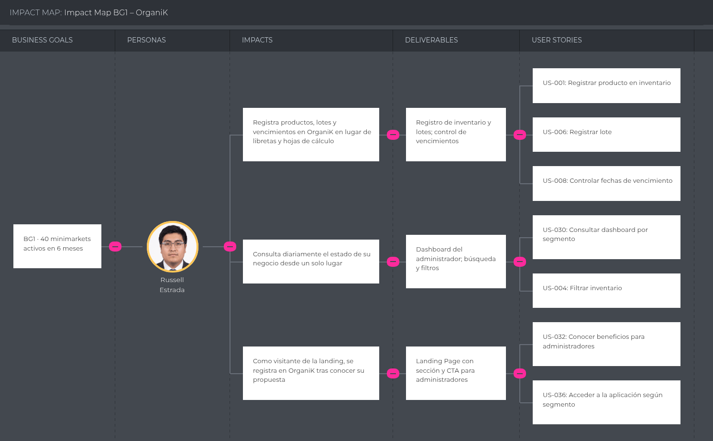

*Figura: Impact Map del Business Goal 1 (adopción por minimarkets) elaborado en UXPressia.*
 
### Business Goal 2
 
**Lograr que 25 proveedores de productos orgánicos publiquen su catálogo y gestionen al menos un pedido mensual a través de OrganiK, en un plazo de 6 meses desde el lanzamiento.**
 
| Actor (User Persona) | Impact | Deliverables | User Stories |
| --- | --- | --- | --- |
| Enrique Villar (proveedor) | Mantiene su catálogo y disponibilidad actualizados en OrganiK en lugar de enviar archivos por WhatsApp. | Catálogo del proveedor. | US-016: Como proveedor de productos orgánicos, deseo registrar los productos que ofrezco, para ponerlos a disposición de los minimarkets. US-017: Como proveedor de productos orgánicos, deseo consultar los productos que tengo registrados, para mantener control sobre mi oferta dentro de la plataforma. |
| Enrique Villar (proveedor) | Crea y sigue sus pedidos de abastecimiento en OrganiK. | Creación de pedidos; consulta de estado; necesidades de reposición. | US-021: Como proveedor de productos orgánicos, deseo crear un pedido dirigido a un minimarket con productos y cantidades disponibles, para proponer una operación de abastecimiento verificable. US-022: Como proveedor de productos orgánicos, deseo consultar el estado de los pedidos que generé, para conocer la decisión del administrador. US-020: Como proveedor de productos orgánicos, deseo consultar las necesidades de reposición compartidas por los minimarkets que atiendo, para preparar pedidos acordes con mi disponibilidad. |
| Russell Estrada (administrador de minimarket) | Revisa y decide los pedidos de sus proveedores en OrganiK. | Flujo de aceptación y rechazo de pedidos con historial. | US-023: Como administrador de minimarket, deseo aceptar un pedido dirigido a mi negocio después de verificar sus productos y cantidades, para incorporar únicamente los productos aprobados al inventario. US-024: Como administrador de minimarket, deseo rechazar un pedido dirigido a mi negocio, para evitar incorporar productos no aprobados al inventario. |

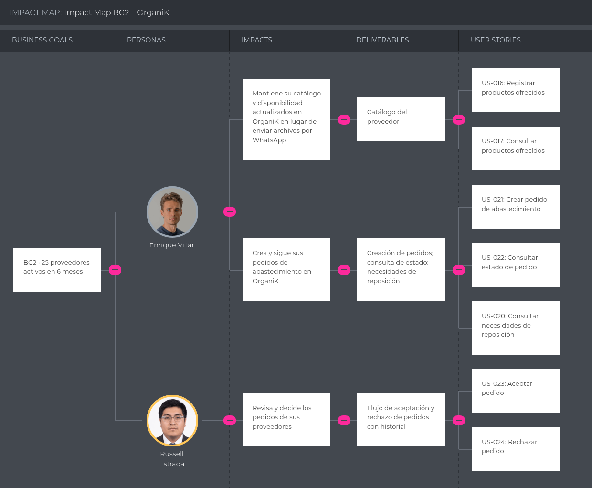

*Figura: Impact Map del Business Goal 2 (adopción por proveedores) elaborado en UXPressia.*
 
### Business Goal 3
 
**Reducir en 20% las unidades dadas de baja por vencimiento o por condiciones inadecuadas de conservación en los minimarkets piloto, en un plazo de 4 meses respecto de su línea base inicial.**
 
| Actor (User Persona) | Impact | Deliverables | User Stories |
| --- | --- | --- | --- |
| Russell Estrada (administrador de minimarket) | Atiende los productos próximos a vencer antes de que se pierdan. | Alertas de vencimiento; registro de ofertas. | US-009: Como administrador de minimarket, deseo recibir alertas sobre productos próximos a vencer, para tomar acciones antes de que se generen pérdidas. US-014: Como administrador de minimarket, deseo registrar productos disponibles como oferta, para promocionar productos con stock disponible y mantener trazabilidad sobre su salida comercial. |
| Russell Estrada (administrador de minimarket) | Corrige oportunamente las condiciones de temperatura y humedad. | Monitoreo de conservación; alertas de conservación. | US-011: Como administrador de minimarket, deseo visualizar registros de temperatura y humedad, para conocer las condiciones de almacenamiento de los productos. US-012: Como administrador de minimarket, deseo recibir alertas cuando las condiciones de conservación sean inadecuadas, para reaccionar oportunamente ante posibles riesgos de deterioro. |
| Russell Estrada (administrador de minimarket) | Registra sus mermas para medir la reducción de pérdidas. | Registro de mermas. | US-013: Como administrador de minimarket, deseo registrar productos que hayan sufrido merma, para mantener un historial de pérdidas de inventario. |

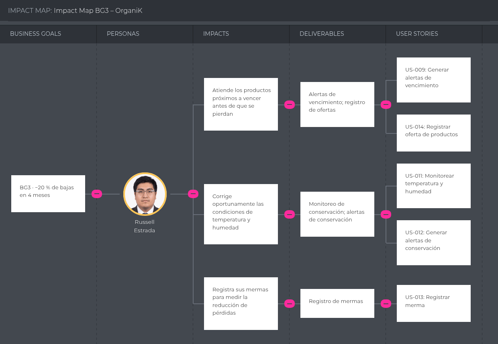

*Figura: Impact Map del Business Goal 3 (reducción de bajas por vencimiento y conservación) elaborado en UXPressia.*
 
El Impact Map muestra que los tres objetivos de negocio dependen de que ambos User Personas trasladen a OrganiK tareas que hoy realizan con libretas, hojas de cálculo y mensajería. Por ello, las historias asociadas al registro de inventario, al catálogo del proveedor y al flujo de pedidos con aprobación del administrador concentran el mayor valor y se ubican en las primeras posiciones del Product Backlog, después de las historias del Landing Page.
 
## 3.3. Product Backlog.
 
En esta sección se presenta el Product Backlog de OrganiK, ordenado según el valor que cada historia aporta al negocio. Las historias del Landing Page se ubican al inicio porque se implementan desde el Sprint 1. Les siguen las historias que sostienen la propuesta diferencial de OrganiK (inventario con lotes y vencimientos, catálogo del proveedor y flujo de pedidos con aprobación del administrador), luego las de conservación, consulta y análisis, y finalmente las de acceso y preferencias. Las Technical Stories del RESTful API se ubican a continuación, porque la primera versión de los Web Services se despliega en el Sprint 3. La estimación utiliza Story Points en la escala 1, 2, 3, 5 y 8.

| # Orden | User Story Id | Título | Descripción | Story Points (1 / 2 / 3 / 5 / 8) |
| --- | --- | --- | --- | --- |
| 1 | US-031 | Conocer la propuesta de valor | Como visitante, deseo conocer qué es OrganiK y qué problema resuelve, para evaluar si se ajusta a las necesidades de mi negocio. | 3 |
| 2 | US-032 | Conocer beneficios para administradores | Como visitante del segmento administrador de minimarket, deseo conocer los beneficios de OrganiK para mi negocio, para decidir si me registro. | 2 |
| 3 | US-033 | Conocer beneficios para proveedores | Como visitante del segmento proveedor de productos orgánicos, deseo conocer los beneficios de OrganiK para mi negocio, para decidir si me registro. | 2 |
| 4 | US-036 | Acceder a la aplicación según segmento | Como visitante, deseo acceder desde el Landing Page a la vista de la Web Application que corresponde a mi segmento, para empezar a usar OrganiK sin pasos adicionales. | 3 |
| 5 | US-034 | Consultar planes de suscripción | Como visitante, deseo consultar los planes de suscripción de OrganiK, para conocer el costo y las funciones incluidas. | 2 |
| 6 | US-037 | Cambiar idioma del Landing Page | Como visitante, deseo cambiar el idioma del Landing Page entre inglés y español, para comprender el contenido en mi idioma de preferencia. | 2 |
| 7 | US-039 | Consultar términos y condiciones | Como visitante o usuario, deseo consultar los términos y condiciones del servicio, para conocer mis derechos y obligaciones al usar OrganiK. | 1 |
| 8 | US-035 | Ver videos del producto y del equipo | Como visitante, deseo ver los videos About the Product y About the Team, para comprender el funcionamiento de OrganiK y conocer a su equipo. | 2 |
| 9 | US-001 | Registrar producto en inventario | Como administrador de minimarket, deseo registrar productos en el inventario, para mantener actualizada la información de los productos disponibles. | 5 |
| 10 | US-002 | Visualizar inventario | Como administrador de minimarket, deseo visualizar los productos registrados, para conocer el estado actual de mi inventario. | 5 |
| 11 | US-006 | Registrar lote | Como administrador de minimarket, deseo registrar lotes de productos, para mantener la trazabilidad de los productos almacenados. | 5 |
| 12 | US-007 | Consultar lotes | Como administrador de minimarket, deseo consultar los lotes registrados, para conocer el origen y estado de los productos. | 3 |
| 13 | US-008 | Controlar fechas de vencimiento | Como administrador de minimarket, deseo visualizar las fechas de vencimiento de los productos, para identificar productos próximos a vencer. | 5 |
| 14 | US-009 | Generar alertas de vencimiento | Como administrador de minimarket, deseo recibir alertas sobre productos próximos a vencer, para tomar acciones antes de que se generen pérdidas. | 3 |
| 15 | US-016 | Registrar productos ofrecidos | Como proveedor de productos orgánicos, deseo registrar los productos que ofrezco, para ponerlos a disposición de los minimarkets. | 5 |
| 16 | US-017 | Consultar productos ofrecidos | Como proveedor de productos orgánicos, deseo consultar los productos que tengo registrados, para mantener control sobre mi oferta dentro de la plataforma. | 3 |
| 17 | US-015 | Consultar productos de proveedores | Como administrador de minimarket, deseo consultar los productos ofrecidos por los proveedores, para identificar opciones disponibles para abastecer el minimarket. | 5 |
| 18 | US-021 | Crear pedido de abastecimiento | Como proveedor de productos orgánicos, deseo crear un pedido dirigido a un minimarket con productos y cantidades disponibles, para proponer una operación de abastecimiento verificable. | 5 |
| 19 | US-019 | Consultar pedidos de abastecimiento | Como administrador de minimarket o proveedor, deseo consultar los pedidos relacionados con mi negocio, para conocer sus productos, cantidades y estado actual. | 3 |
| 20 | US-023 | Aceptar pedido | Como administrador de minimarket, deseo aceptar un pedido dirigido a mi negocio después de verificar sus productos y cantidades, para incorporar únicamente los productos aprobados al inventario. | 5 |
| 21 | US-024 | Rechazar pedido | Como administrador de minimarket, deseo rechazar un pedido dirigido a mi negocio, para evitar incorporar productos no aprobados al inventario. | 3 |
| 22 | US-022 | Consultar estado de pedido | Como proveedor de productos orgánicos, deseo consultar el estado de los pedidos que generé, para conocer la decisión del administrador. | 3 |
| 23 | US-018 | Registrar necesidad de reposición | Como administrador de minimarket, deseo registrar los productos y cantidades que necesito reponer, para orientar mis decisiones de abastecimiento sin crear un pedido en nombre del proveedor. | 5 |
| 24 | US-020 | Consultar necesidades de reposición | Como proveedor de productos orgánicos, deseo consultar las necesidades de reposición compartidas por los minimarkets que atiendo, para preparar pedidos acordes con mi disponibilidad. | 3 |
| 25 | US-025 | Consultar historial de abastecimiento | Como administrador de minimarket o proveedor, deseo consultar el historial de pedidos y decisiones de mi negocio, para mantener trazabilidad de las operaciones. | 3 |
| 26 | US-010 | Consultar condiciones de conservación | Como administrador de minimarket, deseo consultar las condiciones de conservación de los productos, para identificar posibles riesgos de deterioro. | 3 |
| 27 | US-011 | Monitorear temperatura y humedad | Como administrador de minimarket, deseo visualizar registros de temperatura y humedad, para conocer las condiciones de almacenamiento de los productos. | 5 |
| 28 | US-012 | Generar alertas de conservación | Como administrador de minimarket, deseo recibir alertas cuando las condiciones de conservación sean inadecuadas, para reaccionar oportunamente ante posibles riesgos de deterioro. | 5 |
| 29 | US-003 | Buscar productos en inventario | Como administrador de minimarket, deseo buscar productos dentro del inventario, para encontrarlos rápidamente. | 3 |
| 30 | US-004 | Filtrar inventario | Como administrador de minimarket, deseo filtrar productos por categoría, estado o vencimiento, para identificar rápidamente productos que requieren atención. | 3 |
| 31 | US-005 | Actualizar inventario | Como administrador de minimarket, deseo actualizar la información de los productos, para mantener el inventario correctamente registrado. | 5 |
| 32 | US-030 | Consultar dashboard por segmento | Como administrador de minimarket o proveedor, deseo visualizar un dashboard con la información de mi segmento, para consultar rápidamente el estado de mis operaciones. | 5 |
| 33 | US-013 | Registrar merma | Como administrador de minimarket, deseo registrar productos que hayan sufrido merma, para mantener un historial de pérdidas de inventario. | 3 |
| 34 | US-014 | Registrar oferta de productos | Como administrador de minimarket, deseo registrar productos disponibles como oferta, para promocionar productos con stock disponible y mantener trazabilidad sobre su salida comercial. | 3 |
| 35 | US-027 | Iniciar sesión | Como usuario de OrganiK, deseo iniciar sesión, para acceder a las funciones de mi segmento y negocio. | 3 |
| 36 | US-026 | Registrar usuario | Como administrador de minimarket o proveedor, deseo registrar usuarios de mi negocio, para permitir el acceso controlado a OrganiK. | 3 |
| 37 | US-029 | Controlar acceso según operación | Como administrador de minimarket, deseo que solo yo pueda modificar mi inventario y decidir sobre los pedidos dirigidos a mi negocio, para evitar modificaciones no autorizadas. | 5 |
| 38 | US-028 | Gestionar permisos por rol | Como administrador de minimarket o proveedor, deseo asignar roles a los usuarios de mi negocio, para controlar las acciones que cada uno puede realizar. | 5 |
| 39 | US-040 | Cambiar idioma de la aplicación | Como usuario de OrganiK, deseo cambiar el idioma de la Web Application entre inglés y español, para operar en mi idioma de preferencia. | 3 |
| 40 | TS-PLT-001 | Configurar base del RESTful API | Como Developer, deseo configurar el proyecto Spring Boot con un endpoint de health check y documentación OpenAPI, para sostener el desarrollo de los Web Services. | 3 |
| 41 | TS-PLT-002 | Configurar persistencia | Como Developer, deseo configurar Spring Data JPA con la base de datos relacional y datos iniciales, para persistir la información de OrganiK. | 5 |
| 42 | TS-PROD-001 | Products API | Como Developer, deseo listar y registrar productos mediante /api/v1/products, para alimentar el inventario y el catálogo de proveedores. | 3 |
| 43 | TS-PROD-002 | Product detail and update API | Como Developer, deseo consultar y actualizar productos mediante /api/v1/products/{id}, para mantener su información vigente. | 3 |
| 44 | TS-INV-001 | Inventory API | Como Developer, deseo listar y registrar elementos del inventario mediante /api/v1/inventory, para mantener actualizado el stock del minimarket. | 3 |
| 45 | TS-INV-002 | Inventory update API | Como Developer, deseo actualizar el inventario mediante /api/v1/inventory/{id}, para reflejar cambios en las cantidades. | 2 |
| 46 | TS-LOT-001 | Lots API | Como Developer, deseo listar y registrar lotes mediante /api/v1/lots, para implementar la trazabilidad de los productos. | 3 |
| 47 | TS-LOT-002 | Lot detail and update API | Como Developer, deseo consultar y actualizar lotes mediante /api/v1/lots/{id}, para mantener actualizada la trazabilidad. | 2 |
| 48 | TS-EXP-001 | Expirations API | Como Developer, deseo consultar lotes próximos a vencer mediante /api/v1/expirations, para alimentar las alertas de vencimiento. | 3 |
| 49 | TS-SUP-001 | Suppliers API | Como Developer, deseo listar, registrar y actualizar proveedores mediante /api/v1/suppliers, para mantener disponible la información para el abastecimiento. | 3 |
| 50 | TS-SUP-002 | Supplier products API | Como Developer, deseo consultar y registrar los productos de cada proveedor mediante /api/v1/suppliers/{id}/products, para mostrar su catálogo. | 3 |
| 51 | TS-ORD-002 | Supplier orders API | Como Developer, deseo crear y consultar pedidos mediante /api/v1/orders, para registrar las propuestas de abastecimiento de los proveedores. | 3 |
| 52 | TS-ORD-003 | Order decision API | Como Developer, deseo aceptar o rechazar pedidos mediante /api/v1/orders/{id}/accept y /api/v1/orders/{id}/reject, para registrar la decisión del administrador y actualizar el inventario solo al aceptar. | 3 |
| 53 | TS-ORD-004 | Order history API | Como Developer, deseo consultar el historial de un pedido mediante /api/v1/orders/{id}/history, para mostrar la trazabilidad a los participantes. | 3 |
| 54 | TS-ORD-001 | Replenishment needs API | Como Developer, deseo listar y registrar necesidades de reposición mediante /api/v1/replenishment-needs, para compartirlas con proveedores vinculados. | 3 |
| 55 | TS-CON-001 | Conservation monitoring API | Como Developer, deseo consultar lecturas de temperatura y humedad mediante /api/v1/conservation/monitoring, para mostrar las condiciones de conservación. | 3 |
| 56 | TS-CON-002 | Conservation alerts API | Como Developer, deseo consultar las alertas de conservación mediante /api/v1/conservation/alerts, para mostrarlas al administrador. | 3 |
| 57 | TS-INV-003 | Inventory search API | Como Developer, deseo buscar y filtrar el inventario mediante /api/v1/inventory/search, para implementar búsquedas por producto, categoría, estado o vencimiento. | 2 |
| 58 | TS-DASH-001 | Dashboard API | Como Developer, deseo consultar indicadores mediante /api/v1/dashboard, para alimentar los dashboards de cada segmento. | 3 |
| 59 | TS-MER-001 | Waste and offers API | Como Developer, deseo registrar mermas y ofertas mediante /api/v1/waste y /api/v1/offers, para mantener la trazabilidad de las operaciones del inventario. | 3 |
| 60 | TS-DASH-002 | Notifications API | Como Developer, deseo consultar y actualizar notificaciones mediante /api/v1/notifications, para informar oportunamente sobre eventos relevantes. | 2 |
| 61 | TS-IAM-001 | Sign-in API | Como Developer, deseo autenticar usuarios mediante POST /api/v1/auth/sign-in, para obtener el token, el rol y el negocio del usuario. | 2 |
| 62 | TS-IAM-002 | Sign-up API | Como Developer, deseo registrar usuarios mediante POST /api/v1/auth/sign-up, para habilitar el acceso a OrganiK. | 2 |
| 63 | TS-PLT-003 | Aplicar autorización por rol y negocio | Como Developer, deseo aplicar reglas de rol y negocio a todos los endpoints privados, para evitar accesos no autorizados. | 3 |
| 64 | TS-IAM-003 | Users API | Como Developer, deseo listar y crear usuarios mediante /api/v1/users, para administrar los usuarios de cada negocio. | 3 |
| 65 | TS-IAM-004 | User detail and update API | Como Developer, deseo consultar y actualizar usuarios mediante /api/v1/users/{id}, para mantener sus roles y estados actualizados. | 3 |
| 66 | TS-PROF-001 | Profiles API | Como Developer, deseo consultar y actualizar perfiles mediante /api/v1/profiles/{id}, para mostrar la información del usuario y su negocio. | 3 |
| 67 | TS-AUD-001 | Activity history API | Como Developer, deseo consultar el historial de operaciones mediante /api/v1/activity-history, para mantener la trazabilidad de las acciones realizadas. | 3 |

A continuación se presenta la captura del Product Backlog en la herramienta de gestión del proyecto.
 

 
*Figura: Product Backlog de OrganiK en Trello.*
 
Enlace público al Product Backlog: [Product Backlog de OrganiK en Trello](https://trello.com/invite/b/6aaf94c8244f819349bf0de9/ATTI96869889ee148c22847a13480770254571767922/sprint-backlog-1-organik)

---

# Capítulo IV: Product Design

## 4.1. Style Guidelines.

Esta sección establece las bases visuales y de comunicación para mantener la consistencia en todos los productos digitales de OrganiK (Landing Page y Web Application). El objetivo es contar con un repositorio centralizado que facilite la escalabilidad del diseño y garantice una experiencia de usuario coherente para quienes gestionan el inventario, la conservación y el abastecimiento de productos orgánicos.

### 4.1.1. General Style Guidelines.

**Tono de Comunicación y Lenguaje**
La comunicación de OrganiK se rige bajo cuatro dimensiones principales para establecer confianza en un entorno B2B:
*   **Formal vs. Casual:** Ligeramente formal. Se dirige al usuario con respeto profesional, pero empleando términos claros y directos para agilizar la gestión operativa sin burocracia.
*   **Divertido vs. Serio:** Serio. Al tratarse de una herramienta para el control de inventarios, prevención de pérdidas económicas y abastecimiento, el enfoque debe transmitir seguridad y fiabilidad.
*   **Respetuoso vs. Irreverente:** Respetuoso. Considera la alta carga operativa y el estrés de los usuarios (como los administradores de minimarkets), mostrándose como un asistente empático.
*   **Entusiasta vs. Sereno:** Sereno. Las interfaces e interacciones no buscan abrumar al usuario con celebraciones excesivas, sino brindar tranquilidad mediante la automatización y alertas preventivas.

La interfaz se ofrece en español (idioma por defecto) y en inglés, con selector de idioma visible en la cabecera.

**Branding y Paleta de Colores**
La paleta cromática evoca la naturaleza de los productos orgánicos y mantiene un alto contraste para la lectura de datos. Todo el producto se construye sobre una escala de verdes con un acento lima y neutros tintados de verde:
*   **Colores Primarios (Marca y Acción):** *Forest* (`#0B2B1C`) para la barra lateral y superficies de énfasis; *Green* (`#17803F`) y *Green Strong* (`#116A33`) para botones principales, enlaces y estados activos; *Leaf* (`#2FA866`) para gráficos e indicadores positivos.
*   **Colores de Acento (Dinamismo):** *Lime* (`#C8E04F`) y *Lime Soft* (`#D8EC8A`) para resaltar el elemento activo, cifras destacadas y llamados a la acción secundarios.
*   **Colores Neutros (Estructura y Legibilidad):** *Mist* (`#EDF3EE`) como fondo de pantalla, *Tint* (`#E6F3E9`) y *Tint Strong* (`#D3EBD9`) para superficies y filas, *Border* (`#D5E4D8`) para divisores, *Muted* (`#4E6556`) para texto secundario y blanco para tarjetas, reduciendo la fatiga visual.
*   **Colores de Estado (Alerta):** *Danger* (`#B42318`) con fondo *Danger Soft* (`#FDE8E6`) para errores, vencimientos críticos y alertas de conservación; *Warning* (`#7A4B00`) con fondo *Warning Soft* (`#FBE7A6`) para productos próximos a vencer y solicitudes pendientes.

**Tipografía**
Se seleccionaron dos familias priorizando la legibilidad en pantallas de múltiples resoluciones (con Inter reservada para los wireframes de baja fidelidad):
*   **Fraunces (SemiBold):** Utilizada en títulos de pantalla, títulos de tarjetas y cifras destacadas (KPIs) del dashboard. Su carácter serif aporta calidez y un tono natural acorde con el rubro orgánico. Estilos: *Display* 32 px, *Title* 24 px y *Figure* 36 px.
*   **Geist:** Asignada a la interfaz: cuerpos de texto, tablas de datos, formularios, botones y etiquetas. Diseñada para interfaces, garantiza que los datos densos sean legibles en tamaños pequeños. Estilos: *Body* 14 px, *Body Medium* 15 px, *Caption* 12.5 px y *Label* 12 px en mayúsculas.
*   **Inter:** Usada únicamente en los wireframes (12.7 px) para mantener un aspecto neutro y sin decoración.

### 4.1.2. Web Style Guidelines.

Para garantizar que la experiencia sea fluida y adaptable (Responsive Web Design), se establecen los siguientes estándares visuales y de interacción:

*   **Sistema de Espaciado y Forma:** Se utiliza un espaciado basado en múltiplos de 4 y 8 px. Las tarjetas y paneles usan esquinas de 12 px y los campos y botones de 8 px, con sombras suaves que se elevan al interactuar. La barra lateral tiene un ancho fijo de 280 px en escritorio.
*   **Puntos de Ruptura (Breakpoints):** El diseño es fluido, con puntos de adaptación en 600 px, 700 px, 900 px y 1000 px, donde las cuadrículas pasan a una sola columna y los paneles se reorganizan.
*   **Estados de Interacción:**
    *   *Hover:* Los botones y tarjetas elevan sutilmente su sombra y oscurecen su fondo hacia *Green Strong*. Estos efectos se activan solo en dispositivos con puntero preciso (`hover: hover`).
    *   *Disabled:* Los botones de acciones incompletas (ej. "Aceptar recepción" sin completar los datos) se desaturan y reducen su opacidad.
    *   *Error:* Los campos inválidos muestran el borde y el mensaje en *Danger*; el formulario de acceso sacude el panel ante credenciales incorrectas.
*   **Movimiento:** Las pantallas aparecen con entradas suaves y escalonadas (desenfoque y desplazamiento leve, 720 ms), las cifras de los KPI cuentan hasta su valor final y las transiciones entre vistas usan *View Transitions*. Todo movimiento se desactiva cuando el usuario tiene activada la preferencia `prefers-reduced-motion`.
*   **Accesibilidad (A11y):** Se garantiza un ratio de contraste mínimo de 4.5:1 entre el texto y su fondo, y los estados no dependen solo del color: siempre van acompañados de texto o ícono.

## 4.2. Information Architecture.

La Arquitectura de la Información (IA) de **OrganiK** ha sido diseñada con el objetivo de estructurar, organizar y etiquetar el contenido de la plataforma de manera que los usuarios puedan encontrar la información y completar sus tareas de forma intuitiva.

Dado que la plataforma atiende a dos segmentos con necesidades y permisos operativos distintos, la arquitectura se divide en tres áreas principales: una zona pública orientada a la conversión (Landing Page) y dos zonas privadas (Web Application) adaptadas al flujo operativo de cada rol (Administrador de Minimarket y Proveedor B2B). Esta separación garantiza que cada usuario acceda únicamente a la información y herramientas relevantes para su gestión.

La landing y la aplicación son productos separados que se conectan por enlaces: el botón *Iniciar sesión* de la landing lleva a la pantalla de acceso de la aplicación, y esta ofrece el enlace de regreso a la landing. Las dos zonas privadas comparten el mismo shell de navegación (barra lateral, cabecera con búsqueda global y selector de idioma) y las rutas están protegidas por autenticación; el rol de cada cuenta se administra desde *Usuarios y roles*.

A continuación, se presenta el Mapa de Sitio (Site Map) jerárquico de la plataforma:

**1. Zona Pública (Landing Page)**
*   **1.1. Inicio:** Propuesta de valor principal.
*   **1.2. Solución:** Explicación del funcionamiento integrado (Inventario, Conservación y Abastecimiento).
*   **1.3. Beneficios:** Ventajas de la reducción de mermas y digitalización B2B.
*   **1.4. Equipo:** Presentación del equipo desarrollador.
*   **1.5. Planes y Precios:** Suscripciones para Minimarkets y Proveedores.
*   **1.6. Acceso:** Iniciar sesión (enlace a la Web Application). Selector de idioma ES/EN en la barra de navegación.

**2. Zona Privada: Administrador de Minimarket**
*   **2.1. Panel (Dashboard):** Resumen de indicadores (KPI), accesos rápidos y alertas críticas.
*   **2.2. Inventario:**
    *   2.2.1. Lista de existencias con el estado de cada lote (vigente, próximo a vencer, vencido).
    *   2.2.2. Registrar stock.
    *   2.2.3. Productos: catálogo de productos orgánicos por categoría y alta de nuevo producto.
*   **2.3. Conservación (Monitoreo Ambiental):**
    *   2.3.1. Lecturas de temperatura y humedad (simuladas en la validación inicial).
    *   2.3.2. Historial de alertas de conservación.
*   **2.4. Abastecimiento:**
    *   2.4.1. Proveedores: directorio, perfil del proveedor, nuevo proveedor y proveedores sugeridos.
    *   2.4.2. Solicitudes: necesidades de reposición compartidas con proveedores y nueva solicitud.
    *   2.4.3. Envíos: bandeja de pedidos creados por proveedores (Aceptar / Rechazar recepción) y su estado e historial.
*   **2.5. Análisis y alertas (Analytics):** Indicadores operativos, alertas y generación de reportes.
*   **2.6. Administración:**
    *   2.6.1. Usuarios y roles: lista de cuentas, estado y alta de nuevo usuario.
    *   2.6.2. Perfiles: perfiles de minimarkets y proveedores.
    *   2.6.3. Configuración: perfil del negocio y preferencias de alertas.

**3. Zona Privada: Proveedor B2B**
*   **3.1. Panel (Dashboard):** Resumen de pedidos, estado de despachos y KPIs comerciales.
*   **3.2. Mi Catálogo:**
    *   3.2.1. Gestión de productos ofrecidos (agregar producto).
    *   3.2.2. Actualización de disponibilidad y lotes en almacén (registrar stock).
*   **3.3. Gestión de Pedidos:**
    *   3.3.1. Consulta de necesidades de reposición compartidas por minimarkets vinculados (Solicitudes).
    *   3.3.2. Creación de pedidos dirigidos a minimarkets (Envíos).
    *   3.3.3. Consulta de estado e historial de pedidos; el pedido queda pendiente hasta que el administrador destinatario lo acepta o rechaza.
*   **3.4. Red de Clientes:** Directorio de minimarkets asociados (Perfiles).
*   **3.5. Configuración:** Perfil de la empresa y detalles logísticos.

### 4.2.1. Organization Systems.

El sistema de organización de **OrganiK** define cómo se estructura y clasifica la información para que los usuarios interactúen con la plataforma sin fricciones. Se han aplicado los siguientes esquemas organizativos:
*   **Organización Visual y Estructural:**
    *   *Jerárquica:* Aplicada en la *Landing Page*, donde la información fluye de mayor a menor importancia.
    *   *Matricial:* Utilizada en la aplicación, permitiendo al usuario navegar entre diferentes dimensiones operativas (Inventario, Solicitudes, Envíos, Conservación) desde la barra lateral sin un orden secuencial estricto.
*   **Esquemas de Categorización:**
    *   *Según Audiencia:* Separa la experiencia del *Administrador de Minimarket* (enfocada en control interno y compras) de la del *Proveedor B2B* (enfocada en catálogo, ventas y despachos).
    *   *Cronológico:* Aplicado en los historiales de pedidos y en el registro de alertas de conservación, ordenando los datos desde el evento más reciente al más antiguo.
    *   *Por Tópicos:* Utilizado para estructurar el catálogo por categorías de producto y el inventario físico, facilitando la agrupación de lotes y productos.

### 4.2.2. Labeling Systems.

Para garantizar la comprensión inmediata en entornos operativos rápidos, el sistema de etiquetado se basa en el *Ubiquitous Language* del sector logístico:
*   **Etiquetas de Navegación:** Términos precisos de 1 a 3 palabras (Ej: *Inventario*, *Productos*, *Solicitudes*, *Envíos*, *Conservación*, *Usuarios y roles*).
*   **Etiquetas de Acción (Botones):** Utilizan verbos en infinitivo que indican el resultado de la acción, alineados a los User Stories (Ej: *Agregar producto*, *Registrar stock*, *Nueva solicitud*, *Generar reporte*).
*   **Etiquetas de Estado:** Emplean un código de color respaldado por texto claro para el seguimiento (Ej: *Pendiente* [Ámbar], *Aprobado/Vigente* [Verde], *Rechazado/Vencido* [Rojo]).
*   **Apoyo Iconográfico:** Las etiquetas de navegación principal siempre están acompañadas de iconos de Material Design para acelerar el reconocimiento visual.

### 4.2.3. SEO Tags and Meta Tags

Para asegurar el posicionamiento en motores de búsqueda y la correcta previsualización al compartir enlaces, se han configurado los siguientes metadatos:
*   **Landing Page (Pública):**
    *   `Title:` `<title>Organik · Control de inventario para minimarkets</title>`
    *   `Meta Description:` `<meta name="description" content="Organik centraliza inventario, lotes y vencimientos para que tu minimarket reponga a tiempo y deje de perder producto.">`
    *   `Open Graph:` `<meta property="og:title" content="Organik · Control de inventario para minimarkets">` y `<meta property="og:description" content="Anticipa vencimientos y gestiona el abastecimiento en tiempo real.">`
*   **Web Application (Privada):** Dado que requiere autenticación, el contenido interno no debe ser indexado por los motores de búsqueda (`<meta name="robots" content="noindex, nofollow">`), protegiendo la privacidad operativa de los clientes. Se usan títulos dinámicos en la pestaña según la pantalla activa (Ej. `Inventario - OrganiK`).

### 4.2.4. Searching Systems.

Debido al alto volumen transaccional, OrganiK implementa un sistema de búsqueda para reducir el tiempo de localización de datos:
*   **Búsqueda Global:** Ubicada en la cabecera de la aplicación, permite realizar consultas por coincidencia de texto (ej. buscar el producto "Manzana" o un proveedor) y navegar directamente al resultado.
*   **Filtros Contextuales:** Controles en las tablas de datos para refinar resultados (ej. filtrar inventario por estado "Próximo a vencer", o filtrar solicitudes por estado).
*   **Presentación de Resultados:** Los datos se presentan en *Data Tables* ordenables para no sobrecargar la vista.

### 4.2.5. Navigation Systems.

El sistema de navegación está estructurado para que los usuarios interactúen con la menor cantidad de clics posibles:
*   **Navegación Global (Landing Page):** *Sticky Top Navbar* con anclas (anchor links) a secciones clave, selector de idioma ES/EN y un enlace destacado "Iniciar sesión" que lleva a la aplicación.
*   **Navegación Global (Web App):** *Sidebar* lateral izquierda con los módulos principales, cada uno con su icono, y cabecera con búsqueda global, selector de idioma y cierre de sesión.
*   **Navegación Local:** Cada módulo ofrece sus acciones principales como botones sobre la tabla (ej. *Registrar stock* en Inventario, *Nueva solicitud* en Solicitudes) que abren el formulario correspondiente, con un botón para volver a la lista.
*   **Control de Acceso:** Las rutas privadas están protegidas por una guarda de autenticación que conserva la dirección solicitada y la recupera tras iniciar sesión; si el usuario ya tiene sesión, el login lo redirige al panel.

## 4.3. Landing Page UI Design.

En esta sección se presenta la propuesta de Interfaz de Usuario (UI) para la Landing Page de **OrganiK**. El diseño visual traduce las decisiones tomadas en la Arquitectura de la Información y las Guías de Estilo en una interfaz tangible orientada a la conversión. El objetivo principal de esta página pública es comunicar claramente la propuesta de valor integrada (gestión de inventarios, conservación y abastecimiento) y dirigir a los usuarios hacia el inicio de sesión.

### 4.3.1. Landing Page Wireframe.

Los wireframes representan el esqueleto estructural de la página en baja fidelidad, desprovistos de color y tipografía final, para centrar el análisis en la usabilidad y la distribución del contenido. Se elaboraron en las versiones en español e inglés.

**Explicación del Diseño y Arquitectura:**
*   **Estructura Visual:** Se ha optado por un diseño de bloque único (*Single-page layout*) que guía al usuario a través de un viaje lógico: Problema $\rightarrow$ Solución (Características de OrganiK) $\rightarrow$ Planes $\rightarrow$ Call to Action (CTA).
*   **Jerarquía de Información:** La sección *Hero* (cabecera principal) destaca la propuesta de valor central con botones de acción inmediata. A medida que se hace *scroll*, la información se desglosa en bloques asimétricos o de cuadrícula (grid) para explicar módulos específicos como el control de lotes y las alertas de conservación.
*   **Diseño Inclusivo:** Para la versión *Mobile Web Browser*, el wireframe estructural apila los contenedores en una sola columna. Las áreas de interacción tienen un área táctil amplia para evitar frustración motriz en dispositivos móviles.

### 4.3.2. Landing Page Mock-up.

Los mock-ups representan el diseño final en alta fidelidad, integrando el *Design System* establecido para los productos digitales de OrganiK y los textos de la landing publicada.

**Explicación de la Aplicación Visual y UI:**
*   **Aplicación de Style Guidelines:** El diseño hace uso de un fondo oscuro en *Forest* con acentos en *Lime* y *Green*, que transmite una sensación de naturaleza, modernidad y confianza. Los colores de acción se reservan estratégicamente para los componentes interactivos principales (botón de inicio de sesión y llamados a la acción), atrayendo naturalmente la vista del usuario.
*   **Tipografía y Legibilidad:** Se aplica *Fraunces* en los encabezados principales (H1, H2), logrando impacto y calidez; mientras que los párrafos explicativos y las tarjetas utilizan *Geist*, garantizando una legibilidad óptima.
*   **Consistencia de Interacción:** La barra de navegación superior (Navbar) se mantiene fija (*sticky*) durante el *scroll*, permitiendo acceder al enlace de "Iniciar sesión" en cualquier momento de la lectura.
*   **Accesibilidad Visual:** Se ha verificado que el contraste entre los textos y sus fondos supere el ratio mínimo de 4.5:1 exigido por las normativas de accesibilidad web (WCAG).

## 4.4. Web Applications UX/UI Design.

Esta sección documenta el diseño de la aplicación web de OrganiK: la estructura de sus pantallas en baja fidelidad, los recorridos entre ellas, su diseño visual final y los flujos de usuario. Las pantallas se diseñaron a partir de la aplicación implementada, aplicando la paleta y tipografía definidas en 4.1.

### 4.4.1. Web Applications Wireframes.

Los wireframes de la aplicación muestran la distribución de contenido de cada pantalla en escala de grises. Todas las pantallas comparten el mismo esqueleto: barra lateral de navegación a la izquierda, cabecera con búsqueda global y área de contenido con título, indicadores y tabla o formulario.

**Pantallas principales:** Login, Dashboard, Inventario, Productos, Solicitudes, Envíos, Proveedores, Perfil de proveedor, Conservación, Análisis y alertas, Analytics, Usuarios y roles, Perfiles y Configuración.

**Pantallas de interacción:** Agregar producto, Registrar stock, Nueva solicitud, Aceptar recepción, Nuevo proveedor, Ver alertas, Generar reporte, Ver proveedores sugeridos y Nuevo usuario.

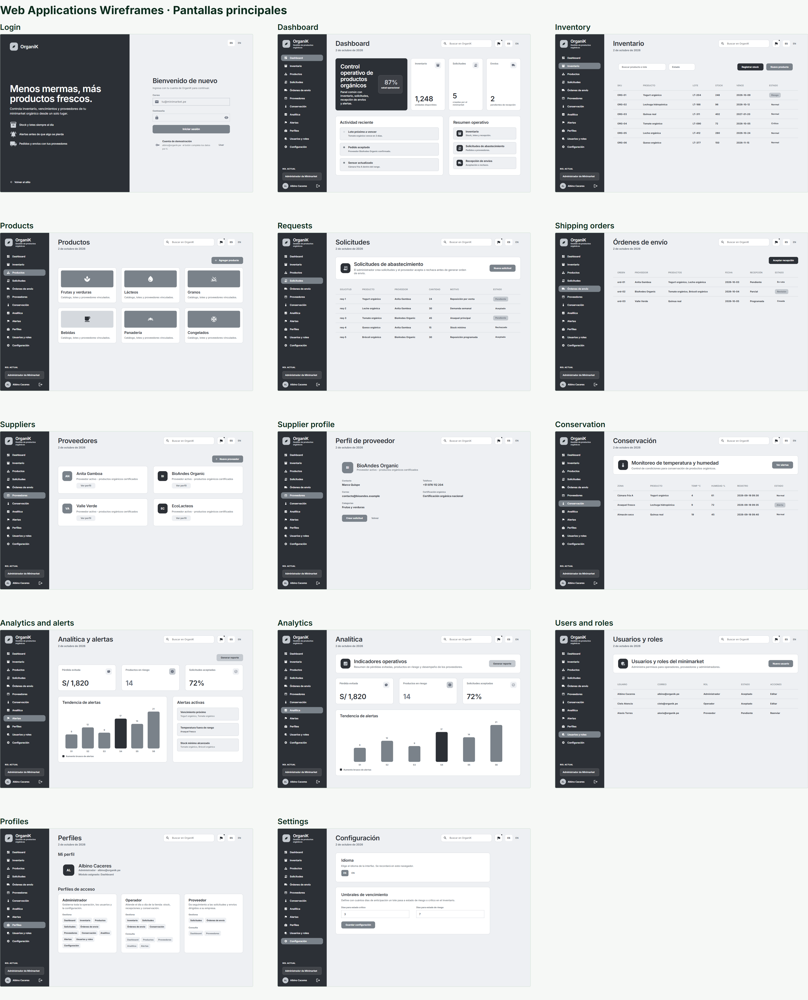

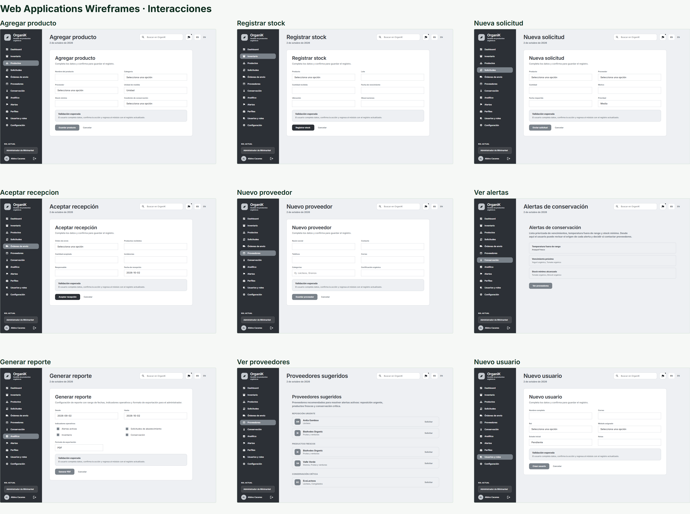

### 4.4.2. Web Applications Wireflow Diagrams.

Los wireflows combinan los wireframes con las transiciones entre pantallas. A continuación se describen los recorridos principales:

*   **Acceso:** Landing Page $\rightarrow$ *Iniciar sesión* $\rightarrow$ Login $\rightarrow$ Dashboard. Si el usuario intenta abrir una ruta privada sin sesión, es enviado al Login y, al autenticarse, vuelve a la ruta solicitada.
*   **Registro de existencias:** Dashboard $\rightarrow$ Inventario $\rightarrow$ *Registrar stock* $\rightarrow$ Formulario $\rightarrow$ Inventario actualizado.
*   **Catálogo:** Productos $\rightarrow$ *Agregar producto* $\rightarrow$ Formulario $\rightarrow$ Catálogo actualizado.
*   **Abastecimiento:** Solicitudes $\rightarrow$ *Nueva solicitud* $\rightarrow$ Envíos $\rightarrow$ *Aceptar recepción* (el inventario se actualiza una sola vez, al aceptar).
*   **Proveedores:** Proveedores $\rightarrow$ Perfil del proveedor / *Nuevo proveedor* / Proveedores sugeridos.
*   **Conservación:** Conservación $\rightarrow$ *Ver alertas* $\rightarrow$ Alertas de conservación.
*   **Analítica:** Análisis y alertas $\rightarrow$ *Generar reporte*.
*   **Administración:** Usuarios y roles $\rightarrow$ *Nuevo usuario*.

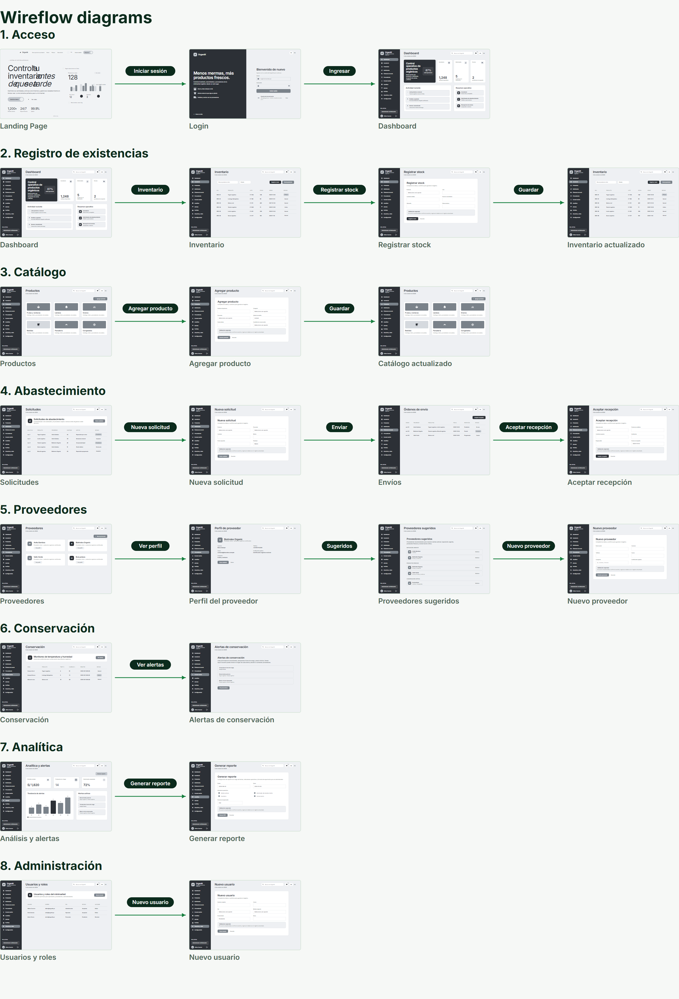

### 4.4.2. Web Applications Mock-ups.

Los mock-ups muestran el diseño de alta fidelidad de cada pantalla con la paleta verde y las tipografías Fraunces y Geist. Entre las decisiones visuales principales:

*   **Barra lateral en *Forest* (verde bosque)** con el módulo activo resaltado en *Lime*, de modo que el usuario siempre sabe dónde está.
*   **Tarjetas de indicadores (KPI)** con cifras en Fraunces que cuentan hasta su valor final al cargar la pantalla.
*   **Tablas de datos** sobre fondo blanco con filas en *Tint* al pasar el cursor, y etiquetas de estado con color y texto (Vigente, Próximo a vencer, Vencido, Pendiente, Aprobado, Rechazado).
*   **Alertas** de vencimiento y de conservación en tonos *Warning* y *Danger*, usados únicamente para lo que requiere atención.
*   **Formularios** en tarjetas con campos de 8 px de radio, mensajes de validación en línea y botón principal en *Green*.
*   **Pantalla de acceso** dividida: panel de marca a un lado y formulario al otro, con enlace de regreso a la landing.

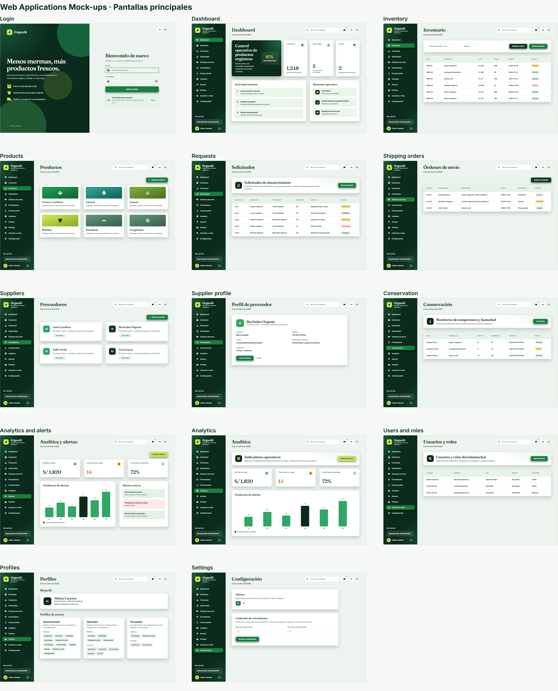

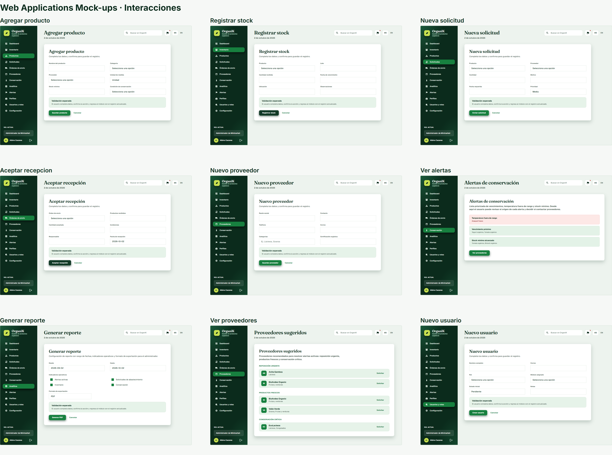

### 4.4.3. Web Applications User Flow Diagrams.

Los diagramas de flujo de usuario describen, paso a paso, cómo el usuario completa las tareas principales.

**Flujo 1 – Iniciar sesión**
1. El usuario ingresa desde la landing o directamente a la aplicación.
2. Escribe su correo y contraseña en el Login.
3. Si las credenciales son incorrectas, el panel muestra el error y permite reintentar; si la cuenta está pendiente de activación, se informa.
4. Si son correctas, se crea la sesión y se muestra el Dashboard (o la ruta que intentó abrir).

**Flujo 2 – Registrar stock**
1. Desde Inventario, el usuario selecciona *Registrar stock*.
2. Elige el producto e ingresa cantidad, lote y fecha de vencimiento.
3. El formulario valida los datos; si hay errores, los marca en línea.
4. Al guardar, el inventario se actualiza y se confirma con una notificación.

**Flujo 3 – Gestionar un pedido**
1. El administrador comparte una necesidad con *Nueva solicitud*.
2. El proveedor crea el pedido dirigido al minimarket.
3. Desde Envíos, el administrador destinatario revisa el pedido y elige *Aceptar* o *Rechazar*.
4. Si acepta, el inventario se actualiza una sola vez; si rechaza, las existencias no cambian.

**Flujo 4 – Atender una alerta de conservación**
1. El Dashboard o Conservación muestra una alerta por temperatura o humedad fuera de rango.
2. El usuario abre *Ver alertas* y revisa el detalle.
3. Toma acción sobre el lote afectado (registrar merma o cambiar su estado).

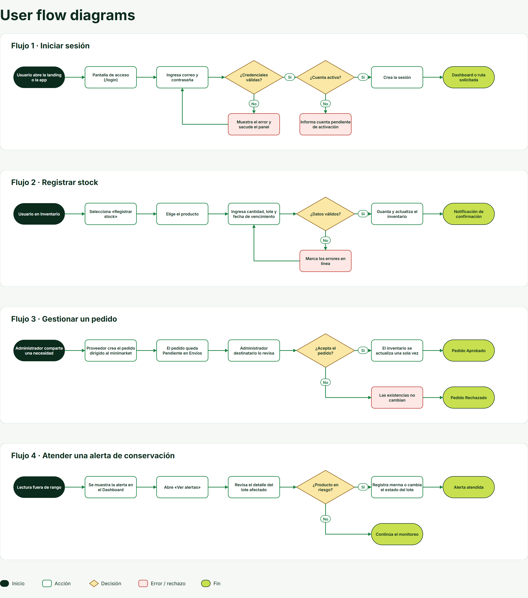

## 4.5. Web Applications Prototyping.

El prototipo de la aplicación web es una aplicación funcional desarrollada en Angular, con datos simulados en memoria y latencia artificial para reproducir la experiencia real. Permite recorrer todas las pantallas del diseño sin depender de un servidor, y valida los flujos descritos en 4.4 antes de integrar el backend.

*   **Tecnología:** Angular, Angular Material, Reactive Forms y ngx-translate (español e inglés).
*   **Organización:** Un contexto por bounded context, cada uno con las capas `domain`, `infrastructure`, `application` y `presentation`. Los datos provienen de repositorios en memoria que más adelante se reemplazarán por la API REST.
*   **Cobertura:** Dashboard, Inventario, Productos, Solicitudes, Envíos, Proveedores, Conservación, Analytics, Usuarios, Perfiles y Configuración, junto con sus formularios de interacción.
*   **Acceso:** Inicio de sesión con cuentas de demostración, sesión por pestaña del navegador y rutas protegidas por guardas de autenticación.
*   **Calidad:** 130 pruebas automatizadas, flujo de trabajo con ramas Gitflow y commits convencionales.
*   **Repositorios:** La aplicación se encuentra en `5Bits-OrganiK/organik-website-v2` y la landing page en `5Bits-OrganiK/organik-frontend-v2`, como repositorios independientes conectados por enlaces.

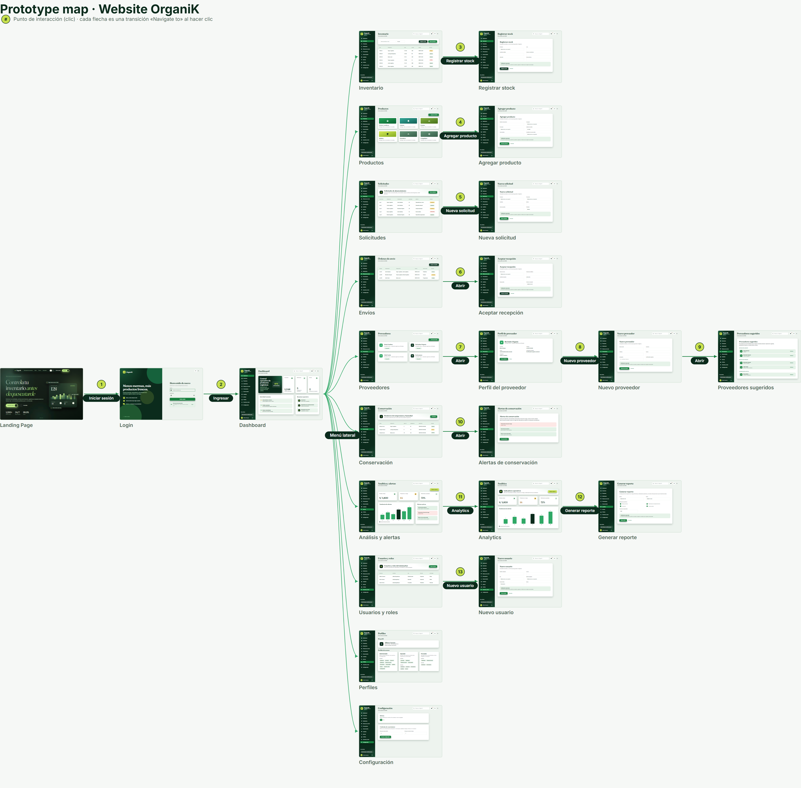

## 4.6. Domain-Driven Software Architecture.

La arquitectura propuesta de OrganiK se construye a partir del análisis del dominio de gestión de productos orgánicos, inventario, conservación y abastecimiento para minimarkets y proveedores. Los bounded contexts delimitan responsabilidades de diseño. El flujo de referencia es el definido en los capítulos I y III: el proveedor crea un pedido dirigido al minimarket y solo el administrador destinatario puede aceptarlo o rechazarlo antes de modificar su inventario.

En las siguientes secciones se presenta cada nivel del modelo arquitectónico y la relación entre sus elementos.

### 4.6.1. Design-Level Event Storming.

Para identificar eventos y reglas de negocio, el Event Storming examina registro de productos, control de inventario, conservación, necesidades de reposición, pedidos propuestos por proveedores, decisiones del administrador y alertas.

El desarrollo del proceso de Domain-Driven Design se realizó en Lucidchart: [https://lucid.app/lucidchart/bc1299f7-d185-4b18-9730-34001b6b8c26/edit?invitationId=inv_71264c50-e7df-4ffe-9b92-f4fd5c1bf3d5&page=8YLvPajJeQAxO#](https://lucid.app/lucidchart/bc1299f7-d185-4b18-9730-34001b6b8c26/edit?invitationId=inv_71264c50-e7df-4ffe-9b92-f4fd5c1bf3d5&page=8YLvPajJeQAxO#)

A continuación, se presentan la leyenda utilizada y las relaciones clave entre los bounded contexts identificados:

A partir de este análisis se identificaron los siguientes bounded contexts:

1. **IAM**

   El bounded context IAM se encarga de la autenticación, autorización y control de acceso dentro de OrganiK. Gestiona usuarios, roles y permisos, asegurando que cada actor, como el administrador de minimarket o el proveedor, acceda únicamente a las funcionalidades correspondientes a su perfil.

   

2. **Profiles**

   El bounded context Profiles administra la información de los usuarios, minimarkets y proveedores registrados en la plataforma. Su propósito es centralizar los datos de perfil necesarios para personalizar la experiencia, controlar responsabilidades y asociar operaciones con el actor correspondiente.

   

3. **Dashboard**

   El bounded context Dashboard presenta una vista general del estado operativo de la plataforma según el rol del usuario. Permite visualizar indicadores relevantes sobre inventario, abastecimiento, conservación, alertas y actividad reciente.

   

4. **Analytics**

   El bounded context Analytics procesa información operativa para generar indicadores, métricas y resúmenes que apoyan la toma de decisiones. Permite analizar el estado del inventario, productos próximos a vencer, alertas de conservación, desempeño de proveedores y movimientos de abastecimiento.

   

5. **Inventory**

   El bounded context Inventory gestiona los productos registrados en el minimarket, sus cantidades, lotes, fechas de vencimiento, estados y movimientos asociados. Su propósito es mantener trazabilidad sobre las existencias y facilitar el control de productos disponibles, en riesgo o con pérdidas.

   

6. **Products**

   El bounded context Products administra el catálogo de productos orgánicos ofrecidos por proveedores o registrados por minimarkets. Centraliza información como nombre, categoría, descripción, unidad de medida, disponibilidad y datos relevantes para su comercialización o abastecimiento.

   

7. **Requisition**

   El bounded context Requisition registra necesidades de reposición que el administrador puede compartir con proveedores vinculados. Una necesidad no constituye un pedido ni modifica el inventario; corresponde a US 018 y US 020 del capítulo III.

   

8. **Procurements**

   El bounded context Procurements gestiona los pedidos creados por proveedores, su estado y la decisión del administrador destinatario. La aceptación registra la decisión y actualiza el inventario una sola vez; el rechazo conserva las existencias. En este alcance no se define una orden de envío separada.

   

9. **Suppliers**

   El bounded context Suppliers gestiona el directorio de proveedores de productos orgánicos, así como los productos que ofrecen y su participación dentro de los procesos de abastecimiento.

   

10. **Conservation**

   El bounded context Conservation permite monitorear condiciones de conservación de productos, como temperatura y humedad. Su propósito es identificar riesgos de deterioro y generar alertas cuando las condiciones se encuentren fuera de los rangos aceptables.

   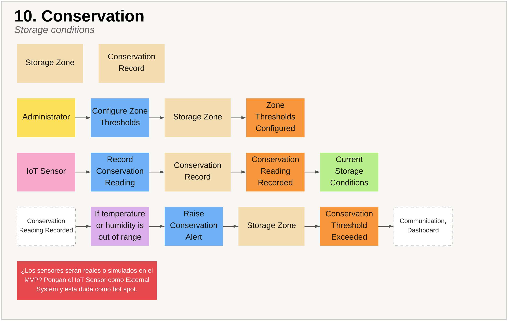

11. **Communication**

   El bounded context Communication gestiona alertas y notificaciones propuestas para vencimientos, condiciones de conservación, necesidades de reposición compartidas y cambios de estado de los pedidos.

   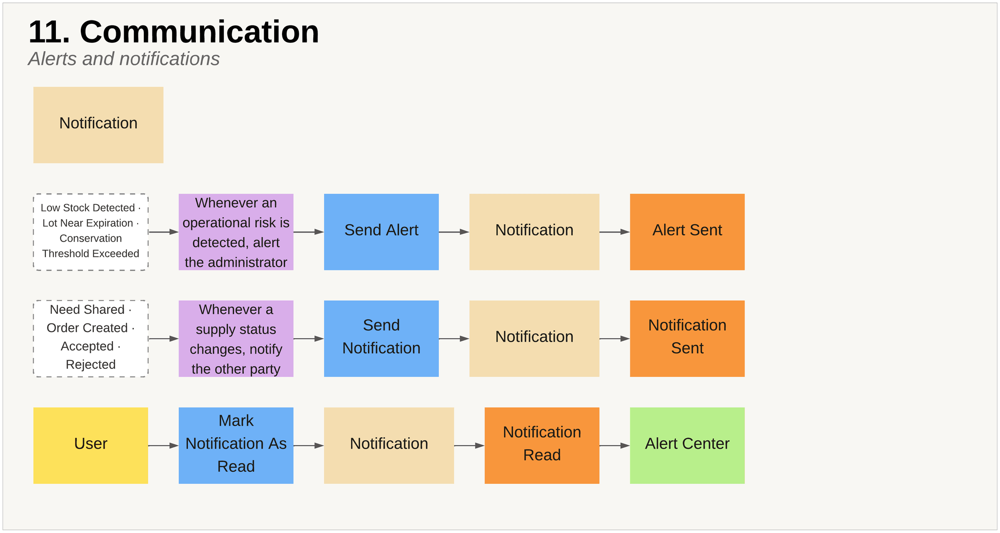

12. **Shared Kernel**

   El bounded context Shared Kernel contiene elementos comunes utilizados por los demás contextos, como utilidades compartidas, contratos base, configuraciones, validaciones comunes y estructuras transversales del sistema.

   

### 4.6.2. Software Architecture Context Diagram.

En este nivel se presenta una vista de alto nivel de la arquitectura, donde el foco está en el sistema OrganiK como una caja negra y en las interacciones que mantiene con sus usuarios y servicios externos.

El context diagram muestra al **OrganiK Software System** como el sistema central, rodeado por los principales actores y sistemas con los que interactúa:

- **Administrador de minimarket**: registra productos y lotes, consulta conservación y disponibilidad, comparte necesidades de reposición y acepta o rechaza los pedidos dirigidos a su negocio.
- **Proveedor de productos orgánicos**: mantiene catálogo, lotes y disponibilidad; consulta necesidades compartidas, crea pedidos dirigidos a minimarkets y sigue su estado.
- **Administrador del sistema**: usuario encargado de gestionar cuentas, roles, permisos y configuración general de la plataforma.
- **Servicio de notificaciones**: integración propuesta para avisos de vencimientos, conservación y decisiones sobre pedidos.
- **Servicio de monitoreo de conservación**: fuente futura de lecturas de temperatura y humedad; los flujos iniciales se validarán con datos simulados.

En el diagrama se representan las relaciones entre estos elementos, destacando que los actores humanos interactúan con OrganiK mediante la aplicación web, mientras que el sistema coordina los procesos internos y las integraciones necesarias para alertas, monitoreo y trazabilidad operativa.

---

### 4.6.3. Software Architecture Container Diagrams.

En el nivel de contenedores, la arquitectura de OrganiK se organiza en aplicaciones y fuentes de datos que colaboran para brindar la experiencia completa de la plataforma.

La arquitectura lógica de OrganiK se estructura en los siguientes contenedores:

- **Landing Page**: aplicación web pública orientada a presentar la propuesta de valor de OrganiK, sus beneficios y funcionalidades principales para minimarkets y proveedores de productos orgánicos.
- **Single Page Application (SPA)**: aplicación web propuesta en Angular para inventario, productos, proveedores, necesidades de reposición, pedidos, conservación, dashboards, perfiles e IAM.
- **API REST Application**: backend encargado de exponer los servicios de negocio mediante endpoints REST. Centraliza la lógica de aplicación, validaciones, reglas de dominio y coordinación entre bounded contexts.
- **Database**: persistencia propuesta para usuarios, perfiles, productos, inventario, lotes, necesidades de reposición, pedidos, decisiones, proveedores, alertas y lecturas de conservación.

En el diagrama se observa que:

- Los usuarios pueden conocer la solución mediante la **Landing Page** y luego acceder a la **SPA**.
- La **SPA** se comunica con la **API REST Application** mediante peticiones HTTP/HTTPS y mensajes JSON.
- La **API REST Application** procesa la lógica del dominio y persiste la información en la **Database**.
- Los módulos de comunicación y conservación pueden integrarse con servicios externos para notificaciones y monitoreo de condiciones ambientales.

---

### 4.6.4. Software Architecture Components Diagrams.

En el nivel de componentes se detalla la descomposición interna de la arquitectura de OrganiK, especialmente del contenedor **API REST Application**, donde se agrupan los componentes principales alineados con los bounded contexts del dominio.

La API REST organiza sus responsabilidades en componentes especializados:

- **IAM Component**: gestiona autenticación, autorización, usuarios, roles y permisos.
- **Profiles Component**: administra perfiles de usuarios, minimarkets y proveedores.
- **Dashboard Component**: consolida información relevante para mostrar vistas generales según el rol del usuario.
- **Analytics Component**: procesa indicadores, métricas y reportes operativos.
- **Inventory Component**: gestiona inventario, lotes, cantidades, vencimientos, pérdidas y ofertas.
- **Products Component**: administra el catálogo de productos orgánicos registrados u ofrecidos.
- **Requisition Component**: gestiona necesidades de reposición compartidas por minimarkets.
- **Procurements Component**: administra pedidos propuestos por proveedores, decisiones del administrador y actualización controlada del inventario.
- **Suppliers Component**: gestiona proveedores y sus productos ofrecidos.
- **Conservation Component**: monitorea condiciones de conservación y detecta riesgos.
- **Communication Component**: administra alertas y notificaciones del sistema.
- **Shared Kernel Component**: agrupa elementos transversales reutilizados por los demás componentes.

#### API REST Component Diagram

#### IAM Component Diagram

#### Profiles Component Diagram

#### Dashboard Component Diagram

#### Analytics Component Diagram

#### Inventory Component Diagram

#### Products Component Diagram

#### Requisition Component Diagram

#### Procurements Component Diagram

#### Suppliers Component Diagram

#### Conservation Component Diagram

#### Communication Component Diagram

#### Shared Kernel Component Diagram

De esta forma, los component diagrams complementan la visión general de la arquitectura, mostrando cómo OrganiK organiza sus responsabilidades internas en componentes coherentes con el dominio y cómo estos colaboran para implementar la gestión de productos orgánicos, inventario, conservación, abastecimiento, proveedores, comunicación y analítica.

## 4.7. Software Object-Oriented Design.

En esta sección se presenta el diseño orientado a objetos de OrganiK, representando la estructura de clases principales del sistema y su organización por bounded contexts. Estos diagramas permiten visualizar las responsabilidades de cada clase, sus atributos, métodos y relaciones dentro de la arquitectura de la aplicación.

### 4.7.1. Class Diagrams.

Los diagramas de clases muestran la organización interna de los componentes principales de OrganiK, siguiendo una estructura alineada con los bounded contexts definidos previamente. Cada diagrama representa las clases más relevantes dentro de un módulo específico, permitiendo comprender cómo se modelan los conceptos del dominio y cómo se relacionan con la lógica de aplicación.

A continuación, se presenta el diagrama general de clases del sistema:

Además, se presentan los diagramas de clases correspondientes a los principales bounded contexts de OrganiK:

#### Profiles Class Diagram

#### Communication Class Diagram

#### Conservation Class Diagram

#### Analytics Class Diagram

#### Dashboard Class Diagram

#### IAM Class Diagram

#### Shared Class Diagram

Estos diagramas permiten complementar la arquitectura de software, mostrando una vista más detallada del diseño orientado a objetos de OrganiK. A través de ellos se puede identificar cómo se distribuyen las responsabilidades entre entidades, servicios, componentes de presentación, stores de aplicación e infraestructura.

---

## 4.8. Database Design.

El diseño de base de datos propuesto considera usuarios, perfiles, productos, inventario, proveedores, necesidades de reposición, pedidos y decisiones, conservación, comunicación, analítica y auditoría.

La base de datos se encuentra organizada de acuerdo con los bounded contexts definidos en la arquitectura del sistema, permitiendo mantener una separación lógica entre las distintas áreas funcionales. Esta organización facilita la trazabilidad de la información, la consistencia de los datos y la evolución del sistema conforme se incorporen nuevas funcionalidades.

### 4.8.1. Database Diagrams.

El diagrama de base de datos muestra las entidades principales de OrganiK, sus atributos, claves primarias, claves foráneas y relaciones. Esta vista permite comprender cómo se almacena la información del sistema y cómo se conectan los distintos procesos de negocio a nivel de persistencia.

---

# Capítulo V: Product Implementation, Validation & Deployment

## 5.1. Software Configuration Management.

En esta sección se describen las decisiones, convenciones y principios adoptados por el equipo de **OrganiK** para garantizar la coherencia, trazabilidad y control de versiones durante el ciclo de vida del desarrollo de la solución **OrganiK**. Se establecen los lineamientos para la configuración del entorno de desarrollo, la gestión del código fuente, las convenciones de estilo y la configuración de despliegue de la landing page.

### 5.1.1. Software Development Environment Configuration.

Se especifican los productos de software utilizados durante el ciclo de vida del proyecto, organizados por disciplinas técnicas para asegurar la estandarización del entorno entre los desarrolladores de **OrganiK**.

#### Project Management

* **Trello:** Empleado para la organización visual del flujo de trabajo diario, priorización de tareas y seguimiento del avance de las secciones de la landing page.
  * **Ruta:** `https://trello.com/invite/b/6aaf94c8244f819349bf0de9/ATTI96869889ee148c22847a13480770254571767922/sprint-backlog-1-organik`

* **UXPressia:** Utilizado para la construcción de los artefactos de UX, como los User Personas, Journey Maps e Impact Maps.
  * Ruta: `https://uxpressia.com`

#### Product UX/UI Design

* **Miro:** Pizarra colaborativa utilizada para organizar ideas, flujos de usuario y estructura general.
  * Ruta: `https://miro.com`
* **Figma:** Herramienta principal para el diseño visual, definición de jerarquía de contenido, componentes UI y wireframes.
  * Ruta: `https://www.figma.com`
* **Structurizr:** Utilizado para apoyar el modelado de arquitectura mediante diagramas de alto nivel C4 Model.
  * Ruta: `https://structurizr.com`

#### Software Development

#### Software Development
* **GitHub:** Hosting del repositorio de código fuente y control de versiones.
  * Ruta: `https://github.com`
* **WebStorm:** IDE utilizado para el desarrollo de la aplicación.
  * Ruta: `https://www.jetbrains.com/webstorm/`
* **Angular 22:** Framework utilizado para construir las interfaces web de OrganiK.
  * Ruta: `https://angular.dev`
* **TypeScript:** Lenguaje principal para la implementación de componentes y lógica.
  * Ruta: `https://www.typescriptlang.org`
* **Angular Material:** Librería de componentes de interfaz web.
  * Ruta: `https://material.angular.io`
* **@ngx-translate:** Librería utilizada para la internacionalización en español e inglés.
  * Ruta: `https://github.com/ngx-translate/core`
* **HTML/CSS:** Tecnologías utilizadas para la maquetación, estructura visual y estilos responsivos.
  * Ruta: `https://developer.mozilla.org/en-US/docs/Web/HTML` and `https://developer.mozilla.org/en-US/docs/Web/CSS`

#### Software Testing
* **Vitest / Angular Test Runner:** Utilizado para validar el renderizado de secciones principales y pruebas unitarias básicas.
  * Ruta: `https://vitest.dev`

#### Database Design
* **MySQL Workbench:** Herramienta visual empleada para el modelado, diseño de diagramas y administración de la base de datos relacional.
  * Ruta: `https://www.mysql.com/products/workbench/`

#### Software Deployment
* **Firebase Hosting:** Plataforma en la nube de Google utilizada para el despliegue rápido y seguro tanto de la Landing Page estática como de la Frontend Web Application.
  * Ruta: `https://firebase.google.com`
* **Google Cloud / Firebase:** Infraestructura utilizada para el despliegue de los Backend Web Services.
  * Ruta: `https://cloud.google.com`

#### Software Documentation
* **Markdown:** Utilizado para documentar el proyecto, la configuración y decisiones técnicas.
  * Ruta: `https://www.markdownguide.org`

---

### 5.1.2. Source Code Management.

Se establecen los repositorios oficiales de la solución **OrganiK** para garantizar la integridad del código fuente.

#### Repositorios del Proyecto

<table>
  <thead>
    <tr>
      <th>Producto</th>
      <th>URL del Repositorio</th>
    </tr>
  </thead>
  <tbody>
    <tr>
      <td>Project Report OrganiK</td>
      <td><a href="https://github.com/5Bits-OrganiK/project-report.git">https://github.com/5Bits-OrganiK/project-report.git</a></td>
    </tr>
    <tr>
      <td>Landing Page OrganiK</td>
      <td><a href="https://github.com/5Bits-OrganiK/organik-landing-page-static.git">https://github.com/5Bits-OrganiK/organik-landing-page-static.git</a></td>
    </tr>
    <tr>
      <td>Frontend Web Application OrganiK</td>
      <td><a href="https://github.com/5Bits-OrganiK/organik-web-application.git">https://github.com/5Bits-OrganiK/organik-web-application.git</a></td>
    </tr>
    <tr>
      <td>Backend Web Services OrganiK</td>
      <td><a href="https://github.com/5Bits-OrganiK/organik-backend.git">https://github.com/5Bits-OrganiK/organik-backend.git</a></td>
    </tr>
  </tbody>
</table>

#### GitFlow Workflow and Collaboration Strategy

Para asegurar una colaboración organizada, evitar conflictos en el código y mantener una integración continua clara, el equipo de **OrganiK** aplica una estrategia basada en ramas para el desarrollo de la landing page.

La estrategia de colaboración se define de la siguiente manera:

- **main:** Rama que contiene la versión estable y lista para producción de la landing page. Solo recibe integraciones finales cuando los cambios han sido revisados, probados y aprobados.

- **develop:** Rama principal de integración. En esta rama se unifican las funcionalidades terminadas antes de ser promovidas a `main`.

- **feature/<section>:** Ramas temporales creadas a partir de `develop` para aislar el desarrollo de cada sección o mejora de la landing page.

  Ejemplos:
  - `feature/home-section`
  - `feature/product-information-section`
  - `feature/video-section`
  - `feature/pricing-section`
  - `feature/starter-section`

- **hotfix/<issue>:** Ramas creadas desde `main` para corregir errores críticos detectados en la versión estable de la landing page.

El flujo de trabajo establece que cada rama `feature` debe integrarse mediante **Pull Request (PR)**, permitiendo revisión de código antes de aprobar la integración.

Cada commit debe seguir la convención de **Conventional Commits**, permitiendo una trazabilidad clara de los cambios realizados en el proyecto.

Ejemplos:

- `feat(landing): build organik landing page`
- `fix(app): enable zoneless change detection`
- `fix(videos): update team embed url`
- `fix(videos): show youtube previews`
- `fix(brand): align assets with organik name`
- `refactor(app): move landing features to app root`

---

### 5.1.3. Source Code Style Guide & Conventions.

En esta sección se establecen las convenciones de estilo y nomenclatura adoptadas para los lenguajes utilizados en el proyecto **OrganiK**: HTML, CSS, TypeScript y Angular. Se aplica nomenclatura en inglés para los elementos del código, manteniendo coherencia con el dominio de la landing page y la plataforma.

#### Referencias de Guías de Estilo Adoptadas

| Lenguaje/Tecnología | Guía de Estilo |
| :--- | :--- |
| HTML/CSS | [Google HTML/CSS Style Guide](https://google.github.io/styleguide/htmlcssguide.html) |
| TypeScript | [Google TypeScript Style Guide](https://google.github.io/styleguide/tsguide.html) |
| Angular | [Angular Style Guide](https://angular.dev/style-guide) |
| Spring Boot | [Spring Boot Features](https://spring.io/projects/spring-boot) |
| Java | [Google Java Style Guide](https://google.github.io/styleguide/javaguide.html) |
| Conventional Commits | [Conventional Commits](https://www.conventionalcommits.org/) |

Se utiliza nomenclatura en inglés relacionada con las entidades del dominio de la landing page y la plataforma **OrganiK**, manteniendo nombres claros, consistentes y alineados al producto.

| Elemento | Convención | Ejemplo |
| :--- | :--- | :--- |
| Componentes Angular | PascalCase | `HomeSection`, `PricingSection` |
| Archivos de componentes | kebab-case | `home-section.ts`, `pricing-section.ts` |
| Archivos de estilos CSS | kebab-case | `home-section.css`, `pricing-section.css` |
| Variables / Métodos TS | camelCase | `currentLang`, `useLanguage()` |
| Constantes | SCREAMING_SNAKE_CASE | `DEFAULT_LOCALE`, `STARTER_EMAIL` |
| Rutas / IDs de secciones | kebab-case | `product-information`, `starter` |
| Claves de i18n | camelCase / dot.case | `home.title`, `pricing.plans.basic.name` |
| Ramas Git feature | kebab-case | `feature/home-section`, `feature/starter-section` |
| Commits | Conventional Commits | `feat(landing): build organik landing page` |

#### Sangría y Formato

* Se aplica una indentación de dos espacios para archivos web: HTML, CSS y TypeScript.
* Las llaves de apertura en TS/JS se colocan en la misma línea, siguiendo el estilo K&R.
* Los nombres de carpetas y archivos se mantienen en `kebab-case`.
* La estructura de features se organiza directamente dentro de `src/app`.

---

### 5.1.4. Software Deployment Configuration.

Se especifican los pasos y recursos de configuración de despliegue para asegurar que la plataforma **OrganiK** sea completamente accesible en sus diferentes productos.

#### Landing Page (Firebase Hosting)
1. **Preparación:** Clonación del repositorio `organik-landingpage` y configuración local.
2. **Construcción:** Ejecución del comando de compilación de Angular (`ng build`) para generar los archivos estáticos optimizados.
3. **Despliegue:** Uso del CLI de Firebase (`firebase deploy --only hosting`) para cargar el código compilado en la nube.
* **URL de producción:** https://organik-d6e58.web.app/

#### Frontend Web Application (Firebase Hosting)
1. **Preparación:** Integración de los últimos cambios de Angular en la rama `main` del repositorio `organik-frontend`.
2. **Construcción:** Configuración del archivo de entorno (variables de entorno) para apuntar al backend público, y compilación del proyecto para producción (`ng build --configuration production`).
3. **Despliegue:** Uso del CLI de Firebase (`firebase deploy --only hosting`) para cargar la plataforma interactiva en la nube.
* **URL de producción:** https://organik-app-d6e58.web.app/

---

## 5.2. Landing Page, Services & Applications Implementation.

### 5.2.1. Sprint 1

---

#### 5.2.1.1. Sprint Planning 1.

| **Sprint Planning Sprint 1** |  |
|---|---|
| **Sprint Planning Background** |  |
| Date | 05/04/2026 |
| Time | 10:00 p.m. |
| Location | Discord / WhatsApp |
| Prepared By | Albino Florencio Cáceres Pizarro |
| Attendees | Albino Florencio Cáceres Pizarro Cielo Valentina Atencio Cristobal Gustavo Alonso Olivares Lao Andre Sebastian Quispe Almonacid Alexis Calin Torres Huaman |
| **Sprint Goal & User Stories** |  |
| **Sprint 1 Goal** | Entregar la landing page de **OrganiK** para comunicar a administradores de minimarkets y proveedores la propuesta de inventario, lotes, conservación y abastecimiento. El objetivo de US00 es que un visitante sin sesión pueda recorrer Home, Product Description, Videos, Plans y Starter y encontrar un medio de contacto. |
| User Story comprometida | US00: Conocer OrganiK en la landing page (5 Story Points, según Product Backlog del capítulo III). |
| Capacidad de planificación consignada | 14 Story Points. |

  <strong>Repositorio:</strong>
  <a href="https://github.com/5Bits-OrganiK/organik-landingpage.git">
   https://github.com/5Bits-OrganiK/organik-landingpage.git
  </a>

---

#### 5.2.1.2. Aspect Leaders and Collaborators.

Esta matriz <strong>LACX</strong> identifica los aspectos principales del sprint y asigna responsabilidades de Líder (L) y Colaborador (C) para organizar al equipo durante el desarrollo de la landing page de <strong>OrganiK</strong>. 
<strong>Albino Florencio Cáceres Pizarro</strong>, como líder del equipo, supervisa y coordina los principales aspectos del desarrollo, mientras que los demás integrantes participan como colaboradores en las diferentes actividades del sprint.

<table border="1" cellpadding="4" cellspacing="0" align="center">
  <thead>
    <tr>
      <th>Team Member</th>
      <th>Student Code</th>
      <th>Aspect: UI/UX & Visual Design</th>
      <th>Aspect: Angular Structure & Components</th>
      <th>Aspect: Content & i18n</th>
      <th>Aspect: GitFlow & Deployment</th>
    </tr>
  </thead>
  <tbody>
    <tr>
      <td>Atencio Cristobal, Cielo Valentina</td>
      <td>U202424216</td>
      <td>C</td>
      <td>C</td>
      <td>C</td>
      <td>C</td>
    </tr>
    <tr>
      <td>Cáceres Pizarro, Albino Florencio</td>
      <td>U201923820</td>
      <td>L</td>
      <td>L</td>
      <td>L</td>
      <td>L</td>
    </tr>
    <tr>
      <td>Olivares Lao, Gustavo Alonso</td>
      <td>U202216448</td>
      <td>C</td>
      <td>C</td>
      <td>C</td>
      <td>C</td>
    </tr>
    <tr>
      <td>Quispe Almonacid, Andre Sebastian</td>
      <td>U201815005</td>
      <td>C</td>
      <td>C</td>
      <td>C</td>
      <td>C</td>
    </tr>
    <tr>
      <td>Torres Huaman, Alexis Calin</td>
      <td>U20241G152</td>
      <td>C</td>
      <td>C</td>
      <td>C</td>
      <td>C</td>
    </tr>
  </tbody>
</table>

---

#### 5.2.1.3. Sprint Backlog 1.

El Sprint Backlog agrupa las tareas iniciales correspondientes al diseño, desarrollo y documentación de la landing page de **OrganiK**, producto orientado a la gestión de inventario, lotes, conservación y abastecimiento de productos orgánicos para minimarkets.

Las tareas T001-T007 descomponen la historia **US00** descrita en el Product Backlog del capítulo III.

  
  
<em>Figura: Tablero del Sprint 1 en Trello, herramienta de gestión del proyecto OrganiK.</em>

| User Story Id | Componente de US00 | Task Id | Engineering Task | Description | Estimation (Hours) | Assigned To | Status |
| :--- | :--- | :--- | :--- | :--- | :--- | :--- | :--- |
| **US00** | Landing Page Base | T001 | Implementación de Home Section | Desarrollo de la sección principal de la landing page en Angular, presentando la propuesta de valor de OrganiK para minimarkets orgánicos. | 4h | Cáceres Pizarro, Albino Florencio | Done |
| **US00** | Product Information | T002 | Maquetación de descripción del producto | Implementación de la sección informativa sobre inventario, lotes, alertas de conservación, pedidos y accesos por rol. | 4h | Atencio Cristobal, Cielo Valentina | Done |
| **US00** | Videos Section | T003 | Implementación de sección de videos | Desarrollo del apartado visual para presentar al equipo y mostrar el funcionamiento general de OrganiK mediante videos embebidos. | 3h | Olivares Lao, Gustavo Alonso | Done |
| **US00** | Pricing Section | T004 | Implementación de planes | Maquetación de los planes Básico, Profesional y Empresarial, incluyendo precios, beneficios y llamadas a la acción. | 3h | Quispe Almonacid, Andre Sebastian | Done |
| **US00** | Starter Section | T005 | Implementación de sección de suscripción | Desarrollo de la sección Starter/Suscribirse con formulario para que los minimarkets interesados puedan iniciar el proceso de adopción de OrganiK. | 4h | Torres Huaman, Alexis Calin | Done |
| **US00** | Landing Page Architecture | T006 | Organización por features y estructura Angular | Refactorización de carpetas siguiendo una arquitectura organizada por features dentro de `src/app`, separando componentes, estilos, assets e internacionalización. | 5h | Cáceres Pizarro, Albino Florencio | Done |
| **US00** | GitFlow Setup | T007 | Configuración de commits y control de versiones | Organización incremental del trabajo mediante Git y commits aplicando Conventional Commits. | 3h | Cáceres Pizarro, Albino Florencio | Done |

| Criterio de aceptación de US00 (capítulo III) | Tareas relacionadas | Evidencia consignada en 5.2.1.5 |
|---|---|---|
| Presentar la propuesta para administradores y proveedores | T001, T002 | Capturas Home y Product Information |
| Permitir navegar secciones públicas sin sesión | T001, T003, T004, T005 | Capturas de Home, Videos, Plans y Starter |
| Ofrecer un medio de contacto | T005 | Captura de Starter |
| Mantener una entrega técnica reproducible | T006, T007 | Repositorio y registros de desarrollo en 5.2.1.4 |

---

#### 5.2.1.4. Development Evidence for Sprint Review.

  Durante el Sprint 1 se implementó y desplegó la primera versión de la Landing Page de <strong>OrganiK</strong>. A continuación se resumen los commits más relevantes del repositorio de la Landing Page, siguiendo Conventional Commits y GitFlow; el detalle completo está en el historial del repositorio.

<table border="1" cellpadding="4" cellspacing="0">
  <thead>
    <tr>
      <th>Repository</th>
      <th>Branch</th>
      <th>Commit Id</th>
      <th>Commit Message</th>
      <th>Commit Message Body</th>
      <th>Committed on</th>
    </tr>
  </thead>
  <tbody>
    <tr>
      <td>5Bits-OrganiK/organik-landing-page-static</td>
      <td>main</td>
      <td><code>e23d611</code></td>
      <td>chore: initial commit</td>
      <td>Inicializa el repositorio de la Landing Page.</td>
      <td>07-10-2026</td>
    </tr>
    <tr>
      <td>5Bits-OrganiK/organik-landing-page-static</td>
      <td>feature/landing-page-html</td>
      <td><code>3ac25f6</code></td>
      <td>feat(landing-page): created the principal HTML of the landing page</td>
      <td>Estructura HTML principal de la Landing Page.</td>
      <td>07-10-2026</td>
    </tr>
    <tr>
      <td>5Bits-OrganiK/organik-landing-page-static</td>
      <td>feature/i18n-configuration</td>
      <td><code>a326659</code></td>
      <td>feat(i18n): create i18n for english and spanish translation for the landing page</td>
      <td>Traducciones al inglés y español de la Landing Page.</td>
      <td>07-10-2026</td>
    </tr>
    <tr>
      <td>5Bits-OrganiK/organik-landing-page-static</td>
      <td>feature/team-profiles-images-and-icons</td>
      <td><code>76240a9</code></td>
      <td>feat(images-and-logo): insert the team profiles images for the landing page and logo of organik</td>
      <td>Fotos de perfil del equipo y logo de OrganiK.</td>
      <td>07-10-2026</td>
    </tr>
  </tbody>
</table>

---

### 5.2.1.5. Execution Evidence for Sprint Review.

Durante el Sprint 1, el equipo logró implementar con éxito el diseño, maquetación y despliegue de la nueva versión de la Landing Page de **OrganiK**. A continuación, se presentan las evidencias visuales de la ejecución del producto de software, demostrando el cumplimiento de los Criterios de Aceptación de las Historias de Usuario planificadas y la correcta adaptación de la plataforma al idioma inglés.

#### Evidencia 1: Home Section y Propuesta de Valor
Se desarrolló la pantalla de inicio principal destacando la propuesta de valor de OrganiK: controlar el inventario antes de que sea tarde. El diseño presenta una interfaz oscura con un dashboard visual interactivo y componentes que ilustran el estado del stock en tiempo real.

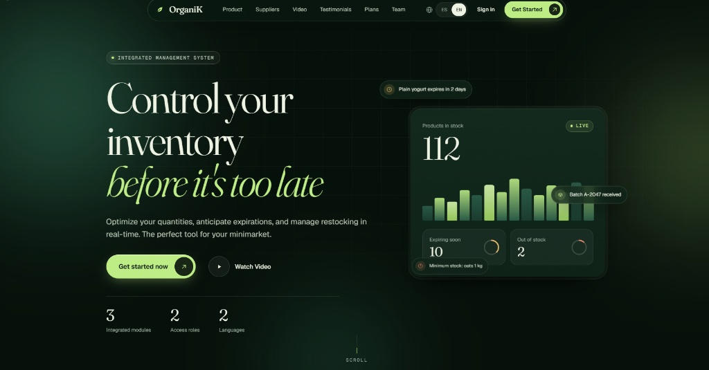
*Figura: Vista principal de OrganiK desplegada en la Landing Page.*

#### Evidencia 2: Características del Producto (Features)
Se maquetó la sección informativa donde se presentan las principales capacidades de OrganiK mediante tarjetas UI, incluyendo inventario centralizado, control de lotes por código, alertas inteligentes y fechas de caducidad.

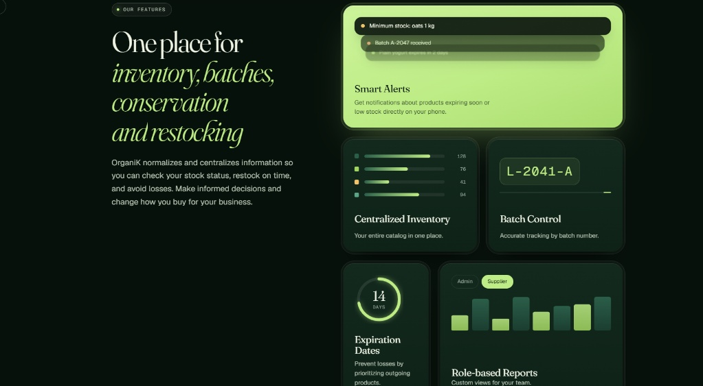
*Figura: Sección de características y funcionalidades principales.*

#### Evidencia 3: Módulo para Proveedores (Suppliers)
Se implementó una sección dedicada exclusivamente a los proveedores ("Reach more minimarkets"), comunicando cómo la plataforma les permite publicar su catálogo orgánico, recibir necesidades de reabastecimiento de los minimarkets y gestionar pedidos en un solo lugar.

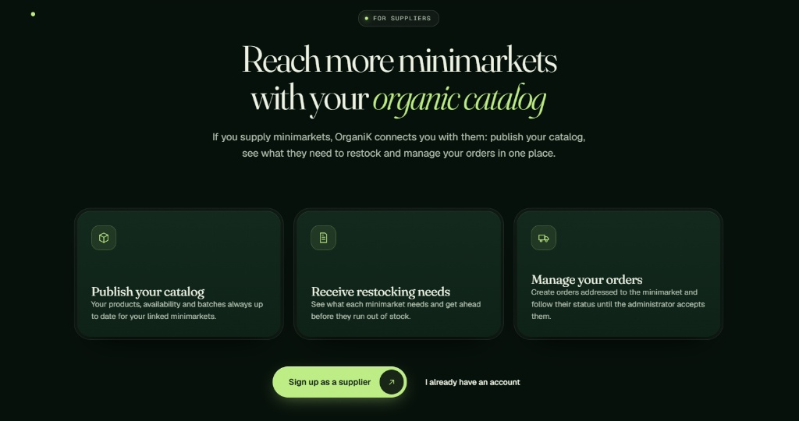
*Figura: Sección dedicada a los proveedores de minimarkets.*

#### Evidencia 4: Demostración del Producto (Product Video)
Se integró un apartado audiovisual ("See OrganiK in action") diseñado para incrustar material de video demostrativo. Esta sección permite explicar visualmente cómo la solución centraliza los procesos operativos del minimarket.

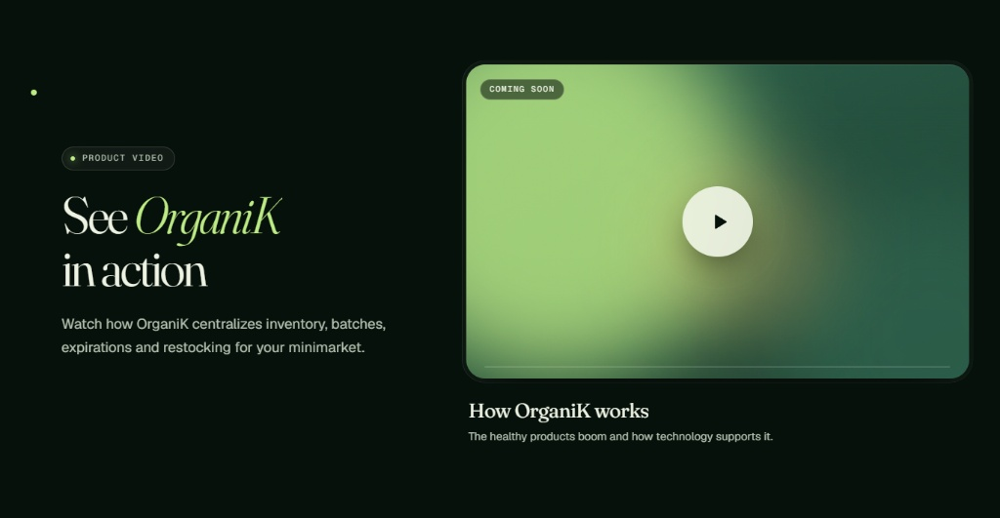
*Figura: Sección de video demostrativo del producto.*

#### Evidencia 5: Testimonios de Usuarios (Testimonials)
Se desarrolló una sección de validación social ("What minimarkets are saying") que muestra comentarios de clientes y proveedores ficticios, destacando métricas de éxito como la reducción de desperdicios y el ahorro de tiempo semanal.

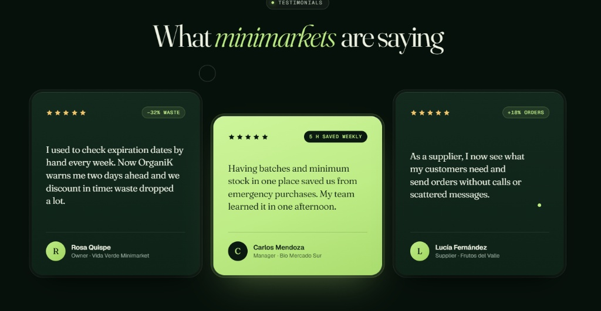
*Figura: Sección de testimonios de usuarios de OrganiK.*

#### Evidencia 6: Planes Comerciales (Pricing)
Se diseñó la vista de planes de suscripción ("A plan for every minimarket size"), presentando las alternativas Basic, Professional y Enterprise. La interfaz permite cambiar entre planes para minimarkets y proveedores mediante un selector interactivo.

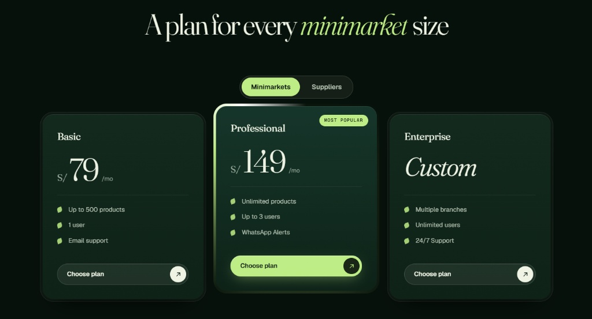
*Figura: Sección de planes de suscripción disponibles.*

#### Evidencia 7: Presentación del Equipo (The Team)
Se desarrolló una sección detallada ("The people behind OrganiK") para presentar a los cinco miembros del equipo responsable del desarrollo. Cada tarjeta incluye la fotografía, nombre, código de estudiante y una cita sobre su enfoque en la construcción del producto.

*Figura: Perfiles de los miembros del equipo de OrganiK.*

#### Evidencia 8: Llamado a la Acción y Suscripción (Starter)
Se construyó la sección de cierre orientada a la conversión ("Take control of your minimarket with OrganiK"). Incluye un botón de inicio de sesión directo, un gráfico de radar temático y el pie de página con enlaces a políticas de privacidad.

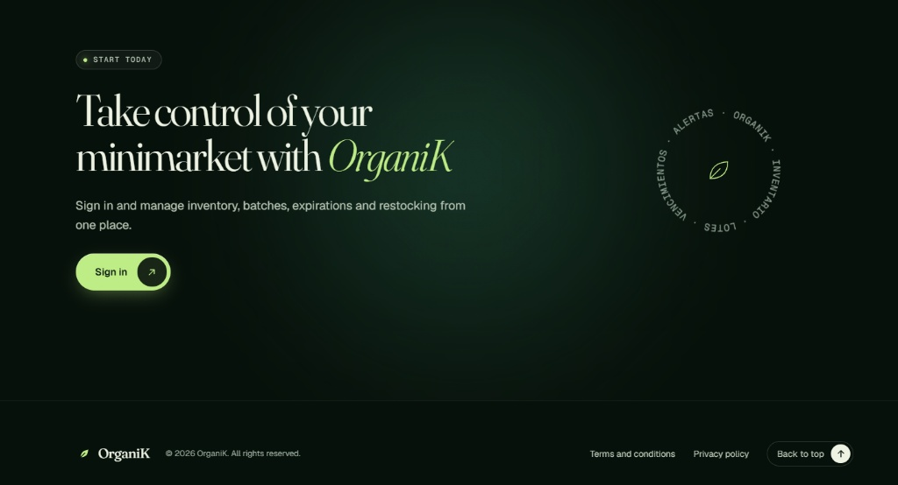
*Figura: Sección final de llamado a la acción y pie de página.*

---

### 5.2.1.6. Services Documentation Evidence for Sprint Review.

Dado que el alcance del Sprint 1 se centró exclusivamente en el diseño, maquetación y despliegue de la Landing Page estática, la implementación y documentación de los servicios Backend (API RESTful) se abordarán a partir del Sprint 2. Por lo tanto, la evidencia de documentación de servicios (Swagger/OpenAPI) se incluirá en las siguientes iteraciones.

#### 5.2.1.7. Software Deployment Evidence for Sprint Review.

Durante el Sprint 1 se configuró Firebase Hosting como proveedor cloud para desplegar la primera versión de la Landing Page de **OrganiK**. El proyecto se compila y se publica con el CLI de Firebase (`firebase deploy --only hosting`), tal como se describe en la sección 5.1.4. La Web Application y los Web Services se despliegan a partir del Sprint 2 y Sprint 3, respectivamente.

* **Repositorio:** https://github.com/5Bits-OrganiK/organik-landing-page-static
* **Entorno local:** http://localhost:4200/
* **URL de Producción:** https://organik-d6e58.web.app/

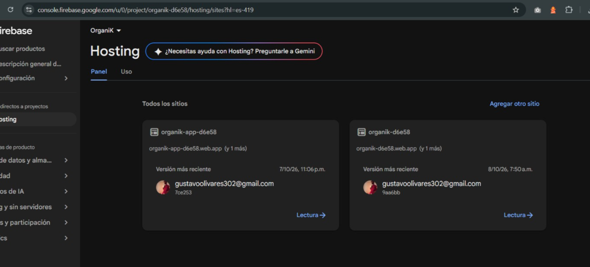
*Figura: Landing Page de OrganiK desplegada exitosamente en Firebase Hosting.*

---

#### 5.2.1.8. Team Collaboration Insights during Sprint.

  Durante este primer sprint, el esfuerzo principal del equipo de <strong>OrganiK</strong> se centró en la estructuración del proyecto, el diseño UX/UI, la implementación de la landing page, la organización de commits mediante Conventional Commits y la documentación inicial del producto <strong>OrganiK</strong>. Por lo tanto, las evidencias de colaboración presentadas a continuación corresponden al trabajo realizado para construir la presencia digital inicial del producto.

  En primer lugar, el <strong>Historial de Commits</strong> del repositorio demuestra que el trabajo fue organizado mediante cambios incrementales y commits siguiendo la convención de <strong>Conventional Commits</strong>. Durante el sprint se realizaron cambios relacionados con la maquetación de secciones, la adaptación visual basada en referencias, la internacionalización de contenido, la corrección de videos embebidos, la alineación de marca y la refactorización de la arquitectura por features.

  
  
<em>Figura: Historial de commits demostrando el avance incremental de la landing page de OrganiK.</em>

  En segundo lugar, el gráfico de <strong>Visitors (Traffic)</strong> proporcionado por los Insights de GitHub permite evidenciar la actividad de consulta del repositorio. Las visitas y usuarios únicos reflejan que el equipo revisó recurrentemente el avance del proyecto, validando la estructura visual, el contenido de las secciones y la coherencia general de la landing page antes del despliegue.

  
  
<em>Figura: Gráfica de visitantes mostrando la revisión constante del repositorio por parte del equipo OrganiK.</em>

---

### 5.2.2. Sprint 2

---

#### 5.2.2.1. Sprint Planning 2.

| **Sprint Planning Sprint 2** |  |
|---|---|
| **Sprint Planning Background** |  |
| Date | 25/09/2026 |
| Time | 8:00 p.m. |
| Location | Discord |
| Prepared By | Olivares Lao, Gustavo Alonso |
| Attendees | Albino Florencio Cáceres Pizarro Cielo Valentina Atencio Cristobal Gustavo Alonso Olivares Lao Andre Sebastian Quispe Almonacid Alexis Calin Torres Huaman |
| **Sprint Goal & User Stories** |  |
| **Sprint 2 Goal** | **Nuestro enfoque** es entregar la primera versión navegable de la Web Application de **OrganiK**, organizada por bounded contexts (Dashboard, Inventory, Products, Suppliers, Analytics, Communication, Conservation, IAM y Shared Kernel, con datos simulados), y una nueva versión de la Landing Page con selector de idioma, páginas legales y página 404. **Creemos que esto entrega** a administradores de minimarket y proveedores una primera forma concreta de ver su inventario, catálogo, proveedores, alertas y conservación, y a los visitantes información legal clara y navegación bilingüe. **Esto se confirmará cuando** la Landing Page y la Web Application estén desplegadas en Firebase Hosting con soporte en español e inglés, y los módulos por bounded context estén integrados en la rama `develop` del repositorio. |
| Historias de usuario comprometidas | US-037, US-039 (Landing Page); US-040, US-026, US-027, US-028, US-001, US-002, US-006, US-007, US-013, US-014, US-015, US-016, US-009, US-010, US-011, US-012, US-030 (Web Application). |
| Story Points comprometidos | 72 Story Points, según el Product Backlog del capítulo III. |

  <strong>Repositorios:</strong> 
  <a href="https://github.com/5Bits-OrganiK/organik-landing-page-static.git">https://github.com/5Bits-OrganiK/organik-landing-page-static.git</a> 
  <a href="https://github.com/5Bits-OrganiK/organik-web-application.git">https://github.com/5Bits-OrganiK/organik-web-application.git</a>

---

#### 5.2.2.2. Aspect Leaders and Collaborators.

Esta matriz <strong>LACX</strong> identifica los aspectos del Sprint 2 y asigna Líder (L) y Colaborador (C) según el trabajo registrado en los repositorios. Los aspectos corresponden a los bounded contexts de la Web Application y a las mejoras de la Landing Page. Un guion (—) indica que el integrante no participó en ese aspecto durante el sprint.

<table border="1" cellpadding="4" cellspacing="0" align="center">
  <thead>
    <tr>
      <th>Team Member</th>
      <th>Student Code</th>
      <th>GitHub Username</th>
      <th>Aspect: Landing Page v2</th>
      <th>Aspect: Project Setup &amp; i18n</th>
      <th>Aspect: Shared Kernel</th>
      <th>Aspect: Dashboard &amp; Inventory</th>
      <th>Aspect: Products &amp; Suppliers</th>
      <th>Aspect: Analytics &amp; Communication</th>
      <th>Aspect: Conservation &amp; IAM</th>
    </tr>
  </thead>
  <tbody>
    <tr><td>Atencio Cristobal, Cielo Valentina</td><td>U202424216</td><td>Ciel0p</td><td>C</td><td>—</td><td>—</td><td>—</td><td>—</td><td>—</td><td>L</td></tr>
    <tr><td>Cáceres Pizarro, Albino Florencio</td><td>U201923820</td><td>Lil Doggy / a.caceres</td><td>—</td><td>—</td><td>L</td><td>—</td><td>—</td><td>L</td><td>—</td></tr>
    <tr><td>Olivares Lao, Gustavo Alonso</td><td>U202216448</td><td>GeGuMaGu25</td><td>—</td><td>L</td><td>—</td><td>L</td><td>—</td><td>—</td><td>—</td></tr>
    <tr><td>Quispe Almonacid, Andre Sebastian</td><td>U201815005</td><td>u201815005</td><td>C</td><td>—</td><td>—</td><td>—</td><td>—</td><td>—</td><td>—</td></tr>
    <tr><td>Torres Huaman, Alexis Calin</td><td>U20241G152</td><td>Alex_Torres</td><td>L</td><td>—</td><td>—</td><td>—</td><td>L</td><td>—</td><td>—</td></tr>
  </tbody>
</table>

---

#### 5.2.2.3. Sprint Backlog 2.

El Sprint Backlog 2 agrupa las tareas de la primera versión de la Web Application y de la nueva versión de la Landing Page de **OrganiK**. Las tareas se derivan de las historias de usuario del Product Backlog del capítulo III. La Web Application se implementa en el frontend con una API simulada (`fake-api`), a la espera de los Web Services. Las tareas sin historia asociada corresponden a trabajo técnico transversal.

El seguimiento se realiza en el mismo tablero de Trello del proyecto: [Tablero de Trello de OrganiK](https://trello.com/invite/b/6aaf94c8244f819349bf0de9/ATTI96869889ee148c22847a13480770254571767922/sprint-backlog-1-organik).

| User Story Id | User Story Title | Task Id | Engineering Task | Description | Estimation (Hours) | Assigned To | Status |
| :--- | :--- | :--- | :--- | :--- | :--- | :--- | :--- |
| **US-037** | Cambiar idioma del Landing Page | T008 | Script principal de la landing | Navegación, cambio de idioma ES/EN y animaciones en `main.js`. | 4h | Torres Huaman, Alexis Calin | Done |
| **US-039** | Consultar términos y condiciones | T009 | Páginas legales | Páginas de términos y condiciones y de política de privacidad enlazadas en el footer. | 3h | Atencio Cristobal, Cielo Valentina | Done |
| — | Tarea técnica | T010 | Página 404 de la landing | Página de error personalizada `404.html`. | 2h | Torres Huaman, Alexis Calin | Done |
| — | Tarea técnica | T011 | Estilos globales y configuración | `.editorconfig`, Prettier y hoja de estilos global de la landing. | 3h | Quispe Almonacid, Andre Sebastian | Done |
| — | Tarea técnica | T012 | Configuración inicial de la Web Application | Proyecto Angular, archivos de entorno de desarrollo y producción. | 4h | Olivares Lao, Gustavo Alonso | Done |
| **US-040** | Cambiar idioma de la aplicación | T013 | Internacionalización ES/EN | Archivos i18n en español e inglés para la Web Application. | 3h | Olivares Lao, Gustavo Alonso | Done |
| — | Tarea técnica | T014 | Shared Kernel | Modelos de dominio compartidos (Money, Quantity, DateTime, etc.), stores, API simulada, layout, sidebar y componentes compartidos. | 8h | Cáceres Pizarro, Albino Florencio | Done |
| **US-030** | Consultar dashboard por segmento | T015 | Bounded context Dashboard | Capas de aplicación y presentación del dashboard. | 5h | Olivares Lao, Gustavo Alonso | Done |
| **US-002, US-006, US-007, US-013, US-014** | Visualizar inventario; registrar y consultar lotes; registrar merma y oferta | T016 | Bounded context Inventory | Capas de dominio, aplicación, infraestructura y presentación: listado, lotes, stock, mermas y ofertas. | 8h | Olivares Lao, Gustavo Alonso | Done |
| **US-001** | Registrar producto en inventario | T017 | Bounded context Products | Capas de dominio, aplicación, infraestructura y presentación: lista, formulario y categorías de productos. | 6h | Torres Huaman, Alexis Calin | Done |
| **US-015, US-016** | Consultar y registrar productos de proveedores | T018 | Bounded context Suppliers | Capas de dominio, aplicación, infraestructura y presentación: proveedores, catálogo y ofertas. | 6h | Torres Huaman, Alexis Calin | Done |
| — | Tarea técnica | T019 | Bounded context Analytics | Capas de dominio, aplicación, infraestructura y presentación: resumen de analítica y formulario de reportes. | 5h | Cáceres Pizarro, Albino Florencio | Done |
| **US-009** | Generar alertas de vencimiento | T020 | Bounded context Communication | Capas de aplicación y presentación: vista general de alertas. | 4h | Cáceres Pizarro, Albino Florencio | Done |
| **US-010, US-011, US-012** | Consultar condiciones, monitorear temperatura y humedad, alertas de conservación | T021 | Bounded context Conservation | Capas de dominio, aplicación, infraestructura y presentación: monitoreo y alertas de conservación. | 8h | Atencio Cristobal, Cielo Valentina | Done |
| **US-026, US-027, US-028** | Registrar usuario; iniciar sesión; gestionar permisos por rol | T022 | Bounded context IAM | Capas de dominio, infraestructura y presentación: inicio de sesión, registro, guardias de acceso y gestión de usuarios y roles. | 8h | Atencio Cristobal, Cielo Valentina | Done |

Las estimaciones en horas son de planificación. Todas las tareas están integradas en la rama `develop` de su repositorio.

---

#### 5.2.2.4. Development Evidence for Sprint Review.

  Durante el Sprint 2 se implementó la primera versión de la Web Application en Angular, organizada por bounded contexts (Dashboard, Inventory, Products, Suppliers, Analytics, Communication, Conservation, IAM y Shared Kernel) y por capas (domain, application, infrastructure, presentation), y se amplió la Landing Page con el script principal, páginas legales, página 404 y estilos globales. A continuación se resumen los commits más relevantes de cada repositorio, siguiendo Conventional Commits y GitFlow; el detalle completo está en el historial de cada repositorio.

<table border="1" cellpadding="4" cellspacing="0">
  <thead>
    <tr>
      <th>Repository</th>
      <th>Branch</th>
      <th>Commit Id</th>
      <th>Commit Message</th>
      <th>Commit Message Body</th>
      <th>Committed on</th>
    </tr>
  </thead>
  <tbody>
    <tr>
      <td>5Bits-OrganiK/organik-landing-page-static</td>
      <td>feature/main-script</td>
      <td><code>8d8c10b</code></td>
      <td>feat(landing): add main script for navigation, i18n and animations</td>
      <td>Script principal de navegación, i18n y animaciones.</td>
      <td>08-10-2026</td>
    </tr>
    <tr>
      <td>5Bits-OrganiK/organik-landing-page-static</td>
      <td>feature/not-found-page</td>
      <td><code>e5ac524</code></td>
      <td>feat(landing): add custom 404 not found page</td>
      <td>Página 404 personalizada.</td>
      <td>08-10-2026</td>
    </tr>
    <tr>
      <td>5Bits-OrganiK/organik-landing-page-static</td>
      <td>feature/legal-pages</td>
      <td><code>bbadccf</code></td>
      <td>feat(landing): add privacy policy page</td>
      <td>Página de política de privacidad enlazada en el footer.</td>
      <td>09-10-2026</td>
    </tr>
    <tr>
      <td>5Bits-OrganiK/organik-landing-page-static</td>
      <td>feature/legal-pages</td>
      <td><code>0483e07</code></td>
      <td>feat(landing): add terms and conditions page</td>
      <td>Página de términos y condiciones enlazada en el footer.</td>
      <td>09-10-2026</td>
    </tr>
    <tr>
      <td>5Bits-OrganiK/organik-landing-page-static</td>
      <td>feature/global-styles</td>
      <td><code>77f021a</code></td>
      <td>chore(config): setup editorconfig, prettier and global styles</td>
      <td>Configuración de .editorconfig, Prettier y estilos globales.</td>
      <td>09-10-2026</td>
    </tr>
    <tr>
      <td>5Bits-OrganiK/organik-web-application</td>
      <td>main</td>
      <td><code>fc25963</code></td>
      <td>initial commit</td>
      <td>Inicializa el repositorio de la Web Application.</td>
      <td>08-10-2026</td>
    </tr>
    <tr>
      <td>5Bits-OrganiK/organik-web-application</td>
      <td>feature/project-configuration</td>
      <td><code>368d664</code></td>
      <td>feat(project-config): initial project configuration</td>
      <td>Configuración inicial del proyecto Angular.</td>
      <td>08-10-2026</td>
    </tr>
    <tr>
      <td>5Bits-OrganiK/organik-web-application</td>
      <td>feature/project-configuration</td>
      <td><code>2523fec</code></td>
      <td>feat(project-config): add environment files for development and production</td>
      <td>Archivos de entorno para desarrollo y producción.</td>
      <td>08-10-2026</td>
    </tr>
    <tr>
      <td>5Bits-OrganiK/organik-web-application</td>
      <td>feature/i18n</td>
      <td><code>ededd82</code></td>
      <td>feat(i18n): add i18n files for english and spanish language</td>
      <td>Archivos de internacionalización en inglés y español.</td>
      <td>08-10-2026</td>
    </tr>
    <tr>
      <td>5Bits-OrganiK/organik-web-application</td>
      <td>feature/bounded-context-dashboard</td>
      <td><code>8064466</code></td>
      <td>feat(dashboard): add application layer of the bounded context</td>
      <td>Capa de aplicación del bounded context Dashboard.</td>
      <td>08-10-2026</td>
    </tr>
    <tr>
      <td>5Bits-OrganiK/organik-web-application</td>
      <td>feature/bounded-context-dashboard</td>
      <td><code>5cc38ab</code></td>
      <td>feat(dashboard): add presentatiom layer of the bounded context</td>
      <td>Capa de presentación del bounded context Dashboard.</td>
      <td>08-10-2026</td>
    </tr>
    <tr>
      <td>5Bits-OrganiK/organik-web-application</td>
      <td>feature/inventory</td>
      <td><code>86fdf47</code></td>
      <td>feat(inventory): add application layer of the bounded context</td>
      <td>Capa de aplicación del bounded context Inventory.</td>
      <td>08-10-2026</td>
    </tr>
    <tr>
      <td>5Bits-OrganiK/organik-web-application</td>
      <td>feature/inventory</td>
      <td><code>d0955e4</code></td>
      <td>feat(inventory): add domain layer of the bounded context</td>
      <td>Capa de dominio del bounded context Inventory.</td>
      <td>08-10-2026</td>
    </tr>
    <tr>
      <td>5Bits-OrganiK/organik-web-application</td>
      <td>feature/inventory</td>
      <td><code>d46b599</code></td>
      <td>feat(inventory): add infrastructure layer of the bounded context</td>
      <td>Capa de infraestructura del bounded context Inventory.</td>
      <td>08-10-2026</td>
    </tr>
    <tr>
      <td>5Bits-OrganiK/organik-web-application</td>
      <td>feature/inventory</td>
      <td><code>dc21981</code></td>
      <td>feat(inventory): add presentation layer of the bounded context</td>
      <td>Capa de presentación del bounded context Inventory.</td>
      <td>08-10-2026</td>
    </tr>
    <tr>
      <td>5Bits-OrganiK/organik-web-application</td>
      <td>feature/products</td>
      <td><code>72ed938</code></td>
      <td>feat(products): add domain layer of the bounded context</td>
      <td>Capa de dominio del bounded context Products.</td>
      <td>08-10-2026</td>
    </tr>
    <tr>
      <td>5Bits-OrganiK/organik-web-application</td>
      <td>feature/products</td>
      <td><code>4cf657e</code></td>
      <td>feat(products): add presentation layer of the bounded context</td>
      <td>Capa de presentación del bounded context Products.</td>
      <td>08-10-2026</td>
    </tr>
    <tr>
      <td>5Bits-OrganiK/organik-web-application</td>
      <td>feature/suppliers</td>
      <td><code>acf7099</code></td>
      <td>feat(suppliers): add domain layer of the bounded context</td>
      <td>Capa de dominio del bounded context Suppliers.</td>
      <td>08-10-2026</td>
    </tr>
    <tr>
      <td>5Bits-OrganiK/organik-web-application</td>
      <td>feature/suppliers</td>
      <td><code>044dd1f</code></td>
      <td>feat(suppliers): add presentation layer of the bounded context</td>
      <td>Capa de presentación del bounded context Suppliers.</td>
      <td>08-10-2026</td>
    </tr>
    <tr>
      <td>5Bits-OrganiK/organik-web-application</td>
      <td>feature/analytics</td>
      <td><code>e790530</code></td>
      <td>feat(analytics): add application layer</td>
      <td>Capa de aplicación del bounded context Analytics.</td>
      <td>09-10-2026</td>
    </tr>
    <tr>
      <td>5Bits-OrganiK/organik-web-application</td>
      <td>feature/analytics</td>
      <td><code>ca0679d</code></td>
      <td>feat(analytics): add presentation layer</td>
      <td>Capa de presentación del bounded context Analytics.</td>
      <td>09-10-2026</td>
    </tr>
    <tr>
      <td>5Bits-OrganiK/organik-web-application</td>
      <td>feature/communication</td>
      <td><code>ddc2bd8</code></td>
      <td>feat(communication): add application layer</td>
      <td>Capa de aplicación del bounded context Communication.</td>
      <td>09-10-2026</td>
    </tr>
    <tr>
      <td>5Bits-OrganiK/organik-web-application</td>
      <td>feature/communication</td>
      <td><code>a6ea987</code></td>
      <td>feat(communication): add presentation layer</td>
      <td>Capa de presentación del bounded context Communication.</td>
      <td>09-10-2026</td>
    </tr>
    <tr>
      <td>5Bits-OrganiK/organik-web-application</td>
      <td>feature/conservation</td>
      <td><code>28e4d6a</code></td>
      <td>feat(conservation): add domain/model/storage-zone.entity.ts</td>
      <td>Conservation: entidad de zona de almacenamiento.</td>
      <td>09-10-2026</td>
    </tr>
    <tr>
      <td>5Bits-OrganiK/organik-web-application</td>
      <td>feature/conservation</td>
      <td><code>7893fbc</code></td>
      <td>feat(conservation): add infrastructure/conservation-api.ts</td>
      <td>Conservation: API simulada de conservación.</td>
      <td>09-10-2026</td>
    </tr>
    <tr>
      <td>5Bits-OrganiK/organik-web-application</td>
      <td>feature/conservation</td>
      <td><code>6757a0e</code></td>
      <td>feat(conservation): add application/conservation.store.ts</td>
      <td>Conservation: store de la capa de aplicación.</td>
      <td>09-10-2026</td>
    </tr>
    <tr>
      <td>5Bits-OrganiK/organik-web-application</td>
      <td>feature/conservation</td>
      <td><code>1f91f4f</code></td>
      <td>feat(conservation): add presentation/views/conservation-monitoring/conservation-monitoring.ts</td>
      <td>Conservation: vista de monitoreo de temperatura y humedad.</td>
      <td>09-10-2026</td>
    </tr>
    <tr>
      <td>5Bits-OrganiK/organik-web-application</td>
      <td>feature/conservation</td>
      <td><code>a911fc2</code></td>
      <td>feat(conservation): add presentation/views/conservation-alerts/conservation-alerts.ts</td>
      <td>Conservation: vista de alertas de conservación.</td>
      <td>09-10-2026</td>
    </tr>
    <tr>
      <td>5Bits-OrganiK/organik-web-application</td>
      <td>feature/iam</td>
      <td><code>92e6fcf</code></td>
      <td>feat(iam): add domain/model/user.entity.ts</td>
      <td>IAM: entidad de usuario.</td>
      <td>09-10-2026</td>
    </tr>
    <tr>
      <td>5Bits-OrganiK/organik-web-application</td>
      <td>feature/iam</td>
      <td><code>64ca71d</code></td>
      <td>feat(iam): add infrastructure/iam-api.ts</td>
      <td>IAM: API simulada de autenticación y usuarios.</td>
      <td>09-10-2026</td>
    </tr>
    <tr>
      <td>5Bits-OrganiK/organik-web-application</td>
      <td>feature/iam</td>
      <td><code>458f7ac</code></td>
      <td>feat(iam): add presentation/guards/auth.guard.ts</td>
      <td>IAM: guardias de acceso por sesión y módulo.</td>
      <td>09-10-2026</td>
    </tr>
    <tr>
      <td>5Bits-OrganiK/organik-web-application</td>
      <td>feature/iam</td>
      <td><code>e4a3805</code></td>
      <td>feat(iam): add presentation/views/login/login.ts</td>
      <td>IAM: vista de inicio de sesión.</td>
      <td>09-10-2026</td>
    </tr>
    <tr>
      <td>5Bits-OrganiK/organik-web-application</td>
      <td>feature/iam</td>
      <td><code>3e8d16d</code></td>
      <td>feat(iam): add presentation/views/register/register.ts</td>
      <td>IAM: vista de registro de usuario.</td>
      <td>09-10-2026</td>
    </tr>
    <tr>
      <td>5Bits-OrganiK/organik-web-application</td>
      <td>feature/iam</td>
      <td><code>ece5d4c</code></td>
      <td>feat(iam): add presentation/views/user-list/user-list.ts</td>
      <td>IAM: vista de usuarios y roles.</td>
      <td>09-10-2026</td>
    </tr>
    <tr>
      <td>5Bits-OrganiK/organik-web-application</td>
      <td>feature/shared</td>
      <td><code>d59262e</code></td>
      <td>feat(shared): add domain/model/domain-error.ts</td>
      <td>Shared Kernel: error de dominio base.</td>
      <td>09-10-2026</td>
    </tr>
    <tr>
      <td>5Bits-OrganiK/organik-web-application</td>
      <td>feature/shared</td>
      <td><code>de23b15</code></td>
      <td>feat(shared): add infrastructure/fake-api.ts</td>
      <td>Shared Kernel: API simulada compartida por los contextos.</td>
      <td>09-10-2026</td>
    </tr>
    <tr>
      <td>5Bits-OrganiK/organik-web-application</td>
      <td>feature/shared</td>
      <td><code>bfdf471</code></td>
      <td>feat(shared): add presentation/views/prototype-flow/prototype-flow.ts</td>
      <td>Shared Kernel: vista del flujo del prototipo.</td>
      <td>09-10-2026</td>
    </tr>
  </tbody>
</table>

---

#### 5.2.2.5. Execution Evidence for Sprint Review.

Durante el Sprint 2 el equipo desplegó la primera versión de la Web Application y una nueva versión de la Landing Page de **OrganiK**. Se presentan las vistas públicas de ambos productos. Además de las vistas públicas, se presentan las pantallas de los módulos internos de la Web Application, capturadas con una sesión autenticada y con datos de ejemplo.

##### Evidencia 1: Landing Page (nueva versión)
La Landing Page mantiene su pantalla principal e incorpora selector de idioma ES/EN, acceso a la aplicación mediante los botones de inicio de sesión y enlaces a las páginas legales en el footer.

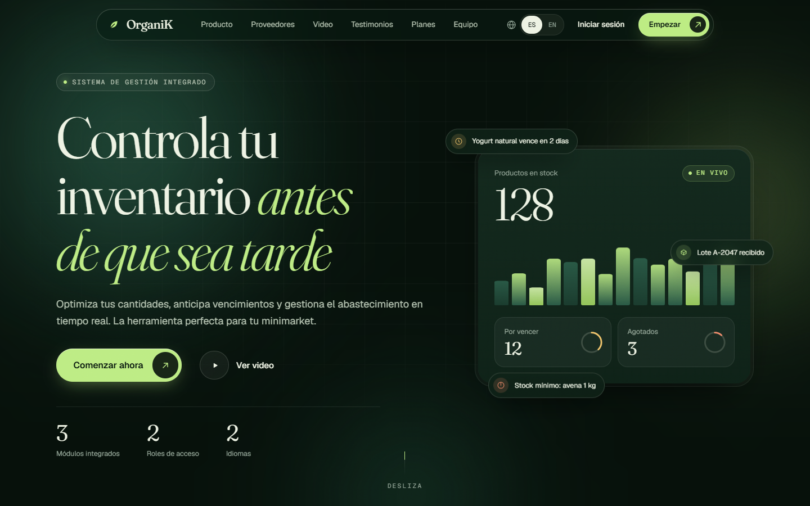
*Figura: Pantalla principal de la Landing Page de OrganiK en español.*

##### Evidencia 2: Términos y Condiciones (US-039)
Se implementó la página de términos y condiciones, con secciones numeradas, enlace de regreso al inicio y selector de idioma.

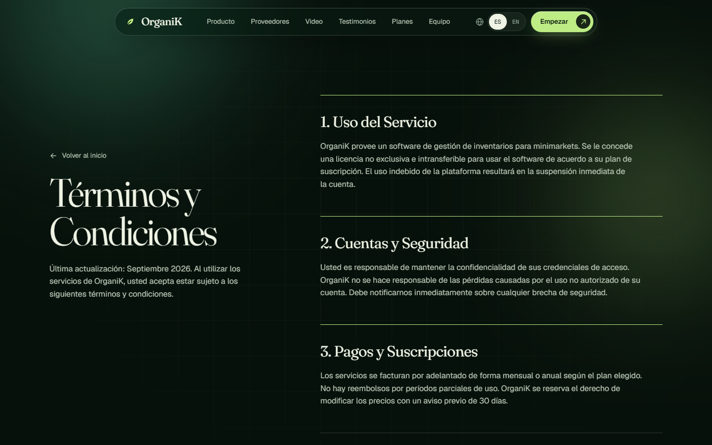
*Figura: Página de Términos y Condiciones de la Landing Page.*

##### Evidencia 3: Política de Privacidad
Se implementó la página de política de privacidad, enlazada desde el footer de la Landing Page y de la Web Application.

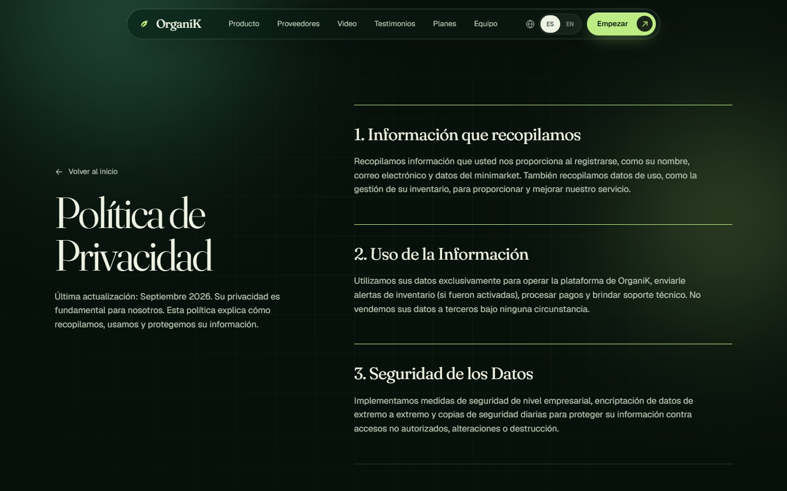
*Figura: Página de Política de Privacidad de la Landing Page.*

##### Evidencia 4: Página 404 de la Landing Page
Se implementó una página de error personalizada para rutas inexistentes.

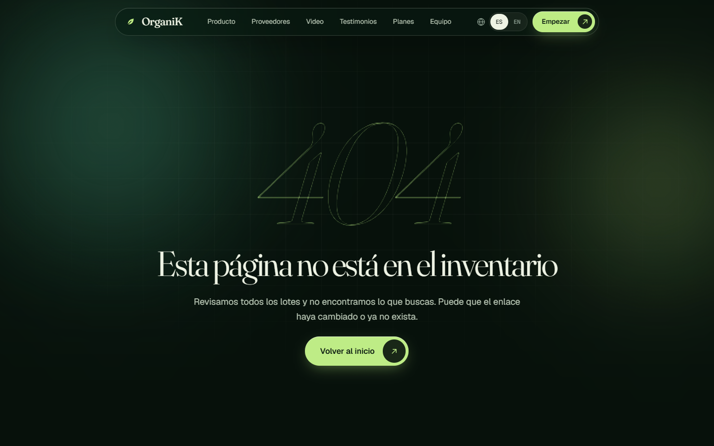
*Figura: Página 404 personalizada de la Landing Page.*

##### Evidencia 5: Web Application — Inicio de sesión
La primera versión de la Web Application incluye la pantalla de acceso, con selector de idioma ES/EN (US-040), enlace de registro, regreso al sitio y enlaces a términos y privacidad.

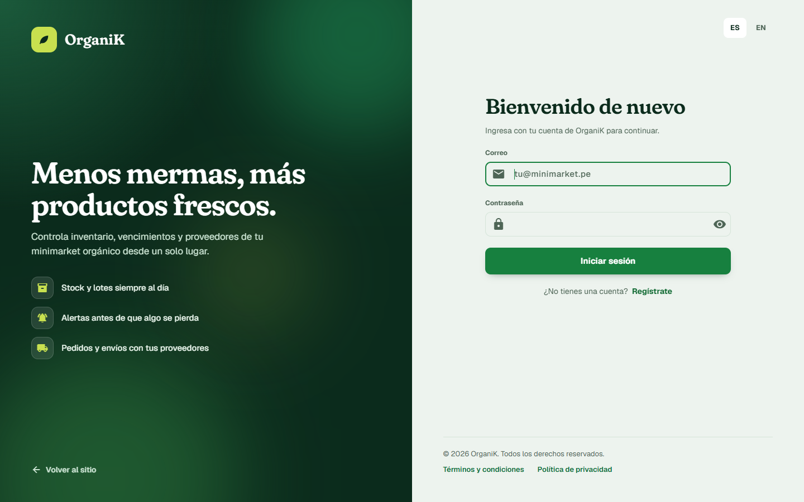
*Figura: Pantalla de inicio de sesión de la Web Application de OrganiK.*

##### Evidencia 6: Web Application — Registro de usuario
Pantalla de creación de cuenta con selección de segmento (minimarket o proveedor), datos del negocio, contraseña y aceptación de términos y condiciones.

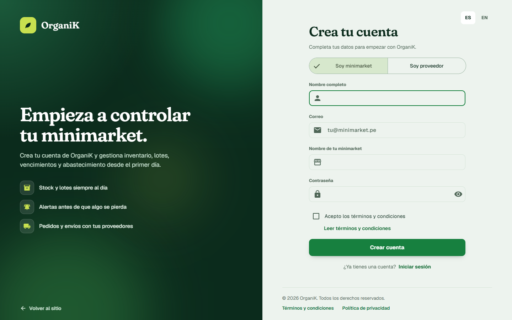
*Figura: Pantalla de registro de la Web Application de OrganiK.*

##### Evidencia 7: Web Application — Flujo del prototipo
Vista que consolida el recorrido recomendado del prototipo (dashboard, acciones CRUD, alertas, reportes, proveedores, usuarios y roles) con accesos directos a las interacciones principales.

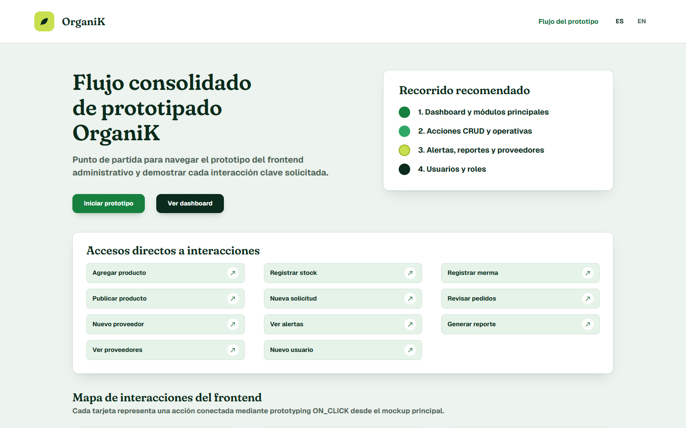
*Figura: Vista de flujo consolidado del prototipo de la Web Application.*

##### Evidencia 8: Web Application — Página 404
Página de error para rutas inexistentes de la aplicación.

*Figura: Página 404 de la Web Application de OrganiK.*

##### Evidencia 9: Web Application — Dashboard (US-030)
Panel principal con indicadores operativos: unidades en inventario, lotes por vencer, stock bajo, pedidos pendientes y actividad reciente.

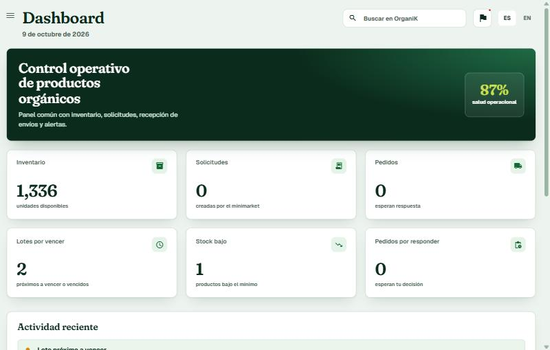
*Figura: Dashboard de la Web Application de OrganiK.*
##### Evidencia 10: Web Application — Inventario (US-002, US-006, US-013, US-014)
Listado de inventario con SKU, producto, lote, stock, fecha de vencimiento y estado (normal, riesgo o crítico), con búsqueda, filtros y accesos para registrar stock, merma y oferta.

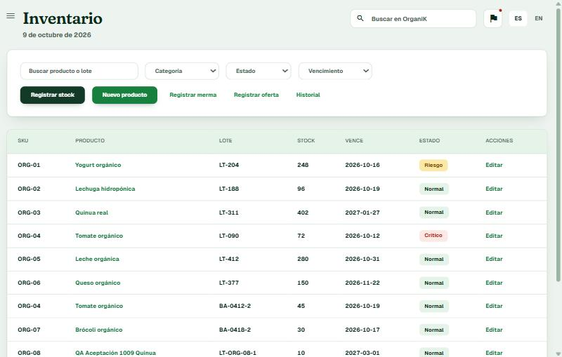
*Figura: Vista de inventario de la Web Application.*
##### Evidencia 11: Web Application — Productos (US-001)
Catálogo de productos organizado por categorías (frutas y verduras, lácteos, granos, bebidas, panadería y congelados) con acceso para agregar productos.

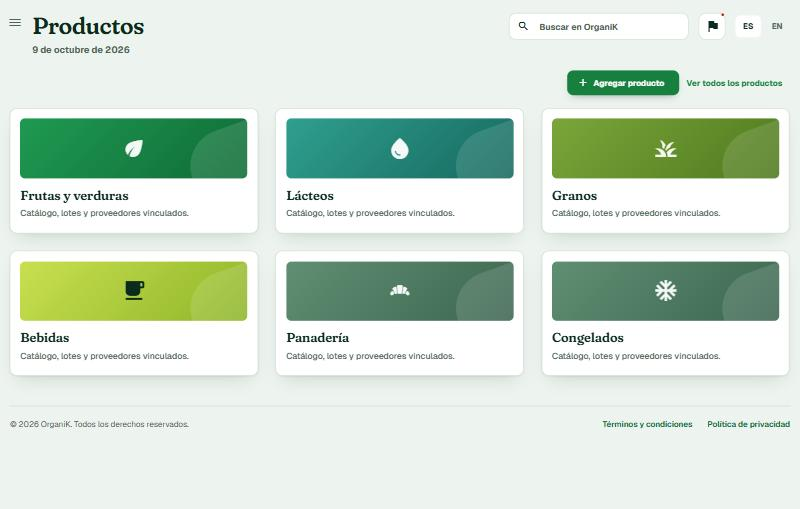
*Figura: Vista de productos por categoría.*
##### Evidencia 12: Web Application — Proveedores (US-015, US-016)
Directorio de proveedores activos con acceso a su perfil y alta de nuevos proveedores.

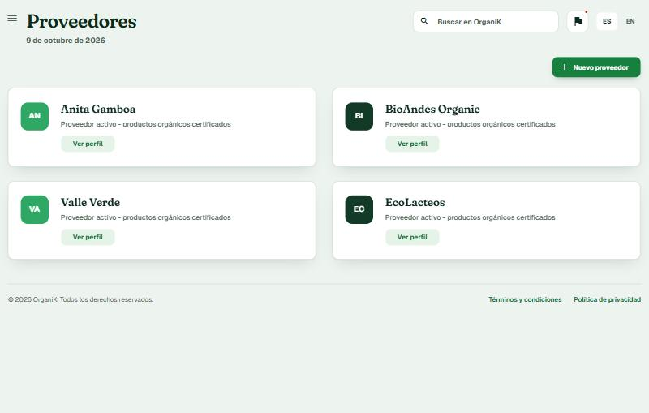
*Figura: Vista de proveedores.*
##### Evidencia 13: Web Application — Catálogo de proveedores (US-015)
Catálogo publicado por los proveedores, de solo consulta, con producto, lote, unidades disponibles, vencimiento y fecha de actualización.

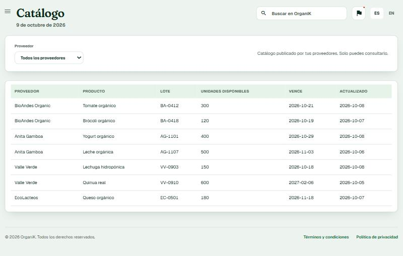
*Figura: Vista de catálogo de proveedores.*
##### Evidencia 14: Web Application — Conservación (US-010, US-011, US-012)
Monitoreo de temperatura y humedad por zona de almacenamiento, con estado de cada lectura e historial filtrable por zona y fechas. Las lecturas son simuladas.

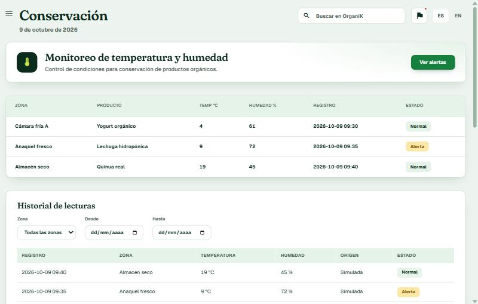
*Figura: Vista de monitoreo de conservación.*
##### Evidencia 15: Web Application — Analítica (US-009)
Indicadores operativos: pérdida evitada, productos en riesgo, solicitudes aceptadas y tendencia de alertas, con acceso para generar reportes.

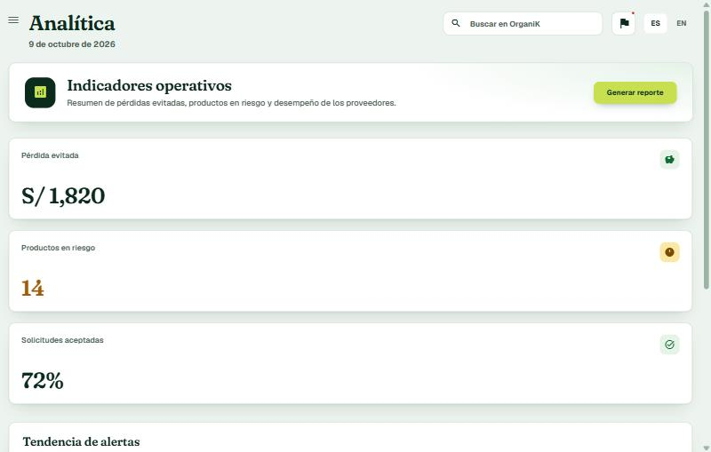
*Figura: Vista de analítica.*
##### Evidencia 16: Web Application — Alertas (US-009)
Resumen de analítica y alertas de la plataforma, con tendencia de alertas y acceso para generar reportes.

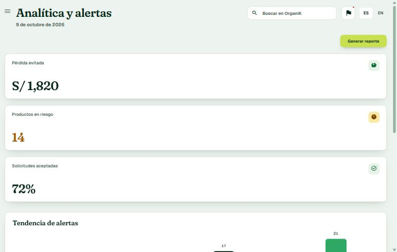
*Figura: Vista de analítica y alertas.*
##### Evidencia 17: Web Application — Perfiles (US-028)
Perfil del usuario autenticado y perfiles de acceso (administrador, operador y proveedor) con los módulos que gestiona o consulta cada uno.

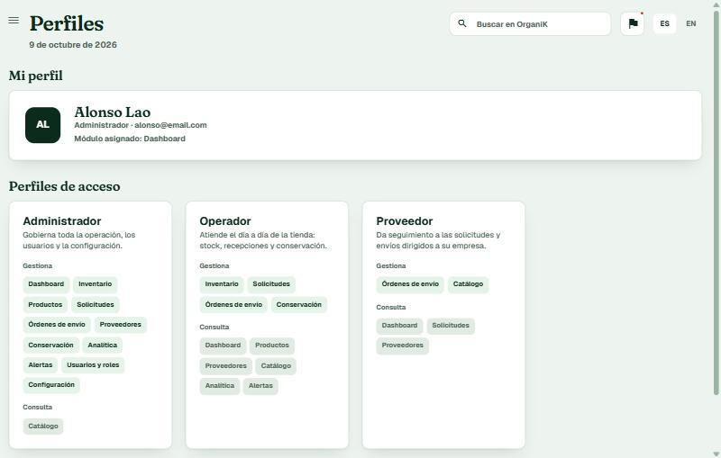
*Figura: Vista de perfiles y permisos por rol.*
##### Evidencia 18: Web Application — Usuarios y roles (US-026, US-028)
Gestión de usuarios del minimarket con correo, rol, estado y acciones, y acceso para registrar nuevos usuarios.

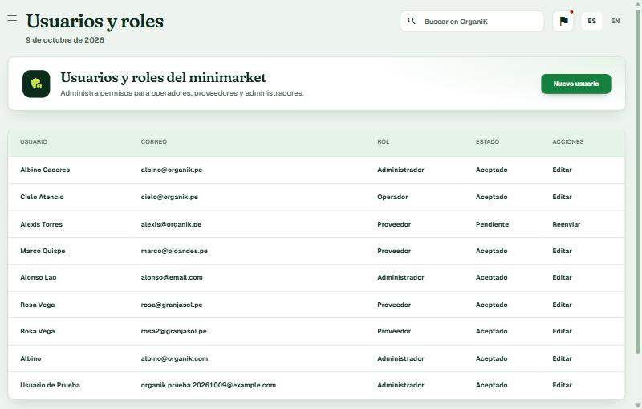
*Figura: Vista de usuarios y roles.*
---

#### 5.2.2.6. Services Documentation Evidence for Sprint Review.

En el Sprint 2 no se implementaron Web Services: el repositorio `organik-backend` aún no contiene código y la primera versión del RESTful API está prevista a partir del Sprint 3, con su documentación OpenAPI/Swagger. Para avanzar en el frontend, la Web Application consume una API simulada (`fake-api` e `in-memory-gateway` del Shared Kernel) que respeta los contratos de los endpoints definidos en el capítulo III, de modo que la integración con el backend solo requerirá reemplazar la capa de infraestructura. La relación de endpoints documentados con OpenAPI se incluirá en el Sprint 3.

---

#### 5.2.2.7. Software Deployment Evidence for Sprint Review.

Durante el Sprint 2 se desplegó en Firebase Hosting la nueva versión de la Landing Page y la primera versión de la Web Application de **OrganiK**. Ambos productos se publican con el CLI de Firebase (`firebase deploy --only hosting`), según lo descrito en la sección 5.1.4. Los Web Services se desplegarán en el Sprint 3.

**Landing Page**

* **Repositorio:** https://github.com/5Bits-OrganiK/organik-landing-page-static
* **Entorno local:** http://localhost:4200/
* **URL de Producción:** https://organik-d6e58.web.app/

*Figura: Nueva versión de la Landing Page desplegada en Firebase Hosting.*

**Web Application**

* **Repositorio:** https://github.com/5Bits-OrganiK/organik-web-application
* **Entorno local:** http://localhost:4200/
* **URL de Producción:** https://organik-app-d6e58.web.app/login

*Figura: Primera versión de la Web Application desplegada en Firebase Hosting.*

---

#### 5.2.2.8. Team Collaboration Insights during Sprint.

  Durante el Sprint 2 los cinco integrantes registraron commits en el repositorio de la Landing Page, y cuatro de ellos en el de la Web Application. El trabajo se organizó con GitFlow: cada bounded context o mejora se desarrolló en una rama <code>feature</code>, con commits siguiendo Conventional Commits.

  La siguiente tabla resume los commits registrados por integrante (sin merges, todas las ramas), obtenidos con <code>git log --all --no-merges</code> de cada repositorio.

<table border="1" cellpadding="4" cellspacing="0" align="center">
  <thead>
    <tr>
      <th>Team Member</th>
      <th>GitHub Username</th>
      <th>Landing Page</th>
      <th>Web Application</th>
      <th>Total</th>
    </tr>
  </thead>
  <tbody>
    <tr><td>Atencio Cristobal, Cielo Valentina</td><td>Ciel0p</td><td>2</td><td>57</td><td>59</td></tr>
    <tr><td>Cáceres Pizarro, Albino Florencio</td><td>Lil Doggy / a.caceres</td><td>2</td><td>72</td><td>74</td></tr>
    <tr><td>Olivares Lao, Gustavo Alonso</td><td>GeGuMaGu25</td><td>4</td><td>12</td><td>16</td></tr>
    <tr><td>Quispe Almonacid, Andre Sebastian</td><td>u201815005</td><td>1</td><td>0</td><td>1</td></tr>
    <tr><td>Torres Huaman, Alexis Calin</td><td>Alex_Torres</td><td>2</td><td>8</td><td>10</td></tr>
  </tbody>
</table>

  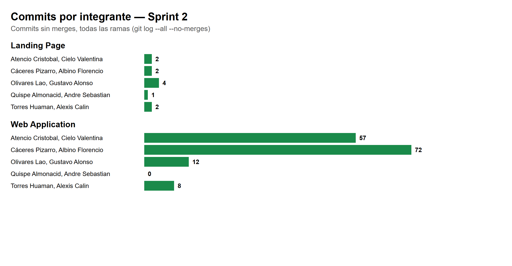
  
<em>Figura: Commits por integrante en los repositorios de la Landing Page y la Web Application.</em>

  En la Web Application, los commits se concentran en el Shared Kernel y en las capas de cada bounded context, con avance incremental por rama <code>feature</code>. En la Landing Page, el trabajo se repartió entre el script principal, las páginas legales, la página 404 y los estilos globales.

---

# Conclusiones

## Conclusiones y recomendaciones.

1. El desarrollo de **OrganiK** permitió identificar una problemática real en la gestión de productos orgánicos: la fragmentación de información, el control manual de inventarios, la poca trazabilidad de lotes y la dependencia de canales informales como WhatsApp para coordinar pedidos entre minimarkets y proveedores.

2. Las entrevistas realizadas evidenciaron que tanto administradores de minimarkets como proveedores necesitan una solución centralizada, sencilla y accesible que les permita reducir errores operativos, anticipar vencimientos, controlar stock y mejorar la coordinación del abastecimiento.

3. La propuesta de **OrganiK** se diferencia de soluciones generales de inventario al enfocarse específicamente en productos orgánicos, integrando inventario, lotes, vencimientos, abastecimiento, proveedores y monitoreo de condiciones de conservación como temperatura y humedad.

4. La implementación de la landing page permitió comunicar de manera clara la propuesta de valor del producto, sus funcionalidades principales, planes comerciales y canales de contacto, funcionando como una primera aproximación para validar el interés del mercado.

5. El uso de Angular, componentes organizados por features, internacionalización y control de versiones mediante Git permitió construir una base técnica ordenada, escalable y alineada con buenas prácticas de desarrollo frontend.

6. El trabajo colaborativo del equipo permitió avanzar en investigación, diseño, documentación e implementación, fortaleciendo la planificación, asignación de responsabilidades y seguimiento del proyecto mediante herramientas digitales.

1. Continuar con el desarrollo de la plataforma web principal, priorizando los módulos de inventario, proveedores, requisiciones, pedidos, alertas y dashboard, ya que son los flujos de mayor valor para los usuarios entrevistados.

2. Realizar nuevas validaciones con administradores de minimarkets y proveedores usando prototipos funcionales, no solo mockups, para medir si los usuarios pueden completar tareas clave sin dificultad.

3. Implementar progresivamente un backend con autenticación, roles diferenciados y persistencia de datos, asegurando que los proveedores puedan generar pedidos y que solo los administradores puedan aprobarlos y modificar inventario.

4. Mantener una interfaz responsive y simple, especialmente para dispositivos móviles, debido a que los usuarios gestionan muchas operaciones desde celular durante su jornada laboral.

5. Incorporar métricas operativas en el dashboard, como productos próximos a vencer, stock bajo, pedidos pendientes, productos en riesgo por temperatura/humedad y mermas registradas.

---

# Bibliografía

- Bedoya-Perales, N. S., & Dal’ Magro, G. P. (2021). Quantification of food losses and waste in Peru: A mass flow analysis along the food supply chain. *Sustainability, 13*(5), 2807. https://doi.org/10.3390/su13052807

- Hansen, E. B., & Bøgh, S. (2021). Internet of things for perishable inventory management systems: An application and managerial insights for micro, small and medium enterprises. *Annals of Operations Research*. https://pmc.ncbi.nlm.nih.gov/articles/PMC8494460/

- Teller, C., Holweg, C., Reiner, G., & Kotzab, H. (2018). Waste not, want not: Managing perishables in small and medium retail enterprises. *International Journal of Retail & Distribution Management*. https://pure.qub.ac.uk/en/publications/waste-not-want-not-managing-perishables-in-small-and-medium-retai/

- Angular. (2026). *Angular Style Guide*. Angular Documentation. https://angular.dev/style-guide

- Conventional Commits. (2026). *Conventional Commits 1.0.0*. https://www.conventionalcommits.org/en/v1.0.0/

- Food and Agriculture Organization of the United Nations. (2019). *The State of Food and Agriculture 2019: Moving forward on food loss and waste reduction*. FAO. https://www.fao.org/agrifood-economics/publications/detail/en/c/1238574/

- Food and Agriculture Organization of the United Nations. (2026). *SDG Indicator 12.3.1: Global Food Loss and Waste*. FAO. https://www.fao.org/sustainable-development-goals-data-portal/data/indicators/1231-global-food-losses

- Food and Agriculture Organization of the United Nations. (s.f.). *Food loss and food waste*. FAO Policy Support and Governance Gateway. https://www.fao.org/policy-support/policy-themes/food-loss-and-food-waste/

- Gothelf, J., & Seiden, J. (2021). *Lean UX: Designing great products with agile teams* (3rd ed.). O’Reilly Media.

- Google. (s.f.). *Google HTML/CSS Style Guide*. Google Style Guides. https://google.github.io/styleguide/htmlcssguide.html

- Google. (s.f.). *Google TypeScript Style Guide*. Google Style Guides. https://google.github.io/styleguide/tsguide.html

- Organisation for Economic Co-operation and Development. (2025). *The potential effects of reducing food loss and waste*. OECD Publishing. https://www.oecd.org/content/dam/oecd/en/publications/reports/2025/05/the-potential-effects-of-reducing-food-loss-and-waste_ee750206/bd2aedc6-en.pdf

- Osterwalder, A., Pigneur, Y., Bernarda, G., & Smith, A. (2014). *Value Proposition Design: How to create products and services customers want*. Wiley.

- Vernon, V. (2013). *Implementing Domain-Driven Design*. Addison-Wesley Professional.

- World Wide Web Consortium. (2023). *Web Content Accessibility Guidelines (WCAG) 2.2*. W3C. https://www.w3.org/TR/WCAG22/

- Zavaleta-Zarate, K., Escobal-Vera, J., & Zarate-Perez, E. (2026). Optimizing inventory in convenience stores to maximize ROI using Random Forest and genetic algorithms. *Logistics, 10*(3), 64. https://doi.org/10.3390/logistics10030064

- CasaMarket. (s. f.). *Planes CasaMarket para minimarket*. https://casamarket.pe/planes/

- limaPOS. (s. f.). *Punto de venta e inventario en la nube*. https://www.limapos.com/

- Spry Sales. (s. f.). *Software de gestión comercial electrónica*. https://www.spry.pe/

<!-- AUTO-DOCS:END -->
