<!-- AUTO-DOCS:START -->

# Carátula

 

  

**UNIVERSIDAD PERUANA DE CIENCIAS APLICADAS**

**Facultad:** Facultad de Ingeniería

**Carrera:** Ingeniería de Software

**Ciclo Académico:** 2026-2

**Código del Curso:** 1ASI0729

**Curso:** Desarrollo de Aplicaciones Open Source

**NRC:** 7742

**Profesor:** Angel Auguto Velasquez Nuñez

 **INFORME DE TRABAJO FINAL — AV1**

**Startup:** 5Bits

**Producto:** OrganiK

 **INTEGRANTES:**

| Apellidos y Nombres                    | Código de Alumno |
|----------------------------------------|------------------|
| Atencio Cristobal,Cielo Valentina      | u202424216       |
| Cáceres Pizarro, Albino Florencio      | 201923820        |
| Olivares Lao, Gustavo Alonso           | U202216448       |
| Quispe Almonacid, Andre Sebastian      | u201815005       |
| Torres Huaman, Alexis Calin            | U20241G152       |

**Lima, agosto de 2026**

---

# Registro de Versiones del Informe
| Versión | Fecha | Autores | Descripción              |
| :--- | :--- | :--- |:-------------------------|
| 1.0.0 |20/19/2026 | Atencio Cristobal,Cielo Valentina Cáceres Pizarro,Albino Florencio  Olivares Lao, Gustavo Alonso  Quispe Almonacid, Andre Sebastian   Torres Huaman, Alexis Calin | Carátula Registro de Versiones del Informe Project Report Collaboration Insights Contenido Student Outcome Capítulo I: Introducción Capítulo II: Requirements Elicitation & Analysis. Capítulo III: Requirements Specification. Capítulo IV: Product Design. Capítulo V: Product Implementation, Validation & Deployment. 5.1. Software Configuration Management. 5.1.1. Software Development Environment Configuration. 5.1.2. Source Code Management. 5.1.3. Source Code Style Guide & Conventions. 5.1.4. Software Deployment Configuration. 5.2. Landing Page, Services & Applications Implementation. 5.2.1. Sprint 1 5.2.1.1. Sprint Planning 1. 5.2.1.2. Aspect Leaders and Collaborators. 5.2.1.3. Sprint Backlog 1. 5.2.1.4. Development Evidence for Sprint Review. 5.2.1.5. Execution Evidence for Sprint Review. 5.2.1.6. Services Documentation Evidence for Sprint Review. 5.2.1.7. Software Deployment Evidence for Sprint Review. 5.2.1.8. Team Collaboration Insights during Sprint. Conclusiones Bibliografía Anexos. |
| 2.0.0 | DD/MM/AAAA | Atencio Cristobal,Cielo Valentina Cáceres Pizarro,Albino Florencio   Quispe Almonacid, Andre Sebastian   Torres Huaman, Alexis Calin | [Descripción de los cambios realizados en esta versión] |
| 3.0.0 | DD/MM/AAAA | Atencio Cristobal,Cielo Valentina Cáceres Pizarro,Albino Florencio   Quispe Almonacid, Andre Sebastian   Torres Huaman, Alexis Calin| [Descripción de los cambios realizados en esta versión] |

---

# Project Report Collaboration Insights
El presente apartado tiene como finalidad evidenciar el trabajo colaborativo realizado durante el desarrollo del informe. Para ello, se pone a disposición el repositorio oficial del proyecto, alojado en una organización pública de GitHub:

Link de la organización: 🔗https://github.com/5Bits-OrganiK

A partir de este repositorio, se analiza la participación de los integrantes del equipo mediante indicadores como número de commits, frecuencia de contribuciones y actividad general registrada en la plataforma.

En el contexto de las entregas AV1, TB1, AV2 y TB2, se presenta un análisis de colaboración que permite visualizar el nivel de aporte individual de cada miembro del equipo, sustentado en los registros de GitHub. Este análisis busca demostrar la distribución del trabajo, la constancia en el desarrollo del informe y el cumplimiento de las actividades asignadas.

## AV1

La siguiente figura presenta las estadísticas generales de actividad y contribución registradas en el repositorio.

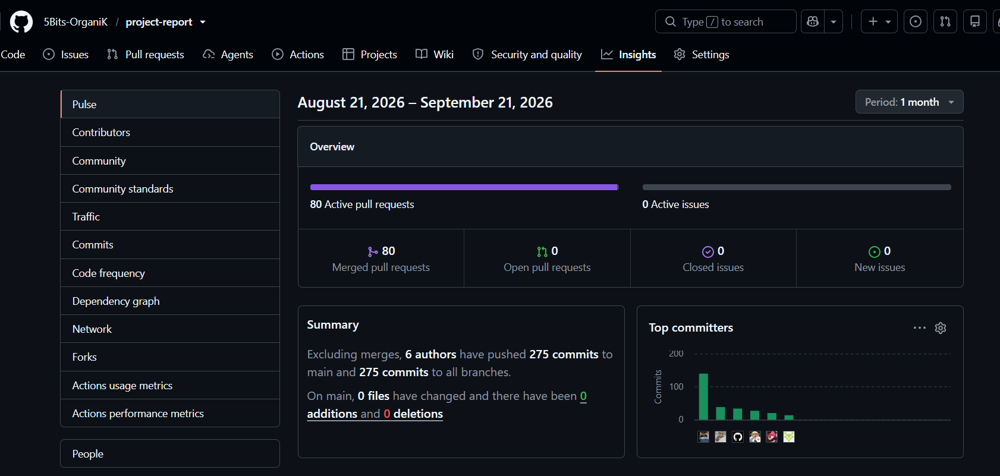

**Figura 1.** Estadísticas generales del repositorio del proyecto.  
**Fuente:** GitHub Insights.

La siguiente figura muestra el tráfico registrado en el repositorio del proyecto durante el periodo de desarrollo.

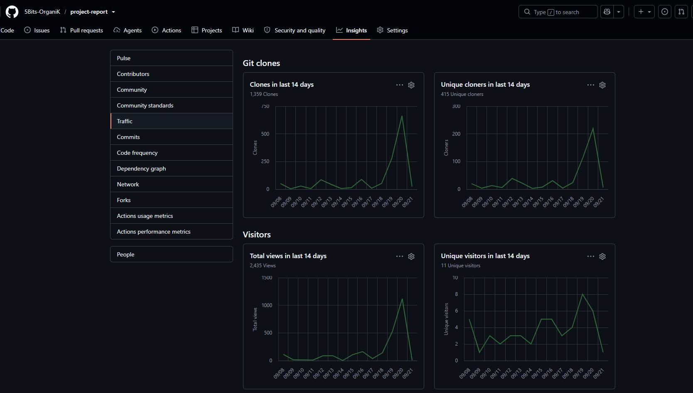

**Figura 2.** Tráfico registrado en el repositorio del proyecto.  
**Fuente:** GitHub Insights.

La siguiente figura presenta la participación de los integrantes del equipo como contribuidores del repositorio.

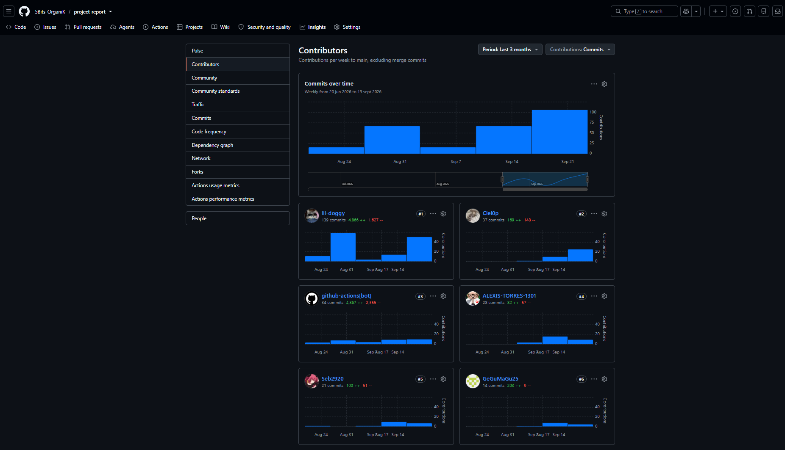

**Figura 3.** Contribuidores del repositorio del proyecto.  
**Fuente:** GitHub Insights.

La siguiente figura muestra el historial de commits realizados por los integrantes del equipo durante el desarrollo del proyecto.

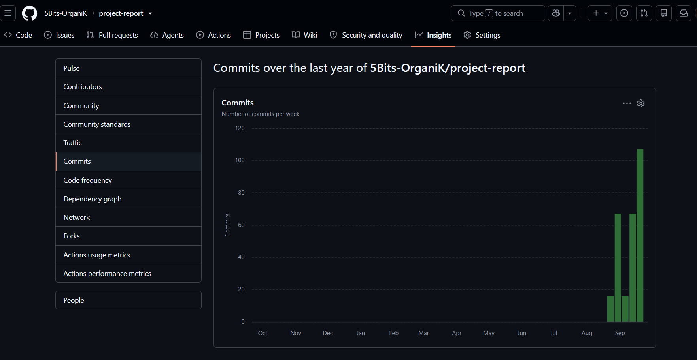

**Figura 4.** Registro de commits realizados por los integrantes del equipo.  
**Fuente:** GitHub.

---

# Contenido

## Tabla de contenidos

- [Carátula](report/front-matter/01-title-page.md)
- [Registro de Versiones del Informe](report/front-matter/02-version-control-log.md)
- [Project Report Collaboration Insights](report/front-matter/03-collaboration-insights.md)
- [Contenido](report/front-matter/04-table-of-contents.md)
- [Student Outcome](report/front-matter/05-student-outcomes.md)

- [Capítulo I: Introducción](report/10-chapter-01.md)
  - [1.1. Startup Profile](report/10-chapter-01.md#11-startup-profile)
    - [1.1.1. Descripción de la Startup](report/10-chapter-01.md#111-descripción-de-la-startup)
    - [1.1.2. Perfiles de integrantes del equipo](report/10-chapter-01.md#112-perfiles-de-integrantes-del-equipo)
  - [1.2. Solution Profile](report/10-chapter-01.md#12-solution-profile)
    - [1.2.1 Antecedentes y problemática](report/10-chapter-01.md#121-antecedentes-y-problemática)
    - [1.2.2 Lean UX Process.](report/10-chapter-01.md#122-lean-ux-process)
      - [1.2.2.1. Lean UX Problem Statements.](report/10-chapter-01.md#1221-lean-ux-problem-statements)
      - [1.2.2.2. Lean UX Assumptions.](report/10-chapter-01.md#1222-lean-ux-assumptions)
      - [1.2.2.3. Lean UX Hypothesis Statements.](report/10-chapter-01.md#1223-lean-ux-hypothesis-statements)
      - [1.2.2.4. Lean UX Canvas.](report/10-chapter-01.md#1224-lean-ux-canvas)
  - [1.3. Segmentos objetivo.](report/10-chapter-01.md#13-segmentos-objetivo)

- [Capítulo II: Requirements Elicitation & Analysis](report/11-chapter-02.md)
  - [2.1. Competidores.](report/11-chapter-02.md#21-competidores)
    - [2.1.1. Análisis competitivo.](report/11-chapter-02.md#211-análisis-competitivo)
    - [2.1.2. Estrategias y tácticas frente a competidores.](report/11-chapter-02.md#212-estrategias-y-tácticas-frente-a-competidores)
  - [2.2. Entrevistas.](report/11-chapter-02.md#22-entrevistas)
    - [2.2.1. Diseño de entrevistas.](report/11-chapter-02.md#221-diseño-de-entrevistas)
    - [2.2.2. Registro de entrevistas.](report/11-chapter-02.md#222-registro-de-entrevistas)
    - [2.2.3. Análisis de entrevistas.](report/11-chapter-02.md#223-análisis-de-entrevistas)
  - [2.3. Needfinding.](report/11-chapter-02.md#23-needfinding)
    - [2.3.1. User Personas.](report/11-chapter-02.md#231-user-personas)
    - [2.3.2. User Task Matrix.](report/11-chapter-02.md#232-user-task-matrix)
    - [2.3.3. User Journey Mapping.](report/11-chapter-02.md#233-user-journey-mapping)
    - [2.3.4. Empathy Mapping.](report/11-chapter-02.md#234-empathy-mapping)
  - [2.4. Big Picture Event Storming.](report/11-chapter-02.md#24-big-picture-event-storming)
  - [2.5. Ubiquitous Language.](report/11-chapter-02.md#25-ubiquitous-language)

- [Capítulo III: Requirements Specification](report/12-chapter-03.md)
  - [3.1. User Stories.](report/12-chapter-03.md#31-user-stories)
  - [3.2. Impact Mapping.](report/12-chapter-03.md#32-impact-mapping)
  - [3.3. Product Backlog.](report/12-chapter-03.md#33-product-backlog)

- [Capítulo IV: Product Design](report/13-chapter-04.md)
  - [4.1. Style Guidelines.](report/13-chapter-04.md#41-style-guidelines)
    - [4.1.1. General Style Guidelines.](report/13-chapter-04.md#411-general-style-guidelines)
    - [4.1.2. Web Style Guidelines.](report/13-chapter-04.md#412-web-style-guidelines)
  - [4.2. Information Architecture.](report/13-chapter-04.md#42-information-architecture)
    - [4.2.1. Organization Systems.](report/13-chapter-04.md#421-organization-systems)
    - [4.2.2. Labeling Systems.](report/13-chapter-04.md#422-labeling-systems)
    - [4.2.3. SEO Tags and Meta Tags](report/13-chapter-04.md#423-seo-tags-and-meta-tags)
    - [4.2.4. Searching Systems.](report/13-chapter-04.md#424-searching-systems)
    - [4.2.5. Navigation Systems.](report/13-chapter-04.md#425-navigation-systems)
  - [4.3. Landing Page UI Design.](report/13-chapter-04.md#43-landing-page-ui-design)
    - [4.3.1. Landing Page Wireframe.](report/13-chapter-04.md#431-landing-page-wireframe)
    - [4.3.2. Landing Page Mock-up.](report/13-chapter-04.md#432-landing-page-mock-up)
  - [4.4. Web Applications UX/UI Design.](report/13-chapter-04.md#44-web-applications-uxui-design)
    - [4.4.1. Web Applications Wireframes.](report/13-chapter-04.md#441-web-applications-wireframes)
    - [4.4.2. Web Applications Wireflow Diagrams.](report/13-chapter-04.md#442-web-applications-wireflow-diagrams)
    - [4.4.2. Web Applications Mock-ups.](report/13-chapter-04.md#442-web-applications-mock-ups)
    - [4.4.3. Web Applications User Flow Diagrams.](report/13-chapter-04.md#443-web-applications-user-flow-diagrams)
  - [4.5. Web Applications Prototyping.](report/13-chapter-04.md#45-web-applications-prototyping)
  - [4.6. Domain-Driven Software Architecture.](report/13-chapter-04.md#46-domain-driven-software-architecture)
    - [4.6.1. Design-Level Event Storming.](report/13-chapter-04.md#461-design-level-event-storming)
    - [4.6.2. Software Architecture Context Diagram.](report/13-chapter-04.md#462-software-architecture-context-diagram)
    - [4.6.3. Software Architecture Container Diagrams.](report/13-chapter-04.md#463-software-architecture-container-diagrams)
    - [4.6.4. Software Architecture Components Diagrams.](report/13-chapter-04.md#464-software-architecture-components-diagrams)
  - [4.7. Software Object-Oriented Design.](report/13-chapter-04.md#47-software-object-oriented-design)
    - [4.7.1. Class Diagrams.](report/13-chapter-04.md#471-class-diagrams)
  - [4.8. Database Design.](report/13-chapter-04.md#48-database-design)
    - [4.8.1. Database Diagrams.](report/13-chapter-04.md#481-database-diagrams)

- [Capítulo V: Product Implementation, Validation & Deployment](report/14-chapter-05.md)
  - [5.1. Software Configuration Management.](report/14-chapter-05.md#51-software-configuration-management)
    - [5.1.1. Software Development Environment Configuration.](report/14-chapter-05.md#511-software-development-environment-configuration)
    - [5.1.2. Source Code Management.](report/14-chapter-05.md#512-source-code-management)
    - [5.1.3. Source Code Style Guide & Conventions.](report/14-chapter-05.md#513-source-code-style-guide--conventions)
    - [5.1.4. Software Deployment Configuration.](report/14-chapter-05.md#514-software-deployment-configuration)
  - [5.2. Landing Page, Services & Applications Implementation.](report/14-chapter-05.md#52-landing-page-services--applications-implementation)
    - [5.2.1. Sprint 1](report/14-chapter-05.md#521-sprint-1)
      - [5.2.1.1. Sprint Planning 1.](report/14-chapter-05.md#5211-sprint-planning-1)
      - [5.2.1.2. Aspect Leaders and Collaborators.](report/14-chapter-05.md#5212-aspect-leaders-and-collaborators)
      - [5.2.1.3. Sprint Backlog 1.](report/14-chapter-05.md#5213-sprint-backlog-1)
      - [5.2.1.4. Development Evidence for Sprint Review.](report/14-chapter-05.md#5214-development-evidence-for-sprint-review)
      - [5.2.1.5. Execution Evidence for Sprint Review.](report/14-chapter-05.md#5215-execution-evidence-for-sprint-review)
      - [5.2.1.6. Services Documentation Evidence for Sprint Review.](report/14-chapter-05.md#5216-services-documentation-evidence-for-sprint-review)
      - [5.2.1.7. Software Deployment Evidence for Sprint Review.](report/14-chapter-05.md#5217-software-deployment-evidence-for-sprint-review)
      - [5.2.1.8. Team Collaboration Insights during Sprint.](report/14-chapter-05.md#5218-team-collaboration-insights-during-sprint)
- [Conclusiones](report/98-conclusions.md)
- [Bibliografía](report/99-bibliography.md)
- [Anexos](report/annexes/90-annex-a-raw-data.md)

---

# Student Outcome
El curso contribuye al cumplimiento del Student Outcome ABET:

**ABET – EAC - Student Outcome 3**  
**Criterio:** Capacidad de comunicarse efectivamente con un rango de audiencias.

En el siguiente cuadro se describen las acciones realizadas y las conclusiones del equipo, que permiten sustentar el logro del ABET – EAC - Student Outcome 3.

---

## Tabla de Student Outcome

| Criterio específico | Acciones realizadas | Conclusiones |
|:---|:---|:---|
| Comunica oralmente con efectividad a diferentes rangos de audiencia. | **Atencio Cristobal, Cielo Valentina** **AV1:** Participó en el desarrollo de los capítulos y artefactos asignados del Project Report, colaborando en las actividades correspondientes al Sprint 1.  **Cáceres Pizarro, Albino Florencio** **AV1:** Coordinó la organización del equipo, creación del repositorio y distribución de actividades. Participó activamente en el desarrollo, revisión e integración de los capítulos y artefactos del Project Report, apoyando en la elaboración de entregables, resolución de inconvenientes y seguimiento de las actividades correspondientes al Sprint 1.  **Olivares Lao, Gustavo Alonso** **AV1:** Participó en el desarrollo de los capítulos y artefactos asignados, colaborando con el equipo en las actividades correspondientes al Sprint 1.  **Quispe Almonacid, Andre Sebastian** **AV1:** Participó en el desarrollo de los capítulos y artefactos asignados del Project Report, colaborando en las actividades correspondientes al Sprint 1.  **Torres Huaman, Alexis Calin** **AV1:** Participó en el desarrollo de los artefactos asignados y colaboró en la planificación y organización de las actividades del Sprint 1. | **AV1:** El equipo comunicó oralmente el avance del proyecto al organizar y sustentar los artefactos desarrollados para el Sprint 1, explicando el problema, la propuesta de solución, los segmentos objetivo, los requisitos, el diseño del producto y las evidencias de implementación de la landing page ante una audiencia académica. |
| Comunica por escrito con efectividad a diferentes rangos de audiencia. | **Atencio Cristobal, Cielo Valentina** **AV1:** Cumplió con las actividades asignadas para el desarrollo de los capítulos, artefactos y evidencias correspondientes al proyecto.  **Cáceres Pizarro, Albino Florencio** **AV1:** Participó en la planificación, distribución y seguimiento de las actividades del equipo, colaborando de manera transversal en el desarrollo y revisión de los capítulos, artefactos y evidencias del proyecto. Asimismo, apoyó a los integrantes del equipo en la organización y cumplimiento de las tareas correspondientes al Sprint 1.  **Olivares Lao, Gustavo Alonso** **AV1:** Cumplió con las actividades asignadas para el desarrollo de los capítulos y artefactos del proyecto, coordinando sus avances con el equipo.  **Quispe Almonacid, Andre Sebastian** **AV1:** Cumplió con las actividades asignadas para el desarrollo de los capítulos, artefactos y evidencias correspondientes al proyecto.  **Torres Huaman, Alexis Calin** **AV1:** Colaboró en la organización de las actividades del equipo y en la planificación de las tareas correspondientes al Sprint 1. | **AV1:** El equipo comunicó por escrito el proceso de ingeniería desarrollado mediante el Project Report, documentando en Markdown la carátula, el registro de versiones, los capítulos I al V, los artefactos de análisis, requisitos, diseño, configuración, evidencias del Sprint 1, conclusiones, bibliografía y anexos de manera organizada para docentes, compañeros y lectores técnicos. |

---

# Capítulo I: Introducción

## 1.1. Startup Profile

### 1.1.1. Descripción de la Startup

5bits es una startup tecnológica enfocada en el desarrollo de soluciones digitales para mejorar la gestión logística, el abastecimiento y la conservación de productos orgánicos. La startup busca contribuir a la transformación digital de los procesos relacionados con la comercialización y distribución de productos orgánicos, promoviendo una gestión más eficiente y sostenible.

Su enfoque se encuentra dirigido principalmente a administradores de minimarkets y proveedores de productos orgánicos, considerando las necesidades y desafíos que ambos segmentos enfrentan dentro de la cadena de abastecimiento. De esta manera, 5bits busca generar valor mediante el uso de tecnologías digitales que faciliten la gestión de información y la coordinación entre los diferentes actores involucrados.

La startup orienta sus esfuerzos hacia la mejora de procesos relacionados con el control de inventarios, abastecimiento, trazabilidad, conservación y gestión de productos orgánicos, buscando contribuir a una cadena de suministro más organizada, eficiente y transparente.

**Misión:** Facilitar la transformación digital de la gestión logística, el abastecimiento y la conservación de productos orgánicos, contribuyendo a que minimarkets y proveedores desarrollen operaciones más eficientes, organizadas y sostenibles.

**Visión:** Convertirse en una startup tecnológica de referencia en la transformación digital de la cadena de abastecimiento de productos orgánicos, promoviendo una gestión más eficiente, transparente y sostenible.

**Valores:** Eficiencia, trazabilidad, sostenibilidad, transparencia, innovación y orientación al usuario.

### 1.1.2. Perfiles de integrantes del equipo

| Imagen | Apellidos y nombres | Código | Carrera | Perfil |
|:---:|:---|:---:|:---|:---|
|  | **Cáceres Pizarro, Albino Florencio** | U201923820 | Ingeniería de Software | Me considero una persona responsable y proactiva que le gusta trabajar en equipo. Además, siempre estoy abierto a ayudar, en lo posible, a cualquier integrante del equipo. Además, busco adaptarme rápidamente a los diversos retos que se presentan en el ciclo. |
|  | **Atencio Cristobal, Cielo Valentina** | U202424216 | Ingeniería de Software | Me considero responsable y creativa. He participado en proyectos de videojuegos, donde también aplico mis habilidades en dibujo digital y diseño. Mi meta es crecer en el campo tecnológico y desarrollarme como futura profesional. |
|  | **Olivares Lao, Gustavo Alonso** | U202216448 | Ingeniería de Software | Estudiante de Ingeniería de Software (8vo ciclo, UPC) y Desarrollador Front-end Junior. Especializado en React, JavaScript y Python, con un fuerte enfoque en análisis de datos e integración de inteligencia artificial. Busco unirme a un equipo colaborativo para optimizar procesos, aportar soluciones y continuar mi crecimiento profesional. |
|  | **Quispe Almonacid, Andre Sebastian** | U201815005 | Ingeniería de Software | Me considero una persona analítica, constante y apasionada por la tecnología. Tengo un fuerte interés en la gestión de bases de datos, la estructura de los sistemas y el desarrollo de software. Disfruto entendiendo cómo funcionan las cosas desde la raíz y transformando la lógica en soluciones limpias y eficientes. Mi meta es seguir creciendo en el campo tecnológico y consolidarme como una profesional capaz de conectar bases de datos sólidas con el desarrollo moderno.|
|  | **Torres Huaman, Alexis Calin** | U20241G152 | Ingeniería de Software | Estudiante de Ingeniería de Software. Me considero una persona comprometida, analítica y apasionada por la resolución de problemas mediante el uso de la tecnología. Destaco por mi habilidad para trabajar en equipo, investigar nuevas herramientas y proponer ideas innovadoras que optimicen el desarrollo de software dentro del proyecto. |

## 1.2. Solution Profile

Nuestra solución OrganiK, es una plataforma web para la gestión de inventarios, abastecimiento y monitoreo de productos orgánicos, que conecta a administradores de minimarkets y proveedores mediante un ecosistema digital centralizado.

Para los administradores de minimarkets, permite gestionar productos, inventario, lotes, vencimientos, ubicaciones, mermas y donaciones, además de monitorear temperatura y humedad para detectar posibles riesgos de conservación.

Para los proveedores, permite gestionar productos, disponibilidad y lotes, así como crear y consultar pedidos de abastecimiento dirigidos a los minimarkets. Los proveedores no pueden modificar directamente el inventario.

Los pedidos generados por los proveedores son revisados por el administrador, quien puede aceptarlos o rechazarlos. Si el pedido es aceptado, se registra la operación y se actualiza el inventario; si es rechazado, el inventario permanece sin cambios.

La plataforma integra inventario, abastecimiento, trazabilidad y monitoreo IoT. Durante la implementación, los datos de los sensores podrán ser simulados para validar los flujos de monitoreo y alertas sin depender de dispositivos físicos.

De esta manera, OrganiK busca mejorar la gestión y abastecimiento de productos orgánicos mediante información centralizada y permisos diferenciados, bajo el principio de que **el proveedor puede iniciar una operación de abastecimiento, pero solamente el administrador del minimarket puede modificar su inventario**.

**Propuesta de valor por segmento (por validar):** Para el administrador de minimarket, OrganiK propone reunir el control de stock, lotes, vencimientos y condiciones de conservación con la decisión sobre los pedidos del proveedor, de modo que pueda detectar productos en riesgo y reponer sin perder el control de su inventario. Para el proveedor, propone mantener su catálogo y disponibilidad y seguir el estado de los pedidos dirigidos a los minimarkets en el mismo flujo. Frente a las soluciones comerciales revisadas en el capítulo II, el diferencial propuesto no es una función aislada de inventario o compras, sino la combinación de trazabilidad de perecibles, alertas de conservación y coordinación entre ambos segmentos con permisos diferenciados. Su utilidad y ventaja comparativa aún requieren validación con usuarios; no se afirma exclusividad en el mercado.

### 1.2.1 Antecedentes y problemática

El sistema alimentario peruano enfrenta importantes pérdidas de productos a lo largo de su cadena de suministro. Se estima que en el Perú se pierden aproximadamente 12,8 millones de toneladas de alimentos al año, equivalente al 47,6% de la oferta anual de alimentos. Dentro de estas pérdidas, una proporción importante corresponde a frutas y hortalizas, productos particularmente sensibles a factores como la temperatura, humedad, manipulación y tiempo de almacenamiento (OECD, 2025; Bedoya-Perales & Dal’ Magro, 2021). Esta situación evidencia la necesidad de mejorar los mecanismos de gestión y conservación de productos perecibles.

En los minimarkets, esta problemática se relaciona con las dificultades para mantener un control adecuado sobre el inventario, lotes, fechas de vencimiento y condiciones de almacenamiento. La utilización de registros manuales, hojas de cálculo y herramientas independientes puede dificultar la identificación oportuna de productos próximos a vencer, niveles bajos de stock o condiciones ambientales inadecuadas, incrementando el riesgo de deterioro, desperdicio y desabastecimiento. Además, estudios aplicados a tiendas de conveniencia en Lima evidencian que la optimización del inventario puede mejorar indicadores operativos como la reposición, el nivel de servicio, la reducción de quiebres de stock y la rentabilidad del negocio (Zavaleta-Zarate et al., 2026).

Asimismo, el abastecimiento requiere una coordinación constante entre los administradores de minimarkets y los proveedores. Mientras los administradores necesitan gestionar sus necesidades de reposición, los proveedores requieren controlar la disponibilidad de sus productos y generar pedidos dirigidos a los establecimientos. La ausencia de un flujo centralizado puede generar errores, retrasos y poca trazabilidad de las operaciones. En este contexto, **OrganiK** propone una plataforma especializada que integra la gestión de inventarios, lotes, vencimientos, abastecimiento y monitoreo de condiciones de almacenamiento, permitiendo que los proveedores generen pedidos y que los administradores mantengan el control sobre su aceptación y actualización del inventario.

**Objetivos de la solución:**

- Centralizar la gestión de productos, inventario, lotes, vencimientos y condiciones de almacenamiento de productos orgánicos.
- Facilitar la coordinación de abastecimiento entre administradores de minimarkets y proveedores mediante un flujo de pedidos controlado.
- Anticipar riesgos operativos asociados a stock bajo, vencimientos próximos y condiciones ambientales inadecuadas.
- Mejorar la trazabilidad de las operaciones de inventario y abastecimiento.

**Restricciones y alcance del proyecto:**

| Etapa | Alcance y límite |
|---|---|
| AV1 / Sprint 1 | Se documentan problema, investigación, requisitos y diseño para los dos segmentos. Se implementa una landing page inicial; los flujos de la aplicación se representan en artefactos y prototipos, no como servicios operativos ya desplegados. |
| Producto propuesto | El administrador gestionaría stock, lotes, vencimientos y alertas de conservación, consultaría disponibilidad y decidiría sobre pedidos. El proveedor mantendría catálogo, disponibilidad y lotes, generaría pedidos dirigidos a minimarkets y consultaría su estado. Solo la aceptación del administrador actualizaría el inventario del minimarket. |
| Validación y evolución | Los flujos de monitoreo y alertas se probarían inicialmente con datos simulados. Sensores físicos y la medición de reducciones reales de merma quedan para etapas posteriores; no son resultados del AV1. |

Este alcance responde a los recorridos actuales de ambas personas del capítulo II: el administrador revisa existencias y conservación, decide la reposición y registra el resultado; el proveedor mantiene su oferta, verifica solicitudes, prepara pedidos y consulta su estado. Las imágenes de UXPressia de esos recorridos están pendientes de actualización manual para reflejar las mismas etapas y responsabilidades.

**Técnica "The 5W's y 2H's" aplicada al problema:**

| The 5W's y 2H's | Pregunta | Descripción |
|:---|:---|:---|
| **Who** | ¿Quiénes están involucrados? | Administradores de minimarkets responsables de gestionar inventarios, conservación y abastecimiento, y proveedores encargados de gestionar la disponibilidad de productos y generar pedidos de abastecimiento. |
| **What** | ¿Cuál es el problema? | Dificultad para gestionar de manera integrada inventarios, niveles de stock, lotes, vencimientos, condiciones de almacenamiento y operaciones de abastecimiento de productos orgánicos. |
| **Where** | ¿Dónde ocurre? | En los procesos de almacenamiento, gestión de inventarios y abastecimiento de productos orgánicos en minimarkets, así como en la gestión de productos, disponibilidad y pedidos de los proveedores. |
| **When** | ¿Cuándo sucede? | Durante el almacenamiento, control de inventarios, seguimiento de lotes y vencimientos, identificación de necesidades de reposición, generación de pedidos y aceptación o rechazo de las operaciones de abastecimiento. |
| **Why** | ¿Por qué sucede? | Debido a la fragmentación de la información, el uso de procesos manuales y la ausencia de una plataforma especializada que integre inventario, abastecimiento y monitoreo de las condiciones de almacenamiento. |
| **How** | ¿Cómo se manifiesta? | Mediante dificultades para identificar productos con stock bajo, controlar lotes y vencimientos, detectar condiciones ambientales anómalas, consultar disponibilidad, generar pedidos y realizar seguimiento de las operaciones de abastecimiento. |
| **How Much** | ¿Cuánto impacto tiene? | En el Perú se pierden aproximadamente **12,8 millones de toneladas de alimentos al año**, equivalentes al **47,6% de la oferta anual de alimentos**. Además, alrededor del **44% de estas pérdidas corresponde a frutas y hortalizas**, productos especialmente sensibles a las condiciones de almacenamiento (OECD, 2025; Bedoya-Perales & Dal’ Magro, 2021). A nivel operativo, estas pérdidas pueden traducirse en productos deteriorados o vencidos, desabastecimiento y mayores costos de gestión. |

---

### 1.2.2 Lean UX Process.

#### 1.2.2.1. Lean UX Problem Statements.

En el mercado peruano, los administradores de minimarkets que comercializan productos orgánicos necesitan controlar inventarios, lotes, vencimientos y condiciones de almacenamiento para evitar mermas y reponer a tiempo. Las entrevistas registradas en el capítulo II muestran casos de uso combinado de POS, hojas de cálculo, libretas y mensajería; esa dispersión dificulta detectar productos en riesgo y conocer el stock disponible. Los proveedores, por su parte, necesitan mantener actualizados su catálogo, lotes y disponibilidad, y dar seguimiento a los pedidos dirigidos a los minimarkets. La coordinación mediante archivos y conversaciones separadas dificulta confirmar cantidades, cambios y estados de pedido. La magnitud de las pérdidas alimentarias en el Perú y los hallazgos de las entrevistas contextualizan el problema, sin representar una medición de merma específica de los minimarkets entrevistados.

Existen soluciones de gestión comercial e inventario para minimarkets, revisadas en el análisis competitivo del capítulo II. La oportunidad de 5bits es atender de forma integrada la conservación de productos orgánicos, la trazabilidad por lotes y la coordinación de pedidos entre ambos segmentos. Para el administrador, el problema es no identificar a tiempo vencimientos, condiciones de almacenamiento riesgosas y necesidades de reposición, y no mantener un control verificable sobre la entrada de productos a su inventario. Para el proveedor, es no contar con una vista compartida y actualizada de disponibilidad y estado de pedidos. OrganiK busca reducir estas dificultades mediante un flujo en el que el proveedor genera el pedido y el administrador lo acepta o rechaza antes de actualizar el inventario.

**Problem Statement:** ¿Cómo podemos ayudar a administradores de minimarkets de productos orgánicos y a sus proveedores a identificar riesgos de pérdida y necesidades de reposición, y a coordinar pedidos con trazabilidad y control de inventario, mediante una plataforma integrada de productos, lotes, vencimientos y condiciones de almacenamiento? En esta etapa se validarán el diseño y los flujos con datos de monitoreo simulados; el uso de sensores físicos queda fuera del alcance inicial.

1. **Domain:** Gestión logística, abastecimiento y monitoreo de productos orgánicos.

2. **Customer Segments:** Administradores de minimarkets y proveedores de productos orgánicos.

3. **Pain Points:** Pérdidas por deterioro o vencimiento, falta de visibilidad sobre las condiciones de almacenamiento, dificultades para controlar niveles de stock, lotes y vencimientos, problemas para consultar disponibilidad de productos y coordinar pedidos de abastecimiento.

4. **Gap:** Las soluciones comerciales comparadas en el capítulo II cubren componentes de inventario y compras; la oportunidad identificada es integrar la conservación de productos orgánicos, la trazabilidad por lotes y el flujo de pedidos entre minimarket y proveedor, con permisos diferenciados para modificar el inventario.

5. **Vision/Strategy:** Centralizar la información operativa para identificar riesgos, anticipar necesidades de reposición, gestionar inventarios y facilitar el abastecimiento mediante un flujo en el que los proveedores generen pedidos y los administradores puedan aceptarlos o rechazarlos antes de actualizar el inventario.

6. **Initial Segment:** Administradores de minimarkets y proveedores de productos orgánicos que requieran mejorar el control de inventarios, conservación y abastecimiento.

---

#### 1.2.2.2. Lean UX Assumptions.

**Business Assumptions:**

1. Se considera que los administradores de minimarkets necesitan mejorar el control de sus productos orgánicos para reducir pérdidas asociadas al deterioro y vencimiento.

2. Se plantea que una plataforma centralizada puede mejorar la visibilidad sobre inventarios, niveles de stock, lotes, vencimientos y condiciones de almacenamiento.

3. Se considera que los proveedores necesitan una herramienta especializada para gestionar productos, disponibilidad, lotes y pedidos de abastecimiento dirigidos a diferentes minimarkets.

4. Se asume que la integración entre minimarkets y proveedores permitirá mejorar la eficiencia del proceso de abastecimiento.

5. Se considera que las alertas de temperatura y humedad permitirán identificar oportunamente condiciones que puedan afectar la conservación de los productos.

6. Se plantea que la centralización de los pedidos permitirá mejorar la trazabilidad de las operaciones de abastecimiento.

7. Se estima que un modelo SaaS puede facilitar el acceso de pequeñas y medianas empresas a las funcionalidades de la plataforma sin requerir infraestructura tecnológica propia.

8. Se considera que la principal diferenciación de la solución será integrar la gestión de inventarios, abastecimiento y monitoreo de las condiciones de almacenamiento de productos orgánicos.

9. Se asume que los datos de monitoreo IoT pueden ser simulados durante la etapa inicial para validar los flujos funcionales sin depender de dispositivos físicos.

10. Se asume que la plataforma podrá evolucionar posteriormente para incorporar sensores IoT reales y capacidades analíticas más avanzadas.

11. Se presume que uno de los principales riesgos de adopción será la resistencia de los usuarios a reemplazar procesos manuales y herramientas informales.

12. Se plantea que una interfaz sencilla y dashboards diferenciados permitirán reducir la complejidad para cada tipo de usuario.

13. Se considera que la viabilidad del producto dependerá de que los beneficios obtenidos mediante la reducción de pérdidas y mejora del abastecimiento sean percibidos como superiores al costo de la solución.

**Business Outcome Assumptions**

1. Reducir la cantidad de productos dados de baja como consecuencia de condiciones inadecuadas de almacenamiento o vencimiento.

2. Incrementar la trazabilidad de los productos, lotes y fechas de vencimiento gestionados por los minimarkets.

3. Reducir el tiempo necesario para identificar productos o lotes que puedan encontrarse en condiciones de riesgo.

4. Mejorar la capacidad de los administradores para anticipar necesidades de reposición mediante información sobre niveles de stock.

5. Mejorar la disponibilidad de información para la toma de decisiones relacionadas con el abastecimiento.

6. Incrementar la trazabilidad de los pedidos desde su creación por parte del proveedor hasta su aceptación o rechazo por parte del administrador.

Estos resultados se evaluarán, respectivamente, mediante la cantidad de productos dados de baja por vencimiento o deterioro; el porcentaje de productos con lote y vencimiento registrados; el tiempo para identificar productos en riesgo; el tiempo entre la detección de stock bajo y la decisión de reposición; la disponibilidad de información vigente sobre productos y pedidos; y el porcentaje de pedidos con estado e historial de decisiones consultables. Se compararán con una línea base levantada durante las pruebas con usuarios. Aún no se cuenta con una línea base ni con metas numéricas validadas; estas mediciones son criterios de éxito propuestos, no resultados obtenidos.

**User Assumptions**

1. Los administradores de minimarkets necesitan visualizar rápidamente el estado de su inventario y los productos próximos a vencer.

2. Los administradores de minimarkets necesitan identificar productos con niveles de stock que requieran reposición.

3. Los administradores de minimarkets valoran recibir alertas cuando las condiciones de almacenamiento puedan afectar determinados productos.

4. Los administradores de minimarkets necesitan consultar la disponibilidad de productos ofrecidos por proveedores conectados.

5. Los proveedores necesitan visualizar y gestionar sus productos, disponibilidad y lotes desde un único sistema.

6. Los proveedores requieren generar pedidos de abastecimiento dirigidos a los minimarkets y consultar el estado de sus operaciones.

7. Ambos segmentos necesitan consultar el estado de un pedido y mantener información actualizada sobre el proceso de abastecimiento.

**User Outcome Assumptions**

1. Los administradores de minimarkets tendrán mayor confianza en la información de su inventario al disponer de un registro centralizado de productos, stock, lotes y vencimientos.

2. Los administradores de minimarkets podrán identificar oportunamente productos con niveles de stock bajos y necesidades de reposición.

3. Los administradores de minimarkets podrán identificar condiciones ambientales anómalas que puedan representar un riesgo para los productos almacenados.

4. Los administradores de minimarkets podrán revisar los pedidos generados por proveedores y decidir si aceptarlos o rechazarlos antes de modificar su inventario.

5. Los proveedores podrán consultar sus productos y disponibilidad, generar pedidos de abastecimiento y realizar seguimiento de su estado.

6. Los usuarios experimentarán una reducción de la incertidumbre respecto al estado de los pedidos de abastecimiento.

7. Los administradores de ambos segmentos podrán tomar decisiones operativas con mayor rapidez al contar con información centralizada y actualizada.

Los resultados de usuario se comprobarán con tareas de consulta de inventario y vencimientos, detección de alertas, identificación de stock bajo, creación y revisión de pedidos, y consulta de su estado. Se observarán el tiempo de ejecución, la finalización de la tarea y los errores; las entrevistas y pruebas permitirán contrastar estos resultados con las prácticas actuales de cada segmento.

---

#### 1.2.2.3. Lean UX Hypothesis Statements.

Cada hipótesis sigue el esquema resultado de negocio, usuarios, resultado de usuario y funcionalidad. Las referencias entre paréntesis remiten a los supuestos de negocio (BA), de resultado de negocio (BO), de usuario (UA) y de resultado de usuario (UO) enumerados arriba. Son hipótesis por comprobar, no beneficios ya demostrados.

**Hypothesis 1 (BA 1, 2, 8; BO 2, 3; UA 1; UO 1, 7).** Creemos que mejoraremos la trazabilidad y reduciremos el tiempo para identificar productos en riesgo si los administradores de minimarkets pueden consultar stock, lotes y vencimientos en un registro centralizado mediante el módulo de inventario y su dashboard. Lo comprobaremos al comparar el porcentaje de productos con lote y vencimiento registrados y el tiempo de identificación de un producto crítico frente al proceso actual.

**Hypothesis 2 (BA 1, 5, 9, 10; BO 1, 3; UA 3; UO 3).** Creemos que reduciremos las bajas por deterioro y el tiempo de detección de condiciones riesgosas si los administradores identifican a tiempo productos o lotes afectados mediante alertas de temperatura y humedad. Primero comprobaremos la detección y atención de alertas con datos simulados; la reducción de bajas y la integración con sensores reales requerirán validación posterior en operación.

**Hypothesis 3 (BA 1, 2, 4; BO 4, 5; UA 2, 4; UO 2, 7).** Creemos que mejoraremos la reposición y la información disponible para decidir compras si los administradores pueden identificar stock bajo y consultar disponibilidad de proveedores mediante alertas de inventario y catálogo compartido. Lo comprobaremos con el tiempo entre la detección de stock bajo y la decisión de reposición, y con tareas de consulta de disponibilidad completadas.

**Hypothesis 4 (BA 3, 4, 6; BO 5, 6; UA 5, 6, 7; UO 5, 6).** Creemos que incrementaremos la trazabilidad de los pedidos y reduciremos la dispersión de información si los proveedores pueden mantener disponibles sus productos y lotes, crear pedidos dirigidos a minimarkets y consultar su estado mediante el catálogo y el módulo de pedidos. Lo comprobaremos con el porcentaje de pedidos que conserva estado e historial consultables y con tareas de creación y seguimiento completadas sin recurrir a otros canales.

**Hypothesis 5 (BA 4, 6; BO 2, 6; UA 1, 7; UO 4, 6).** Creemos que mejoraremos el control del inventario y la trazabilidad del abastecimiento si los administradores pueden revisar, aceptar o rechazar pedidos mediante un flujo de aprobación con historial. Lo comprobaremos verificando que cada decisión quede registrada, que solo los pedidos aceptados actualicen el inventario y que los usuarios puedan consultar el estado resultante.

**Hypothesis 6 (BA 8, 11, 12; BO 3, 5; UA 1, 5, 7; UO 1, 5, 7).** Creemos que reduciremos el tiempo de consulta operativa y facilitaremos la adopción si administradores y proveedores pueden realizar sus tareas principales desde dashboards diferenciados con una interfaz sencilla. Lo comprobaremos con tareas de ambos segmentos, observando tiempo, finalización, errores y dificultades de uso frente a sus herramientas actuales.

**Hypothesis 7 (BA 7, 11, 13; BO 1, 4; UA 1, 5; UO 1, 5).** Creemos que un servicio SaaS será viable para minimarkets y proveedores si estos perciben que la reducción de mermas y la mejora del abastecimiento compensan el costo, mediante el acceso a los módulos centrales de OrganiK sin infraestructura propia. Lo comprobaremos con entrevistas sobre disposición de adopción y pago, contrastadas posteriormente con costos y resultados medidos en pilotos; por ahora no afirmamos viabilidad económica demostrada.

---

#### 1.2.2.4. Lean UX Canvas.

El Canvas sintetiza la propuesta de valor descrita en 1.2 para las dos personas compuestas del capítulo II. Sus beneficios y resultados son hipótesis que se contrastarán, no impactos ya observados. Las hipótesis H1-H7 remiten a los enunciados completos de 1.2.2.3.

<table>
  <tr>
    <td valign="top">
      <strong>Business problem</strong>
        
      El administrador de minimarket consulta existencias, lotes y conservación en herramientas dispersas mientras necesita detectar riesgos y decidir una reposición sin perder el control del inventario.
        
      El proveedor mantiene su oferta y coordina pedidos por canales separados, lo que dificulta confirmar disponibilidad, cantidades y estado de cada operación.
        
      El análisis competitivo del capítulo II muestra herramientas de inventario y compras; la oportunidad por comprobar es integrar conservación de perecibles, trazabilidad por lotes y pedidos entre ambos segmentos con aprobación del administrador.
    </td>
    <td rowspan="2" valign="top">
      <strong>Solution ideas</strong>
        
      - Registro de stock, lotes y vencimientos para el administrador (H1)
        
      - Alertas de conservación con datos inicialmente simulados (H2)
        
      - Alertas de stock bajo y consulta de disponibilidad del proveedor (H3)
        
      - Catálogo del proveedor y creación y seguimiento de pedidos (H4)
        
      - Aceptación o rechazo por el administrador antes de actualizar inventario (H5)
        
      - Dashboards diferenciados por segmento (H6)
        
      - Acceso SaaS a los módulos centrales, sujeto a validación de adopción y costo (H7)
    </td>
    <td valign="top">
      <strong>Business Outcomes</strong>
        
      - Bajas por deterioro o vencimiento: comparar su cantidad con una línea base operativa futura
        
      - Trazabilidad de productos: medir el porcentaje con lote y vencimiento registrados
        
      - Reposición: medir el tiempo entre detección de stock bajo y decisión
        
      - Pedidos: medir el porcentaje con estado e historial de decisiones consultables
        
      Todavía no se cuenta con línea base ni metas numéricas validadas.
    </td>
  </tr>
  <tr>
    <td valign="top">
      <strong>Users and customers</strong>
        
      - Administrador de minimarket: persona compuesta a partir de Rodrigo, Roly y Carlos; decide sobre inventario, conservación y reposición.
       
      - Proveedor de productos orgánicos: persona compuesta a partir de Marco, Juan y Anita; mantiene oferta y coordina pedidos.
    </td>
    <td valign="top">
      <strong>User benefits</strong>
        
      - Administrador: localizar existencias, lotes, vencimientos y condiciones de riesgo al revisar productos y conservación.
        
      - Administrador: decidir reposición y aceptar o rechazar un pedido antes de registrar la entrada al inventario.
        
      - Proveedor: actualizar oferta y disponibilidad y comprobar el estado de cada pedido dirigido al minimarket.
        
      - Ambos: reducir incertidumbre al consultar un historial compartido de la operación.
    </td>
  </tr>
  <tr>
    <td valign="top">
      <strong>Hypotheses</strong>
        
      - H1: registro de stock, lotes y vencimientos para localizar productos en riesgo.
        
      - H2: alertas de temperatura y humedad para identificar condiciones de riesgo.
        
      - H3: stock bajo y disponibilidad para decidir reposición.
        
      - H4: catálogo y pedidos para el proveedor con seguimiento de estado.
        
      - H5: aprobación del administrador con actualización controlada del inventario.
        
      - H6: dashboards por segmento para tareas principales.
        
      - H7: adopción de un servicio SaaS si el beneficio percibido compensa su costo.
    </td>
    <td valign="top">
      <strong>What’s the most important thing we need to learn first?</strong>
        
      Si el administrador puede identificar un producto en riesgo y aprobar una reposición sin duplicar registros, y si el proveedor puede confirmar disponibilidad y seguir el pedido, usando un mismo flujo. Después se comprobará si ese beneficio percibido justifica adoptar y pagar el servicio (H7).
    </td>
    <td valign="top">
      <strong>What’s the least amount of work we need to do to learn the next most important thing?</strong>
        
      Probar con ambas personas un prototipo de tareas encadenadas: identificar stock o lote en riesgo, consultar disponibilidad, crear un pedido como proveedor y aceptarlo o rechazarlo como administrador. Registrar finalización, tiempo, errores y comprensión del estado; simular las alertas de conservación. Las entrevistas existentes informan el diseño, pero no sustituyen esta prueba ni demuestran beneficios operativos.
    </td>
  </tr>
</table>

**Relación entre personas, recorridos y propuesta de valor:**

| Persona y etapa del recorrido actual (capítulo II) | Necesidad observada | Valor propuesto y diferencial por validar | Hipótesis |
|---|---|---|---|
| Administrador: revisar productos y conservación | Encontrar existencias, lotes y productos en riesgo sin cotejar registros dispersos | Registro por lotes y vencimientos junto con alertas de conservación | H1, H2, H6 |
| Administrador: decidir reposición y registrar resultado | Conocer stock bajo, consultar disponibilidad y controlar qué pedido entra al inventario | Flujo compartido con proveedor y aceptación exclusiva del administrador | H3, H5 |
| Proveedor: mantener oferta y verificar solicitudes | Mostrar disponibilidad y lotes sin repetir información en varios canales | Catálogo conectado con las necesidades del minimarket | H4, H6 |
| Proveedor: registrar, preparar y seguir el pedido | Conocer si el minimarket aceptó o rechazó la operación | Pedido con estado e historial visibles para ambos segmentos | H4, H5 |

La diferenciación planteada se contrasta con el benchmark del capítulo II; la alineación visual de los User Journey Mapping de UXPressia se actualizará manualmente.

---

## 1.3. Segmentos objetivo.

La solución está dirigida a **dos segmentos objetivos principales** que participan directamente en la cadena de abastecimiento de productos orgánicos: **administradores de minimarkets y proveedores**.

Estos segmentos presentan necesidades de negocio diferentes. Por ello, la plataforma utiliza una infraestructura tecnológica compartida, pero ofrece dashboards, funcionalidades y permisos específicos para cada segmento.

Los roles operativos que puedan existir dentro de cada empresa forman parte de la estructura interna de cada segmento y no constituyen segmentos objetivos independientes.

### 1.3.1. Administradores de Minimarkets

| Dimensión | Detalle del perfil |
|---|---|
| **Perfil Demográfico** | Propietarios, administradores o responsables de pequeños y medianos minimarkets dedicados a la comercialización de productos orgánicos y alimentos frescos. Son responsables de supervisar las operaciones del establecimiento y tomar decisiones relacionadas con inventario, conservación y abastecimiento. |
| **Perfil Geográfico** | Negocios ubicados principalmente en zonas urbanas con demanda de productos orgánicos y necesidad de mantener un abastecimiento constante. El segmento inicial puede concentrarse en Lima Metropolitana. |
| **Perfil Psicográfico** | Personas orientadas a mantener la calidad y disponibilidad de sus productos, reducir pérdidas y mejorar la eficiencia de sus operaciones. Valoran soluciones sencillas que permitan controlar el inventario, anticipar necesidades de reposición y tomar decisiones basadas en información actualizada. |
| **Puntos de Dolor** | Pérdidas ocasionadas por deterioro o vencimiento, dificultad para controlar niveles de stock, lotes y fechas de vencimiento, falta de visibilidad sobre las condiciones de almacenamiento, situaciones de desabastecimiento y dificultad para gestionar y validar pedidos de abastecimiento provenientes de proveedores. |
| **Uso de Tecnología** | Utilizan herramientas digitales para administrar ventas, inventarios y comunicación con proveedores, aunque pueden depender de hojas de cálculo, aplicaciones de mensajería y sistemas independientes que no integran toda la información operativa. |

### 1.3.2. Proveedores de Productos Orgánicos

| Dimensión | Detalle del perfil |
|---|---|
| **Perfil Demográfico** | Empresas, productores, distribuidores o comerciantes mayoristas de productos orgánicos que abastecen a minimarkets. Sus representantes son responsables de gestionar el catálogo, productos, disponibilidad, lotes y pedidos de abastecimiento. |
| **Perfil Geográfico** | Proveedores ubicados en zonas productoras, centros de distribución o áreas comerciales que atienden a minimarkets y otros negocios comercializadores de productos orgánicos. |
| **Perfil Psicográfico** | Negocios orientados a mantener una disponibilidad eficiente de sus productos, generar pedidos de abastecimiento oportunamente y establecer relaciones comerciales duraderas con sus clientes. Valoran la organización, trazabilidad y visibilidad de sus operaciones de abastecimiento. |
| **Puntos de Dolor** | Dificultad para administrar productos y disponibilidad, generar pedidos de abastecimiento para diferentes minimarkets, falta de visibilidad sobre el estado de las operaciones, gestión fragmentada de productos y lotes, y dificultades para coordinar el abastecimiento y mantener actualizada la información de sus productos. |
| **Uso de Tecnología** | Utilizan herramientas digitales, hojas de cálculo y aplicaciones de comunicación para gestionar productos, clientes y pedidos, pero pueden carecer de una plataforma especializada que conecte directamente su disponibilidad de productos con las necesidades de los minimarkets y permita realizar seguimiento de los pedidos generados. |

---

# Capítulo II: Requirements Elicitation & Analysis
## 2.1. Competidores.

Para **OrganiK**, se compararon tres soluciones con funciones relacionadas con inventario, compras, proveedores y operaciones comerciales de minimarkets. El benchmark es descriptivo y se basa en las páginas oficiales consultadas el 1 de octubre de 2026; no incluye pruebas de uso ni permite afirmar que una función no exista solo porque no se mencione en esas páginas:

- **CasaMarket:** Plataforma de gestión empresarial orientada principalmente a bodegas, minimarkets y tiendas de conveniencia. Permite gestionar inventarios, compras, proveedores, ventas, pedidos, reposiciones y reportes.
- **limaPOS:** Plataforma de punto de venta e inventario en la nube que permite gestionar productos, stock, lotes, vencimientos, compras, proveedores, órdenes de compra, almacenes y distribución.
- **Spry Sales:** Software de gestión comercial orientado a diferentes tipos de negocios, incluyendo minimarkets. Permite controlar inventario, stock, fechas de vencimiento, pedidos, compras, proveedores, rutas de reparto y entregas.

**Fuentes del benchmark:** [CasaMarket](https://casamarket.pe/planes/), [limaPOS](https://www.limapos.com/) y [Spry Sales](https://www.spry.pe/). Las capacidades atribuidas a OrganiK son parte de la propuesta del proyecto, no una comparación de productos implementados.

Estas soluciones presentan funcionalidades relacionadas con diferentes componentes de la propuesta de valor de OrganiK, especialmente en la gestión de inventarios, productos, proveedores, compras y abastecimiento.

Sin embargo, **OrganiK busca diferenciarse mediante la especialización en productos orgánicos y la integración de inventario, abastecimiento, trazabilidad por lotes y monitoreo de las condiciones de almacenamiento mediante IoT**, además de conectar directamente las operaciones de minimarkets y proveedores mediante un flujo controlado de pedidos.

### 2.1.1. Análisis competitivo.

<table border="1" cellspacing="0" cellpadding="5">
  <tr>
    <th colspan="6">Competitive Analysis Landscape</th>
  </tr>

  <tr>
    <th>¿Por qué llevar a cabo este análisis?</th>
    <td colspan="5">
      Este análisis permite comparar OrganiK con soluciones existentes de gestión comercial e inventarios, identificando sus fortalezas, limitaciones y oportunidades de diferenciación. Esto permitirá establecer una propuesta de valor enfocada en la reducción de pérdidas, trazabilidad, conservación y coordinación del abastecimiento de productos orgánicos.
    </td>
  </tr>

  <tr>
    <th colspan="2">Competidores</th>
    <th>
      OrganiK
       
      
    </th>
    <th>
      CasaMarket
       
      
    </th>
    <th>
      limaPOS
       
      
    </th>
    <th>
      Spry Sales
       
      
    </th>
  </tr>

  <tr>
    <th rowspan="2">Perfil</th>
    <th>Overview</th>
    <td>
      Plataforma digital especializada en la gestión de inventarios, abastecimiento y conservación de productos orgánicos, integrada con monitoreo de temperatura y humedad.
    </td>
    <td>
      Plataforma de gestión empresarial orientada a bodegas, minimarkets y tiendas de conveniencia, con funcionalidades de inventario, compras, proveedores, ventas y operaciones comerciales.
    </td>
    <td>
      Plataforma de punto de venta e inventario en la nube orientada a diferentes tipos de negocios, incluyendo minimarkets, distribuidores y mayoristas.
    </td>
    <td>
      Software de gestión comercial orientado a diferentes tipos de negocios, incluyendo minimarkets, con funcionalidades de inventario, pedidos, compras, proveedores y distribución.
    </td>
  </tr>

  <tr>
    <th>Ventaja competitiva ¿Qué valor ofrece a los clientes?</th>
    <td>
      Integración de inventario, abastecimiento, proveedores, trazabilidad y monitoreo de las condiciones de almacenamiento. Cuenta con funcionalidades diferenciadas para minimarkets y proveedores de productos orgánicos.
    </td>
    <td>
      Amplia variedad de funcionalidades para administrar negocios comerciales, incluyendo inventario, compras, proveedores, ventas, reposiciones y reportes.
    </td>
    <td>
      Integración entre ventas, inventario, compras, proveedores, almacenes y distribución, incluyendo gestión de lotes y vencimientos.
    </td>
    <td>
      Integración de gestión comercial, inventario, pedidos, compras, proveedores, reparto y entregas, con funcionalidades para negocios como minimarkets.
    </td>
  </tr>

  <tr>
    <th rowspan="2">Perfil de Marketing</th>
    <th>Mercado objetivo</th>
    <td>
      Administradores de minimarkets y proveedores de productos orgánicos que necesitan mejorar la gestión de inventarios, abastecimiento, trazabilidad y conservación de sus productos.
    </td>
    <td>
      Bodegas, minimarkets, tiendas de conveniencia y pequeños y medianos negocios que buscan digitalizar sus procesos comerciales y administrativos.
    </td>
    <td>
      Minimarkets, bodegas, distribuidores, mayoristas y otros negocios que requieren gestionar ventas, inventario, compras, proveedores y distribución.
    </td>
    <td>
      Minimarkets, bodegas, emprendedores y otros negocios que necesitan controlar sus operaciones comerciales, inventario, pedidos, compras, proveedores y entregas.
    </td>
  </tr>

  <tr>
    <th>Estrategias de marketing</th>
    <td>
      Marketing de nicho enfocado en productos orgánicos, destacando la reducción de pérdidas, trazabilidad, conservación y coordinación entre minimarkets y proveedores.
    </td>
    <td>
      Marketing orientado a la digitalización de pequeños y medianos negocios, destacando la gestión de inventario, ventas, compras y administración.
    </td>
    <td>
      Marketing orientado a la centralización de operaciones comerciales, destacando la gestión de inventario, ventas, compras, proveedores y distribución.
    </td>
    <td>
      Marketing orientado a la digitalización y gestión integral de negocios, destacando el control de stock, pedidos, compras, reparto y entregas.
    </td>
  </tr>

  <tr>
    <th rowspan="3">Perfil de Producto</th>
    <th>Productos & Servicios</th>
    <td>
      Plataforma web con gestión de inventarios, productos, lotes, vencimientos, abastecimiento, proveedores y monitoreo de temperatura y humedad.
    </td>
    <td>
      Sistema de gestión con funcionalidades de facturación electrónica, punto de venta, inventario, compras, proveedores, reposiciones, devoluciones, tienda online y reportes.
    </td>
    <td>
      Plataforma de punto de venta e inventario con módulos de ventas, compras, proveedores, lotes, vencimientos, almacenes, distribución y reportes.
    </td>
    <td>
      Software de gestión comercial con funcionalidades de control de stock, inventario, pedidos, compras, proveedores, fechas de vencimiento, reparto y entregas.
    </td>
  </tr>

  <tr>
    <th>Precios & Costos</th>
    <td>
      Modelo SaaS orientado a pequeñas y medianas empresas, buscando mantener costos accesibles mediante una solución especializada.
    </td>
    <td>
      Cuenta con planes orientados a minimarkets y otros negocios, con costos asociados a las funcionalidades y servicios incluidos.
    </td>
    <td>
      Utiliza un modelo de suscripción con diferentes planes según las funcionalidades y necesidades del negocio.
    </td>
    <td>
      Cuenta con diferentes modalidades y planes de servicio según las necesidades operativas y comerciales de cada negocio.
    </td>
  </tr>

  <tr>
    <th>Canales de distribución (Web y/o Móvil)</th>
    <td>
      Web. Acceso mediante una plataforma centralizada disponible desde navegadores web.
    </td>
    <td>
      Web / Móvil. Dispone de herramientas para gestionar diferentes actividades del negocio desde dispositivos digitales.
    </td>
    <td>
      Web / Móvil. Cuenta con una plataforma en la nube y aplicaciones orientadas a actividades comerciales y operativas.
    </td>
    <td>
      Web / Móvil. Permite gestionar diferentes actividades comerciales y operativas mediante herramientas digitales.
    </td>
  </tr>

  <tr>
    <th rowspan="4">Análisis SWOT</th>
    <th>Fortalezas</th>
    <td>
      Especialización en productos orgánicos. Integración de inventario, abastecimiento, proveedores, trazabilidad y monitoreo de condiciones de almacenamiento. Dashboards diferenciados y flujo controlado de pedidos.
    </td>
    <td>
      Amplia variedad de funcionalidades para la gestión de minimarkets y negocios comerciales, incluyendo inventario, compras, proveedores, ventas, reposiciones y reportes.
    </td>
    <td>
      Amplia cobertura funcional para ventas, inventario, compras, proveedores, lotes, vencimientos, almacenes y distribución.
    </td>
    <td>
      Integración de inventario, pedidos, compras, proveedores, reparto y entregas, además de funcionalidades orientadas a minimarkets.
    </td>
  </tr>

  <tr>
    <th>Debilidades</th>
    <td>
      Startup en etapa inicial, bajo reconocimiento de marca y dependencia inicial de datos IoT simulados para validar el monitoreo.
    </td>
    <td>
      En las páginas consultadas predomina la gestión comercial general; no se identificó una propuesta específica de conservación de productos orgánicos con monitoreo ambiental.
    </td>
    <td>
      En las páginas consultadas no se identificó una propuesta específica de conservación de productos orgánicos, aunque sí se describen lotes, vencimientos y abastecimiento.
    </td>
    <td>
      En las páginas consultadas predomina el enfoque comercial; no se identificó una propuesta específica de conservación de productos orgánicos con monitoreo ambiental.
    </td>
  </tr>

  <tr>
    <th>Oportunidades</th>
    <td>
      Necesidad de reducir pérdidas de productos perecibles, crecimiento de la digitalización de pequeños negocios y posibilidad de incorporar sensores IoT reales y capacidades analíticas.
    </td>
    <td>
      Crecimiento de la digitalización de bodegas y minimarkets y expansión de herramientas para la gestión empresarial.
    </td>
    <td>
      Crecimiento de la demanda de soluciones integrales de gestión, automatización y análisis de inventarios y operaciones.
    </td>
    <td>
      Crecimiento de la digitalización de minimarkets y pequeños negocios y necesidad de centralizar sus operaciones.
    </td>
  </tr>

  <tr>
    <th>Amenazas</th>
    <td>
      Entrada de plataformas consolidadas con mayores recursos, resistencia al cambio y dificultad inicial para establecer una red suficiente de proveedores y minimarkets.
    </td>
    <td>
      Competencia de otras plataformas de gestión empresarial y aparición de nuevas soluciones especializadas.
    </td>
    <td>
      Alta competencia en soluciones de punto de venta y gestión empresarial y evolución constante de nuevas tecnologías.
    </td>
    <td>
      Competencia de plataformas de gestión comercial consolidadas y aparición de nuevas soluciones especializadas.
    </td>
  </tr>
</table>

### 2.1.2. Estrategias y tácticas frente a competidores.

Luego de realizar el análisis de nuestra solución con respecto a **CasaMarket, limaPOS y Spry Sales**, nuestro equipo plantea estrategias y tácticas que permitan a **OrganiK** diferenciarse y generar mayor valor para sus segmentos objetivo.

#### Matriz CAME para el desarrollo de estrategias en base al análisis FODA

| **Análisis FODA cruzado** | **Oportunidades** | **Amenazas** |
|---|---|---|
| **Fortalezas (F)** 1. Especialización en productos orgánicos. 2. Integración de inventario, abastecimiento y monitoreo. 3. Trazabilidad de productos, lotes y vencimientos. 4. Dashboards diferenciados para minimarkets y proveedores. | **Estrategia (FO) — Estrategias Ofensivas** 1. Posicionar OrganiK como una solución especializada para la gestión de productos orgánicos. 2. Destacar la reducción de pérdidas mediante el control de inventarios, vencimientos y condiciones de almacenamiento. 3. Promover la integración entre minimarkets y proveedores como elemento diferenciador. 4. Incorporar progresivamente sensores IoT reales y capacidades analíticas. 5. Validar la solución mediante pilotos con minimarkets y proveedores. | **Estrategia (FA) — Estrategias Defensivas** 1. Diferenciar OrganiK mediante la integración de abastecimiento, trazabilidad y conservación. 2. Mantener una interfaz sencilla y enfocada en las necesidades de productos orgánicos. 3. Priorizar la especialización frente a plataformas generalistas. 4. Fortalecer la seguridad y privacidad de la información. 5. Utilizar resultados de pilotos para demostrar el valor de la solución. |
| **Debilidades (D)** 1. Bajo reconocimiento de marca. 2. Recursos limitados frente a plataformas consolidadas. 3. Plataforma en etapa inicial. 4. Dependencia inicial de datos IoT simulados. | **Estrategia (DO) — Reorientación** 1. Realizar entrevistas con administradores y proveedores. 2. Implementar pilotos con usuarios reales. 3. Priorizar las funcionalidades de mayor valor. 4. Desarrollar contenido demostrativo sobre reducción de pérdidas y mejora del abastecimiento. 5. Evolucionar progresivamente hacia sensores IoT reales. | **Estrategia (DA) — Supervivencia** 1. Priorizar funcionalidades de mayor valor para evitar competir por cantidad de funcionalidades. 2. Mantener costos accesibles para pequeñas y medianas empresas. 3. Implementar mecanismos de respaldo y seguridad. 4. Validar continuamente la solución para reducir riesgos de desarrollo innecesario. 5. Construir progresivamente una red de proveedores y minimarkets. |

## 2.2. Entrevistas.

### 2.2.1. Diseño de entrevistas.

El objetivo de las entrevistas es comprender cómo cada segmento controla productos, lotes y vencimientos, identifica necesidades de reposición y coordina pedidos; también se indaga por herramientas, dificultades y consecuencias concretas. La siguiente versión revisada de la guía propone preguntas abiertas sobre experiencias recientes y repreguntas como «¿qué ocurrió después?» o «¿puede mostrar cómo lo registra?». Las propuestas de OrganiK se presentan al final para no condicionar las respuestas sobre las prácticas actuales. Las entrevistas ya registradas se analizaron según lo que realmente consta en sus resúmenes o transcripción; la entrevista 3, por ejemplo, utilizó una formulación anterior de la pregunta sobre la solución.

| Arista de investigación | Administradores | Proveedores |
|:---|:---|:---|
| Contexto y hábitos digitales | Preguntas 1-6 | Preguntas 1-6 |
| Inventario, productos y lotes | Preguntas 7, 9-11 | Preguntas 7, 8, 13 |
| Abastecimiento y seguimiento | Preguntas 8, 12, 13 | Preguntas 9-12, 15 |
| Dificultades y consecuencias | Preguntas 14, 15 | Preguntas 13, 14 |
| Reacción a una posible solución | Pregunta 16 | Pregunta 16 |

Durante cada entrevista se debe pedir permiso para grabar, realizarla en un lugar sin interrupciones y conservar el enlace, duración y resumen asociados a la ficha. El registro disponible se detalla en 2.2.2; esta guía no acredita por sí sola que todas las entrevistas cumplieron esas condiciones.

**Segmento objetivo 1: Administradores de minimarkets**

#### Preguntas Demográficas

1. ¿Cuál es su nombre completo y qué edad tiene?
2. ¿Cuál es su cargo dentro del minimarket y cuántos años de experiencia tiene en la gestión del negocio?
3. ¿En qué distrito o provincia se encuentra ubicado el minimarket?

#### Preguntas de Hábitos Digitales

4. ¿Qué dispositivo utiliza con mayor frecuencia durante su jornada laboral para gestionar las actividades del minimarket?
5. ¿Qué herramientas utiliza actualmente para registrar o consultar información del inventario?
6. ¿Qué medios utiliza con mayor frecuencia para comunicarse con sus proveedores?

#### Preguntas Principales

7. ¿Cómo registra y controla actualmente los productos disponibles en el minimarket?
8. ¿Podría describir el proceso desde que identifica la necesidad de abastecer un producto hasta que este queda registrado en el inventario?
9. ¿Cómo controla actualmente los lotes y las fechas de vencimiento de los productos?
10. ¿Cómo determina qué productos necesitan ser repuestos o retirados por encontrarse próximos a vencer?
11. ¿Cómo controla actualmente las condiciones de almacenamiento de los productos, como temperatura y humedad?
12. ¿Cómo consulta actualmente la disponibilidad de productos ofrecidos por sus proveedores?
13. ¿Cómo realiza el seguimiento de los pedidos o solicitudes de abastecimiento realizados a sus proveedores?
14. ¿Qué dificultades encuentra actualmente al gestionar inventario, lotes, vencimientos y abastecimiento?
15. Cuénteme un caso reciente de pérdida de producto o falta de stock. ¿Qué ocurrió y cómo lo resolvió?
16. Si pudiera cambiar una parte de este proceso, ¿cuál elegiría y por qué? Después de responder, ¿qué utilidad y qué dudas le genera una herramienta que reúna inventario, vencimientos, condiciones de almacenamiento y pedidos?

**Segmento objetivo 2: Proveedores de productos orgánicos**

#### Preguntas Demográficas

1. ¿Cuál es su nombre completo y qué edad tiene?
2. ¿Cuál es su cargo dentro de la empresa y cuántos años de experiencia tiene en la comercialización o distribución de productos?
3. ¿En qué distrito o provincia se encuentra ubicado su negocio o centro de operaciones?

#### Preguntas de Hábitos Digitales

4. ¿Qué dispositivo utiliza con mayor frecuencia durante su jornada laboral para gestionar productos y pedidos?
5. ¿Qué herramientas utiliza actualmente para registrar o consultar información de los productos que ofrece?
6. ¿Qué medios utiliza con mayor frecuencia para comunicarse con sus clientes?

#### Preguntas Principales

7. ¿Cómo registra y administra actualmente el catálogo de productos que ofrece?
8. ¿Cómo controla actualmente la disponibilidad y los lotes de los productos que tiene para ofrecer?
9. ¿Podría describir el proceso desde que un minimarket solicita productos hasta que el pedido es preparado y despachado?
10. ¿Cómo gestiona actualmente los pedidos o solicitudes provenientes de diferentes minimarkets?
11. ¿Cómo comunica actualmente a sus clientes la disponibilidad, precios y características de los productos?
12. ¿Cómo realiza el seguimiento del estado de los pedidos realizados por sus clientes?
13. ¿Qué dificultades encuentra para mantener actualizada la información sobre sus productos, disponibilidad y lotes?
14. Cuénteme un caso reciente en que un pedido tuvo un error, cambio o retraso. ¿Qué ocurrió y cómo lo resolvió?
15. ¿Cómo coordina actualmente con los minimarkets las confirmaciones, cambios o rechazos relacionados con los pedidos?
16. Si pudiera cambiar una parte de este proceso, ¿cuál elegiría y por qué? Después de responder, ¿qué utilidad y qué dudas le genera una herramienta para gestionar disponibilidad, lotes y estados de pedido?

### 2.2.2. Registro de entrevistas.

**Segmento objetivo: Administradores de Minimarkets**

Las fichas siguientes registran tres entrevistas a administradores y tres a proveedores. Las entrevistas 1, 2 y 4-6 incluyen enlaces de grabación; para la entrevista 3 se dispone de una transcripción aportada por el equipo, pero todavía no de un enlace al video ni de su duración. Por ello, la cantidad de entrevistas queda documentada, mientras que el requisito de evidencia audiovisual de la tercera sigue pendiente. No se infieren condiciones de grabación ni respuestas no documentadas.

<table style="width:100%; border-collapse:collapse;" border="1">
  <tbody>
    <tr>
      <td colspan="4" align="center"><strong>Entrevista N.° 1</strong></td>
    </tr>
    <tr>
      <td colspan="4" align="center">
        
      </td>
    </tr>
    <tr>
      <td colspan="2" align="center"><strong>Información del entrevistado</strong></td>
      <td colspan="2" align="center"><strong>Contexto tecnológico</strong></td>
    </tr>
    <tr>
      <td><strong>Nombre completo</strong></td>
      <td>Rodrigo Guevara</td>
      <td><strong>Dispositivo de mayor frecuencia</strong></td>
      <td>Celular (movilidad) y laptop (en caja)</td>
    </tr>
    <tr>
      <td><strong>Edad</strong></td>
      <td>26 años</td>
      <td><strong>Sistema operativo/browser</strong></td>
      <td>No especificado</td>
    </tr>
    <tr>
      <td><strong>Definición profesional / cargo</strong></td>
      <td>Administrador general (3 años de experiencia)</td>
      <td><strong>Canales digitales de comunicación</strong></td>
      <td>WhatsApp Business y correo electrónico</td>
    </tr>
    <tr>
      <td><strong>Residencia / ubicación</strong></td>
      <td>José Leonardo Ortíz, Chiclayo, Lambayeque</td>
      <td><strong>Software especializado utilizado</strong></td>
      <td>Excel (Google Drive) y sistema POS básico</td>
    </tr>
    <tr>
      <td colspan="2"><strong>Duración</strong>: 05:04</td>
      <td colspan="2"><strong>URL de grabación: </strong><a href="https://youtu.be/BuiCkyydM7k" target="_blank">Ver video</a></td>
</tr>
    <tr>
      <td colspan="4">
        <strong>Resumen de la entrevista</strong>  
        Rodrigo Guevara es el administrador general de un minimarket en José Leonardo Ortiz, Chiclayo. Gestiona el negocio apoyándose principalmente en su celular y una laptop, utilizando un sistema POS básico integrado con Excel en Drive para el registro de inventario. La comunicación, consulta de catálogos y seguimiento de pedidos con sus proveedores se realiza de forma casi exclusiva a través de WhatsApp Business.  
        Actualmente, sus procesos de control de calidad son manuales: el registro de lotes y fechas de vencimiento se lleva en una libreta física, y la revisión de stock y condiciones de almacenamiento (temperatura) se hace de manera visual en los anaqueles y congeladoras. Rodrigo identifica que su principal problema es el tiempo excesivo que demanda este control manual, el desorden al coordinar por chats y las pérdidas económicas generadas por productos vencidos o malogrados que no se detectan a tiempo. Concluye que una plataforma centralizada para inventarios, vencimientos y proveedores solucionaría estos puntos críticos al ahorrar tiempo y evitar mermas.
      </td>
    </tr>
  </tbody>
</table>

<table style="width:100%; border-collapse:collapse;">
  <tbody>
    <tr>
      <td colspan="4" align="center"><strong>Entrevista N.° 2</strong></td>
    </tr>
    <tr>
      <td colspan="4" align="center">
        
      </td>
    </tr>
    <tr>
      <td colspan="2" align="center"><strong>Información del entrevistado</strong></td>
      <td colspan="2" align="center"><strong>Contexto tecnológico</strong></td>
    </tr>
    <tr>
      <td><strong>Nombre completo</strong></td>
      <td>Roly Hans Luna</td>
      <td><strong>Dispositivo de mayor frecuencia</strong></td>
      <td>Teléfono celular(Smartphone)</td>
    </tr>
    <tr>
      <td><strong>Edad</strong></td>
      <td>28 años</td>
      <td><strong>Sistema operativo/browser</strong></td>
      <td>iOS / Android (Mobile Browser)</td>
    </tr>
    <tr>
      <td><strong>Definición profesional / cargo</strong></td>
      <td>Administrador de Minimarket Orgánico</td>
      <td><strong>Canales digitales de comunicación</strong></td>
      <td>WhatsApp</td>
    </tr>
    <tr>
      <td><strong>Residencia / ubicación</strong></td>
      <td>San Isidro, Lima</td>
      <td><strong>Software especializado utilizado</strong></td>
      <td>Microsoft Excel (Google Drive)</td>
    </tr>
    <tr>
      <td colspan="2"><strong>Duración</strong>: por verificar</td>
      <td colspan="2"><strong>URL de grabación: </strong><a href="https://youtu.be/NzzEsy9Kx7Y" target="_blank">Ver video</a></td>
    </tr>
    <tr>
      <td colspan="4">
        <strong>Resumen de la entrevista</strong>  
        Roly es un administrador con 4 años de experiencia, enfocado en el crecimiento de su minimarket de productos orgánicos. La carga de trabajo manual le genera frustración operativa. Utiliza principalmente su teléfono celular durante la jornada y reserva la laptop para cierres administrativos.  Combina hojas de cálculo en Google Drive y cuadernos de apuntes para el inventario; coordina cotizaciones y pedidos con proveedores por WhatsApp.  Entre sus dificultades menciona las mermas de productos perecibles por falta de control. Revisa visualmente los vencimientos y verifica la temperatura de las vitrinas con termómetros físicos, lo que deja sin supervisión continua posibles fallas fuera del horario de atención. Considera útiles las alertas de conservación y vencimiento y la actualización del stock tras aprobar un pedido. Esta expectativa no demuestra todavía una reducción de mermas.
      </td>
    </tr>
  </tbody>
</table>

**Entrevista N.° 3: Carlos Mendoza Ramírez (transcripción aportada por el equipo)**

| Dato | Registro |
|:---|:---|
| Edad y cargo | 38 años; administrador de minimarket con aproximadamente siete años de experiencia. |
| Ubicación | San Miguel, Lima. |
| Dispositivos y herramientas | Celular durante la jornada; computadora del área administrativa; Excel, sistema de ventas, WhatsApp y llamadas. |
| Duración y video | Pendientes de acreditación. La imagen `entrevista-03.png` no se atribuye a Carlos sin verificar su procedencia. |

Carlos describe que el stock se revisa en estantes o almacén y se registra en Excel o en el sistema de ventas después de recibir mercadería, aunque la actualización puede retrasarse. Consulta disponibilidad y precios a proveedores por WhatsApp; al recibir un pedido comprueba productos y cantidades antes de registrarlos. Los lotes y vencimientos se revisan manualmente, con anotaciones parciales en Excel y colocación preferente de los productos que vencen primero. Las refrigeradoras se comprueban con termómetros; la humedad se evalúa visualmente. Identifica información dispersa entre Excel, sistema de ventas, WhatsApp y almacén físico, diferencias entre stock real y registrado, pérdidas por vencimiento y ventas perdidas cuando un producto se agota sin advertencia. Considera útiles las alertas de stock y vencimiento, y la consulta centralizada de pedidos. Estas son expectativas declaradas; no constituyen resultados medidos de OrganiK.

<table style="width:100%; border-collapse:collapse;">
 <tbody> 
  <tr>
   <td colspan="4" align="center"><strong>Entrevista N.° 4</strong></td>
 </tr>
<tr> 
<td colspan="4" align="center">
  
  </td> 
 </tr> 
<tr> 
  <td colspan="2" align="center">
    <strong>Información del entrevistado</strong>
  </td> 
  <td colspan="2" align="center"><strong>Contexto tecnológico</strong></td>
 </tr> 
   <tr> 
     <td>
       <strong>Nombre completo</strong>
     </td> <td>Marco Antonio Ríos Espinoza</td>
     <td>
       <strong>Dispositivo de mayor frecuencia</strong>
     </td> 
     <td>Laptop en oficina y celular Android en campo</td> 
   </tr> 
   <tr> 
     <td>
       <strong>Edad</strong>
     </td> 
     <td>24 años</td> 
     <td>
       <strong>Sistema operativo/browser</strong>
     </td> 
     <td>Windows 11 / Google Chrome</td> 
   </tr> 
   <tr> 
     <td>
       <strong>Definición profesional / cargo</strong>
     </td> 
     <td>Coordinador comercial de una distribuidora de productos orgánicos</td>
     <td>
       <strong>Canales digitales de comunicación</strong>
     </td> 
     <td>WhatsApp Business, llamadas y correo electrónico</td>
   </tr> 
   <tr> 
     <td>
       <strong>Residencia / ubicación</strong>
     </td> 
     <td>Lurín, Lima</td> 
     <td>
       <strong>Software especializado utilizado</strong>
     </td> 
     <td>Microsoft Excel y sistema de facturación electrónica</td> 
   </tr> 
   <tr> 
     <td colspan="2">
        <strong>Duración</strong>: por verificar</td> <td colspan="2"><strong>URL de grabación: </strong><a href="https://youtu.be/BnLUW6J2jmk" target="_blank">Ver video</a></td> </tr> <tr> <td colspan="4"> <strong>Resumen de la entrevista</strong>   Marco Antonio Ríos, coordinador comercial de una distribuidora de productos orgánicos ubicada en Lurín, cuenta con cinco años de experiencia en el rubro y atiende a alrededor de treinta minimarkets de Lima Metropolitana. Gestiona su catálogo de aproximadamente ciento veinte productos en un archivo de Excel que actualiza semanalmente y distribuye a sus clientes mediante WhatsApp, mientras que la disponibilidad y los lotes se registran de forma manual en el almacén. Los pedidos llegan por mensajería en formatos distintos y son transcritos a una hoja de cálculo, lo que ha ocasionado pedidos omitidos, cantidades mal registradas y productos comprometidos con más de un cliente. El seguimiento del estado de cada pedido depende de actualizaciones manuales que el cliente no puede consultar, generando llamadas constantes para confirmar despachos. Identifica como principal dificultad la dispersión de la información en el Excel del catálogo, la hoja de pedidos, el cuaderno del almacén y el sistema de facturación, sin integración entre ellos ni registro ordenado de confirmaciones, cambios o rechazos. Considera que una plataforma que centralice productos, disponibilidad, lotes y pedidos de abastecimiento, mostrando el estado de cada operación, facilitaría su gestión, siempre que sea sencilla de usar y funcione adecuadamente desde el celular. </td>
       </tr> 
 </tbody> 
</table>

<table style="width:100%; border-collapse:collapse;">
  <tbody>
    <tr>
      <td colspan="4" align="center"><strong>Entrevista N.° 5</strong></td>
    </tr>
    <tr>
      <td colspan="4" align="center">
        
      </td>
    </tr>
    <tr>
      <td colspan="2" align="center"><strong>Información del entrevistado</strong></td>
      <td colspan="2" align="center"><strong>Contexto tecnológico</strong></td>
    </tr>
    <tr>
      <td><strong>Nombre completo</strong></td>
      <td>Juan José Rázuri</td>
      <td><strong>Dispositivo de mayor frecuencia</strong></td>
      <td>Celular (en campo/almacén) y laptop (de noche)</td>
    </tr>
    <tr>
      <td><strong>Edad</strong></td>
      <td>26 años</td>
      <td><strong>Sistema operativo/browser</strong></td>
      <td>No especificado</td>
    </tr>
    <tr>
      <td><strong>Definición profesional / cargo</strong></td>
      <td>Encargado de ventas y distribución comercial (4 años de experiencia)</td>
      <td><strong>Canales digitales de comunicación</strong></td>
      <td>WhatsApp (90%) y llamadas telefónicas</td>
    </tr>
    <tr>
      <td><strong>Residencia / ubicación</strong></td>
      <td>Olmos, Lambayeque</td>
      <td><strong>Software especializado utilizado</strong></td>
      <td>Excel (gestión) y catálogos en PDF/imágenes</td>
    </tr>
    <tr>
      <td colspan="2"><strong>Duración</strong>: 05:17</td>
      <td colspan="2"><strong>URL de grabación: </strong><a href="https://youtu.be/6VBH0kRNnoY" target="_blank">Ver video</a></td>
</tr>
    <tr>
      <td colspan="4">
        <strong>Resumen de la entrevista</strong>  
        Juan José Rázuri es el encargado de ventas y distribución de productos orgánicos, operando desde Olmos, Lambayeque. Durante su jornada utiliza principalmente su celular por la movilidad constante en campo y almacén, apoyándose en una laptop por las noches para tareas administrativas. Sus herramientas de gestión se basan en Excel para el registro de inventario y la creación de catálogos en PDF. El 90% de su comunicación y recepción de pedidos con los minimarkets ocurre a través de WhatsApp.  
        Sus procesos actuales son altamente manuales: anota lotes y fechas de cosecha en cuadernos físicos antes de digitarlos en Excel, y coordina la logística o resolución de problemas mediante llamadas telefónicas en el momento. Su principal dificultad es la incapacidad de mantener el stock sincronizado en tiempo real, lo que le ha generado problemas como vender mercadería ya agotada o cometer errores al transcribir pedidos rápidos desde los chats. Concluye que una plataforma donde los clientes puedan visualizar el stock actualizado y realizar pedidos directamente ordenaría su flujo de trabajo, evitaría que se traspapelen solicitudes y eliminaría las ventas duplicadas.
      </td>
    </tr>
  </tbody>
</table>

<table style="width:100%; border-collapse:collapse;">
  <tbody>
    <tr>
      <td colspan="4" align="center"><strong>Entrevista N.° 6</strong></td>
    </tr>
    <tr>
      <td colspan="4" align="center">
        
      </td>
    </tr>
    <tr>
      <td colspan="2" align="center"><strong>Información del entrevistado</strong></td>
      <td colspan="2" align="center"><strong>Contexto tecnológico</strong></td>
    </tr>
    <tr>
      <td><strong>Nombre completo</strong></td>
      <td>Anita Gamboa</td>
      <td><strong>Dispositivo de mayor frecuencia</strong></td>
      <td> celular / laptop </td>
    </tr>
    <tr>
      <td><strong>Edad</strong></td>
      <td>32 años</td>
      <td><strong>Sistema operativo/browser</strong></td>
      <td>Windows/Chrome</td>
    </tr>
    <tr>
      <td><strong>Definición profesional / cargo</strong></td>
      <td>Proveedor de productos orgánicos</td>
      <td><strong>Canales digitales de comunicación</strong></td>
      <td>Whatsapp</td>
    </tr>
    <tr>
      <td><strong>Residencia / ubicación</strong></td>
      <td>Cerro Colorado - Arequipa</td>
      <td><strong>Software especializado utilizado</strong></td>
      <td>Excel</td>
    </tr>
    <tr>
      <td colspan="2"><strong>Duración</strong>: 7:50 min</td>
      <td colspan="2"><strong>URL de grabación: </strong><a href="https://youtu.be/A0u3vSoaUJk" target="_blank">Ver video</a></td>
    </tr>
    <tr>
      <td colspan="4">
        <strong>Resumen de la entrevista</strong>  
        La entrevista evidencia que la gestión actual depende principalmente de herramientas separadas como Excel, WhatsApp, llamadas y registros internos. Aunque estas permiten administrar productos y pedidos, la actualización manual de la información genera dificultades para mantener sincronizados el catálogo, la disponibilidad, los lotes y el estado de los pedidos.

El proceso de abastecimiento comienza con la recepción de solicitudes de los minimarkets, seguida de la verificación de disponibilidad, confirmación, preparación de productos, revisión de lotes y coordinación del despacho. Cuando existen varios pedidos o modificaciones simultáneas, el seguimiento se vuelve más complejo y pueden producirse inconsistencias, como informar disponibilidad desactualizada o perder cambios realizados mediante conversaciones.

En conclusión, se identifica la necesidad de centralizar la información de productos, lotes, disponibilidad y pedidos. Una plataforma que permita consultar y actualizar estos datos, además de visualizar el estado de cada operación, podría reducir la dependencia de archivos y conversaciones dispersas y facilitar la coordinación entre el proveedor y los minimarkets.
      </td>
    </tr>
  </tbody>
</table>
### 2.2.3. Análisis de entrevistas.

El análisis utiliza seis fichas: administradores 1 y 2 con resumen y video, administrador 3 con transcripción y video pendiente, y proveedores 4, 5 y 6 con resumen y video. Las características objetivas son cargo, herramientas y procedimientos descritos; las subjetivas son dificultades, motivaciones y expectativas expresadas en los registros. La muestra es exploratoria y no permite estimar porcentajes del mercado ni afirmar que una funcionalidad ya redujo pérdidas.

**Segmento 1: Administradores de minimarkets (entrevistas 1, 2 y 3).**

| Variable | Evidencia documentada | Implicación para el arquetipo |
|:---|:---|:---|
| Objetiva: rol y dispositivos | Rodrigo administra un minimarket en Chiclayo y usa celular y laptop (1). Roly administra uno orgánico en Lima y usa principalmente el celular (2). Carlos administra un minimarket en San Miguel y alterna celular y computadora (3). | Necesita consultar información durante la operación y completar tareas en una interfaz adaptable. |
| Objetiva: control de inventario y conservación | Rodrigo combina POS, Excel y libreta (1); Roly usa hojas de cálculo, cuaderno y termómetro físico (2); Carlos usa Excel, sistema de ventas, revisión de estantes y termómetros, con control visual de humedad (3). | Necesita reunir stock, lotes, vencimientos y condiciones en un flujo consultable. |
| Objetiva: coordinación de pedidos | Los tres registros mencionan WhatsApp para comunicarse con proveedores (1-3). Carlos además relata que confirma disponibilidad antes de pedir y verifica cantidades al recibir mercadería (3). | Requiere consultar disponibilidad y estado de pedidos sin depender solo del chat. |
| Subjetiva: pérdidas y carga manual | Rodrigo menciona pérdidas por vencimiento y tiempo de control (1); Roly relaciona mermas con revisión manual (2); Carlos relata vencimientos, diferencias de stock y ventas perdidas por agotamiento (3). | Busca anticipar riesgos y reducir tiempo de supervisión; el efecto económico está pendiente de validación. |
| Subjetiva: reacción a la solución | Los tres registros presentan interés por información centralizada y alertas (1-3). | La aceptación declarada es una señal inicial, no una prueba de adopción ni de merma evitada. |

**Segmento 2: Proveedores y distribuidores (entrevistas 4, 5 y 6).**

| Variable | Evidencia documentada | Implicación para el arquetipo |
|:---|:---|:---|
| Objetiva: rol y dispositivos | Marco coordina ventas B2B desde oficina y campo (4); Juan gestiona ventas y distribución desde campo y laptop (5); Anita figura como proveedora y usa celular y laptop (6). | Necesita registrar y consultar operaciones desde distintos dispositivos. |
| Objetiva: catálogo y disponibilidad | Marco usa Excel, WhatsApp y registros de almacén (4); Juan combina Excel, PDF y cuaderno (5); Anita refiere Excel y herramientas separadas (6). | Requiere una vista consistente de productos, lotes y disponibilidad. |
| Objetiva: pedidos | Marco y Juan describen errores de transcripción o disponibilidad al atender mensajes (4, 5). El resumen de Anita describe el proceso de recepción, verificación y despacho, y posibles inconsistencias (6). | Debe poder crear y seguir pedidos dirigidos al minimarket según el flujo propuesto para OrganiK. |
| Subjetiva: coordinación | Marco menciona llamadas para confirmar despachos (4); Juan valora evitar solicitudes extraviadas (5); Anita plantea reducir la dispersión de información (6). | Busca visibilidad del estado del pedido y menos incertidumbre operativa. |
| Subjetiva: expectativas | Los tres resúmenes plantean centralizar la información; Marco pide sencillez y acceso móvil (4-6). | Conviene probar la facilidad de uso antes de asumir adopción. |

En ambos segmentos aparece la necesidad de mantener coherentes los datos de productos y pedidos. La propuesta de que el proveedor genere un pedido y el administrador decida su aceptación es una decisión de diseño de OrganiK; no se presenta como práctica observada en las entrevistas. La tercera entrevista permite completar la muestra mínima de administradores en texto, pero su grabación aún debe incorporarse para cumplir la evidencia audiovisual de la rúbrica.

## 2.3. Needfinding.

### 2.3.1. User Personas.

Las fichas describen arquetipos compuestos, no nuevas personas entrevistadas. Se derivan del análisis de 2.2.3 y distinguen datos observados, necesidades inferidas y aspectos pendientes de validación. Se conservan las láminas de UXPressia para su actualización manual; mientras tanto, las fichas textuales son la referencia para verificar nombres, datos y flujo.

**User Persona 1: Administrador operativo de minimarket orgánico**

| Atributo | Perfil |
|:---|:---|
| Base empírica | Rodrigo (entrevista 1, Chiclayo, 26 años), Roly (entrevista 2, Lima, 28 años) y Carlos (entrevista 3, Lima, 38 años). Las edades y ciudades describen la muestra, no a un individuo ficticio. |
| Rol y contexto | Supervisa inventario, conservación y coordinación con proveedores mientras atiende la operación diaria. |
| Herramientas y comportamiento | Usa el celular durante la jornada; alterna con laptop o computadora, POS o sistema de ventas, Excel, libreta y WhatsApp según la tarea (1-3). |
| Objetivo | Detectar productos en riesgo y necesidades de reposición antes de que ocasionen merma o desabastecimiento. |
| Tareas | Consultar stock, revisar lotes y vencimientos, observar condiciones de almacenamiento, coordinar pedidos y registrar entradas de producto. |
| Frustraciones | Tiempo dedicado a cruzar registros; vencimientos o fallas de conservación detectados tarde; seguimiento de pedidos disperso en chats y diferencias entre stock real y registrado (1-3). |
| Necesidades de diseño | Información de inventario y alertas consultables en móvil; revisión explícita de un pedido antes de afectar el inventario. Esta última es una regla propuesta de OrganiK. |
| Por validar | Frecuencia real de cada tarea, costo de mermas, condiciones de uso de alertas y diferencias entre minimarkets orgánicos y generales. |

**User Persona 2: Responsable comercial de proveedor de productos orgánicos**

| Atributo | Perfil |
|:---|:---|
| Base empírica | Marco (entrevista 4, Lima, 24 años), Juan (entrevista 5, Lambayeque, 26 años) y Anita (entrevista 6, Arequipa, 32 años). |
| Rol y contexto | Mantiene catálogo y disponibilidad, atiende pedidos de minimarkets y coordina preparación o despacho. |
| Herramientas y comportamiento | Alterna celular y laptop; usa Excel y mensajería, con PDF o cuaderno de almacén en los casos documentados (4-6). |
| Objetivo | Evitar errores de disponibilidad y dar seguimiento claro a cada pedido. |
| Tareas | Actualizar productos y lotes, verificar disponibilidad, registrar cambios, coordinar pedidos y consultar estados. |
| Frustraciones | Pedidos en formatos distintos, transcripción manual, información desactualizada y consultas repetidas sobre despachos (4-6). |
| Necesidades de diseño | Catálogo y pedidos en una vista sencilla para uso en campo; capacidad de generar un pedido dirigido al minimarket y consultar su aceptación. El último flujo es una propuesta de OrganiK, no una práctica observada. |
| Por validar | Frecuencia de tareas, volumen de errores y disposición a sustituir canales existentes. |

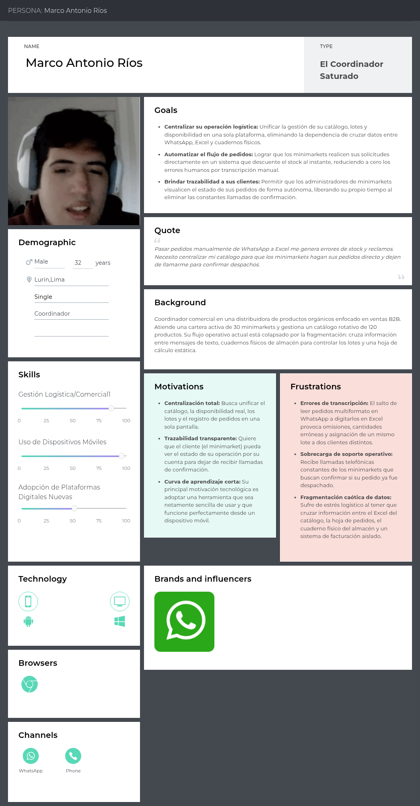

### 2.3.2. User Task Matrix.

La matriz relaciona cada tarea con los dos arquetipos. La frecuencia e importancia son estimaciones cualitativas del equipo basadas en las entrevistas 1-6; no se preguntaron ni midieron con una escala uniforme. «Propuesta» identifica tareas del flujo futuro de OrganiK cuya frecuencia debe validarse con usuarios.

**Tasks vs User Personas**

| Tasks | Administradores de Minimarkets (Frecuencia) | Administradores de Minimarkets (Importancia) | Proveedores B2B (Frecuencia) | Proveedores B2B (Importancia) |
| :--- | :---: | :---: | :---: | :---: |
| Controlar inventario y niveles de stock | Muy frecuente | Alta | No aplica | No aplica |
| Gestionar catálogo propio y disponibilidad | No aplica | No aplica | Muy frecuente | Alta |
| Revisar condiciones de almacenamiento | Frecuente | Alta | No aplica | No aplica |
| Controlar lotes y fechas de vencimiento | Muy frecuente | Alta | Frecuente | Alta |
| Consultar catálogo de proveedores conectados | Frecuente | Alta | No aplica | No aplica |
| Generar pedidos dirigidos al minimarket (propuesta) | No aplica | No aplica | Por validar | Alta |
| Evaluar pedidos entrantes (propuesta) | Por validar | Alta | No aplica | No aplica |
| Registrar entrada de productos en inventario | Frecuente | Alta | No aplica | No aplica |
| Realizar seguimiento de pedidos activos | Frecuente | Alta | Muy frecuente | Alta |
| Consultar resumen de operaciones (propuesta) | Por validar | Media | Por validar | Media |
| Gestionar mermas, pérdidas o donaciones | Ocasional | Media | No aplica | No aplica |
| Comunicarse y resolver incidencias de logística | Ocasional | Alta | Frecuente | Alta |

La prioridad inicial recae en stock, lotes y conservación para administradores, y en disponibilidad y pedidos para proveedores. La aceptación de un pedido y su efecto sobre el inventario son responsabilidades distintas: el proveedor propone; el administrador decide y mantiene el control de su inventario. Las estimaciones de frecuencia deben ajustarse tras completar la muestra y observar tareas reales.

### 2.3.3. User Journey Mapping.

Los recorridos *As-Is* describen el trabajo actual, desde la detección de una necesidad hasta el seguimiento del abastecimiento. Las etapas se derivan de los resúmenes disponibles; las emociones son interpretaciones que deben comprobarse con cada entrevistado. Las oportunidades expresan decisiones de diseño, no funciones ya utilizadas.

**User Journey Map 1: Administrador de minimarket (entrevistas 1-3)**

| Etapa | Acción y punto de contacto actual | Dificultad y emoción inferida | Oportunidad para OrganiK |
|:---|:---|:---|:---|
| Revisar productos | Consulta POS, hoja de cálculo, libreta y anaqueles para verificar stock, lotes y vencimientos. | Cruza registros distintos; posible preocupación por omitir un producto en riesgo. | Mostrar inventario y lotes en una vista consultable desde el celular. |
| Comprobar conservación | Inspecciona vitrinas o congeladoras y lee un termómetro físico. | La inspección es discontinua; incertidumbre ante una falla fuera de horario. | Registrar condiciones y alertar sobre valores fuera de rango; validar primero con datos simulados. |
| Decidir reposición | Identifica faltantes o productos próximos a vencer y consulta catálogos por mensajería. | Debe verificar información en canales separados; posible frustración por demora. | Mostrar stock bajo y disponibilidad de proveedores. |
| Coordinar pedido | Intercambia mensajes o llamadas con el proveedor y verifica cantidades. | Cambios y confirmaciones pueden perderse en el chat. | Permitir revisar y aceptar o rechazar una propuesta del proveedor. |
| Registrar resultado | Actualiza sus registros cuando ingresa mercadería y continúa el control. | La actualización manual puede dejar datos desfasados. | Registrar la decisión y actualizar el inventario solo tras la aceptación del administrador. |

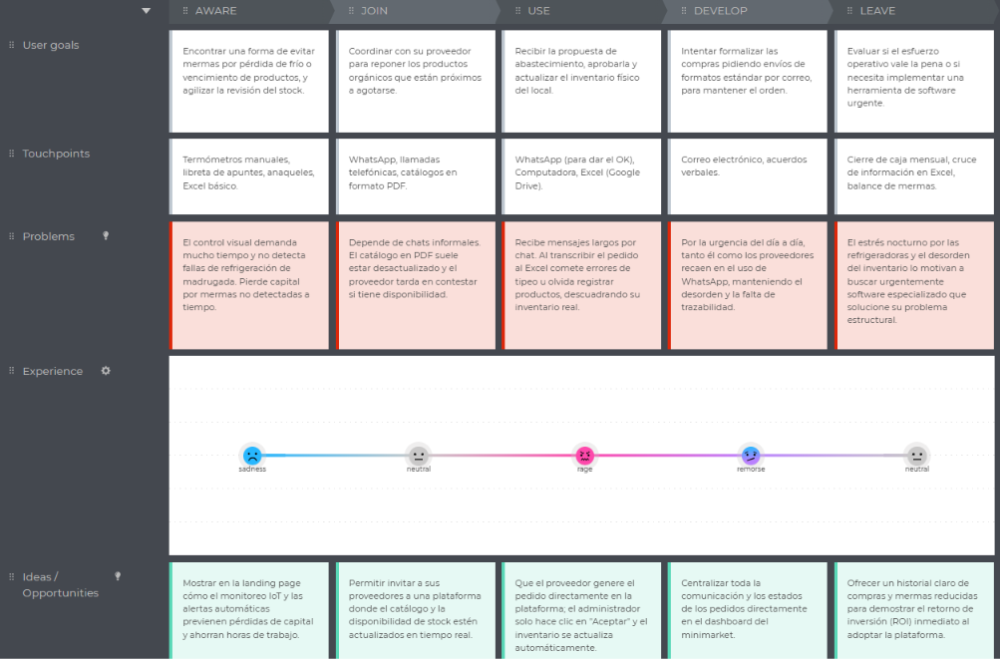

**User Journey Map 2: Proveedor de productos orgánicos (entrevistas 4, 5 y 6)**

| Etapa | Acción y punto de contacto actual | Dificultad y emoción inferida | Oportunidad para OrganiK |
|:---|:---|:---|:---|
| Mantener oferta | Actualiza catálogo en Excel o PDF y registra lotes o disponibilidad con herramientas separadas. | La información puede desactualizarse; preocupación por ofrecer stock inexistente. | Reunir catálogo, lotes y disponibilidad. |
| Recibir y verificar solicitudes | Atiende mensajes o llamadas de minimarkets y contrasta con el almacén. | Solicitudes en formatos distintos exigen comprobación manual. | Preparar una propuesta de pedido con productos y cantidades verificables. |
| Registrar pedido | Transcribe la información a una hoja o sistema de ventas. | Marco y Juan relatan errores u omisiones; posible tensión por corregirlos. | Generar el pedido dirigido al minimarket desde un registro estructurado. |
| Coordinar preparación | Confirma disponibilidad, lotes y cambios antes del despacho. | Las modificaciones repartidas entre chats pueden ser difíciles de rastrear. | Conservar el estado y el historial de cambios de la operación. |
| Dar seguimiento | Responde consultas sobre confirmación o despacho por mensajería y llamadas. | Repetir respuestas consume tiempo; posible frustración. | Compartir con el administrador el estado del pedido y su decisión de aceptación o rechazo. |

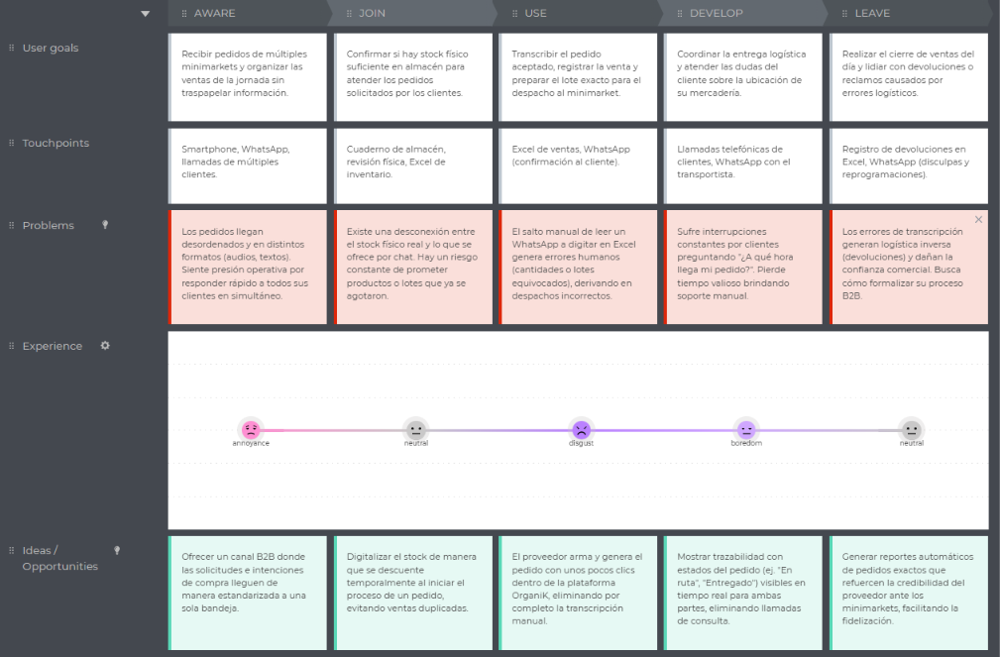

### 2.3.4. Empathy Mapping.

Los mapas sintetizan lo descrito en las entrevistas; «piensa y siente» y «oye» son inferencias cuando el resumen no contiene una declaración explícita. No se atribuyen frases literales ni datos demográficos a personajes inventados.

**Empathy Map: Administrador operativo (entrevistas 1-3)**

| Pregunta del lienzo | Síntesis y origen |
|:---|:---|
| ¿Con quién empatizamos? | Administrador que controla inventario, conservación y abastecimiento durante la jornada (1-3). |
| ¿Qué necesita hacer? | Detectar faltantes, revisar lotes y vencimientos, comprobar condiciones y coordinar reposición (1-3). |
| ¿Qué ve? | Anaqueles, refrigeradoras, registros separados en POS o sistema de ventas, Excel y libreta (1-3). |
| ¿Qué dice? | Según los registros, el control manual toma tiempo y una vista centralizada con alertas sería útil (1-3; paráfrasis). |
| ¿Qué hace? | Revisa productos y termómetros, consulta catálogos y coordina con proveedores por WhatsApp (1-3). |
| ¿Qué oye? | Recibe información de proveedores por mensajería; no se documentaron opiniones de terceros en las fichas (1-3). |
| ¿Qué piensa y siente? | Posible preocupación por mermas, diferencias de stock y fallas no detectadas; inferencia a partir de las dificultades relatadas (1-3). |
| Pains / Gains | Riesgo de deterioro y tiempo de control manual / información accesible y alertas oportunas; beneficios aún por validar. |

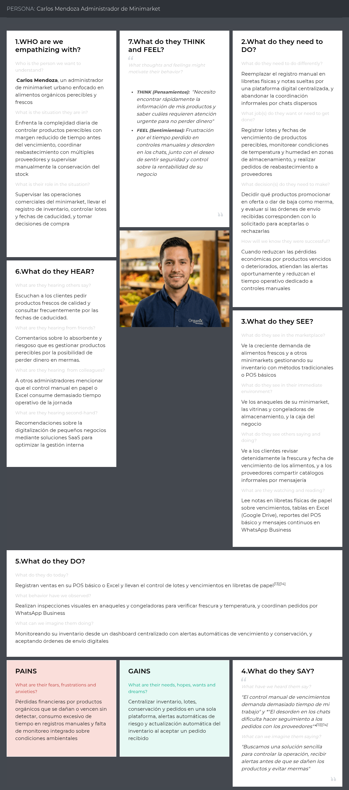

**Empathy Map: Responsable comercial de proveedor (entrevistas 4, 5 y 6)**

| Pregunta del lienzo | Síntesis y origen |
|:---|:---|
| ¿Con quién empatizamos? | Persona que mantiene oferta y disponibilidad y atiende pedidos para minimarkets (4-6). |
| ¿Qué necesita hacer? | Verificar stock y lotes, registrar pedidos y comunicar sus cambios o estados (4-6). |
| ¿Qué ve? | Excel, mensajes, catálogos y, en los casos descritos, registros de almacén separados (4-6). |
| ¿Qué dice? | Los resúmenes mencionan dificultades para sincronizar disponibilidad y seguir pedidos; Marco pide simplicidad y uso móvil (4-6; paráfrasis). |
| ¿Qué hace? | Atiende solicitudes, verifica existencias, prepara productos y responde consultas por mensajería o llamadas (4-6). |
| ¿Qué oye? | Solicitudes y consultas de minimarkets sobre disponibilidad o despachos; no se documentaron otras voces del entorno (4-6). |
| ¿Qué piensa y siente? | Posible presión por errores de cantidad y necesidad de confirmar información; inferencia a partir de los incidentes relatados (4, 5). |
| Pains / Gains | Información dispersa y seguimiento manual / catálogo y estado de pedidos consultables; beneficios aún por validar. |

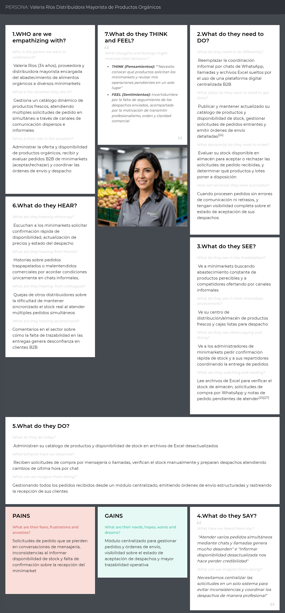

## 2.4. Big Picture Event Storming.
El *Big Picture Event Storming* organiza en secuencia los hechos relevantes del negocio, los actores que los provocan y los puntos donde puede perderse información. La imagen conserva la lluvia de eventos inicial; la siguiente línea de tiempo ordena y completa ese inventario para el flujo propuesto de OrganiK. Los eventos están redactados como hechos ya ocurridos dentro del modelo, no como afirmaciones de que la plataforma esté implementada.

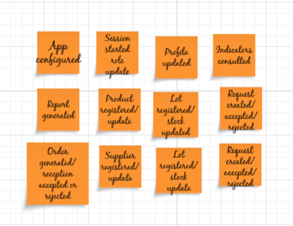

| Secuencia | Actor y acción | Evento de dominio | Regla o punto de atención |
|:---|:---|:---|:---|
| 1 | Proveedor registra o corrige un producto y su lote. | Producto registrado; lote actualizado. | La cantidad y el vencimiento deben corresponder al lote ofrecido. |
| 2 | Proveedor revisa la disponibilidad antes de ofrecer productos. | Disponibilidad actualizada. | Una oferta desfasada puede generar un pedido que no se pueda atender. |
| 3 | Administrador revisa stock, lotes y vencimientos de su minimarket. | Stock bajo detectado; producto próximo a vencer detectado. | El dato debe asociarse al inventario del minimarket, no al del proveedor. |
| 4 | Sistema evalúa condiciones de almacenamiento registradas. | Condición fuera de rango detectada; alerta emitida. | En la etapa inicial se usan datos simulados; una alerta no equivale a merma comprobada. |
| 5 | Proveedor prepara una propuesta de abastecimiento para un minimarket. | Pedido generado. | Debe indicar productos, cantidades y minimarket destinatario; todavía no cambia el inventario del receptor. |
| 6 | Administrador examina la propuesta. | Pedido aceptado o pedido rechazado. | Solo el administrador del minimarket decide. Un rechazo conserva su inventario sin cambios. |
| 7 | Sistema registra la decisión y, si se acepta, la entrada correspondiente. | Estado de pedido actualizado; inventario del minimarket actualizado. | La actualización requiere aceptación y debe quedar asociada al pedido para su trazabilidad. |
| 8 | Ambos actores consultan el historial. | Estado de pedido consultado. | La ausencia de historial o estados consistentes reproduce la incertidumbre observada en los chats. |

Los puntos de mayor riesgo identificados son la disponibilidad desactualizada, la pérdida de cambios en pedidos y la modificación del inventario sin una decisión del administrador. Esta secuencia se usará para contrastar requisitos y prototipos; las entrevistas describen el proceso actual, mientras que los pasos 4-8 especifican la solución propuesta.

## 2.5. Ubiquitous Language.

A partir del Big Picture Event Storming se identificaron los términos y conceptos que forman el lenguaje ubicuo del dominio de OrganiK. Este glosario asegura que el equipo de desarrollo, los stakeholders y la documentación utilicen exactamente el mismo significado para cada concepto de negocio a lo largo de todo el proyecto.

| Término | Definición |
| :--- | :--- |
| **Administrador (de minimarket)** | Actor responsable de gestionar el inventario, aprobar solicitudes de abastecimiento y consultar los indicadores de su negocio dentro de OrganiK. |
| **Proveedor** | Actor B2B que gestiona su catálogo, lotes y disponibilidad y puede generar pedidos de abastecimiento dirigidos a minimarkets. |
| **Perfil de negocio** | Conjunto de datos que identifican a un administrador o proveedor dentro de la plataforma (razón social, RUC, cobertura, datos de contacto). |
| **Rol** | Nivel de acceso asignado a un usuario (administrador o proveedor) que determina las acciones y vistas disponibles para él dentro del sistema. |
| **Catálogo orgánico** | Read model que consolida todos los productos orgánicos registrados por un proveedor, con su categoría, precio y fecha de expiración validados. |
| **Lote** | Unidad de stock de un producto orgánico registrada con fecha de ingreso, cantidad y fecha de expiración, utilizada para el control de vencimientos. |
| **Stock mínimo** | Umbral configurado por producto que, al ser alcanzado, dispara el evento de stock bajo detectado y genera una alerta automática. |
| **Inventario actual** | Read model que muestra en tiempo real la cantidad disponible de cada producto y lote dentro del almacén del minimarket o proveedor. |
| **Alerta de stock bajo** | Notificación generada automáticamente cuando el inventario de un producto cae por debajo del stock mínimo configurado. |
| **Pedido de abastecimiento** | Propuesta creada por un proveedor para un minimarket, con productos y cantidades, pendiente de decisión del administrador. |
| **Aceptación o rechazo** | Decisión del administrador sobre un pedido. Un pedido rechazado no modifica su inventario. |
| **Entrada de inventario** | Registro de productos en el minimarket asociado a un pedido aceptado; solo el administrador autoriza la modificación. |
| **Directorio de proveedores** | Read model que agrupa a todos los proveedores registrados y validados (RUC y cobertura) disponibles para un minimarket. |
| **Dashboard** | Vista consolidada de indicadores operativos, distinta según el rol del usuario (administrador o proveedor), que resume el estado general del negocio. |
| **Indicador / KPI** | Métrica operativa calculada por el sistema (por ejemplo, mermas, nivel de stock o pedidos pendientes) y mostrada en el dashboard. |
| **Reporte operativo** | Documento generado por el módulo de Analytics que resume métricas y variaciones de un periodo determinado. |
| **Conservación (Conservation)** | Contexto vinculado al monitoreo de condiciones ambientales (temperatura y humedad) que afectan la calidad de los productos orgánicos almacenados. |
| **Comunicación (Communication)** | Contexto encargado de las notificaciones entre actores (por ejemplo, cambios de estado de una solicitud o una alerta de inventario). |

---

# Capítulo III: Requirements Specification

### TO-BE Scenario Mapping

#### Administradores de Minimarkets

| Fase | Doing (Qué hace) | Thinking (Qué piensa) | Feeling (Qué siente) |
|------|------------------|-----------------------|----------------------|
| Consulta y revisión de información | Consulta su dashboard para revisar inventario, lotes, vencimientos, conservación y pedidos dirigidos al minimarket. | “Necesito encontrar rápidamente los productos que requieren atención.” | Con mayor sensación de control. |
| Gestión y abastecimiento | Detecta stock bajo y consulta la disponibilidad ofrecida por proveedores; comunica sus necesidades de reposición. | “Necesito saber qué productos están disponibles para reponer.” | Atento a la disponibilidad. |
| Toma de decisión | Revisa productos y cantidades de los pedidos generados por el proveedor y decide aceptarlos o rechazarlos. | “Necesito verificar el pedido antes de incorporarlo al inventario.” | Responsable de la decisión. |
| Seguimiento y control | Consulta el historial; solo cuando acepta un pedido se actualizan las existencias del minimarket. | “Necesito saber qué fue aceptado y qué cambió en el inventario.” | Con mayor trazabilidad. |

#### Proveedores de Productos Orgánicos

| Fase | Doing (Qué hace) | Thinking (Qué piensa) | Feeling (Qué siente) |
|------|------------------|-----------------------|----------------------|
| Consulta y revisión de información | Consulta su dashboard para revisar catálogo, lotes, disponibilidad y necesidades de reposición comunicadas por minimarkets. | “Necesito saber qué puedo ofrecer y a quién.” | Con mayor claridad sobre su oferta. |
| Gestión de pedidos | Crea un pedido dirigido a un minimarket con productos y cantidades disponibles. | “Necesito registrar una propuesta verificable para el cliente.” | Atento a las cantidades. |
| Seguimiento | Consulta si el administrador aceptó o rechazó el pedido. | “Necesito conocer la decisión sin buscarla en varios canales.” | Con mayor trazabilidad. |

## 3.1. User Stories.

Las historias describen el **producto propuesto**, no funcionalidades implementadas en AV1. En Sprint 1 se implementó solo la landing page. La fuente de necesidades son las entrevistas y personas compuestas del capítulo II; H1-H7 remiten al Lean UX Canvas del capítulo I. El flujo de abastecimiento vigente es **proveedor crea pedido -> administrador acepta o rechaza -> solo la aceptación actualiza el inventario**. No se especifica una orden de envío separada en este alcance.

### Epics

| EPIC ID | Título | Descripción |
|---|---|---|
| EP-01 | Gestión de inventario | Permite registrar, visualizar, buscar y actualizar la información de los productos disponibles en el inventario del minimarket, incluyendo cantidades, mermas y productos disponibles como oferta. |
| EP-02 | Gestión de lotes y vencimientos | Permite controlar los lotes, fechas de vencimiento y trazabilidad de los productos registrados en el inventario. |
| EP-03 | Gestión de conservación | Permite registrar y visualizar las condiciones de conservación de los productos, así como generar alertas cuando se detecten condiciones de riesgo. |
| EP-04 | Gestión de abastecimiento | Permite que el proveedor genere pedidos dirigidos a minimarkets, que el administrador los acepte o rechace y que ambos consulten su estado e historial. Solo la aceptación actualiza el inventario del minimarket. |
| EP-05 | Gestión de proveedores y productos | Permite consultar y administrar la información relacionada con proveedores y los productos que ofrecen dentro de la plataforma. |
| EP-06 | Gestión de usuarios y seguridad | Permite registrar usuarios, gestionar roles y controlar el acceso a las funcionalidades mediante permisos según el segmento. |
| EP-07 | Análisis y control de gestión | Permite visualizar indicadores, historial de operaciones, alertas e información consolidada para facilitar el seguimiento de las operaciones. |
| EP-08 | Comunicación de la propuesta de valor | Permite presentar públicamente la solución y orientar a los dos segmentos hacia un primer contacto. Es el único epic con implementación en Sprint 1. |

### User Stories

| US ID | Título | Descripción | Relacionado con (EPIC ID) |
|---|---|---|---|
| US 001 | Registrar producto en inventario | **Como** administrador de minimarket, **Quiero** registrar productos en el inventario, **Para** mantener actualizada la información de los productos disponibles. | EP-01 |
| US 002 | Visualizar inventario | **Como** administrador de minimarket, **Quiero** visualizar los productos registrados, **Para** conocer el estado actual de mi inventario. | EP-01 |
| US 003 | Buscar productos en inventario | **Como** administrador de minimarket, **Quiero** buscar productos dentro del inventario, **Para** encontrarlos rápidamente. | EP-01 |
| US 004 | Filtrar inventario | **Como** administrador de minimarket, **Quiero** filtrar productos por categoría, estado o vencimiento, **Para** identificar rápidamente productos que requieren atención. | EP-01 / EP-02 |
| US 005 | Actualizar inventario | **Como** administrador de minimarket, **Quiero** actualizar la información de los productos, **Para** mantener el inventario correctamente registrado. | EP-01 |
| US 006 | Registrar lote | **Como** administrador de minimarket, **Quiero** registrar lotes de productos, **Para** mantener la trazabilidad de los productos almacenados. | EP-02 |
| US 007 | Consultar lotes | **Como** administrador de minimarket, **Quiero** consultar los lotes registrados, **Para** conocer el origen y estado de los productos. | EP-02 |
| US 008 | Controlar fechas de vencimiento | **Como** administrador de minimarket, **Quiero** visualizar las fechas de vencimiento de los productos, **Para** identificar productos próximos a vencer. | EP-02 |
| US 009 | Generar alertas de vencimiento | **Como** administrador de minimarket, **Quiero** recibir alertas sobre productos próximos a vencer, **Para** tomar acciones antes de que se generen pérdidas. | EP-02 |
| US 010 | Consultar condiciones de conservación | **Como** administrador de minimarket, **Quiero** consultar las condiciones de conservación de los productos, **Para** identificar posibles riesgos de deterioro. | EP-03 |
| US 011 | Monitorear temperatura y humedad | **Como** administrador de minimarket, **Quiero** visualizar registros de temperatura y humedad, **Para** conocer las condiciones de almacenamiento de los productos. | EP-03 |
| US 012 | Generar alertas de conservación | **Como** administrador de minimarket, **Quiero** recibir alertas cuando las condiciones de conservación sean inadecuadas, **Para** reaccionar oportunamente ante posibles riesgos de deterioro. | EP-03 |
| US 013 | Registrar merma | **Como** administrador de minimarket, **Quiero** registrar productos que hayan sufrido merma, **Para** mantener un historial de pérdidas de inventario. | EP-01 / EP-07 |
| US 014 | Registrar oferta de productos | **Como** administrador de minimarket, **Quiero** registrar productos disponibles como oferta, **Para** promocionar productos con stock disponible y mantener trazabilidad sobre su salida comercial del inventario. | EP-01 / EP-07 |
| US 015 | Consultar productos de proveedores | **Como** administrador de minimarket, **Quiero** consultar los productos ofrecidos por los proveedores, **Para** identificar opciones disponibles para abastecer el minimarket. | EP-05 |
| US 016 | Registrar productos ofrecidos | **Como** proveedor de productos orgánicos, **Quiero** registrar los productos que ofrezco, **Para** ponerlos a disposición de los minimarkets. | EP-05 |
| US 017 | Consultar productos ofrecidos | **Como** proveedor de productos orgánicos, **Quiero** consultar los productos que tengo registrados, **Para** mantener control sobre mi oferta dentro de la plataforma. | EP-05 |
| US 018 | Registrar necesidad de reposición | **Como** administrador de minimarket, **Quiero** registrar los productos y cantidades que necesito reponer, **Para** orientar mis decisiones de abastecimiento sin crear un pedido en nombre del proveedor. | EP-04 |
| US 019 | Consultar pedidos de abastecimiento | **Como** administrador de minimarket o proveedor autorizado, **Quiero** consultar los pedidos relacionados con mi negocio, **Para** conocer sus productos, cantidades y estado actual. | EP-04 |
| US 020 | Consultar necesidades de reposición | **Como** proveedor de productos orgánicos, **Quiero** consultar las necesidades de reposición compartidas por los minimarkets a los que atiendo, **Para** preparar propuestas acordes con mi disponibilidad. | EP-04 |
| US 021 | Crear pedido de abastecimiento | **Como** proveedor de productos orgánicos, **Quiero** crear un pedido dirigido a un minimarket con productos y cantidades disponibles, **Para** proponer una operación de abastecimiento verificable. | EP-04 |
| US 022 | Consultar estado de pedido | **Como** proveedor de productos orgánicos, **Quiero** consultar el estado de los pedidos que generé, **Para** conocer la decisión del administrador. | EP-04 |
| US 023 | Aceptar pedido | **Como** administrador de minimarket, **Quiero** aceptar un pedido dirigido a mi negocio después de verificar sus productos y cantidades, **Para** incorporar únicamente los productos aprobados al inventario. | EP-01 / EP-04 |
| US 024 | Rechazar pedido | **Como** administrador de minimarket, **Quiero** rechazar un pedido dirigido a mi negocio, **Para** evitar incorporar productos no aprobados al inventario. | EP-04 |
| US 025 | Consultar historial de abastecimiento | **Como** administrador de minimarket o proveedor autorizado, **Quiero** consultar el historial de pedidos y decisiones de mi negocio, **Para** mantener trazabilidad de las operaciones. | EP-04 / EP-07 |
| US 026 | Registrar usuario | **Como** usuario administrador autorizado, **Quiero** registrar usuarios en el sistema, **Para** permitir el acceso controlado a OrganiK. | EP-06 |
| US 027 | Inicio de sesión | **Como** usuario, **Quiero** iniciar sesión, **Para** acceder al dashboard de OrganiK según mis permisos. | EP-06 |
| US 028 | Gestionar permisos por rol | **Como** usuario administrador autorizado, **Quiero** gestionar los permisos asociados a los roles, **Para** controlar las acciones que cada segmento puede realizar. | EP-06 |
| US 029 | Controlar acceso según operación | **Como** administrador de minimarket o proveedor, **Quiero** que las acciones disponibles en pedidos e inventario dependan de mi rol y negocio, **Para** evitar modificaciones no autorizadas. | EP-01 / EP-04 / EP-06 |
| US 030 | Dashboard por segmento | **Como** administrador de minimarket o proveedor, **Quiero** visualizar un dashboard con información de las tareas de mi segmento, **Para** consultar rápidamente el estado de mis operaciones. | EP-07 |
| US00 | Conocer OrganiK en la landing page | **Como** administrador de minimarket o proveedor que visita la página pública, **Quiero** conocer la propuesta de OrganiK y disponer de un medio de contacto, **Para** evaluar si responde a mis necesidades de inventario o abastecimiento. | EP-08 |

**Criterios de aceptación de User Stories (escenarios Given-When-Then):** Los umbrales de alertas, anticipación de vencimiento y disponibilidad se configuran por producto o negocio; no se inventan valores numéricos que aún no se han validado. Cada escenario requiere un usuario autenticado del negocio indicado, salvo US 027.

| US ID | Criterio de aceptación verificable |
|---|---|
| US 001 | Dado un administrador autorizado y un producto con datos obligatorios válidos, cuando registra el producto y su cantidad inicial, entonces aparece una sola vez en el inventario de su minimarket; con datos obligatorios ausentes no se guarda. |
| US 002 | Dado un minimarket con productos registrados, cuando su administrador abre inventario, entonces ve producto, cantidad, lote y vencimiento cuando apliquen; no ve existencias de otro negocio. |
| US 003 | Dado un inventario con productos, cuando el administrador busca por nombre o código, entonces se muestran solo coincidencias de su negocio; una búsqueda sin coincidencias informa que no hay resultados. |
| US 004 | Dado un inventario con categorías, estados y vencimientos, cuando el administrador aplica filtros, entonces el listado cumple todos los filtros activos y permite restablecerlos. |
| US 005 | Dado un producto propio, cuando el administrador modifica un campo editable con valor válido, entonces se guarda el cambio y queda registrado; un proveedor no puede alterar ese inventario. |
| US 006 | Dado un producto del minimarket, cuando el administrador registra identificador de lote, cantidad y vencimiento válidos, entonces el lote queda asociado al producto; no se acepta una cantidad negativa. |
| US 007 | Dado un producto con lotes, cuando el administrador consulta su detalle, entonces ve identificador, cantidad y vencimiento de cada lote de su negocio. |
| US 008 | Dado un lote con fecha registrada, cuando el administrador consulta vencimientos, entonces ve la fecha y su estado respecto a la fecha actual; los lotes sin fecha se señalan como datos incompletos. |
| US 009 | Dado un lote dentro del umbral configurable previo al vencimiento, cuando se evalúan alertas, entonces aparece una alerta vinculada al lote; fuera del umbral no aparece como próxima a vencer. |
| US 010 | Dado un área con condiciones registradas, cuando el administrador abre su detalle, entonces ve temperatura, humedad, hora y área de la lectura; si no hay lecturas, se indica ausencia de datos. |
| US 011 | Dadas lecturas simuladas o reales identificadas por origen, cuando el administrador consulta el monitoreo, entonces ve valores, unidades, marca temporal y origen sin confundir datos simulados con sensores físicos. |
| US 012 | Dado un umbral configurado y una lectura fuera de rango, cuando se procesa la lectura, entonces se genera una alerta con área, variable y momento; una lectura dentro de rango no genera esa alerta. |
| US 013 | Dado un lote con existencias, cuando el administrador registra una merma válida no superior a la cantidad disponible, entonces disminuye el stock y queda causa y cantidad en el historial; una cantidad excesiva se rechaza. |
| US 014 | Dado un producto propio con stock, cuando el administrador registra una oferta con vigencia y cantidad válidas, entonces queda visible como oferta sin descontar automáticamente el stock; no se permite ofertar más unidades que las disponibles. |
| US 015 | Dado un proveedor vinculado con productos disponibles, cuando el administrador consulta su catálogo, entonces ve producto, disponibilidad y fecha de actualización; no modifica la oferta del proveedor. |
| US 016 | Dado un proveedor autenticado, cuando registra producto, lote y disponibilidad válidos, entonces aparecen en su catálogo; no modifica el inventario de ningún minimarket. |
| US 017 | Dado un catálogo propio, cuando el proveedor lo consulta, entonces ve sus productos, lotes y disponibilidad actual; no ve información privada de otro proveedor. |
| US 018 | Dado stock bajo y un administrador autorizado, cuando registra producto y cantidad a reponer, entonces la necesidad queda asociada a su minimarket y no se crea ni acepta un pedido automáticamente. |
| US 019 | Dado un pedido dirigido al minimarket o creado por el proveedor, cuando el usuario autorizado lo consulta, entonces ve productos, cantidades, estado y participantes; un tercero no puede verlo. |
| US 020 | Dada una necesidad compartida con un proveedor vinculado, cuando este la consulta, entonces ve producto y cantidad requerida; no puede editar la necesidad del minimarket. |
| US 021 | Dado un proveedor vinculado y disponibilidad suficiente, cuando crea un pedido con productos, cantidades positivas y minimarket destinatario, entonces queda pendiente de decisión y no altera inventario; cantidades superiores a la disponibilidad se rechazan. |
| US 022 | Dado un pedido creado por el proveedor, cuando consulta su detalle, entonces ve si está pendiente, aceptado o rechazado y la fecha de la última decisión. |
| US 023 | Dado un pedido pendiente dirigido al minimarket, cuando su administrador lo acepta, entonces queda aceptado con actor y fecha y se incorporan sus cantidades una sola vez al inventario; una segunda aceptación no duplica stock. |
| US 024 | Dado un pedido pendiente dirigido al minimarket, cuando su administrador lo rechaza, entonces queda rechazado con actor y fecha y el inventario no cambia; un pedido ya decidido no puede rechazarse de nuevo. |
| US 025 | Dado un pedido del negocio, cuando un participante autorizado abre el historial, entonces ve creación, cambios de estado, decisión, actor y fecha en orden cronológico; no accede a operaciones ajenas. |
| US 026 | Dado un administrador autorizado, cuando registra un usuario con identificador único y rol válido, entonces se crea en su negocio con ese rol; un identificador duplicado o rol no permitido se rechaza. |
| US 027 | Dadas credenciales válidas, cuando el usuario inicia sesión, entonces accede solo a su segmento y negocio; con credenciales inválidas no se crea sesión ni se revela qué dato falló. |
| US 028 | Dado un administrador autorizado, cuando asigna un rol permitido a un usuario de su negocio, entonces cambian sus permisos efectivos; no puede asignar permisos de otro negocio. |
| US 029 | Dado un proveedor, cuando intenta aceptar pedidos o editar el inventario del minimarket, entonces se deniega la operación incluso por API; solo el administrador destinatario puede decidir sobre el pedido. |
| US 030 | Dado un usuario autenticado, cuando abre su dashboard, entonces ve solo indicadores y accesos de su segmento y negocio; el administrador ve riesgos e inventario y el proveedor ve catálogo y pedidos. |
| US00 | Dado un visitante sin sesión, cuando abre la landing page, entonces puede leer la propuesta para ambos segmentos, navegar sus secciones y acceder al medio de contacto sin iniciar sesión; la página no presenta los módulos futuros como ya operativos. |

**Trazabilidad del alcance:** Las personas son compuestas a partir de las entrevistas del capítulo II. Los recorridos As-Is de administrador (inventario, conservación y reposición) y proveedor (oferta y pedidos) sustentan los grupos de historias; H1-H7 son las hipótesis del Canvas, no beneficios demostrados.

| Epic | Historias de usuario | Needfinding y Canvas |
|---|---|---|
| EP-01 / EP-02 | US 001-009, US 013-014 | Administrador: revisión de existencias, lotes y vencimientos; H1. Mermas y ofertas son alcance complementario, no evidencia de una hipótesis validada. |
| EP-03 | US 010-012 | Administrador: comprobación manual de conservación; H2 con lecturas inicialmente simuladas. |
| EP-04 / EP-05 | US 015-025 | Administrador: reposición y decisión; proveedor: catálogo, disponibilidad, creación y seguimiento de pedidos; H3-H5. |
| EP-06 / EP-07 | US 026-030 | Ambos segmentos: acceso a tareas propias y menor dispersión; H6. La viabilidad SaaS H7 requiere entrevistas y mediciones posteriores, no una función ya entregada. |
| EP-08 | US00 | Ambos segmentos: comunicación de la propuesta derivada del Canvas; landing page implementada en Sprint 1, sin afirmar que el producto web ya funciona. |

### Technical Stories

| TS ID | Título | Descripción | Relacionado con (EPIC ID) |
|---|---|---|---|
| TS-IAM-001 | Sign-in API | **Como** frontend developer, **Quiero** autenticar usuarios mediante una API de inicio de sesión, **Para** obtener las credenciales de sesión y permisos correspondientes. | EP-06 |
| TS-IAM-002 | Sign-up API | **Como** frontend developer, **Quiero** registrar usuarios mediante una API, **Para** habilitar el acceso controlado a OrganiK. | EP-06 |
| TS-IAM-003 | Users directory API | **Como** frontend developer, **Quiero** consultar y registrar usuarios mediante la API, **Para** administrar los usuarios autorizados de OrganiK. | EP-06 |
| TS-IAM-004 | User detail and update API | **Como** frontend developer, **Quiero** consultar y actualizar usuarios mediante la API, **Para** mantener sus roles o estados actualizados. | EP-06 |
| TS-PROF-001 | Profile read and update API | **Como** frontend developer, **Quiero** consultar y actualizar el perfil del usuario o negocio, **Para** mostrar información actualizada dentro de OrganiK. | EP-06 |
| TS-PROD-001 | Products catalog API | **Como** frontend developer, **Quiero** consultar y registrar productos mediante la API, **Para** alimentar el inventario y catálogo de productos ofrecidos. | EP-01 / EP-05 |
| TS-PROD-002 | Product detail and update API | **Como** frontend developer, **Quiero** consultar y actualizar productos, **Para** mantener la información actualizada. | EP-01 / EP-05 |
| TS-INV-001 | Inventory list and create API | **Como** frontend developer, **Quiero** consultar y registrar elementos del inventario, **Para** mantener actualizado el stock del minimarket. | EP-01 |
| TS-INV-002 | Inventory update API | **Como** frontend developer, **Quiero** actualizar los registros de inventario, **Para** reflejar cambios en las cantidades y datos de los productos. | EP-01 / EP-06 |
| TS-INV-003 | Inventory search and filter API | **Como** frontend developer, **Quiero** consultar el inventario utilizando filtros, **Para** implementar búsquedas por producto, categoría, estado o vencimiento. | EP-01 / EP-02 |
| TS-LOT-001 | Lots API | **Como** frontend developer, **Quiero** consultar y registrar lotes, **Para** implementar la trazabilidad de los productos. | EP-02 |
| TS-LOT-002 | Lot detail and update API | **Como** frontend developer, **Quiero** consultar y actualizar información de lotes, **Para** mantener actualizada la trazabilidad. | EP-02 |
| TS-EXP-001 | Expiration tracking API | **Como** frontend developer, **Quiero** consultar productos y lotes próximos a vencer, **Para** alimentar las alertas de vencimiento. | EP-02 |
| TS-CON-001 | Conservation monitoring API | **Como** frontend developer, **Quiero** consultar registros de temperatura y humedad, **Para** mostrar las condiciones de conservación. | EP-03 |
| TS-CON-002 | Conservation alerts API | **Como** frontend developer, **Quiero** consultar las alertas generadas por condiciones de conservación, **Para** mostrarlas al administrador. | EP-03 |
| TS-SUP-001 | Supplier directory API | **Como** frontend developer, **Quiero** consultar y registrar proveedores, **Para** mantener disponible la información necesaria para el abastecimiento. | EP-05 |
| TS-SUP-002 | Supplier products API | **Como** frontend developer, **Quiero** consultar los productos ofrecidos por cada proveedor, **Para** mostrar el catálogo disponible para los minimarkets. | EP-05 |
| TS-ORD-001 | Replenishment needs API | **Como** frontend developer, **Quiero** consultar y registrar necesidades de reposición mediante la API, **Para** mostrar al proveedor las cantidades solicitadas sin crear pedidos en su nombre. | EP-04 |
| TS-ORD-002 | Supplier orders API | **Como** frontend developer, **Quiero** crear y consultar pedidos dirigidos por proveedores a minimarkets, **Para** registrar productos, cantidades y estado de cada propuesta. | EP-04 |
| TS-ORD-003 | Order decision API | **Como** frontend developer, **Quiero** aceptar o rechazar pedidos mediante la API con autorización del administrador, **Para** registrar su decisión y actualizar inventario solo cuando corresponda. | EP-01 / EP-04 / EP-06 |
| TS-ORD-004 | Order history API | **Como** frontend developer, **Quiero** consultar el historial de estados y decisiones de pedidos, **Para** mostrar la trazabilidad a ambos segmentos sin exponer datos de otros negocios. | EP-04 / EP-07 |
| TS-MER-001 | Waste and offer API | **Como** frontend developer, **Quiero** registrar mermas y ofertas de productos, **Para** mantener trazabilidad sobre las operaciones que afectan el inventario. | EP-01 / EP-07 |
| TS-DASH-001 | Dashboard API | **Como** frontend developer, **Quiero** consultar indicadores correspondientes al segmento y negocio autenticados, **Para** alimentar dashboards diferenciados. | EP-07 |
| TS-DASH-002 | Alerts and notifications API | **Como** frontend developer, **Quiero** consultar las alertas y notificaciones del usuario, **Para** informar oportunamente sobre eventos relevantes. | EP-03 / EP-07 |
| TS-AUD-001 | Activity history API | **Como** frontend developer, **Quiero** consultar el historial de operaciones, **Para** mantener trazabilidad de las acciones realizadas en OrganiK. | EP-06 / EP-07 |

**Relación y criterios de aceptación de Technical Stories:** Los contratos REST son propuestos para sprints posteriores. En todos los endpoints privados, una petición sin sesión válida debe rechazarse y una petición a datos de otro negocio debe denegarse. Las respuestas correctas deben devolver datos del negocio autorizado sin filtrar información ajena.

| TS ID | US vinculadas | Criterio de aceptación técnico |
|---|---|---|
| TS-IAM-001 | US 027, 029 | Credenciales válidas crean sesión con rol y negocio; credenciales inválidas no crean sesión. |
| TS-IAM-002 | US 026 | Registro válido crea usuario único con rol permitido; duplicados son rechazados. |
| TS-IAM-003 | US 026, 028 | Listado y creación muestran solo usuarios del negocio autorizado. |
| TS-IAM-004 | US 026, 028 | Consulta y cambio de rol o estado persisten solo para usuarios del mismo negocio. |
| TS-PROF-001 | US 027, 030 | Consulta devuelve perfil propio; actualización ajena se deniega. |
| TS-PROD-001 | US 001, 016 | Creación distingue catálogo de proveedor e inventario de minimarket según rol. |
| TS-PROD-002 | US 005, 017 | Consulta y actualización conservan propietario; un proveedor no altera productos ajenos. |
| TS-INV-001 | US 001, 002 | Alta y listado devuelven cantidad y producto del minimarket autenticado. |
| TS-INV-002 | US 005, 023, 029 | Cambio directo requiere administrador; aceptación repetida del pedido no duplica cantidad. |
| TS-INV-003 | US 003, 004 | Búsqueda y filtros combinados devuelven solo coincidencias del minimarket. |
| TS-LOT-001 | US 006, 007 | Alta de lote exige producto, identificador y cantidad válidos; listado conserva asociación. |
| TS-LOT-002 | US 007, 008 | Detalle y actualización conservan lote, vencimiento y negocio asociado. |
| TS-EXP-001 | US 008, 009 | Consulta clasifica lotes según fecha y umbral configurable, sin alertar fuera del umbral. |
| TS-CON-001 | US 010, 011 | Lectura devuelve valor, unidad, momento, área y origen simulado o real. |
| TS-CON-002 | US 012 | Fuera de umbral se expone alerta vinculada a lectura y área; dentro de umbral no. |
| TS-SUP-001 | US 015-017 | Directorio muestra proveedores vinculados; otro negocio no edita sus datos. |
| TS-SUP-002 | US 015-017 | Catálogo devuelve producto, lote, disponibilidad y fecha de actualización del proveedor. |
| TS-ORD-001 | US 018, 020 | Alta de necesidad no crea pedido; lectura del proveedor exige vínculo con minimarket. |
| TS-ORD-002 | US 019, 021, 022 | Solo proveedor vinculado crea pedido pendiente con cantidades válidas; la creación no modifica stock. |
| TS-ORD-003 | US 023, 024, 029 | Solo administrador destinatario decide pedido pendiente; aceptación incrementa stock una vez y rechazo no lo modifica. |
| TS-ORD-004 | US 019, 022, 025 | Historial devuelve eventos con actor, estado y fecha solo a participantes autorizados. |
| TS-MER-001 | US 013, 014 | Merma válida descuenta stock; oferta válida se registra sin descuento automático. |
| TS-DASH-001 | US 030 | Respuesta separa indicadores por segmento y negocio. |
| TS-DASH-002 | US 009, 012 | Notificaciones incluyen tipo, origen y estado; no incluyen alertas de otro negocio. |
| TS-AUD-001 | US 025, 028, 029 | Historial conserva actor, acción y fecha y se consulta solo con permiso. |

Las historias de implementación del Product Backlog también tienen una condición de cierre: **IMP-BE-001** exige que el servicio arranque, responda a health check y publique documentación de API sin exponer secretos; **IMP-BE-002** exige migraciones reproducibles y datos iniciales de prueba aislados por negocio; **IMP-BE-003** exige pruebas de autorización y de transición pendiente-aceptado/rechazado, incluida la aceptación repetida sin duplicar stock. Se vinculan respectivamente con TS-IAM-001/TS-DASH-001, TS-INV-001/TS-PROD-001 y TS-ORD-002/TS-ORD-003.

#### Functional Stories

| FS ID | Título | Descripción | Relacionado con (EPIC ID) |
|---|---|---|---|
| FS-001 | Permisos de creación de pedidos | **Como** sistema, **Quiero** permitir la creación de pedidos únicamente a proveedores autorizados, **Para** impedir que otros roles propongan abastecimiento en su nombre. | EP-04 / EP-06 |
| FS-002 | Permisos de decisión e inventario | **Como** sistema, **Quiero** reservar la aceptación o rechazo al administrador destinatario, **Para** actualizar inventario solo tras su aceptación y conservar el estado anterior si rechaza. | EP-01 / EP-04 / EP-06 |

**Criterios de aceptación de Functional Stories:** FS-001 se cumple si solo un proveedor vinculado puede crear un pedido pendiente para el minimarket destinatario y ningún usuario puede crear pedidos en nombre de otro proveedor. FS-002 se cumple si únicamente el administrador destinatario decide un pedido pendiente; aceptar registra la decisión y añade cantidades al inventario una sola vez, mientras rechazar registra la decisión sin alterar existencias.

#### Flujo principal de abastecimiento

El flujo de abastecimiento de **OrganiK** se desarrolla de la siguiente manera:

1. El **administrador** identifica productos por reponer y puede compartir esa necesidad con sus proveedores autorizados.
2. El **proveedor** consulta su disponibilidad y crea un **pedido de abastecimiento** dirigido a un minimarket.
3. El **administrador destinatario** consulta productos y cantidades del pedido pendiente.
4. Si lo **acepta**, se registra la decisión y se actualiza el inventario del minimarket una sola vez; si lo **rechaza**, el inventario no cambia.
5. Ambos segmentos consultan el estado e historial del pedido. Este flujo no presupone una orden de envío separada ni demuestra que ya esté implementado.

#### API Endpoint Coverage for Backend Web Services

La siguiente matriz presenta endpoints REST **propuestos** para futuros Web Services de **OrganiK**, organizados por módulo, Technical Story y User Story. No representa servicios implementados en AV1.

Los servicios contemplan las funcionalidades requeridas por los dos segmentos objetivo de OrganiK: **administradores de minimarkets** y **proveedores de productos orgánicos**. La API utiliza el prefijo `/api/v1` para mantener una estructura versionada y facilitar futuras extensiones de los servicios.

| Endpoint | Métodos esperados | Fuente de requisito | Contexto frontend / backend |
|------|-------------------|---------------------|-----------------------------|
| `/api/v1/health` | GET | IMP-BE-001 | shared / platform |
| `/api/v1/auth/sign-in` | POST | TS-IAM-001 / US-027 | iam |
| `/api/v1/auth/sign-up` | POST | TS-IAM-002 / US-026 | iam |
| `/api/v1/users` | GET, POST | TS-IAM-003 / US-026 | iam |
| `/api/v1/users/{id}` | GET, PATCH | TS-IAM-004 / US-026 / US-028 | iam |
| `/api/v1/profiles` | GET | TS-PROF-001 | profiles |
| `/api/v1/profiles/{id}` | GET, PUT/PATCH | TS-PROF-001 | profiles |
| `/api/v1/products` | GET, POST | TS-PROD-001 / US-001 / US-016 | products |
| `/api/v1/products/{id}` | GET, PATCH, DELETE | TS-PROD-002 / US-005 / US-016 / US-017 | products |
| `/api/v1/inventory` | GET, POST | TS-INV-001 / US-001 / US-002 | inventory |
| `/api/v1/inventory/{id}` | GET, PATCH | TS-INV-002 / US-005 / US-029 | inventory |
| `/api/v1/inventory/search` | GET | TS-INV-003 / US-003 / US-004 | inventory |
| `/api/v1/lots` | GET, POST | TS-LOT-001 / US-006 / US-007 | lots |
| `/api/v1/lots/{id}` | GET, PATCH | TS-LOT-002 / US-007 | lots |
| `/api/v1/expirations` | GET | TS-EXP-001 / US-008 / US-009 | lots / expirations |
| `/api/v1/conservation/monitoring` | GET | TS-CON-001 / US-010 / US-011 | conservation |
| `/api/v1/conservation/alerts` | GET | TS-CON-002 / US-012 | conservation |
| `/api/v1/suppliers` | GET, POST | TS-SUP-001 / US-015 / US-016 / US-017 | suppliers |
| `/api/v1/suppliers/{id}` | GET, PATCH | TS-SUP-001 / US-017 | suppliers |
| `/api/v1/suppliers/{id}/products` | GET, POST | TS-SUP-002 / US-015 / US-016 / US-017 | suppliers / products |
| `/api/v1/replenishment-needs` | GET, POST | TS-ORD-001 / US-018 / US-020 | replenishment |
| `/api/v1/orders` | GET, POST | TS-ORD-002 / US-019 / US-021 / US-022 | orders |
| `/api/v1/orders/{id}` | GET | TS-ORD-002 / US-019 / US-022 | orders |
| `/api/v1/orders/{id}/accept` | POST | TS-ORD-003 / US-023 | orders / inventory |
| `/api/v1/orders/{id}/reject` | POST | TS-ORD-003 / US-024 | orders |
| `/api/v1/orders/{id}/history` | GET | TS-ORD-004 / US-025 | orders / audit |
| `/api/v1/waste` | GET, POST | TS-MER-001 / US-013 | waste |
| `/api/v1/offers` | GET, POST | TS-MER-001 / US-014 | offers |
| `/api/v1/dashboard` | GET | TS-DASH-001 / US-030 | dashboard |
| `/api/v1/notifications` | GET, PATCH | TS-DASH-002 / US-009 / US-012 | notifications |
| `/api/v1/activity-history` | GET | TS-AUD-001 / US-025 | audit |

La cobertura definida permite separar las responsabilidades de los principales módulos de OrganiK. **IAM y Profiles** administran la identidad, autenticación y datos de los usuarios; **Products, Inventory y Lots** gestionan los productos, existencias, lotes y fechas de vencimiento; mientras que **Conservation** proporciona acceso a la información relacionada con las condiciones de conservación y sus respectivas alertas.

Por otro lado, **Suppliers y Orders** soportarían el proceso de abastecimiento entre proveedores y administradores de minimarkets. Los proveedores gestionarían los productos que ofrecen y crearían pedidos dirigidos a minimarkets; los administradores aceptarían o rechazarían esos pedidos. La aceptación y actualización del inventario deben ser una operación única para impedir duplicaciones.

Finalmente, los servicios propuestos de **Waste and Offers, Dashboard, Notifications y Activity History** complementarían el registro de mermas y ofertas, la consulta de información por segmento, las alertas y el seguimiento de decisiones. El alcance de donaciones aún no está especificado como historia ni endpoint de esta matriz.

## 3.2. Impact Mapping.

El objetivo de negocio propuesto es reducir pérdidas de productos perecibles y mejorar la trazabilidad del abastecimiento. Su magnitud todavía requiere una línea base y validación posterior; no se atribuye un porcentaje de mejora al AV1. El mapa relaciona el objetivo (why), las personas (who), los cambios esperados en sus tareas (how) y los entregables propuestos (what).

| Objetivo (why) | Persona (who) | Impacto esperado (how) | Entregable propuesto (what) | Historias |
|---|---|---|---|---|
| Detectar riesgos de pérdida con mayor anticipación | Administrador de minimarket | Identifica lotes próximos a vencer y condiciones de conservación fuera de rango | Inventario por lotes, alertas de vencimiento y monitoreo inicialmente simulado | US 001-012; TS-INV-001, TS-LOT-001, TS-EXP-001, TS-CON-001, TS-CON-002 |
| Decidir reposición con información vigente | Administrador de minimarket | Identifica stock bajo, consulta oferta y comparte necesidades | Consulta de catálogo y registro de necesidades de reposición | US 015, US 018; TS-SUP-002, TS-ORD-001 |
| Coordinar abastecimiento con menos dispersión | Proveedor de productos orgánicos | Mantiene disponibilidad, crea pedidos dirigidos a minimarkets y sigue su estado | Catálogo y pedidos con estado e historial | US 016-017, US 020-022, US 025; TS-SUP-002, TS-ORD-002, TS-ORD-004 |
| Conservar control sobre las existencias | Administrador de minimarket | Acepta o rechaza pedidos del proveedor antes de modificar inventario | Decisión autorizada con actualización única de stock solo al aceptar | US 019, US 023-025, US 029; TS-ORD-003 |

**Necesidad, oportunidad y comprobación.** Las entrevistas de los tres administradores describen registros de stock, lotes y vencimientos dispersos; las de los tres proveedores describen catálogos y coordinación de pedidos por herramientas separadas (capítulo II). Esta muestra orienta el diseño, pero no cuantifica la pérdida de todos los minimarkets ni prueba demanda de pago. El benchmark del capítulo II identifica herramientas de inventario y compras; la oportunidad *por validar* es combinar conservación de perecibles, trazabilidad por lote y un pedido iniciado por el proveedor cuya incorporación al inventario controla el administrador. No se afirma que ninguna otra solución ofrezca estas funciones ni que OrganiK ya sea superior.

| Decisión de producto | Evidencia disponible | Hipótesis y medida para comprobarla | Incertidumbre que permanece |
|---|---|---|---|
| Priorizar registro de lotes y vencimientos | Administradores relatan revisión manual o fragmentada (entrevistas 1-3, capítulo II). | H1: porcentaje de productos con lote y vencimiento registrados y tiempo para localizar un producto en riesgo, comparados con la práctica actual. | Falta línea base operativa y prueba de tareas con usuarios. |
| Probar alertas de conservación con lecturas simuladas antes de adquirir sensores | Administradores describen comprobaciones de temperatura manuales; el alcance del AV1 no incluye hardware. | H2: finalización y tiempo de detección de una lectura fuera de umbral en un prototipo; la reducción de merma se mediría solo en un piloto posterior. | No se conoce aún la precisión ni el costo de integrar sensores físicos. |
| Priorizar el pedido proveedor-administrador y la decisión sobre inventario | Ambos segmentos describen coordinación dispersa; el Canvas plantea un flujo compartido con permisos diferenciados. | H3-H5: tareas de creación, consulta y decisión completadas; porcentaje de pedidos con estado e historial y ausencia de cambios de stock ante rechazo o aceptación repetida. | Debe comprobarse si ambos segmentos usarían el mismo flujo en su operación real. |
| Posponer funciones complementarias hasta validar el núcleo | Mermas, ofertas e indicadores están en el alcance propuesto, pero no son la prueba inicial de la coordinación diferencial. | H6-H7: observar uso de dashboards y contrastar valor percibido y disposición de pago con costos del servicio en un piloto. | No hay todavía datos de adquisición, operación, ahorro o ingresos para afirmar rentabilidad. |

La viabilidad económica requiere estimar por separado el costo de desarrollo y operación (incluidos soporte, alojamiento y eventual hardware), el ingreso que aceptarían pagar los negocios y el beneficio medido en pilotos. Solo después podrá compararse el ingreso esperado con los costos y comprobar si el ahorro atribuido a OrganiK justifica su precio. Las entrevistas actuales expresan problemas y expectativas, no una validación de rentabilidad.

La imagen anterior del Impact Mapping permanece en los recursos del repositorio, pero no se presenta como versión vigente porque contiene órdenes de envío y metas aún no verificadas. Una nueva lámina debe representar el flujo y las relaciones de esta tabla.

## 3.3. Product Backlog.

La fila US00 corresponde a la landing page implementada en Sprint 1. Las demás historias describen el producto y trabajo técnico propuestos para etapas posteriores. El número de registro conserva la trazabilidad con el backlog original; **no indica prioridad de ejecución**. Los identificadores `US 001` de la tabla de historias y `US-001` del backlog designan la misma historia. Los Story Points son estimaciones existentes que deberán revisarse al planificar cada sprint, no fechas ni evidencia de ejecución.

**Secuencia de entrega y decisiones:** Se prioriza comprobar el valor diferencial con el menor trabajo que permita observar tareas reales. Cada incremento depende del anterior; las historias de acceso y persistencia se ejecutan antes de los módulos que las requieren, aunque tengan un número de registro mayor.

| Incremento | Historias del backlog y dependencia | Decisión y resultado comprobable |
|---|---|---|
| AV1 / Sprint 1: comunicación | US00, sin dependencia del backend. | Landing page implementada. Permite presentar la propuesta y abrir contacto; no valida todavía el producto operativo. |
| A: base segura de un piloto | IMP-BE-001, IMP-BE-002; US-026-029; TS-IAM-001-004, TS-PROF-001. | Identidad, aislamiento por negocio y persistencia antes de registrar inventario o pedidos. No avanzar si un proveedor puede modificar existencias ajenas. |
| B: visibilidad de perecibles | US-001-009; TS-PROD-001-002, TS-INV-001-003, TS-LOT-001-002, TS-EXP-001, TS-DASH-002 para alertas de vencimiento. Depende de A. | Probar con administradores el registro y localización de stock, lotes y vencimientos (H1). Medir finalización, errores y tiempo frente al proceso actual. |
| C: coordinación entre segmentos | US-015-025; TS-SUP-001-002, TS-ORD-001-004, TS-AUD-001, IMP-BE-003. Depende de A y de inventario en B para aceptar un pedido. | Probar con proveedor y administrador el flujo completo (H3-H5). No avanzar si el pedido rechazado altera existencias, una aceptación duplica stock o los participantes no comprenden el estado. |
| D: conservación y apoyo operativo | US-010-014, US-030; TS-CON-001-002, TS-MER-001, TS-DASH-001 y extensión de TS-DASH-002 para alertas de conservación. Depende de datos de inventario y permisos. | Validar alertas con lecturas simuladas (H2), dashboards (H6) y funciones complementarias. Sensores reales solo después de valorar precisión y costo. |

La **prioridad para el siguiente avance** es preparar A y probar prototipos de B y C con usuarios de ambos segmentos, incluida una alerta de conservación simulada de D para contrastar la propuesta integrada antes de construirla completa. Si las tareas esenciales no se completan o el flujo de pedidos causa errores, se revisan las historias antes de ampliar el alcance. La decisión de comercializar como SaaS (H7) queda condicionada a un piloto con costos, disposición de pago y beneficios medidos; no se deduce de los Story Points ni del benchmark.

| N.º de registro | User Story ID | Título | Descripción | Story Points |
|------|--------------|--------|-------------|--------------|
| 0 | US00 | Conocer OrganiK en la landing page | Como administrador o proveedor visitante, quiero conocer la propuesta de valor y el medio de contacto para evaluar OrganiK. | 5 |
| 1 | US-001 | Registrar producto en inventario | Como administrador de minimarket, quiero registrar productos en el inventario para mantener un control estructurado de los productos disponibles. | 5 |
| 2 | US-002 | Visualizar inventario | Como administrador de minimarket, quiero visualizar el inventario para conocer los productos disponibles y su información actual. | 5 |
| 3 | US-003 | Buscar productos en inventario | Como administrador de minimarket, quiero buscar productos en el inventario para encontrarlos rápidamente. | 3 |
| 4 | US-004 | Filtrar inventario | Como administrador de minimarket, quiero filtrar el inventario por diferentes criterios para consultar productos de manera eficiente. | 3 |
| 5 | US-005 | Actualizar inventario | Como administrador de minimarket, quiero actualizar la información del inventario para mantener los datos de los productos actualizados. | 5 |
| 6 | US-006 | Registrar lote | Como administrador de minimarket, quiero registrar lotes de productos para mantener la trazabilidad de los productos almacenados. | 5 |
| 7 | US-007 | Consultar lotes | Como administrador de minimarket, quiero consultar los lotes registrados para conocer la información asociada a cada grupo de productos. | 3 |
| 8 | US-008 | Controlar fechas de vencimiento | Como administrador de minimarket, quiero consultar las fechas de vencimiento de los productos para identificar aquellos que requieren atención. | 5 |
| 9 | US-009 | Generar alertas de vencimiento | Como administrador de minimarket, quiero recibir alertas sobre productos próximos a vencer para tomar acciones oportunamente. | 3 |
| 10 | US-010 | Consultar condiciones de conservación | Como administrador de minimarket, quiero consultar las condiciones de conservación de los productos para verificar que se mantengan adecuadamente almacenados. | 3 |
| 11 | US-011 | Monitorear temperatura y humedad | Como administrador de minimarket, quiero visualizar los datos de temperatura y humedad de las áreas de almacenamiento para identificar condiciones que puedan afectar los productos. | 5 |
| 12 | US-012 | Generar alertas de conservación | Como administrador de minimarket, quiero recibir alertas cuando las condiciones de conservación representen un riesgo para los productos. | 5 |
| 13 | US-013 | Registrar merma | Como administrador de minimarket, quiero registrar productos que hayan sufrido merma para mantener un control de las pérdidas. | 3 |
| 14 | US-014 | Registrar oferta de productos | Como administrador de minimarket, quiero registrar productos disponibles como oferta para promocionar productos con stock disponible y mantener trazabilidad sobre su salida comercial del inventario. | 3 |
| 15 | US-015 | Consultar productos de proveedores | Como administrador de minimarket, quiero consultar los productos ofrecidos por los proveedores para identificar opciones de abastecimiento. | 5 |
| 16 | US-016 | Registrar productos ofrecidos | Como proveedor, quiero registrar los productos que ofrezco para ponerlos a disposición de los minimarkets. | 5 |
| 17 | US-017 | Consultar productos ofrecidos | Como proveedor, quiero consultar los productos que ofrezco para verificar su información y disponibilidad. | 3 |
| 18 | US-018 | Registrar necesidad de reposición | Como administrador de minimarket, quiero registrar productos y cantidades por reponer para orientar el abastecimiento sin crear pedidos en nombre del proveedor. | 5 |
| 19 | US-019 | Consultar pedidos de abastecimiento | Como administrador o proveedor autorizado, quiero consultar los pedidos relacionados con mi negocio para conocer productos, cantidades y estado. | 3 |
| 20 | US-020 | Consultar necesidades de reposición | Como proveedor, quiero consultar necesidades compartidas por minimarkets vinculados para preparar propuestas según mi disponibilidad. | 3 |
| 21 | US-021 | Crear pedido de abastecimiento | Como proveedor, quiero crear un pedido dirigido a un minimarket para proponer productos y cantidades disponibles. | 5 |
| 22 | US-022 | Consultar estado de pedido | Como proveedor, quiero consultar si mis pedidos fueron aceptados o rechazados para darles seguimiento. | 3 |
| 23 | US-023 | Aceptar pedido | Como administrador, quiero aceptar un pedido dirigido a mi minimarket para incorporar una sola vez los productos aprobados al inventario. | 5 |
| 24 | US-024 | Rechazar pedido | Como administrador, quiero rechazar un pedido dirigido a mi minimarket para impedir cambios de inventario no aprobados. | 3 |
| 25 | US-025 | Consultar historial de abastecimiento | Como participante autorizado, quiero consultar los pedidos y decisiones de mi negocio para mantener trazabilidad. | 3 |
| 26 | US-026 | Registrar usuario | Como administrador, quiero registrar usuarios en el sistema para permitir el acceso controlado a OrganiK. | 3 |
| 27 | US-027 | Inicio de sesión | Como usuario, quiero iniciar sesión para acceder a OrganiK según los permisos correspondientes a mi rol. | 3 |
| 28 | US-028 | Gestionar permisos por rol | Como administrador, quiero gestionar los permisos de los usuarios según su rol para controlar las acciones disponibles dentro de OrganiK. | 5 |
| 29 | US-029 | Controlar acceso según operación | Como administrador o proveedor, quiero que las acciones sobre pedidos e inventario dependan de mi rol y negocio para evitar modificaciones no autorizadas. | 5 |
| 30 | US-030 | Dashboard por segmento | Como administrador o proveedor, quiero visualizar indicadores y tareas de mi segmento para consultar rápidamente mis operaciones. | 5 |
| 31 | IMP-BE-001 | Backend foundations | Como desarrollador, quiero configurar ASP.NET Core/C# con seguridad, health check, Swagger y XML docs para sostener los Web Services de OrganiK. | 3 |
| 32 | IMP-BE-002 | Persistence, migrations and seed data | Como desarrollador, quiero configurar EF Core, persistencia, migraciones y datos iniciales para reemplazar los datos simulados con persistencia real. | 5 |
| 33 | TS-IAM-001 | Sign-in API | Como frontend developer, quiero autenticar usuarios mediante `POST /api/v1/auth/sign-in` para obtener una sesión segura. | 2 |
| 34 | TS-IAM-002 | Sign-up API | Como frontend developer, quiero registrar usuarios mediante `POST /api/v1/auth/sign-up` para habilitar el registro de nuevos usuarios. | 2 |
| 35 | TS-IAM-003 | Users directory API | Como frontend developer, quiero listar y crear usuarios mediante `/api/v1/users` para administrar los accesos al sistema. | 3 |
| 36 | TS-IAM-004 | User detail and update API | Como frontend developer, quiero consultar y actualizar usuarios mediante `/api/v1/users/{id}` para gestionar su información y estado. | 3 |
| 37 | TS-PROF-001 | Profile read and update API | Como frontend developer, quiero consultar y actualizar perfiles mediante `/api/v1/profiles` y `/api/v1/profiles/{id}` para mantener actualizada la información del usuario. | 3 |
| 38 | TS-PROD-001 | Products catalog API | Como frontend developer, quiero consumir `/api/v1/products` para consultar y gestionar el catálogo de productos orgánicos. | 3 |
| 39 | TS-PROD-002 | Product detail and update API | Como frontend developer, quiero consultar y actualizar productos mediante `/api/v1/products/{id}` para mantener su información vigente. | 3 |
| 40 | TS-INV-001 | Inventory list and create API | Como frontend developer, quiero listar y registrar productos mediante `/api/v1/inventory` para controlar el inventario de los minimarkets. | 3 |
| 41 | TS-INV-002 | Inventory update API | Como frontend developer, quiero actualizar el inventario mediante `/api/v1/inventory/{id}` para reflejar cambios en los productos disponibles. | 2 |
| 42 | TS-INV-003 | Inventory search and filter API | Como frontend developer, quiero buscar y filtrar el inventario mediante `/api/v1/inventory/search` para facilitar la consulta de productos. | 2 |
| 43 | TS-LOT-001 | Lots list and create API | Como frontend developer, quiero listar y registrar lotes mediante `/api/v1/lots` para mantener la trazabilidad de los productos. | 3 |
| 44 | TS-LOT-002 | Lot detail and update API | Como frontend developer, quiero consultar y actualizar lotes mediante `/api/v1/lots/{id}` para mantener su información actualizada. | 2 |
| 45 | TS-EXP-001 | Expiration tracking API | Como frontend developer, quiero consultar las fechas de vencimiento mediante `/api/v1/expirations` para identificar productos próximos a vencer. | 3 |
| 46 | TS-CON-001 | Conservation monitoring API | Como frontend developer, quiero consultar los datos de conservación mediante `/api/v1/conservation/monitoring` para visualizar las condiciones de almacenamiento. | 3 |
| 47 | TS-CON-002 | Conservation alerts API | Como frontend developer, quiero consultar las alertas mediante `/api/v1/conservation/alerts` para identificar condiciones que representen riesgos para los productos. | 3 |
| 48 | TS-SUP-001 | Suppliers directory API | Como frontend developer, quiero listar, registrar, consultar y actualizar proveedores mediante `/api/v1/suppliers` y `/api/v1/suppliers/{id}` para mantener un directorio organizado. | 3 |
| 49 | TS-SUP-002 | Supplier products API | Como frontend developer, quiero consultar los productos ofrecidos por cada proveedor mediante `/api/v1/suppliers/{id}/products` para mostrar sus opciones de abastecimiento. | 3 |
| 50 | TS-ORD-001 | Replenishment needs API | Como frontend developer, quiero listar y registrar necesidades mediante `/api/v1/replenishment-needs` para compartirlas con proveedores vinculados. | 3 |
| 51 | TS-ORD-002 | Supplier orders API | Como frontend developer, quiero listar y crear pedidos de proveedores mediante `/api/v1/orders` para registrar propuestas dirigidas a minimarkets. | 3 |
| 52 | TS-ORD-003 | Order decision API | Como frontend developer, quiero procesar `/api/v1/orders/{id}/accept` y `/api/v1/orders/{id}/reject` para registrar decisiones del administrador y actualizar stock solo tras aceptación. | 3 |
| 53 | TS-ORD-004 | Order history API | Como frontend developer, quiero consultar `/api/v1/orders/{id}/history` para mostrar estados y decisiones a los participantes. | 3 |
| 54 | TS-MER-001 | Waste and offer API | Como frontend developer, quiero registrar mermas y ofertas mediante `/api/v1/waste` y `/api/v1/offers` para mantener trazabilidad de las operaciones relacionadas con el inventario. | 3 |
| 55 | TS-DASH-001 | Dashboard API | Como frontend developer, quiero consultar `/api/v1/dashboard` para alimentar indicadores del segmento y negocio autenticados. | 3 |
| 56 | TS-DASH-002 | Alerts and notifications API | Como frontend developer, quiero consultar `/api/v1/notifications` para mostrar alertas y notificaciones relevantes al usuario. | 2 |
| 57 | TS-AUD-001 | Activity history API | Como frontend developer, quiero consultar `/api/v1/activity-history` para mostrar decisiones sobre pedidos y otras acciones autorizadas. | 3 |
| 58 | IMP-BE-003 | Business rules and integration readiness | Como desarrollador, quiero implementar las reglas de roles, permisos, pedidos y actualización única del inventario al aceptar un pedido para sostener el flujo de OrganiK. | 3 |

**Enlace directo al tablero:** [Tablero Trello - Proyecto OrganiK](https://trello.com/invite/b/6aaf94c8244f819349bf0de9/ATTI96869889ee148c22847a13480770254571767922/sprint-backlog-1-organik)

El tablero enlazado documenta Sprint 1; no acredita que los incrementos A-D ni todas las historias de esta tabla ya estén cargados allí. Antes de utilizarlo para planificar el siguiente sprint, el equipo debe sincronizar las prioridades, dependencias y criterios de aceptación con este Product Backlog.

  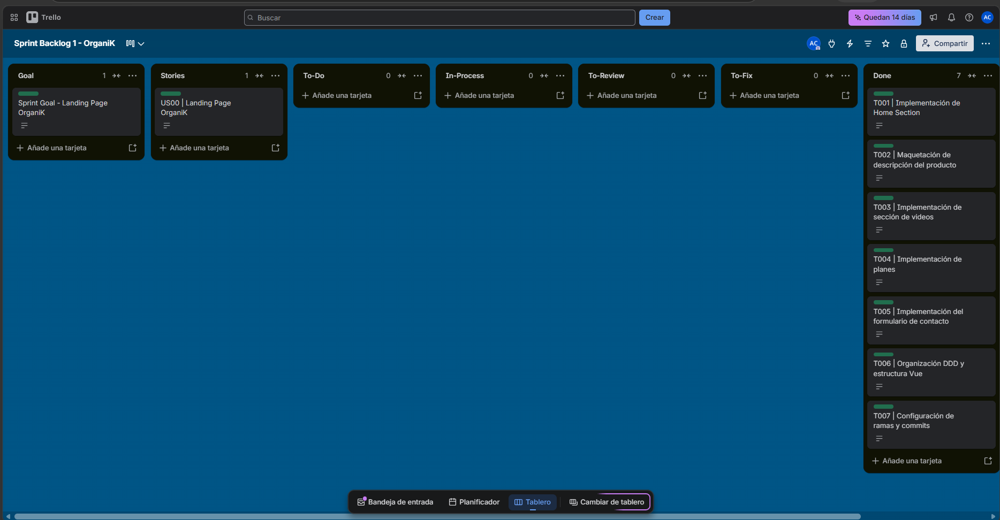
  
<em>Figura: Captura histórica del Sprint Backlog 1; evidencia de US00, no del Product Backlog completo.</em>

---

# Capítulo IV: Product Design

## 4.1. Style Guidelines.

Esta sección establece las bases visuales y de comunicación para mantener la consistencia en todos los productos digitales de **OrganiK** (Landing Page y Dashboards). El objetivo es contar con un repositorio centralizado que facilite la escalabilidad del diseño y garantice una experiencia de usuario coherente tanto para administradores de minimarkets como para proveedores.

### 4.1.1. General Style Guidelines.

**Tono de Comunicación y Lenguaje**
La comunicación de OrganiK se rige bajo cuatro dimensiones principales para establecer confianza en un entorno B2B:
*   **Formal vs. Casual:** Ligeramente formal. Se dirige al usuario con respeto profesional, pero empleando términos claros y directos para agilizar la gestión operativa sin burocracia.
*   **Divertido vs. Serio:** Serio. Al tratarse de una herramienta para el control de inventarios, prevención de pérdidas económicas y abastecimiento, el enfoque debe transmitir seguridad y fiabilidad.
*   **Respetuoso vs. Irreverente:** Respetuoso. Considera la alta carga operativa y el estrés de los usuarios (como los administradores de minimarkets), mostrándose como un asistente empático.
*   **Entusiasta vs. Sereno:** Sereno. Las interfaces e interacciones no buscan abrumar al usuario con celebraciones excesivas, sino brindar tranquilidad mediante la automatización y alertas preventivas.

**Branding y Paleta de Colores**
La paleta cromática ha sido seleccionada cuidadosamente para generar confianza y evocar la naturaleza de los productos orgánicos, manteniendo un alto contraste para la lectura de datos:
*   **Colores Primarios (Acción y Confianza):** Se utilizan tonalidades azules como *Azure Radiance* y *Dodger Blue*. El azul transmite seguridad, estabilidad y limpieza tecnológica.
*   **Colores de Acento y Alerta (Dinamismo):** Se integran tonos anaranjados como *Pumpkin* y *Orange*. Utilizados exclusivamente para llamados a la acción (CTAs) y notificaciones críticas (alertas IoT de temperatura o fechas de vencimiento próximas).
*   **Colores Neutros (Estructura y Legibilidad):** Se emplean variantes de grises (como *Slate Gray* y *Boulder*) y blancos (*Alice Blue*, *White*) para los fondos de los dashboards, reduciendo la fatiga visual.

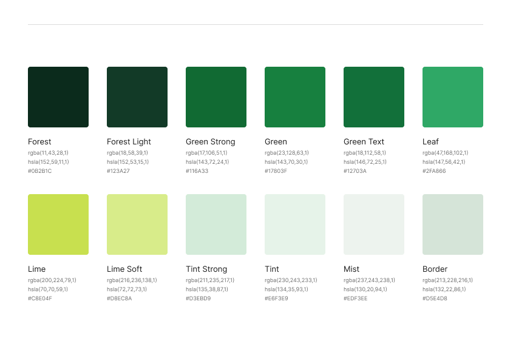
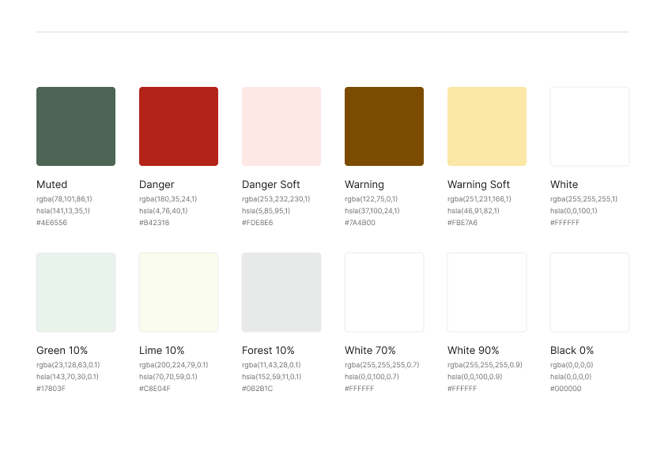

**Tipografía**
Se seleccionaron dos familias Sans-Serif priorizando la legibilidad en pantallas de múltiples resoluciones:
*   **Arimo:** Utilizada en encabezados, títulos de módulos y cifras destacadas en los dashboards. Su estructura robusta permite una rápida lectura de los KPIs.
*   **Inter:** Asignada a los cuerpos de texto y tablas de datos. Diseñada específicamente para interfaces, garantiza que los datos densos sean legibles en tamaños pequeños.

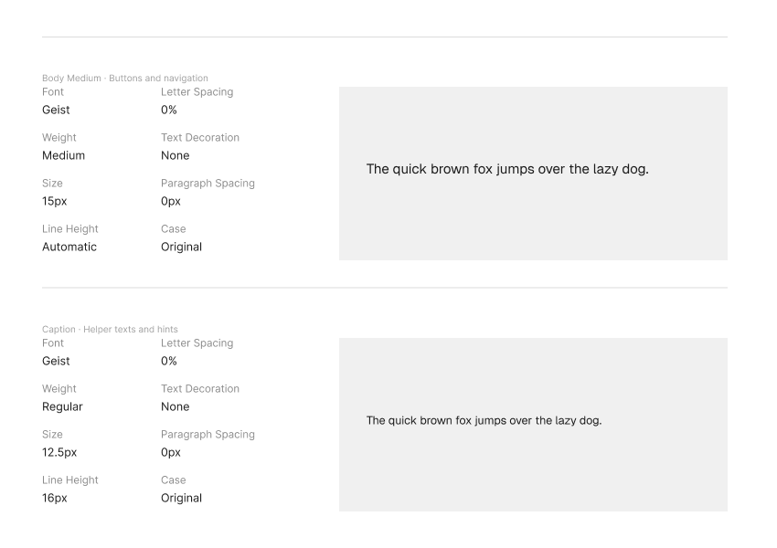
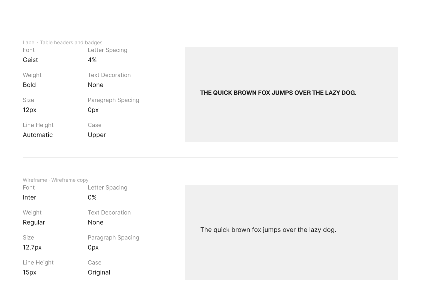

### 4.1.2. Web Style Guidelines.

Para garantizar que la experiencia sea fluida y adaptable (Responsive Web Design), se establecen los siguientes estándares visuales y de interacción:

*   **Sistema de Grillas y Espaciado:** Se utiliza un sistema de espaciado basado en múltiplos de 8px para asegurar consistencia. La estructura base emplea una grilla de 12 columnas para resoluciones de escritorio, adaptándose a 4 columnas en dispositivos móviles.
*   **Puntos de Ruptura (Breakpoints):** El diseño es fluido, con puntos de adaptación clave en 320px (Mobile), 768px (Tablet) y 1024px+ (Desktop/Laptop).
*   **Estados de Interacción:**
    *   *Hover:* Los botones principales y tarjetas aumentan sutilmente su sombra (elevation) y oscurecen su fondo un 10% para indicar interactividad.
    *   *Disabled:* Los botones de acciones incompletas (ej. "Aceptar Pedido" sin haber revisado el lote) se desaturan a *Slate Gray* al 50% de opacidad.
*   **Accesibilidad (A11y):** Los botones principales y enlaces en la versión móvil tienen un área mínima de toque de 44x44px para evitar errores al interactuar en movimiento. Se garantiza un ratio de contraste mínimo de 4.5:1 entre el texto y su fondo.

## 4.2. Information Architecture.

La Arquitectura de la Información (IA) de **OrganiK** ha sido diseñada con el objetivo de estructurar, organizar y etiquetar el contenido de la plataforma de manera que los usuarios puedan encontrar la información y completar sus tareas de forma intuitiva.

Dado que la plataforma atiende a dos segmentos con necesidades y permisos operativos distintos, la arquitectura se divide en tres áreas principales: una zona pública orientada a la conversión (Landing Page) y dos zonas privadas (Dashboards) adaptadas al flujo operativo de cada rol (Administrador de Minimarket y Proveedor B2B). Esta separación garantiza que cada usuario acceda únicamente a la información y herramientas relevantes para su gestión.

A continuación, se presenta el Mapa de Sitio (Site Map) jerárquico de la plataforma:

**1. Zona Pública (Landing Page)**
*   **1.1. Inicio:** Propuesta de valor principal.
*   **1.2. Solución:** Explicación del funcionamiento integrado (Inventario, Monitoreo y Abastecimiento).
*   **1.3. Beneficios:** Ventajas de la reducción de mermas y digitalización B2B.
*   **1.4. Equipo:** Presentación del equipo desarrollador.
*   **1.5. Planes y Precios:** Suscripciones para Minimarkets y Proveedores.
*   **1.6. Acceso:**
    *   1.6.1. Iniciar Sesión (Login).
    *   1.6.2. Registro de nueva cuenta.

**2. Zona Privada: Administrador de Minimarket**
*   **2.1. Dashboard Principal:** Resumen de métricas, accesos rápidos y alertas críticas.
*   **2.2. Inventario Local:**
    *   2.2.1. Lista de productos orgánicos.
    *   2.2.2. Control de lotes y fechas de vencimiento.
    *   2.2.3. Registro de mermas y ofertas.
*   **2.3. Monitoreo Ambiental (IoT):**
    *   2.3.1. Estado en tiempo real (Temperatura y Humedad).
    *   2.3.2. Historial de alertas de conservación.
*   **2.4. Abastecimiento:**
    *   2.4.1. Catálogo de proveedores y generación de pedidos.
    *   2.4.2. Bandeja de órdenes de envío (Aprobar recepción / Rechazar).
    *   2.4.3. Historial de operaciones de abastecimiento.
*   **2.5. Configuración:** Perfil del negocio y preferencias de alertas.

**3. Zona Privada: Proveedor B2B**
*   **3.1. Dashboard Principal:** Resumen de ventas, estado de despachos y KPIs comerciales.
*   **3.2. Mi Catálogo:**
    *   3.2.1. Gestión de productos ofrecidos.
    *   3.2.2. Actualización de disponibilidad y lotes en almacén.
*   **3.3. Gestión de Pedidos y Envíos:**
    *   3.3.1. Bandeja de pedidos entrantes (Aprobar / Rechazar).
    *   3.3.2. Generar y gestionar órdenes de envío.
    *   3.3.3. Historial de operaciones de abastecimiento.
*   **3.4. Red de Clientes:** Directorio de minimarkets asociados.
*   **3.5. Configuración:** Perfil de la empresa y detalles logísticos.

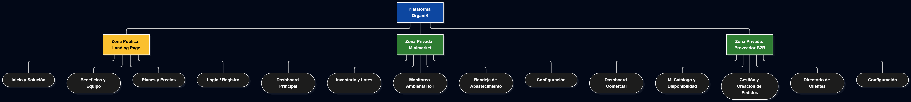

### 4.2.1. Organization Systems.

El sistema de organización de **OrganiK** define cómo se estructura y clasifica la información para que los usuarios interactúen con la plataforma sin fricciones. Se han aplicado los siguientes esquemas organizativos:
*   **Organización Visual y Estructural:**
    *   *Jerárquica:* Aplicada en la *Landing Page*, donde la información fluye de mayor a menor importancia.
    *   *Matricial:* Utilizada en los dashboards, permitiendo al usuario navegar entre diferentes dimensiones operativas (Inventario, Pedidos, IoT) sin un orden secuencial estricto.
*   **Esquemas de Categorización:**
    *   *Según Audiencia:* Separa la experiencia del *Administrador de Minimarket* (enfocada en control interno y compras) de la del *Proveedor B2B* (enfocada en ventas y despachos).
    *   *Cronológico:* Aplicado en los historiales de pedidos, registro de mermas y el log de alertas ambientales, ordenando los datos desde el evento más reciente al más antiguo.
    *   *Por Tópicos:* Utilizado para estructurar el catálogo y el inventario físico, facilitando la agrupación de lotes y productos.

### 4.2.2. Labeling Systems.

Para garantizar la comprensión inmediata en entornos operativos rápidos, el sistema de etiquetado se basa en el *Ubiquitous Language* del sector logístico:
*   **Etiquetas de Navegación:** Términos precisos de 1 a 2 palabras (Ej: *Inventario*, *Abastecimiento*, *Mi Catálogo*, *Mermas*).
*   **Etiquetas de Acción (Botones):** Utilizan verbos en infinitivo que indican el resultado de la acción alineados a los User Stories (Ej: *Generar Pedido*, *Aprobar Orden de Envío*, *Crear Orden*).
*   **Etiquetas de Estado:** Emplean un código de color universal respaldado por texto claro para el seguimiento (Ej: *Pendiente* [Amarillo], *Aprobado* [Verde], *Rechazado* [Rojo], *En Ruta* [Azul]).
*   **Apoyo Iconográfico:** Las etiquetas de navegación principal siempre están acompañadas de iconos estandarizados para acelerar el reconocimiento visual.

### 4.2.3. SEO Tags and Meta Tags

Para asegurar el posicionamiento en motores de búsqueda y la correcta previsualización al compartir enlaces, se han configurado los siguientes metadatos:
*   **Landing Page (Pública):**
    *   `Title:` `<title>OrganiK | Gestión de Inventarios, Monitoreo IoT y Abastecimiento B2B</title>`
    *   `Meta Description:` `<meta name="description" content="Plataforma SaaS especializada en productos orgánicos. Conecta minimarkets y proveedores, controla inventarios, previene mermas con sensores IoT y gestiona pedidos B2B.">`
    *   `Meta Keywords:` `<meta name="keywords" content="minimarkets, productos orgánicos, abastecimiento B2B, control de inventario, monitoreo IoT, reducir mermas">`
*   **Web Application (Privada):** Dado que requiere autenticación, los motores de búsqueda no indexarán el contenido interno (`<meta name="robots" content="noindex, nofollow">`), protegiendo la privacidad operativa de los clientes. Se usan títulos dinámicos en la pestaña (Ej. `<title>Inventario - OrganiK</title>`).

### 4.2.4. Searching Systems.

Debido al alto volumen transaccional, OrganiK implementa un sistema de búsqueda robusto para reducir el tiempo de localización de datos:
*   **Búsqueda Global:** Ubicada en la cabecera del dashboard, permite realizar consultas mediante coincidencia de cadenas (ej. buscar por producto "Manzana" o ID de pedido "ORD-0012").
*   **Filtros Contextuales:** Menús desplegables en las tablas de datos para refinar resultados (ej. filtrar inventario por estado "Próximo a Vencer", o filtrar pedidos por "Proveedor").
*   **Presentación de Resultados:** Los datos se presentan en *Data Tables* ordenables y paginadas para no sobrecargar la vista.

### 4.2.5. Navigation Systems.

El sistema de navegación está estructurado para que los usuarios interactúen con la menor cantidad de clics posibles, adaptándose al comportamiento *Mobile-First*:
*   **Navegación Global (Landing Page):** *Sticky Top Navbar* con anclas (anchor links) a secciones clave y un botón *Call-to-Action* destacado ("Iniciar Sesión").
*   **Navegación Global (Web App):** *Sidebar* lateral izquierda colapsable en escritorio, y menú *Hamburguesa* en móviles para facilitar el uso en pantallas pequeñas.
*   **Navegación Local:** Pestañas (Tabs) dentro de un mismo módulo para separar sub-vistas (ej. Dentro del módulo "Inventario", pestañas separadas para *Stock Activo*, *Lotes* y *Mermas*).
*   **Navegación Suplementaria:** Ruta de migas de pan (Breadcrumbs) en la cabecera (ej. `OrganiK > Abastecimiento > Detalle Pedido ORD-0012`) que orienta al usuario y le permite retroceder niveles sin perder contexto.

## 4.3. Landing Page UI Design.

En esta sección se presenta la propuesta de Interfaz de Usuario (UI) para la Landing Page de **OrganiK**. El diseño visual traduce las decisiones tomadas en la Arquitectura de la Información y las Guías de Estilo en una interfaz tangible orientada a la conversión. El objetivo principal de esta página pública es comunicar claramente la propuesta de valor integrada (gestión de inventarios, monitoreo IoT y abastecimiento B2B) y dirigir a los administradores de minimarkets y proveedores hacia el registro o inicio de sesión.

### 4.3.1. Landing Page Wireframe.

Los wireframes representan el esqueleto estructural de la página en baja fidelidad, desprovistos de color y tipografía final, para centrar el análisis en la usabilidad y la distribución del contenido.

**Explicación del Diseño y Arquitectura:**
*   **Estructura Visual:** Se ha optado por un diseño de bloque único (*Single-page layout*) que guía al usuario a través de un viaje lógico: Problema $\rightarrow$ Solución (Características de OrganiK) $\rightarrow$ Planes $\rightarrow$ Call to Action (CTA).
*   **Jerarquía de Información:** La sección *Hero* (cabecera principal) destaca la propuesta de valor central con botones de acción inmediata. A medida que se hace *scroll*, la información se desglosa en bloques asimétricos o de cuadrícula (grid) para explicar módulos específicos como el control de lotes y las alertas IoT.
*   **Diseño Inclusivo:** Para la versión *Mobile Web Browser*, el wireframe estructural apila los contenedores en una sola columna. Se ha proyectado que las áreas de interacción (botones de "Empezar" o "Conoce los planes") tengan un área táctil amplia (mínimo 44x44px) para evitar frustración motriz en dispositivos móviles.

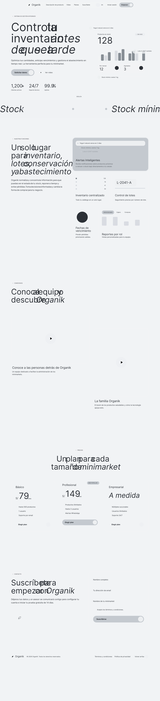

### 4.3.2. Landing Page Mock-up.

Los mock-ups representan el diseño final en alta fidelidad, integrando el *Design System* establecido para los productos digitales de OrganiK.

**Explicación de la Aplicación Visual y UI:**
*   **Aplicación de Style Guidelines:** El diseño final hace un uso extenso del espacio en blanco (White y Alice Blue) para transmitir una sensación de modernidad y limpieza, esencial en un software B2B. Los colores primarios (*Azure Radiance* y *Dodger Blue*) se reservan estratégicamente para los componentes interactivos principales (botones de Login/Registro y enlaces), atrayendo naturalmente la vista del usuario.
*   **Tipografía y Legibilidad:** Se aplica la fuente *Arimo* en su variante Bold para los encabezados principales (H1, H2), logrando un impacto rápido; mientras que los párrafos explicativos utilizan *Inter*, garantizando una legibilidad óptima incluso en las tarjetas descriptivas de los planes de suscripción.
*   **Consistencia de Interacción:** La barra de navegación superior (Navbar) se mantiene fija (*sticky*) durante el *scroll*, permitiendo que el usuario pueda acceder al botón de "Iniciar Sesión" en cualquier momento de su lectura, maximizando las oportunidades de conversión.
*   **Accesibilidad Visual:** Se ha verificado que el contraste entre los textos oscuros (Slate Gray/Boulder) y los fondos claros supere el ratio mínimo de 4.5:1 exigido por las normativas de accesibilidad web (WCAG), asegurando que cualquier usuario pueda leer la propuesta de valor sin esfuerzo visual.

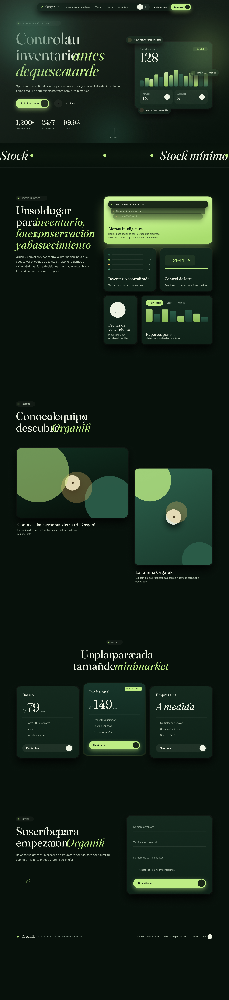

## 4.4. Web Applications UX/UI Design.

### 4.4.1. Web Applications Wireframes.

### 4.4.2. Web Applications Wireflow Diagrams.

### 4.4.2. Web Applications Mock-ups.

### 4.4.3. Web Applications User Flow Diagrams.

## 4.5. Web Applications Prototyping.

## 4.6. Domain-Driven Software Architecture.

La arquitectura de software de OrganiK se construye a partir del análisis del dominio de gestión de productos orgánicos, inventario, conservación, abastecimiento y control operativo para minimarkets y proveedores. A partir de este análisis se aplican los principios de Domain-Driven Design (DDD), permitiendo dividir la solución en bounded contexts coherentes con las responsabilidades principales del negocio.

En las siguientes secciones se presenta cada nivel del modelo arquitectónico, explicando la estructura, responsabilidades y comunicación entre los elementos que conforman la arquitectura de OrganiK.

### 4.6.1. Design-Level Event Storming.

Para identificar los eventos de dominio y la lógica de negocio de OrganiK, se realizó un proceso de Event Storming orientado a comprender los flujos principales de la plataforma: registro de productos, control de inventario, monitoreo de conservación, solicitudes de abastecimiento, gestión de proveedores, alertas y análisis operativo.

El desarrollo del proceso de Domain-Driven Design se realizó en Lucidchart: [https://lucid.app/lucidchart/122eaed5-7924-4498-b16c-62681427dde3/edit?viewport_loc=14%2C-6708%2C8686%2C7802%2C0_0&invitationId=inv_6c1afc67-fb30-4e78-9b16-eb7f89871df1](https://lucid.app/lucidchart/122eaed5-7924-4498-b16c-62681427dde3/edit?viewport_loc=14%2C-6708%2C8686%2C7802%2C0_0&invitationId=inv_6c1afc67-fb30-4e78-9b16-eb7f89871df1)

A continuación, se presentan la leyenda utilizada y las relaciones clave entre los bounded contexts identificados:

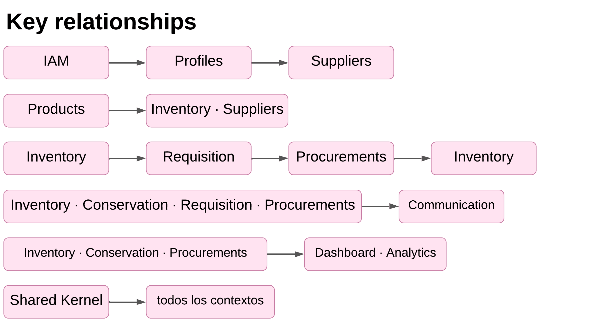

A partir de este análisis se identificaron los siguientes bounded contexts:

1. **IAM**

   El bounded context IAM se encarga de la autenticación, autorización y control de acceso dentro de OrganiK. Gestiona usuarios, roles y permisos, asegurando que cada actor, como el administrador de minimarket o el proveedor, acceda únicamente a las funcionalidades correspondientes a su perfil.

   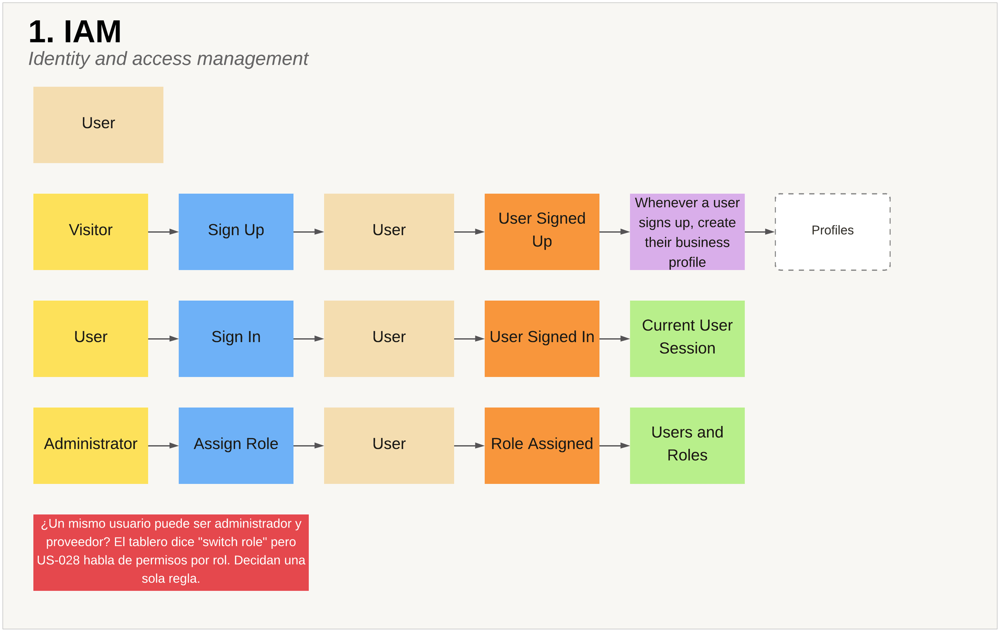

2. **Profiles**

   El bounded context Profiles administra la información de los usuarios, minimarkets y proveedores registrados en la plataforma. Su propósito es centralizar los datos de perfil necesarios para personalizar la experiencia, controlar responsabilidades y asociar operaciones con el actor correspondiente.

   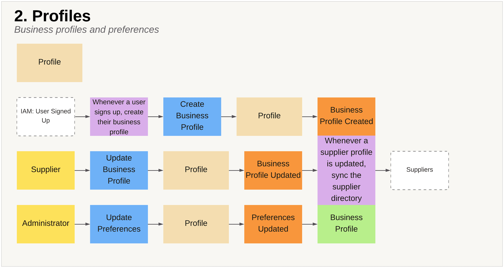

3. **Dashboard**

   El bounded context Dashboard presenta una vista general del estado operativo de la plataforma según el rol del usuario. Permite visualizar indicadores relevantes sobre inventario, abastecimiento, conservación, alertas y actividad reciente.

   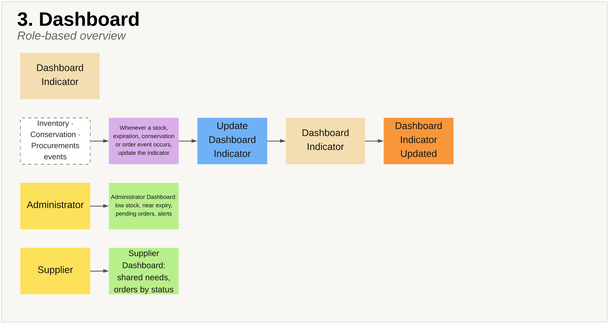

4. **Analytics**

   El bounded context Analytics procesa información operativa para generar indicadores, métricas y resúmenes que apoyan la toma de decisiones. Permite analizar el estado del inventario, productos próximos a vencer, alertas de conservación, desempeño de proveedores y movimientos de abastecimiento.

   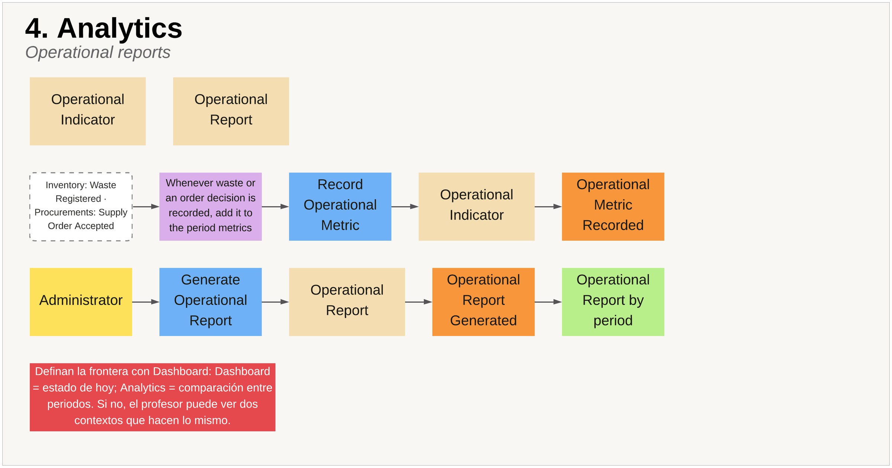

5. **Inventory**

   El bounded context Inventory gestiona los productos registrados en el minimarket, sus cantidades, lotes, fechas de vencimiento, estados y movimientos asociados. Su propósito es mantener trazabilidad sobre las existencias y facilitar el control de productos disponibles, en riesgo o con pérdidas.

   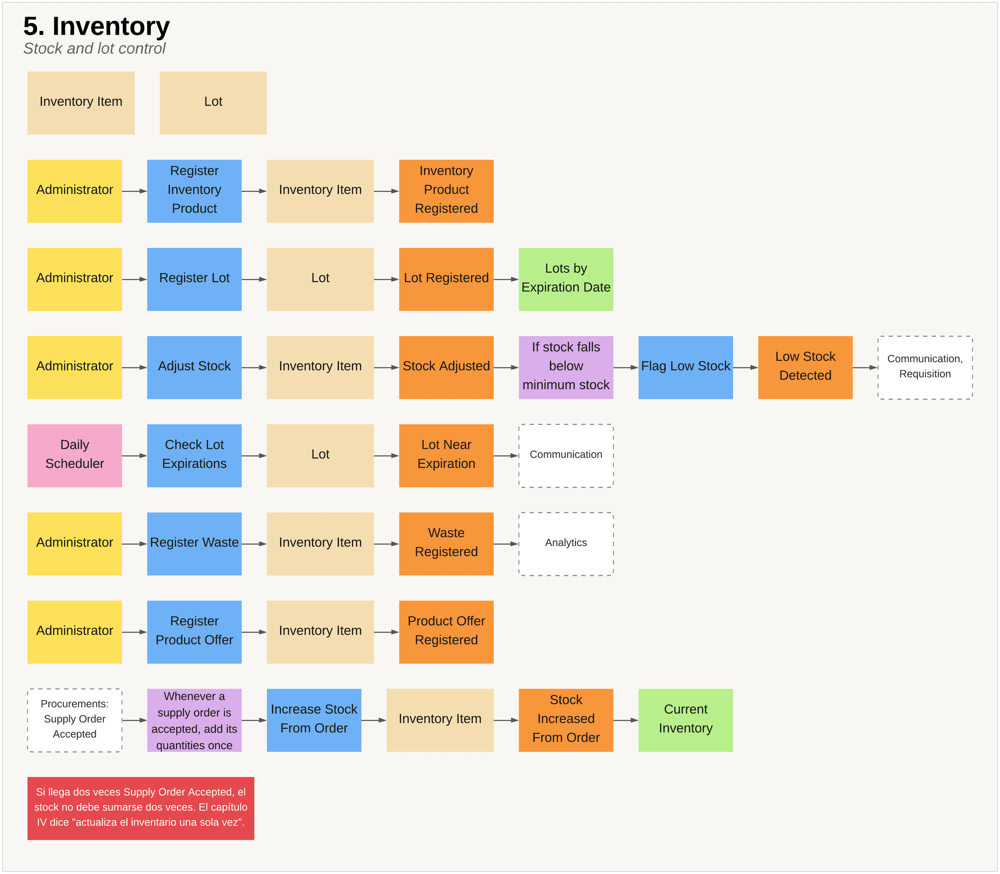

6. **Products**

   El bounded context Products administra el catálogo de productos orgánicos ofrecidos por proveedores o registrados por minimarkets. Centraliza información como nombre, categoría, descripción, unidad de medida, disponibilidad y datos relevantes para su comercialización o abastecimiento.

   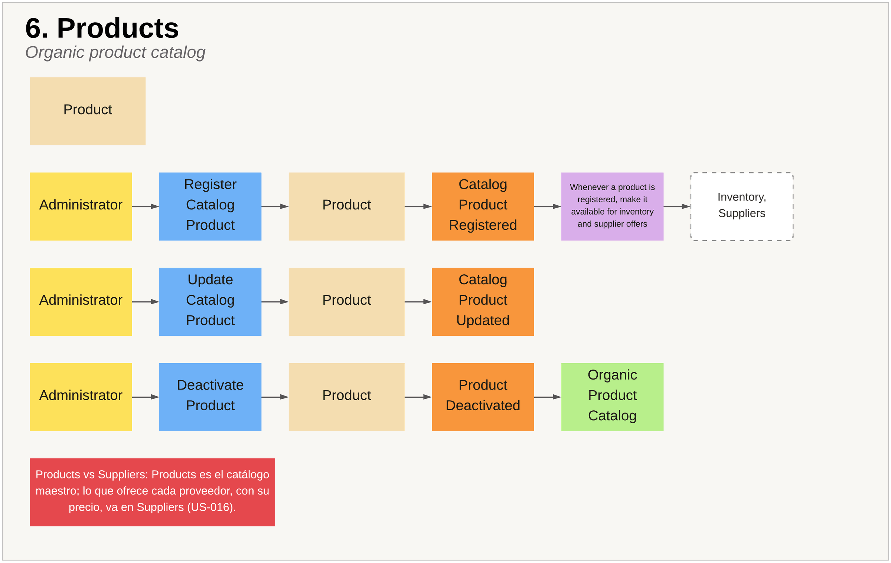

7. **Requisition**

   El bounded context Requisition gestiona las solicitudes de abastecimiento generadas por los minimarkets hacia los proveedores. Permite registrar productos solicitados, cantidades, estado de la solicitud y trazabilidad del proceso de aceptación o rechazo.

   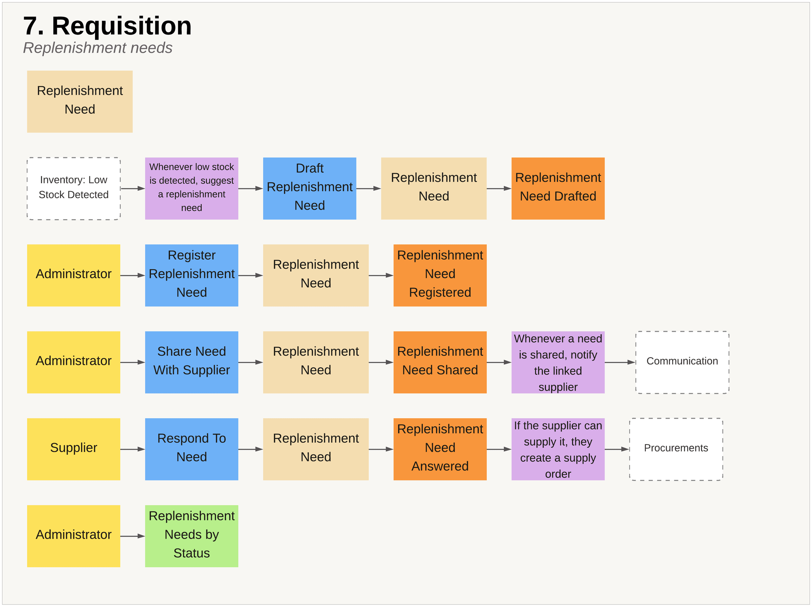

8. **Procurements**

   El bounded context Procurements administra las órdenes de envío o abastecimiento asociadas a solicitudes aceptadas. Su responsabilidad es permitir al proveedor registrar los productos que serán enviados y al minimarket confirmar o rechazar la recepción.

   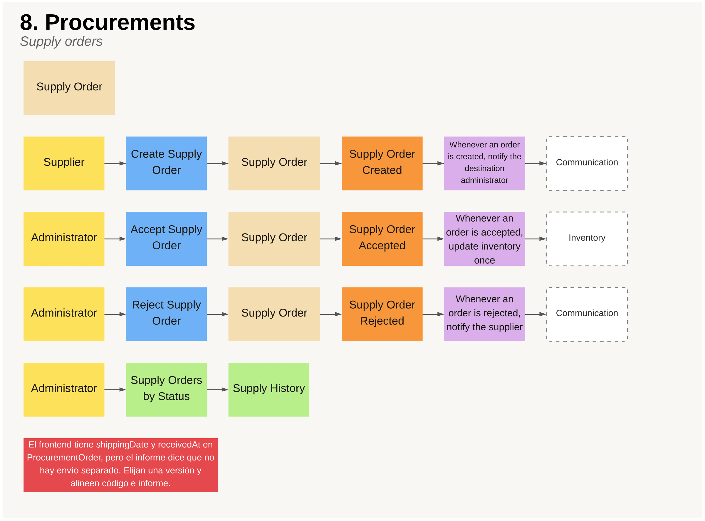

9. **Suppliers**

   El bounded context Suppliers gestiona el directorio de proveedores de productos orgánicos, así como los productos que ofrecen y su participación dentro de los procesos de abastecimiento.

   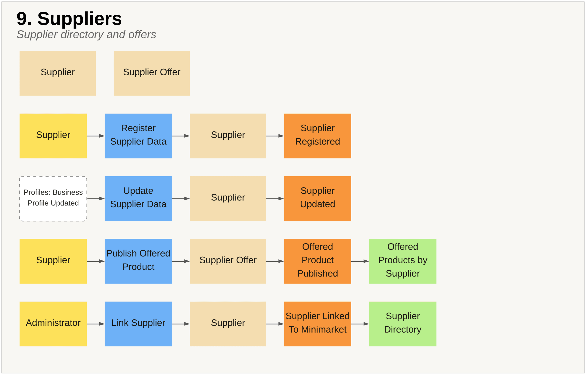

10. **Conservation**

   El bounded context Conservation permite monitorear condiciones de conservación de productos, como temperatura y humedad. Su propósito es identificar riesgos de deterioro y generar alertas cuando las condiciones se encuentren fuera de los rangos aceptables.

11. **Communication**

   El bounded context Communication gestiona las alertas y notificaciones generadas por la plataforma. Incluye avisos sobre productos próximos a vencer, condiciones de conservación riesgosas, solicitudes pendientes, órdenes de envío y eventos relevantes para los usuarios.

12. **Shared Kernel**

   El bounded context Shared Kernel contiene elementos comunes utilizados por los demás contextos, como utilidades compartidas, contratos base, configuraciones, validaciones comunes y estructuras transversales del sistema.

   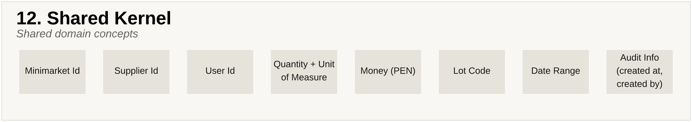

### 4.6.2. Software Architecture Context Diagram.

En este nivel se presenta una vista de alto nivel de la arquitectura, donde el foco está en el sistema OrganiK como una caja negra y en las interacciones que mantiene con sus usuarios y servicios externos.

El context diagram muestra al **OrganiK Software System** como el sistema central, rodeado por los principales actores y sistemas con los que interactúa:

- **Administrador de minimarket**: usuario encargado de registrar productos, controlar inventario, gestionar lotes, revisar fechas de vencimiento, crear solicitudes de abastecimiento y confirmar la recepción de órdenes de envío.
- **Proveedor de productos orgánicos**: usuario responsable de registrar productos ofrecidos, revisar solicitudes de abastecimiento, aceptarlas o rechazarlas, y crear órdenes de envío.
- **Administrador del sistema**: usuario encargado de gestionar cuentas, roles, permisos y configuración general de la plataforma.
- **Servicio de notificaciones**: sistema externo utilizado para enviar alertas y comunicaciones relacionadas con vencimientos, conservación, solicitudes y abastecimiento.
- **Servicio de monitoreo de conservación**: fuente externa o módulo de integración encargado de proporcionar información relacionada con temperatura y humedad para evaluar condiciones de conservación.

En el diagrama se representan las relaciones entre estos elementos, destacando que los actores humanos interactúan con OrganiK mediante la aplicación web, mientras que el sistema coordina los procesos internos y las integraciones necesarias para alertas, monitoreo y trazabilidad operativa.

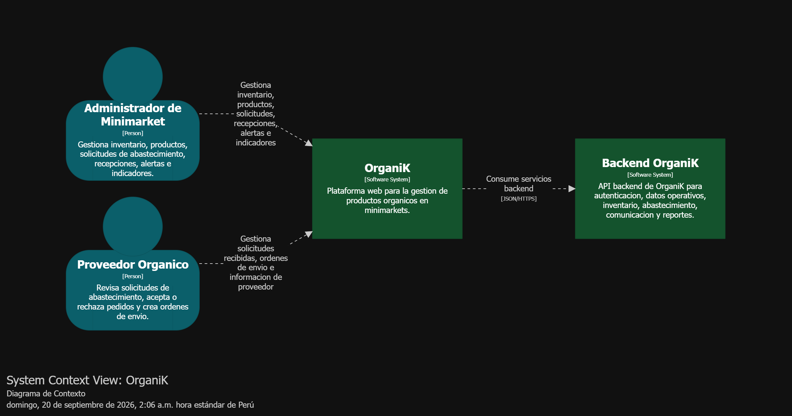

---

### 4.6.3. Software Architecture Container Diagrams.

En el nivel de contenedores, la arquitectura de OrganiK se organiza en aplicaciones y fuentes de datos que colaboran para brindar la experiencia completa de la plataforma.

La arquitectura lógica de OrganiK se estructura en los siguientes contenedores:

- **Landing Page**: aplicación web pública orientada a presentar la propuesta de valor de OrganiK, sus beneficios y funcionalidades principales para minimarkets y proveedores de productos orgánicos.
- **Single Page Application (SPA)**: aplicación web principal desarrollada en Angular, donde los usuarios interactúan con los módulos de inventario, productos, proveedores, solicitudes, órdenes de envío, conservación, analítica, dashboard, perfiles, comunicación e IAM.
- **API REST Application**: backend encargado de exponer los servicios de negocio mediante endpoints REST. Centraliza la lógica de aplicación, validaciones, reglas de dominio y coordinación entre bounded contexts.
- **Database**: base de datos donde se persiste la información del sistema, incluyendo usuarios, perfiles, productos, inventario, lotes, solicitudes, órdenes de abastecimiento, proveedores, alertas, métricas y registros de conservación.

En el diagrama se observa que:

- Los usuarios pueden conocer la solución mediante la **Landing Page** y luego acceder a la **SPA**.
- La **SPA** se comunica con la **API REST Application** mediante peticiones HTTP/HTTPS y mensajes JSON.
- La **API REST Application** procesa la lógica del dominio y persiste la información en la **Database**.
- Los módulos de comunicación y conservación pueden integrarse con servicios externos para notificaciones y monitoreo de condiciones ambientales.

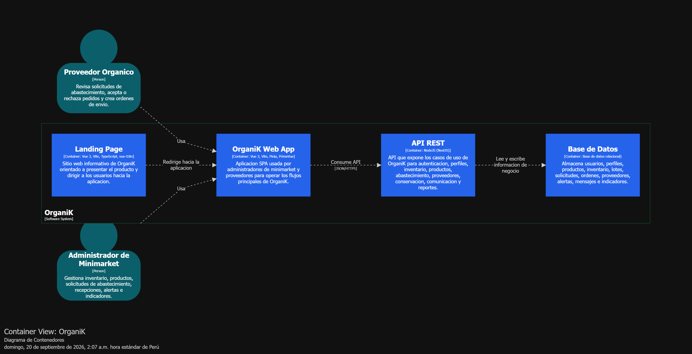

---

### 4.6.4. Software Architecture Components Diagrams.

En el nivel de componentes se detalla la descomposición interna de la arquitectura de OrganiK, especialmente del contenedor **API REST Application**, donde se agrupan los componentes principales alineados con los bounded contexts del dominio.

La API REST organiza sus responsabilidades en componentes especializados:

- **IAM Component**: gestiona autenticación, autorización, usuarios, roles y permisos.
- **Profiles Component**: administra perfiles de usuarios, minimarkets y proveedores.
- **Dashboard Component**: consolida información relevante para mostrar vistas generales según el rol del usuario.
- **Analytics Component**: procesa indicadores, métricas y reportes operativos.
- **Inventory Component**: gestiona inventario, lotes, cantidades, vencimientos, pérdidas y ofertas.
- **Products Component**: administra el catálogo de productos orgánicos registrados u ofrecidos.
- **Requisition Component**: gestiona solicitudes de abastecimiento entre minimarkets y proveedores.
- **Procurements Component**: administra órdenes de envío, aceptación, rechazo y recepción de productos.
- **Suppliers Component**: gestiona proveedores y sus productos ofrecidos.
- **Conservation Component**: monitorea condiciones de conservación y detecta riesgos.
- **Communication Component**: administra alertas y notificaciones del sistema.
- **Shared Kernel Component**: agrupa elementos transversales reutilizados por los demás componentes.

#### API REST Component Diagram

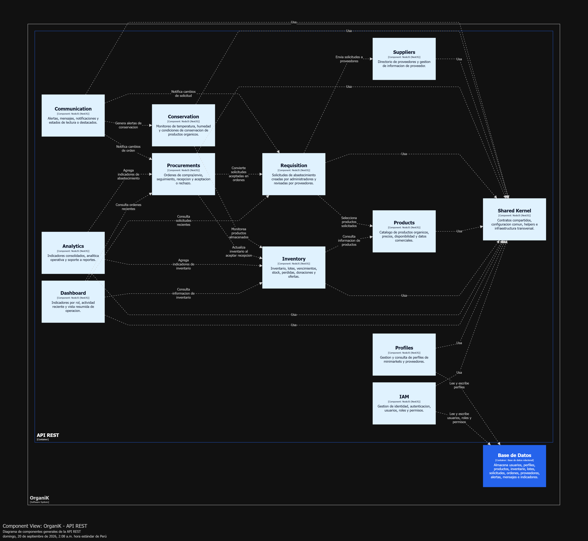

#### IAM Component Diagram

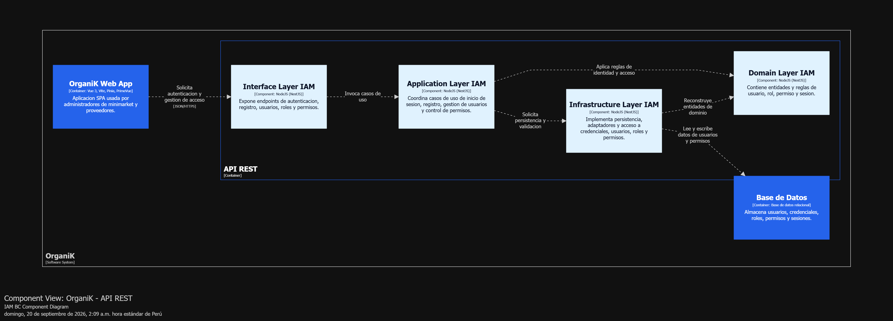

#### Profiles Component Diagram

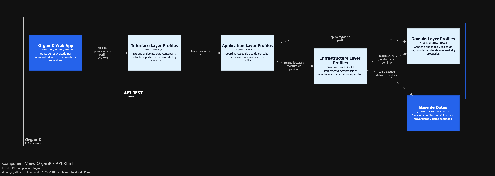

#### Dashboard Component Diagram

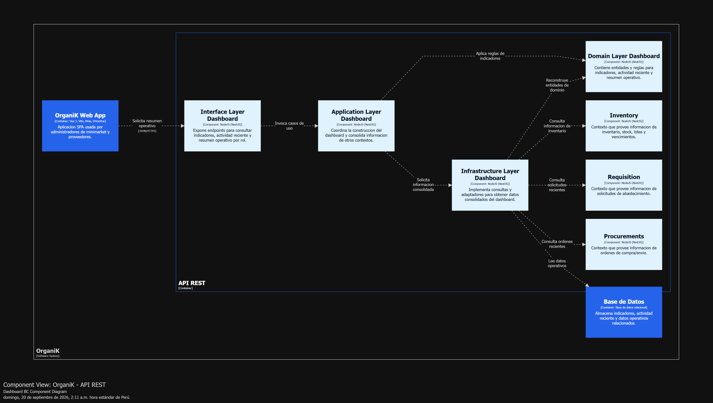

#### Analytics Component Diagram

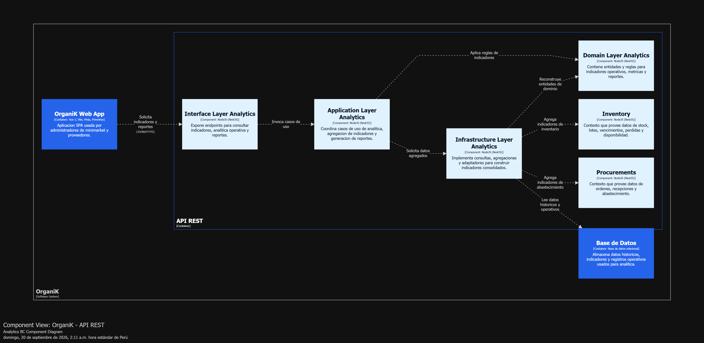

#### Inventory Component Diagram

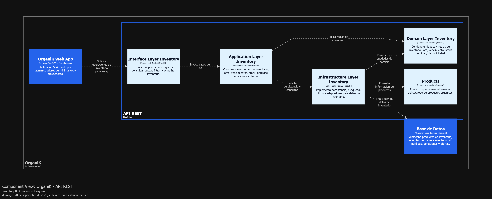

#### Products Component Diagram

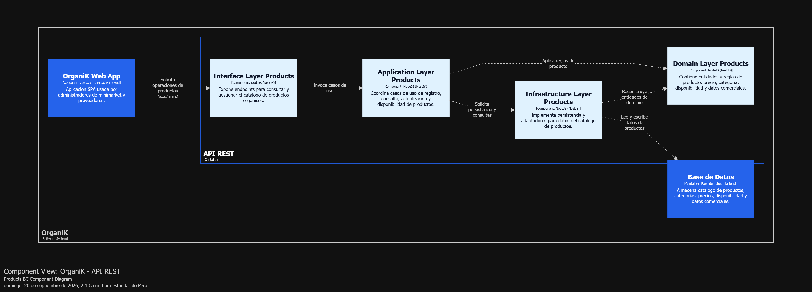

#### Requisition Component Diagram

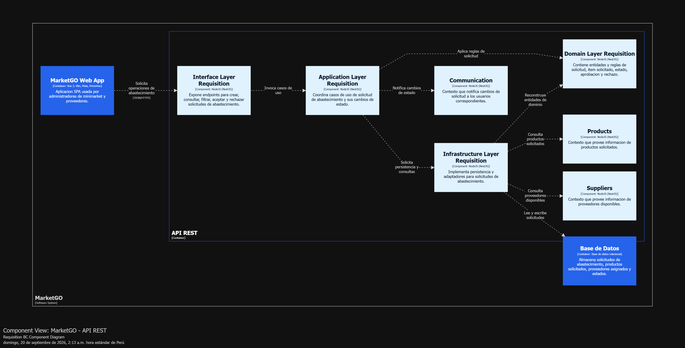

#### Procurements Component Diagram

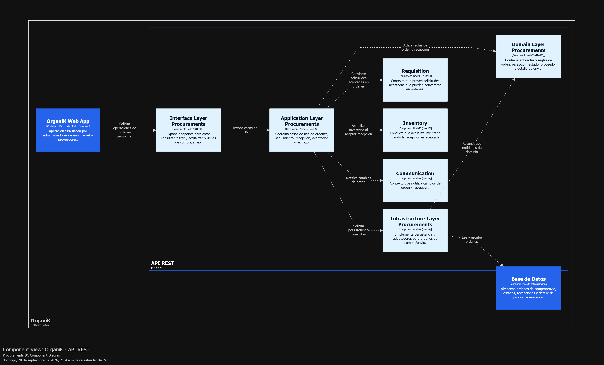

#### Suppliers Component Diagram

#### Conservation Component Diagram

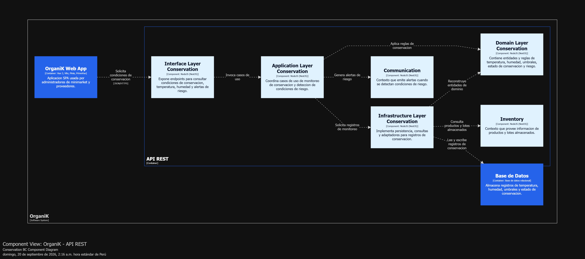

#### Communication Component Diagram

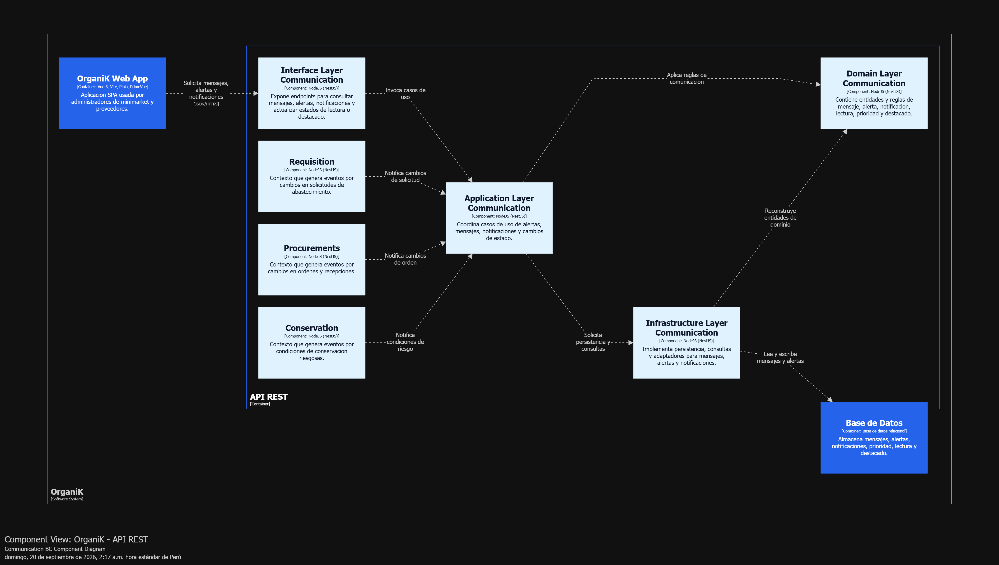

#### Shared Kernel Component Diagram

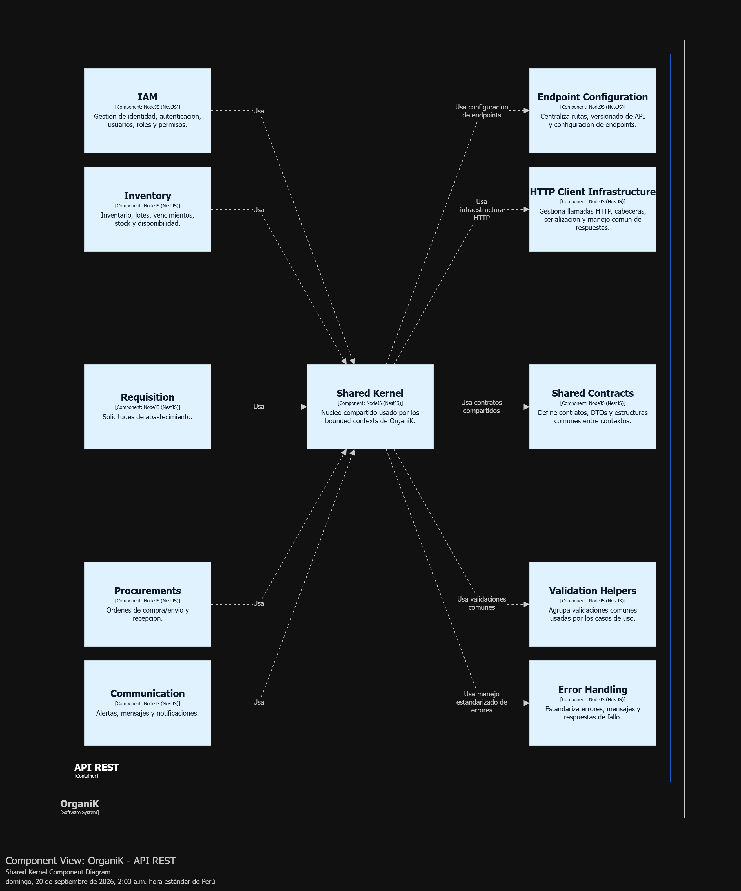

De esta forma, los component diagrams complementan la visión general de la arquitectura, mostrando cómo OrganiK organiza sus responsabilidades internas en componentes coherentes con el dominio y cómo estos colaboran para implementar la gestión de productos orgánicos, inventario, conservación, abastecimiento, proveedores, comunicación y analítica.

## 4.7. Software Object-Oriented Design.

En esta sección se presenta el diseño orientado a objetos de OrganiK, representando la estructura de clases principales del sistema y su organización por bounded contexts. Estos diagramas permiten visualizar las responsabilidades de cada clase, sus atributos, métodos y relaciones dentro de la arquitectura de la aplicación.

### 4.7.1. Class Diagrams.

Los diagramas de clases muestran la organización interna de los componentes principales de OrganiK, siguiendo una estructura alineada con los bounded contexts definidos previamente. Cada diagrama representa las clases más relevantes dentro de un módulo específico, permitiendo comprender cómo se modelan los conceptos del dominio y cómo se relacionan con la lógica de aplicación.

A continuación, se presenta el diagrama general de clases del sistema:

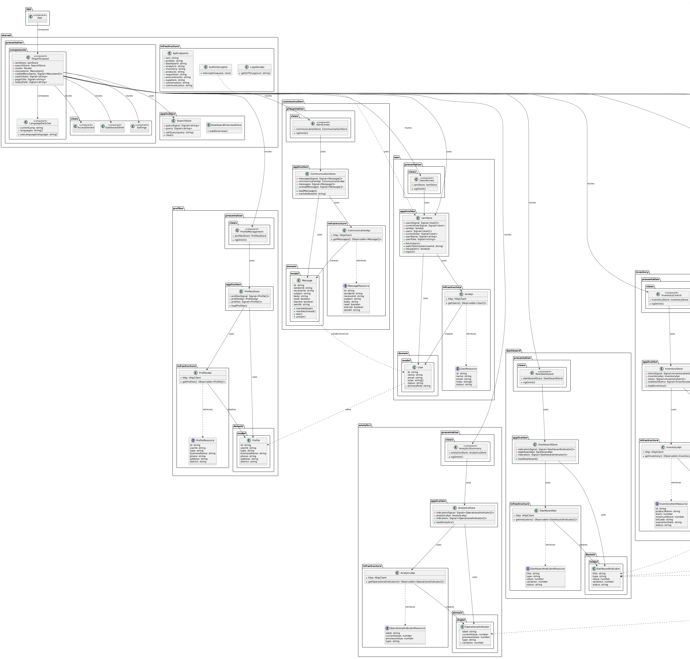

Además, se presentan los diagramas de clases correspondientes a los principales bounded contexts de OrganiK:

#### Profiles Class Diagram

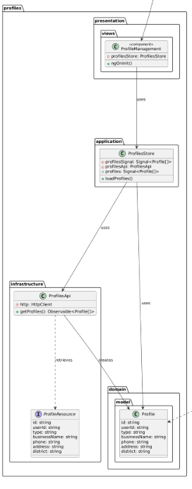

#### Communication Class Diagram

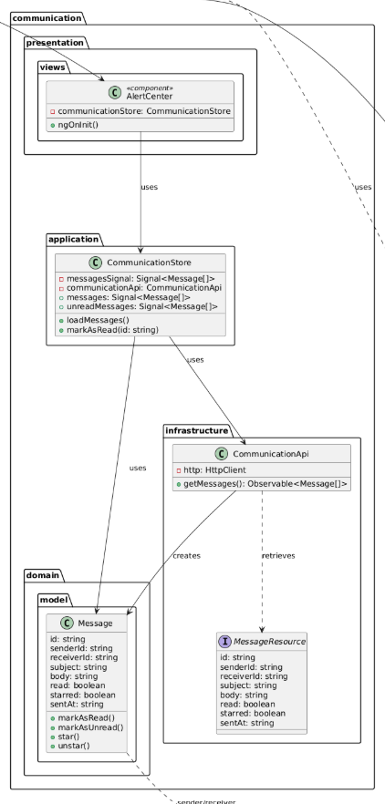

#### Conservation Class Diagram

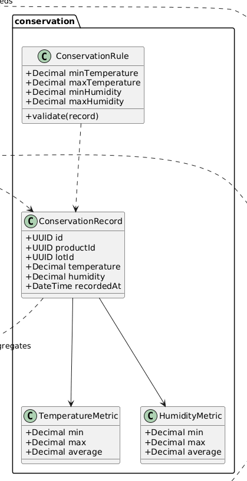

#### Analytics Class Diagram

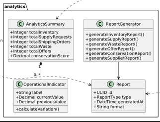

#### Dashboard Class Diagram

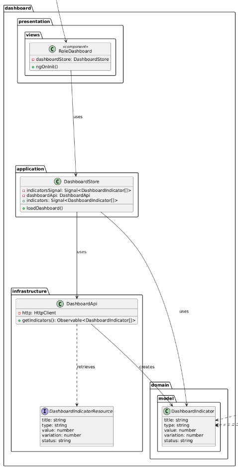

#### IAM Class Diagram

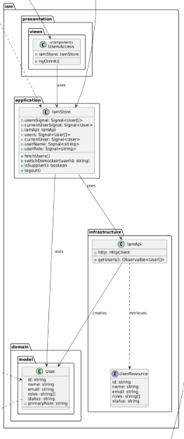

#### Shared Class Diagram

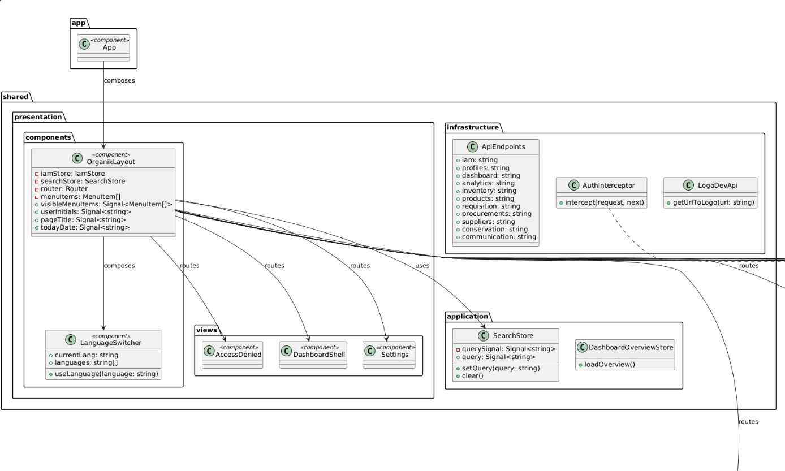

Estos diagramas permiten complementar la arquitectura de software, mostrando una vista más detallada del diseño orientado a objetos de OrganiK. A través de ellos se puede identificar cómo se distribuyen las responsabilidades entre entidades, servicios, componentes de presentación, stores de aplicación e infraestructura.

---

## 4.8. Database Design.

El diseño de base de datos de OrganiK define la estructura de persistencia necesaria para almacenar y gestionar la información principal de la plataforma. Este diseño considera los datos relacionados con usuarios, perfiles, productos, inventario, proveedores, solicitudes de abastecimiento, órdenes de envío, conservación, comunicación, analítica y auditoría.

La base de datos se encuentra organizada de acuerdo con los bounded contexts definidos en la arquitectura del sistema, permitiendo mantener una separación lógica entre las distintas áreas funcionales. Esta organización facilita la trazabilidad de la información, la consistencia de los datos y la evolución del sistema conforme se incorporen nuevas funcionalidades.

### 4.8.1. Database Diagrams.

El diagrama de base de datos muestra las entidades principales de OrganiK, sus atributos, claves primarias, claves foráneas y relaciones. Esta vista permite comprender cómo se almacena la información del sistema y cómo se conectan los distintos procesos de negocio a nivel de persistencia.

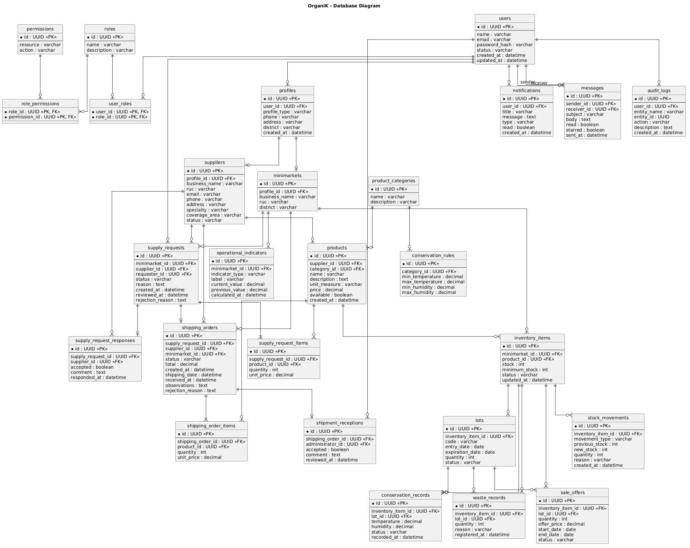

---

# Capítulo V: Product Implementation, Validation & Deployment

## 5.1. Software Configuration Management.

En esta sección se describen las decisiones, convenciones y principios adoptados por el equipo de **OrganiK** para garantizar la coherencia, trazabilidad y control de versiones durante el ciclo de vida del desarrollo de la solución **OrganiK**. Se establecen los lineamientos para la configuración del entorno de desarrollo, la gestión del código fuente, las convenciones de estilo y la configuración de despliegue de la landing page.

### 5.1.1. Software Development Environment Configuration.

Se especifican los productos de software utilizados durante el ciclo de vida del proyecto, organizados por disciplinas técnicas para asegurar la estandarización del entorno entre los desarrolladores de **OrganiK**.

#### Project Management

* **Trello:** Empleado para la organización visual del flujo de trabajo diario, priorización de tareas y seguimiento del avance de las secciones de la landing page.
  * **Ruta:** `https://trello.com/invite/b/6aaf94c8244f819349bf0de9/ATTI96869889ee148c22847a13480770254571767922/sprint-backlog-1-organik`

#### Product UX/UI Design

1. **Miro:** Pizarra colaborativa utilizada para organizar ideas, flujos de usuario y estructura general de la landing page.
2. **Figma:** Herramienta principal para el diseño visual, definición de secciones, jerarquía de contenido, componentes UI y propuesta responsive.
3. **Structurizr:** Utilizado para apoyar el modelado de arquitectura mediante diagramas de alto nivel cuando sea necesario.

#### Software Development

1. **GitHub:** Hosting del repositorio de código fuente. Se aplica control de versiones mediante Git y commits bajo la convención **Conventional Commits**.
2. **WebStorm:** IDE utilizado para el desarrollo frontend de la landing page.
3. **Angular 22:** Framework utilizado para construir la landing page de **OrganiK** mediante componentes standalone.
4. **TypeScript:** Lenguaje principal para la implementación de componentes, configuración de la aplicación y lógica de presentación.
5. **Angular Material:** Librería utilizada para componentes de interfaz, como el selector de idioma.
6. **@ngx-translate:** Librería utilizada para la internacionalización de la landing page en español e inglés.
7. **HTML/CSS:** Tecnologías utilizadas para la maquetación, estructura visual y estilos responsivos.

#### Software Testing

* **Vitest / Angular Test Runner:** Utilizado para validar la creación de la aplicación, renderizado de secciones principales y pruebas unitarias básicas.
* **Criterios de aceptación:** Definidos según la correcta visualización de las secciones Home, Product Information, Videos, Pricing y Starter.

#### Software Documentation

* **Markdown:** Utilizado para documentar el proyecto, la configuración, evidencias de sprint y decisiones técnicas.
* **README.md:** Documento principal del repositorio para describir instalación, ejecución y estructura del proyecto.

---

### 5.1.2. Source Code Management.

Se establecen los repositorios oficiales de la solución **OrganiK** para garantizar la integridad del código fuente.

#### Repositorios del Proyecto

<table>
  <thead>
    <tr>
      <th>Producto</th>
      <th>URL del Repositorio</th>
    </tr>
  </thead>
  <tbody>
    <tr>
      <td>Project Report OrganiK</td>
      <td><a href="https://github.com/5Bits-OrganiK/project-report.git">https://github.com/5Bits-OrganiK/project-report.git</a></td>
    </tr>
    <tr>
      <td>Landing Page OrganiK</td>
      <td><a href="https://github.com/5Bits-OrganiK/organik-landingpage.git">https://github.com/5Bits-OrganiK/organik-landingpage.git</a></td>
    </tr>
    <tr>
      <td>Frontend Web Application OrganiK</td>
      <td><a href="https://github.com/5Bits-OrganiK/organik-frontend.git">https://github.com/5Bits-OrganiK/organik-frontend.git</a></td>
    </tr>
    <tr>
      <td>Backend Web Services OrganiK</td>
      <td><a href="https://github.com/5Bits-OrganiK/organik-backend.git">https://github.com/5Bits-OrganiK/organik-backend.git</a></td>
    </tr>
  </tbody>
</table>

#### GitFlow Workflow and Collaboration Strategy

Para asegurar una colaboración organizada, evitar conflictos en el código y mantener una integración continua clara, el equipo de **OrganiK** aplica una estrategia basada en ramas para el desarrollo de la landing page.

La estrategia de colaboración se define de la siguiente manera:

- **main:** Rama que contiene la versión estable y lista para producción de la landing page. Solo recibe integraciones finales cuando los cambios han sido revisados, probados y aprobados.

- **develop:** Rama principal de integración. En esta rama se unifican las funcionalidades terminadas antes de ser promovidas a `main`.

- **feature/<section>:** Ramas temporales creadas a partir de `develop` para aislar el desarrollo de cada sección o mejora de la landing page.

  Ejemplos:
  - `feature/home-section`
  - `feature/product-information-section`
  - `feature/video-section`
  - `feature/pricing-section`
  - `feature/starter-section`

- **hotfix/<issue>:** Ramas creadas desde `main` para corregir errores críticos detectados en la versión estable de la landing page.

El flujo de trabajo establece que cada rama `feature` debe integrarse mediante **Pull Request (PR)**, permitiendo revisión de código antes de aprobar la integración.

Cada commit debe seguir la convención de **Conventional Commits**, permitiendo una trazabilidad clara de los cambios realizados en el proyecto.

Ejemplos:

- `feat(landing): build organik landing page`
- `fix(app): enable zoneless change detection`
- `fix(videos): update team embed url`
- `fix(videos): show youtube previews`
- `fix(brand): align assets with organik name`
- `refactor(app): move landing features to app root`

---

### 5.1.3. Source Code Style Guide & Conventions.

En esta sección se establecen las convenciones de estilo y nomenclatura adoptadas para los lenguajes utilizados en el proyecto **OrganiK**: HTML, CSS, TypeScript y Angular. Se aplica nomenclatura en inglés para los elementos del código, manteniendo coherencia con el dominio de la landing page y la plataforma.

#### Referencias de Guías de Estilo Adoptadas

| Lenguaje/Tecnología | Guía de Estilo |
| :--- | :--- |
| HTML/CSS | [Google HTML/CSS Style Guide](https://google.github.io/styleguide/htmlcssguide.html) |
| TypeScript | [Google TypeScript Style Guide](https://google.github.io/styleguide/tsguide.html) |
| Angular | [Angular Style Guide](https://angular.dev/style-guide) |
| Conventional Commits | [Conventional Commits](https://www.conventionalcommits.org/) |

Se utiliza nomenclatura en inglés relacionada con las entidades del dominio de la landing page y la plataforma **OrganiK**, manteniendo nombres claros, consistentes y alineados al producto.

| Elemento | Convención | Ejemplo |
| :--- | :--- | :--- |
| Componentes Angular | PascalCase | `HomeSection`, `PricingSection` |
| Archivos de componentes | kebab-case | `home-section.ts`, `pricing-section.ts` |
| Archivos de estilos CSS | kebab-case | `home-section.css`, `pricing-section.css` |
| Variables / Métodos TS | camelCase | `currentLang`, `useLanguage()` |
| Constantes | SCREAMING_SNAKE_CASE | `DEFAULT_LOCALE`, `STARTER_EMAIL` |
| Rutas / IDs de secciones | kebab-case | `product-information`, `starter` |
| Claves de i18n | camelCase / dot.case | `home.title`, `pricing.plans.basic.name` |
| Ramas Git feature | kebab-case | `feature/home-section`, `feature/starter-section` |
| Commits | Conventional Commits | `feat(landing): build organik landing page` |

#### Sangría y Formato

* Se aplica una indentación de dos espacios para archivos web: HTML, CSS y TypeScript.
* Las llaves de apertura en TS/JS se colocan en la misma línea, siguiendo el estilo K&R.
* Los nombres de carpetas y archivos se mantienen en `kebab-case`.
* La estructura de features se organiza directamente dentro de `src/app`.

---

### 5.1.4. Software Deployment Configuration.

Se especifica la configuración de despliegue para la landing page de **OrganiK**, garantizando disponibilidad para usuarios interesados en conocer la propuesta de valor del producto.

#### Landing Page

La landing page puede desplegarse como sitio estático mediante servicios como Azure Static Web Apps, Vercel, Netlify o GitHub Pages.

* **Entorno local:** `http://127.0.0.1:4200/`
* **URL de producción:** `https://witty-pebble-068250b10.2.azurestaticapps.net`

---

## 5.2. Landing Page, Services & Applications Implementation.

### 5.2.1. Sprint 1

---

#### 5.2.1.1. Sprint Planning 1.

| **Sprint Planning Sprint 1** |  |
|---|---|
| **Sprint Planning Background** |  |
| Date | 05/04/2026 |
| Time | 10:00 p.m. |
| Location | Discord / WhatsApp |
| Prepared By | Albino Florencio Cáceres Pizarro |
| Attendees | Albino Florencio Cáceres Pizarro Matias Daniel Huaranga Romero Winnie Lisbeth Merino Ordinola Andre Sebastian Quispe Almonacid Alexis Calin Torres Huaman |
| **Sprint Goal & User Stories** |  |
| **Sprint 1 Goal** | Entregar la landing page de **OrganiK** para comunicar a administradores de minimarkets y proveedores la propuesta de inventario, lotes, conservación y abastecimiento. El objetivo de US00 es que un visitante sin sesión pueda recorrer Home, Product Description, Videos, Plans y Starter y encontrar un medio de contacto. La visualización de un formulario no demuestra por sí sola que exista suscripción operativa ni que los módulos anunciados estén implementados. |
| User Story comprometida | US00: Conocer OrganiK en la landing page (5 Story Points, según Product Backlog del capítulo III). |
| Capacidad de planificación consignada | 14 Story Points. Esta cifra no es velocidad observada ni equivale a los puntos de US00; el informe no documenta su cálculo. |

  <strong>Repositorio:</strong>
  <a href="https://github.com/5Bits-OrganiK/organik-landingpage.git">
   https://github.com/5Bits-OrganiK/organik-landingpage.git
  </a>

---

#### 5.2.1.2. Aspect Leaders and Collaborators.

Esta matriz <strong>LACX</strong> identifica los aspectos principales del sprint y asigna responsabilidades de Líder (L) y Colaborador (C) para organizar al equipo durante el desarrollo de la landing page de <strong>OrganiK</strong>. 
<strong>Albino Florencio Cáceres Pizarro</strong>, como líder del equipo, supervisa y coordina los principales aspectos del desarrollo, mientras que los demás integrantes participan como colaboradores en las diferentes actividades del sprint.

<table border="1" cellpadding="4" cellspacing="0" align="center">
  <thead>
    <tr>
      <th>Team Member</th>
      <th>Student Code</th>
      <th>Aspect: UI/UX & Visual Design</th>
      <th>Aspect: Angular Structure & Components</th>
      <th>Aspect: Content & i18n</th>
      <th>Aspect: GitFlow & Deployment</th>
    </tr>
  </thead>
  <tbody>
    <tr>
      <td>Atencio Cristobal, Cielo Valentina</td>
      <td>U202424216</td>
      <td>C</td>
      <td>C</td>
      <td>C</td>
      <td>C</td>
    </tr>
    <tr>
      <td>Cáceres Pizarro, Albino Florencio</td>
      <td>U201923820</td>
      <td>L</td>
      <td>L</td>
      <td>L</td>
      <td>L</td>
    </tr>
    <tr>
      <td>Olivares Lao, Gustavo Alonso</td>
      <td>U202216448</td>
      <td>C</td>
      <td>C</td>
      <td>C</td>
      <td>C</td>
    </tr>
    <tr>
      <td>Quispe Almonacid, Andre Sebastian</td>
      <td>U201815005</td>
      <td>C</td>
      <td>C</td>
      <td>C</td>
      <td>C</td>
    </tr>
    <tr>
      <td>Torres Huaman, Alexis Calin</td>
      <td>U20241G152</td>
      <td>C</td>
      <td>C</td>
      <td>C</td>
      <td>C</td>
    </tr>
  </tbody>
</table>

---

#### 5.2.1.3. Sprint Backlog 1.

El Sprint Backlog agrupa las tareas iniciales correspondientes al diseño, desarrollo y documentación de la landing page de **OrganiK**, producto orientado a la gestión de inventario, lotes, conservación y abastecimiento de productos orgánicos para minimarkets.

Todas las tareas T001-T007 descomponen **una sola historia, US00**, y sus nombres de componente no son nuevas User Stories. La descripción y los criterios de aceptación de US00 están en 3.1; el Product Backlog y su prioridad están en 3.3. En este sprint no se comprometieron las historias de los módulos de inventario, pedidos o sensores.

  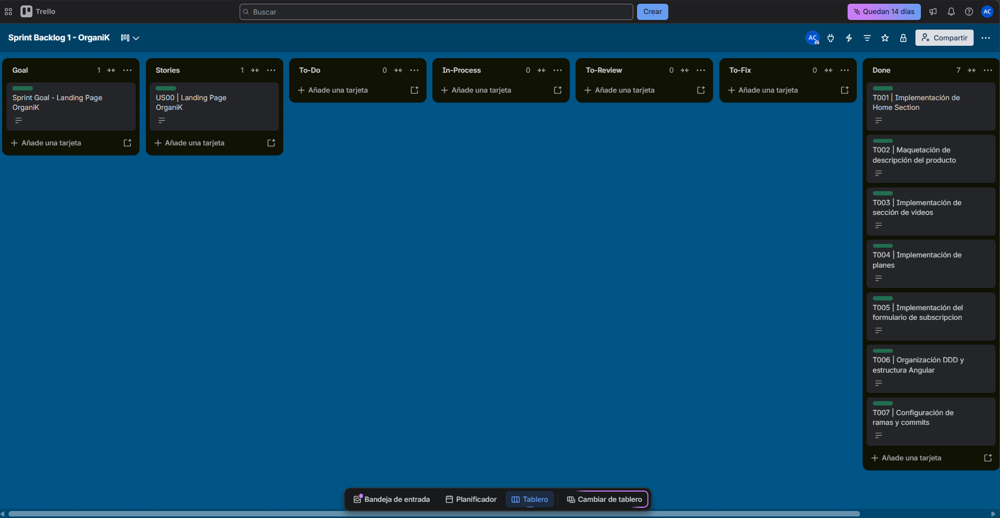
  
<em>Figura: Tablero del Sprint 1 en Trello, herramienta de gestión del proyecto OrganiK.</em>

| User Story Id | Componente de US00 | Task Id | Engineering Task | Description | Estimation (Hours) | Assigned To | Status |
| :--- | :--- | :--- | :--- | :--- | :--- | :--- | :--- |
| **US00** | Landing Page Base | T001 | Implementación de Home Section | Desarrollo de la sección principal de la landing page en Angular, presentando la propuesta de valor de OrganiK para minimarkets orgánicos. | 4h | Cáceres Pizarro, Albino Florencio | Done |
| **US00** | Product Information | T002 | Maquetación de descripción del producto | Implementación de la sección informativa sobre inventario, lotes, alertas de conservación, pedidos y accesos por rol. | 4h | Huaranga Romero, Matias Daniel | Done |
| **US00** | Videos Section | T003 | Implementación de sección de videos | Desarrollo del apartado visual para presentar al equipo y mostrar el funcionamiento general de OrganiK mediante videos embebidos. | 3h | Merino Ordinola, Winnie Lisbeth | Done |
| **US00** | Pricing Section | T004 | Implementación de planes | Maquetación de los planes Básico, Profesional y Empresarial, incluyendo precios, beneficios y llamadas a la acción. | 3h | Quispe Almonacid, Andre Sebastian | Done |
| **US00** | Starter Section | T005 | Implementación de sección de suscripción | Desarrollo de la sección Starter/Suscribirse con formulario para que los minimarkets interesados puedan iniciar el proceso de adopción de OrganiK. | 4h | Torres Huaman, Alexis Calin | Done |
| **US00** | Landing Page Architecture | T006 | Organización por features y estructura Angular | Refactorización de carpetas siguiendo una arquitectura organizada por features dentro de `src/app`, separando componentes, estilos, assets e internacionalización. | 5h | Cáceres Pizarro, Albino Florencio | Done |
| **US00** | GitFlow Setup | T007 | Configuración de commits y control de versiones | Organización incremental del trabajo mediante Git y commits aplicando Conventional Commits. | 3h | Cáceres Pizarro, Albino Florencio | Done |

Las estimaciones originales suman **26 horas**. T003, T004 y T007 figuran con **3 horas** cada una, por debajo del intervalo de 4 a 8 horas solicitado por la rúbrica; se conservan como registro histórico y no se incrementan retrospectivamente sin evidencia. Para próximos sprints, el equipo debe descomponer y estimar las Engineering Tasks antes de ejecutarlas dentro del intervalo exigido, revisando además la capacidad real frente a los Story Points comprometidos.

| Criterio de aceptación de US00 (capítulo III) | Tareas relacionadas | Evidencia consignada en 5.2.1.5 | Límite de la evidencia |
|---|---|---|---|
| Presentar la propuesta para administradores y proveedores | T001, T002 | Capturas Home y Product Information | Comunica funciones previstas; no prueba módulos operativos. |
| Permitir navegar secciones públicas sin sesión | T001, T003, T004, T005 | Capturas de Home, Videos, Plans y Starter | Las capturas muestran las secciones, pero no sustituyen una prueba de navegación con usuarios. |
| Ofrecer un medio de contacto | T005 | Captura de Starter | La captura acredita el formulario visible, no el procesamiento de suscripciones. |
| Mantener una entrega técnica reproducible | T006, T007 | Repositorio y registros de desarrollo en 5.2.1.4 | La captura del tablero por sí sola no verifica compilación ni despliegue. |

---

#### 5.2.1.4. Development Evidence for Sprint Review.

  Resumen de los commits más relevantes en el repositorio de la Landing Page de <strong>OrganiK</strong>.

<table border="1" cellpadding="4" cellspacing="0">
  <thead>
    <tr>
      <th>Branch</th>
      <th>Commit Id</th>
      <th>Commit Message</th>
      <th>Committed on</th>
    </tr>
  </thead>
  <tbody>
    <tr>
      <td>main</td>
      <td><code>cca3595</code></td>
      <td>feat(landing): build organik landing page</td>
      <td>20-09-2026</td>
    </tr>
    <tr>
      <td>main</td>
      <td><code>5b45e94</code></td>
      <td>fix(app): enable zoneless change detection</td>
      <td>20-09-2026</td>
    </tr>
    <tr>
      <td>main</td>
      <td><code>a26a62c</code></td>
      <td>fix(videos): update team embed url</td>
      <td>20-09-2026</td>
    </tr>
    <tr>
      <td>main</td>
      <td><code>e957784</code></td>
      <td>fix(brand): align assets with organik name</td>
      <td>20-09-2026</td>
    </tr>
    <tr>
      <td>main</td>
      <td><code>7f86703</code></td>
      <td>fix(videos): show youtube previews</td>
      <td>20-09-2026</td>
    </tr>
    <tr>
      <td>main</td>
      <td><code>0703eef</code></td>
      <td>refactor(app): move landing features to app root</td>
      <td>20-09-2026</td>
    </tr>
  </tbody>
</table>

---

#### 5.2.1.5. Execution Evidence for Sprint Review.

Durante el Sprint 1, el equipo logró implementar con éxito el diseño, maquetación y ejecución local de la Landing Page estática de **OrganiK**. A continuación, se presentan las evidencias visuales de la ejecución del producto de software, demostrando el cumplimiento de los Criterios de Aceptación de las Historias de Usuario planificadas.

**Evidencia 1: Home Section y Propuesta de Valor**

Se desarrolló la pantalla de inicio principal destacando la propuesta de valor de **OrganiK**: controlar el inventario antes de que sea tarde mediante alertas de vencimiento, condiciones de conservación y pedidos de abastecimiento para minimarkets orgánicos. La navegación superior permite acceder a las secciones principales de la landing page y el diseño respeta los lineamientos responsive para dispositivos móviles.

  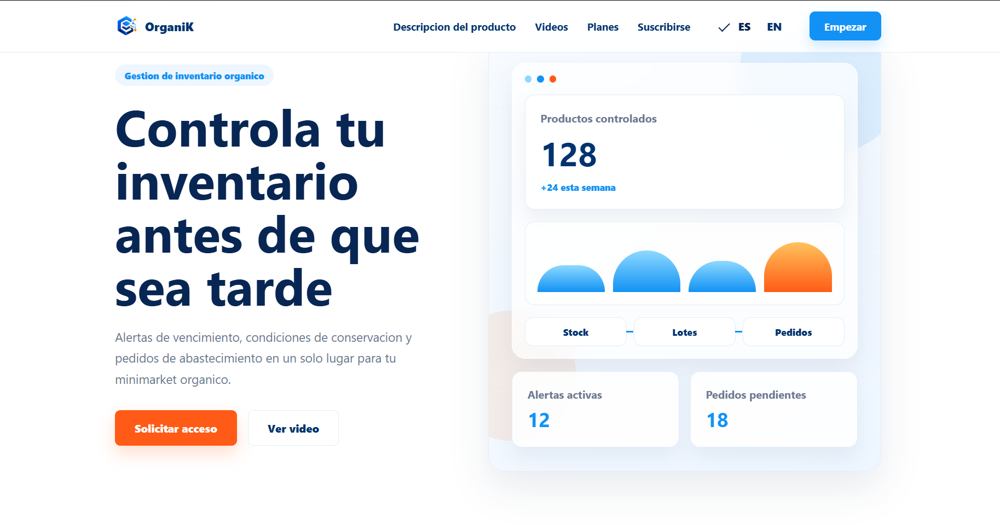
  
<em>Figura: Vista principal de OrganiK desplegada en la Landing Page.</em>

**Evidencia 2: Sección de Descripción del Producto**

Se maquetó la sección informativa donde se presentan las principales capacidades de **OrganiK**, incluyendo inventario centralizado, control de lotes, alertas inteligentes, pedidos de abastecimiento y accesos por rol. Esta sección permite comunicar de forma clara cómo la plataforma ayuda a centralizar la operación diaria de un minimarket orgánico.

  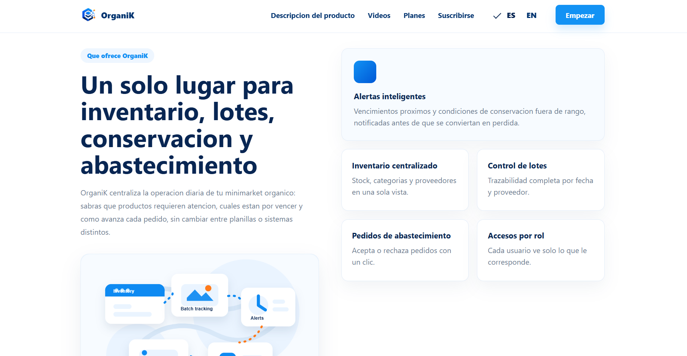
  
<em>Figura: Sección de descripción del producto y funcionalidades principales.</em>

**Evidencia 3: Sección de Videos**

Se implementó una sección dedicada a presentar al equipo y mostrar el funcionamiento general de **OrganiK** mediante contenido audiovisual. La sección incluye videos embebidos con previsualización, reforzando la confianza del usuario y explicando visualmente el propósito de la solución.

  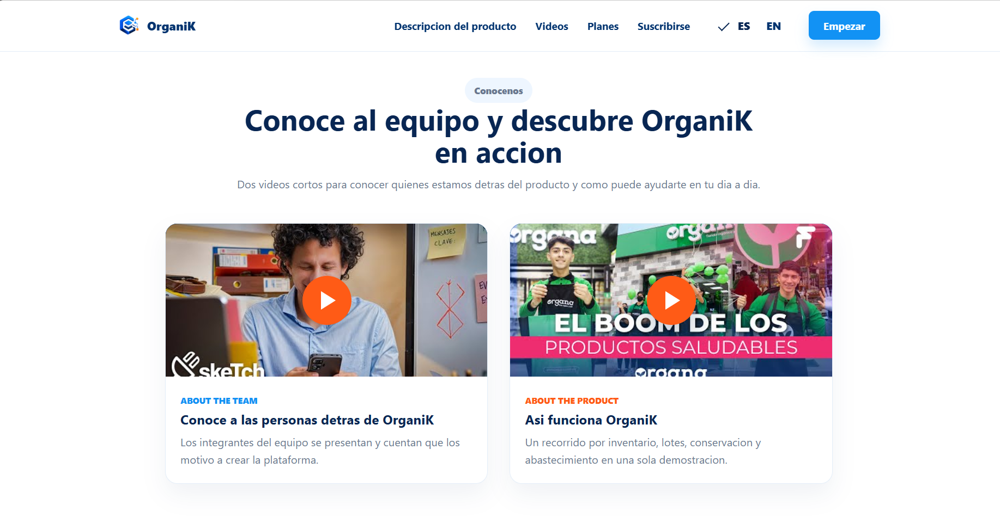
  
<em>Figura: Sección de videos para presentación del equipo y demostración del producto.</em>

**Evidencia 4: Sección de Planes**

Se desarrolló la sección de planes comerciales, presentando las alternativas **Básico**, **Profesional** y **Empresarial**. Cada plan comunica de manera ordenada sus beneficios principales, permitiendo que los minimarkets identifiquen la opción más adecuada según su tamaño y necesidades operativas.

  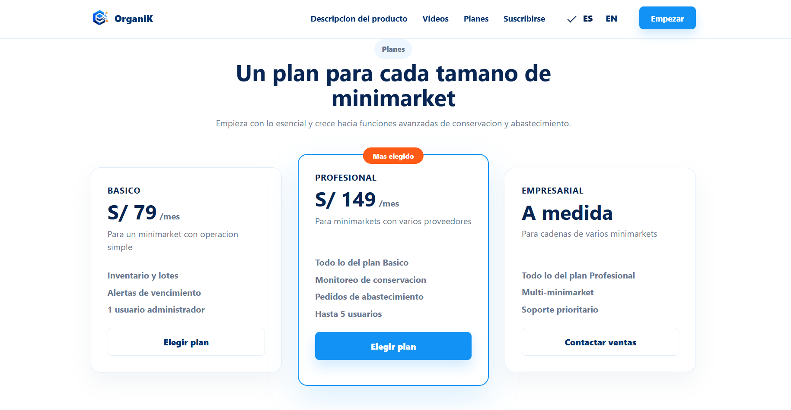
  
<em>Figura: Sección de planes disponibles para los usuarios de OrganiK.</em>

**Evidencia 5: Sección Starter / Suscribirse**

Se implementó la sección **Starter**, incluyendo información de correo, periodo de prueba, horario de atención y un formulario para que los minimarkets interesados puedan suscribirse o solicitar más información sobre la plataforma. Esta sección reemplaza la sección tradicional de contacto y cumple el objetivo de facilitar el inicio del proceso de adopción de **OrganiK**.

  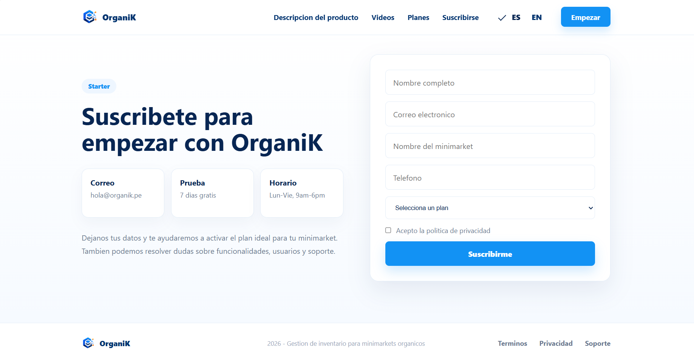
  
<em>Figura: Sección Starter para suscripción e inicio de adopción de OrganiK.</em>

---

#### 5.2.1.6. Services Documentation Evidence for Sprint Review.

  Dado que el Sprint 1 abarca únicamente contenido estático correspondiente a la Landing Page de marketing de <strong>OrganiK</strong>, la implementación y consumo de servicios backend para la gestión de inventario, lotes, conservación, pedidos y proveedores será abordada en sprints posteriores orientados al desarrollo de la plataforma web.

---

#### 5.2.1.7. Software Deployment Evidence for Sprint Review.

  <strong>URL de entorno local:</strong>
  <a href="http://127.0.0.1:4200/">
    http://127.0.0.1:4200/
  </a>

  <strong>URL de Producción:</strong>
  <a href="https://witty-pebble-068250b10.2.azurestaticapps.net">
    &lt;https://witty-pebble-068250b10.2.azurestaticapps.net&gt;
  </a>

---

#### 5.2.1.8. Team Collaboration Insights during Sprint.

  Durante este primer sprint, el esfuerzo principal del equipo de <strong>OrganiK</strong> se centró en la estructuración del proyecto, el diseño UX/UI, la implementación de la landing page, la organización de commits mediante Conventional Commits y la documentación inicial del producto <strong>OrganiK</strong>. Por lo tanto, las evidencias de colaboración presentadas a continuación corresponden al trabajo realizado para construir la presencia digital inicial del producto.

  En primer lugar, el <strong>Historial de Commits</strong> del repositorio demuestra que el trabajo fue organizado mediante cambios incrementales y commits siguiendo la convención de <strong>Conventional Commits</strong>. Durante el sprint se realizaron cambios relacionados con la maquetación de secciones, la adaptación visual basada en referencias, la internacionalización de contenido, la corrección de videos embebidos, la alineación de marca y la refactorización de la arquitectura por features.

  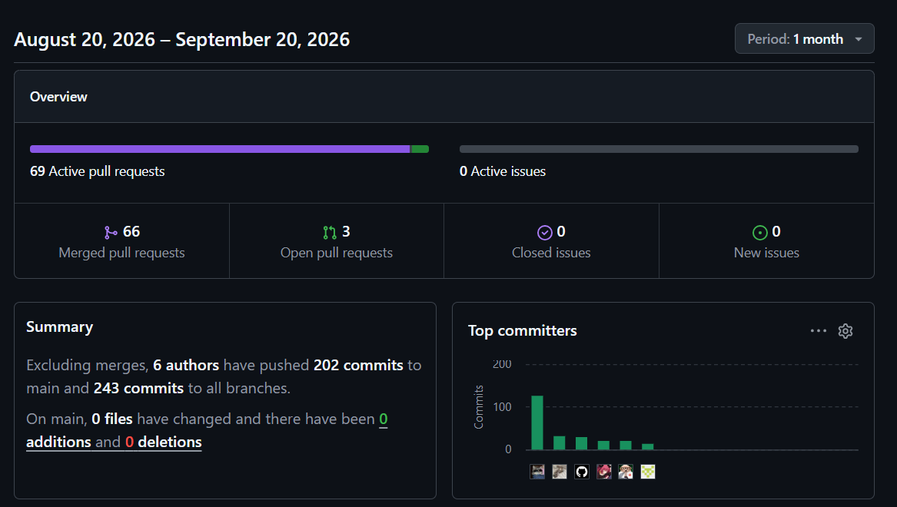
  
<em>Figura: Historial de commits demostrando el avance incremental de la landing page de OrganiK.</em>

  En segundo lugar, el gráfico de <strong>Visitors (Traffic)</strong> proporcionado por los Insights de GitHub permite evidenciar la actividad de consulta del repositorio. Las visitas y usuarios únicos reflejan que el equipo revisó recurrentemente el avance del proyecto, validando la estructura visual, el contenido de las secciones y la coherencia general de la landing page antes del despliegue.

  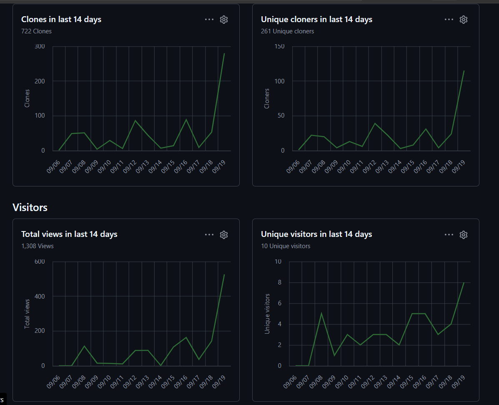
  
<em>Figura: Gráfica de visitantes mostrando la revisión constante del repositorio por parte del equipo OrganiK.</em>

---

# Conclusiones

## Conclusiones y recomendaciones.

1. El desarrollo de **OrganiK** permitió identificar una problemática real en la gestión de productos orgánicos: la fragmentación de información, el control manual de inventarios, la poca trazabilidad de lotes y la dependencia de canales informales como WhatsApp para coordinar pedidos entre minimarkets y proveedores.

2. Las entrevistas realizadas evidenciaron que tanto administradores de minimarkets como proveedores necesitan una solución centralizada, sencilla y accesible que les permita reducir errores operativos, anticipar vencimientos, controlar stock y mejorar la coordinación del abastecimiento.

3. La propuesta de **OrganiK** se diferencia de soluciones generales de inventario al enfocarse específicamente en productos orgánicos, integrando inventario, lotes, vencimientos, abastecimiento, proveedores y monitoreo de condiciones de conservación como temperatura y humedad.

4. La implementación de la landing page permitió comunicar de manera clara la propuesta de valor del producto, sus funcionalidades principales, planes comerciales y canales de contacto, funcionando como una primera aproximación para validar el interés del mercado.

5. El uso de Angular, componentes organizados por features, internacionalización y control de versiones mediante Git permitió construir una base técnica ordenada, escalable y alineada con buenas prácticas de desarrollo frontend.

6. El trabajo colaborativo del equipo permitió avanzar en investigación, diseño, documentación e implementación, fortaleciendo la planificación, asignación de responsabilidades y seguimiento del proyecto mediante herramientas digitales.

1. Continuar con el desarrollo de la plataforma web principal, priorizando los módulos de inventario, proveedores, requisiciones, pedidos, alertas y dashboard, ya que son los flujos de mayor valor para los usuarios entrevistados.

2. Realizar nuevas validaciones con administradores de minimarkets y proveedores usando prototipos funcionales, no solo mockups, para medir si los usuarios pueden completar tareas clave sin dificultad.

3. Implementar progresivamente un backend con autenticación, roles diferenciados y persistencia de datos, asegurando que los proveedores puedan generar pedidos y que solo los administradores puedan aprobarlos y modificar inventario.

4. Mantener una interfaz responsive y simple, especialmente para dispositivos móviles, debido a que los usuarios gestionan muchas operaciones desde celular durante su jornada laboral.

5. Incorporar métricas operativas en el dashboard, como productos próximos a vencer, stock bajo, pedidos pendientes, productos en riesgo por temperatura/humedad y mermas registradas.

---

# Bibliografía

- Bedoya-Perales, N. S., & Dal’ Magro, G. P. (2021). Quantification of food losses and waste in Peru: A mass flow analysis along the food supply chain. *Sustainability, 13*(5), 2807. https://doi.org/10.3390/su13052807

- Hansen, E. B., & Bøgh, S. (2021). Internet of things for perishable inventory management systems: An application and managerial insights for micro, small and medium enterprises. *Annals of Operations Research*. https://pmc.ncbi.nlm.nih.gov/articles/PMC8494460/

- Teller, C., Holweg, C., Reiner, G., & Kotzab, H. (2018). Waste not, want not: Managing perishables in small and medium retail enterprises. *International Journal of Retail & Distribution Management*. https://pure.qub.ac.uk/en/publications/waste-not-want-not-managing-perishables-in-small-and-medium-retai/

- Angular. (2026). *Angular Style Guide*. Angular Documentation. https://angular.dev/style-guide

- Conventional Commits. (2026). *Conventional Commits 1.0.0*. https://www.conventionalcommits.org/en/v1.0.0/

- Food and Agriculture Organization of the United Nations. (2019). *The State of Food and Agriculture 2019: Moving forward on food loss and waste reduction*. FAO. https://www.fao.org/agrifood-economics/publications/detail/en/c/1238574/

- Food and Agriculture Organization of the United Nations. (2026). *SDG Indicator 12.3.1: Global Food Loss and Waste*. FAO. https://www.fao.org/sustainable-development-goals-data-portal/data/indicators/1231-global-food-losses

- Food and Agriculture Organization of the United Nations. (s.f.). *Food loss and food waste*. FAO Policy Support and Governance Gateway. https://www.fao.org/policy-support/policy-themes/food-loss-and-food-waste/

- Gothelf, J., & Seiden, J. (2021). *Lean UX: Designing great products with agile teams* (3rd ed.). O’Reilly Media.

- Google. (s.f.). *Google HTML/CSS Style Guide*. Google Style Guides. https://google.github.io/styleguide/htmlcssguide.html

- Google. (s.f.). *Google TypeScript Style Guide*. Google Style Guides. https://google.github.io/styleguide/tsguide.html

- Organisation for Economic Co-operation and Development. (2025). *The potential effects of reducing food loss and waste*. OECD Publishing. https://www.oecd.org/content/dam/oecd/en/publications/reports/2025/05/the-potential-effects-of-reducing-food-loss-and-waste_ee750206/bd2aedc6-en.pdf

- Osterwalder, A., Pigneur, Y., Bernarda, G., & Smith, A. (2014). *Value Proposition Design: How to create products and services customers want*. Wiley.

- Vernon, V. (2013). *Implementing Domain-Driven Design*. Addison-Wesley Professional.

- World Wide Web Consortium. (2023). *Web Content Accessibility Guidelines (WCAG) 2.2*. W3C. https://www.w3.org/TR/WCAG22/

- Zavaleta-Zarate, K., Escobal-Vera, J., & Zarate-Perez, E. (2026). Optimizing inventory in convenience stores to maximize ROI using Random Forest and genetic algorithms. *Logistics, 10*(3), 64. https://doi.org/10.3390/logistics10030064

- CasaMarket. (s. f.). *Planes CasaMarket para minimarket*. https://casamarket.pe/planes/

- limaPOS. (s. f.). *Punto de venta e inventario en la nube*. https://www.limapos.com/

- Spry Sales. (s. f.). *Software de gestión comercial electrónica*. https://www.spry.pe/

<!-- AUTO-DOCS:END -->
