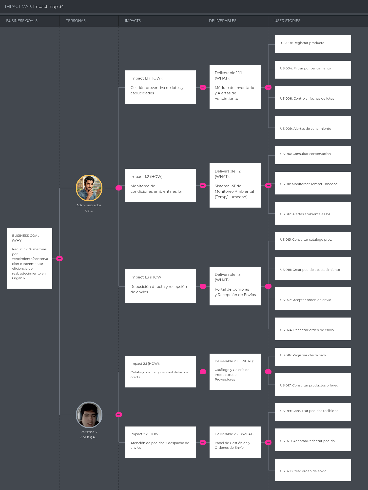

# Capítulo III: Requirements Specification

## TO-BE Scenario Mapping

### Administradores de Minimarkets

| Fase | Doing (Qué hace) | Thinking (Qué piensa) | Feeling (Qué siente) |
|------|------------------|-----------------------|----------------------|
| Consulta y revisión de información | Consulta el dashboard para revisar inventario, lotes, vencimientos, condiciones de conservación, pedidos, órdenes de envío y alertas. | “Necesito conocer rápidamente el estado de los productos y las operaciones del minimarket.” | Organizado y con mayor control. |
| Gestión del inventario | Registra, consulta, busca, filtra y actualiza productos del inventario. También registra lotes, mermas y productos disponibles como oferta. | “Necesito mantener actualizada la información para conocer el estado real de mi inventario.” | Seguro al contar con información centralizada. |
| Control de productos | Consulta fechas de vencimiento, condiciones de conservación, temperatura, humedad y alertas relacionadas. | “Necesito identificar los productos que requieren atención antes de que se generen pérdidas.” | Informado y atento ante posibles riesgos. |
| Gestión de abastecimiento | Consulta los productos ofrecidos por proveedores y crea pedidos de abastecimiento indicando proveedor, productos y cantidades requeridas. | “Necesito solicitar los productos necesarios para mantener abastecido el minimarket.” | Organizado al centralizar sus solicitudes. |
| Recepción de productos | Consulta las órdenes de envío generadas por los proveedores y verifica los productos y cantidades recibidas. | “Necesito comprobar que los productos enviados correspondan con lo solicitado.” | Responsable y atento durante la recepción. |
| Confirmación de recepción | Acepta o rechaza las órdenes de envío. Cuando acepta una orden, los productos recibidos se incorporan al inventario. | “Necesito verificar correctamente el envío antes de actualizar mi inventario.” | Seguro al mantener control sobre las entradas de productos. |
| Seguimiento | Consulta el historial de pedidos, órdenes de envío, alertas y operaciones realizadas. | “Necesito mantener trazabilidad de las operaciones realizadas.” | Informado y con mayor sensación de control. |

### Proveedores de Productos Orgánicos

| Fase | Doing (Qué hace) | Thinking (Qué piensa) | Feeling (Qué siente) |
|------|------------------|-----------------------|----------------------|
| Consulta de información | Consulta el dashboard para revisar productos ofrecidos, pedidos recibidos y órdenes de envío. | “Necesito conocer rápidamente las solicitudes recibidas y mis operaciones pendientes.” | Organizado y con mayor claridad. |
| Gestión de productos | Registra y consulta los productos orgánicos que ofrece a los minimarkets. | “Necesito mantener actualizada mi oferta para que los minimarkets conozcan mis productos disponibles.” | En control de su catálogo. |
| Gestión de pedidos | Consulta los pedidos de abastecimiento recibidos de los minimarkets y revisa los productos y cantidades solicitadas. | “Necesito verificar si puedo atender correctamente esta solicitud.” | Atento a las necesidades de sus clientes. |
| Respuesta al pedido | Acepta o rechaza los pedidos recibidos según su capacidad para atenderlos. | “Necesito confirmar únicamente los pedidos que puedo cumplir.” | Seguro al controlar sus compromisos de abastecimiento. |
| Gestión de envíos | Genera una orden de envío para los pedidos aceptados indicando los productos, cantidades y datos requeridos. | “Necesito registrar correctamente lo que voy a enviar al minimarket.” | Organizado y enfocado en completar el abastecimiento. |
| Seguimiento | Consulta las órdenes de envío y su estado para conocer si fueron aceptadas o rechazadas por el minimarket. | “Necesito saber si el envío fue recibido correctamente.” | Informado sobre el estado de sus operaciones. |

## 3.1. User Stories

## Epics

| EPIC ID | Título | Descripción |
|--------|--------|-------------|
| EP-01 | Gestión de inventario | Permite registrar, visualizar, buscar y actualizar la información de los productos disponibles en el inventario del minimarket, incluyendo cantidades, mermas y productos disponibles como oferta. |
| EP-02 | Gestión de lotes y vencimientos | Permite controlar los lotes, fechas de vencimiento y trazabilidad de los productos registrados en el inventario. |
| EP-03 | Gestión de conservación | Permite registrar y visualizar las condiciones de conservación de los productos, así como generar alertas cuando se detecten condiciones de riesgo. |
| EP-04 | Gestión de abastecimiento | Permite gestionar el flujo de abastecimiento mediante pedidos generados por los administradores de minimarkets y órdenes de envío generadas por los proveedores, incluyendo su aceptación, rechazo y seguimiento. |
| EP-05 | Gestión de proveedores y productos | Permite consultar y administrar la información relacionada con proveedores y los productos que ofrecen dentro de la plataforma. |
| EP-06 | Gestión de usuarios y seguridad | Permite registrar usuarios, gestionar roles y controlar el acceso a las funcionalidades mediante permisos según el segmento. |
| EP-07 | Análisis y control de gestión | Permite visualizar indicadores, historial de operaciones, alertas e información consolidada para facilitar el seguimiento de las operaciones. |

## User Stories

| US ID | Título | Descripción | Relacionado con (EPIC ID) |
|------|--------|-------------|---------------------------|
| US 001 | Registrar producto en inventario | **Como** administrador de minimarket, **Quiero** registrar productos en el inventario, **Para** mantener actualizada la información de los productos disponibles. | EP-01 |
| US 002 | Visualizar inventario | **Como** administrador de minimarket, **Quiero** visualizar los productos registrados, **Para** conocer el estado actual de mi inventario. | EP-01 |
| US 003 | Buscar productos en inventario | **Como** administrador de minimarket, **Quiero** buscar productos dentro del inventario, **Para** encontrarlos rápidamente. | EP-01 |
| US 004 | Filtrar inventario | **Como** administrador de minimarket, **Quiero** filtrar productos por categoría, estado o vencimiento, **Para** identificar rápidamente productos que requieren atención. | EP-01 / EP-02 |
| US 005 | Actualizar inventario | **Como** administrador de minimarket, **Quiero** actualizar la información de los productos, **Para** mantener el inventario correctamente registrado. | EP-01 |
| US 006 | Registrar lote | **Como** administrador de minimarket, **Quiero** registrar lotes de productos, **Para** mantener la trazabilidad de los productos almacenados. | EP-02 |
| US 007 | Consultar lotes | **Como** administrador de minimarket, **Quiero** consultar los lotes registrados, **Para** conocer el origen y estado de los productos. | EP-02 |
| US 008 | Controlar fechas de vencimiento | **Como** administrador de minimarket, **Quiero** visualizar las fechas de vencimiento de los productos, **Para** identificar productos próximos a vencer. | EP-02 |
| US 009 | Generar alertas de vencimiento | **Como** administrador de minimarket, **Quiero** recibir alertas sobre productos próximos a vencer, **Para** tomar acciones antes de que se generen pérdidas. | EP-02 |
| US 010 | Consultar condiciones de conservación | **Como** administrador de minimarket, **Quiero** consultar las condiciones de conservación de los productos, **Para** identificar posibles riesgos de deterioro. | EP-03 |
| US 011 | Monitorear temperatura y humedad | **Como** administrador de minimarket, **Quiero** visualizar registros de temperatura y humedad, **Para** conocer las condiciones de almacenamiento de los productos. | EP-03 |
| US 012 | Generar alertas de conservación | **Como** administrador de minimarket, **Quiero** recibir alertas cuando las condiciones de conservación sean inadecuadas, **Para** reaccionar oportunamente ante posibles riesgos de deterioro. | EP-03 |
| US 013 | Registrar merma | **Como** administrador de minimarket, **Quiero** registrar productos que hayan sufrido merma, **Para** mantener un historial de pérdidas de inventario. | EP-01 / EP-07 |
| US 014 | Registrar oferta de productos | **Como** administrador de minimarket, **Quiero** registrar productos disponibles como oferta, **Para** promocionar productos con stock disponible y mantener trazabilidad sobre su salida comercial del inventario. | EP-01 / EP-07 |
| US 015 | Consultar productos de proveedores | **Como** administrador de minimarket, **Quiero** consultar los productos ofrecidos por los proveedores, **Para** identificar opciones disponibles para abastecer el minimarket. | EP-05 |
| US 016 | Registrar productos ofrecidos | **Como** proveedor de productos orgánicos, **Quiero** registrar los productos que ofrezco, **Para** ponerlos a disposición de los minimarkets. | EP-05 |
| US 017 | Consultar productos ofrecidos | **Como** proveedor de productos orgánicos, **Quiero** consultar los productos que tengo registrados, **Para** mantener control sobre mi oferta dentro de la plataforma. | EP-05 |
| US 018 | Crear pedido de abastecimiento | **Como** administrador de minimarket, **Quiero** crear un pedido de abastecimiento dirigido a un proveedor, **Para** solicitar los productos que necesita el minimarket. | EP-04 |
| US 019 | Consultar pedidos de abastecimiento | **Como** usuario autorizado, **Quiero** consultar los pedidos de abastecimiento, **Para** conocer las solicitudes realizadas o recibidas y su estado actual. | EP-04 |
| US 020 | Aceptar o rechazar pedido | **Como** proveedor de productos orgánicos, **Quiero** aceptar o rechazar los pedidos recibidos de los minimarkets, **Para** indicar si puedo atender los productos y cantidades solicitadas. | EP-04 |
| US 021 | Crear orden de envío | **Como** proveedor de productos orgánicos, **Quiero** generar una orden de envío asociada a un pedido aceptado, **Para** registrar los productos y cantidades que serán enviados al minimarket. | EP-04 |
| US 022 | Consultar órdenes de envío | **Como** usuario autorizado, **Quiero** consultar las órdenes de envío, **Para** conocer los envíos generados y su estado actual. | EP-04 |
| US 023 | Aceptar orden de envío | **Como** administrador de minimarket, **Quiero** aceptar una orden de envío recibida, **Para** confirmar la recepción e incorporar los productos recibidos al inventario. | EP-01 / EP-04 |
| US 024 | Rechazar orden de envío | **Como** administrador de minimarket, **Quiero** rechazar una orden de envío, **Para** evitar incorporar al inventario productos que no correspondan con el envío esperado. | EP-04 |
| US 025 | Consultar historial de abastecimiento | **Como** usuario autorizado, **Quiero** consultar el historial de pedidos y órdenes de envío, **Para** mantener trazabilidad de las operaciones de abastecimiento realizadas. | EP-04 / EP-07 |
| US 026 | Registrar usuario | **Como** usuario administrador autorizado, **Quiero** registrar usuarios en el sistema, **Para** permitir el acceso controlado a OrganiK. | EP-06 |
| US 027 | Inicio de sesión | **Como** usuario, **Quiero** iniciar sesión, **Para** acceder al dashboard de OrganiK según mis permisos. | EP-06 |
| US 028 | Gestionar permisos por rol | **Como** usuario administrador autorizado, **Quiero** gestionar los permisos asociados a los roles, **Para** controlar las acciones que cada segmento puede realizar. | EP-06 |
| US 029 | Controlar acceso según operación | **Como** usuario de OrganiK, **Quiero** que las acciones disponibles en pedidos, órdenes de envío e inventario dependan de mi rol, **Para** evitar modificaciones no autorizadas. | EP-01 / EP-04 / EP-06 |
| US 030 | Dashboard general | **Como** usuario de OrganiK, **Quiero** visualizar un dashboard común con información relevante según mi rol, **Para** consultar rápidamente el estado de mis operaciones. | EP-07 |

## Technical Stories

| TS ID | Título | Descripción | Relacionado con (EPIC ID) |
|------|--------|-------------|---------------------------|
| TS-IAM-001 | Sign-in API | **Como** frontend developer, **Quiero** autenticar usuarios mediante una API de inicio de sesión, **Para** obtener las credenciales de sesión y permisos correspondientes. | EP-06 |
| TS-IAM-002 | Sign-up API | **Como** frontend developer, **Quiero** registrar usuarios mediante una API, **Para** habilitar el acceso controlado a OrganiK. | EP-06 |
| TS-IAM-003 | Users directory API | **Como** frontend developer, **Quiero** consultar y registrar usuarios mediante la API, **Para** administrar los usuarios autorizados de OrganiK. | EP-06 |
| TS-IAM-004 | User detail and update API | **Como** frontend developer, **Quiero** consultar y actualizar usuarios mediante la API, **Para** mantener sus roles o estados actualizados. | EP-06 |
| TS-PROF-001 | Profile read and update API | **Como** frontend developer, **Quiero** consultar y actualizar el perfil del usuario o negocio, **Para** mostrar información actualizada dentro de OrganiK. | EP-06 |
| TS-PROD-001 | Products catalog API | **Como** frontend developer, **Quiero** consultar y registrar productos mediante la API, **Para** alimentar el inventario y catálogo de productos ofrecidos. | EP-01 / EP-05 |
| TS-PROD-002 | Product detail and update API | **Como** frontend developer, **Quiero** consultar y actualizar productos, **Para** mantener la información actualizada. | EP-01 / EP-05 |
| TS-INV-001 | Inventory list and create API | **Como** frontend developer, **Quiero** consultar y registrar elementos del inventario, **Para** mantener actualizado el stock del minimarket. | EP-01 |
| TS-INV-002 | Inventory update API | **Como** frontend developer, **Quiero** actualizar los registros de inventario, **Para** reflejar cambios en las cantidades y datos de los productos. | EP-01 / EP-06 |
| TS-INV-003 | Inventory search and filter API | **Como** frontend developer, **Quiero** consultar el inventario utilizando filtros, **Para** implementar búsquedas por producto, categoría, estado o vencimiento. | EP-01 / EP-02 |
| TS-LOT-001 | Lots API | **Como** frontend developer, **Quiero** consultar y registrar lotes, **Para** implementar la trazabilidad de los productos. | EP-02 |
| TS-LOT-002 | Lot detail and update API | **Como** frontend developer, **Quiero** consultar y actualizar información de lotes, **Para** mantener actualizada la trazabilidad. | EP-02 |
| TS-EXP-001 | Expiration tracking API | **Como** frontend developer, **Quiero** consultar productos y lotes próximos a vencer, **Para** alimentar las alertas de vencimiento. | EP-02 |
| TS-CON-001 | Conservation monitoring API | **Como** frontend developer, **Quiero** consultar registros de temperatura y humedad, **Para** mostrar las condiciones de conservación. | EP-03 |
| TS-CON-002 | Conservation alerts API | **Como** frontend developer, **Quiero** consultar las alertas generadas por condiciones de conservación, **Para** mostrarlas al administrador. | EP-03 |
| TS-SUP-001 | Supplier directory API | **Como** frontend developer, **Quiero** consultar y registrar proveedores, **Para** mantener disponible la información necesaria para el abastecimiento. | EP-05 |
| TS-SUP-002 | Supplier products API | **Como** frontend developer, **Quiero** consultar los productos ofrecidos por cada proveedor, **Para** mostrar el catálogo disponible para los minimarkets. | EP-05 |
| TS-ORD-001 | Supply requests API | **Como** frontend developer, **Quiero** consultar y crear pedidos de abastecimiento mediante la API, **Para** permitir que los administradores soliciten productos a los proveedores. | EP-04 |
| TS-ORD-002 | Supply request response API | **Como** frontend developer, **Quiero** procesar la aceptación o rechazo de pedidos, **Para** permitir que los proveedores respondan a las solicitudes. | EP-04 |
| TS-ORD-003 | Shipping orders API | **Como** frontend developer, **Quiero** consultar y crear órdenes de envío, **Para** registrar los envíos generados por proveedores a partir de pedidos aceptados. | EP-04 |
| TS-ORD-004 | Shipping order reception API | **Como** frontend developer, **Quiero** procesar la aceptación o rechazo de órdenes de envío, **Para** confirmar la recepción y actualizar el inventario cuando corresponda. | EP-01 / EP-04 |
| TS-MER-001 | Waste and offer API | **Como** frontend developer, **Quiero** registrar mermas y ofertas de productos, **Para** mantener trazabilidad sobre las operaciones que afectan el inventario. | EP-01 / EP-07 |
| TS-DASH-001 | Dashboard API | **Como** frontend developer, **Quiero** consultar indicadores generales de OrganiK, **Para** alimentar el dashboard común con información relevante según el rol. | EP-07 |
| TS-DASH-002 | Alerts and notifications API | **Como** frontend developer, **Quiero** consultar las alertas y notificaciones del usuario, **Para** informar oportunamente sobre eventos relevantes. | EP-03 / EP-07 |
| TS-AUD-001 | Activity history API | **Como** frontend developer, **Quiero** consultar el historial de operaciones, **Para** mantener trazabilidad de las acciones realizadas en OrganiK. | EP-06 / EP-07 |

### Functional Stories

| FS ID | Título | Descripción | Relacionado con (EPIC ID) |
|------|--------|-------------|---------------------------|
| FS-001 | Permisos de pedidos según rol | **Como** sistema, **Quiero** aplicar permisos diferenciados sobre el módulo de pedidos, **Para** que el administrador pueda crear y gestionar sus pedidos mientras el proveedor pueda consultar, aceptar o rechazar los pedidos recibidos. | EP-04 / EP-06 |
| FS-002 | Permisos de órdenes de envío según rol | **Como** sistema, **Quiero** aplicar permisos diferenciados sobre las órdenes de envío, **Para** que el proveedor pueda gestionar sus órdenes mientras el administrador pueda consultar y aceptar o rechazar su recepción. | EP-04 / EP-06 |

### Flujo principal de abastecimiento

El flujo de abastecimiento de **OrganiK** se desarrolla de la siguiente manera:

1. El **administrador del minimarket** consulta los productos ofrecidos por los proveedores.
2. El administrador crea un **pedido de abastecimiento** dirigido a un proveedor.
3. El **proveedor** consulta el pedido recibido.
4. El proveedor puede **aceptar o rechazar** el pedido.
5. Si el pedido es aceptado, el proveedor genera una **orden de envío** asociada.
6. El **administrador del minimarket** consulta la orden de envío recibida.
7. El administrador puede **aceptar o rechazar** la orden.
8. Si la orden es aceptada, los productos y cantidades recibidos se incorporan al **inventario del minimarket**.
9. El sistema conserva el historial de pedidos y órdenes para mantener la **trazabilidad del abastecimiento**.

### API Endpoint Coverage for Backend Web Services

La siguiente matriz presenta la cobertura de endpoints REST definida para los Web Services de **OrganiK**. Estos endpoints permiten la comunicación entre el frontend y el backend, y se encuentran organizados de acuerdo con los módulos funcionales, Technical Stories y User Stories establecidas para la plataforma.

Los servicios contemplan las funcionalidades requeridas por los dos segmentos objetivo de OrganiK: **administradores de minimarkets** y **proveedores de productos orgánicos**. La API utiliza el prefijo `/api/v1` para mantener una estructura versionada y facilitar futuras extensiones de los servicios.

| Endpoint | Métodos esperados | Fuente de requisito | Contexto frontend / backend |
|------|-------------------|---------------------|-----------------------------|
| `/api/v1/health` | GET | IMP-BE-001 | shared / platform |
| `/api/v1/auth/sign-in` | POST | TS-IAM-001 / US-027 | iam |
| `/api/v1/auth/sign-up` | POST | TS-IAM-002 / US-026 | iam |
| `/api/v1/users` | GET, POST | TS-IAM-003 / US-026 | iam |
| `/api/v1/users/{id}` | GET, PATCH | TS-IAM-004 / US-026 / US-028 | iam |
| `/api/v1/profiles` | GET | TS-PROF-001 | profiles |
| `/api/v1/profiles/{id}` | GET, PUT/PATCH | TS-PROF-001 | profiles |
| `/api/v1/products` | GET, POST | TS-PROD-001 / US-001 / US-016 | products |
| `/api/v1/products/{id}` | GET, PATCH, DELETE | TS-PROD-002 / US-005 / US-016 | products |
| `/api/v1/inventory` | GET, POST | TS-INV-001 / US-001 / US-002 | inventory |
| `/api/v1/inventory/{id}` | GET, PATCH | TS-INV-002 / US-005 / US-029 | inventory |
| `/api/v1/inventory/search` | GET | TS-INV-003 / US-003 / US-004 | inventory |
| `/api/v1/lots` | GET, POST | TS-LOT-001 / US-006 / US-007 | lots |
| `/api/v1/lots/{id}` | GET, PATCH | TS-LOT-002 / US-007 | lots |
| `/api/v1/expirations` | GET | TS-EXP-001 / US-008 / US-009 | lots / expirations |
| `/api/v1/conservation/monitoring` | GET | TS-CON-001 / US-010 / US-011 | conservation |
| `/api/v1/conservation/alerts` | GET | TS-CON-002 / US-012 | conservation |
| `/api/v1/suppliers` | GET, POST | TS-SUP-001 / US-016 / US-017 | suppliers |
| `/api/v1/suppliers/{id}` | GET, PATCH | TS-SUP-001 / US-017 | suppliers |
| `/api/v1/suppliers/{id}/products` | GET, POST | TS-SUP-002 / US-016 / US-017 | suppliers / products |
| `/api/v1/orders` | GET, POST | TS-ORD-001 / US-018 / US-019 | orders |
| `/api/v1/orders/{id}` | GET, PATCH | TS-ORD-002 / US-021 / US-024 | orders |
| `/api/v1/orders/{id}/accept` | POST | TS-ORD-003 / US-022 | orders / inventory |
| `/api/v1/orders/{id}/reject` | POST | TS-ORD-004 / US-023 | orders |
| `/api/v1/waste` | GET, POST | TS-MER-001 / US-013 | waste |
| `/api/v1/donations` | GET, POST | TS-MER-001 / US-014 | donations |
| `/api/v1/dashboard` | GET | TS-DASH-001 / US-030 | dashboard |
| `/api/v1/notifications` | GET, PATCH | TS-DASH-002 / US-009 / US-012 | notifications |
| `/api/v1/activity-history` | GET | TS-AUD-001 / US-025 | audit |

La cobertura definida permite separar las responsabilidades de los principales módulos de OrganiK. **IAM y Profiles** administran la identidad, autenticación y datos de los usuarios; **Products, Inventory y Lots** gestionan los productos, existencias, lotes y fechas de vencimiento; mientras que **Conservation** proporciona acceso a la información relacionada con las condiciones de conservación y sus respectivas alertas.

Por otro lado, **Suppliers y Orders** soportan el proceso de abastecimiento entre proveedores y administradores de minimarkets. Los proveedores pueden gestionar la información de los productos que ofrecen y participar en el flujo de pedidos, mientras que los administradores pueden aceptar o rechazar dichos pedidos y actualizar posteriormente el inventario según corresponda.

Finalmente, los servicios de **Waste, Donations, Dashboard, Notifications y Activity History** complementan la operación de la plataforma mediante el registro de mermas y donaciones, la visualización de información resumida, la consulta de alertas y notificaciones, y el seguimiento de las actividades realizadas dentro del sistema.

## 3.2. Impact Mapping

## 3.3. Product Backlog

## 3.3. Product Backlog

| Orden | User Story ID | Título | Descripción | Story Points |
|------|--------------|--------|-------------|--------------|
| 1 | US-001 | Registrar producto en inventario | Como administrador de minimarket, quiero registrar productos en el inventario para mantener un control estructurado de los productos disponibles. | 5 |
| 2 | US-002 | Visualizar inventario | Como administrador de minimarket, quiero visualizar el inventario para conocer los productos disponibles y su información actual. | 5 |
| 3 | US-003 | Buscar productos en inventario | Como administrador de minimarket, quiero buscar productos en el inventario para encontrarlos rápidamente. | 3 |
| 4 | US-004 | Filtrar inventario | Como administrador de minimarket, quiero filtrar el inventario por diferentes criterios para consultar productos de manera eficiente. | 3 |
| 5 | US-005 | Actualizar inventario | Como administrador de minimarket, quiero actualizar la información del inventario para mantener los datos de los productos actualizados. | 5 |
| 6 | US-006 | Registrar lote | Como administrador de minimarket, quiero registrar lotes de productos para mantener la trazabilidad de los productos almacenados. | 5 |
| 7 | US-007 | Consultar lotes | Como administrador de minimarket, quiero consultar los lotes registrados para conocer la información asociada a cada grupo de productos. | 3 |
| 8 | US-008 | Controlar fechas de vencimiento | Como administrador de minimarket, quiero consultar las fechas de vencimiento de los productos para identificar aquellos que requieren atención. | 5 |
| 9 | US-009 | Generar alertas de vencimiento | Como administrador de minimarket, quiero recibir alertas sobre productos próximos a vencer para tomar acciones oportunamente. | 3 |
| 10 | US-010 | Consultar condiciones de conservación | Como administrador de minimarket, quiero consultar las condiciones de conservación de los productos para verificar que se mantengan adecuadamente almacenados. | 3 |
| 11 | US-011 | Monitorear temperatura y humedad | Como administrador de minimarket, quiero visualizar los datos de temperatura y humedad de las áreas de almacenamiento para identificar condiciones que puedan afectar los productos. | 5 |
| 12 | US-012 | Generar alertas de conservación | Como administrador de minimarket, quiero recibir alertas cuando las condiciones de conservación representen un riesgo para los productos. | 5 |
| 13 | US-013 | Registrar merma | Como administrador de minimarket, quiero registrar productos que hayan sufrido merma para mantener un control de las pérdidas. | 3 |
| 14 | US-014 | Registrar oferta de productos | Como administrador de minimarket, quiero registrar productos disponibles como oferta para promocionar productos con stock disponible y mantener trazabilidad sobre su salida comercial del inventario. | 3 |
| 15 | US-015 | Consultar productos de proveedores | Como administrador de minimarket, quiero consultar los productos ofrecidos por los proveedores para identificar opciones de abastecimiento. | 5 |
| 16 | US-016 | Registrar productos ofrecidos | Como proveedor, quiero registrar los productos que ofrezco para ponerlos a disposición de los minimarkets. | 5 |
| 17 | US-017 | Consultar productos ofrecidos | Como proveedor, quiero consultar los productos que ofrezco para verificar su información y disponibilidad. | 3 |
| 18 | US-018 | Crear pedido de abastecimiento | Como administrador de minimarket, quiero crear un pedido de abastecimiento dirigido a un proveedor para solicitar los productos que necesita el minimarket. | 5 |
| 19 | US-019 | Consultar pedidos de abastecimiento | Como usuario autorizado, quiero consultar los pedidos de abastecimiento para conocer las solicitudes realizadas o recibidas y su estado actual. | 3 |
| 20 | US-020 | Aceptar o rechazar pedido | Como proveedor de productos orgánicos, quiero aceptar o rechazar los pedidos recibidos de los minimarkets para indicar si puedo atender los productos y cantidades solicitadas. | 5 |
| 21 | US-021 | Crear orden de envío | Como proveedor de productos orgánicos, quiero generar una orden de envío asociada a un pedido aceptado para registrar los productos y cantidades que serán enviados al minimarket. | 5 |
| 22 | US-022 | Consultar órdenes de envío | Como usuario autorizado, quiero consultar las órdenes de envío para conocer los envíos generados y su estado actual. | 3 |
| 23 | US-023 | Aceptar orden de envío | Como administrador de minimarket, quiero aceptar una orden de envío recibida para confirmar la recepción e incorporar los productos recibidos al inventario. | 5 |
| 24 | US-024 | Rechazar orden de envío | Como administrador de minimarket, quiero rechazar una orden de envío para evitar incorporar al inventario productos que no correspondan con el envío esperado. | 3 |
| 25 | US-025 | Consultar historial de abastecimiento | Como usuario autorizado, quiero consultar el historial de pedidos y órdenes de envío para mantener trazabilidad de las operaciones de abastecimiento realizadas. | 3 |
| 26 | US-026 | Registrar usuario | Como administrador, quiero registrar usuarios en el sistema para permitir el acceso controlado a OrganiK. | 3 |
| 27 | US-027 | Inicio de sesión | Como usuario, quiero iniciar sesión para acceder a OrganiK según los permisos correspondientes a mi rol. | 3 |
| 28 | US-028 | Gestionar permisos por rol | Como administrador, quiero gestionar los permisos de los usuarios según su rol para controlar las acciones disponibles dentro de OrganiK. | 5 |
| 29 | US-029 | Controlar acceso según operación | Como usuario de OrganiK, quiero que las acciones disponibles en pedidos, órdenes de envío e inventario dependan de mi rol para evitar modificaciones no autorizadas. | 5 |
| 30 | US-030 | Dashboard general | Como usuario, quiero visualizar un dashboard general con la información correspondiente a mi rol para consultar rápidamente el estado de las operaciones. | 5 |
| 31 | IMP-BE-001 | Backend foundations | Como desarrollador, quiero configurar ASP.NET Core/C# con seguridad, health check, Swagger y XML docs para sostener los Web Services de OrganiK. | 3 |
| 32 | IMP-BE-002 | Persistence, migrations and seed data | Como desarrollador, quiero configurar EF Core, persistencia, migraciones y datos iniciales para reemplazar los datos simulados con persistencia real. | 5 |
| 33 | TS-IAM-001 | Sign-in API | Como frontend developer, quiero autenticar usuarios mediante `POST /api/v1/auth/sign-in` para obtener una sesión segura. | 2 |
| 34 | TS-IAM-002 | Sign-up API | Como frontend developer, quiero registrar usuarios mediante `POST /api/v1/auth/sign-up` para habilitar el registro de nuevos usuarios. | 2 |
| 35 | TS-IAM-003 | Users directory API | Como frontend developer, quiero listar y crear usuarios mediante `/api/v1/users` para administrar los accesos al sistema. | 3 |
| 36 | TS-IAM-004 | User detail and update API | Como frontend developer, quiero consultar y actualizar usuarios mediante `/api/v1/users/{id}` para gestionar su información y estado. | 3 |
| 37 | TS-PROF-001 | Profile read and update API | Como frontend developer, quiero consultar y actualizar perfiles mediante `/api/v1/profiles` y `/api/v1/profiles/{id}` para mantener actualizada la información del usuario. | 3 |
| 38 | TS-PROD-001 | Products catalog API | Como frontend developer, quiero consumir `/api/v1/products` para consultar y gestionar el catálogo de productos orgánicos. | 3 |
| 39 | TS-PROD-002 | Product detail and update API | Como frontend developer, quiero consultar y actualizar productos mediante `/api/v1/products/{id}` para mantener su información vigente. | 3 |
| 40 | TS-INV-001 | Inventory list and create API | Como frontend developer, quiero listar y registrar productos mediante `/api/v1/inventory` para controlar el inventario de los minimarkets. | 3 |
| 41 | TS-INV-002 | Inventory update API | Como frontend developer, quiero actualizar el inventario mediante `/api/v1/inventory/{id}` para reflejar cambios en los productos disponibles. | 2 |
| 42 | TS-INV-003 | Inventory search and filter API | Como frontend developer, quiero buscar y filtrar el inventario mediante `/api/v1/inventory/search` para facilitar la consulta de productos. | 2 |
| 43 | TS-LOT-001 | Lots list and create API | Como frontend developer, quiero listar y registrar lotes mediante `/api/v1/lots` para mantener la trazabilidad de los productos. | 3 |
| 44 | TS-LOT-002 | Lot detail and update API | Como frontend developer, quiero consultar y actualizar lotes mediante `/api/v1/lots/{id}` para mantener su información actualizada. | 2 |
| 45 | TS-EXP-001 | Expiration tracking API | Como frontend developer, quiero consultar las fechas de vencimiento mediante `/api/v1/expirations` para identificar productos próximos a vencer. | 3 |
| 46 | TS-CON-001 | Conservation monitoring API | Como frontend developer, quiero consultar los datos de conservación mediante `/api/v1/conservation/monitoring` para visualizar las condiciones de almacenamiento. | 3 |
| 47 | TS-CON-002 | Conservation alerts API | Como frontend developer, quiero consultar las alertas mediante `/api/v1/conservation/alerts` para identificar condiciones que representen riesgos para los productos. | 3 |
| 48 | TS-SUP-001 | Suppliers directory API | Como frontend developer, quiero listar, registrar, consultar y actualizar proveedores mediante `/api/v1/suppliers` y `/api/v1/suppliers/{id}` para mantener un directorio organizado. | 3 |
| 49 | TS-SUP-002 | Supplier products API | Como frontend developer, quiero consultar los productos ofrecidos por cada proveedor mediante `/api/v1/suppliers/{id}/products` para mostrar sus opciones de abastecimiento. | 3 |
| 50 | TS-ORD-001 | Supply requests API | Como frontend developer, quiero listar y crear pedidos mediante `/api/v1/requisitions` para permitir que los administradores soliciten productos a los proveedores. | 3 |
| 51 | TS-ORD-002 | Supply request response API | Como frontend developer, quiero permitir que los proveedores acepten o rechacen pedidos mediante `/api/v1/requisitions/{id}/accept` y `/api/v1/requisitions/{id}/reject` para responder a las solicitudes de abastecimiento. | 3 |
| 52 | TS-ORD-003 | Shipping orders API | Como frontend developer, quiero listar y crear órdenes de envío mediante `/api/v1/purchase-orders` para gestionar los envíos asociados a pedidos aceptados. | 3 |
| 53 | TS-ORD-004 | Shipping order reception API | Como frontend developer, quiero aceptar o rechazar órdenes de envío mediante `/api/v1/purchase-orders/{id}/accept` y `/api/v1/purchase-orders/{id}/reject` para confirmar o rechazar la recepción de los productos. | 3 |
| 54 | TS-MER-001 | Waste and offer API | Como frontend developer, quiero registrar mermas y ofertas mediante `/api/v1/waste` y `/api/v1/offers` para mantener trazabilidad de las operaciones relacionadas con el inventario. | 3 |
| 55 | TS-DASH-001 | Dashboard API | Como frontend developer, quiero consultar `/api/v1/dashboard` para alimentar los indicadores generales correspondientes al rol del usuario. | 3 |
| 56 | TS-DASH-002 | Alerts and notifications API | Como frontend developer, quiero consultar `/api/v1/notifications` para mostrar alertas y notificaciones relevantes al usuario. | 2 |
| 57 | TS-AUD-001 | Activity history API | Como frontend developer, quiero consultar `/api/v1/activity-history` para mostrar el historial de pedidos, órdenes de envío y otras acciones realizadas en OrganiK. | 3 |
| 58 | IMP-BE-003 | Business rules and integration readiness | Como desarrollador, quiero implementar las reglas de negocio relacionadas con roles, permisos, pedidos, órdenes de envío y actualización automática del inventario al aceptar una orden para garantizar el funcionamiento correcto de OrganiK. | 3 |

**Enlace directo al tablero:** [Tablero Jira - Proyecto OrganiK](https://rqls26.atlassian.net/jira/software/projects/RQSL/boards/1/backlog)

  
  
<em>Figura: Captura del Product Backlog en la herramienta de gestión del proyecto.</em>

