### 4.1. Style Guidelines

Esta sección establece las bases visuales y de comunicación para mantener la consistencia en todos los productos digitales de **OrganiK** (Landing Page y Dashboards). El objetivo es contar con un repositorio centralizado que facilite la escalabilidad del diseño y garantice una experiencia de usuario coherente tanto para administradores de minimarkets como para proveedores.

#### 4.1.1. General Style Guidelines

**Tono de Comunicación y Lenguaje**
La comunicación de OrganiK se rige bajo cuatro dimensiones principales para establecer confianza en un entorno B2B:
*   **Formal vs. Casual:** Ligeramente formal. Se dirige al usuario con respeto profesional, pero empleando términos claros y directos para agilizar la gestión operativa sin burocracia.
*   **Divertido vs. Serio:** Serio. Al tratarse de una herramienta para el control de inventarios, prevención de pérdidas económicas y abastecimiento, el enfoque debe transmitir seguridad y fiabilidad.
*   **Respetuoso vs. Irreverente:** Respetuoso. Considera la alta carga operativa y el estrés de los usuarios (como los administradores de minimarkets), mostrándose como un asistente empático.
*   **Entusiasta vs. Sereno:** Sereno. Las interfaces e interacciones no buscan abrumar al usuario con celebraciones excesivas, sino brindar tranquilidad mediante la automatización y alertas preventivas.

**Branding y Paleta de Colores**
La paleta cromática ha sido seleccionada cuidadosamente para generar confianza y evocar la naturaleza de los productos orgánicos, manteniendo un alto contraste para la lectura de datos:
*   **Colores Primarios (Acción y Confianza):** Se utilizan tonalidades azules como *Azure Radiance* y *Dodger Blue*. El azul transmite seguridad, estabilidad y limpieza tecnológica.
*   **Colores de Acento y Alerta (Dinamismo):** Se integran tonos anaranjados como *Pumpkin* y *Orange*. Utilizados exclusivamente para llamados a la acción (CTAs) y notificaciones críticas (alertas IoT de temperatura o fechas de vencimiento próximas).
*   **Colores Neutros (Estructura y Legibilidad):** Se emplean variantes de grises (como *Slate Gray* y *Boulder*) y blancos (*Alice Blue*, *White*) para los fondos de los dashboards, reduciendo la fatiga visual.

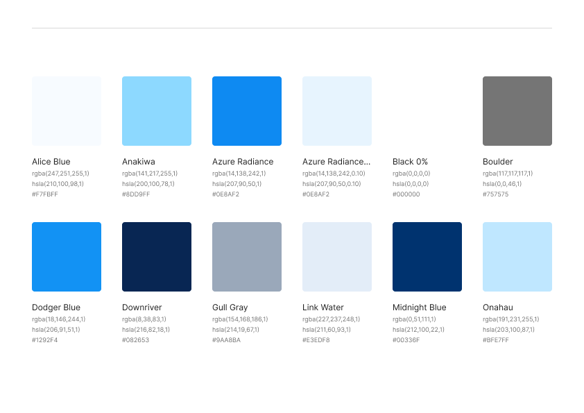
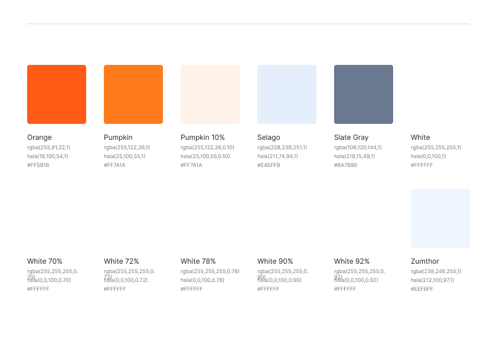

**Tipografía**
Se seleccionaron dos familias Sans-Serif priorizando la legibilidad en pantallas de múltiples resoluciones:
*   **Arimo:** Utilizada en encabezados, títulos de módulos y cifras destacadas en los dashboards. Su estructura robusta permite una rápida lectura de los KPIs.
*   **Inter:** Asignada a los cuerpos de texto y tablas de datos. Diseñada específicamente para interfaces, garantiza que los datos densos sean legibles en tamaños pequeños.

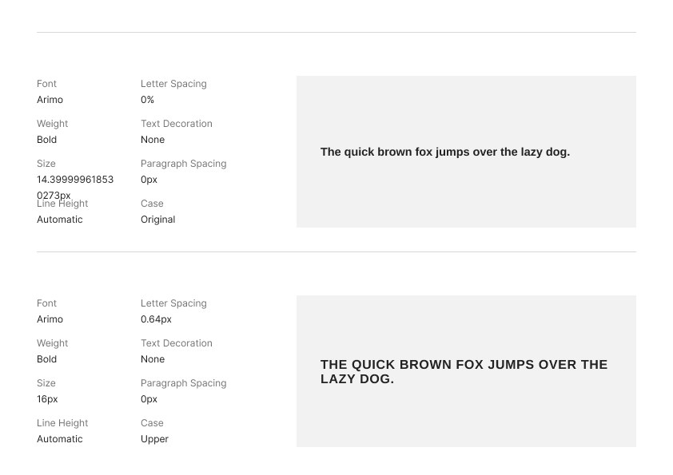
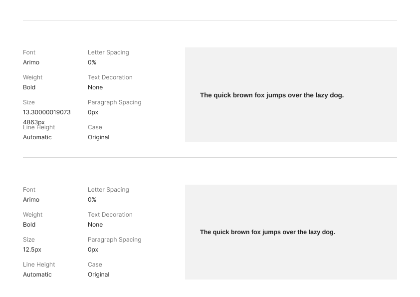
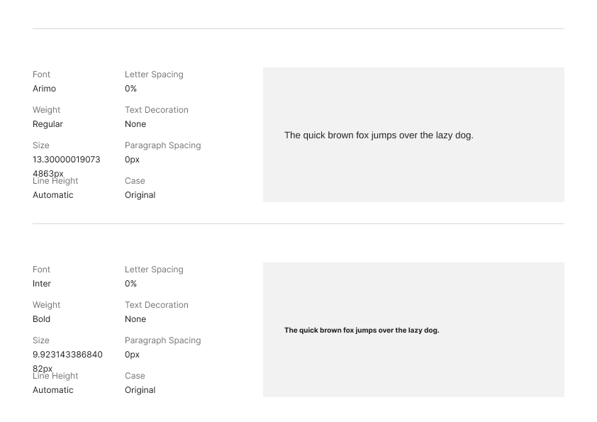
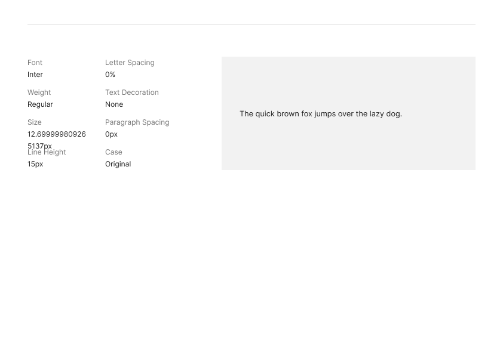

#### 4.1.2. Web Style Guidelines

Para garantizar que la experiencia sea fluida y adaptable (Responsive Web Design), se establecen los siguientes estándares visuales y de interacción:

*   **Sistema de Grillas y Espaciado:** Se utiliza un sistema de espaciado basado en múltiplos de 8px para asegurar consistencia. La estructura base emplea una grilla de 12 columnas para resoluciones de escritorio, adaptándose a 4 columnas en dispositivos móviles.
*   **Puntos de Ruptura (Breakpoints):** El diseño es fluido, con puntos de adaptación clave en 320px (Mobile), 768px (Tablet) y 1024px+ (Desktop/Laptop).
*   **Estados de Interacción:**
    *   *Hover:* Los botones principales y tarjetas aumentan sutilmente su sombra (elevation) y oscurecen su fondo un 10% para indicar interactividad.
    *   *Disabled:* Los botones de acciones incompletas (ej. "Aceptar Pedido" sin haber revisado el lote) se desaturan a *Slate Gray* al 50% de opacidad.
*   **Accesibilidad (A11y):** Los botones principales y enlaces en la versión móvil tienen un área mínima de toque de 44x44px para evitar errores al interactuar en movimiento. Se garantiza un ratio de contraste mínimo de 4.5:1 entre el texto y su fondo.

### 4.2. Information Architecture

La Arquitectura de la Información (IA) de **OrganiK** ha sido diseñada con el objetivo de estructurar, organizar y etiquetar el contenido de la plataforma de manera que los usuarios puedan encontrar la información y completar sus tareas de forma intuitiva.

Dado que la plataforma atiende a dos segmentos con necesidades y permisos operativos distintos, la arquitectura se divide en tres áreas principales: una zona pública orientada a la conversión (Landing Page) y dos zonas privadas (Dashboards) adaptadas al flujo operativo de cada rol (Administrador de Minimarket y Proveedor B2B). Esta separación garantiza que cada usuario acceda únicamente a la información y herramientas relevantes para su gestión.

A continuación, se presenta el Mapa de Sitio (Site Map) jerárquico de la plataforma:

**1. Zona Pública (Landing Page)**
*   **1.1. Inicio:** Propuesta de valor principal.
*   **1.2. Solución:** Explicación del funcionamiento integrado (Inventario, Monitoreo y Abastecimiento).
*   **1.3. Beneficios:** Ventajas de la reducción de mermas y digitalización B2B.
*   **1.4. Equipo:** Presentación del equipo desarrollador.
*   **1.5. Planes y Precios:** Suscripciones para Minimarkets y Proveedores.
*   **1.6. Acceso:**
    *   1.6.1. Iniciar Sesión (Login).
    *   1.6.2. Registro de nueva cuenta.

**2. Zona Privada: Administrador de Minimarket**
*   **2.1. Dashboard Principal:** Resumen de métricas, accesos rápidos y alertas críticas.
*   **2.2. Inventario Local:**
    *   2.2.1. Lista de productos orgánicos.
    *   2.2.2. Control de lotes y fechas de vencimiento.
    *   2.2.3. Registro de mermas y ofertas.
*   **2.3. Monitoreo Ambiental (IoT):**
    *   2.3.1. Estado en tiempo real (Temperatura y Humedad).
    *   2.3.2. Historial de alertas de conservación.
*   **2.4. Abastecimiento:**
    *   2.4.1. Catálogo de proveedores y generación de pedidos.
    *   2.4.2. Bandeja de órdenes de envío (Aprobar recepción / Rechazar).
    *   2.4.3. Historial de operaciones de abastecimiento.
*   **2.5. Configuración:** Perfil del negocio y preferencias de alertas.

**3. Zona Privada: Proveedor B2B**
*   **3.1. Dashboard Principal:** Resumen de ventas, estado de despachos y KPIs comerciales.
*   **3.2. Mi Catálogo:**
    *   3.2.1. Gestión de productos ofrecidos.
    *   3.2.2. Actualización de disponibilidad y lotes en almacén.
*   **3.3. Gestión de Pedidos y Envíos:**
    *   3.3.1. Bandeja de pedidos entrantes (Aprobar / Rechazar).
    *   3.3.2. Generar y gestionar órdenes de envío.
    *   3.3.3. Historial de operaciones de abastecimiento.
*   **3.4. Red de Clientes:** Directorio de minimarkets asociados.
*   **3.5. Configuración:** Perfil de la empresa y detalles logísticos.

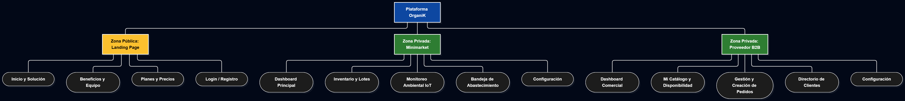

#### 4.2.1. Organization Systems

El sistema de organización de **OrganiK** define cómo se estructura y clasifica la información para que los usuarios interactúen con la plataforma sin fricciones. Se han aplicado los siguientes esquemas organizativos:
*   **Organización Visual y Estructural:**
    *   *Jerárquica:* Aplicada en la *Landing Page*, donde la información fluye de mayor a menor importancia.
    *   *Matricial:* Utilizada en los dashboards, permitiendo al usuario navegar entre diferentes dimensiones operativas (Inventario, Pedidos, IoT) sin un orden secuencial estricto.
*   **Esquemas de Categorización:**
    *   *Según Audiencia:* Separa la experiencia del *Administrador de Minimarket* (enfocada en control interno y compras) de la del *Proveedor B2B* (enfocada en ventas y despachos).
    *   *Cronológico:* Aplicado en los historiales de pedidos, registro de mermas y el log de alertas ambientales, ordenando los datos desde el evento más reciente al más antiguo.
    *   *Por Tópicos:* Utilizado para estructurar el catálogo y el inventario físico, facilitando la agrupación de lotes y productos.

#### 4.2.2. Labeling Systems

Para garantizar la comprensión inmediata en entornos operativos rápidos, el sistema de etiquetado se basa en el *Ubiquitous Language* del sector logístico:
*   **Etiquetas de Navegación:** Términos precisos de 1 a 2 palabras (Ej: *Inventario*, *Abastecimiento*, *Mi Catálogo*, *Mermas*).
*   **Etiquetas de Acción (Botones):** Utilizan verbos en infinitivo que indican el resultado de la acción alineados a los User Stories (Ej: *Generar Pedido*, *Aprobar Orden de Envío*, *Crear Orden*).
*   **Etiquetas de Estado:** Emplean un código de color universal respaldado por texto claro para el seguimiento (Ej: *Pendiente* [Amarillo], *Aprobado* [Verde], *Rechazado* [Rojo], *En Ruta* [Azul]).
*   **Apoyo Iconográfico:** Las etiquetas de navegación principal siempre están acompañadas de iconos estandarizados para acelerar el reconocimiento visual.

#### 4.2.3. SEO Tags and Meta Tags

Para asegurar el posicionamiento en motores de búsqueda y la correcta previsualización al compartir enlaces, se han configurado los siguientes metadatos:
*   **Landing Page (Pública):**
    *   `Title:` `<title>OrganiK | Gestión de Inventarios, Monitoreo IoT y Abastecimiento B2B</title>`
    *   `Meta Description:` `<meta name="description" content="Plataforma SaaS especializada en productos orgánicos. Conecta minimarkets y proveedores, controla inventarios, previene mermas con sensores IoT y gestiona pedidos B2B.">`
    *   `Meta Keywords:` `<meta name="keywords" content="minimarkets, productos orgánicos, abastecimiento B2B, control de inventario, monitoreo IoT, reducir mermas">`
*   **Web Application (Privada):** Dado que requiere autenticación, los motores de búsqueda no indexarán el contenido interno (`<meta name="robots" content="noindex, nofollow">`), protegiendo la privacidad operativa de los clientes. Se usan títulos dinámicos en la pestaña (Ej. `<title>Inventario - OrganiK</title>`).

#### 4.2.4. Searching Systems

Debido al alto volumen transaccional, OrganiK implementa un sistema de búsqueda robusto para reducir el tiempo de localización de datos:
*   **Búsqueda Global:** Ubicada en la cabecera del dashboard, permite realizar consultas mediante coincidencia de cadenas (ej. buscar por producto "Manzana" o ID de pedido "ORD-0012").
*   **Filtros Contextuales:** Menús desplegables en las tablas de datos para refinar resultados (ej. filtrar inventario por estado "Próximo a Vencer", o filtrar pedidos por "Proveedor").
*   **Presentación de Resultados:** Los datos se presentan en *Data Tables* ordenables y paginadas para no sobrecargar la vista.

#### 4.2.5. Navigation Systems

El sistema de navegación está estructurado para que los usuarios interactúen con la menor cantidad de clics posibles, adaptándose al comportamiento *Mobile-First*:
*   **Navegación Global (Landing Page):** *Sticky Top Navbar* con anclas (anchor links) a secciones clave y un botón *Call-to-Action* destacado ("Iniciar Sesión").
*   **Navegación Global (Web App):** *Sidebar* lateral izquierda colapsable en escritorio, y menú *Hamburguesa* en móviles para facilitar el uso en pantallas pequeñas.
*   **Navegación Local:** Pestañas (Tabs) dentro de un mismo módulo para separar sub-vistas (ej. Dentro del módulo "Inventario", pestañas separadas para *Stock Activo*, *Lotes* y *Mermas*).
*   **Navegación Suplementaria:** Ruta de migas de pan (Breadcrumbs) en la cabecera (ej. `OrganiK > Abastecimiento > Detalle Pedido ORD-0012`) que orienta al usuario y le permite retroceder niveles sin perder contexto.

### 4.3. Landing Page UI Design

En esta sección se presenta la propuesta de Interfaz de Usuario (UI) para la Landing Page de **OrganiK**. El diseño visual traduce las decisiones tomadas en la Arquitectura de la Información y las Guías de Estilo en una interfaz tangible orientada a la conversión. El objetivo principal de esta página pública es comunicar claramente la propuesta de valor integrada (gestión de inventarios, monitoreo IoT y abastecimiento B2B) y dirigir a los administradores de minimarkets y proveedores hacia el registro o inicio de sesión.

#### 4.3.1. Landing Page Wireframe

Los wireframes representan el esqueleto estructural de la página en baja fidelidad, desprovistos de color y tipografía final, para centrar el análisis en la usabilidad y la distribución del contenido.

**Explicación del Diseño y Arquitectura:**
*   **Estructura Visual:** Se ha optado por un diseño de bloque único (*Single-page layout*) que guía al usuario a través de un viaje lógico: Problema $\rightarrow$ Solución (Características de OrganiK) $\rightarrow$ Planes $\rightarrow$ Call to Action (CTA).
*   **Jerarquía de Información:** La sección *Hero* (cabecera principal) destaca la propuesta de valor central con botones de acción inmediata. A medida que se hace *scroll*, la información se desglosa en bloques asimétricos o de cuadrícula (grid) para explicar módulos específicos como el control de lotes y las alertas IoT.
*   **Diseño Inclusivo:** Para la versión *Mobile Web Browser*, el wireframe estructural apila los contenedores en una sola columna. Se ha proyectado que las áreas de interacción (botones de "Empezar" o "Conoce los planes") tengan un área táctil amplia (mínimo 44x44px) para evitar frustración motriz en dispositivos móviles.

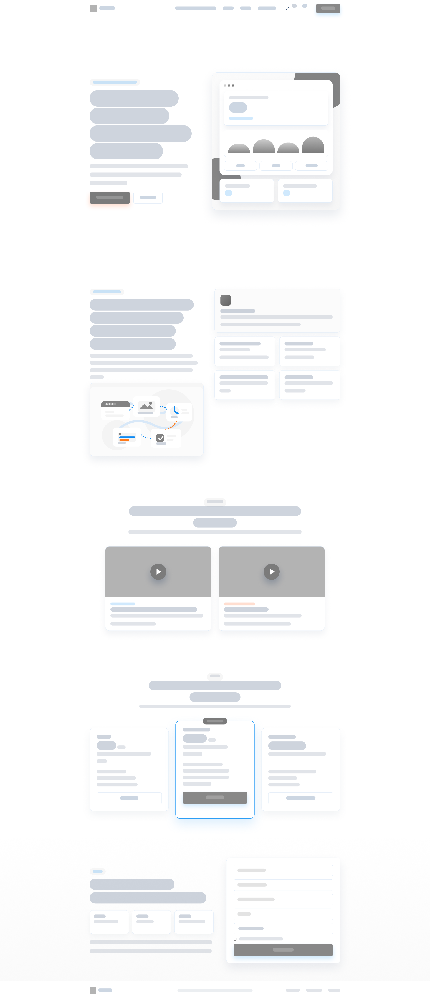

#### 4.3.2. Landing Page Mock-up

Los mock-ups representan el diseño final en alta fidelidad, integrando el *Design System* establecido para los productos digitales de OrganiK.

**Explicación de la Aplicación Visual y UI:**
*   **Aplicación de Style Guidelines:** El diseño final hace un uso extenso del espacio en blanco (White y Alice Blue) para transmitir una sensación de modernidad y limpieza, esencial en un software B2B. Los colores primarios (*Azure Radiance* y *Dodger Blue*) se reservan estratégicamente para los componentes interactivos principales (botones de Login/Registro y enlaces), atrayendo naturalmente la vista del usuario.
*   **Tipografía y Legibilidad:** Se aplica la fuente *Arimo* en su variante Bold para los encabezados principales (H1, H2), logrando un impacto rápido; mientras que los párrafos explicativos utilizan *Inter*, garantizando una legibilidad óptima incluso en las tarjetas descriptivas de los planes de suscripción.
*   **Consistencia de Interacción:** La barra de navegación superior (Navbar) se mantiene fija (*sticky*) durante el *scroll*, permitiendo que el usuario pueda acceder al botón de "Iniciar Sesión" en cualquier momento de su lectura, maximizando las oportunidades de conversión.
*   **Accesibilidad Visual:** Se ha verificado que el contraste entre los textos oscuros (Slate Gray/Boulder) y los fondos claros supere el ratio mínimo de 4.5:1 exigido por las normativas de accesibilidad web (WCAG), asegurando que cualquier usuario pueda leer la propuesta de valor sin esfuerzo visual.

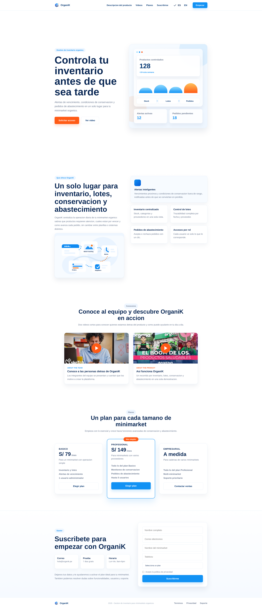

## 4.6. Domain-Driven Software Architecture

La arquitectura de software de OrganiK se construye a partir del análisis del dominio de gestión de productos orgánicos, inventario, conservación, abastecimiento y control operativo para minimarkets y proveedores. A partir de este análisis se aplican los principios de Domain-Driven Design (DDD), permitiendo dividir la solución en bounded contexts coherentes con las responsabilidades principales del negocio.

En las siguientes secciones se presenta cada nivel del modelo arquitectónico, explicando la estructura, responsabilidades y comunicación entre los elementos que conforman la arquitectura de OrganiK.

### 4.6.1. Design-Level Event Storming

Para identificar los eventos de dominio y la lógica de negocio de OrganiK, se realizó un proceso de Event Storming orientado a comprender los flujos principales de la plataforma: registro de productos, control de inventario, monitoreo de conservación, solicitudes de abastecimiento, gestión de proveedores, alertas y análisis operativo.

El desarrollo del proceso de Domain-Driven Design se realizó en Lucidchart: [https://lucid.app/lucidchart/122eaed5-7924-4498-b16c-62681427dde3/edit?viewport_loc=14%2C-6708%2C8686%2C7802%2C0_0&invitationId=inv_6c1afc67-fb30-4e78-9b16-eb7f89871df1](https://lucid.app/lucidchart/122eaed5-7924-4498-b16c-62681427dde3/edit?viewport_loc=14%2C-6708%2C8686%2C7802%2C0_0&invitationId=inv_6c1afc67-fb30-4e78-9b16-eb7f89871df1)

A continuación, se presentan la leyenda utilizada y las relaciones clave entre los bounded contexts identificados:

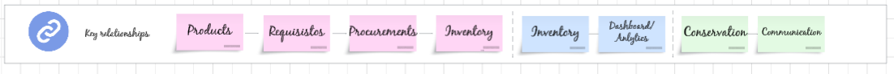

A partir de este análisis se identificaron los siguientes bounded contexts:

1. **IAM**

   El bounded context IAM se encarga de la autenticación, autorización y control de acceso dentro de OrganiK. Gestiona usuarios, roles y permisos, asegurando que cada actor, como el administrador de minimarket o el proveedor, acceda únicamente a las funcionalidades correspondientes a su perfil.

   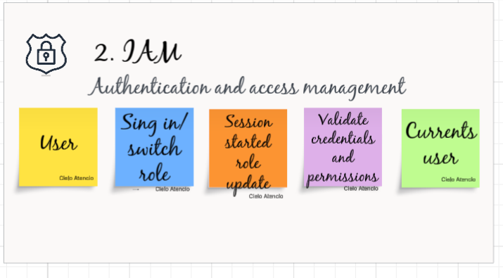

2. **Profiles**

   El bounded context Profiles administra la información de los usuarios, minimarkets y proveedores registrados en la plataforma. Su propósito es centralizar los datos de perfil necesarios para personalizar la experiencia, controlar responsabilidades y asociar operaciones con el actor correspondiente.

   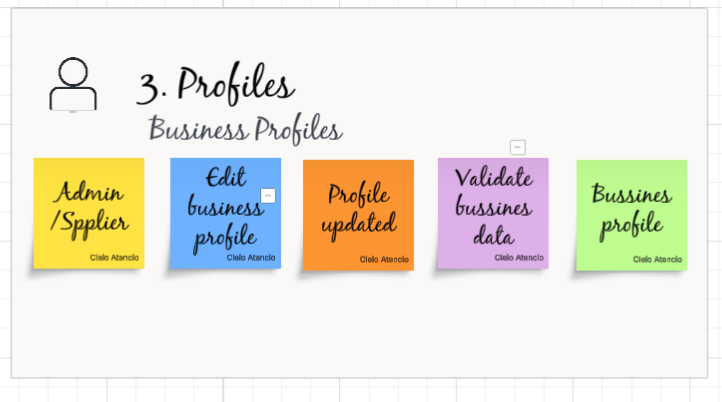

3. **Dashboard**

   El bounded context Dashboard presenta una vista general del estado operativo de la plataforma según el rol del usuario. Permite visualizar indicadores relevantes sobre inventario, abastecimiento, conservación, alertas y actividad reciente.

   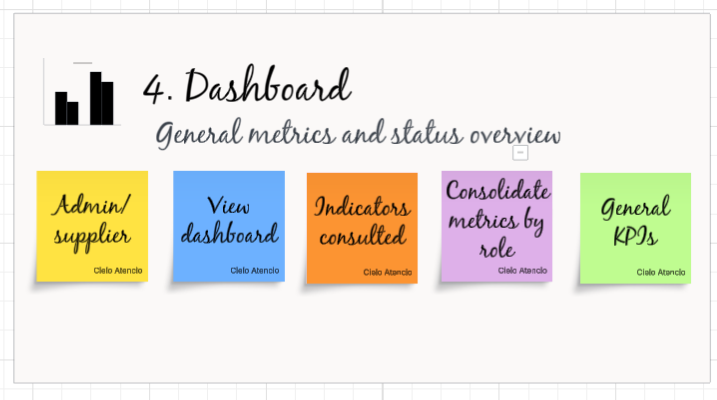

4. **Analytics**

   El bounded context Analytics procesa información operativa para generar indicadores, métricas y resúmenes que apoyan la toma de decisiones. Permite analizar el estado del inventario, productos próximos a vencer, alertas de conservación, desempeño de proveedores y movimientos de abastecimiento.

   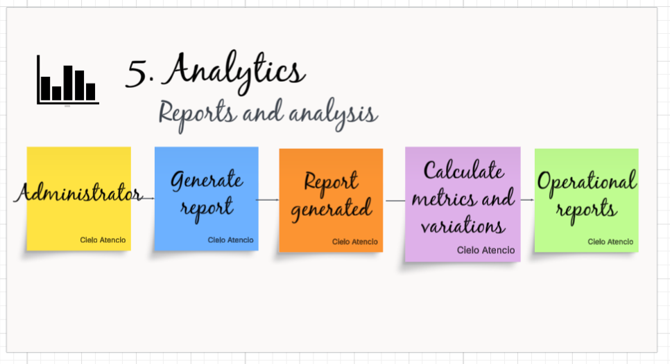

5. **Inventory**

   El bounded context Inventory gestiona los productos registrados en el minimarket, sus cantidades, lotes, fechas de vencimiento, estados y movimientos asociados. Su propósito es mantener trazabilidad sobre las existencias y facilitar el control de productos disponibles, en riesgo o con pérdidas.

   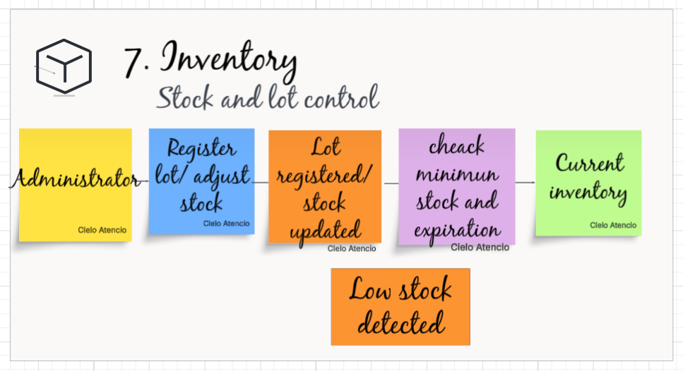

6. **Products**

   El bounded context Products administra el catálogo de productos orgánicos ofrecidos por proveedores o registrados por minimarkets. Centraliza información como nombre, categoría, descripción, unidad de medida, disponibilidad y datos relevantes para su comercialización o abastecimiento.

   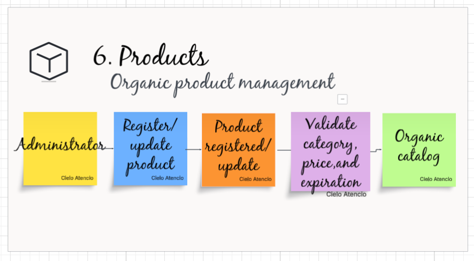

7. **Requisition**

   El bounded context Requisition gestiona las solicitudes de abastecimiento generadas por los minimarkets hacia los proveedores. Permite registrar productos solicitados, cantidades, estado de la solicitud y trazabilidad del proceso de aceptación o rechazo.

   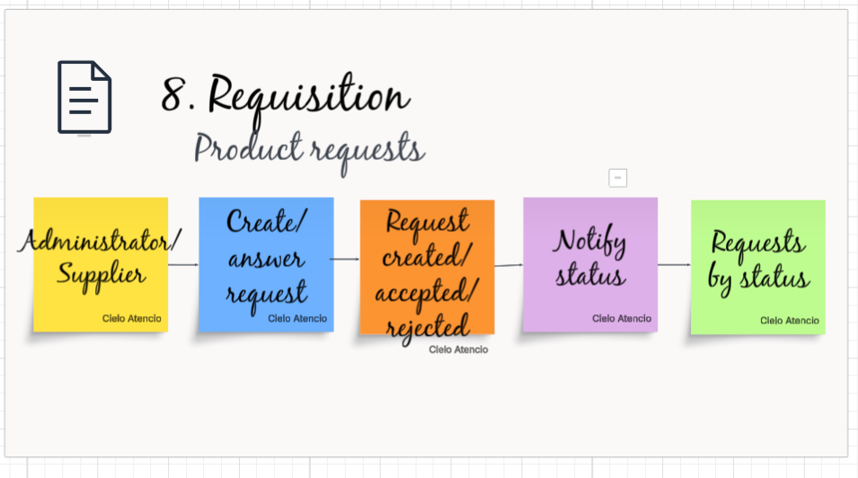

8. **Procurements**

   El bounded context Procurements administra las órdenes de envío o abastecimiento asociadas a solicitudes aceptadas. Su responsabilidad es permitir al proveedor registrar los productos que serán enviados y al minimarket confirmar o rechazar la recepción.

   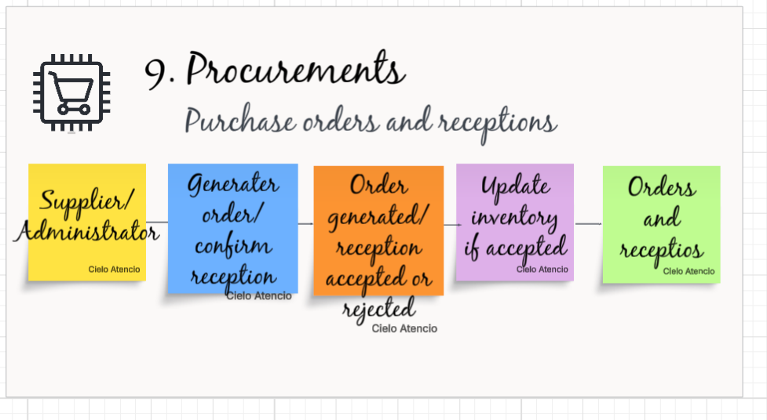

9. **Suppliers**

   El bounded context Suppliers gestiona el directorio de proveedores de productos orgánicos, así como los productos que ofrecen y su participación dentro de los procesos de abastecimiento.

   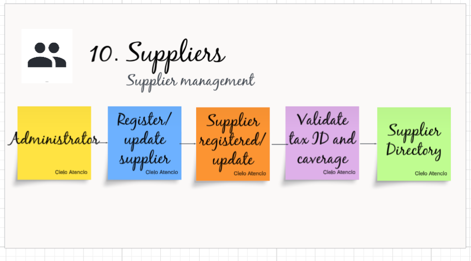

10. **Conservation**

   El bounded context Conservation permite monitorear condiciones de conservación de productos, como temperatura y humedad. Su propósito es identificar riesgos de deterioro y generar alertas cuando las condiciones se encuentren fuera de los rangos aceptables.

11. **Communication**

   El bounded context Communication gestiona las alertas y notificaciones generadas por la plataforma. Incluye avisos sobre productos próximos a vencer, condiciones de conservación riesgosas, solicitudes pendientes, órdenes de envío y eventos relevantes para los usuarios.

12. **Shared Kernel**

   El bounded context Shared Kernel contiene elementos comunes utilizados por los demás contextos, como utilidades compartidas, contratos base, configuraciones, validaciones comunes y estructuras transversales del sistema.

   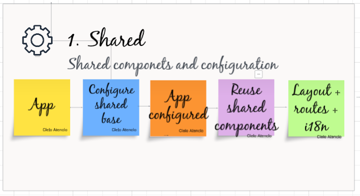

### 4.6.2. Software Architecture Context Diagram

En este nivel se presenta una vista de alto nivel de la arquitectura, donde el foco está en el sistema OrganiK como una caja negra y en las interacciones que mantiene con sus usuarios y servicios externos.

El context diagram muestra al **OrganiK Software System** como el sistema central, rodeado por los principales actores y sistemas con los que interactúa:

- **Administrador de minimarket**: usuario encargado de registrar productos, controlar inventario, gestionar lotes, revisar fechas de vencimiento, crear solicitudes de abastecimiento y confirmar la recepción de órdenes de envío.
- **Proveedor de productos orgánicos**: usuario responsable de registrar productos ofrecidos, revisar solicitudes de abastecimiento, aceptarlas o rechazarlas, y crear órdenes de envío.
- **Administrador del sistema**: usuario encargado de gestionar cuentas, roles, permisos y configuración general de la plataforma.
- **Servicio de notificaciones**: sistema externo utilizado para enviar alertas y comunicaciones relacionadas con vencimientos, conservación, solicitudes y abastecimiento.
- **Servicio de monitoreo de conservación**: fuente externa o módulo de integración encargado de proporcionar información relacionada con temperatura y humedad para evaluar condiciones de conservación.

En el diagrama se representan las relaciones entre estos elementos, destacando que los actores humanos interactúan con OrganiK mediante la aplicación web, mientras que el sistema coordina los procesos internos y las integraciones necesarias para alertas, monitoreo y trazabilidad operativa.

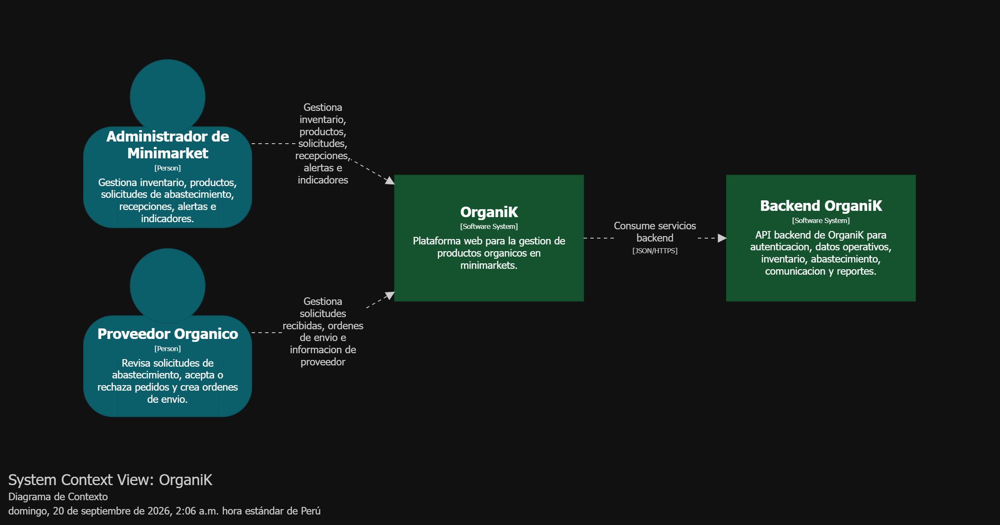

---

### 4.6.3. Software Architecture Container Diagrams

En el nivel de contenedores, la arquitectura de OrganiK se organiza en aplicaciones y fuentes de datos que colaboran para brindar la experiencia completa de la plataforma.

La arquitectura lógica de OrganiK se estructura en los siguientes contenedores:

- **Landing Page**: aplicación web pública orientada a presentar la propuesta de valor de OrganiK, sus beneficios y funcionalidades principales para minimarkets y proveedores de productos orgánicos.
- **Single Page Application (SPA)**: aplicación web principal desarrollada en Angular, donde los usuarios interactúan con los módulos de inventario, productos, proveedores, solicitudes, órdenes de envío, conservación, analítica, dashboard, perfiles, comunicación e IAM.
- **API REST Application**: backend encargado de exponer los servicios de negocio mediante endpoints REST. Centraliza la lógica de aplicación, validaciones, reglas de dominio y coordinación entre bounded contexts.
- **Database**: base de datos donde se persiste la información del sistema, incluyendo usuarios, perfiles, productos, inventario, lotes, solicitudes, órdenes de abastecimiento, proveedores, alertas, métricas y registros de conservación.

En el diagrama se observa que:

- Los usuarios pueden conocer la solución mediante la **Landing Page** y luego acceder a la **SPA**.
- La **SPA** se comunica con la **API REST Application** mediante peticiones HTTP/HTTPS y mensajes JSON.
- La **API REST Application** procesa la lógica del dominio y persiste la información en la **Database**.
- Los módulos de comunicación y conservación pueden integrarse con servicios externos para notificaciones y monitoreo de condiciones ambientales.

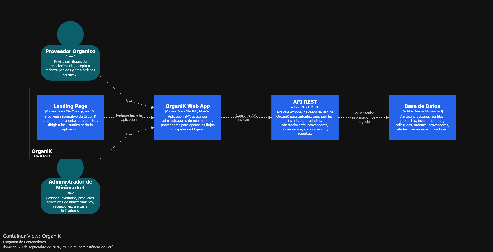

---

### 4.6.4. Software Architecture Components Diagrams

En el nivel de componentes se detalla la descomposición interna de la arquitectura de OrganiK, especialmente del contenedor **API REST Application**, donde se agrupan los componentes principales alineados con los bounded contexts del dominio.

La API REST organiza sus responsabilidades en componentes especializados:

- **IAM Component**: gestiona autenticación, autorización, usuarios, roles y permisos.
- **Profiles Component**: administra perfiles de usuarios, minimarkets y proveedores.
- **Dashboard Component**: consolida información relevante para mostrar vistas generales según el rol del usuario.
- **Analytics Component**: procesa indicadores, métricas y reportes operativos.
- **Inventory Component**: gestiona inventario, lotes, cantidades, vencimientos, pérdidas y ofertas.
- **Products Component**: administra el catálogo de productos orgánicos registrados u ofrecidos.
- **Requisition Component**: gestiona solicitudes de abastecimiento entre minimarkets y proveedores.
- **Procurements Component**: administra órdenes de envío, aceptación, rechazo y recepción de productos.
- **Suppliers Component**: gestiona proveedores y sus productos ofrecidos.
- **Conservation Component**: monitorea condiciones de conservación y detecta riesgos.
- **Communication Component**: administra alertas y notificaciones del sistema.
- **Shared Kernel Component**: agrupa elementos transversales reutilizados por los demás componentes.

#### API REST Component Diagram

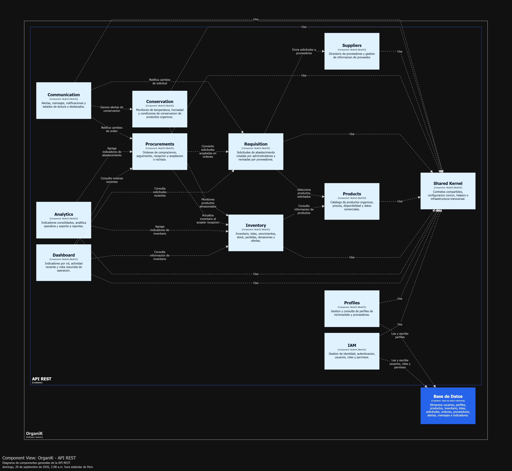

#### IAM Component Diagram

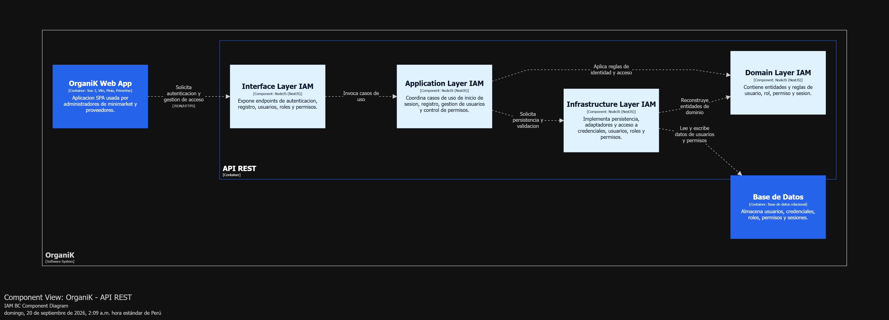

#### Profiles Component Diagram

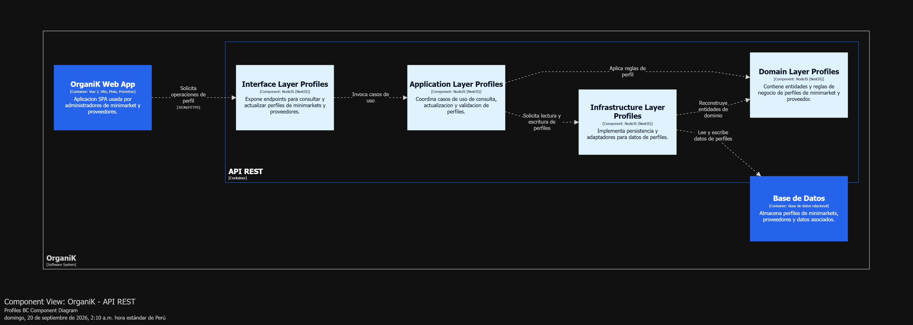

#### Dashboard Component Diagram

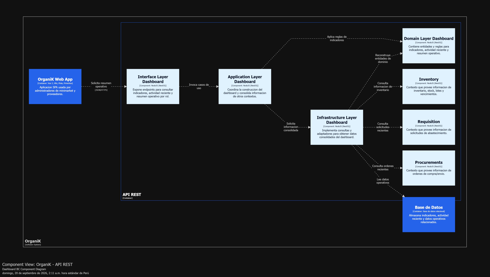

#### Analytics Component Diagram

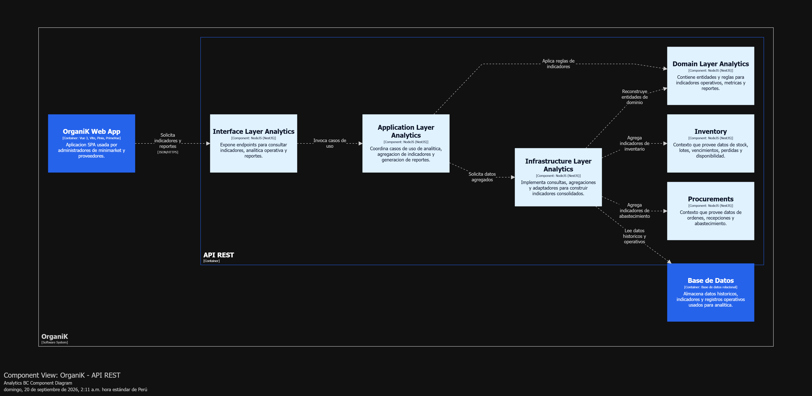

#### Inventory Component Diagram

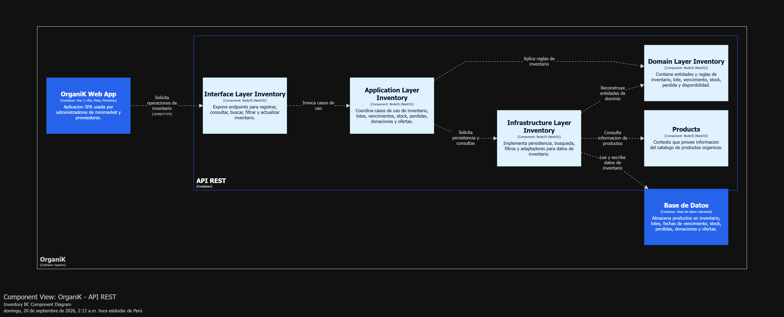

#### Products Component Diagram

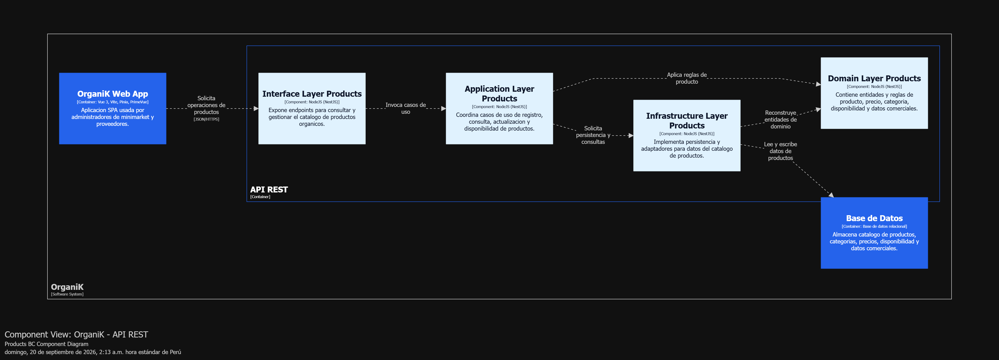

#### Requisition Component Diagram

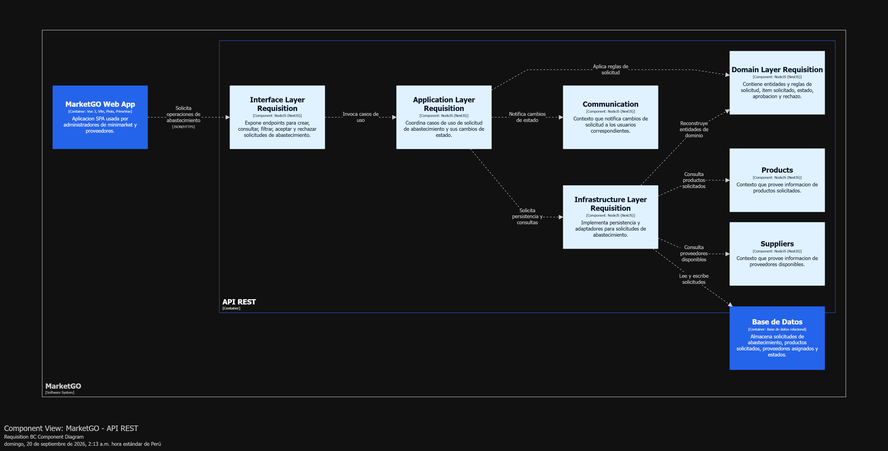

#### Procurements Component Diagram

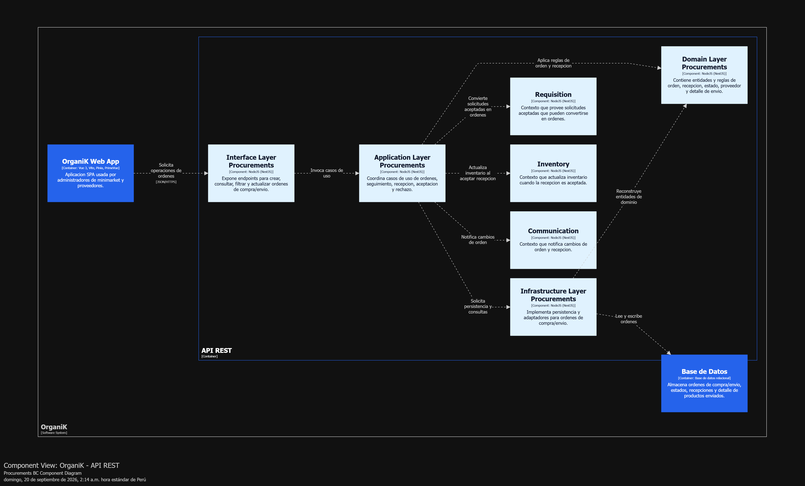

#### Suppliers Component Diagram

#### Conservation Component Diagram

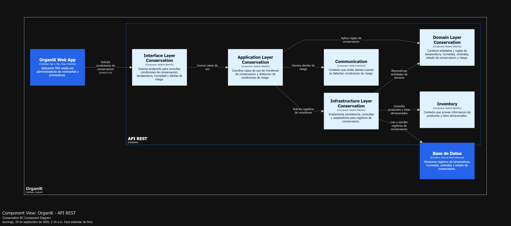

#### Communication Component Diagram

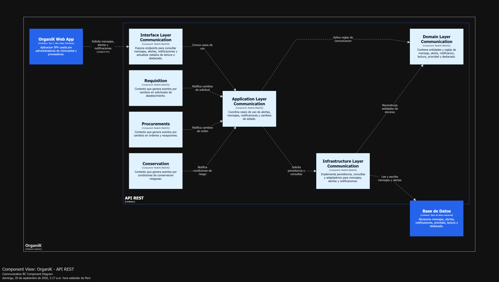

#### Shared Kernel Component Diagram

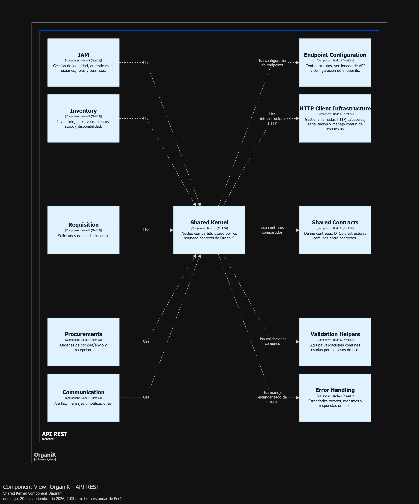

De esta forma, los component diagrams complementan la visión general de la arquitectura, mostrando cómo OrganiK organiza sus responsabilidades internas en componentes coherentes con el dominio y cómo estos colaboran para implementar la gestión de productos orgánicos, inventario, conservación, abastecimiento, proveedores, comunicación y analítica.

## 4.7. Software Object-Oriented Design

En esta sección se presenta el diseño orientado a objetos de OrganiK, representando la estructura de clases principales del sistema y su organización por bounded contexts. Estos diagramas permiten visualizar las responsabilidades de cada clase, sus atributos, métodos y relaciones dentro de la arquitectura de la aplicación.

### 4.7.7. Class Diagrams

Los diagramas de clases muestran la organización interna de los componentes principales de OrganiK, siguiendo una estructura alineada con los bounded contexts definidos previamente. Cada diagrama representa las clases más relevantes dentro de un módulo específico, permitiendo comprender cómo se modelan los conceptos del dominio y cómo se relacionan con la lógica de aplicación.

A continuación, se presenta el diagrama general de clases del sistema:

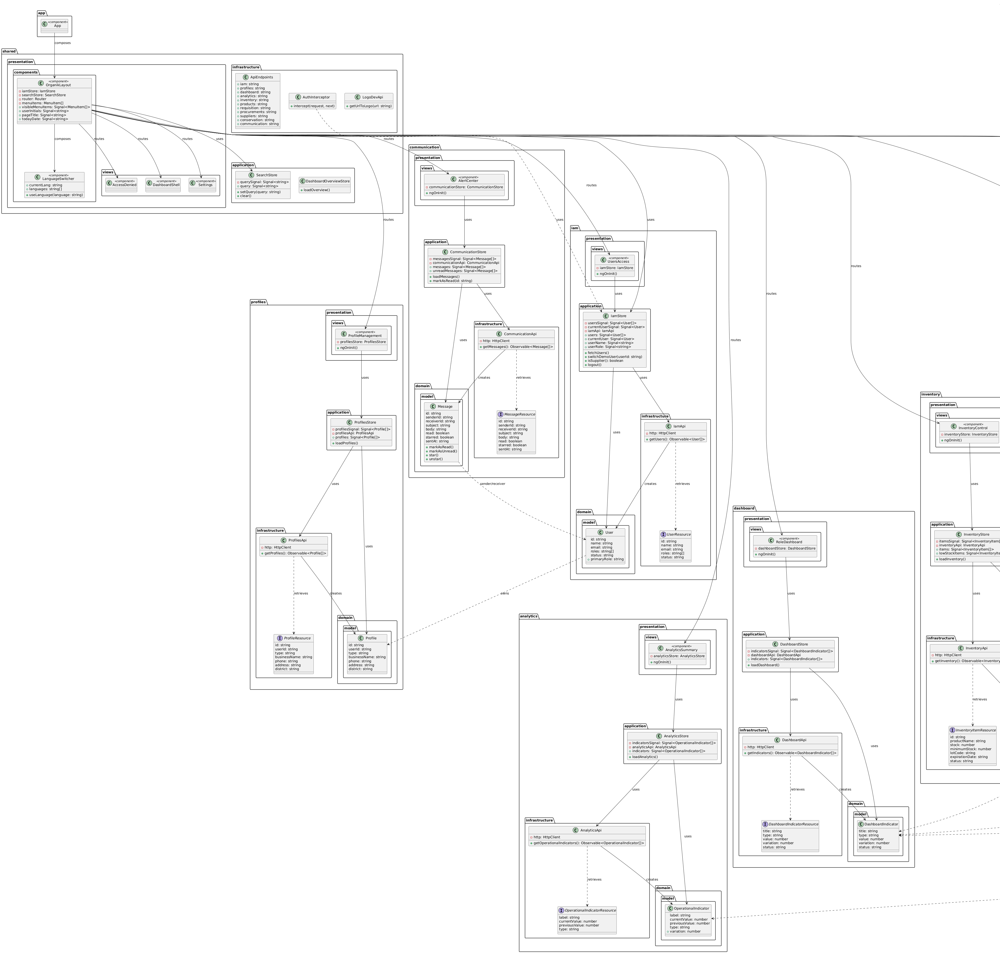

Además, se presentan los diagramas de clases correspondientes a los principales bounded contexts de OrganiK:

#### Profiles Class Diagram

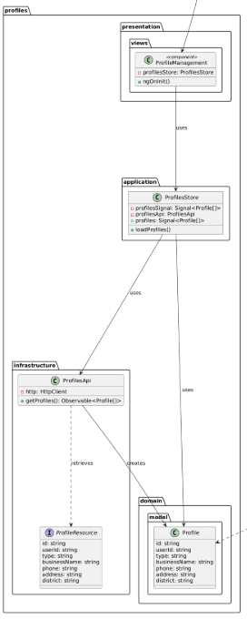

#### Communication Class Diagram

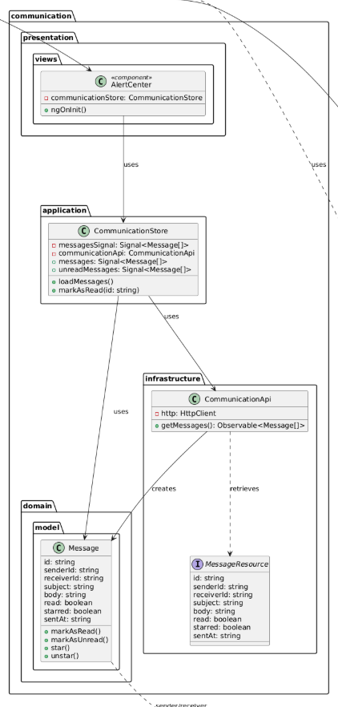

#### Conservation Class Diagram

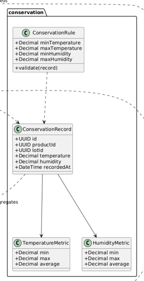

#### Analytics Class Diagram

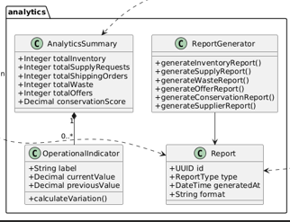

#### Dashboard Class Diagram

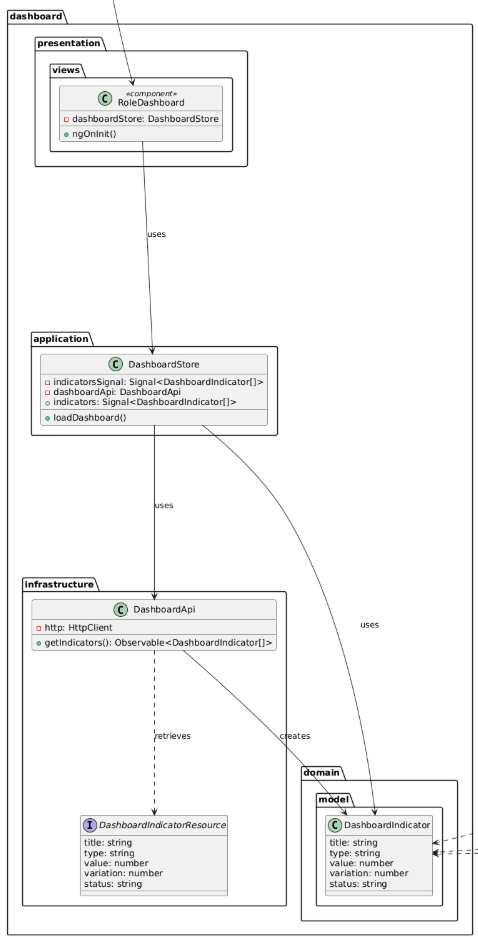

#### IAM Class Diagram

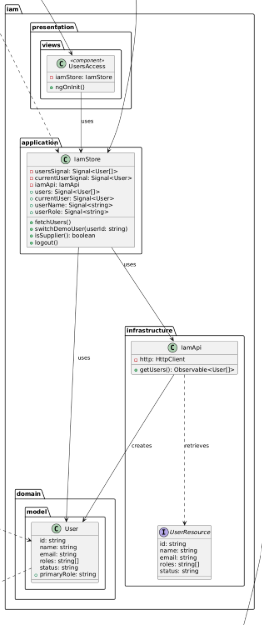

#### Shared Class Diagram

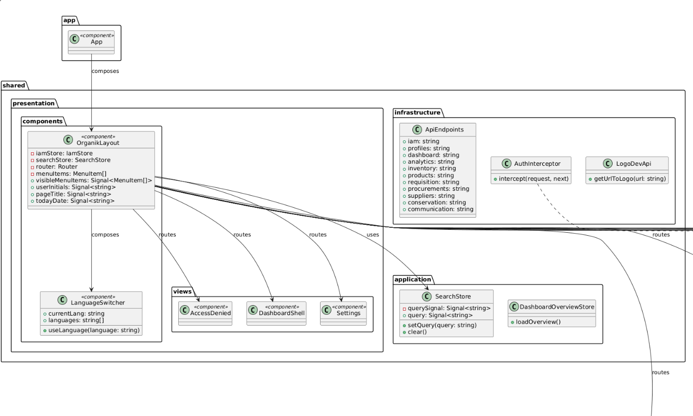

Estos diagramas permiten complementar la arquitectura de software, mostrando una vista más detallada del diseño orientado a objetos de OrganiK. A través de ellos se puede identificar cómo se distribuyen las responsabilidades entre entidades, servicios, componentes de presentación, stores de aplicación e infraestructura.

---

## 4.8. Database Design

El diseño de base de datos de OrganiK define la estructura de persistencia necesaria para almacenar y gestionar la información principal de la plataforma. Este diseño considera los datos relacionados con usuarios, perfiles, productos, inventario, proveedores, solicitudes de abastecimiento, órdenes de envío, conservación, comunicación, analítica y auditoría.

La base de datos se encuentra organizada de acuerdo con los bounded contexts definidos en la arquitectura del sistema, permitiendo mantener una separación lógica entre las distintas áreas funcionales. Esta organización facilita la trazabilidad de la información, la consistencia de los datos y la evolución del sistema conforme se incorporen nuevas funcionalidades.

# 4.8.1. Database Diagrams

El diagrama de base de datos muestra las entidades principales de OrganiK, sus atributos, claves primarias, claves foráneas y relaciones. Esta vista permite comprender cómo se almacena la información del sistema y cómo se conectan los distintos procesos de negocio a nivel de persistencia.

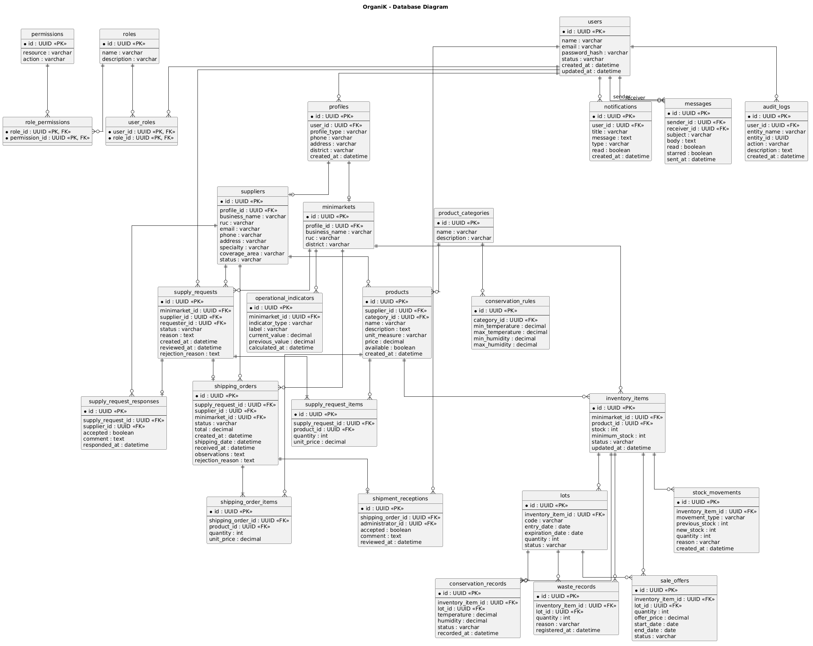

