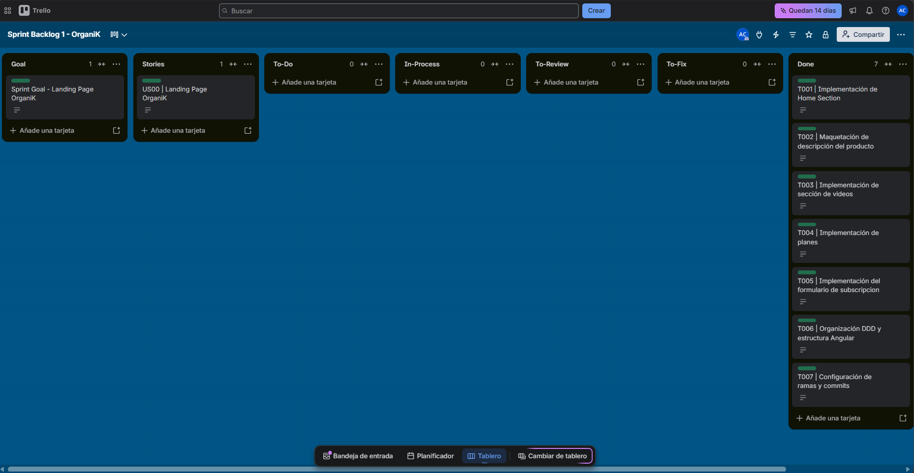
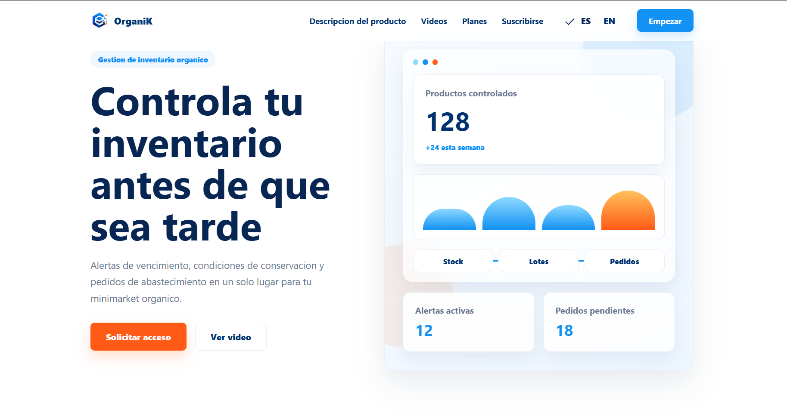
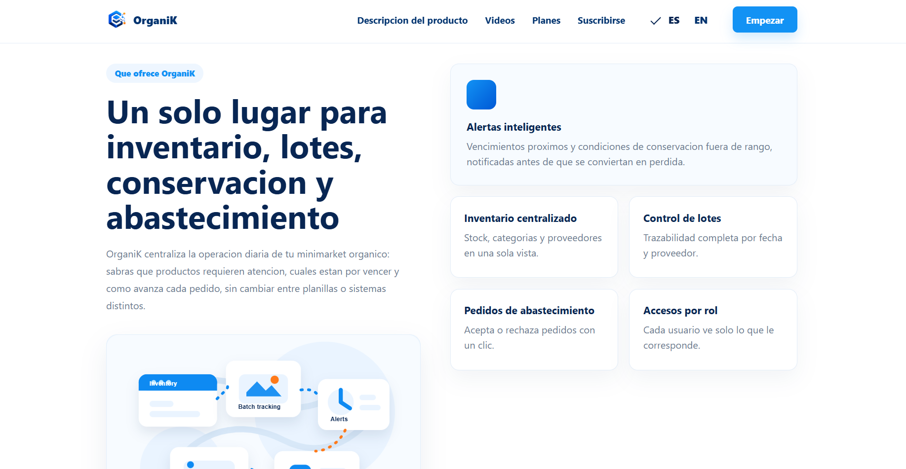
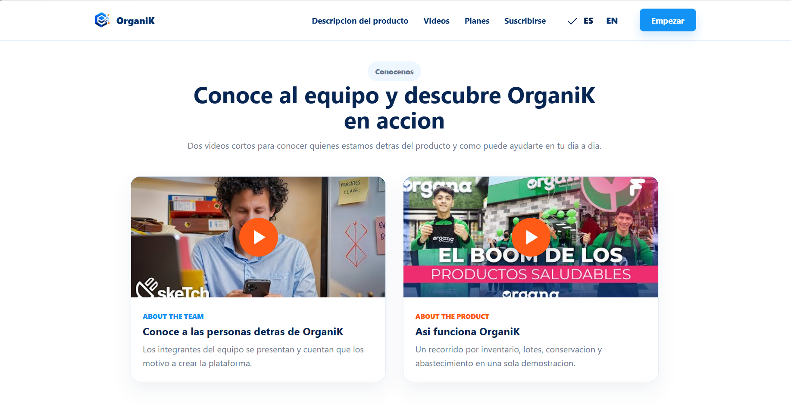
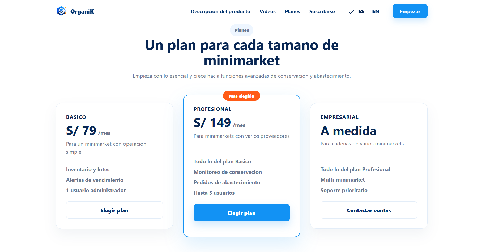
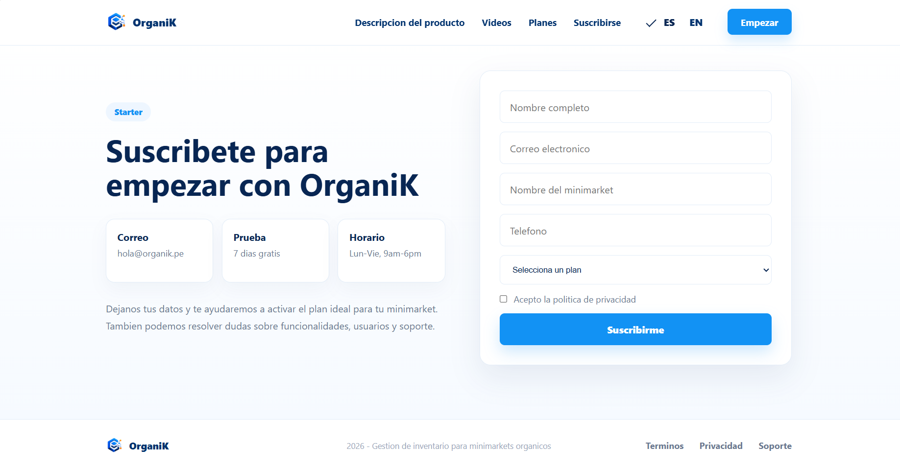
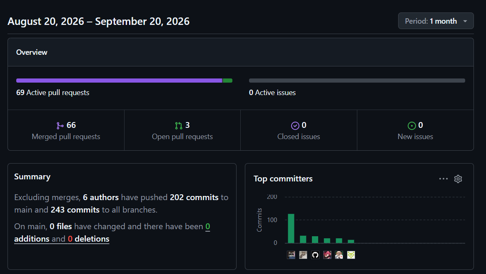
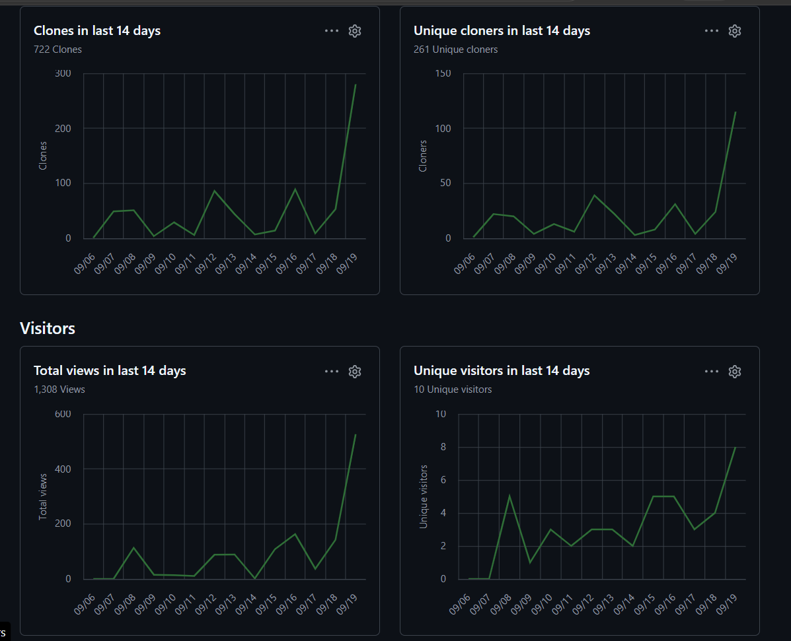

# Capítulo V: Product Implementation, Validation & Deployment

## 5.1. Software Configuration Management

En esta sección se describen las decisiones, convenciones y principios adoptados por el equipo de **OrganiK** para garantizar la coherencia, trazabilidad y control de versiones durante el ciclo de vida del desarrollo de la solución **OrganiK**. Se establecen los lineamientos para la configuración del entorno de desarrollo, la gestión del código fuente, las convenciones de estilo y la configuración de despliegue de la landing page.

### 5.1.1. Software Development Environment Configuration

Se especifican los productos de software utilizados durante el ciclo de vida del proyecto, organizados por disciplinas técnicas para asegurar la estandarización del entorno entre los desarrolladores de **OrganiK**.

#### Project Management

* **Trello:** Empleado para la organización visual del flujo de trabajo diario, priorización de tareas y seguimiento del avance de las secciones de la landing page.
  * **Ruta:** `https://trello.com/invite/b/6aaf94c8244f819349bf0de9/ATTI96869889ee148c22847a13480770254571767922/sprint-backlog-1-organik`

#### Product UX/UI Design

1. **Miro:** Pizarra colaborativa utilizada para organizar ideas, flujos de usuario y estructura general de la landing page.
2. **Figma:** Herramienta principal para el diseño visual, definición de secciones, jerarquía de contenido, componentes UI y propuesta responsive.
3. **Structurizr:** Utilizado para apoyar el modelado de arquitectura mediante diagramas de alto nivel cuando sea necesario.

#### Software Development

1. **GitHub:** Hosting del repositorio de código fuente. Se aplica control de versiones mediante Git y commits bajo la convención **Conventional Commits**.
2. **WebStorm:** IDE utilizado para el desarrollo frontend de la landing page.
3. **Angular 22:** Framework utilizado para construir la landing page de **OrganiK** mediante componentes standalone.
4. **TypeScript:** Lenguaje principal para la implementación de componentes, configuración de la aplicación y lógica de presentación.
5. **Angular Material:** Librería utilizada para componentes de interfaz, como el selector de idioma.
6. **@ngx-translate:** Librería utilizada para la internacionalización de la landing page en español e inglés.
7. **HTML/CSS:** Tecnologías utilizadas para la maquetación, estructura visual y estilos responsivos.

#### Software Testing

* **Vitest / Angular Test Runner:** Utilizado para validar la creación de la aplicación, renderizado de secciones principales y pruebas unitarias básicas.
* **Criterios de aceptación:** Definidos según la correcta visualización de las secciones Home, Product Information, Videos, Pricing y Starter.

#### Software Documentation

* **Markdown:** Utilizado para documentar el proyecto, la configuración, evidencias de sprint y decisiones técnicas.
* **README.md:** Documento principal del repositorio para describir instalación, ejecución y estructura del proyecto.

---

### 5.1.2. Source Code Management

Se establecen los repositorios oficiales de la solución **OrganiK** para garantizar la integridad del código fuente.

#### Repositorios del Proyecto

<table>
  <thead>
    <tr>
      <th>Producto</th>
      <th>URL del Repositorio</th>
    </tr>
  </thead>
  <tbody>
    <tr>
      <td>Project Report OrganiK</td>
      <td><a href="https://github.com/5Bits-OrganiK/project-report.git">https://github.com/OrganiK/organik-report</a></td>
    </tr>
    <tr>
      <td>Landing Page OrganiK</td>
      <td><a href="https://github.com/5Bits-OrganiK/organik-landingpage.git">https://github.com/OrganiK/organik-landingpage</a></td>
    </tr>
    <tr>
      <td>Frontend Web Application OrganiK</td>
      <td><a href="https://github.com/5Bits-OrganiK/organik-frontend.git">https://github.com/OrganiK/organik-frontend</a></td>
    </tr>
    <tr>
      <td>Backend Web Services OrganiK</td>
      <td><a href="https://github.com/5Bits-OrganiK/organik-backend.git">https://github.com/OrganiK/organik-backend</a></td>
    </tr>
  </tbody>
</table>

#### GitFlow Workflow and Collaboration Strategy

Para asegurar una colaboración organizada, evitar conflictos en el código y mantener una integración continua clara, el equipo de **OrganiK** aplica una estrategia basada en ramas para el desarrollo de la landing page.

La estrategia de colaboración se define de la siguiente manera:

- **main:** Rama que contiene la versión estable y lista para producción de la landing page. Solo recibe integraciones finales cuando los cambios han sido revisados, probados y aprobados.

- **develop:** Rama principal de integración. En esta rama se unifican las funcionalidades terminadas antes de ser promovidas a `main`.

- **feature/<section>:** Ramas temporales creadas a partir de `develop` para aislar el desarrollo de cada sección o mejora de la landing page.

  Ejemplos:
  - `feature/home-section`
  - `feature/product-information-section`
  - `feature/video-section`
  - `feature/pricing-section`
  - `feature/starter-section`

- **hotfix/<issue>:** Ramas creadas desde `main` para corregir errores críticos detectados en la versión estable de la landing page.

El flujo de trabajo establece que cada rama `feature` debe integrarse mediante **Pull Request (PR)**, permitiendo revisión de código antes de aprobar la integración.

Cada commit debe seguir la convención de **Conventional Commits**, permitiendo una trazabilidad clara de los cambios realizados en el proyecto.

Ejemplos:

- `feat(landing): build organik landing page`
- `fix(app): enable zoneless change detection`
- `fix(videos): update team embed url`
- `fix(videos): show youtube previews`
- `fix(brand): align assets with organik name`
- `refactor(app): move landing features to app root`

---

### 5.1.3. Source Code Style Guide & Conventions

En esta sección se establecen las convenciones de estilo y nomenclatura adoptadas para los lenguajes utilizados en el proyecto **OrganiK**: HTML, CSS, TypeScript y Angular. Se aplica nomenclatura en inglés para los elementos del código, manteniendo coherencia con el dominio de la landing page y la plataforma.

#### Referencias de Guías de Estilo Adoptadas

| Lenguaje/Tecnología | Guía de Estilo |
| :--- | :--- |
| HTML/CSS | [Google HTML/CSS Style Guide](https://google.github.io/styleguide/htmlcssguide.html) |
| TypeScript | [Google TypeScript Style Guide](https://google.github.io/styleguide/tsguide.html) |
| Angular | [Angular Style Guide](https://angular.dev/style-guide) |
| Conventional Commits | [Conventional Commits](https://www.conventionalcommits.org/) |

Se utiliza nomenclatura en inglés relacionada con las entidades del dominio de la landing page y la plataforma **OrganiK**, manteniendo nombres claros, consistentes y alineados al producto.

| Elemento | Convención | Ejemplo |
| :--- | :--- | :--- |
| Componentes Angular | PascalCase | `HomeSection`, `PricingSection` |
| Archivos de componentes | kebab-case | `home-section.ts`, `pricing-section.ts` |
| Archivos de estilos CSS | kebab-case | `home-section.css`, `pricing-section.css` |
| Variables / Métodos TS | camelCase | `currentLang`, `useLanguage()` |
| Constantes | SCREAMING_SNAKE_CASE | `DEFAULT_LOCALE`, `STARTER_EMAIL` |
| Rutas / IDs de secciones | kebab-case | `product-information`, `starter` |
| Claves de i18n | camelCase / dot.case | `home.title`, `pricing.plans.basic.name` |
| Ramas Git feature | kebab-case | `feature/home-section`, `feature/starter-section` |
| Commits | Conventional Commits | `feat(landing): build organik landing page` |

#### Sangría y Formato

* Se aplica una indentación de dos espacios para archivos web: HTML, CSS y TypeScript.
* Las llaves de apertura en TS/JS se colocan en la misma línea, siguiendo el estilo K&R.
* Los nombres de carpetas y archivos se mantienen en `kebab-case`.
* La estructura de features se organiza directamente dentro de `src/app`.

---

### 5.1.4. Software Deployment Configuration

Se especifica la configuración de despliegue para la landing page de **OrganiK**, garantizando disponibilidad para usuarios interesados en conocer la propuesta de valor del producto.

#### Landing Page

La landing page puede desplegarse como sitio estático mediante servicios como Azure Static Web Apps, Vercel, Netlify o GitHub Pages.

* **Entorno local:** `http://127.0.0.1:4200/`
* **URL de producción:** `https://witty-pebble-068250b10.2.azurestaticapps.net`

---

## 5.2. Landing Page, Services & Applications Implementation

### 5.2.1. Sprint 1

| **Sprint Planning Sprint 1** |  |
|---|---|
| **Sprint Planning Background** |  |
| Date | 05/04/2026 |
| Time | 10:00 p.m. |
| Location | Discord / WhatsApp |
| Prepared By | Albino Florencio Cáceres Pizarro |
| Attendees | Albino Florencio Cáceres Pizarro Matias Daniel Huaranga Romero Winnie Lisbeth Merino Ordinola Andre Sebastian Quispe Almonacid Alexis Calin Torres Huaman |
| **Sprint Goal & User Stories** |  |
| **Sprint 1 Goal** | Our focus is on delivering the first marketing landing page of **OrganiK**, a product that clearly communicates the value proposition regarding inventory management, batch tracking, product conservation alerts, and supplier-minimarket coordination.  We believe it delivers a clear, professional first impression for minimarket owners, administrators, and organic product providers, helping them understand how **OrganiK** centralizes daily inventory operations and improves operational traceability.  This will be confirmed when users can navigate through all core sections of the landing page, including Home, Product Description, Videos, Plans, and Starter, and can seamlessly subscribe or request more information about the product. |
| Sprint 1 Velocity | 14 Story Points |

  <strong>Repositorio:</strong>
  <a href="https://github.com/5Bits-OrganiK/organik-landingpage.git">
   https://github.com/5Bits-OrganiK/organik-landingpage.git
  </a>

---

#### 5.2.1.2. Aspect Leaders and Collaborators

Esta matriz <strong>LACX</strong> identifica los aspectos principales del sprint y asigna responsabilidades de Líder (L) y Colaborador (C) para organizar al equipo durante el desarrollo de la landing page de <strong>OrganiK</strong>. 
<strong>Albino Florencio Cáceres Pizarro</strong>, como líder del equipo, supervisa y coordina los principales aspectos del desarrollo, mientras que los demás integrantes participan como colaboradores en las diferentes actividades del sprint.

<table border="1" cellpadding="4" cellspacing="0" align="center">
  <thead>
    <tr>
      <th>Team Member</th>
      <th>Student Code</th>
      <th>Aspect: UI/UX & Visual Design</th>
      <th>Aspect: Angular Structure & Components</th>
      <th>Aspect: Content & i18n</th>
      <th>Aspect: GitFlow & Deployment</th>
    </tr>
  </thead>
  <tbody>
    <tr>
      <td>Atencio Cristobal, Cielo Valentina</td>
      <td>U202424216</td>
      <td>C</td>
      <td>C</td>
      <td>C</td>
      <td>C</td>
    </tr>
    <tr>
      <td>Cáceres Pizarro, Albino Florencio</td>
      <td>U201923820</td>
      <td>L</td>
      <td>L</td>
      <td>L</td>
      <td>L</td>
    </tr>
    <tr>
      <td>Olivares Lao, Gustavo Alonso</td>
      <td>U202216448</td>
      <td>C</td>
      <td>C</td>
      <td>C</td>
      <td>C</td>
    </tr>
    <tr>
      <td>Quispe Almonacid, Andre Sebastian</td>
      <td>U201815005</td>
      <td>C</td>
      <td>C</td>
      <td>C</td>
      <td>C</td>
    </tr>
    <tr>
      <td>Torres Huaman, Alexis Calin</td>
      <td>U20241G152</td>
      <td>C</td>
      <td>C</td>
      <td>C</td>
      <td>C</td>
    </tr>
  </tbody>
</table>

---

### 5.2.1.3. Sprint Backlog 1

El Sprint Backlog agrupa las tareas iniciales correspondientes al diseño, desarrollo y documentación de la landing page de **OrganiK**, producto orientado a la gestión de inventario, lotes, conservación y abastecimiento de productos orgánicos para minimarkets.

  
  
<em>Figura: Tablero del Sprint 1 en Jira Software o herramienta de gestión del proyecto OrganiK.</em>

| User Story Id | Title | Task Id | Title | Description | Estimation (Hours) | Assigned To | Status |
| :--- | :--- | :--- | :--- | :--- | :--- | :--- | :--- |
| **US00** | Landing Page Base | T001 | Implementación de Home Section | Desarrollo de la sección principal de la landing page en Angular, presentando la propuesta de valor de OrganiK para minimarkets orgánicos. | 4h | Cáceres Pizarro, Albino Florencio | Done |
| **US00** | Product Information | T002 | Maquetación de descripción del producto | Implementación de la sección informativa sobre inventario, lotes, alertas de conservación, pedidos y accesos por rol. | 4h | Atencio Cristobal,Cielo Valentina | Done |
| **US00** | Videos Section | T003 | Implementación de sección de videos | Desarrollo del apartado visual para presentar al equipo y mostrar el funcionamiento general de OrganiK mediante videos embebidos. | 3h |Olivares Lao, Gustavo Alonso | Done |
| **US00** | Pricing Section | T004 | Implementación de planes | Maquetación de los planes Básico, Profesional y Empresarial, incluyendo precios, beneficios y llamadas a la acción. | 3h | Quispe Almonacid, Andre Sebastian | Done |
| **US00** | Starter Section | T005 | Implementación de sección de suscripción | Desarrollo de la sección Starter/Suscribirse con formulario para que los minimarkets interesados puedan iniciar el proceso de adopción de OrganiK. | 4h | Torres Huaman, Alexis Calin | Done |
| **US00** | Landing Page Architecture | T006 | Organización por features y estructura Angular | Refactorización de carpetas siguiendo una arquitectura organizada por features dentro de `src/app`, separando componentes, estilos, assets e internacionalización. | 5h | Cáceres Pizarro, Albino Florencio | Done |
| **US00** | GitFlow Setup | T007 | Configuración de commits y control de versiones | Organización incremental del trabajo mediante Git y commits aplicando Conventional Commits. | 3h | Cáceres Pizarro, Albino Florencio | Done |

---

#### 5.2.1.4. Development Evidence for Sprint Review

  Resumen de los commits más relevantes en el repositorio de la Landing Page de <strong>OrganiK</strong>.

<table border="1" cellpadding="4" cellspacing="0">
  <thead>
    <tr>
      <th>Branch</th>
      <th>Commit Id</th>
      <th>Commit Message</th>
      <th>Committed on</th>
    </tr>
  </thead>
  <tbody>
    <tr>
      <td>main</td>
      <td><code>cca3595</code></td>
      <td>feat(landing): build organik landing page</td>
      <td>20-09-2026</td>
    </tr>
    <tr>
      <td>main</td>
      <td><code>5b45e94</code></td>
      <td>fix(app): enable zoneless change detection</td>
      <td>20-09-2026</td>
    </tr>
    <tr>
      <td>main</td>
      <td><code>a26a62c</code></td>
      <td>fix(videos): update team embed url</td>
      <td>20-09-2026</td>
    </tr>
    <tr>
      <td>main</td>
      <td><code>e957784</code></td>
      <td>fix(brand): align assets with organik name</td>
      <td>20-09-2026</td>
    </tr>
    <tr>
      <td>main</td>
      <td><code>7f86703</code></td>
      <td>fix(videos): show youtube previews</td>
      <td>20-09-2026</td>
    </tr>
    <tr>
      <td>main</td>
      <td><code>0703eef</code></td>
      <td>refactor(app): move landing features to app root</td>
      <td>20-09-2026</td>
    </tr>
  </tbody>
</table>

---

#### 5.2.1.5. Execution Evidence for Sprint Review

Durante el Sprint 1, el equipo logró implementar con éxito el diseño, maquetación y ejecución local de la Landing Page estática de **OrganiK**. A continuación, se presentan las evidencias visuales de la ejecución del producto de software, demostrando el cumplimiento de los Criterios de Aceptación de las Historias de Usuario planificadas.

**Evidencia 1: Home Section y Propuesta de Valor**

Se desarrolló la pantalla de inicio principal destacando la propuesta de valor de **OrganiK**: controlar el inventario antes de que sea tarde mediante alertas de vencimiento, condiciones de conservación y pedidos de abastecimiento para minimarkets orgánicos. La navegación superior permite acceder a las secciones principales de la landing page y el diseño respeta los lineamientos responsive para dispositivos móviles.

  
  
<em>Figura: Vista principal de OrganiK desplegada en la Landing Page.</em>

**Evidencia 2: Sección de Descripción del Producto**

Se maquetó la sección informativa donde se presentan las principales capacidades de **OrganiK**, incluyendo inventario centralizado, control de lotes, alertas inteligentes, pedidos de abastecimiento y accesos por rol. Esta sección permite comunicar de forma clara cómo la plataforma ayuda a centralizar la operación diaria de un minimarket orgánico.

  
  
<em>Figura: Sección de descripción del producto y funcionalidades principales.</em>

**Evidencia 3: Sección de Videos**

Se implementó una sección dedicada a presentar al equipo y mostrar el funcionamiento general de **OrganiK** mediante contenido audiovisual. La sección incluye videos embebidos con previsualización, reforzando la confianza del usuario y explicando visualmente el propósito de la solución.

  
  
<em>Figura: Sección de videos para presentación del equipo y demostración del producto.</em>

**Evidencia 4: Sección de Planes**

Se desarrolló la sección de planes comerciales, presentando las alternativas **Básico**, **Profesional** y **Empresarial**. Cada plan comunica de manera ordenada sus beneficios principales, permitiendo que los minimarkets identifiquen la opción más adecuada según su tamaño y necesidades operativas.

  
  
<em>Figura: Sección de planes disponibles para los usuarios de OrganiK.</em>

**Evidencia 5: Sección Starter / Suscribirse**

Se implementó la sección **Starter**, incluyendo información de correo, periodo de prueba, horario de atención y un formulario para que los minimarkets interesados puedan suscribirse o solicitar más información sobre la plataforma. Esta sección reemplaza la sección tradicional de contacto y cumple el objetivo de facilitar el inicio del proceso de adopción de **OrganiK**.

  
  
<em>Figura: Sección Starter para suscripción e inicio de adopción de OrganiK.</em>

---

#### 5.2.1.6. Services Documentation Evidence

  Dado que el Sprint 1 abarca únicamente contenido estático correspondiente a la Landing Page de marketing de <strong>OrganiK</strong>, la implementación y consumo de servicios backend para la gestión de inventario, lotes, conservación, pedidos y proveedores será abordada en sprints posteriores orientados al desarrollo de la plataforma web.

---

#### 5.2.1.7. Software Deployment Evidence

  <strong>URL de entorno local:</strong>
  <a href="http://127.0.0.1:4200/">
    http://127.0.0.1:4200/
  </a>

  <strong>URL de Producción:</strong>
  <a href="https://witty-pebble-068250b10.2.azurestaticapps.net">
    &lt;https://witty-pebble-068250b10.2.azurestaticapps.net&gt;
  </a>

---

#### 5.2.1.8. Team Collaboration Insights during Sprint

  Durante este primer sprint, el esfuerzo principal del equipo de <strong>OrganiK</strong> se centró en la estructuración del proyecto, el diseño UX/UI, la implementación de la landing page, la organización de commits mediante Conventional Commits y la documentación inicial del producto <strong>OrganiK</strong>. Por lo tanto, las evidencias de colaboración presentadas a continuación corresponden al trabajo realizado para construir la presencia digital inicial del producto.

  En primer lugar, el <strong>Historial de Commits</strong> del repositorio demuestra que el trabajo fue organizado mediante cambios incrementales y commits siguiendo la convención de <strong>Conventional Commits</strong>. Durante el sprint se realizaron cambios relacionados con la maquetación de secciones, la adaptación visual basada en referencias, la internacionalización de contenido, la corrección de videos embebidos, la alineación de marca y la refactorización de la arquitectura por features.

  
  
<em>Figura: Historial de commits demostrando el avance incremental de la landing page de OrganiK.</em>

  En segundo lugar, el gráfico de <strong>Visitors (Traffic)</strong> proporcionado por los Insights de GitHub permite evidenciar la actividad de consulta del repositorio. Las visitas y usuarios únicos reflejan que el equipo revisó recurrentemente el avance del proyecto, validando la estructura visual, el contenido de las secciones y la coherencia general de la landing page antes del despliegue.

  
  
<em>Figura: Gráfica de visitantes mostrando la revisión constante del repositorio por parte del equipo OrganiK.</em>

