# Capítulo II: Requirements Elicitation & Analysis

## 2.1. Competidores.
Para **OrganiK**, se compararon tres soluciones con funciones relacionadas con inventario, compras, proveedores y operaciones comerciales de minimarkets. El benchmark es descriptivo y se basa en las páginas oficiales consultadas el 1 de octubre de 2026; no incluye pruebas de uso ni permite afirmar que una función no exista solo porque no se mencione en esas páginas:

- **CasaMarket:** Plataforma de gestión empresarial orientada principalmente a bodegas, minimarkets y tiendas de conveniencia. Permite gestionar inventarios, compras, proveedores, ventas, pedidos, reposiciones y reportes.
- **limaPOS:** Plataforma de punto de venta e inventario en la nube que permite gestionar productos, stock, lotes, vencimientos, compras, proveedores, órdenes de compra, almacenes y distribución.
- **Spry Sales:** Software de gestión comercial orientado a diferentes tipos de negocios, incluyendo minimarkets. Permite controlar inventario, stock, fechas de vencimiento, pedidos, compras, proveedores, rutas de reparto y entregas.

**Fuentes del benchmark:** [CasaMarket](https://casamarket.pe/planes/), [limaPOS](https://www.limapos.com/) y [Spry Sales](https://www.spry.pe/).

Estas soluciones presentan funcionalidades relacionadas con diferentes componentes de la propuesta de valor de OrganiK, especialmente en la gestión de inventarios, productos, proveedores, compras y abastecimiento.

Sin embargo, **OrganiK busca diferenciarse mediante la especialización en productos orgánicos y la integración de inventario, abastecimiento, trazabilidad por lotes y monitoreo de las condiciones de almacenamiento mediante IoT**, además de conectar directamente las operaciones de minimarkets y proveedores mediante un flujo controlado de pedidos.

### 2.1.1. Análisis competitivo.

<table border="1" cellspacing="0" cellpadding="5">
  <tr>
    <th colspan="6">Competitive Analysis Landscape</th>
  </tr>
  <tr>
    <th>¿Por qué llevar a cabo este análisis?</th>
    <td colspan="5">
      Este análisis permite comparar OrganiK con soluciones existentes de gestión comercial e inventarios, identificando sus fortalezas, limitaciones y oportunidades de diferenciación. Esto permitirá establecer una propuesta de valor enfocada en la reducción de pérdidas, trazabilidad, conservación y coordinación del abastecimiento de productos orgánicos.
    </td>
  </tr>
  <tr>
    <th colspan="2">Competidores</th>
    <th>
      OrganiK
       
      
    </th>
    <th>
      CasaMarket
       
      
    </th>
    <th>
      limaPOS
       
      
    </th>
    <th>
      Spry Sales
       
      
    </th>
  </tr>
  <tr>
    <th rowspan="2">Perfil</th>
    <th>Overview</th>
    <td>
      Plataforma digital especializada en la gestión de inventarios, abastecimiento y conservación de productos orgánicos, integrada con monitoreo de temperatura y humedad.
    </td>
    <td>
      Plataforma de gestión empresarial orientada a bodegas, minimarkets y tiendas de conveniencia, con funcionalidades de inventario, compras, proveedores, ventas y operaciones comerciales.
    </td>
    <td>
      Plataforma de punto de venta e inventario en la nube orientada a diferentes tipos de negocios, incluyendo minimarkets, distribuidores y mayoristas.
    </td>
    <td>
      Software de gestión comercial orientado a diferentes tipos de negocios, incluyendo minimarkets, con funcionalidades de inventario, pedidos, compras, proveedores y distribución.
    </td>
  </tr>
  <tr>
    <th>Ventaja competitiva ¿Qué valor ofrece a los clientes?</th>
    <td>
      Integración de inventario, abastecimiento, proveedores, trazabilidad y monitoreo de las condiciones de almacenamiento. Cuenta con funcionalidades diferenciadas para minimarkets y proveedores de productos orgánicos.
    </td>
    <td>
      Amplia variedad de funcionalidades para administrar negocios comerciales, incluyendo inventario, compras, proveedores, ventas, reposiciones y reportes.
    </td>
    <td>
      Integración entre ventas, inventario, compras, proveedores, almacenes y distribución, incluyendo gestión de lotes y vencimientos.
    </td>
    <td>
      Integración de gestión comercial, inventario, pedidos, compras, proveedores, reparto y entregas, con funcionalidades para negocios como minimarkets.
    </td>
  </tr>
  <tr>
    <th rowspan="2">Perfil de Marketing</th>
    <th>Mercado objetivo</th>
    <td>
      Administradores de minimarkets y proveedores de productos orgánicos que necesitan mejorar la gestión de inventarios, abastecimiento, trazabilidad y conservación de sus productos.
    </td>
    <td>
      Bodegas, minimarkets, tiendas de conveniencia y pequeños y medianos negocios que buscan digitalizar sus procesos comerciales y administrativos.
    </td>
    <td>
      Minimarkets, bodegas, distribuidores, mayoristas y otros negocios que requieren gestionar ventas, inventario, compras, proveedores y distribución.
    </td>
    <td>
      Minimarkets, bodegas, emprendedores y otros negocios que necesitan controlar sus operaciones comerciales, inventario, pedidos, compras, proveedores y entregas.
    </td>
  </tr>
  <tr>
    <th>Estrategias de marketing</th>
    <td>
      Marketing de nicho enfocado en productos orgánicos, destacando la reducción de pérdidas, trazabilidad, conservación y coordinación entre minimarkets y proveedores.
    </td>
    <td>
      Marketing orientado a la digitalización de pequeños y medianos negocios, destacando la gestión de inventario, ventas, compras y administración.
    </td>
    <td>
      Marketing orientado a la centralización de operaciones comerciales, destacando la gestión de inventario, ventas, compras, proveedores y distribución.
    </td>
    <td>
      Marketing orientado a la digitalización y gestión integral de negocios, destacando el control de stock, pedidos, compras, reparto y entregas.
    </td>
  </tr>
  <tr>
    <th rowspan="3">Perfil de Producto</th>
    <th>Productos & Servicios</th>
    <td>
      Plataforma web con gestión de inventarios, productos, lotes, vencimientos, abastecimiento, proveedores y monitoreo de temperatura y humedad.
    </td>
    <td>
      Sistema de gestión con funcionalidades de facturación electrónica, punto de venta, inventario, compras, proveedores, reposiciones, devoluciones, tienda online y reportes.
    </td>
    <td>
      Plataforma de punto de venta e inventario con módulos de ventas, compras, proveedores, lotes, vencimientos, almacenes, distribución y reportes.
    </td>
    <td>
      Software de gestión comercial con funcionalidades de control de stock, inventario, pedidos, compras, proveedores, fechas de vencimiento, reparto y entregas.
    </td>
  </tr>
  <tr>
    <th>Precios & Costos</th>
    <td>
      Modelo SaaS orientado a pequeñas y medianas empresas, buscando mantener costos accesibles mediante una solución especializada.
    </td>
    <td>
      Cuenta con planes orientados a minimarkets y otros negocios, con costos asociados a las funcionalidades y servicios incluidos.
    </td>
    <td>
      Utiliza un modelo de suscripción con diferentes planes según las funcionalidades y necesidades del negocio.
    </td>
    <td>
      Cuenta con diferentes modalidades y planes de servicio según las necesidades operativas y comerciales de cada negocio.
    </td>
  </tr>
  <tr>
    <th>Canales de distribución (Web y/o Móvil)</th>
    <td>
      Web. Acceso mediante una plataforma centralizada disponible desde navegadores web.
    </td>
    <td>
      Web / Móvil. Dispone de herramientas para gestionar diferentes actividades del negocio desde dispositivos digitales.
    </td>
    <td>
      Web / Móvil. Cuenta con una plataforma en la nube y aplicaciones orientadas a actividades comerciales y operativas.
    </td>
    <td>
      Web / Móvil. Permite gestionar diferentes actividades comerciales y operativas mediante herramientas digitales.
    </td>
  </tr>
  <tr>
    <th rowspan="4">Análisis SWOT</th>
    <th>Fortalezas</th>
    <td>
      Especialización en productos orgánicos. Integración de inventario, abastecimiento, proveedores, trazabilidad y monitoreo de condiciones de almacenamiento. Dashboards diferenciados y flujo controlado de pedidos.
    </td>
    <td>
      Amplia variedad de funcionalidades para la gestión de minimarkets y negocios comerciales, incluyendo inventario, compras, proveedores, ventas, reposiciones y reportes.
    </td>
    <td>
      Amplia cobertura funcional para ventas, inventario, compras, proveedores, lotes, vencimientos, almacenes y distribución.
    </td>
    <td>
      Integración de inventario, pedidos, compras, proveedores, reparto y entregas, además de funcionalidades orientadas a minimarkets.
    </td>
  </tr>
  <tr>
    <th>Debilidades</th>
    <td>
      Startup en etapa inicial, bajo reconocimiento de marca y dependencia inicial de datos IoT simulados para validar el monitoreo.
    </td>
    <td>
      En las páginas consultadas predomina la gestión comercial general; no se identificó una propuesta específica de conservación de productos orgánicos con monitoreo ambiental.
    </td>
    <td>
      En las páginas consultadas no se identificó una propuesta específica de conservación de productos orgánicos, aunque sí se describen lotes, vencimientos y abastecimiento.
    </td>
    <td>
      En las páginas consultadas predomina el enfoque comercial; no se identificó una propuesta específica de conservación de productos orgánicos con monitoreo ambiental.
    </td>
  </tr>
  <tr>
    <th>Oportunidades</th>
    <td>
      Necesidad de reducir pérdidas de productos perecibles, crecimiento de la digitalización de pequeños negocios y posibilidad de incorporar sensores IoT reales y capacidades analíticas.
    </td>
    <td>
      Crecimiento de la digitalización de bodegas y minimarkets y expansión de herramientas para la gestión empresarial.
    </td>
    <td>
      Crecimiento de la demanda de soluciones integrales de gestión, automatización y análisis de inventarios y operaciones.
    </td>
    <td>
      Crecimiento de la digitalización de minimarkets y pequeños negocios y necesidad de centralizar sus operaciones.
    </td>
  </tr>
  <tr>
    <th>Amenazas</th>
    <td>
      Entrada de plataformas consolidadas con mayores recursos, resistencia al cambio y dificultad inicial para establecer una red suficiente de proveedores y minimarkets.
    </td>
    <td>
      Competencia de otras plataformas de gestión empresarial y aparición de nuevas soluciones especializadas.
    </td>
    <td>
      Alta competencia en soluciones de punto de venta y gestión empresarial y evolución constante de nuevas tecnologías.
    </td>
    <td>
      Competencia de plataformas de gestión comercial consolidadas y aparición de nuevas soluciones especializadas.
    </td>
  </tr>
</table>

### 2.1.2. Estrategias y tácticas frente a competidores.

Luego de realizar el análisis de nuestra solución con respecto a **CasaMarket, limaPOS y Spry Sales**, nuestro equipo plantea estrategias y tácticas que permitan a **OrganiK** diferenciarse y generar mayor valor para sus segmentos objetivo.

#### Matriz CAME para el desarrollo de estrategias en base al análisis FODA

| **Análisis FODA cruzado** | **Oportunidades** | **Amenazas** |
|---|---|---|
| **Fortalezas** 1. Especialización en productos orgánicos. 2. Integración de inventario, abastecimiento y monitoreo. 3. Trazabilidad de productos, lotes y vencimientos. 4. Dashboards diferenciados para minimarkets y proveedores. | **Estrategia — Estrategias Ofensivas** 1. Posicionar OrganiK como una solución especializada para la gestión de productos orgánicos. 2. Destacar la reducción de pérdidas mediante el control de inventarios, vencimientos y condiciones de almacenamiento. 3. Promover la integración entre minimarkets y proveedores como elemento diferenciador. 4. Incorporar progresivamente sensores IoT reales y capacidades analíticas. 5. Validar la solución mediante pilotos con minimarkets y proveedores. | **Estrategia — Estrategias Defensivas** 1. Diferenciar OrganiK mediante la integración de abastecimiento, trazabilidad y conservación. 2. Mantener una interfaz sencilla y enfocada en las necesidades de productos orgánicos. 3. Priorizar la especialización frente a plataformas generalistas. 4. Fortalecer la seguridad y privacidad de la información. 5. Utilizar resultados de pilotos para demostrar el valor de la solución. |
| **Debilidades** 1. Bajo reconocimiento de marca. 2. Recursos limitados frente a plataformas consolidadas. 3. Plataforma en etapa inicial. 4. Dependencia inicial de datos IoT simulados. | **Estrategia — Reorientación** 1. Realizar entrevistas con administradores y proveedores. 2. Implementar pilotos con usuarios reales. 3. Priorizar las funcionalidades de mayor valor. 4. Desarrollar contenido demostrativo sobre reducción de pérdidas y mejora del abastecimiento. 5. Evolucionar progresivamente hacia sensores IoT reales. | **Estrategia — Supervivencia** 1. Priorizar funcionalidades de mayor valor para evitar competir por cantidad de funcionalidades. 2. Mantener costos accesibles para pequeñas y medianas empresas. 3. Implementar mecanismos de respaldo y seguridad. 4. Validar continuamente la solución para reducir riesgos de desarrollo innecesario. 5. Construir progresivamente una red de proveedores y minimarkets. |

## 2.2. Entrevistas.

### 2.2.1. Diseño de entrevistas.

Para el desarrollo de las entrevistas de los segmentos objetivo, se redactaron las siguientes preguntas siguiendo las buenas prácticas para el diseño de recolección de información:

**Segmento objetivo: Administradores de Minimarkets**

#### Preguntas Demográficas

1. ¿Cuál es su nombre completo y qué edad tiene?
2. ¿Cuál es su cargo dentro del minimarket y cuántos años de experiencia tiene en la gestión del negocio?
3. ¿En qué distrito o provincia se encuentra ubicado el minimarket?

#### Preguntas de Hábitos Digitales

4. ¿Qué dispositivo utiliza con mayor frecuencia durante su jornada laboral para gestionar las actividades del minimarket?
5. ¿Qué herramientas utiliza actualmente para registrar o consultar información del inventario?
6. ¿Qué medios utiliza con mayor frecuencia para comunicarse con sus proveedores?

#### Preguntas Principales

7. ¿Cómo registra y controla actualmente los productos disponibles en el minimarket?
8. ¿Podría describir el proceso desde que identifica la necesidad de abastecer un producto hasta que este queda registrado en el inventario?
9. ¿Cómo controla actualmente los lotes y las fechas de vencimiento de los productos?
10. ¿Cómo determina qué productos necesitan ser repuestos o retirados por encontrarse próximos a vencer?
11. ¿Cómo controla actualmente las condiciones de almacenamiento de los productos, como temperatura y humedad?
12. ¿Cómo consulta actualmente la disponibilidad de productos ofrecidos por sus proveedores?
13. ¿Cómo realiza el seguimiento de los pedidos o solicitudes de abastecimiento realizados a sus proveedores?
14. ¿Qué dificultades encuentra actualmente al gestionar inventario, lotes, vencimientos y abastecimiento?
15. ¿Ha experimentado pérdidas por productos deteriorados, vencidos, falta de stock o condiciones inadecuadas de almacenamiento? ¿Cómo las gestiona?
16. ¿Considera que una plataforma que centralice el inventario, lotes, vencimientos, condiciones de almacenamiento, proveedores y pedidos de abastecimiento facilitaría su gestión? ¿Por qué?

---

**Segmento objetivo: Proveedores de Productos Orgánicos**

#### Preguntas Demográficas

1. ¿Cuál es su nombre completo y qué edad tiene?
2. ¿Cuál es su cargo dentro de la empresa y cuántos años de experiencia tiene en la comercialización o distribución de productos?
3. ¿En qué distrito o provincia se encuentra ubicado su negocio o centro de operaciones?

#### Preguntas de Hábitos Digitales

4. ¿Qué dispositivo utiliza con mayor frecuencia durante su jornada laboral para gestionar productos y pedidos?
5. ¿Qué herramientas utiliza actualmente para registrar o consultar información de los productos que ofrece?
6. ¿Qué medios utiliza con mayor frecuencia para comunicarse con sus clientes?

#### Preguntas Principales

7. ¿Cómo registra y administra actualmente el catálogo de productos que ofrece?
8. ¿Cómo controla actualmente la disponibilidad y los lotes de los productos que tiene para ofrecer?
9. ¿Podría describir el proceso desde que un minimarket solicita productos hasta que el pedido es preparado y despachado?
10. ¿Cómo gestiona actualmente los pedidos o solicitudes provenientes de diferentes minimarkets?
11. ¿Cómo comunica actualmente a sus clientes la disponibilidad, precios y características de los productos?
12. ¿Cómo realiza el seguimiento del estado de los pedidos realizados por sus clientes?
13. ¿Qué dificultades encuentra para mantener actualizada la información sobre sus productos, disponibilidad y lotes?
14. ¿Qué problemas ha experimentado relacionados con errores de comunicación, pérdida de información, retrasos o falta de disponibilidad? ¿Cómo los resuelve?
15. ¿Cómo coordina actualmente con los minimarkets las confirmaciones, cambios o rechazos relacionados con los pedidos?
16. ¿Considera que una plataforma que permita gestionar productos, disponibilidad, lotes y pedidos de abastecimiento, además de consultar el estado de cada operación, facilitaría su gestión? ¿Por qué?

**Observación del equipo sobre el diseño de entrevistas:** al analizar las respuestas se identificó que la pregunta 16 de ambos segmentos es inductiva, porque menciona la solución y sugiere una respuesta afirmativa. Por ello, el 100 % de aceptación obtenido en esa pregunta no se usa como evidencia de adopción en el análisis (2.2.3); la necesidad de una herramienta centralizada se sustenta solo en los problemas descritos en las preguntas 7 a 15. En las entrevistas de validación (5.3) esta pregunta se reemplazará por una pregunta abierta, por ejemplo: "Si pudiera cambiar una sola cosa de cómo gestiona hoy su inventario y sus pedidos, ¿qué cambiaría y por qué?".
### 2.2.2. Registro de entrevistas.

**Segmento objetivo: Administradores de Minimarkets**

Se realizaron tres entrevistas por segmento: las entrevistas 1, 2 y 3 a administradores de minimarkets y las entrevistas 4, 5 y 6 a proveedores. Cada ficha incluye nombre, edad, distrito, captura del video, enlace de la grabación, duración y un resumen descriptivo de las respuestas.

<table style="width:100%; border-collapse:collapse;" border="1">
  <tbody>
    <tr>
      <td colspan="4" align="center"><strong>Entrevista N.° 1</strong></td>
    </tr>
    <tr>
      <td colspan="4" align="center">
        
      </td>
    </tr>
    <tr>
      <td colspan="2" align="center"><strong>Información del entrevistado</strong></td>
      <td colspan="2" align="center"><strong>Contexto tecnológico</strong></td>
    </tr>
    <tr>
      <td><strong>Nombre completo</strong></td>
      <td>Rodrigo Guevara</td>
      <td><strong>Dispositivo de mayor frecuencia</strong></td>
      <td>Celular (movilidad) y laptop (en caja)</td>
    </tr>
    <tr>
      <td><strong>Edad</strong></td>
      <td>26 años</td>
      <td><strong>Sistema operativo/browser</strong></td>
      <td>No especificado</td>
    </tr>
    <tr>
      <td><strong>Definición profesional / cargo</strong></td>
      <td>Administrador general (3 años de experiencia)</td>
      <td><strong>Canales digitales de comunicación</strong></td>
      <td>WhatsApp Business y correo electrónico</td>
    </tr>
    <tr>
      <td><strong>Residencia / ubicación</strong></td>
      <td>José Leonardo Ortiz, Chiclayo, Lambayeque</td>
      <td><strong>Software especializado utilizado</strong></td>
      <td>Excel (Google Drive) y sistema POS básico</td>
    </tr>
    <tr>
      <td colspan="2"><strong>Duración</strong>: 05:04</td>
      <td colspan="2"><strong>URL de grabación: </strong><a href="https://youtu.be/BuiCkyydM7k" target="_blank">Ver video</a></td>
</tr>
    <tr>
      <td colspan="4">
        <strong>Resumen de la entrevista</strong>  
        Rodrigo Guevara es el administrador general de un minimarket en José Leonardo Ortiz, Chiclayo. Gestiona el negocio apoyándose principalmente en su celular y una laptop, utilizando un sistema POS básico integrado con Excel en Drive para el registro de inventario. La comunicación, consulta de catálogos y seguimiento de pedidos con sus proveedores se realiza de forma casi exclusiva a través de WhatsApp Business.  
        Actualmente, sus procesos de control de calidad son manuales: el registro de lotes y fechas de vencimiento se lleva en una libreta física, y la revisión de stock y condiciones de almacenamiento (temperatura) se hace de manera visual en los anaqueles y congeladoras. Rodrigo identifica que su principal problema es el tiempo excesivo que demanda este control manual, el desorden al coordinar por chats y las pérdidas económicas generadas por productos vencidos o malogrados que no se detectan a tiempo. Concluye que una plataforma centralizada para inventarios, vencimientos y proveedores solucionaría estos puntos críticos al ahorrar tiempo y evitar mermas.
      </td>
    </tr>
  </tbody>
</table>

<table style="width:100%; border-collapse:collapse;">
  <tbody>
    <tr>
      <td colspan="4" align="center"><strong>Entrevista N.° 2</strong></td>
    </tr>
    <tr>
      <td colspan="4" align="center">
        
      </td>
    </tr>
    <tr>
      <td colspan="2" align="center"><strong>Información del entrevistado</strong></td>
      <td colspan="2" align="center"><strong>Contexto tecnológico</strong></td>
    </tr>
    <tr>
      <td><strong>Nombre completo</strong></td>
      <td>Roly Hans Luna</td>
      <td><strong>Dispositivo de mayor frecuencia</strong></td>
      <td>Teléfono celular (smartphone)</td>
    </tr>
    <tr>
      <td><strong>Edad</strong></td>
      <td>28 años</td>
      <td><strong>Sistema operativo/browser</strong></td>
      <td>iOS / Android (Mobile Browser)</td>
    </tr>
    <tr>
      <td><strong>Definición profesional / cargo</strong></td>
      <td>Administrador de Minimarket Orgánico</td>
      <td><strong>Canales digitales de comunicación</strong></td>
      <td>WhatsApp</td>
    </tr>
    <tr>
      <td><strong>Residencia / ubicación</strong></td>
      <td>San Isidro, Lima</td>
      <td><strong>Software especializado utilizado</strong></td>
      <td>Microsoft Excel (Google Drive)</td>
    </tr>
    <tr>
            <td colspan="2"><strong>Duración</strong>: 13:00 </td>
      <td colspan="2"><strong>URL de grabación: </strong><a href="https://youtu.be/NzzEsy9Kx7Y" target="_blank">Ver video</a></td>
    </tr>
    <tr>
      <td colspan="4">
        <strong>Resumen de la entrevista</strong>  
        Roly es un administrador con 4 años de experiencia, enfocado en el crecimiento de su minimarket de productos orgánicos. La carga de trabajo manual le genera frustración operativa. Utiliza principalmente su teléfono celular durante la jornada y reserva la laptop para cierres administrativos.  Combina hojas de cálculo en Google Drive y cuadernos de apuntes para el inventario; coordina cotizaciones y pedidos con proveedores por WhatsApp.  Entre sus dificultades menciona las mermas de productos perecibles por falta de control. Revisa visualmente los vencimientos y verifica la temperatura de las vitrinas con termómetros físicos, lo que deja sin supervisión continua posibles fallas fuera del horario de atención. Considera útiles las alertas de conservación y vencimiento y la actualización del stock tras aprobar un pedido.
      </td>
    </tr>
  </tbody>
</table>

**Entrevista N.° 3: Carlos Mendoza Ramírez (transcripción aportada por el equipo)**

| Dato | Registro |
|:---|:---|
| Edad y cargo | 38 años; administrador de minimarket con aproximadamente siete años de experiencia. |
| Ubicación | San Miguel, Lima. |
| Dispositivos y herramientas | Celular durante la jornada; computadora del área administrativa; Excel, sistema de ventas, WhatsApp y llamadas. |

Carlos describe que el stock se revisa en estantes o almacén y se registra en Excel o en el sistema de ventas después de recibir mercadería, aunque la actualización puede retrasarse. Consulta disponibilidad y precios a proveedores por WhatsApp; al recibir un pedido comprueba productos y cantidades antes de registrarlos. Los lotes y vencimientos se revisan manualmente, con anotaciones parciales en Excel y colocación preferente de los productos que vencen primero. Las refrigeradoras se comprueban con termómetros; la humedad se evalúa visualmente. Identifica información dispersa entre Excel, sistema de ventas, WhatsApp y almacén físico, diferencias entre stock real y registrado, pérdidas por vencimiento y ventas perdidas cuando un producto se agota sin advertencia. Considera útiles las alertas de stock y vencimiento, y la consulta centralizada de pedidos.

**Segmento objetivo: Proveedores de Productos Orgánicos**

<table style="width:100%; border-collapse:collapse;">
 <tbody> 
  <tr>
   <td colspan="4" align="center"><strong>Entrevista N.° 4</strong></td>
 </tr>
<tr> 
<td colspan="4" align="center">
  
  </td> 
 </tr> 
<tr> 
  <td colspan="2" align="center">
    <strong>Información del entrevistado</strong>
  </td> 
  <td colspan="2" align="center"><strong>Contexto tecnológico</strong></td>
 </tr> 
   <tr> 
     <td>
       <strong>Nombre completo</strong>
     </td> <td>Marco Antonio Ríos Espinoza</td>
     <td>
       <strong>Dispositivo de mayor frecuencia</strong>
     </td> 
     <td>Laptop en oficina y celular Android en campo</td> 
   </tr> 
   <tr> 
     <td>
       <strong>Edad</strong>
     </td> 
     <td>24 años</td> 
     <td>
       <strong>Sistema operativo/browser</strong>
     </td> 
     <td>Windows 11 / Google Chrome</td> 
   </tr> 
   <tr> 
     <td>
       <strong>Definición profesional / cargo</strong>
     </td> 
     <td>Coordinador comercial de una distribuidora de productos orgánicos</td>
     <td>
       <strong>Canales digitales de comunicación</strong>
     </td> 
     <td>WhatsApp Business, llamadas y correo electrónico</td>
   </tr> 
   <tr> 
     <td>
       <strong>Residencia / ubicación</strong>
     </td> 
     <td>Lurín, Lima</td> 
     <td>
       <strong>Software especializado utilizado</strong>
     </td> 
     <td>Microsoft Excel y sistema de facturación electrónica</td> 
   </tr> 
   <tr> 
     <td colspan="2"><strong>Duración</strong>: 03:45 </td><td colspan="2"><strong>URL de grabación: </strong><a href="https://youtu.be/BnLUW6J2jmk" target="_blank">Ver video</a></td> </tr> <tr> <td colspan="4"> <strong>Resumen de la entrevista</strong>   Marco Antonio Ríos, coordinador comercial de una distribuidora de productos orgánicos ubicada en Lurín, cuenta con cinco años de experiencia en el rubro y atiende a alrededor de treinta minimarkets de Lima Metropolitana. Gestiona su catálogo de aproximadamente ciento veinte productos en un archivo de Excel que actualiza semanalmente y distribuye a sus clientes mediante WhatsApp, mientras que la disponibilidad y los lotes se registran de forma manual en el almacén. Los pedidos llegan por mensajería en formatos distintos y son transcritos a una hoja de cálculo, lo que ha ocasionado pedidos omitidos, cantidades mal registradas y productos comprometidos con más de un cliente. El seguimiento del estado de cada pedido depende de actualizaciones manuales que el cliente no puede consultar, generando llamadas constantes para confirmar despachos. Identifica como principal dificultad la dispersión de la información en el Excel del catálogo, la hoja de pedidos, el cuaderno del almacén y el sistema de facturación, sin integración entre ellos ni registro ordenado de confirmaciones, cambios o rechazos. Considera que una plataforma que centralice productos, disponibilidad, lotes y pedidos de abastecimiento, mostrando el estado de cada operación, facilitaría su gestión, siempre que sea sencilla de usar y funcione adecuadamente desde el celular. </td>
       </tr> 
 </tbody> 
</table>

<table style="width:100%; border-collapse:collapse;">
  <tbody>
    <tr>
      <td colspan="4" align="center"><strong>Entrevista N.° 5</strong></td>
    </tr>
    <tr>
      <td colspan="4" align="center">
        
      </td>
    </tr>
    <tr>
      <td colspan="2" align="center"><strong>Información del entrevistado</strong></td>
      <td colspan="2" align="center"><strong>Contexto tecnológico</strong></td>
    </tr>
    <tr>
      <td><strong>Nombre completo</strong></td>
      <td>Juan José Rázuri</td>
      <td><strong>Dispositivo de mayor frecuencia</strong></td>
      <td>Celular (en campo/almacén) y laptop (de noche)</td>
    </tr>
    <tr>
      <td><strong>Edad</strong></td>
      <td>26 años</td>
      <td><strong>Sistema operativo/browser</strong></td>
      <td>No especificado</td>
    </tr>
    <tr>
      <td><strong>Definición profesional / cargo</strong></td>
      <td>Encargado de ventas y distribución comercial (4 años de experiencia)</td>
      <td><strong>Canales digitales de comunicación</strong></td>
      <td>WhatsApp (90%) y llamadas telefónicas</td>
    </tr>
    <tr>
      <td><strong>Residencia / ubicación</strong></td>
      <td>Olmos, Lambayeque</td>
      <td><strong>Software especializado utilizado</strong></td>
      <td>Excel (gestión) y catálogos en PDF/imágenes</td>
    </tr>
    <tr>
      <td colspan="2"><strong>Duración</strong>: 05:17</td>
      <td colspan="2"><strong>URL de grabación: </strong><a href="https://youtu.be/6VBH0kRNnoY" target="_blank">Ver video</a></td>
</tr>
    <tr>
      <td colspan="4">
        <strong>Resumen de la entrevista</strong>  
        Juan José Rázuri es el encargado de ventas y distribución de productos orgánicos, operando desde Olmos, Lambayeque. Durante su jornada utiliza principalmente su celular por la movilidad constante en campo y almacén, apoyándose en una laptop por las noches para tareas administrativas. Sus herramientas de gestión se basan en Excel para el registro de inventario y la creación de catálogos en PDF. El 90% de su comunicación y recepción de pedidos con los minimarkets ocurre a través de WhatsApp.  
        Sus procesos actuales son altamente manuales: anota lotes y fechas de cosecha en cuadernos físicos antes de digitarlos en Excel, y coordina la logística o resolución de problemas mediante llamadas telefónicas en el momento. Su principal dificultad es la incapacidad de mantener el stock sincronizado en tiempo real, lo que le ha generado problemas como vender mercadería ya agotada o cometer errores al transcribir pedidos rápidos desde los chats. Concluye que una plataforma donde los clientes puedan visualizar el stock actualizado y realizar pedidos directamente ordenaría su flujo de trabajo, evitaría que se traspapelen solicitudes y eliminaría las ventas duplicadas.
      </td>
    </tr>
  </tbody>
</table>

<table style="width:100%; border-collapse:collapse;">
  <tbody>
    <tr>
      <td colspan="4" align="center"><strong>Entrevista N.° 6</strong></td>
    </tr>
    <tr>
      <td colspan="4" align="center">
        
      </td>
    </tr>
    <tr>
      <td colspan="2" align="center"><strong>Información del entrevistado</strong></td>
      <td colspan="2" align="center"><strong>Contexto tecnológico</strong></td>
    </tr>
    <tr>
      <td><strong>Nombre completo</strong></td>
      <td>Anita Gamboa</td>
      <td><strong>Dispositivo de mayor frecuencia</strong></td>
      <td> Celular y laptop </td>
    </tr>
    <tr>
      <td><strong>Edad</strong></td>
      <td>32 años</td>
      <td><strong>Sistema operativo/browser</strong></td>
      <td>Windows/Chrome</td>
    </tr>
    <tr>
      <td><strong>Definición profesional / cargo</strong></td>
      <td>Proveedor de productos orgánicos</td>
      <td><strong>Canales digitales de comunicación</strong></td>
      <td>WhatsApp</td>
    </tr>
    <tr>
      <td><strong>Residencia / ubicación</strong></td>
      <td>Cerro Colorado, Arequipa</td>
      <td><strong>Software especializado utilizado</strong></td>
      <td>Excel</td>
    </tr>
    <tr>
      <td colspan="2"><strong>Duración</strong>: 07:50</td>
      <td colspan="2"><strong>URL de grabación: </strong><a href="https://youtu.be/A0u3vSoaUJk" target="_blank">Ver video</a></td>
    </tr>
    <tr>
      <td colspan="4">
        <strong>Resumen de la entrevista</strong>  
        La entrevista evidencia que la gestión actual depende principalmente de herramientas separadas como Excel, WhatsApp, llamadas y registros internos. Aunque estas permiten administrar productos y pedidos, la actualización manual de la información genera dificultades para mantener sincronizados el catálogo, la disponibilidad, los lotes y el estado de los pedidos.
El proceso de abastecimiento comienza con la recepción de solicitudes de los minimarkets, seguida de la verificación de disponibilidad, confirmación, preparación de productos, revisión de lotes y coordinación del despacho. Cuando existen varios pedidos o modificaciones simultáneas, el seguimiento se vuelve más complejo y pueden producirse inconsistencias, como informar disponibilidad desactualizada o perder cambios realizados mediante conversaciones.
En conclusión, se identifica la necesidad de centralizar la información de productos, lotes, disponibilidad y pedidos. Una plataforma que permita consultar y actualizar estos datos, además de visualizar el estado de cada operación, podría reducir la dependencia de archivos y conversaciones dispersas y facilitar la coordinación entre el proveedor y los minimarkets.
      </td>
    </tr>
  </tbody>
</table>

### 2.2.3. Análisis de entrevistas.

**Análisis por segmento objetivo**

**Segmento objetivo: Administradores de Minimarkets**

#### 1. Descripción general del segmento

Este segmento agrupa a administradores responsables de supervisar las operaciones de minimarkets, incluyendo actividades relacionadas con el control de inventario, gestión de productos, lotes, fechas de vencimiento, condiciones de almacenamiento y coordinación del abastecimiento con proveedores. A partir de las entrevistas realizadas a los administradores, se identificaron patrones comunes relacionados con el uso de herramientas digitales, la dependencia de procesos manuales y las dificultades para mantener actualizada y centralizada la información del negocio. Estos hallazgos sirven como base para la construcción del arquetipo correspondiente.

#### 2. Características objetivas del segmento

| Característica | Sustento estadístico | Evidencia en entrevistas | Relación con el arquetipo |
|:---|:---|:---|:---|
| **Uso de hojas de cálculo para la gestión** | 100% (3/3) | **Entrevistas 1, 2 y 3:** Los administradores utilizan Excel o Google Drive para registrar, consultar o actualizar información relacionada con el inventario y las operaciones del minimarket. | El arquetipo posee experiencia utilizando herramientas digitales básicas, pero requiere una alternativa especializada que permita organizar la información de manera integrada. |
| **Uso frecuente del teléfono celular durante la jornada laboral** | 100% (3/3) | **Entrevistas 1, 2 y 3:** El celular forma parte de las herramientas utilizadas diariamente. En particular, se emplea por su facilidad de acceso y movilidad durante las actividades del minimarket. | El arquetipo necesita acceder a información y realizar consultas desde dispositivos móviles durante sus actividades diarias. |
| **Uso de WhatsApp para la comunicación con proveedores** | 100% (3/3) | **Entrevistas 1, 2 y 3:** WhatsApp o WhatsApp Business es utilizado para consultar productos, coordinar pedidos y mantener comunicación con proveedores. | El arquetipo está acostumbrado a canales digitales rápidos, pero actualmente la información de abastecimiento permanece distribuida en conversaciones independientes. |
| **Control manual de inventario, lotes o vencimientos** | 100% (3/3) | **Entrevistas 1, 2 y 3:** Se realizan revisiones físicas de productos, stock, lotes o fechas de vencimiento, complementadas con cuadernos, Excel o sistemas básicos. | El arquetipo combina herramientas digitales con procedimientos manuales, generando una necesidad de simplificar y organizar sus actividades de control. |

#### 3. Características subjetivas del segmento

| Característica | Sustento estadístico | Evidencia en entrevistas | Relación con el arquetipo |
|:---|:---|:---|:---|
| **Preocupación por productos vencidos o deteriorados** | 100% (3/3) | **Entrevistas 1, 2 y 3:** Los administradores identifican los vencimientos y el deterioro de productos como situaciones que pueden generar pérdidas económicas y requieren revisiones constantes. | El arquetipo busca anticiparse a vencimientos y deterioros para reducir mermas y tomar acciones oportunamente. |
| **Necesidad de reducir el tiempo dedicado al control manual** | 100% (3/3) | **Entrevistas 1, 2 y 3:** La revisión de stock, vencimientos y registros requiere tiempo debido a que parte de la información debe verificarse manualmente o consultarse en diferentes medios. | El arquetipo valora herramientas que agilicen las consultas y reduzcan el esfuerzo necesario para mantener actualizada la información. |
| **Necesidad de centralizar la información operativa** | 100% (3/3) | **Entrevistas 1, 2 y 3:** La información se encuentra distribuida entre Excel, cuadernos, sistemas básicos y conversaciones de WhatsApp, dificultando su seguimiento. | El arquetipo necesita disponer de inventario, lotes, vencimientos, proveedores y pedidos desde un mismo entorno. |
| **Valoración de alertas para anticipar problemas** | 67% (2/3) | **Entrevistas 2 y 3:** Los entrevistados muestran interés en recibir alertas relacionadas con vencimientos, stock o condiciones que requieren atención. | El arquetipo valora mecanismos preventivos que le permitan identificar situaciones importantes antes de que generen pérdidas o problemas de abastecimiento. |

#### 4. Hallazgos principales

- **Fragmentación de la información (100% de coincidencia):** Los tres administradores utilizan diferentes herramientas y medios para gestionar sus operaciones, principalmente Excel, registros manuales y WhatsApp. Esto dificulta mantener una visión integrada y actualizada del inventario, los vencimientos y el abastecimiento.

- **Dependencia de controles manuales (100% de coincidencia):** Los tres entrevistados realizan revisiones físicas o manuales para controlar aspectos como stock, lotes, fechas de vencimiento o condiciones de almacenamiento. Estas actividades demandan tiempo y pueden ocasionar que determinados problemas no sean detectados oportunamente.

- **Necesidad de mejorar la prevención y organización operativa (100% de coincidencia):** Los entrevistados evidencian dificultades relacionadas con productos vencidos o deteriorados, falta de stock, actualización de información y seguimiento de pedidos. Una gestión más organizada permitiría detectar estas situaciones con anticipación y facilitar la toma de decisiones.

#### 5. Conclusión del segmento

Las entrevistas realizadas a los administradores de minimarkets evidencian un patrón común de gestión basado en la combinación de herramientas digitales básicas, principalmente Excel y WhatsApp, con procedimientos manuales para controlar inventario, lotes, vencimientos y abastecimiento. Aunque estas herramientas permiten desarrollar las actividades diarias, la información permanece distribuida en diferentes medios y requiere constantes revisiones y actualizaciones.

Los principales problemas identificados se relacionan con el tiempo empleado en los controles manuales, la dificultad para mantener actualizada la información, el seguimiento de fechas de vencimiento, las pérdidas ocasionadas por productos vencidos o deteriorados y la coordinación de pedidos con proveedores. Asimismo, los entrevistados muestran interés en disponer de información organizada y mecanismos que permitan anticipar situaciones como bajo stock o próximos vencimientos.

A partir de estos patrones, el arquetipo del segmento puede representarse como un administrador que participa activamente en las operaciones del minimarket, utiliza dispositivos móviles y herramientas digitales durante su jornada y necesita consultar información de manera rápida y confiable. Sus principales necesidades se concentran en organizar el inventario, controlar lotes y vencimientos, supervisar las condiciones de almacenamiento y facilitar la coordinación del abastecimiento con proveedores, aspectos que deberán ser considerados en el diseño de **OrganiK**.

**Segmento objetivo: Proveedores de Productos Orgánicos**

#### 1. Descripción general del segmento

Este segmento agrupa a productores, distribuidores y encargados comerciales que abastecen de productos orgánicos a minimarkets. Las entrevistas 4, 5 y 6 muestran que su trabajo combina la administración del catálogo y la disponibilidad, el control de lotes en almacén o campo, la recepción de pedidos de varios clientes y la coordinación del despacho. Estos hallazgos sirven como base para construir el arquetipo del proveedor.

#### 2. Características objetivas del segmento

| Característica | Sustento estadístico | Evidencia en entrevistas | Relación con el arquetipo |
|:---|:---|:---|:---|
| **Edad entre 24 y 32 años** | 100% (3/3) | **Entrevistas 4, 5 y 6:** 24, 26 y 32 años. | El arquetipo es un profesional joven, familiarizado con herramientas digitales de uso cotidiano. |
| **Uso combinado de celular y laptop** | 100% (3/3) | **Entrevistas 4, 5 y 6:** usan el celular en campo, almacén o reparto, y la laptop para tareas administrativas. | El arquetipo necesita consultar y actualizar información desde el celular y completar tareas extensas en la laptop. |
| **Uso de Excel para catálogo, inventario o pedidos** | 100% (3/3) | **Entrevistas 4, 5 y 6:** el catálogo, la disponibilidad o la hoja de pedidos se mantienen en Excel. | El arquetipo domina hojas de cálculo, pero las actualiza manualmente y las comparte como archivos. |
| **WhatsApp como canal principal con los minimarkets** | 100% (3/3) | **Entrevistas 4, 5 y 6:** los pedidos y consultas llegan por WhatsApp; la entrevista 5 estima que el 90% de su comunicación ocurre por ese medio. | El arquetipo está acostumbrado a canales inmediatos; la información del pedido queda dispersa en conversaciones. |
| **Registro manual de lotes** | 100% (3/3) | **Entrevistas 4, 5 y 6:** lotes y fechas se anotan en el almacén, en cuadernos o en registros internos antes de pasarlos a Excel. | El arquetipo necesita registrar lotes una sola vez y que esa información quede disponible para sus clientes. |
| **Windows y Google Chrome como entorno de escritorio** | 67% (2/3) | **Entrevistas 4 y 6:** Windows con Google Chrome; la entrevista 5 no lo especificó. | El navegador de referencia del arquetipo es Chrome en escritorio y en Android. |
| **Atiende a varios minimarkets a la vez** | 100% (3/3) | **Entrevistas 4, 5 y 6:** atienden a distintos clientes; la entrevista 4 indica unos treinta minimarkets. | El arquetipo gestiona pedidos simultáneos y necesita distinguir su estado por cliente. |

#### 3. Características subjetivas del segmento

| Característica | Sustento estadístico | Evidencia en entrevistas | Relación con el arquetipo |
|:---|:---|:---|:---|
| **Frustración por errores al transcribir pedidos** | 100% (3/3) | **Entrevista 4:** pedidos omitidos y cantidades mal registradas. **Entrevista 5:** errores al transcribir pedidos rápidos desde chats. **Entrevista 6:** cambios perdidos en conversaciones. | El arquetipo quiere recibir pedidos estructurados, sin reescribirlos. |
| **Preocupación por ofrecer disponibilidad desactualizada** | 100% (3/3) | **Entrevista 4:** el mismo producto comprometido con dos clientes. **Entrevista 5:** venta de mercadería agotada. **Entrevista 6:** disponibilidad informada desactualizada. | El arquetipo necesita que su disponibilidad se actualice en el momento en que cambia. |
| **Carga por confirmar el estado de los pedidos** | 67% (2/3) | **Entrevistas 4 y 6:** los clientes llaman para confirmar despachos y el seguimiento se complica con varios pedidos simultáneos. | El arquetipo valora que el cliente consulte el estado del pedido por su cuenta. |
| **Dependencia del contacto directo para informar** | 100% (3/3) | **Entrevista 4:** envía el catálogo cada semana por WhatsApp y el cliente no puede consultar el estado de su pedido. **Entrevista 5:** coordina la logística y los problemas por llamadas en el momento. **Entrevista 6:** cambios y confirmaciones quedan en conversaciones dispersas. | El arquetipo dedica tiempo a informar uno por uno lo que el cliente podría consultar solo. |

#### 4. Hallazgos principales

- **Información fragmentada entre catálogo, pedidos y almacén (100% de coincidencia):** cada proveedor mantiene al menos tres fuentes separadas (Excel, registros de almacén y chats), sin un registro ordenado de confirmaciones, cambios o rechazos.
- **Errores originados en la transcripción manual (100% de coincidencia):** el paso de pedidos desde WhatsApp a Excel produce omisiones, cantidades erróneas y doble asignación de productos.
- **El cliente depende del proveedor para saber disponibilidad y estado (100% de coincidencia):** ambos datos se comunican uno a uno por WhatsApp o llamadas, porque el minimarket no tiene dónde consultarlos por su cuenta.

#### 5. Conclusión del segmento

El proveedor de productos orgánicos opera con herramientas digitales básicas y alta dependencia de WhatsApp. Su principal dolor no es la falta de herramientas, sino la falta de una fuente única y compartida para el catálogo, la disponibilidad, los lotes y el estado de los pedidos. El arquetipo resultante es un coordinador comercial joven y móvil, que atiende a varios minimarkets y necesita publicar su disponibilidad una sola vez, recibir pedidos estructurados y dejar de confirmar estados por teléfono.

**Nota sobre la muestra:** dos de los tres proveedores entrevistados operan fuera de Lima (Olmos y Arequipa) y uno de los tres administradores opera en Chiclayo. Sus prácticas coinciden con las de los entrevistados de Lima, por lo que se mantienen en el análisis; para la validación del segmento inicial (Lima Metropolitana) se priorizarán entrevistados de Lima.

## 2.3. Needfinding.

En esta sección se presentan los artefactos resultantes del análisis de las entrevistas (2.2.3) y del análisis competitivo (2.1). Cada artefacto se construye sobre el anterior: los User Personas tipifican los rasgos más frecuentes de cada segmento; el User Task Matrix ordena sus tareas actuales; los User Journey Maps recorren su situación As-Is; y los Empathy Maps profundizan en lo que piensan, sienten y necesitan.

### 2.3.1. User Personas.

Se elaboró en UXPressia una ficha de User Persona por segmento objetivo. Cada Persona es un arquetipo ficticio: combina las características con mayor porcentaje del análisis de entrevistas y no representa a ningún entrevistado en particular. La siguiente tabla muestra de dónde proviene cada rasgo:

| Rasgo de la ficha | Administrador: Russell Estrada | Proveedor: Enrique Villar |
|:---|:---|:---|
| Arquetipo (Type) | *Guardian*: protege la calidad de sus productos y el capital del negocio. | *El coordinador saturado*: atiende muchos clientes con información dispersa. |
| Edad y ubicación | 28 años, Lima (rango de los entrevistados: 26 a 38 años). | 32 años, Lurín, Lima (rango de los entrevistados: 24 a 32 años). |
| Dispositivos y navegador | Celular Android en el local y laptop Windows para cierres; Google Chrome (100% usa el celular en la jornada). | Celular Android en campo y laptop Windows en oficina; Google Chrome (100% combina celular y laptop; 67% declara Chrome). |
| Herramientas actuales | Excel o Google Drive, sistema de ventas y libreta (100% usa hojas de cálculo). | Excel para catálogo y pedidos, y registros de almacén (100% usa Excel). |
| Canales | WhatsApp con proveedores (100%). | WhatsApp y llamadas con los minimarkets (100%). |
| Objetivos | Mantener el stock actualizado, reducir mermas y centralizar a sus proveedores. | Centralizar catálogo y pedidos, eliminar errores de transcripción y llamadas de confirmación. |
| Frustraciones | Vencimientos y temperatura revisados a mano, mermas no detectadas a tiempo y transcripción desde chats (100%). | Pedidos en formatos distintos, productos comprometidos con dos clientes y llamadas de confirmación (100%). |
| Diferencia frente a la competencia | Las soluciones revisadas en 2.1 no le avisan de riesgos de conservación. | Las soluciones revisadas en 2.1 no le permiten proponer pedidos que el minimarket apruebe. |

**User Persona 1: Russell Estrada, administrador de minimarket orgánico**

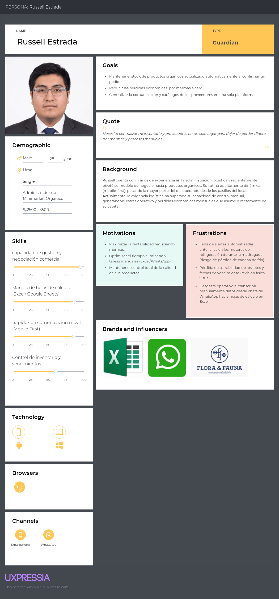

Russell representa al administrador que supervisa en persona el local y toma las decisiones de compra. Su principal meta es no perder dinero por mermas y mantener el inventario confiable sin dedicar horas a revisiones manuales.

**User Persona 2: Enrique Villar, coordinador comercial de proveedor de productos orgánicos**

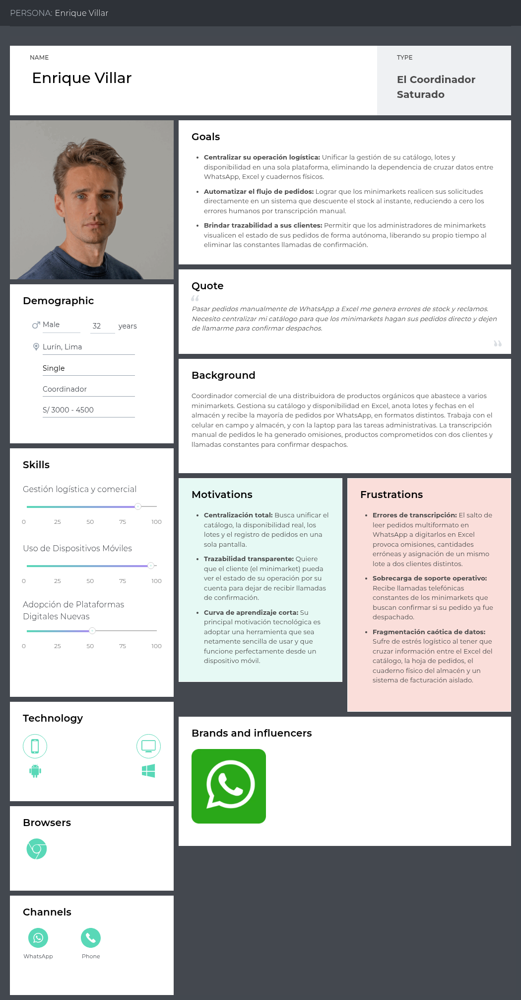

Enrique representa al proveedor que atiende a varios minimarkets desde el celular y la laptop. Su principal meta es que los pedidos lleguen ordenados y que sus clientes consulten disponibilidad y estado sin llamarlo.

### 2.3.2. User Task Matrix.

Se consideran los dos segmentos objetivo, representados por sus User Personas: Russell Estrada (administrador de minimarket) y Enrique Villar (proveedor de productos orgánicos). Las tareas listadas son las que cada persona realiza **hoy, con o sin OrganiK**; no son funcionalidades de software. La frecuencia (Diaria, Semanal, Mensual, Ocasional) y la importancia (Alta, Media, Baja) se asignaron a partir de lo descrito en las entrevistas.

| Tarea | Russell Estrada (Administrador) Frecuencia | Russell Estrada (Administrador) Importancia | Enrique Villar (Proveedor) Frecuencia | Enrique Villar (Proveedor) Importancia |
|:---|:---:|:---:|:---:|:---:|
| Revisar existencias en anaqueles o almacén | Diaria | Alta | Diaria | Alta |
| Revisar fechas de vencimiento de los lotes | Diaria | Alta | Semanal | Alta |
| Verificar temperatura y humedad de refrigeradoras y vitrinas | Diaria | Alta | Ocasional | Media |
| Identificar productos que deben reponerse | Diaria | Alta | No aplica | No aplica |
| Consultar disponibilidad y precios con el proveedor | Semanal | Alta | No aplica | No aplica |
| Actualizar y enviar el catálogo o la lista de disponibilidad | No aplica | No aplica | Semanal | Alta |
| Recibir y registrar pedidos de clientes | No aplica | No aplica | Diaria | Alta |
| Confirmar, modificar o rechazar un pedido | Semanal | Alta | Diaria | Alta |
| Preparar y coordinar el despacho | No aplica | No aplica | Diaria | Alta |
| Verificar productos y cantidades recibidos | Semanal | Alta | No aplica | No aplica |
| Registrar el ingreso de mercadería al inventario | Semanal | Alta | Semanal | Media |
| Responder o hacer consultas sobre el estado de un pedido | Semanal | Media | Diaria | Media |
| Retirar productos vencidos o deteriorados (mermas) | Semanal | Media | Ocasional | Media |
| Cerrar el balance mensual de inventario y mermas | Mensual | Media | Mensual | Media |

**Análisis:** las tareas con mayor frecuencia e importancia para Russell son la revisión diaria de existencias, vencimientos y temperatura, y la identificación de productos por reponer; para Enrique son la recepción de pedidos, su confirmación y la preparación del despacho. Ambas personas coinciden en revisar existencias y en confirmar pedidos, pero desde lados opuestos: Enrique los propone o confirma y Russell decide si los recibe. Esta coincidencia justifica el flujo central de OrganiK (el proveedor propone, el administrador decide), mientras que la verificación de temperatura es una tarea casi exclusiva del administrador y sustenta el módulo de conservación.

### 2.3.3. User Journey Mapping.

Los User Journey Maps presentan la situación **As-Is** de cada User Persona, es decir, su recorrido actual sin OrganiK, desde que detecta un problema operativo hasta que evalúa si necesita una herramienta distinta. Las etapas siguen la plantilla de UXPressia (Aware, Join, Use, Develop, Leave) y cada mapa está vinculado a la ficha de su User Persona en la misma herramienta. La fila *Ideas / Opportunities* registra las oportunidades que luego se trasladan a las User Stories.

**User Journey Map 1: Russell Estrada (administrador de minimarket)**

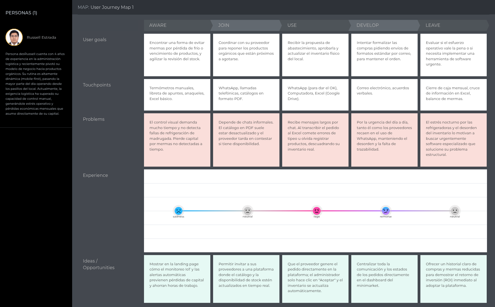

| Etapa | Qué hace hoy | Problema principal | Emoción | Oportunidad para OrganiK |
|:---|:---|:---|:---|:---|
| Aware | Revisa con termómetro y libreta el stock y los vencimientos. | No detecta fallas de frío de madrugada. | Tristeza | Alertas de conservación y vencimiento. |
| Join | Pide reposición al proveedor por WhatsApp. | Catálogo en PDF desactualizado. | Neutral | Catálogo del proveedor con disponibilidad vigente. |
| Use | Aprueba el pedido por chat y lo transcribe a Excel. | Errores de tipeo y stock real descuadrado. | Enojo | Pedido estructurado que actualiza el inventario al aceptarlo. |
| Develop | Intenta formalizar pedidos por correo. | Vuelve a WhatsApp por urgencia; no hay trazabilidad. | Remordimiento | Estado e historial de cada pedido. |
| Leave | Hace el cierre mensual de mermas en Excel. | El desorden lo lleva a buscar software. | Neutral | Indicadores de mermas y reposición en el dashboard. |

**User Journey Map 2: Enrique Villar (proveedor de productos orgánicos)**

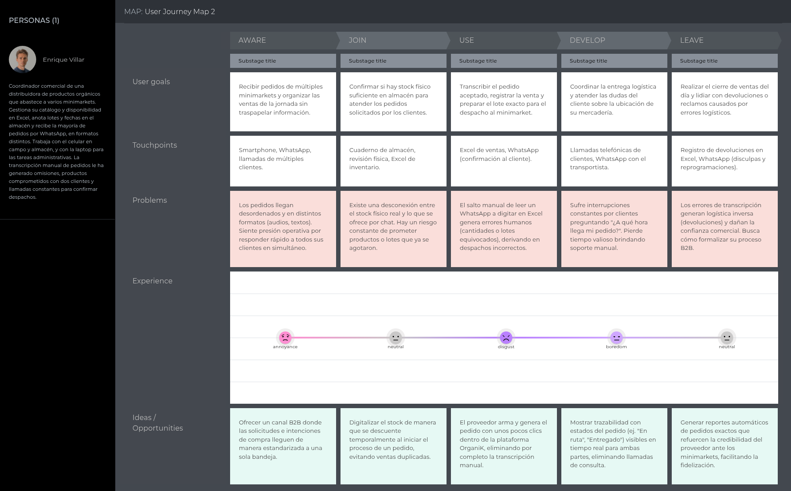

| Etapa | Qué hace hoy | Problema principal | Emoción | Oportunidad para OrganiK |
|:---|:---|:---|:---|:---|
| Aware | Recibe pedidos de varios minimarkets por WhatsApp y llamadas. | Pedidos desordenados en audios y textos. | Fastidio | Bandeja única de pedidos estructurados. |
| Join | Confirma en el cuaderno de almacén si hay stock físico. | Promete productos o lotes que ya se agotaron. | Neutral | Disponibilidad actualizada que se reserva al crear un pedido. |
| Use | Transcribe el pedido a Excel y prepara el lote. | Cantidades o lotes equivocados por la transcripción. | Disgusto | Pedido creado en la plataforma sin transcripción. |
| Develop | Coordina la entrega y responde dudas de los clientes. | Interrupciones constantes por "¿a qué hora llega mi pedido?". | Aburrimiento | Estado del pedido visible para ambas partes. |
| Leave | Cierra las ventas del día y atiende devoluciones. | Los errores dañan su credibilidad ante los minimarkets. | Neutral | Historial de pedidos y decisiones que respalda su servicio. |

### 2.3.4. Empathy Mapping.

Los Empathy Maps se elaboraron en UXPressia con el User Persona de cada segmento al centro. Cada integrante del equipo colocó sus observaciones de las entrevistas en las secciones *Who are we empathizing with?*, *What do they need to do?*, *See*, *Say*, *Do*, *Hear* y *Think and Feel*, y luego se consolidaron los *Pains* (¿qué le preocupa?) y los *Gains* (¿qué puede ayudar a resolver sus problemas y convencerlo de que somos la alternativa correcta?). Las frases de *Say* son paráfrasis de lo dicho por los entrevistados del segmento.

**Empathy Map: Russell Estrada (administrador de minimarket)**

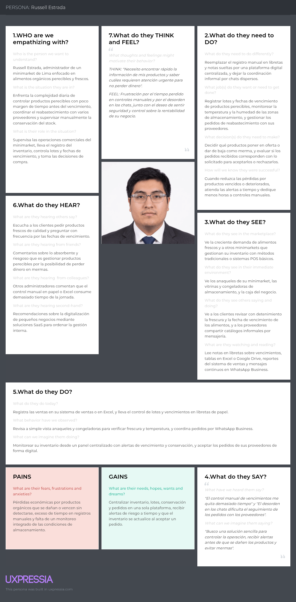

**Empathy Map: Enrique Villar (proveedor de productos orgánicos)**

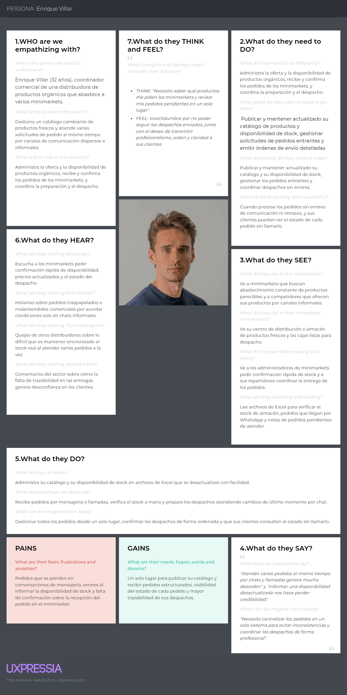

| Elemento | Russell Estrada (administrador) | Enrique Villar (proveedor) |
|:---|:---|:---|
| Pains | Pérdidas por productos vencidos o deteriorados sin detectar; tiempo excesivo en registros manuales; sin monitoreo de conservación. | Errores de transcripción; disponibilidad desactualizada; llamadas constantes para confirmar despachos. |
| Gains | Inventario, lotes, conservación y pedidos en un solo lugar; alertas antes de la pérdida; inventario actualizado al aceptar un pedido. | Catálogo publicado una vez; pedidos estructurados; clientes que consultan el estado del pedido sin llamar. |
| ¿Qué lo convencería de elegir OrganiK? | Ver una alerta de conservación o vencimiento a tiempo en una prueba con sus propios productos. | Recibir un pedido completo sin tener que reescribirlo y ver que el cliente consulta su estado solo. |

## 2.4. Big Picture Event Storming.

El *Big Picture Event Storming* se realizó de forma colaborativa en Miro, siguiendo la guía *Step-by-Step* del curso. Su objetivo fue entender el dominio completo (la oferta del proveedor, el control del minimarket, la reposición, la decisión de pedidos y su seguimiento) antes de diseñar la solución. Cada integrante aportó eventos y pain points a partir de las entrevistas, y cada etapa se trabajó sobre una copia de la anterior para conservar la evolución del tablero.

Tablero de la sesión: [OrganiK – Big Picture Event Storming (Miro)](https://miro.com/welcomeonboard/dnpHWHJVaW5DN0NjK1ordExFczhIQnVGaithTE5DN3FrbHBSb09zTHdzQ2xNMlRnOWZRNTNOYWVwczFjdzkrMFhjRm1DVHVTNGVMMTdOT0M4dUxYeFRCL2liekxjeVhnYWlWbVcyTUcySVRQQWw5SnFIZjkxVHhrVlQzSmFZU0hnbHpza3F6REdEcmNpNEFOMmJXWXBBPT0hdjE=?share_link_id=75936186891)

**Etapa 1. Unstructured exploration.** Cada integrante escribió en notas naranjas, en pasado y sin ordenar, los eventos de dominio que recordaba de las entrevistas. En esta etapa aparecieron eventos duplicados (*Pedido creado*, *Vencimiento próximo detectado*) y un evento técnico (*App configurada*), que se depuraron en la etapa siguiente.

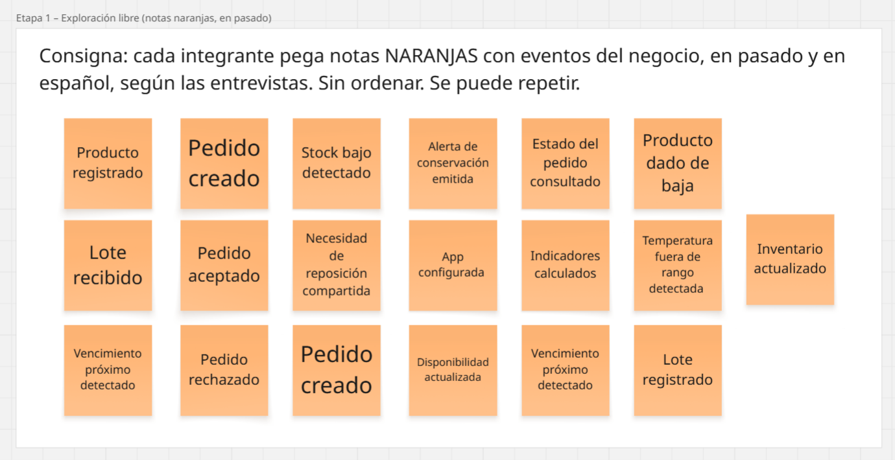

**Etapa 2. Timeline.** Se eliminaron los duplicados y el evento técnico, se reescribieron los eventos en inglés siguiendo el Ubiquitous Language (2.5) y se ordenaron de izquierda a derecha en cinco carriles: oferta del proveedor, control del minimarket, reposición, decisión del pedido y seguimiento. La decisión del pedido se representa como una bifurcación: *Supply Order Accepted* o *Supply Order Rejected*, con sus resultados *Inventory Increased From Order* o *Inventory Kept Unchanged*.

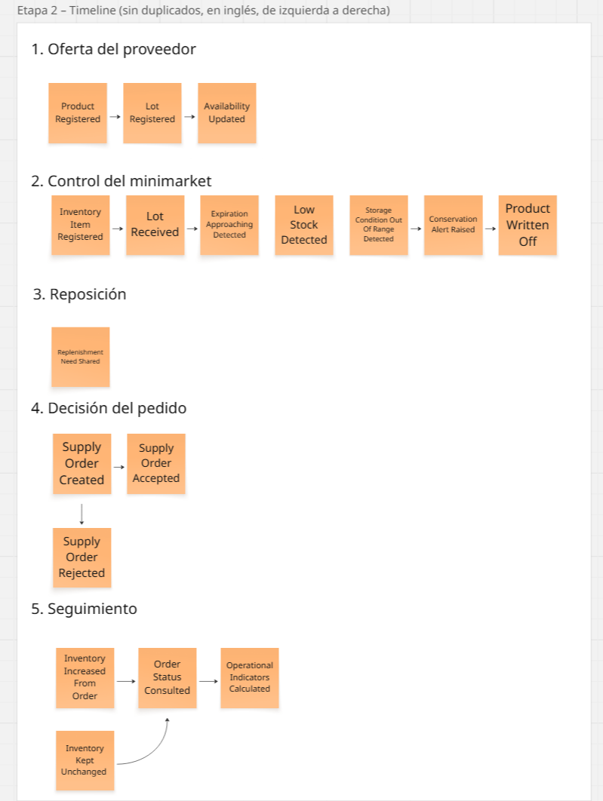

**Etapa 3. Pain points.** Se marcaron con hexágonos rosados los problemas observados en las entrevistas, sobre el evento donde ocurren: disponibilidad desactualizada, vencimientos detectados cuando ya son merma, fallas de frío de madrugada no detectadas, transcripción manual de pedidos desde WhatsApp, riesgo de modificar el inventario sin aprobación del administrador y llamadas para consultar el estado del pedido.

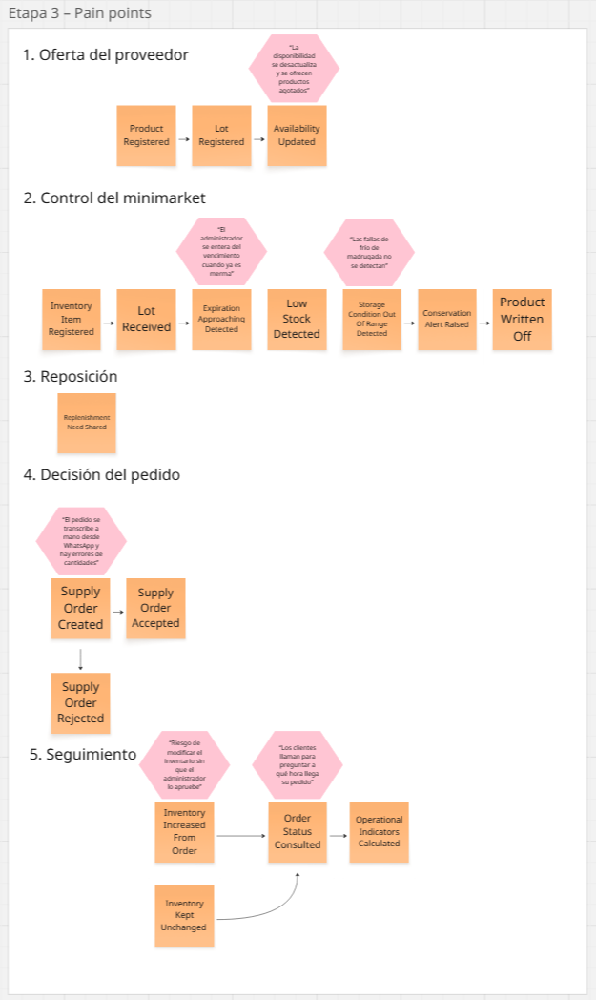

**Etapa 4. Pivotal points.** Se resaltaron con un recuadro rojo los eventos que cambian la responsabilidad entre actores: *Supply Order Created* (el proveedor propone) y *Supply Order Accepted* (el administrador decide y el inventario cambia).

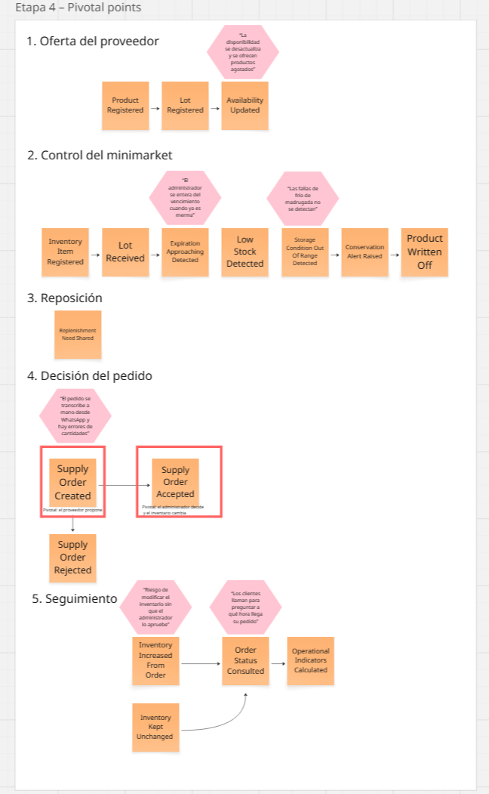

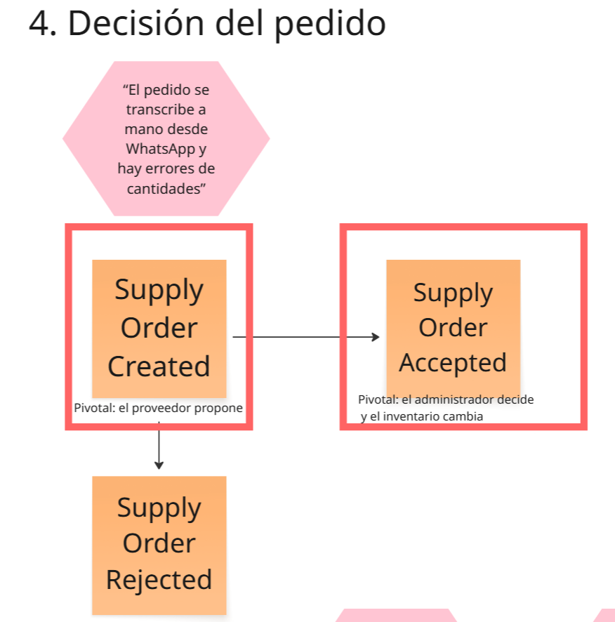

**Etapa 5. Actors and external systems.** Se agregaron los actores en notas amarillas (*Supplier* y *Minimarket Administrator*, representados por Enrique Villar y Russell Estrada) junto a los eventos que provocan y, en rosado, el sistema externo que entrega las lecturas de temperatura y humedad (*Storage Sensor*, simulado en esta etapa del proyecto). Al final de los carriles se registraron en verde las oportunidades identificadas: alertas automáticas de vencimiento, un pedido digital que el administrador acepta con un clic e indicadores de mermas por negocio.

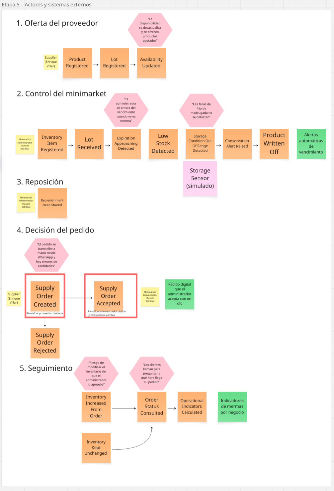

La siguiente tabla resume la secuencia resultante:

| Secuencia | Actor y acción | Evento de dominio | Regla o punto de atención |
|:---|:---|:---|:---|
| 1 | El proveedor registra un producto, sus lotes y su disponibilidad. | *Product Registered*, *Lot Registered*, *Availability Updated* | La cantidad y el vencimiento deben corresponder al lote ofrecido. |
| 2 | El administrador registra sus productos y recibe lotes. | *Inventory Item Registered*, *Lot Received* | El stock pertenece al minimarket, no al proveedor. |
| 3 | El sistema evalúa vencimientos y stock mínimo. | *Expiration Approaching Detected*, *Low Stock Detected* | Los umbrales los configura el administrador por producto. |
| 4 | El sistema evalúa las lecturas de conservación. | *Storage Condition Out Of Range Detected*, *Conservation Alert Raised* | En esta etapa las lecturas son simuladas; una alerta no equivale a una merma. |
| 5 | El administrador retira un producto vencido o deteriorado. | *Product Written Off* | Toda baja registra su causa para medir las mermas. |
| 6 | El administrador comparte una necesidad de reposición. | *Replenishment Need Shared* | Compartir una necesidad no crea un pedido. |
| 7 | El proveedor crea un pedido para el minimarket. | *Supply Order Created* | Indica productos, cantidades y destinatario; no modifica el inventario del minimarket. |
| 8 | El administrador acepta o rechaza el pedido. | *Supply Order Accepted* / *Supply Order Rejected* | Solo el administrador destinatario decide; un pedido ya decidido no se vuelve a decidir. |
| 9 | El sistema actualiza o conserva el inventario. | *Inventory Increased From Order* / *Inventory Kept Unchanged* | La entrada de inventario ocurre una sola vez y queda asociada al pedido. |
| 10 | Ambos actores consultan el seguimiento. | *Order Status Consulted*, *Operational Indicators Calculated* | Los indicadores se calculan por negocio. |

Los puntos de mayor riesgo son la disponibilidad desactualizada, la transcripción manual de pedidos y la modificación del inventario sin decisión del administrador. Estos eventos son la base del Design-Level Event Storming de la sección 4.6.1.

## 2.5. Ubiquitous Language.

El glosario reúne los términos del dominio de negocio identificados en el Big Picture Event Storming. Siguiendo el enunciado, los términos se escriben en inglés con su equivalente en español entre paréntesis y no se incluyen términos técnicos de ingeniería de software.

| Término | Definición |
| :--- | :--- |
| **Minimarket Administrator** (Administrador de minimarket) | Persona responsable del inventario, la conservación y las decisiones de abastecimiento de un minimarket. Es el único actor que acepta o rechaza los pedidos dirigidos a su negocio. |
| **Supplier** (Proveedor) | Productor, distribuidor o comerciante que ofrece productos orgánicos a minimarkets y crea pedidos de abastecimiento para ellos. |
| **Minimarket** (Minimarket) | Establecimiento comercial que vende productos orgánicos y frescos y mantiene un inventario propio. |
| **Business Profile** (Perfil de negocio) | Datos que identifican a un minimarket o proveedor: razón social, RUC, distrito, cobertura y contacto. |
| **Organic Product** (Producto orgánico) | Bien perecible ofrecido o vendido con su categoría, unidad de medida y precio de referencia. |
| **Product Category** (Categoría de producto) | Agrupación de productos con condiciones de conservación similares, por ejemplo frutas, hortalizas o lácteos. |
| **Supplier Catalog** (Catálogo del proveedor) | Conjunto de productos que un proveedor ofrece, con su disponibilidad vigente. |
| **Availability** (Disponibilidad) | Cantidad de un producto que el proveedor puede comprometer en pedidos en un momento dado. |
| **Lot** (Lote) | Cantidad de un producto ingresada en una misma fecha y con una misma fecha de vencimiento; es la unidad de trazabilidad. |
| **Expiration Date** (Fecha de vencimiento) | Fecha límite en la que un lote puede venderse en condiciones adecuadas. |
| **Stock** (Existencias) | Cantidad disponible de un producto en el inventario del minimarket. |
| **Minimum Stock** (Stock mínimo) | Umbral por producto por debajo del cual se considera que debe reponerse. |
| **Storage Area** (Área de almacenamiento) | Espacio físico del minimarket (refrigeradora, vitrina o anaquel) con condiciones de conservación propias. |
| **Storage Condition** (Condición de almacenamiento) | Temperatura y humedad registradas en un área de almacenamiento en un momento dado. |
| **Conservation Range** (Rango de conservación) | Valores mínimos y máximos de temperatura y humedad aceptables para una categoría de producto. |
| **Conservation Alert** (Alerta de conservación) | Aviso emitido cuando una condición de almacenamiento sale de su rango de conservación. |
| **Expiration Alert** (Alerta de vencimiento) | Aviso emitido cuando un lote entra en el periodo previo a su vencimiento definido por el administrador. |
| **Low Stock Alert** (Alerta de stock bajo) | Aviso emitido cuando el stock de un producto cae por debajo del stock mínimo. |
| **Waste** (Merma) | Cantidad de un lote retirada por vencimiento, deterioro o daño, con su causa. |
| **Offer** (Oferta) | Precio promocional asignado a un lote para acelerar su venta antes del vencimiento. |
| **Replenishment Need** (Necesidad de reposición) | Producto y cantidad que el administrador comparte con un proveedor vinculado; no constituye un pedido. |
| **Supply Order** (Pedido de abastecimiento) | Propuesta que crea un proveedor para un minimarket con productos, cantidades y lotes; queda pendiente hasta la decisión del administrador. |
| **Order Status** (Estado del pedido) | Situación de un pedido: *Pending* (pendiente), *Accepted* (aceptado) o *Rejected* (rechazado). |
| **Order Decision** (Decisión del pedido) | Aceptación o rechazo de un pedido registrada con el administrador que decidió, la fecha y, si se rechaza, el motivo. |
| **Inventory Entry** (Entrada de inventario) | Incremento de stock originado por un pedido aceptado; ocurre una sola vez por pedido. |
| **Linked Supplier** (Proveedor vinculado) | Proveedor con el que un minimarket acepta compartir necesidades y recibir pedidos. |
| **Operational Indicator** (Indicador operativo) | Medida del negocio, por ejemplo mermas del mes, lotes en riesgo o pedidos pendientes. |