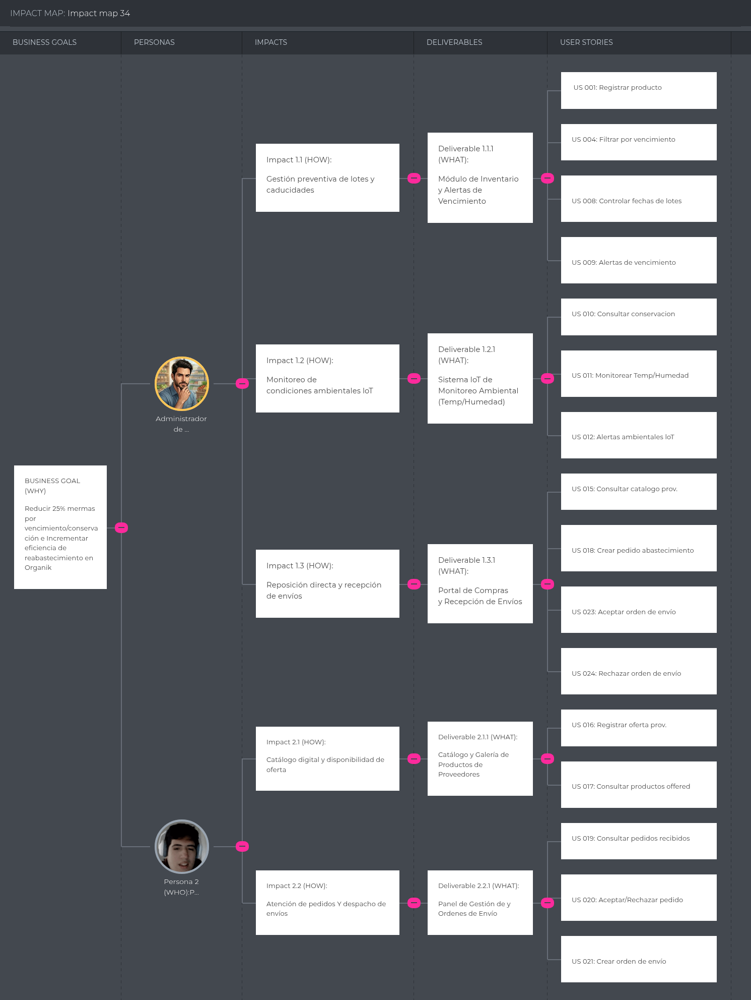

# Capítulo III: Requirements Specification

### TO-BE Scenario Mapping

#### Administradores de Minimarkets

| Fase | Doing (Qué hace) | Thinking (Qué piensa) | Feeling (Qué siente) |
|------|------------------|-----------------------|----------------------|
| Consulta y revisión de información | Consulta su dashboard para revisar inventario, lotes, vencimientos, conservación y pedidos dirigidos al minimarket. | “Necesito encontrar rápidamente los productos que requieren atención.” | Con mayor sensación de control. |
| Gestión y abastecimiento | Detecta stock bajo y consulta la disponibilidad ofrecida por proveedores; comunica sus necesidades de reposición. | “Necesito saber qué productos están disponibles para reponer.” | Atento a la disponibilidad. |
| Toma de decisión | Revisa productos y cantidades de los pedidos generados por el proveedor y decide aceptarlos o rechazarlos. | “Necesito verificar el pedido antes de incorporarlo al inventario.” | Responsable de la decisión. |
| Seguimiento y control | Consulta el historial; solo cuando acepta un pedido se actualizan las existencias del minimarket. | “Necesito saber qué fue aceptado y qué cambió en el inventario.” | Con mayor trazabilidad. |

#### Proveedores de Productos Orgánicos

| Fase | Doing (Qué hace) | Thinking (Qué piensa) | Feeling (Qué siente) |
|------|------------------|-----------------------|----------------------|
| Consulta y revisión de información | Consulta su dashboard para revisar catálogo, lotes, disponibilidad y necesidades de reposición comunicadas por minimarkets. | “Necesito saber qué puedo ofrecer y a quién.” | Con mayor claridad sobre su oferta. |
| Gestión de pedidos | Crea un pedido dirigido a un minimarket con productos y cantidades disponibles. | “Necesito registrar una propuesta verificable para el cliente.” | Atento a las cantidades. |
| Seguimiento | Consulta si el administrador aceptó o rechazó el pedido. | “Necesito conocer la decisión sin buscarla en varios canales.” | Con mayor trazabilidad. |

## 3.1. User Stories.

Las historias del producto se derivan de las entrevistas y personas compuestas del capítulo II; H1-H7 remiten al Lean UX Canvas del capítulo I. El flujo de abastecimiento es **proveedor crea pedido -> administrador acepta o rechaza -> solo la aceptación actualiza el inventario**.

### Epics

| EPIC ID | Título | Descripción |
|---|---|---|
| EP-01 | Gestión de inventario | Permite registrar, visualizar, buscar y actualizar la información de los productos disponibles en el inventario del minimarket, incluyendo cantidades, mermas y productos disponibles como oferta. |
| EP-02 | Gestión de lotes y vencimientos | Permite controlar los lotes, fechas de vencimiento y trazabilidad de los productos registrados en el inventario. |
| EP-03 | Gestión de conservación | Permite registrar y visualizar las condiciones de conservación de los productos, así como generar alertas cuando se detecten condiciones de riesgo. |
| EP-04 | Gestión de abastecimiento | Permite que el proveedor genere pedidos dirigidos a minimarkets, que el administrador los acepte o rechace y que ambos consulten su estado e historial. Solo la aceptación actualiza el inventario del minimarket. |
| EP-05 | Gestión de proveedores y productos | Permite consultar y administrar la información relacionada con proveedores y los productos que ofrecen dentro de la plataforma. |
| EP-06 | Gestión de usuarios y seguridad | Permite registrar usuarios, gestionar roles y controlar el acceso a las funcionalidades mediante permisos según el segmento. |
| EP-07 | Análisis y control de gestión | Permite visualizar indicadores, historial de operaciones, alertas e información consolidada para facilitar el seguimiento de las operaciones. |
| EP-08 | Comunicación de la propuesta de valor | Permite presentar públicamente la solución y orientar a los dos segmentos hacia un primer contacto. Es el único epic con implementación en Sprint 1. |

### User Stories

Los umbrales de alertas, anticipación de vencimiento y disponibilidad se configuran por producto o negocio. Cada escenario Given-When-Then requiere un usuario autenticado del negocio indicado, salvo US 027.

| Epic / Story ID | Título | Descripción | Criterios de Aceptación | Relacionado con (Epic ID) |
|---|---|---|---|---|
| US 001 | Registrar producto en inventario | **Como** administrador de minimarket, **Quiero** registrar productos en el inventario, **Para** mantener actualizada la información de los productos disponibles. | Dado un administrador autorizado y un producto con datos obligatorios válidos, cuando registra el producto y su cantidad inicial, entonces aparece una sola vez en el inventario de su minimarket; con datos obligatorios ausentes no se guarda. | EP-01 |
| US 002 | Visualizar inventario | **Como** administrador de minimarket, **Quiero** visualizar los productos registrados, **Para** conocer el estado actual de mi inventario. | Dado un minimarket con productos registrados, cuando su administrador abre inventario, entonces ve producto, cantidad, lote y vencimiento cuando apliquen; no ve existencias de otro negocio. | EP-01 |
| US 003 | Buscar productos en inventario | **Como** administrador de minimarket, **Quiero** buscar productos dentro del inventario, **Para** encontrarlos rápidamente. | Dado un inventario con productos, cuando el administrador busca por nombre o código, entonces se muestran solo coincidencias de su negocio; una búsqueda sin coincidencias informa que no hay resultados. | EP-01 |
| US 004 | Filtrar inventario | **Como** administrador de minimarket, **Quiero** filtrar productos por categoría, estado o vencimiento, **Para** identificar rápidamente productos que requieren atención. | Dado un inventario con categorías, estados y vencimientos, cuando el administrador aplica filtros, entonces el listado cumple todos los filtros activos y permite restablecerlos. | EP-01 / EP-02 |
| US 005 | Actualizar inventario | **Como** administrador de minimarket, **Quiero** actualizar la información de los productos, **Para** mantener el inventario correctamente registrado. | Dado un producto propio, cuando el administrador modifica un campo editable con valor válido, entonces se guarda el cambio y queda registrado; un proveedor no puede alterar ese inventario. | EP-01 |
| US 006 | Registrar lote | **Como** administrador de minimarket, **Quiero** registrar lotes de productos, **Para** mantener la trazabilidad de los productos almacenados. | Dado un producto del minimarket, cuando el administrador registra identificador de lote, cantidad y vencimiento válidos, entonces el lote queda asociado al producto; no se acepta una cantidad negativa. | EP-02 |
| US 007 | Consultar lotes | **Como** administrador de minimarket, **Quiero** consultar los lotes registrados, **Para** conocer el origen y estado de los productos. | Dado un producto con lotes, cuando el administrador consulta su detalle, entonces ve identificador, cantidad y vencimiento de cada lote de su negocio. | EP-02 |
| US 008 | Controlar fechas de vencimiento | **Como** administrador de minimarket, **Quiero** visualizar las fechas de vencimiento de los productos, **Para** identificar productos próximos a vencer. | Dado un lote con fecha registrada, cuando el administrador consulta vencimientos, entonces ve la fecha y su estado respecto a la fecha actual; los lotes sin fecha se señalan como datos incompletos. | EP-02 |
| US 009 | Generar alertas de vencimiento | **Como** administrador de minimarket, **Quiero** recibir alertas sobre productos próximos a vencer, **Para** tomar acciones antes de que se generen pérdidas. | Dado un lote dentro del umbral configurable previo al vencimiento, cuando se evalúan alertas, entonces aparece una alerta vinculada al lote; fuera del umbral no aparece como próxima a vencer. | EP-02 |
| US 010 | Consultar condiciones de conservación | **Como** administrador de minimarket, **Quiero** consultar las condiciones de conservación de los productos, **Para** identificar posibles riesgos de deterioro. | Dado un área con condiciones registradas, cuando el administrador abre su detalle, entonces ve temperatura, humedad, hora y área de la lectura; si no hay lecturas, se indica ausencia de datos. | EP-03 |
| US 011 | Monitorear temperatura y humedad | **Como** administrador de minimarket, **Quiero** visualizar registros de temperatura y humedad, **Para** conocer las condiciones de almacenamiento de los productos. | Dadas lecturas simuladas o reales identificadas por origen, cuando el administrador consulta el monitoreo, entonces ve valores, unidades, marca temporal y origen sin confundir datos simulados con sensores físicos. | EP-03 |
| US 012 | Generar alertas de conservación | **Como** administrador de minimarket, **Quiero** recibir alertas cuando las condiciones de conservación sean inadecuadas, **Para** reaccionar oportunamente ante posibles riesgos de deterioro. | Dado un umbral configurado y una lectura fuera de rango, cuando se procesa la lectura, entonces se genera una alerta con área, variable y momento; una lectura dentro de rango no genera esa alerta. | EP-03 |
| US 013 | Registrar merma | **Como** administrador de minimarket, **Quiero** registrar productos que hayan sufrido merma, **Para** mantener un historial de pérdidas de inventario. | Dado un lote con existencias, cuando el administrador registra una merma válida no superior a la cantidad disponible, entonces disminuye el stock y queda causa y cantidad en el historial; una cantidad excesiva se rechaza. | EP-01 / EP-07 |
| US 014 | Registrar oferta de productos | **Como** administrador de minimarket, **Quiero** registrar productos disponibles como oferta, **Para** promocionar productos con stock disponible y mantener trazabilidad sobre su salida comercial del inventario. | Dado un producto propio con stock, cuando el administrador registra una oferta con vigencia y cantidad válidas, entonces queda visible como oferta sin descontar automáticamente el stock; no se permite ofertar más unidades que las disponibles. | EP-01 / EP-07 |
| US 015 | Consultar productos de proveedores | **Como** administrador de minimarket, **Quiero** consultar los productos ofrecidos por los proveedores, **Para** identificar opciones disponibles para abastecer el minimarket. | Dado un proveedor vinculado con productos disponibles, cuando el administrador consulta su catálogo, entonces ve producto, disponibilidad y fecha de actualización; no modifica la oferta del proveedor. | EP-05 |
| US 016 | Registrar productos ofrecidos | **Como** proveedor de productos orgánicos, **Quiero** registrar los productos que ofrezco, **Para** ponerlos a disposición de los minimarkets. | Dado un proveedor autenticado, cuando registra producto, lote y disponibilidad válidos, entonces aparecen en su catálogo; no modifica el inventario de ningún minimarket. | EP-05 |
| US 017 | Consultar productos ofrecidos | **Como** proveedor de productos orgánicos, **Quiero** consultar los productos que tengo registrados, **Para** mantener control sobre mi oferta dentro de la plataforma. | Dado un catálogo propio, cuando el proveedor lo consulta, entonces ve sus productos, lotes y disponibilidad actual; no ve información privada de otro proveedor. | EP-05 |
| US 018 | Registrar necesidad de reposición | **Como** administrador de minimarket, **Quiero** registrar los productos y cantidades que necesito reponer, **Para** orientar mis decisiones de abastecimiento sin crear un pedido en nombre del proveedor. | Dado stock bajo y un administrador autorizado, cuando registra producto y cantidad a reponer, entonces la necesidad queda asociada a su minimarket y no se crea ni acepta un pedido automáticamente. | EP-04 |
| US 019 | Consultar pedidos de abastecimiento | **Como** administrador de minimarket o proveedor autorizado, **Quiero** consultar los pedidos relacionados con mi negocio, **Para** conocer sus productos, cantidades y estado actual. | Dado un pedido dirigido al minimarket o creado por el proveedor, cuando el usuario autorizado lo consulta, entonces ve productos, cantidades, estado y participantes; un tercero no puede verlo. | EP-04 |
| US 020 | Consultar necesidades de reposición | **Como** proveedor de productos orgánicos, **Quiero** consultar las necesidades de reposición compartidas por los minimarkets a los que atiendo, **Para** preparar propuestas acordes con mi disponibilidad. | Dada una necesidad compartida con un proveedor vinculado, cuando este la consulta, entonces ve producto y cantidad requerida; no puede editar la necesidad del minimarket. | EP-04 |
| US 021 | Crear pedido de abastecimiento | **Como** proveedor de productos orgánicos, **Quiero** crear un pedido dirigido a un minimarket con productos y cantidades disponibles, **Para** proponer una operación de abastecimiento verificable. | Dado un proveedor vinculado y disponibilidad suficiente, cuando crea un pedido con productos, cantidades positivas y minimarket destinatario, entonces queda pendiente de decisión y no altera inventario; cantidades superiores a la disponibilidad se rechazan. | EP-04 |
| US 022 | Consultar estado de pedido | **Como** proveedor de productos orgánicos, **Quiero** consultar el estado de los pedidos que generé, **Para** conocer la decisión del administrador. | Dado un pedido creado por el proveedor, cuando consulta su detalle, entonces ve si está pendiente, aceptado o rechazado y la fecha de la última decisión. | EP-04 |
| US 023 | Aceptar pedido | **Como** administrador de minimarket, **Quiero** aceptar un pedido dirigido a mi negocio después de verificar sus productos y cantidades, **Para** incorporar únicamente los productos aprobados al inventario. | Dado un pedido pendiente dirigido al minimarket, cuando su administrador lo acepta, entonces queda aceptado con actor y fecha y se incorporan sus cantidades una sola vez al inventario; una segunda aceptación no duplica stock. | EP-01 / EP-04 |
| US 024 | Rechazar pedido | **Como** administrador de minimarket, **Quiero** rechazar un pedido dirigido a mi negocio, **Para** evitar incorporar productos no aprobados al inventario. | Dado un pedido pendiente dirigido al minimarket, cuando su administrador lo rechaza, entonces queda rechazado con actor y fecha y el inventario no cambia; un pedido ya decidido no puede rechazarse de nuevo. | EP-04 |
| US 025 | Consultar historial de abastecimiento | **Como** administrador de minimarket o proveedor autorizado, **Quiero** consultar el historial de pedidos y decisiones de mi negocio, **Para** mantener trazabilidad de las operaciones. | Dado un pedido del negocio, cuando un participante autorizado abre el historial, entonces ve creación, cambios de estado, decisión, actor y fecha en orden cronológico; no accede a operaciones ajenas. | EP-04 / EP-07 |
| US 026 | Registrar usuario | **Como** usuario administrador autorizado, **Quiero** registrar usuarios en el sistema, **Para** permitir el acceso controlado a OrganiK. | Dado un administrador autorizado, cuando registra un usuario con identificador único y rol válido, entonces se crea en su negocio con ese rol; un identificador duplicado o rol no permitido se rechaza. | EP-06 |
| US 027 | Inicio de sesión | **Como** usuario, **Quiero** iniciar sesión, **Para** acceder al dashboard de OrganiK según mis permisos. | Dadas credenciales válidas, cuando el usuario inicia sesión, entonces accede solo a su segmento y negocio; con credenciales inválidas no se crea sesión ni se revela qué dato falló. | EP-06 |
| US 028 | Gestionar permisos por rol | **Como** usuario administrador autorizado, **Quiero** gestionar los permisos asociados a los roles, **Para** controlar las acciones que cada segmento puede realizar. | Dado un administrador autorizado, cuando asigna un rol permitido a un usuario de su negocio, entonces cambian sus permisos efectivos; no puede asignar permisos de otro negocio. | EP-06 |
| US 029 | Controlar acceso según operación | **Como** administrador de minimarket o proveedor, **Quiero** que las acciones disponibles en pedidos e inventario dependan de mi rol y negocio, **Para** evitar modificaciones no autorizadas. | Dado un proveedor, cuando intenta aceptar pedidos o editar el inventario del minimarket, entonces se deniega la operación incluso por API; solo el administrador destinatario puede decidir sobre el pedido. | EP-01 / EP-04 / EP-06 |
| US 030 | Dashboard por segmento | **Como** administrador de minimarket o proveedor, **Quiero** visualizar un dashboard con información de las tareas de mi segmento, **Para** consultar rápidamente el estado de mis operaciones. | Dado un usuario autenticado, cuando abre su dashboard, entonces ve solo indicadores y accesos de su segmento y negocio; el administrador ve riesgos e inventario y el proveedor ve catálogo y pedidos. | EP-07 |
| US00 | Conocer OrganiK en la landing page | **Como** administrador de minimarket o proveedor que visita la página pública, **Quiero** conocer la propuesta de OrganiK y disponer de un medio de contacto, **Para** evaluar si responde a mis necesidades de inventario o abastecimiento. | Dado un visitante sin sesión, cuando abre la landing page, entonces puede leer la propuesta para ambos segmentos, navegar sus secciones y acceder al medio de contacto sin iniciar sesión; la página no presenta los módulos futuros como ya operativos. | EP-08 |

**Trazabilidad del alcance:** Las personas son compuestas a partir de las entrevistas del capítulo II. Los recorridos As-Is de administrador (inventario, conservación y reposición) y proveedor (oferta y pedidos) sustentan los grupos de historias; H1-H7 son las hipótesis del Canvas, no beneficios demostrados.

| Epic | Historias de usuario | Needfinding y Canvas |
|---|---|---|
| EP-01 / EP-02 | US 001-009, US 013-014 | Administrador: revisión de existencias, lotes y vencimientos; H1. Mermas y ofertas son alcance complementario, no evidencia de una hipótesis validada. |
| EP-03 | US 010-012 | Administrador: comprobación manual de conservación; H2 con lecturas inicialmente simuladas. |
| EP-04 / EP-05 | US 015-025 | Administrador: reposición y decisión; proveedor: catálogo, disponibilidad, creación y seguimiento de pedidos; H3-H5. |
| EP-06 / EP-07 | US 026-030 | Ambos segmentos: acceso a tareas propias y menor dispersión; H6. La viabilidad SaaS H7 requiere entrevistas y mediciones posteriores, no una función ya entregada. |
| EP-08 | US00 | Ambos segmentos: comunicación de la propuesta derivada del Canvas; landing page implementada en Sprint 1, sin afirmar que el producto web ya funciona. |

### Technical Stories

Los contratos REST son propuestos para sprints posteriores. En todos los endpoints privados, una petición sin sesión válida debe rechazarse y una petición a datos de otro negocio debe denegarse. Las respuestas correctas deben devolver datos del negocio autorizado sin filtrar información ajena.

| Epic / Story ID | Título | Descripción | Criterios de Aceptación | Relacionado con (Epic ID) |
|---|---|---|---|---|
| TS-IAM-001 | Sign-in API | **Como** frontend developer, **Quiero** autenticar usuarios mediante una API de inicio de sesión, **Para** obtener las credenciales de sesión y permisos correspondientes. **US vinculadas:** US 027, 029. | Credenciales válidas crean sesión con rol y negocio; credenciales inválidas no crean sesión. | EP-06 |
| TS-IAM-002 | Sign-up API | **Como** frontend developer, **Quiero** registrar usuarios mediante una API, **Para** habilitar el acceso controlado a OrganiK. **US vinculadas:** US 026. | Registro válido crea usuario único con rol permitido; duplicados son rechazados. | EP-06 |
| TS-IAM-003 | Users directory API | **Como** frontend developer, **Quiero** consultar y registrar usuarios mediante la API, **Para** administrar los usuarios autorizados de OrganiK. **US vinculadas:** US 026, 028. | Listado y creación muestran solo usuarios del negocio autorizado. | EP-06 |
| TS-IAM-004 | User detail and update API | **Como** frontend developer, **Quiero** consultar y actualizar usuarios mediante la API, **Para** mantener sus roles o estados actualizados. **US vinculadas:** US 026, 028. | Consulta y cambio de rol o estado persisten solo para usuarios del mismo negocio. | EP-06 |
| TS-PROF-001 | Profile read and update API | **Como** frontend developer, **Quiero** consultar y actualizar el perfil del usuario o negocio, **Para** mostrar información actualizada dentro de OrganiK. **US vinculadas:** US 027, 030. | Consulta devuelve perfil propio; actualización ajena se deniega. | EP-06 |
| TS-PROD-001 | Products catalog API | **Como** frontend developer, **Quiero** consultar y registrar productos mediante la API, **Para** alimentar el inventario y catálogo de productos ofrecidos. **US vinculadas:** US 001, 016. | Creación distingue catálogo de proveedor e inventario de minimarket según rol. | EP-01 / EP-05 |
| TS-PROD-002 | Product detail and update API | **Como** frontend developer, **Quiero** consultar y actualizar productos, **Para** mantener la información actualizada. **US vinculadas:** US 005, 017. | Consulta y actualización conservan propietario; un proveedor no altera productos ajenos. | EP-01 / EP-05 |
| TS-INV-001 | Inventory list and create API | **Como** frontend developer, **Quiero** consultar y registrar elementos del inventario, **Para** mantener actualizado el stock del minimarket. **US vinculadas:** US 001, 002. | Alta y listado devuelven cantidad y producto del minimarket autenticado. | EP-01 |
| TS-INV-002 | Inventory update API | **Como** frontend developer, **Quiero** actualizar los registros de inventario, **Para** reflejar cambios en las cantidades y datos de los productos. **US vinculadas:** US 005, 023, 029. | Cambio directo requiere administrador; aceptación repetida del pedido no duplica cantidad. | EP-01 / EP-06 |
| TS-INV-003 | Inventory search and filter API | **Como** frontend developer, **Quiero** consultar el inventario utilizando filtros, **Para** implementar búsquedas por producto, categoría, estado o vencimiento. **US vinculadas:** US 003, 004. | Búsqueda y filtros combinados devuelven solo coincidencias del minimarket. | EP-01 / EP-02 |
| TS-LOT-001 | Lots API | **Como** frontend developer, **Quiero** consultar y registrar lotes, **Para** implementar la trazabilidad de los productos. **US vinculadas:** US 006, 007. | Alta de lote exige producto, identificador y cantidad válidos; listado conserva asociación. | EP-02 |
| TS-LOT-002 | Lot detail and update API | **Como** frontend developer, **Quiero** consultar y actualizar información de lotes, **Para** mantener actualizada la trazabilidad. **US vinculadas:** US 007, 008. | Detalle y actualización conservan lote, vencimiento y negocio asociado. | EP-02 |
| TS-EXP-001 | Expiration tracking API | **Como** frontend developer, **Quiero** consultar productos y lotes próximos a vencer, **Para** alimentar las alertas de vencimiento. **US vinculadas:** US 008, 009. | Consulta clasifica lotes según fecha y umbral configurable, sin alertar fuera del umbral. | EP-02 |
| TS-CON-001 | Conservation monitoring API | **Como** frontend developer, **Quiero** consultar registros de temperatura y humedad, **Para** mostrar las condiciones de conservación. **US vinculadas:** US 010, 011. | Lectura devuelve valor, unidad, momento, área y origen simulado o real. | EP-03 |
| TS-CON-002 | Conservation alerts API | **Como** frontend developer, **Quiero** consultar las alertas generadas por condiciones de conservación, **Para** mostrarlas al administrador. **US vinculadas:** US 012. | Fuera de umbral se expone alerta vinculada a lectura y área; dentro de umbral no. | EP-03 |
| TS-SUP-001 | Supplier directory API | **Como** frontend developer, **Quiero** consultar y registrar proveedores, **Para** mantener disponible la información necesaria para el abastecimiento. **US vinculadas:** US 015-017. | Directorio muestra proveedores vinculados; otro negocio no edita sus datos. | EP-05 |
| TS-SUP-002 | Supplier products API | **Como** frontend developer, **Quiero** consultar los productos ofrecidos por cada proveedor, **Para** mostrar el catálogo disponible para los minimarkets. **US vinculadas:** US 015-017. | Catálogo devuelve producto, lote, disponibilidad y fecha de actualización del proveedor. | EP-05 |
| TS-ORD-001 | Replenishment needs API | **Como** frontend developer, **Quiero** consultar y registrar necesidades de reposición mediante la API, **Para** mostrar al proveedor las cantidades solicitadas sin crear pedidos en su nombre. **US vinculadas:** US 018, 020. | Alta de necesidad no crea pedido; lectura del proveedor exige vínculo con minimarket. | EP-04 |
| TS-ORD-002 | Supplier orders API | **Como** frontend developer, **Quiero** crear y consultar pedidos dirigidos por proveedores a minimarkets, **Para** registrar productos, cantidades y estado de cada propuesta. **US vinculadas:** US 019, 021, 022. | Solo proveedor vinculado crea pedido pendiente con cantidades válidas; la creación no modifica stock. | EP-04 |
| TS-ORD-003 | Order decision API | **Como** frontend developer, **Quiero** aceptar o rechazar pedidos mediante la API con autorización del administrador, **Para** registrar su decisión y actualizar inventario solo cuando corresponda. **US vinculadas:** US 023, 024, 029. | Solo administrador destinatario decide pedido pendiente; aceptación incrementa stock una vez y rechazo no lo modifica. | EP-01 / EP-04 / EP-06 |
| TS-ORD-004 | Order history API | **Como** frontend developer, **Quiero** consultar el historial de estados y decisiones de pedidos, **Para** mostrar la trazabilidad a ambos segmentos sin exponer datos de otros negocios. **US vinculadas:** US 019, 022, 025. | Historial devuelve eventos con actor, estado y fecha solo a participantes autorizados. | EP-04 / EP-07 |
| TS-MER-001 | Waste and offer API | **Como** frontend developer, **Quiero** registrar mermas y ofertas de productos, **Para** mantener trazabilidad sobre las operaciones que afectan el inventario. **US vinculadas:** US 013, 014. | Merma válida descuenta stock; oferta válida se registra sin descuento automático. | EP-01 / EP-07 |
| TS-DASH-001 | Dashboard API | **Como** frontend developer, **Quiero** consultar indicadores correspondientes al segmento y negocio autenticados, **Para** alimentar dashboards diferenciados. **US vinculadas:** US 030. | Respuesta separa indicadores por segmento y negocio. | EP-07 |
| TS-DASH-002 | Alerts and notifications API | **Como** frontend developer, **Quiero** consultar las alertas y notificaciones del usuario, **Para** informar oportunamente sobre eventos relevantes. **US vinculadas:** US 009, 012. | Notificaciones incluyen tipo, origen y estado; no incluyen alertas de otro negocio. | EP-03 / EP-07 |
| TS-AUD-001 | Activity history API | **Como** frontend developer, **Quiero** consultar el historial de operaciones, **Para** mantener trazabilidad de las acciones realizadas en OrganiK. **US vinculadas:** US 025, 028, 029. | Historial conserva actor, acción y fecha y se consulta solo con permiso. | EP-06 / EP-07 |

Las historias de implementación del Product Backlog también tienen una condición de cierre: **IMP-BE-001** exige que el servicio arranque, responda a health check y publique documentación de API sin exponer secretos; **IMP-BE-002** exige migraciones reproducibles y datos iniciales de prueba aislados por negocio; **IMP-BE-003** exige pruebas de autorización y de transición pendiente-aceptado/rechazado, incluida la aceptación repetida sin duplicar stock. Se vinculan respectivamente con TS-IAM-001/TS-DASH-001, TS-INV-001/TS-PROD-001 y TS-ORD-002/TS-ORD-003.

#### Functional Stories

| Epic / Story ID | Título | Descripción | Criterios de Aceptación | Relacionado con (Epic ID) |
|---|---|---|---|---|
| FS-001 | Permisos de creación de pedidos | **Como** sistema, **Quiero** permitir la creación de pedidos únicamente a proveedores autorizados, **Para** impedir que otros roles propongan abastecimiento en su nombre. | Solo un proveedor vinculado puede crear un pedido pendiente para el minimarket destinatario; ningún usuario puede crear pedidos en nombre de otro proveedor. | EP-04 / EP-06 |
| FS-002 | Permisos de decisión e inventario | **Como** sistema, **Quiero** reservar la aceptación o rechazo al administrador destinatario, **Para** actualizar inventario solo tras su aceptación y conservar el estado anterior si rechaza. | Únicamente el administrador destinatario decide un pedido pendiente; aceptar registra la decisión y añade cantidades al inventario una sola vez, mientras rechazar registra la decisión sin alterar existencias. | EP-01 / EP-04 / EP-06 |

#### Flujo principal de abastecimiento

El flujo de abastecimiento de **OrganiK** se desarrolla de la siguiente manera:

1. El **administrador** identifica productos por reponer y puede compartir esa necesidad con sus proveedores autorizados.
2. El **proveedor** consulta su disponibilidad y crea un **pedido de abastecimiento** dirigido a un minimarket.
3. El **administrador destinatario** consulta productos y cantidades del pedido pendiente.
4. Si lo **acepta**, se registra la decisión y se actualiza el inventario del minimarket una sola vez; si lo **rechaza**, el inventario no cambia.
5. Ambos segmentos consultan el estado e historial del pedido.

#### API Endpoint Coverage for Backend Web Services

La siguiente matriz presenta endpoints REST **propuestos** para futuros Web Services de **OrganiK**, organizados por módulo, Technical Story y User Story.

Los servicios contemplan las funcionalidades requeridas por los dos segmentos objetivo de OrganiK: **administradores de minimarkets** y **proveedores de productos orgánicos**. La API utiliza el prefijo `/api/v1` para mantener una estructura versionada y facilitar futuras extensiones de los servicios.

| Endpoint | Métodos esperados | Fuente de requisito | Contexto frontend / backend |
|------|-------------------|---------------------|-----------------------------|
| `/api/v1/health` | GET | IMP-BE-001 | shared / platform |
| `/api/v1/auth/sign-in` | POST | TS-IAM-001 / US-027 | iam |
| `/api/v1/auth/sign-up` | POST | TS-IAM-002 / US-026 | iam |
| `/api/v1/users` | GET, POST | TS-IAM-003 / US-026 | iam |
| `/api/v1/users/{id}` | GET, PATCH | TS-IAM-004 / US-026 / US-028 | iam |
| `/api/v1/profiles` | GET | TS-PROF-001 | profiles |
| `/api/v1/profiles/{id}` | GET, PUT/PATCH | TS-PROF-001 | profiles |
| `/api/v1/products` | GET, POST | TS-PROD-001 / US-001 / US-016 | products |
| `/api/v1/products/{id}` | GET, PATCH, DELETE | TS-PROD-002 / US-005 / US-016 / US-017 | products |
| `/api/v1/inventory` | GET, POST | TS-INV-001 / US-001 / US-002 | inventory |
| `/api/v1/inventory/{id}` | GET, PATCH | TS-INV-002 / US-005 / US-029 | inventory |
| `/api/v1/inventory/search` | GET | TS-INV-003 / US-003 / US-004 | inventory |
| `/api/v1/lots` | GET, POST | TS-LOT-001 / US-006 / US-007 | lots |
| `/api/v1/lots/{id}` | GET, PATCH | TS-LOT-002 / US-007 | lots |
| `/api/v1/expirations` | GET | TS-EXP-001 / US-008 / US-009 | lots / expirations |
| `/api/v1/conservation/monitoring` | GET | TS-CON-001 / US-010 / US-011 | conservation |
| `/api/v1/conservation/alerts` | GET | TS-CON-002 / US-012 | conservation |
| `/api/v1/suppliers` | GET, POST | TS-SUP-001 / US-015 / US-016 / US-017 | suppliers |
| `/api/v1/suppliers/{id}` | GET, PATCH | TS-SUP-001 / US-017 | suppliers |
| `/api/v1/suppliers/{id}/products` | GET, POST | TS-SUP-002 / US-015 / US-016 / US-017 | suppliers / products |
| `/api/v1/replenishment-needs` | GET, POST | TS-ORD-001 / US-018 / US-020 | replenishment |
| `/api/v1/orders` | GET, POST | TS-ORD-002 / US-019 / US-021 / US-022 | orders |
| `/api/v1/orders/{id}` | GET | TS-ORD-002 / US-019 / US-022 | orders |
| `/api/v1/orders/{id}/accept` | POST | TS-ORD-003 / US-023 | orders / inventory |
| `/api/v1/orders/{id}/reject` | POST | TS-ORD-003 / US-024 | orders |
| `/api/v1/orders/{id}/history` | GET | TS-ORD-004 / US-025 | orders / audit |
| `/api/v1/waste` | GET, POST | TS-MER-001 / US-013 | waste |
| `/api/v1/offers` | GET, POST | TS-MER-001 / US-014 | offers |
| `/api/v1/dashboard` | GET | TS-DASH-001 / US-030 | dashboard |
| `/api/v1/notifications` | GET, PATCH | TS-DASH-002 / US-009 / US-012 | notifications |
| `/api/v1/activity-history` | GET | TS-AUD-001 / US-025 | audit |

La cobertura definida permite separar las responsabilidades de los principales módulos de OrganiK. **IAM y Profiles** administran la identidad, autenticación y datos de los usuarios; **Products, Inventory y Lots** gestionan los productos, existencias, lotes y fechas de vencimiento; mientras que **Conservation** proporciona acceso a la información relacionada con las condiciones de conservación y sus respectivas alertas.

Por otro lado, **Suppliers y Orders** soportarían el proceso de abastecimiento entre proveedores y administradores de minimarkets. Los proveedores gestionarían los productos que ofrecen y crearían pedidos dirigidos a minimarkets; los administradores aceptarían o rechazarían esos pedidos. La aceptación y actualización del inventario deben ser una operación única para impedir duplicaciones.

Finalmente, los servicios propuestos de **Waste and Offers, Dashboard, Notifications y Activity History** complementarían el registro de mermas y ofertas, la consulta de información por segmento, las alertas y el seguimiento de decisiones.

## 3.2. Impact Mapping.

El mapa relaciona el objetivo de reducir mermas y quiebres de stock con los administradores y proveedores, los cambios esperados en sus tareas, las capacidades propuestas y sus User Stories. Estos impactos son hipótesis de producto por validar, no resultados ya medidos.

## 3.3. Product Backlog.

La fila US00 corresponde a la landing page de Sprint 1. Las demás historias describen el producto y trabajo técnico propuestos para etapas posteriores. La columna Orden indica la posición en el backlog; cada historia conserva su identificador. Los identificadores `US 001` de la tabla de historias y `US-001` del backlog designan la misma historia.

| # Orden | User Story ID | Título | Descripción | Story Points (1 / 2 / 3 / 5 / 8) |
|------|--------------|--------|-------------|--------------|
| 1 | US00 | Conocer OrganiK en la landing page | Como administrador o proveedor visitante, quiero conocer la propuesta de valor y el medio de contacto para evaluar OrganiK. | 5 |
| 2 | US-001 | Registrar producto en inventario | Como administrador de minimarket, quiero registrar productos en el inventario para mantener un control estructurado de los productos disponibles. | 5 |
| 3 | US-002 | Visualizar inventario | Como administrador de minimarket, quiero visualizar el inventario para conocer los productos disponibles y su información actual. | 5 |
| 4 | US-003 | Buscar productos en inventario | Como administrador de minimarket, quiero buscar productos en el inventario para encontrarlos rápidamente. | 3 |
| 5 | US-004 | Filtrar inventario | Como administrador de minimarket, quiero filtrar el inventario por diferentes criterios para consultar productos de manera eficiente. | 3 |
| 6 | US-005 | Actualizar inventario | Como administrador de minimarket, quiero actualizar la información del inventario para mantener los datos de los productos actualizados. | 5 |
| 7 | US-006 | Registrar lote | Como administrador de minimarket, quiero registrar lotes de productos para mantener la trazabilidad de los productos almacenados. | 5 |
| 8 | US-007 | Consultar lotes | Como administrador de minimarket, quiero consultar los lotes registrados para conocer la información asociada a cada grupo de productos. | 3 |
| 9 | US-008 | Controlar fechas de vencimiento | Como administrador de minimarket, quiero consultar las fechas de vencimiento de los productos para identificar aquellos que requieren atención. | 5 |
| 10 | US-009 | Generar alertas de vencimiento | Como administrador de minimarket, quiero recibir alertas sobre productos próximos a vencer para tomar acciones oportunamente. | 3 |
| 11 | US-010 | Consultar condiciones de conservación | Como administrador de minimarket, quiero consultar las condiciones de conservación de los productos para verificar que se mantengan adecuadamente almacenados. | 3 |
| 12 | US-011 | Monitorear temperatura y humedad | Como administrador de minimarket, quiero visualizar los datos de temperatura y humedad de las áreas de almacenamiento para identificar condiciones que puedan afectar los productos. | 5 |
| 13 | US-012 | Generar alertas de conservación | Como administrador de minimarket, quiero recibir alertas cuando las condiciones de conservación representen un riesgo para los productos. | 5 |
| 14 | US-013 | Registrar merma | Como administrador de minimarket, quiero registrar productos que hayan sufrido merma para mantener un control de las pérdidas. | 3 |
| 15 | US-014 | Registrar oferta de productos | Como administrador de minimarket, quiero registrar productos disponibles como oferta para promocionar productos con stock disponible y mantener trazabilidad sobre su salida comercial del inventario. | 3 |
| 16 | US-015 | Consultar productos de proveedores | Como administrador de minimarket, quiero consultar los productos ofrecidos por los proveedores para identificar opciones de abastecimiento. | 5 |
| 17 | US-016 | Registrar productos ofrecidos | Como proveedor, quiero registrar los productos que ofrezco para ponerlos a disposición de los minimarkets. | 5 |
| 18 | US-017 | Consultar productos ofrecidos | Como proveedor, quiero consultar los productos que ofrezco para verificar su información y disponibilidad. | 3 |
| 19 | US-018 | Registrar necesidad de reposición | Como administrador de minimarket, quiero registrar productos y cantidades por reponer para orientar el abastecimiento sin crear pedidos en nombre del proveedor. | 5 |
| 20 | US-019 | Consultar pedidos de abastecimiento | Como administrador o proveedor autorizado, quiero consultar los pedidos relacionados con mi negocio para conocer productos, cantidades y estado. | 3 |
| 21 | US-020 | Consultar necesidades de reposición | Como proveedor, quiero consultar necesidades compartidas por minimarkets vinculados para preparar propuestas según mi disponibilidad. | 3 |
| 22 | US-021 | Crear pedido de abastecimiento | Como proveedor, quiero crear un pedido dirigido a un minimarket para proponer productos y cantidades disponibles. | 5 |
| 23 | US-022 | Consultar estado de pedido | Como proveedor, quiero consultar si mis pedidos fueron aceptados o rechazados para darles seguimiento. | 3 |
| 24 | US-023 | Aceptar pedido | Como administrador, quiero aceptar un pedido dirigido a mi minimarket para incorporar una sola vez los productos aprobados al inventario. | 5 |
| 25 | US-024 | Rechazar pedido | Como administrador, quiero rechazar un pedido dirigido a mi minimarket para impedir cambios de inventario no aprobados. | 3 |
| 26 | US-025 | Consultar historial de abastecimiento | Como participante autorizado, quiero consultar los pedidos y decisiones de mi negocio para mantener trazabilidad. | 3 |
| 27 | US-026 | Registrar usuario | Como administrador, quiero registrar usuarios en el sistema para permitir el acceso controlado a OrganiK. | 3 |
| 28 | US-027 | Inicio de sesión | Como usuario, quiero iniciar sesión para acceder a OrganiK según los permisos correspondientes a mi rol. | 3 |
| 29 | US-028 | Gestionar permisos por rol | Como administrador, quiero gestionar los permisos de los usuarios según su rol para controlar las acciones disponibles dentro de OrganiK. | 5 |
| 30 | US-029 | Controlar acceso según operación | Como administrador o proveedor, quiero que las acciones sobre pedidos e inventario dependan de mi rol y negocio para evitar modificaciones no autorizadas. | 5 |
| 31 | US-030 | Dashboard por segmento | Como administrador o proveedor, quiero visualizar indicadores y tareas de mi segmento para consultar rápidamente mis operaciones. | 5 |
| 32 | IMP-BE-001 | Backend foundations | Como desarrollador, quiero configurar ASP.NET Core/C# con seguridad, health check, Swagger y XML docs para sostener los Web Services de OrganiK. | 3 |
| 33 | IMP-BE-002 | Persistence, migrations and seed data | Como desarrollador, quiero configurar EF Core, persistencia, migraciones y datos iniciales para reemplazar los datos simulados con persistencia real. | 5 |
| 34 | TS-IAM-001 | Sign-in API | Como frontend developer, quiero autenticar usuarios mediante `POST /api/v1/auth/sign-in` para obtener una sesión segura. | 2 |
| 35 | TS-IAM-002 | Sign-up API | Como frontend developer, quiero registrar usuarios mediante `POST /api/v1/auth/sign-up` para habilitar el registro de nuevos usuarios. | 2 |
| 36 | TS-IAM-003 | Users directory API | Como frontend developer, quiero listar y crear usuarios mediante `/api/v1/users` para administrar los accesos al sistema. | 3 |
| 37 | TS-IAM-004 | User detail and update API | Como frontend developer, quiero consultar y actualizar usuarios mediante `/api/v1/users/{id}` para gestionar su información y estado. | 3 |
| 38 | TS-PROF-001 | Profile read and update API | Como frontend developer, quiero consultar y actualizar perfiles mediante `/api/v1/profiles` y `/api/v1/profiles/{id}` para mantener actualizada la información del usuario. | 3 |
| 39 | TS-PROD-001 | Products catalog API | Como frontend developer, quiero consumir `/api/v1/products` para consultar y gestionar el catálogo de productos orgánicos. | 3 |
| 40 | TS-PROD-002 | Product detail and update API | Como frontend developer, quiero consultar y actualizar productos mediante `/api/v1/products/{id}` para mantener su información vigente. | 3 |
| 41 | TS-INV-001 | Inventory list and create API | Como frontend developer, quiero listar y registrar productos mediante `/api/v1/inventory` para controlar el inventario de los minimarkets. | 3 |
| 42 | TS-INV-002 | Inventory update API | Como frontend developer, quiero actualizar el inventario mediante `/api/v1/inventory/{id}` para reflejar cambios en los productos disponibles. | 2 |
| 43 | TS-INV-003 | Inventory search and filter API | Como frontend developer, quiero buscar y filtrar el inventario mediante `/api/v1/inventory/search` para facilitar la consulta de productos. | 2 |
| 44 | TS-LOT-001 | Lots list and create API | Como frontend developer, quiero listar y registrar lotes mediante `/api/v1/lots` para mantener la trazabilidad de los productos. | 3 |
| 45 | TS-LOT-002 | Lot detail and update API | Como frontend developer, quiero consultar y actualizar lotes mediante `/api/v1/lots/{id}` para mantener su información actualizada. | 2 |
| 46 | TS-EXP-001 | Expiration tracking API | Como frontend developer, quiero consultar las fechas de vencimiento mediante `/api/v1/expirations` para identificar productos próximos a vencer. | 3 |
| 47 | TS-CON-001 | Conservation monitoring API | Como frontend developer, quiero consultar los datos de conservación mediante `/api/v1/conservation/monitoring` para visualizar las condiciones de almacenamiento. | 3 |
| 48 | TS-CON-002 | Conservation alerts API | Como frontend developer, quiero consultar las alertas mediante `/api/v1/conservation/alerts` para identificar condiciones que representen riesgos para los productos. | 3 |
| 49 | TS-SUP-001 | Suppliers directory API | Como frontend developer, quiero listar, registrar, consultar y actualizar proveedores mediante `/api/v1/suppliers` y `/api/v1/suppliers/{id}` para mantener un directorio organizado. | 3 |
| 50 | TS-SUP-002 | Supplier products API | Como frontend developer, quiero consultar los productos ofrecidos por cada proveedor mediante `/api/v1/suppliers/{id}/products` para mostrar sus opciones de abastecimiento. | 3 |
| 51 | TS-ORD-001 | Replenishment needs API | Como frontend developer, quiero listar y registrar necesidades mediante `/api/v1/replenishment-needs` para compartirlas con proveedores vinculados. | 3 |
| 52 | TS-ORD-002 | Supplier orders API | Como frontend developer, quiero listar y crear pedidos de proveedores mediante `/api/v1/orders` para registrar propuestas dirigidas a minimarkets. | 3 |
| 53 | TS-ORD-003 | Order decision API | Como frontend developer, quiero procesar `/api/v1/orders/{id}/accept` y `/api/v1/orders/{id}/reject` para registrar decisiones del administrador y actualizar stock solo tras aceptación. | 3 |
| 54 | TS-ORD-004 | Order history API | Como frontend developer, quiero consultar `/api/v1/orders/{id}/history` para mostrar estados y decisiones a los participantes. | 3 |
| 55 | TS-MER-001 | Waste and offer API | Como frontend developer, quiero registrar mermas y ofertas mediante `/api/v1/waste` y `/api/v1/offers` para mantener trazabilidad de las operaciones relacionadas con el inventario. | 3 |
| 56 | TS-DASH-001 | Dashboard API | Como frontend developer, quiero consultar `/api/v1/dashboard` para alimentar indicadores del segmento y negocio autenticados. | 3 |
| 57 | TS-DASH-002 | Alerts and notifications API | Como frontend developer, quiero consultar `/api/v1/notifications` para mostrar alertas y notificaciones relevantes al usuario. | 2 |
| 58 | TS-AUD-001 | Activity history API | Como frontend developer, quiero consultar `/api/v1/activity-history` para mostrar decisiones sobre pedidos y otras acciones autorizadas. | 3 |
| 59 | IMP-BE-003 | Business rules and integration readiness | Como desarrollador, quiero implementar las reglas de roles, permisos, pedidos y actualización única del inventario al aceptar un pedido para sostener el flujo de OrganiK. | 3 |

**Sprint Backlog 1.**

**Tablero de Trello:** [Sprint Backlog 1 - OrganiK](https://trello.com/b/Rsk1XWZZ/sprint-backlog-1-organik)

