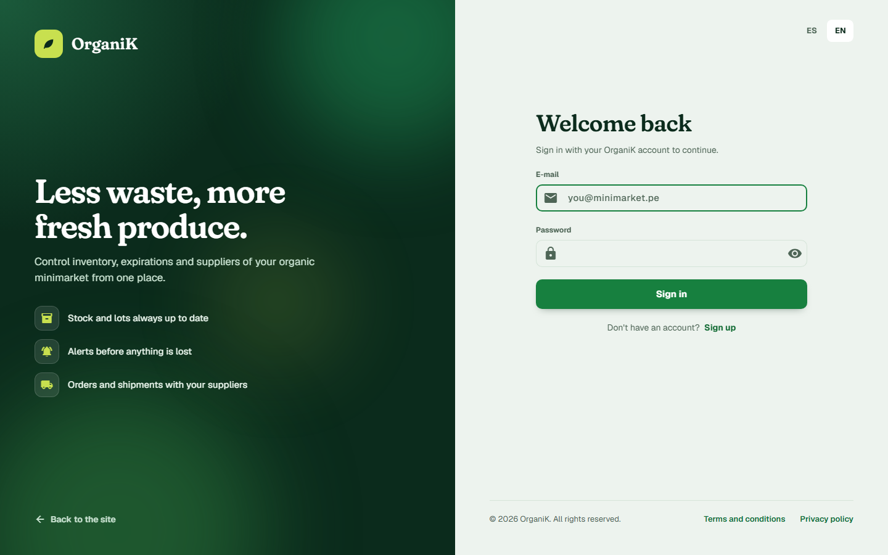

# Capítulo V: Product Implementation, Validation & Deployment

## 5.1. Software Configuration Management.

En esta sección se describen las decisiones, convenciones y principios adoptados por el equipo de **OrganiK** para garantizar la coherencia, trazabilidad y control de versiones durante el ciclo de vida del desarrollo de la solución **OrganiK**. Se establecen los lineamientos para la configuración del entorno de desarrollo, la gestión del código fuente, las convenciones de estilo y la configuración de despliegue de la landing page.

### 5.1.1. Software Development Environment Configuration.

Se especifican los productos de software utilizados durante el ciclo de vida del proyecto, organizados por disciplinas técnicas para asegurar la estandarización del entorno entre los desarrolladores de **OrganiK**.

#### Project Management

* **Trello:** Empleado para la organización visual del flujo de trabajo diario, priorización de tareas y seguimiento del avance de las secciones de la landing page.
  * **Ruta:** `https://trello.com/invite/b/6aaf94c8244f819349bf0de9/ATTI96869889ee148c22847a13480770254571767922/sprint-backlog-1-organik`

* **UXPressia:** Utilizado para la construcción de los artefactos de UX, como los User Personas, Journey Maps e Impact Maps.
  * Ruta: `https://uxpressia.com`

#### Product UX/UI Design

* **Miro:** Pizarra colaborativa utilizada para organizar ideas, flujos de usuario y estructura general.
  * Ruta: `https://miro.com`
* **Figma:** Herramienta principal para el diseño visual, definición de jerarquía de contenido, componentes UI y wireframes.
  * Ruta: `https://www.figma.com`
* **Structurizr:** Utilizado para apoyar el modelado de arquitectura mediante diagramas de alto nivel C4 Model.
  * Ruta: `https://structurizr.com`

#### Software Development

#### Software Development
* **GitHub:** Hosting del repositorio de código fuente y control de versiones.
  * Ruta: `https://github.com`
* **WebStorm:** IDE utilizado para el desarrollo de la aplicación.
  * Ruta: `https://www.jetbrains.com/webstorm/`
* **Angular 22:** Framework utilizado para construir las interfaces web de OrganiK.
  * Ruta: `https://angular.dev`
* **TypeScript:** Lenguaje principal para la implementación de componentes y lógica.
  * Ruta: `https://www.typescriptlang.org`
* **Angular Material:** Librería de componentes de interfaz web.
  * Ruta: `https://material.angular.io`
* **@ngx-translate:** Librería utilizada para la internacionalización en español e inglés.
  * Ruta: `https://github.com/ngx-translate/core`
* **HTML/CSS:** Tecnologías utilizadas para la maquetación, estructura visual y estilos responsivos.
  * Ruta: `https://developer.mozilla.org/en-US/docs/Web/HTML` and `https://developer.mozilla.org/en-US/docs/Web/CSS`

#### Software Testing
* **Vitest / Angular Test Runner:** Utilizado para validar el renderizado de secciones principales y pruebas unitarias básicas.
  * Ruta: `https://vitest.dev`

#### Database Design
* **MySQL Workbench:** Herramienta visual empleada para el modelado, diseño de diagramas y administración de la base de datos relacional.
  * Ruta: `https://www.mysql.com/products/workbench/`

#### Software Deployment
* **Firebase Hosting:** Plataforma en la nube de Google utilizada para el despliegue rápido y seguro tanto de la Landing Page estática como de la Frontend Web Application.
  * Ruta: `https://firebase.google.com`
* **Google Cloud / Firebase:** Infraestructura utilizada para el despliegue de los Backend Web Services.
  * Ruta: `https://cloud.google.com`

#### Software Documentation
* **Markdown:** Utilizado para documentar el proyecto, la configuración y decisiones técnicas.
  * Ruta: `https://www.markdownguide.org`

---

### 5.1.2. Source Code Management.

Se establecen los repositorios oficiales de la solución **OrganiK** para garantizar la integridad del código fuente.

#### Repositorios del Proyecto

<table>
  <thead>
    <tr>
      <th>Producto</th>
      <th>URL del Repositorio</th>
    </tr>
  </thead>
  <tbody>
    <tr>
      <td>Project Report OrganiK</td>
      <td><a href="https://github.com/5Bits-OrganiK/project-report.git">https://github.com/5Bits-OrganiK/project-report.git</a></td>
    </tr>
    <tr>
      <td>Landing Page OrganiK</td>
      <td><a href="https://github.com/5Bits-OrganiK/organik-landing-page-static.git">https://github.com/5Bits-OrganiK/organik-landing-page-static.git</a></td>
    </tr>
    <tr>
      <td>Frontend Web Application OrganiK</td>
      <td><a href="https://github.com/5Bits-OrganiK/organik-web-application.git">https://github.com/5Bits-OrganiK/organik-web-application.git</a></td>
    </tr>
    <tr>
      <td>Backend Web Services OrganiK</td>
      <td><a href="https://github.com/5Bits-OrganiK/organik-backend.git">https://github.com/5Bits-OrganiK/organik-backend.git</a></td>
    </tr>
  </tbody>
</table>

#### GitFlow Workflow and Collaboration Strategy

Para asegurar una colaboración organizada, evitar conflictos en el código y mantener una integración continua clara, el equipo de **OrganiK** aplica una estrategia basada en ramas para el desarrollo de la landing page.

La estrategia de colaboración se define de la siguiente manera:

- **main:** Rama que contiene la versión estable y lista para producción de la landing page. Solo recibe integraciones finales cuando los cambios han sido revisados, probados y aprobados.

- **develop:** Rama principal de integración. En esta rama se unifican las funcionalidades terminadas antes de ser promovidas a `main`.

- **feature/<section>:** Ramas temporales creadas a partir de `develop` para aislar el desarrollo de cada sección o mejora de la landing page.

  Ejemplos:
  - `feature/home-section`
  - `feature/product-information-section`
  - `feature/video-section`
  - `feature/pricing-section`
  - `feature/starter-section`

- **hotfix/<issue>:** Ramas creadas desde `main` para corregir errores críticos detectados en la versión estable de la landing page.

El flujo de trabajo establece que cada rama `feature` debe integrarse mediante **Pull Request (PR)**, permitiendo revisión de código antes de aprobar la integración.

Cada commit debe seguir la convención de **Conventional Commits**, permitiendo una trazabilidad clara de los cambios realizados en el proyecto.

Ejemplos:

- `feat(landing): build organik landing page`
- `fix(app): enable zoneless change detection`
- `fix(videos): update team embed url`
- `fix(videos): show youtube previews`
- `fix(brand): align assets with organik name`
- `refactor(app): move landing features to app root`

---

### 5.1.3. Source Code Style Guide & Conventions.

En esta sección se establecen las convenciones de estilo y nomenclatura adoptadas para los lenguajes utilizados en el proyecto **OrganiK**: HTML, CSS, TypeScript y Angular. Se aplica nomenclatura en inglés para los elementos del código, manteniendo coherencia con el dominio de la landing page y la plataforma.

#### Referencias de Guías de Estilo Adoptadas

| Lenguaje/Tecnología | Guía de Estilo |
| :--- | :--- |
| HTML/CSS | [Google HTML/CSS Style Guide](https://google.github.io/styleguide/htmlcssguide.html) |
| TypeScript | [Google TypeScript Style Guide](https://google.github.io/styleguide/tsguide.html) |
| Angular | [Angular Style Guide](https://angular.dev/style-guide) |
| Spring Boot | [Spring Boot Features](https://spring.io/projects/spring-boot) |
| Java | [Google Java Style Guide](https://google.github.io/styleguide/javaguide.html) |
| Conventional Commits | [Conventional Commits](https://www.conventionalcommits.org/) |

Se utiliza nomenclatura en inglés relacionada con las entidades del dominio de la landing page y la plataforma **OrganiK**, manteniendo nombres claros, consistentes y alineados al producto.

| Elemento | Convención | Ejemplo |
| :--- | :--- | :--- |
| Componentes Angular | PascalCase | `HomeSection`, `PricingSection` |
| Archivos de componentes | kebab-case | `home-section.ts`, `pricing-section.ts` |
| Archivos de estilos CSS | kebab-case | `home-section.css`, `pricing-section.css` |
| Variables / Métodos TS | camelCase | `currentLang`, `useLanguage()` |
| Constantes | SCREAMING_SNAKE_CASE | `DEFAULT_LOCALE`, `STARTER_EMAIL` |
| Rutas / IDs de secciones | kebab-case | `product-information`, `starter` |
| Claves de i18n | camelCase / dot.case | `home.title`, `pricing.plans.basic.name` |
| Ramas Git feature | kebab-case | `feature/home-section`, `feature/starter-section` |
| Commits | Conventional Commits | `feat(landing): build organik landing page` |

#### Sangría y Formato

* Se aplica una indentación de dos espacios para archivos web: HTML, CSS y TypeScript.
* Las llaves de apertura en TS/JS se colocan en la misma línea, siguiendo el estilo K&R.
* Los nombres de carpetas y archivos se mantienen en `kebab-case`.
* La estructura de features se organiza directamente dentro de `src/app`.

---

### 5.1.4. Software Deployment Configuration.

Se especifican los pasos y recursos de configuración de despliegue para asegurar que la plataforma **OrganiK** sea completamente accesible en sus diferentes productos.

#### Landing Page (Firebase Hosting)
1. **Preparación:** Clonación del repositorio `organik-landingpage` y configuración local.
2. **Construcción:** Ejecución del comando de compilación de Angular (`ng build`) para generar los archivos estáticos optimizados.
3. **Despliegue:** Uso del CLI de Firebase (`firebase deploy --only hosting`) para cargar el código compilado en la nube.
* **URL de producción:** https://organik-d6e58.web.app/

#### Frontend Web Application (Firebase Hosting)
1. **Preparación:** Integración de los últimos cambios de Angular en la rama `main` del repositorio `organik-frontend`.
2. **Construcción:** Configuración del archivo de entorno (variables de entorno) para apuntar al backend público, y compilación del proyecto para producción (`ng build --configuration production`).
3. **Despliegue:** Uso del CLI de Firebase (`firebase deploy --only hosting`) para cargar la plataforma interactiva en la nube.
* **URL de producción:** https://organik-app-d6e58.web.app/

---

## 5.2. Landing Page, Services & Applications Implementation.

### 5.2.1. Sprint 1

---

#### 5.2.1.1. Sprint Planning 1.

| **Sprint Planning Sprint 1** |  |
|---|---|
| **Sprint Planning Background** |  |
| Date | 05/04/2026 |
| Time | 10:00 p.m. |
| Location | Discord / WhatsApp |
| Prepared By | Albino Florencio Cáceres Pizarro |
| Attendees | Albino Florencio Cáceres Pizarro Cielo Valentina Atencio Cristobal Gustavo Alonso Olivares Lao Andre Sebastian Quispe Almonacid Alexis Calin Torres Huaman |
| **Sprint Goal & User Stories** |  |
| **Sprint 1 Goal** | Entregar la landing page de **OrganiK** para comunicar a administradores de minimarkets y proveedores la propuesta de inventario, lotes, conservación y abastecimiento. El objetivo de US00 es que un visitante sin sesión pueda recorrer Home, Product Description, Videos, Plans y Starter y encontrar un medio de contacto. |
| User Story comprometida | US00: Conocer OrganiK en la landing page (5 Story Points, según Product Backlog del capítulo III). |
| Capacidad de planificación consignada | 14 Story Points. |

  <strong>Repositorio:</strong>
  <a href="https://github.com/5Bits-OrganiK/organik-landingpage.git">
   https://github.com/5Bits-OrganiK/organik-landingpage.git
  </a>

---

#### 5.2.1.2. Aspect Leaders and Collaborators.

Esta matriz <strong>LACX</strong> identifica los aspectos principales del sprint y asigna responsabilidades de Líder (L) y Colaborador (C) para organizar al equipo durante el desarrollo de la landing page de <strong>OrganiK</strong>. 
<strong>Albino Florencio Cáceres Pizarro</strong>, como líder del equipo, supervisa y coordina los principales aspectos del desarrollo, mientras que los demás integrantes participan como colaboradores en las diferentes actividades del sprint.

<table border="1" cellpadding="4" cellspacing="0" align="center">
  <thead>
    <tr>
      <th>Team Member</th>
      <th>Student Code</th>
      <th>Aspect: UI/UX & Visual Design</th>
      <th>Aspect: Angular Structure & Components</th>
      <th>Aspect: Content & i18n</th>
      <th>Aspect: GitFlow & Deployment</th>
    </tr>
  </thead>
  <tbody>
    <tr>
      <td>Atencio Cristobal, Cielo Valentina</td>
      <td>U202424216</td>
      <td>C</td>
      <td>C</td>
      <td>C</td>
      <td>C</td>
    </tr>
    <tr>
      <td>Cáceres Pizarro, Albino Florencio</td>
      <td>U201923820</td>
      <td>L</td>
      <td>L</td>
      <td>L</td>
      <td>L</td>
    </tr>
    <tr>
      <td>Olivares Lao, Gustavo Alonso</td>
      <td>U202216448</td>
      <td>C</td>
      <td>C</td>
      <td>C</td>
      <td>C</td>
    </tr>
    <tr>
      <td>Quispe Almonacid, Andre Sebastian</td>
      <td>U201815005</td>
      <td>C</td>
      <td>C</td>
      <td>C</td>
      <td>C</td>
    </tr>
    <tr>
      <td>Torres Huaman, Alexis Calin</td>
      <td>U20241G152</td>
      <td>C</td>
      <td>C</td>
      <td>C</td>
      <td>C</td>
    </tr>
  </tbody>
</table>

---

#### 5.2.1.3. Sprint Backlog 1.

El Sprint Backlog agrupa las tareas iniciales correspondientes al diseño, desarrollo y documentación de la landing page de **OrganiK**, producto orientado a la gestión de inventario, lotes, conservación y abastecimiento de productos orgánicos para minimarkets.

Las tareas T001-T007 descomponen la historia **US00** descrita en el Product Backlog del capítulo III.

  
  
<em>Figura: Tablero del Sprint 1 en Trello, herramienta de gestión del proyecto OrganiK.</em>

| User Story Id | Componente de US00 | Task Id | Engineering Task | Description | Estimation (Hours) | Assigned To | Status |
| :--- | :--- | :--- | :--- | :--- | :--- | :--- | :--- |
| **US00** | Landing Page Base | T001 | Implementación de Home Section | Desarrollo de la sección principal de la landing page en Angular, presentando la propuesta de valor de OrganiK para minimarkets orgánicos. | 4h | Cáceres Pizarro, Albino Florencio | Done |
| **US00** | Product Information | T002 | Maquetación de descripción del producto | Implementación de la sección informativa sobre inventario, lotes, alertas de conservación, pedidos y accesos por rol. | 4h | Atencio Cristobal, Cielo Valentina | Done |
| **US00** | Videos Section | T003 | Implementación de sección de videos | Desarrollo del apartado visual para presentar al equipo y mostrar el funcionamiento general de OrganiK mediante videos embebidos. | 3h | Olivares Lao, Gustavo Alonso | Done |
| **US00** | Pricing Section | T004 | Implementación de planes | Maquetación de los planes Básico, Profesional y Empresarial, incluyendo precios, beneficios y llamadas a la acción. | 3h | Quispe Almonacid, Andre Sebastian | Done |
| **US00** | Starter Section | T005 | Implementación de sección de suscripción | Desarrollo de la sección Starter/Suscribirse con formulario para que los minimarkets interesados puedan iniciar el proceso de adopción de OrganiK. | 4h | Torres Huaman, Alexis Calin | Done |
| **US00** | Landing Page Architecture | T006 | Organización por features y estructura Angular | Refactorización de carpetas siguiendo una arquitectura organizada por features dentro de `src/app`, separando componentes, estilos, assets e internacionalización. | 5h | Cáceres Pizarro, Albino Florencio | Done |
| **US00** | GitFlow Setup | T007 | Configuración de commits y control de versiones | Organización incremental del trabajo mediante Git y commits aplicando Conventional Commits. | 3h | Cáceres Pizarro, Albino Florencio | Done |

| Criterio de aceptación de US00 (capítulo III) | Tareas relacionadas | Evidencia consignada en 5.2.1.5 |
|---|---|---|
| Presentar la propuesta para administradores y proveedores | T001, T002 | Capturas Home y Product Information |
| Permitir navegar secciones públicas sin sesión | T001, T003, T004, T005 | Capturas de Home, Videos, Plans y Starter |
| Ofrecer un medio de contacto | T005 | Captura de Starter |
| Mantener una entrega técnica reproducible | T006, T007 | Repositorio y registros de desarrollo en 5.2.1.4 |

---

#### 5.2.1.4. Development Evidence for Sprint Review.

  Durante el Sprint 1 se implementó y desplegó la primera versión de la Landing Page y se inició la Web Application de <strong>OrganiK</strong> en Angular, organizada por bounded contexts (Dashboard, Inventory, Products, Suppliers, Analytics, Communication y Shared Kernel) y capas (domain, application, infrastructure, presentation). A continuación se resumen los commits más relevantes de cada repositorio, siguiendo Conventional Commits y GitFlow; el detalle completo está en el historial de cada repositorio.

<table border="1" cellpadding="4" cellspacing="0">
  <thead>
    <tr>
      <th>Repository</th>
      <th>Branch</th>
      <th>Commit Id</th>
      <th>Commit Message</th>
      <th>Commit Message Body</th>
      <th>Committed on</th>
    </tr>
  </thead>
  <tbody>
    <tr>
      <td>5Bits-OrganiK/organik-landing-page-static</td>
      <td>main</td>
      <td><code>e23d611</code></td>
      <td>chore: initial commit</td>
      <td>Inicializa el repositorio de la Landing Page.</td>
      <td>07-10-2026</td>
    </tr>
    <tr>
      <td>5Bits-OrganiK/organik-landing-page-static</td>
      <td>feature/landing-page-html</td>
      <td><code>3ac25f6</code></td>
      <td>feat(landing-page): created the principal HTML of the landing page</td>
      <td>Estructura HTML principal de la Landing Page.</td>
      <td>07-10-2026</td>
    </tr>
    <tr>
      <td>5Bits-OrganiK/organik-landing-page-static</td>
      <td>feature/i18n-configuration</td>
      <td><code>a326659</code></td>
      <td>feat(i18n): create i18n for english and spanish translation for the landing page</td>
      <td>Traducciones al inglés y español de la Landing Page.</td>
      <td>07-10-2026</td>
    </tr>
    <tr>
      <td>5Bits-OrganiK/organik-landing-page-static</td>
      <td>feature/team-profiles-images-and-icons</td>
      <td><code>76240a9</code></td>
      <td>feat(images-and-logo): insert the team profiles images for the landing page and logo of organik</td>
      <td>Fotos de perfil del equipo y logo de OrganiK.</td>
      <td>07-10-2026</td>
    </tr>
    <tr>
      <td>5Bits-OrganiK/organik-landing-page-static</td>
      <td>feature/main-script</td>
      <td><code>8d8c10b</code></td>
      <td>feat(landing): add main script for navigation, i18n and animations</td>
      <td>Script principal de navegación, i18n y animaciones.</td>
      <td>08-10-2026</td>
    </tr>
    <tr>
      <td>5Bits-OrganiK/organik-landing-page-static</td>
      <td>feature/not-found-page</td>
      <td><code>e5ac524</code></td>
      <td>feat(landing): add custom 404 not found page</td>
      <td>Página 404 personalizada.</td>
      <td>08-10-2026</td>
    </tr>
    <tr>
      <td>5Bits-OrganiK/organik-landing-page-static</td>
      <td>feature/legal-pages</td>
      <td><code>bbadccf</code></td>
      <td>feat(landing): add privacy policy page</td>
      <td>Página de política de privacidad enlazada en el footer.</td>
      <td>09-10-2026</td>
    </tr>
    <tr>
      <td>5Bits-OrganiK/organik-landing-page-static</td>
      <td>feature/legal-pages</td>
      <td><code>0483e07</code></td>
      <td>feat(landing): add terms and conditions page</td>
      <td>Página de términos y condiciones enlazada en el footer.</td>
      <td>09-10-2026</td>
    </tr>
    <tr>
      <td>5Bits-OrganiK/organik-web-application</td>
      <td>main</td>
      <td><code>fc25963</code></td>
      <td>initial commit</td>
      <td>Inicializa el repositorio de la Web Application.</td>
      <td>08-10-2026</td>
    </tr>
    <tr>
      <td>5Bits-OrganiK/organik-web-application</td>
      <td>feature/project-configuration</td>
      <td><code>368d664</code></td>
      <td>feat(project-config): initial project configuration</td>
      <td>Configuración inicial del proyecto Angular.</td>
      <td>08-10-2026</td>
    </tr>
    <tr>
      <td>5Bits-OrganiK/organik-web-application</td>
      <td>feature/project-configuration</td>
      <td><code>2523fec</code></td>
      <td>feat(project-config): add environment files for development and production</td>
      <td>Archivos de entorno para desarrollo y producción.</td>
      <td>08-10-2026</td>
    </tr>
    <tr>
      <td>5Bits-OrganiK/organik-web-application</td>
      <td>feature/i18n</td>
      <td><code>ededd82</code></td>
      <td>feat(i18n): add i18n files for english and spanish language</td>
      <td>Archivos de internacionalización en inglés y español.</td>
      <td>08-10-2026</td>
    </tr>
    <tr>
      <td>5Bits-OrganiK/organik-web-application</td>
      <td>feature/bounded-context-dashboard</td>
      <td><code>8064466</code></td>
      <td>feat(dashboard): add application layer of the bounded context</td>
      <td>Capa de aplicación del bounded context Dashboard.</td>
      <td>08-10-2026</td>
    </tr>
    <tr>
      <td>5Bits-OrganiK/organik-web-application</td>
      <td>feature/bounded-context-dashboard</td>
      <td><code>5cc38ab</code></td>
      <td>feat(dashboard): add presentatiom layer of the bounded context</td>
      <td>Capa de presentación del bounded context Dashboard.</td>
      <td>08-10-2026</td>
    </tr>
    <tr>
      <td>5Bits-OrganiK/organik-web-application</td>
      <td>feature/inventory</td>
      <td><code>86fdf47</code></td>
      <td>feat(inventory): add application layer of the bounded context</td>
      <td>Capa de aplicación del bounded context Inventory.</td>
      <td>08-10-2026</td>
    </tr>
    <tr>
      <td>5Bits-OrganiK/organik-web-application</td>
      <td>feature/inventory</td>
      <td><code>d0955e4</code></td>
      <td>feat(inventory): add domain layer of the bounded context</td>
      <td>Capa de dominio del bounded context Inventory.</td>
      <td>08-10-2026</td>
    </tr>
    <tr>
      <td>5Bits-OrganiK/organik-web-application</td>
      <td>feature/inventory</td>
      <td><code>d46b599</code></td>
      <td>feat(inventory): add infrastructure layer of the bounded context</td>
      <td>Capa de infraestructura del bounded context Inventory.</td>
      <td>08-10-2026</td>
    </tr>
    <tr>
      <td>5Bits-OrganiK/organik-web-application</td>
      <td>feature/inventory</td>
      <td><code>dc21981</code></td>
      <td>feat(inventory): add presentation layer of the bounded context</td>
      <td>Capa de presentación del bounded context Inventory.</td>
      <td>08-10-2026</td>
    </tr>
    <tr>
      <td>5Bits-OrganiK/organik-web-application</td>
      <td>feature/products</td>
      <td><code>72ed938</code></td>
      <td>feat(products): add domain layer of the bounded context</td>
      <td>Capa de dominio del bounded context Products.</td>
      <td>08-10-2026</td>
    </tr>
    <tr>
      <td>5Bits-OrganiK/organik-web-application</td>
      <td>feature/products</td>
      <td><code>4cf657e</code></td>
      <td>feat(products): add presentation layer of the bounded context</td>
      <td>Capa de presentación del bounded context Products.</td>
      <td>08-10-2026</td>
    </tr>
    <tr>
      <td>5Bits-OrganiK/organik-web-application</td>
      <td>feature/suppliers</td>
      <td><code>acf7099</code></td>
      <td>feat(suppliers): add domain layer of the bounded context</td>
      <td>Capa de dominio del bounded context Suppliers.</td>
      <td>08-10-2026</td>
    </tr>
    <tr>
      <td>5Bits-OrganiK/organik-web-application</td>
      <td>feature/suppliers</td>
      <td><code>044dd1f</code></td>
      <td>feat(suppliers): add presentation layer of the bounded context</td>
      <td>Capa de presentación del bounded context Suppliers.</td>
      <td>08-10-2026</td>
    </tr>
    <tr>
      <td>5Bits-OrganiK/organik-web-application</td>
      <td>feature/analytics</td>
      <td><code>e790530</code></td>
      <td>feat(analytics): add application layer</td>
      <td>Capa de aplicación del bounded context Analytics.</td>
      <td>09-10-2026</td>
    </tr>
    <tr>
      <td>5Bits-OrganiK/organik-web-application</td>
      <td>feature/analytics</td>
      <td><code>ca0679d</code></td>
      <td>feat(analytics): add presentation layer</td>
      <td>Capa de presentación del bounded context Analytics.</td>
      <td>09-10-2026</td>
    </tr>
    <tr>
      <td>5Bits-OrganiK/organik-web-application</td>
      <td>feature/communication</td>
      <td><code>ddc2bd8</code></td>
      <td>feat(communication): add application layer</td>
      <td>Capa de aplicación del bounded context Communication.</td>
      <td>09-10-2026</td>
    </tr>
    <tr>
      <td>5Bits-OrganiK/organik-web-application</td>
      <td>feature/communication</td>
      <td><code>a6ea987</code></td>
      <td>feat(communication): add presentation layer</td>
      <td>Capa de presentación del bounded context Communication.</td>
      <td>09-10-2026</td>
    </tr>
    <tr>
      <td>5Bits-OrganiK/organik-web-application</td>
      <td>feature/shared</td>
      <td><code>d59262e</code></td>
      <td>feat(shared): add domain/model/domain-error.ts</td>
      <td>Shared Kernel: error de dominio base.</td>
      <td>09-10-2026</td>
    </tr>
    <tr>
      <td>5Bits-OrganiK/organik-web-application</td>
      <td>feature/shared</td>
      <td><code>bfdf471</code></td>
      <td>feat(shared): add presentation/views/prototype-flow/prototype-flow.ts</td>
      <td>Shared Kernel: vista del flujo del prototipo.</td>
      <td>09-10-2026</td>
    </tr>
  </tbody>
</table>

---

### 5.2.1.5. Execution Evidence for Sprint Review.

Durante el Sprint 1, el equipo logró implementar con éxito el diseño, maquetación y despliegue de la nueva versión de la Landing Page de **OrganiK**. A continuación, se presentan las evidencias visuales de la ejecución del producto de software, demostrando el cumplimiento de los Criterios de Aceptación de las Historias de Usuario planificadas y la correcta adaptación de la plataforma al idioma inglés.

#### Evidencia 1: Home Section y Propuesta de Valor
Se desarrolló la pantalla de inicio principal destacando la propuesta de valor de OrganiK: controlar el inventario antes de que sea tarde. El diseño presenta una interfaz oscura con un dashboard visual interactivo y componentes que ilustran el estado del stock en tiempo real.

*Figura: Vista principal de OrganiK desplegada en la Landing Page.*

#### Evidencia 2: Características del Producto (Features)
Se maquetó la sección informativa donde se presentan las principales capacidades de OrganiK mediante tarjetas UI, incluyendo inventario centralizado, control de lotes por código, alertas inteligentes y fechas de caducidad.

*Figura: Sección de características y funcionalidades principales.*

#### Evidencia 3: Módulo para Proveedores (Suppliers)
Se implementó una sección dedicada exclusivamente a los proveedores ("Reach more minimarkets"), comunicando cómo la plataforma les permite publicar su catálogo orgánico, recibir necesidades de reabastecimiento de los minimarkets y gestionar pedidos en un solo lugar.

*Figura: Sección dedicada a los proveedores de minimarkets.*

#### Evidencia 4: Demostración del Producto (Product Video)
Se integró un apartado audiovisual ("See OrganiK in action") diseñado para incrustar material de video demostrativo. Esta sección permite explicar visualmente cómo la solución centraliza los procesos operativos del minimarket.

*Figura: Sección de video demostrativo del producto.*

#### Evidencia 5: Testimonios de Usuarios (Testimonials)
Se desarrolló una sección de validación social ("What minimarkets are saying") que muestra comentarios de clientes y proveedores ficticios, destacando métricas de éxito como la reducción de desperdicios y el ahorro de tiempo semanal.

*Figura: Sección de testimonios de usuarios de OrganiK.*

#### Evidencia 6: Planes Comerciales (Pricing)
Se diseñó la vista de planes de suscripción ("A plan for every minimarket size"), presentando las alternativas Basic, Professional y Enterprise. La interfaz permite cambiar entre planes para minimarkets y proveedores mediante un selector interactivo.

*Figura: Sección de planes de suscripción disponibles.*

#### Evidencia 7: Presentación del Equipo (The Team)
Se desarrolló una sección detallada ("The people behind OrganiK") para presentar a los cinco miembros del equipo responsable del desarrollo. Cada tarjeta incluye la fotografía, nombre, código de estudiante y una cita sobre su enfoque en la construcción del producto.

*Figura: Perfiles de los miembros del equipo de OrganiK.*

#### Evidencia 8: Llamado a la Acción y Suscripción (Starter)
Se construyó la sección de cierre orientada a la conversión ("Take control of your minimarket with OrganiK"). Incluye un botón de inicio de sesión directo, un gráfico de radar temático y el pie de página con enlaces a políticas de privacidad.

*Figura: Sección final de llamado a la acción y pie de página.*

#### Evidencia 9: Web Application (Pantalla de Inicio de Sesión)
Se implementó y desplegó la pantalla de acceso de la Web Application de OrganiK ("Welcome back"), donde minimarkets y proveedores ingresan con su correo y contraseña. La vista incluye el selector de idioma (ES/EN), el enlace de registro, el acceso de regreso a la landing page y los enlaces a términos y condiciones y política de privacidad. Está disponible en https://organik-app-d6e58.web.app/login.

*Figura: Pantalla de inicio de sesión de la Web Application de OrganiK desplegada en Firebase Hosting.*

---

### 5.2.1.6. Services Documentation Evidence for Sprint Review.

Dado que el alcance del Sprint 1 se centró exclusivamente en el diseño, maquetación y despliegue de la Landing Page estática, la implementación y documentación de los servicios Backend (API RESTful) se abordarán a partir del Sprint 2. Por lo tanto, la evidencia de documentación de servicios (Swagger/OpenAPI) se incluirá en las siguientes iteraciones.

#### 5.2.1.7. Software Deployment Evidence for Sprint Review.

Durante el Sprint 1 se configuró Firebase Hosting como proveedor cloud para desplegar los dos productos de interfaz de **OrganiK**: la Landing Page (nueva versión) y la primera versión de la Web Application. Ambos proyectos se compilan con Angular y se publican con el CLI de Firebase (`firebase deploy --only hosting`), tal como se describe en la sección 5.1.4. Los Web Services (Backend) se desplegarán a partir del Sprint 2.

**Landing Page**

* **Repositorio:** https://github.com/5Bits-OrganiK/organik-landing-page-static
* **Entorno local:** http://localhost:4200/
* **URL de Producción:** https://organik-d6e58.web.app/

*Figura: Landing Page de OrganiK desplegada exitosamente en Firebase Hosting.*

**Web Application**

* **Repositorio:** https://github.com/5Bits-OrganiK/organik-web-application
* **Entorno local:** http://localhost:4200/
* **URL de Producción:** https://organik-app-d6e58.web.app/login

*Figura: Web Application de OrganiK desplegada exitosamente en Firebase Hosting.*

---

#### 5.2.1.8. Team Collaboration Insights during Sprint.

  Durante este primer sprint, el esfuerzo principal del equipo de <strong>OrganiK</strong> se centró en la estructuración del proyecto, el diseño UX/UI, la implementación de la landing page, la organización de commits mediante Conventional Commits y la documentación inicial del producto <strong>OrganiK</strong>. Por lo tanto, las evidencias de colaboración presentadas a continuación corresponden al trabajo realizado para construir la presencia digital inicial del producto.

  En primer lugar, el <strong>Historial de Commits</strong> del repositorio demuestra que el trabajo fue organizado mediante cambios incrementales y commits siguiendo la convención de <strong>Conventional Commits</strong>. Durante el sprint se realizaron cambios relacionados con la maquetación de secciones, la adaptación visual basada en referencias, la internacionalización de contenido, la corrección de videos embebidos, la alineación de marca y la refactorización de la arquitectura por features.

  
  
<em>Figura: Historial de commits demostrando el avance incremental de la landing page de OrganiK.</em>

  En segundo lugar, el gráfico de <strong>Visitors (Traffic)</strong> proporcionado por los Insights de GitHub permite evidenciar la actividad de consulta del repositorio. Las visitas y usuarios únicos reflejan que el equipo revisó recurrentemente el avance del proyecto, validando la estructura visual, el contenido de las secciones y la coherencia general de la landing page antes del despliegue.

  
  
<em>Figura: Gráfica de visitantes mostrando la revisión constante del repositorio por parte del equipo OrganiK.</em>

